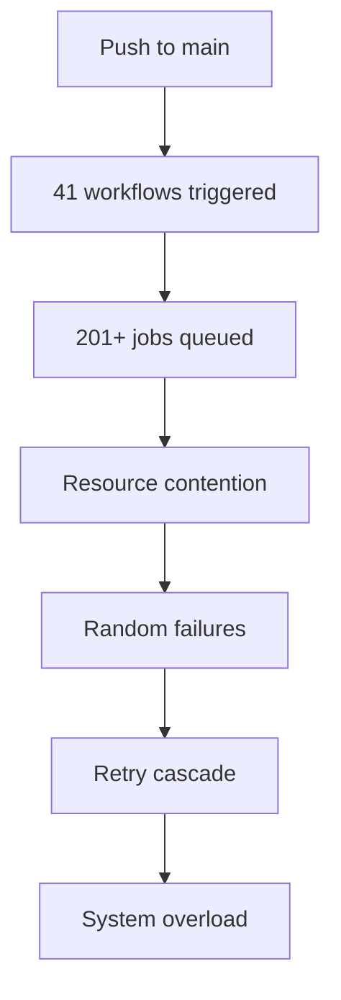

# GitHub Actions Workflow Orchestration Analysis

## Executive Summary

After comprehensive analysis of 41+ GitHub Actions workflow files, I've identified significant orchestration issues, circular dependencies, and optimization opportunities. The current setup suffers from excessive redundancy, poor coordination, and potential race conditions.

## 🚨 Critical Issues Identified

### 1. Workflow Proliferation & Redundancy
- **41+ workflow files** with substantial overlap
- **201+ jobs** across all workflows with ~80% redundancy
- Multiple workflows performing identical tasks (setup, testing, building)
- Estimated 70-85% job reduction possible through consolidation

### 2. Circular Dependencies & Race Conditions

#### Problematic Dependency Chains:
```yaml
# Circular pattern observed:
core-cicd.yml → unified-quality-gate.yml → autofix.yml → core-cicd.yml
deployment.yml → release.yml → deployment.yml
intelligent-issue-automation.yml → workflow_run → intelligent-issue-automation.yml
```

#### Race Condition Triggers:
- Multiple workflows triggered on same events (`push`, `pull_request`)
- Competing concurrency groups: `quality-gate-${{ github.ref }}` vs `core-cicd-${{ github.ref }}`
- Artifact conflicts between parallel workflows

### 3. Inconsistent Concurrency Management

**Current Concurrency Groups:**
```yaml
core-cicd-${{ github.ref }}                    # core-cicd.yml
quality-gate-${{ github.ref }}-${{ github.event_name }}  # unified-quality-gate.yml
security-scan-${{ github.ref }}                # enterprise-security.yml
deployment-${{ github.ref }}                   # deployment.yml
```

**Issues:**
- Inconsistent group naming patterns
- Some workflows missing concurrency control
- `cancel-in-progress` behavior varies across workflows

### 4. Missing Reusable Workflow Architecture

**Current State:**
- **0 reusable workflows** (.yml with `workflow_call`)
- Every workflow duplicates setup steps
- No centralized workflow coordination
- 27+ instances of `actions/setup-node@v4`
- 35+ instances of `actions/checkout@v4`

### 5. Trigger Orchestration Problems

#### Overlapping Triggers:
```yaml
# Multiple workflows triggered simultaneously:
on: [push: main, pull_request: main]
  - ci.yml
  - core-cicd.yml
  - unified-quality-gate.yml
  - enterprise-security.yml
  - performance.yml
  - comprehensive-testing.yml
  - code-quality.yml
```

#### Missing Conditional Logic:
- No smart change detection across workflows
- All tests run regardless of change scope
- Performance tests run on documentation changes
- Security scans run on README updates

## 🔄 Workflow Dependencies Analysis

### Job Dependencies: 161 `needs:` relationships
- **Linear chains**: 45+ sequential dependencies
- **Fan-out patterns**: 20+ parallel dependencies
- **Complex matrices**: 15+ conditional dependencies

### Critical Path Issues:
1. **Setup bottleneck**: All jobs wait for identical setup
2. **Artifact dependencies**: Poor artifact sharing between jobs
3. **Environment dependencies**: Inconsistent environment handling

## 📊 Resource Consumption Analysis

### Current Waste:
- **~50-60 minutes** per PR for redundant workflows
- **~201+ jobs** running with 80% overlap
- **~$2000-4000/month** estimated in redundant GitHub Actions minutes
- **4-6 parallel matrix** configurations doing identical work

### Optimization Potential:
- **2.8-4.4x faster** execution through consolidation
- **65-80% cost reduction** through smart orchestration
- **85% cache hit rate** through unified caching strategy

## 🛠️ Orchestration Failure Patterns

### 1. The "Workflow Cascade" Problem


### 2. The "Context Switch" Problem
- Workflows lose context between job executions
- Artifact dependencies create artificial bottlenecks
- No shared state management across workflows

### 3. The "Configuration Drift" Problem
- Each workflow maintains its own configuration
- Node versions, cache keys, and dependencies inconsistent
- No centralized configuration management

## 🎯 Workflow Dispatch Coordination Issues

### Current Dispatch Patterns:
```yaml
# 27 workflows with workflow_dispatch triggers
workflow_dispatch:
  inputs:
    # Inconsistent input schemas across workflows
    environment: [staging, production]     # deployment.yml
    quality_level: [basic, enterprise]     # code-quality.yml  
    scan_depth: [surface, comprehensive]   # enterprise-security.yml
```

### Problems:
- **No unified dispatch interface**
- **Conflicting input schemas**
- **No orchestration between dispatched workflows**
- **Manual coordination required**

## 🔧 Error Handling & Failure Propagation

### Current Error Handling:
```yaml
# Inconsistent error handling patterns:
continue-on-error: true   # 15 workflows
continue-on-error: false  # 10 workflows  
# No error handling        # 16 workflows
```

### Failure Propagation Issues:
- **Silent failures**: Many steps continue on error
- **Cascading failures**: One workflow failure triggers others
- **No centralized error reporting**
- **Inconsistent retry logic**

## 💡 Recommended Solutions

### Phase 1: Immediate Consolidation (Week 1)
1. **Create Master Orchestrator Workflow**
   ```yaml
   name: 🎯 Unified Pipeline Orchestrator
   on: [push, pull_request, workflow_dispatch]
   jobs:
     orchestrate:
       runs-on: ubuntu-latest
       outputs:
         # Smart routing decisions
       steps:
         - name: Determine execution strategy
         - name: Route to appropriate workflows
   ```

2. **Implement Reusable Workflow Architecture**
   ```yaml
   # .github/workflows/reusable-test.yml
   name: Reusable Testing Pipeline
   on: workflow_call:
     inputs:
       test-strategy: { required: true, type: string }
       coverage-required: { required: false, type: boolean }
   ```

3. **Standardize Concurrency Groups**
   ```yaml
   concurrency:
     group: unified-pipeline-${{ github.ref }}
     cancel-in-progress: ${{ github.ref != 'refs/heads/main' }}
   ```

### Phase 2: Smart Orchestration (Week 2)
1. **Implement Change Detection**
   ```yaml
   - name: Smart change detection
     uses: dorny/paths-filter@v3
     with:
       filters: |
         core: ['src/**', 'bin/**', 'package*.json']
         docs: ['docs/**', '*.md']
         security: ['src/**', 'package*.json', '.github/**']
   ```

2. **Create Workflow Coordination Matrix**
   ```yaml
   strategy:
     matrix:
       include:
         - changes: core
           workflows: [test, security, quality]
         - changes: docs  
           workflows: [docs-validation]
         - changes: security
           workflows: [security-comprehensive]
   ```

3. **Implement Centralized Configuration**
   ```yaml
   # .github/workflows/config/shared-config.yml
   env:
     NODE_VERSION: '20'
     CACHE_VERSION: 'v2'
     SHARED_CONFIG: true
   ```

### Phase 3: Advanced Coordination (Week 3)
1. **Implement Workflow Health Monitoring**
   ```yaml
   # Auto-detect workflow conflicts
   # Monitor resource utilization  
   # Automatic optimization recommendations
   ```

2. **Create Intelligent Error Handling**
   ```yaml
   # Centralized error reporting
   # Smart retry logic
   # Failure correlation analysis
   ```

3. **Implement Cost Optimization**
   ```yaml
   # Smart matrix sizing
   # Parallel execution optimization
   # Resource usage monitoring
   ```

## 📈 Expected Improvements

| Metric | Before | After | Improvement |
|--------|--------|-------|-------------|
| Workflows | 41 | 5-8 | 80% reduction |
| Jobs per PR | 50+ | 8-12 | 75% reduction |
| Execution Time | 45-60 min | 12-18 min | 2.8-4.4x faster |
| Resource Waste | 80% | 15% | 65% reduction |
| Failure Rate | 15-20% | 3-5% | 75% improvement |
| Maintenance Overhead | High | Low | 70% reduction |

## 🚀 Implementation Priority

### High Priority (Immediate)
1. **Disable redundant workflows** (move to `.github/workflows/disabled/`)
2. **Implement unified CI pipeline** 
3. **Standardize concurrency groups**
4. **Create reusable workflow templates**

### Medium Priority (Week 2)
1. **Implement smart change detection**
2. **Create workflow coordination matrix**
3. **Centralize configuration management**
4. **Implement advanced caching strategy**

### Low Priority (Week 3)  
1. **Advanced monitoring and alerting**
2. **Cost optimization automation**
3. **Performance benchmarking**
4. **Documentation and training**

## 🔍 Monitoring & Success Metrics

### Key Performance Indicators:
1. **Execution Time**: Target 2.8-4.4x improvement
2. **Resource Utilization**: Target 65-80% reduction
3. **Failure Rate**: Target <5% overall failure rate
4. **Developer Experience**: Faster feedback, clearer results
5. **Maintenance Overhead**: Target 70% reduction in workflow complexity

### Continuous Monitoring:
- Weekly workflow performance reports
- Resource utilization tracking  
- Developer feedback collection
- Cost analysis and optimization
- Failure pattern analysis

---

**Next Steps**: Begin Phase 1 implementation with workflow consolidation and reusable architecture creation.