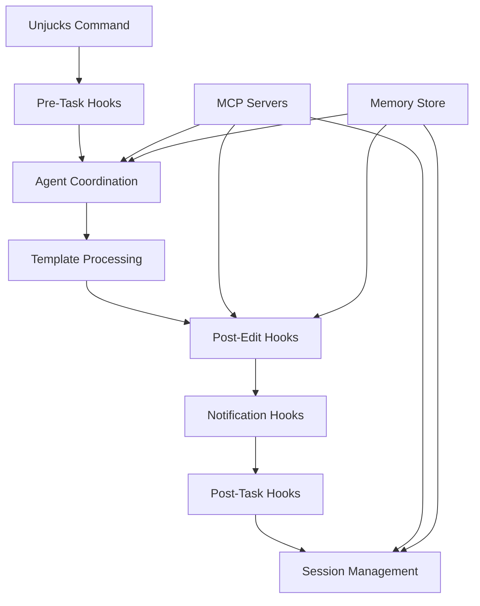

# Hooks System API Reference

## Overview

Unjucks provides a comprehensive hooks system for automation, coordination, and extensibility. Hooks enable seamless integration with MCP servers, agent coordination, performance monitoring, and custom workflow automation.

## Architecture



## Hook Categories

### 1. Task Lifecycle Hooks

#### Pre-Task Hooks
Execute before task starts to prepare environment and resources.

**Hook Function:** `npx claude-flow@alpha hooks pre-task`

**Parameters:**
```bash
--description <string>    # Task description (required)
--task-id <string>       # Custom task ID (optional)
--priority <level>       # Task priority: low|medium|high|critical (default: medium)
--agent-type <type>      # Preferred agent type (optional)
--memory-namespace <ns>  # Memory namespace for task context (optional)
--session-id <id>        # Session ID for context restoration (optional)
```

**Usage Examples:**
```bash
# Basic pre-task setup
npx claude-flow@alpha hooks pre-task --description "Generate React components"

# Advanced setup with agent preference
npx claude-flow@alpha hooks pre-task \
  --description "API development and testing" \
  --priority high \
  --agent-type backend-dev \
  --memory-namespace api-project

# Session-aware setup
npx claude-flow@alpha hooks pre-task \
  --description "Continue semantic analysis" \
  --session-id semantic-project-1 \
  --memory-namespace semantic-workspace
```

**Automated Actions:**
- Create task ID and memory namespace
- Initialize agent coordination context
- Prepare resource allocation
- Set up session restoration points
- Configure performance monitoring

#### Post-Task Hooks
Execute after task completion for cleanup and result processing.

**Hook Function:** `npx claude-flow@alpha hooks post-task`

**Parameters:**
```bash
--task-id <string>       # Task ID (required)
--success <boolean>      # Task success status (default: true)
--export-metrics         # Export performance metrics (flag)
--cleanup-temp          # Clean up temporary files (flag) 
--persist-context       # Persist task context for reuse (flag)
--notify-completion     # Send completion notifications (flag)
```

**Usage Examples:**
```bash
# Basic task completion
npx claude-flow@alpha hooks post-task --task-id task-123456789

# Failed task with cleanup
npx claude-flow@alpha hooks post-task \
  --task-id task-123456789 \
  --success false \
  --cleanup-temp \
  --export-metrics

# Successful task with context preservation
npx claude-flow@alpha hooks post-task \
  --task-id task-123456789 \
  --success true \
  --persist-context \
  --export-metrics \
  --notify-completion
```

### 2. File Operation Hooks

#### Post-Edit Hooks
Execute after file modifications to update indexes and coordination.

**Hook Function:** `npx claude-flow@alpha hooks post-edit`

**Parameters:**
```bash
--file <path>            # Modified file path (required)
--operation <type>       # Operation type: create|update|delete (default: update)
--memory-key <key>       # Memory key for storing edit context (optional)
--validate              # Validate file after edit (flag)
--index-update          # Update search indexes (flag)
--notify-agents         # Notify relevant agents (flag)
--backup               # Create backup before edit (flag)
```

**Usage Examples:**
```bash
# Basic file edit notification
npx claude-flow@alpha hooks post-edit --file src/components/Button.tsx

# Comprehensive edit processing
npx claude-flow@alpha hooks post-edit \
  --file src/api/users.ts \
  --operation create \
  --memory-key swarm/backend-dev/api-endpoint \
  --validate \
  --index-update \
  --notify-agents

# Delete operation with cleanup
npx claude-flow@alpha hooks post-edit \
  --file legacy/old-component.tsx \
  --operation delete \
  --cleanup-references
```

**Automated Actions:**
- Update file indexes and metadata
- Validate file syntax and semantics
- Store edit context in memory
- Notify coordinated agents
- Update project dependency graphs

#### Pre-Edit Hooks
Execute before file modifications for validation and backup.

**Hook Function:** `npx claude-flow@alpha hooks pre-edit`

**Parameters:**
```bash
--file <path>            # File to be modified (required)
--operation <type>       # Planned operation: create|update|delete
--backup                # Create backup before edit (flag)
--validate-permissions  # Check file permissions (flag)
--check-conflicts       # Check for potential conflicts (flag)
```

### 3. Agent Coordination Hooks

#### Agent Assignment Hooks
Automatically assign optimal agents based on file types and task context.

**Hook Function:** `npx claude-flow@alpha hooks assign-agent`

**Parameters:**
```bash
--file <path>           # File path for analysis (optional)
--task <description>    # Task description (optional)
--agent-types <types>   # Preferred agent types (comma-separated)
--capabilities <caps>   # Required capabilities (comma-separated)
--auto-spawn           # Auto-spawn agents if needed (flag)
```

**Usage Examples:**
```bash
# Automatic agent assignment for TypeScript file
npx claude-flow@alpha hooks assign-agent --file src/utils/helpers.ts

# Task-based agent assignment
npx claude-flow@alpha hooks assign-agent \
  --task "Implement authentication middleware" \
  --agent-types backend-dev,security-auditor \
  --capabilities "node.js,express,jwt,security"

# Auto-spawn missing agents
npx claude-flow@alpha hooks assign-agent \
  --file src/components/Chart.vue \
  --auto-spawn
```

#### Agent Notification Hooks
Notify agents about relevant changes and updates.

**Hook Function:** `npx claude-flow@alpha hooks notify`

**Parameters:**
```bash
--message <text>        # Notification message (required)
--agents <list>         # Target agents (comma-separated, optional - broadcasts if omitted)
--priority <level>      # Message priority: low|medium|high|urgent (default: medium)
--channel <type>        # Notification channel: memory|webhook|direct (default: memory)
--context <data>        # Additional context data (JSON string)
```

**Usage Examples:**
```bash
# Broadcast notification
npx claude-flow@alpha hooks notify --message "Database schema updated"

# Targeted notification
npx claude-flow@alpha hooks notify \
  --message "API endpoint requires testing" \
  --agents tester,qa-analyst \
  --priority high

# Notification with context
npx claude-flow@alpha hooks notify \
  --message "Component refactored" \
  --agents reviewer,documenter \
  --context '{"file":"Button.tsx","changes":["props","styling"]}'
```

### 4. Session Management Hooks

#### Session Restore Hooks
Restore previous session context and state.

**Hook Function:** `npx claude-flow@alpha hooks session-restore`

**Parameters:**
```bash
--session-id <id>       # Session ID to restore (required)
--restore-memory       # Restore memory state (flag)
--restore-agents       # Restore agent assignments (flag)
--restore-metrics      # Restore performance metrics (flag)
--partial              # Allow partial restoration (flag)
```

**Usage Examples:**
```bash
# Full session restoration
npx claude-flow@alpha hooks session-restore \
  --session-id swarm-project-1 \
  --restore-memory \
  --restore-agents \
  --restore-metrics

# Partial restoration
npx claude-flow@alpha hooks session-restore \
  --session-id semantic-analysis-2 \
  --restore-memory \
  --partial
```

#### Session End Hooks
Finalize session and export results.

**Hook Function:** `npx claude-flow@alpha hooks session-end`

**Parameters:**
```bash
--session-id <id>       # Session ID (optional - uses current if omitted)
--export-metrics       # Export performance metrics (flag)
--export-memory        # Export memory contents (flag)
--export-logs          # Export debug logs (flag)
--cleanup              # Clean up temporary resources (flag)
--archive              # Archive session data (flag)
```

### 5. Performance Monitoring Hooks

#### Metrics Collection Hooks
Collect and store performance metrics.

**Hook Function:** `npx claude-flow@alpha hooks metrics-collect`

**Parameters:**
```bash
--metric-type <type>    # Metric type: cpu|memory|disk|network|custom
--value <number>        # Metric value (required)
--timestamp <iso>       # Timestamp (optional - uses current)
--tags <key:value>      # Metric tags (comma-separated key:value pairs)
--namespace <ns>        # Metrics namespace (optional)
```

**Usage Examples:**
```bash
# Collect CPU usage
npx claude-flow@alpha hooks metrics-collect \
  --metric-type cpu \
  --value 65.5 \
  --tags "host:server1,process:unjucks"

# Custom metric
npx claude-flow@alpha hooks metrics-collect \
  --metric-type custom \
  --value 142 \
  --tags "metric:templates-generated,generator:component" \
  --namespace project-stats
```

#### Alert Hooks
Trigger alerts based on performance thresholds.

**Hook Function:** `npx claude-flow@alpha hooks alert`

**Parameters:**
```bash
--alert-type <type>     # Alert type: performance|error|resource|custom
--severity <level>      # Alert severity: low|medium|high|critical
--message <text>        # Alert message (required)
--metric <name>         # Related metric name (optional)
--threshold <value>     # Threshold that was exceeded (optional)
--actions <list>        # Suggested actions (comma-separated)
```

## Advanced Hook Configurations

### Automated Hook Integration

Unjucks can automatically execute hooks based on operations and file patterns:

```typescript
// unjucks.config.ts - Hook automation configuration
export default defineConfig({
  hooks: {
    enabled: true,
    
    // Automatic hook execution
    automation: {
      // Pre-task hooks
      preTask: {
        enabled: true,
        defaultPriority: 'medium',
        autoAssignAgents: true,
        memoryNamespace: 'auto' // auto-generate based on task
      },
      
      // Post-edit hooks  
      postEdit: {
        enabled: true,
        validateFiles: true,
        updateIndexes: true,
        notifyAgents: true,
        backupFiles: false
      },
      
      // Post-task hooks
      postTask: {
        enabled: true,
        exportMetrics: true,
        cleanupTemp: true,
        persistContext: true,
        notifyCompletion: false
      }
    },
    
    // File-based hook triggers
    triggers: {
      '**/*.ts': ['validate', 'type-check', 'notify:tester'],
      '**/*.tsx': ['validate', 'lint', 'notify:reviewer'],
      '**/*.test.*': ['notify:tester', 'coverage-update'],
      '**/package.json': ['dependency-check', 'security-scan'],
      '**/*.ttl': ['semantic-validate', 'notify:semantic-analyst']
    },
    
    // Agent assignment rules
    agentAssignment: {
      '**/*.ts': ['coder', 'reviewer'],
      '**/*.test.*': ['tester', 'qa-analyst'],
      '**/*.md': ['documenter', 'technical-writer'],
      '**/*.yml': ['devops-engineer', 'security-auditor'],
      '**/*.sql': ['database-architect', 'performance-analyst']
    },
    
    // Performance monitoring
    monitoring: {
      enabled: true,
      collectMetrics: ['cpu', 'memory', 'disk', 'network'],
      alertThresholds: {
        cpu: 80,
        memory: 85,
        executionTime: 30000, // 30 seconds
        errorRate: 0.05 // 5%
      }
    }
  }
});
```

### Custom Hook Scripts

Create custom hook scripts for specialized workflows:

```bash
#!/bin/bash
# custom-hooks/pre-api-development.sh

echo "🚀 Starting API Development Workflow"

# Initialize semantic validation
npx claude-flow@alpha hooks pre-task \
  --description "API development with semantic validation" \
  --priority high \
  --agent-type backend-dev \
  --memory-namespace api-development

# Load API schema for validation
if [ -f "api-schema.yml" ]; then
  echo "📋 Loading API schema for validation"
  npx claude-flow@alpha hooks load-schema --file api-schema.yml
fi

# Assign specialized agents
npx claude-flow@alpha hooks assign-agent \
  --task "API development with OpenAPI spec" \
  --agent-types backend-dev,api-documenter,security-auditor \
  --auto-spawn

echo "✅ API development environment ready"
```

```javascript
// custom-hooks/post-component-generation.js
const { execSync } = require('child_process');

// Post-component generation hook
async function postComponentGeneration(filePath, options = {}) {
  console.log(`📦 Processing generated component: ${filePath}`);
  
  try {
    // Validate component syntax
    execSync(`npx claude-flow@alpha hooks post-edit --file "${filePath}" --validate`);
    
    // Update component index
    if (filePath.includes('/components/')) {
      execSync('npm run update-component-index');
    }
    
    // Notify relevant agents
    execSync(`npx claude-flow@alpha hooks notify --message "New component generated: ${filePath}" --agents reviewer,tester,documenter`);
    
    // Generate tests if enabled
    if (options.generateTests) {
      const testFile = filePath.replace('.tsx', '.test.tsx');
      execSync(`unjucks generate test react --component-file "${filePath}" --output "${testFile}"`);
    }
    
    console.log('✅ Component processing complete');
    
  } catch (error) {
    console.error('❌ Component processing failed:', error.message);
    process.exit(1);
  }
}

module.exports = { postComponentGeneration };
```

### Memory Integration Hooks

Hooks that integrate with the swarm memory system for context sharing:

```bash
# Store template generation context in memory
npx claude-flow@alpha hooks memory-store \
  --key "swarm/component/Button/context" \
  --value '{"type":"component","framework":"react","features":["typescript","tests","stories"]}' \
  --ttl 3600

# Retrieve context from memory
npx claude-flow@alpha hooks memory-retrieve \
  --key "swarm/component/Button/context" \
  --format json

# Search memory for related context
npx claude-flow@alpha hooks memory-search \
  --pattern "swarm/*/context" \
  --limit 10
```

### Webhook Integration

Configure webhooks for external system integration:

```typescript
// unjucks.config.ts - Webhook hooks configuration
export default defineConfig({
  hooks: {
    webhooks: {
      enabled: true,
      
      endpoints: {
        slack: {
          url: process.env.SLACK_WEBHOOK_URL,
          events: ['task:completed', 'error:occurred', 'alert:triggered'],
          format: 'slack'
        },
        
        discord: {
          url: process.env.DISCORD_WEBHOOK_URL,
          events: ['task:started', 'task:completed'],
          format: 'discord'
        },
        
        github: {
          url: `https://api.github.com/repos/${process.env.GITHUB_REPO}/dispatches`,
          events: ['deployment:ready'],
          headers: {
            'Authorization': `token ${process.env.GITHUB_TOKEN}`,
            'Accept': 'application/vnd.github.v3+json'
          }
        },
        
        monitoring: {
          url: process.env.MONITORING_WEBHOOK_URL,
          events: ['metrics:collected', 'alert:triggered'],
          format: 'json',
          timeout: 5000,
          retries: 3
        }
      }
    }
  }
});
```

### Hook Debugging and Monitoring

Debug and monitor hook execution:

```bash
# Enable hook debugging
export UNJUCKS_DEBUG_HOOKS=true

# Monitor hook execution in real-time
npx claude-flow@alpha hooks monitor --real-time

# View hook execution history
npx claude-flow@alpha hooks history --limit 50

# Analyze hook performance
npx claude-flow@alpha hooks analyze --metric execution-time --period 24h

# Test hook execution
npx claude-flow@alpha hooks test \
  --hook pre-task \
  --params '{"description":"Test task","priority":"medium"}' \
  --dry-run
```

### Error Handling and Recovery

Hooks include comprehensive error handling and recovery mechanisms:

```bash
# Hook with error handling
npx claude-flow@alpha hooks post-edit \
  --file src/broken-component.tsx \
  --validate \
  --on-error retry:3 \
  --fallback-action notify:admin

# Recovery from failed hooks
npx claude-flow@alpha hooks recover \
  --session-id failed-session-123 \
  --strategy partial-restore

# Hook health check
npx claude-flow@alpha hooks health-check \
  --check-memory \
  --check-agents \
  --check-connections
```

This hooks system provides enterprise-grade automation and coordination capabilities that seamlessly integrate with the MCP ecosystem and enable sophisticated workflow orchestration.