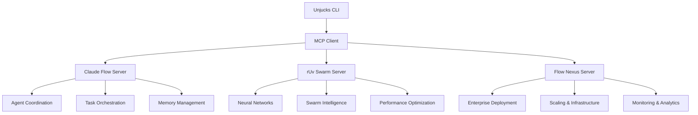

# MCP Integration API Reference

## Overview

Unjucks integrates with three powerful MCP (Model Context Protocol) servers that provide advanced coordination, swarm intelligence, and neural processing capabilities:

1. **Claude Flow** - Core coordination and agent management
2. **rUv Swarm** - Neural processing and swarm intelligence  
3. **Flow Nexus** - Enterprise deployment and scaling

## Architecture



## Claude Flow MCP Integration

### Connection Setup

```typescript
// Add Claude Flow MCP server
claude mcp add claude-flow npx claude-flow@alpha mcp start
```

### Core APIs

#### Swarm Initialization
Initialize coordination topology for agent collaboration.

**Function:** `mcp__claude-flow__swarm_init`

**Parameters:**
```typescript
{
  topology: "hierarchical" | "mesh" | "ring" | "star";
  maxAgents?: number; // default: 8
  strategy?: "balanced" | "specialized" | "adaptive"; // default: "auto"
}
```

**Response:**
```typescript
{
  swarmId: string;
  topology: string;
  maxAgents: number;
  status: "initialized" | "error";
  agents: Agent[];
}
```

**Example:**
```bash
unjucks swarm init --topology mesh --max-agents 10 --strategy adaptive
```

#### Agent Management

**Spawn Agent:** `mcp__claude-flow__agent_spawn`
```typescript
{
  type: "coordinator" | "researcher" | "coder" | "tester" | "reviewer" | 
        "analyst" | "optimizer" | "documenter" | "monitor" | "specialist" |
        "architect" | "task-orchestrator" | "code-analyzer" | "perf-analyzer";
  capabilities?: string[];
  name?: string;
  swarmId?: string;
}
```

**List Agents:** `mcp__claude-flow__agent_list`
```typescript
{
  swarmId?: string;
}
```

**Agent Metrics:** `mcp__claude-flow__agent_metrics`  
```typescript
{
  agentId?: string;
}
```

#### Task Orchestration

**Orchestrate Task:** `mcp__claude-flow__task_orchestrate`
```typescript
{
  task: string;
  dependencies?: string[];
  priority?: "low" | "medium" | "high" | "critical";
  strategy?: "parallel" | "sequential" | "adaptive" | "balanced";
}
```

**Task Status:** `mcp__claude-flow__task_status`
```typescript
{
  taskId: string;
}
```

**Task Results:** `mcp__claude-flow__task_results`
```typescript
{
  taskId: string;
}
```

#### Memory and State Management

**Memory Usage:** `mcp__claude-flow__memory_usage`
```typescript
{
  action: "store" | "retrieve" | "list" | "delete" | "search";
  key?: string;
  value?: string;
  namespace?: string; // default: "default"
  ttl?: number; // time-to-live in seconds
}
```

**Memory Search:** `mcp__claude-flow__memory_search`
```typescript
{
  pattern: string;
  namespace?: string;
  limit?: number; // default: 10
}
```

#### Neural Processing

**Neural Status:** `mcp__claude-flow__neural_status`
```typescript
{
  modelId?: string;
}
```

**Neural Training:** `mcp__claude-flow__neural_train`
```typescript
{
  pattern_type: "coordination" | "optimization" | "prediction";
  training_data: string;
  epochs?: number; // default: 50
}
```

**Neural Prediction:** `mcp__claude-flow__neural_predict`
```typescript
{
  modelId: string;
  input: string | any[];
}
```

#### Performance and Monitoring

**Performance Report:** `mcp__claude-flow__performance_report`
```typescript
{
  format?: "summary" | "detailed" | "json"; // default: "summary"
  timeframe?: "24h" | "7d" | "30d"; // default: "24h"
}
```

**Health Check:** `mcp__claude-flow__health_check`
```typescript
{
  components?: string[];
}
```

**Benchmarks:** `mcp__claude-flow__benchmark_run`
```typescript
{
  suite?: string;
}
```

### GitHub Integration

**Repository Analysis:** `mcp__claude-flow__github_repo_analyze`
```typescript
{
  repo: string; // format: "owner/repo"
  analysis_type?: "code_quality" | "performance" | "security";
}
```

**Pull Request Management:** `mcp__claude-flow__github_pr_manage`
```typescript
{
  repo: string;
  action: "review" | "merge" | "close";
  pr_number?: number;
}
```

## rUv Swarm MCP Integration

### Neural Network Operations

#### Swarm Initialization
**Function:** `mcp__ruv-swarm__swarm_init`

```typescript
{
  topology: "mesh" | "hierarchical" | "ring" | "star";
  maxAgents?: number; // default: 5, max: 100
  strategy?: "balanced" | "specialized" | "adaptive"; // default: "balanced"
}
```

#### Neural Training
**Function:** `mcp__ruv-swarm__neural_train`

```typescript
{
  agentId?: string; // specific agent to train
  iterations?: number; // default: 10, max: 100
}
```

#### Decentralized Autonomous Agents (DAA)

**Initialize DAA:** `mcp__ruv-swarm__daa_init`
```typescript
{
  persistenceMode?: "auto" | "memory" | "disk";
  enableCoordination?: boolean;
  enableLearning?: boolean;
}
```

**Create DAA Agent:** `mcp__ruv-swarm__daa_agent_create`
```typescript
{
  id: string;
  capabilities?: string[];
  cognitivePattern?: "convergent" | "divergent" | "lateral" | "systems" | "critical" | "adaptive";
  enableMemory?: boolean;
  learningRate?: number; // 0-1
}
```

**DAA Workflow:** `mcp__ruv-swarm__daa_workflow_create`
```typescript
{
  id: string;
  name: string;
  steps?: any[];
  dependencies?: object;
  strategy?: "parallel" | "sequential" | "adaptive";
}
```

#### Performance Benchmarks

**Benchmark Execution:** `mcp__ruv-swarm__benchmark_run`
```typescript
{
  type?: "all" | "wasm" | "swarm" | "agent" | "task"; // default: "all"
  iterations?: number; // default: 10, max: 100
}
```

**Memory Analytics:** `mcp__ruv-swarm__memory_usage`
```typescript
{
  detail?: "summary" | "detailed" | "by-agent"; // default: "summary"
}
```

### Neural Patterns and Cognitive Processing

**Neural Patterns:** `mcp__ruv-swarm__neural_patterns`
```typescript
{
  pattern?: "all" | "convergent" | "divergent" | "lateral" | "systems" | "critical" | "abstract";
}
```

**Cognitive Analysis:** `mcp__ruv-swarm__daa_cognitive_pattern`
```typescript
{
  agent_id?: string;
  agentId?: string; // legacy support
  action?: "analyze" | "change";
  pattern?: "convergent" | "divergent" | "lateral" | "systems" | "critical" | "adaptive";
  analyze?: boolean;
}
```

**Meta-Learning:** `mcp__ruv-swarm__daa_meta_learning`
```typescript
{
  sourceDomain?: string;
  targetDomain?: string;
  transferMode?: "adaptive" | "direct" | "gradual";
  agentIds?: string[];
}
```

## Flow Nexus MCP Integration

### Enterprise Deployment

#### Swarm Operations
**Initialize Enterprise Swarm:** `mcp__flow-nexus__swarm_init`

```typescript
{
  topology: "hierarchical" | "mesh" | "ring" | "star";
  maxAgents?: number; // default: 8, max: 100
  strategy?: "balanced" | "specialized" | "adaptive";
}
```

**Scale Swarm:** `mcp__flow-nexus__swarm_scale`
```typescript
{
  swarm_id?: string;
  target_agents: number; // 1-100
}
```

**Swarm Templates:** `mcp__flow-nexus__swarm_templates_list`
```typescript
{
  category?: "quickstart" | "specialized" | "enterprise" | "custom" | "all";
  includeStore?: boolean; // default: true
}
```

### Neural Network Infrastructure

#### Distributed Training
**Neural Training:** `mcp__flow-nexus__neural_train`

```typescript
{
  config: {
    architecture?: {
      type: "feedforward" | "lstm" | "gan" | "autoencoder" | "transformer";
      layers?: object[];
    };
    training?: {
      epochs?: number;
      batch_size?: number;
      learning_rate?: number;
      optimizer?: string;
    };
    divergent?: {
      enabled?: boolean;
      pattern?: "lateral" | "quantum" | "chaotic" | "associative" | "evolutionary";
      factor?: number;
    };
  };
  tier?: "nano" | "mini" | "small" | "medium" | "large";
  user_id?: string;
}
```

**Neural Prediction:** `mcp__flow-nexus__neural_predict`
```typescript
{
  model_id: string;
  input: any[];
  user_id?: string;
}
```

#### Distributed Neural Clusters
**Initialize Cluster:** `mcp__flow-nexus__neural_cluster_init`

```typescript
{
  name: string;
  topology?: "mesh" | "ring" | "star" | "hierarchical"; // default: "mesh"
  architecture?: "transformer" | "cnn" | "rnn" | "gnn" | "hybrid"; // default: "transformer"
  daaEnabled?: boolean; // default: true
  consensus?: "proof-of-learning" | "byzantine" | "raft" | "gossip";
  wasmOptimization?: boolean; // default: true
}
```

**Deploy Neural Node:** `mcp__flow-nexus__neural_node_deploy`
```typescript
{
  cluster_id: string;
  node_type?: "worker" | "parameter_server" | "aggregator" | "validator";
  model?: "base" | "large" | "xl" | "custom";
  capabilities?: string[];
  autonomy?: number; // 0-1, default: 0.8
  template?: string; // default: "nodejs"
  layers?: any[];
}
```

**Distributed Training:** `mcp__flow-nexus__neural_train_distributed`
```typescript
{
  cluster_id: string;
  dataset: string;
  epochs?: number; // 1-1000, default: 10
  batch_size?: number; // 1-512, default: 32
  learning_rate?: number; // 0.00001-1, default: 0.001
  optimizer?: "adam" | "sgd" | "rmsprop" | "adagrad";
  federated?: boolean; // default: false
}
```

### Sandbox Management

#### Sandbox Operations
**Create Sandbox:** `mcp__flow-nexus__sandbox_create`

```typescript
{
  template: "node" | "python" | "react" | "nextjs" | "vanilla" | "base" | "claude-code";
  name?: string;
  timeout?: number; // default: 3600 seconds
  env_vars?: Record<string, string>;
  install_packages?: string[];
  anthropic_key?: string;
  startup_script?: string;
  metadata?: object;
  api_key?: string;
}
```

**Execute in Sandbox:** `mcp__flow-nexus__sandbox_execute`
```typescript
{
  sandbox_id: string;
  code: string;
  language?: string; // default: "javascript"
  timeout?: number; // default: 60
  capture_output?: boolean; // default: true
  working_dir?: string;
  env_vars?: Record<string, string>;
}
```

**Configure Sandbox:** `mcp__flow-nexus__sandbox_configure`
```typescript
{
  sandbox_id: string;
  env_vars?: Record<string, string>;
  install_packages?: string[];
  run_commands?: string[];
  anthropic_key?: string;
}
```

### Application Store and Templates

#### Template Management
**List Templates:** `mcp__flow-nexus__template_list`

```typescript
{
  category?: string;
  template_type?: string;
  featured?: boolean;
  limit?: number; // 1-100, default: 20
}
```

**Deploy Template:** `mcp__flow-nexus__template_deploy`
```typescript
{
  template_id?: string;
  template_name?: string; // alternative to ID
  deployment_name?: string;
  variables?: object; // anthropic_api_key, prompt, etc.
  env_vars?: object;
}
```

#### Application Publishing
**Publish App:** `mcp__flow-nexus__app_store_publish_app`

```typescript
{
  name: string;
  description: string;
  category: string;
  source_code: string;
  tags?: string[];
  version?: string; // default: "1.0.0"
  metadata?: object;
}
```

### User Management and Authentication

#### User Operations
**Register User:** `mcp__flow-nexus__user_register`

```typescript
{
  email: string;
  password: string;
  username?: string;
  full_name?: string;
}
```

**User Login:** `mcp__flow-nexus__user_login`
```typescript
{
  email: string;
  password: string;
}
```

**Upgrade User:** `mcp__flow-nexus__user_upgrade`
```typescript
{
  user_id: string;
  tier: "pro" | "enterprise";
}
```

#### Credits and Billing
**Check Balance:** `mcp__flow-nexus__check_balance`
```typescript
{
  // No parameters - uses authenticated user context
}
```

**Create Payment Link:** `mcp__flow-nexus__create_payment_link`
```typescript
{
  amount: number; // minimum $10, maximum $10000
}
```

**Configure Auto-refill:** `mcp__flow-nexus__configure_auto_refill`
```typescript
{
  enabled: boolean;
  threshold?: number; // minimum 10
  amount?: number; // minimum 10
}
```

### Monitoring and Analytics

#### Real-time Monitoring
**Subscribe to Execution Stream:** `mcp__flow-nexus__execution_stream_subscribe`

```typescript
{
  stream_type?: "claude-code" | "claude-flow-swarm" | "claude-flow-hive-mind" | "github-integration";
  sandbox_id?: string;
  deployment_id?: string;
}
```

**Real-time Database Changes:** `mcp__flow-nexus__realtime_subscribe`
```typescript
{
  table: string;
  event?: "INSERT" | "UPDATE" | "DELETE" | "*"; // default: "*"
  filter?: string; // optional filter condition
}
```

#### Analytics and Reporting
**Market Data:** `mcp__flow-nexus__market_data`
```typescript
{
  // No parameters - returns current market statistics
}
```

**System Health:** `mcp__flow-nexus__system_health`
```typescript
{
  // No parameters - returns system status
}
```

**Audit Log:** `mcp__flow-nexus__audit_log`
```typescript
{
  limit?: number; // 1-1000, default: 100
  user_id?: string; // filter by user
}
```

### Advanced Features

#### Challenges and Achievements
**List Challenges:** `mcp__flow-nexus__challenges_list`

```typescript
{
  difficulty?: "beginner" | "intermediate" | "advanced" | "expert";
  category?: string;
  status?: "active" | "completed" | "locked";
  limit?: number; // 1-100, default: 20
}
```

**Submit Solution:** `mcp__flow-nexus__challenge_submit`
```typescript
{
  challenge_id: string;
  user_id: string;
  solution_code: string;
  language?: string;
  execution_time?: number;
}
```

**List Achievements:** `mcp__flow-nexus__achievements_list`
```typescript
{
  user_id: string;
  category?: string;
}
```

#### Leaderboards
**Get Leaderboard:** `mcp__flow-nexus__leaderboard_get`

```typescript
{
  type?: "global" | "weekly" | "monthly" | "challenge"; // default: "global"
  challenge_id?: string; // for challenge-specific leaderboard
  limit?: number; // 1-100, default: 10
}
```

### Storage and File Management

#### Storage Operations
**Upload File:** `mcp__flow-nexus__storage_upload`

```typescript
{
  bucket: string;
  path: string;
  content: string; // base64 for binary
  content_type?: string;
}
```

**List Files:** `mcp__flow-nexus__storage_list`
```typescript
{
  bucket: string;
  path?: string; // default: ""
  limit?: number; // 1-1000, default: 100
}
```

**Get URL:** `mcp__flow-nexus__storage_get_url`
```typescript
{
  bucket: string;
  path: string;
  expires_in?: number; // default: 3600 seconds
}
```

## Advanced Integration Patterns

### Coordinated Multi-Server Operations

```typescript
// Example: Coordinated task execution across all three servers
async function coordinatedProcessing() {
  // 1. Initialize swarm coordination (Claude Flow)
  await claudeFlow.swarm_init({
    topology: "mesh",
    maxAgents: 15,
    strategy: "adaptive"
  });
  
  // 2. Setup neural processing (rUv Swarm)
  await ruvSwarm.daa_init({
    persistenceMode: "auto",
    enableCoordination: true,
    enableLearning: true
  });
  
  // 3. Create enterprise infrastructure (Flow Nexus)
  const cluster = await flowNexus.neural_cluster_init({
    name: "enterprise-cluster",
    topology: "hierarchical",
    daaEnabled: true
  });
  
  // 4. Deploy coordinated workload
  return await flowNexus.neural_train_distributed({
    cluster_id: cluster.id,
    dataset: "enterprise-data.json",
    epochs: 50,
    federated: true
  });
}
```

### Error Handling

All MCP integrations provide standardized error responses:

```typescript
interface MCPError {
  code: number;
  message: string;
  data?: any;
}

interface MCPResponse<T> {
  jsonrpc: "2.0";
  id: string | number;
  result?: T;
  error?: MCPError;
}
```

Common error codes:
- `-32600` Invalid Request
- `-32601` Method not found  
- `-32602` Invalid params
- `-32603` Internal error
- `-32000` Server error (custom)

### Configuration

MCP servers can be configured via:

```typescript
// unjucks.config.ts
export default {
  mcp: {
    servers: {
      "claude-flow": {
        command: "npx",
        args: ["claude-flow@alpha", "mcp", "start"],
        timeout: 30000,
        retries: 3
      },
      "ruv-swarm": {
        command: "npx", 
        args: ["ruv-swarm@latest", "mcp"],
        timeout: 45000
      },
      "flow-nexus": {
        command: "npx",
        args: ["@ruv/flow-nexus", "mcp", "start"],
        timeout: 60000,
        env: {
          RUV_API_KEY: process.env.RUV_API_KEY
        }
      }
    }
  }
};
```

### Best Practices

1. **Connection Management**: Always check server health before making calls
2. **Error Handling**: Implement retry logic with exponential backoff
3. **Resource Cleanup**: Properly destroy swarms and close connections
4. **Monitoring**: Use real-time monitoring for production deployments
5. **Security**: Store API keys securely and use encryption for sensitive data

### Performance Optimization

```typescript
// Batch operations when possible
const results = await Promise.all([
  claudeFlow.agent_spawn({ type: "coder" }),
  claudeFlow.agent_spawn({ type: "tester" }),
  ruvSwarm.neural_train({ iterations: 10 }),
  flowNexus.sandbox_create({ template: "node" })
]);

// Use connection pooling
const pool = new MCPConnectionPool({
  maxConnections: 10,
  timeout: 30000
});
```

This MCP integration provides enterprise-grade coordination, neural processing, and deployment capabilities that seamlessly integrate with Unjucks' template generation system.