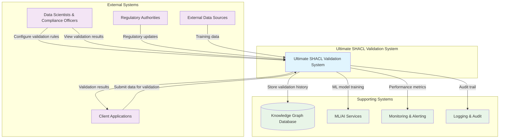
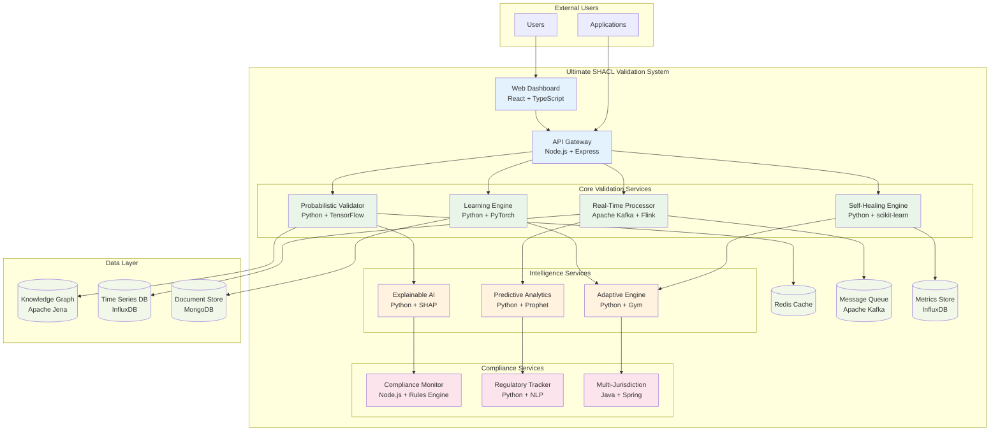
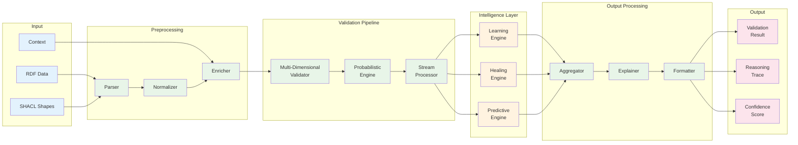
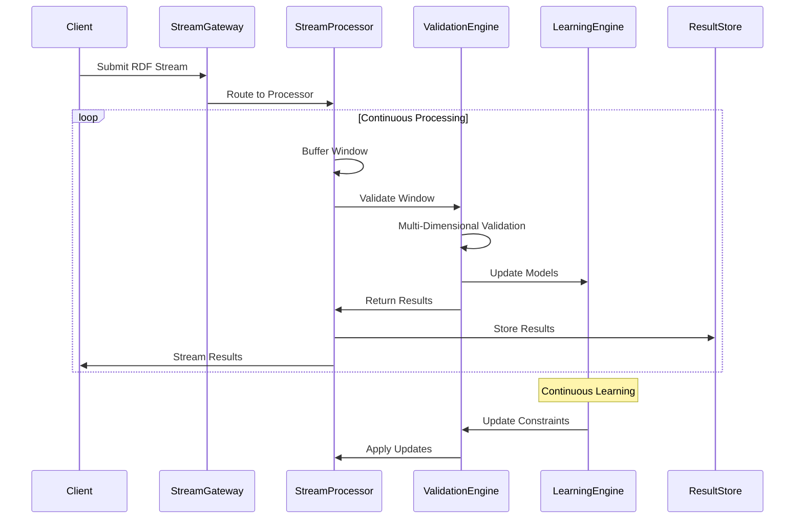
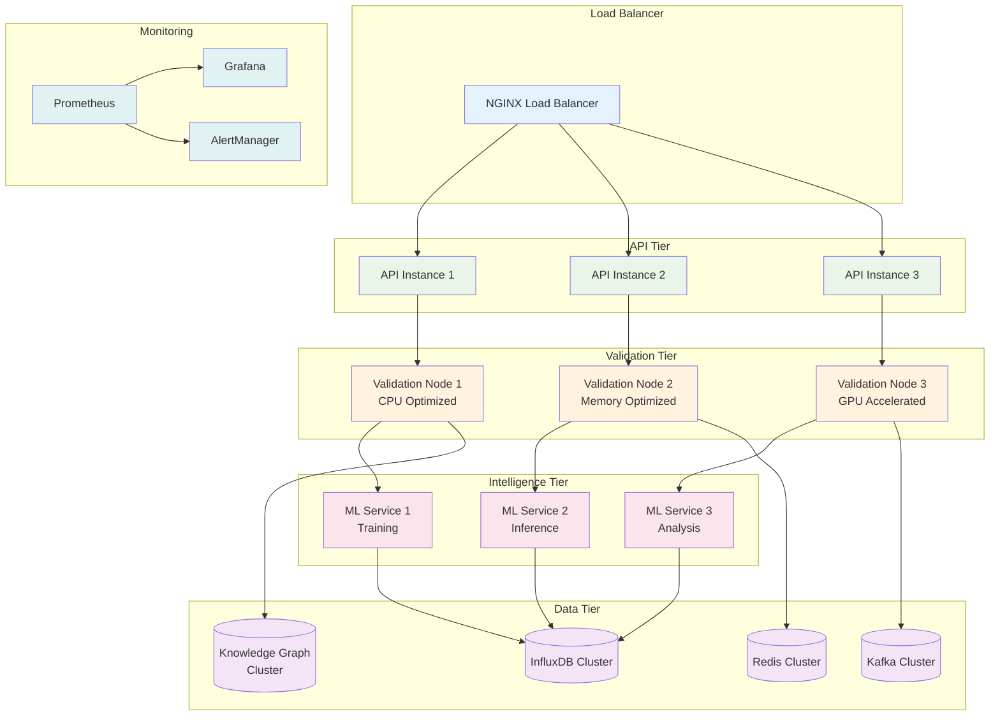

# C4 Model Architecture Diagrams
## Ultimate SHACL Validation System

### Level 1: System Context Diagram

### Level 2: Container Diagram

### Level 3: Component Diagram - Probabilistic Validation Container

```mermaid
graph TB
    subgraph "Probabilistic Validation Container"
        subgraph "Validation Controller"
            VC[Validation Controller]
            VR[Validation Router]
            VA[Validation API]
        end
        
        subgraph "Bayesian Inference Engine"
            BI[Bayesian Inference]
            PP[Prior Probability Manager]
            LH[Likelihood Calculator]
            POST[Posterior Calculator]
        end
        
        subgraph "Evidence Collection"
            EC[Evidence Collector]
            EW[Evidence Weigher]
            ES[Evidence Synthesizer]
            EM[Evidence Metadata]
        end
        
        subgraph "Confidence Calculation"
            CC[Confidence Calculator]
            UQ[Uncertainty Quantifier]
            CS[Confidence Scorer]
            CT[Confidence Thresholder]
        end
        
        subgraph "Alternative Generation"
            AG[Alternative Generator]
            AS[Alternative Scorer]
            AR[Alternative Ranker]
            AM[Alternative Merger]
        end
        
        subgraph "Decision Making"
            DM[Decision Maker]
            DR[Decision Reasoner]
            DV[Decision Validator]
            DO[Decision Optimizer]
        end
    end
    
    VC --> VR
    VR --> VA
    VA --> BI
    
    BI --> PP
    BI --> LH
    BI --> POST
    
    VA --> EC
    EC --> EW
    EW --> ES
    ES --> EM
    
    POST --> CC
    CC --> UQ
    UQ --> CS
    CS --> CT
    
    EC --> AG
    AG --> AS
    AS --> AR
    AR --> AM
    
    CT --> DM
    DM --> DR
    DR --> DV
    DV --> DO
    
    classDef controller fill:#e3f2fd
    classDef inference fill:#e8f5e8
    classDef evidence fill:#fff3e0
    classDef confidence fill:#fce4ec
    classDef alternative fill:#f3e5f5
    classDef decision fill:#e0f2f1
    
    class VC,VR,VA controller
    class BI,PP,LH,POST inference
    class EC,EW,ES,EM evidence
    class CC,UQ,CS,CT confidence
    class AG,AS,AR,AM alternative
    class DM,DR,DV,DO decision
```

### Level 4: Code Diagram - Bayesian Inference Component

```mermaid
classDiagram
    class BayesianInferenceEngine {
        +PriorProbabilityManager priorManager
        +LikelihoodCalculator likelihoodCalc
        +PosteriorCalculator posteriorCalc
        +EvidenceProcessor evidenceProcessor
        +calculatePosterior(evidence: Evidence): Posterior
        +updatePriors(feedback: Feedback): void
        +getInferenceTrace(): InferenceTrace
    }
    
    class PriorProbabilityManager {
        +Map~string, Prior~ priors
        +getPrior(constraint: SHACLShape): Prior
        +updatePrior(constraint: SHACLShape, evidence: Evidence): void
        +learnPriors(historicalData: ValidationHistory[]): void
    }
    
    class LikelihoodCalculator {
        +DistributionEstimator estimator
        +FeatureExtractor extractor
        +calculateLikelihood(evidence: Evidence, hypothesis: Hypothesis): number
        +estimateDistribution(data: RDFGraph): Distribution
        +extractFeatures(data: RDFGraph): Feature[]
    }
    
    class PosteriorCalculator {
        +NormalizationEngine normalizer
        +IntegrationEngine integrator
        +calculate(prior: Prior, likelihood: Likelihood): Posterior
        +marginalize(joint: JointPosterior): MarginalPosterior
        +normalize(unnormalized: UnnormalizedPosterior): Posterior
    }
    
    class EvidenceProcessor {
        +EvidenceValidator validator
        +EvidenceWeigher weigher
        +EvidenceCombiner combiner
        +processEvidence(raw: RawEvidence[]): ProcessedEvidence
        +validateEvidence(evidence: Evidence): ValidationResult
        +combineEvidence(evidence: Evidence[]): CombinedEvidence
    }
    
    class ValidationResult {
        +number confidence
        +number uncertainty
        +Evidence[] evidence
        +Posterior posterior
        +Decision decision
        +Alternative[] alternatives
        +InferenceTrace trace
    }
    
    class InferenceTrace {
        +InferenceStep[] steps
        +Evidence[] evidenceChain
        +Reasoning reasoning
        +Timestamp timestamp
        +getTraceVisualization(): Visualization
    }
    
    BayesianInferenceEngine --> PriorProbabilityManager
    BayesianInferenceEngine --> LikelihoodCalculator
    BayesianInferenceEngine --> PosteriorCalculator
    BayesianInferenceEngine --> EvidenceProcessor
    BayesianInferenceEngine --> ValidationResult
    BayesianInferenceEngine --> InferenceTrace
    
    PriorProbabilityManager --> Prior
    LikelihoodCalculator --> Likelihood
    PosteriorCalculator --> Posterior
    EvidenceProcessor --> Evidence
```

## Data Flow Diagrams

### High-Level Data Flow

### Real-Time Streaming Data Flow

## Deployment Architecture

### Production Deployment Diagram

This C4 model provides a comprehensive view of the system architecture from high-level context down to detailed component interactions, enabling clear communication of the design to all stakeholders.