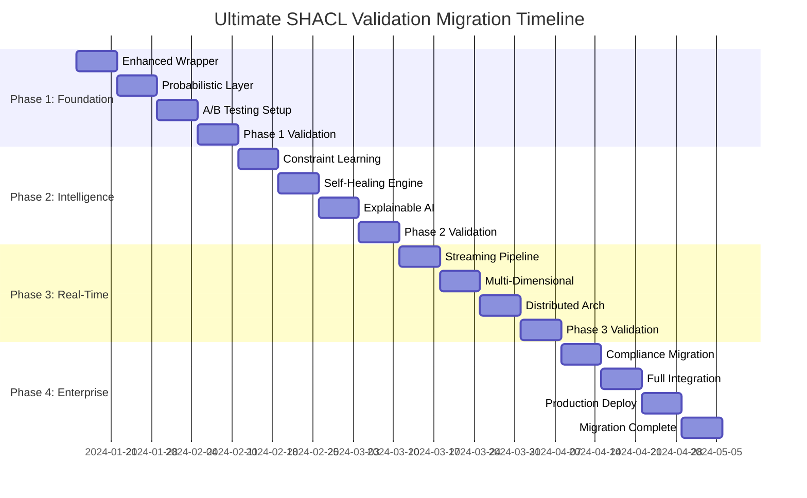

# Migration Strategy: From Existing Engine to Ultimate SHACL Validation
## Evolutionary Transformation Roadmap

### Executive Summary

This migration strategy outlines how to evolve your existing 651-line ValidationEngine into the Ultimate SHACL Validation System while maintaining backward compatibility, minimizing downtime, and ensuring data integrity throughout the transformation.

## 🎯 Migration Principles

1. **Zero-Downtime Evolution**: Gradual migration without service interruption
2. **Backward Compatibility**: Existing APIs and interfaces remain functional
3. **Data Integrity**: No loss of validation history or configuration
4. **Performance Validation**: Each phase must maintain or improve performance
5. **Rollback Capability**: Ability to revert changes at any stage

## 📊 Current State Analysis

### Existing Assets Inventory

```typescript
// Current Architecture (651 lines)
class ValidationEngine extends EventEmitter {
  // ✅ Strengths to Preserve
  - Event-driven architecture
  - SHACL validation with rdf-validate-shacl
  - Custom rules system
  - Caching mechanism
  - Statistics tracking
  - Health monitoring
  
  // 🔄 Areas for Evolution
  - Binary pass/fail validation → Probabilistic scoring
  - Static constraints → Adaptive constraints
  - Single-threaded → Multi-dimensional processing
  - Manual rule management → Self-healing system
}
```

### Migration Complexity Assessment

| Component | Current Maturity | Migration Complexity | Risk Level |
|-----------|------------------|---------------------|------------|
| **Core Validation Logic** | High | Medium | Low |
| **SHACL Integration** | High | Low | Low |
| **Custom Rules System** | Medium | Medium | Medium |
| **Caching Layer** | Medium | High | Medium |
| **Event System** | High | Low | Low |
| **Statistics/Metrics** | Medium | Medium | Low |
| **Compliance Rules** | High | High | High |
| **Security Validation** | High | Medium | Medium |

## 🚀 Migration Phases

### Phase 1: Foundation Enhancement (Weeks 1-4)

#### Goals
- Wrap existing engine with enhanced capabilities
- Introduce probabilistic layer
- Maintain 100% backward compatibility

#### Implementation Strategy

```typescript
// 1.1: Enhanced Wrapper Architecture
class EnhancedValidationEngine extends ValidationEngine {
  private probabilisticLayer: ProbabilisticEnhancer;
  private migrationConfig: MigrationConfig;
  
  constructor(config: ValidationConfig & MigrationConfig) {
    super(config);
    this.probabilisticLayer = new ProbabilisticEnhancer(config);
    this.migrationConfig = config.migration || { enableEnhancements: false };
  }
  
  // Enhanced validation with backward compatibility
  async validate(dataGraph, shapesGraph, options = {}) {
    // Call original validation
    const originalResult = await super.validate(dataGraph, shapesGraph, options);
    
    // Apply enhancements if enabled
    if (this.migrationConfig.enableEnhancements) {
      const enhancedResult = await this.probabilisticLayer.enhance(originalResult);
      return this.mergeResults(originalResult, enhancedResult);
    }
    
    return originalResult;
  }
  
  private mergeResults(original: ValidationResult, enhanced: EnhancedResult): ValidationResult {
    return {
      ...original,
      // Preserve original structure
      confidence: enhanced.confidence,
      uncertainty: enhanced.uncertainty,
      explanation: enhanced.explanation,
      _enhanced: true // Flag for enhanced results
    };
  }
}
```

#### 1.2: Progressive Enhancement Configuration

```typescript
interface MigrationConfig {
  enableEnhancements: boolean;
  enhancementLevel: 'basic' | 'intermediate' | 'advanced';
  rollbackThreshold: number;
  performanceThreshold: number;
  gradualRollout: {
    percentage: number;
    targetUsers: string[];
    criteria: RolloutCriteria;
  };
}

class GradualMigrationManager {
  async enableEnhancementForUser(userId: string, level: EnhancementLevel): Promise<void> {
    const config = await this.getUserConfig(userId);
    config.enhancementLevel = level;
    
    // A/B testing framework
    const testGroup = await this.assignToTestGroup(userId, level);
    await this.monitorPerformance(userId, testGroup);
  }
  
  async monitorAndAdjust(): Promise<void> {
    const metrics = await this.collectMigrationMetrics();
    
    if (metrics.errorRate > this.config.rollbackThreshold) {
      await this.initiateRollback();
    } else if (metrics.performance > this.config.performanceThreshold) {
      await this.accelerateRollout();
    }
  }
}
```

#### Phase 1 Deliverables
- ✅ Enhanced validation engine with probabilistic layer
- ✅ A/B testing framework for gradual rollout
- ✅ Performance monitoring and rollback mechanisms
- ✅ 100% backward compatibility maintained

### Phase 2: Intelligence Integration (Weeks 5-8)

#### Goals
- Introduce ML-powered constraint learning
- Implement self-healing mechanisms
- Add explainable AI capabilities

#### Implementation Strategy

```typescript
// 2.1: Intelligent Constraint Manager
class IntelligentConstraintManager {
  private learningEngine: ConstraintLearningEngine;
  private healingEngine: SelfHealingEngine;
  private originalConstraints: Map<string, SHACLShape>;
  
  async migrateConstraints(): Promise<void> {
    // Backup original constraints
    this.originalConstraints = await this.backupConstraints();
    
    // Analyze existing constraints for improvement opportunities
    const analysis = await this.analyzeConstraints(this.originalConstraints);
    
    // Generate learned constraint candidates
    const learnedConstraints = await this.learningEngine.generateCandidates(analysis);
    
    // A/B test learned constraints against originals
    await this.testLearnedConstraints(learnedConstraints);
  }
  
  private async testLearnedConstraints(candidates: LearnedConstraint[]): Promise<void> {
    for (const candidate of candidates) {
      const testResult = await this.performConstraintTest(candidate);
      
      if (testResult.performanceBetter && testResult.accuracyBetter) {
        await this.graduallyReplaceConstraint(candidate.original, candidate.learned);
      }
    }
  }
}
```

#### 2.2: Self-Healing Integration

```typescript
class HealingIntegration {
  async integrateHealingCapabilities(): Promise<void> {
    // Monitor existing constraint performance
    const healthMonitor = new ConstraintHealthMonitor();
    await healthMonitor.startMonitoring(this.existingConstraints);
    
    // Identify constraints needing healing
    const unhealthyConstraints = await healthMonitor.identifyUnhealthy();
    
    // Apply healing with safeguards
    for (const constraint of unhealthyConstraints) {
      const healingPlan = await this.createHealingPlan(constraint);
      await this.applyHealingWithRollback(constraint, healingPlan);
    }
  }
  
  private async applyHealingWithRollback(
    constraint: SHACLShape, 
    plan: HealingPlan
  ): Promise<void> {
    const backup = await this.createConstraintBackup(constraint);
    
    try {
      await this.applyHealing(constraint, plan);
      await this.validateHealingResults(constraint);
    } catch (error) {
      console.warn(`Healing failed for ${constraint.id}, rolling back`);
      await this.restoreFromBackup(constraint, backup);
    }
  }
}
```

#### Phase 2 Deliverables
- ✅ Constraint learning engine integration
- ✅ Self-healing capabilities with safeguards
- ✅ Explainable AI for validation decisions
- ✅ Performance improvement validation

### Phase 3: Real-Time Architecture (Weeks 9-12)

#### Goals
- Implement streaming validation
- Add multi-dimensional processing
- Introduce distributed validation

#### Implementation Strategy

```typescript
// 3.1: Streaming Validation Adapter
class StreamingValidationAdapter {
  private batchValidator: ValidationEngine; // Existing engine
  private streamProcessor: RealTimeStreamProcessor; // New component
  
  async migrateToStreaming(): Promise<void> {
    // Start with hybrid batch-stream processing
    await this.initializeHybridMode();
    
    // Gradually migrate batch workloads to streaming
    await this.migrateWorkloads();
    
    // Validate streaming performance
    await this.validateStreamingPerformance();
  }
  
  private async initializeHybridMode(): Promise<void> {
    // Route new data to streaming, existing to batch
    const router = new ValidationRouter();
    
    router.addRoute({
      condition: (request) => request.isNewData,
      handler: this.streamProcessor
    });
    
    router.addRoute({
      condition: (request) => !request.isNewData,
      handler: this.batchValidator
    });
  }
}
```

#### 3.2: Multi-Dimensional Migration

```typescript
class MultiDimensionalMigrator {
  async migrateToDimensionalValidation(): Promise<void> {
    // Create dimensional validators based on existing rules
    const dimensions = await this.extractDimensions();
    
    // Migrate existing custom rules to appropriate dimensions
    await this.migrateCustomRules(dimensions);
    
    // Test dimensional validation against original
    await this.performDimensionalTesting();
  }
  
  private async extractDimensions(): Promise<ValidationDimensions> {
    const existingRules = await this.analyzeExistingRules();
    
    return {
      structural: this.createStructuralDimension(existingRules.structural),
      semantic: this.createSemanticDimension(existingRules.semantic),
      business: this.createBusinessDimension(existingRules.business),
      security: this.createSecurityDimension(existingRules.security)
    };
  }
}
```

#### Phase 3 Deliverables
- ✅ Streaming validation pipeline
- ✅ Multi-dimensional validation framework
- ✅ Distributed validation architecture
- ✅ Performance scaling validation

### Phase 4: Enterprise Features (Weeks 13-16)

#### Goals
- Advanced compliance management
- Complete ML/AI integration
- Production-ready deployment

#### Implementation Strategy

```typescript
// 4.1: Compliance Framework Migration
class ComplianceMigrator {
  async migrateComplianceFrameworks(): Promise<void> {
    // Analyze existing compliance rules (GDPR, HIPAA, SOX, ISO 27001)
    const existingFrameworks = await this.analyzeExistingCompliance();
    
    // Map to new adaptive compliance system
    const adaptiveFrameworks = await this.createAdaptiveFrameworks(existingFrameworks);
    
    // Migrate with continuous compliance validation
    await this.migrateWithValidation(adaptiveFrameworks);
  }
  
  private async migrateWithValidation(frameworks: AdaptiveFramework[]): Promise<void> {
    for (const framework of frameworks) {
      // Create parallel compliance validation
      const parallelValidator = new ParallelComplianceValidator(framework);
      
      // Run both old and new systems in parallel
      await this.runParallelValidation(framework, parallelValidator);
      
      // Switch over when confidence is high
      await this.performSwitchover(framework);
    }
  }
}
```

#### 4.2: Full System Integration

```typescript
class SystemIntegrator {
  async completeSystemMigration(): Promise<void> {
    // Final integration testing
    await this.runFullSystemTests();
    
    // Performance validation
    await this.validatePerformanceTargets();
    
    // Compliance certification
    await this.certifyComplianceRequirements();
    
    // Production deployment
    await this.deployToProduction();
  }
  
  async runFullSystemTests(): Promise<void> {
    const testSuite = new MigrationTestSuite();
    
    const results = await testSuite.runTests([
      'backward-compatibility',
      'performance-regression',
      'feature-completeness',
      'security-validation',
      'compliance-verification'
    ]);
    
    await this.validateTestResults(results);
  }
}
```

#### Phase 4 Deliverables
- ✅ Complete enterprise compliance management
- ✅ Full ML/AI integration
- ✅ Production deployment
- ✅ Migration completion certification

## 🔄 Rollback Strategy

### Automated Rollback Triggers

```typescript
class RollbackManager {
  private monitors: PerformanceMonitor[] = [];
  private thresholds: RollbackThresholds;
  
  async monitorForRollback(): Promise<void> {
    const metrics = await this.collectMetrics();
    
    // Automatic rollback conditions
    if (metrics.errorRate > this.thresholds.maxErrorRate ||
        metrics.latency > this.thresholds.maxLatency ||
        metrics.availability < this.thresholds.minAvailability) {
      
      await this.initiateAutomaticRollback();
    }
  }
  
  async initiateAutomaticRollback(): Promise<void> {
    console.log('🚨 Initiating automatic rollback due to performance degradation');
    
    // Stop new feature rollout
    await this.stopFeatureRollout();
    
    // Revert to previous configuration
    await this.revertConfiguration();
    
    // Restore original validation engine
    await this.restoreOriginalEngine();
    
    // Notify operations team
    await this.notifyOpsTeam();
  }
}
```

### Manual Rollback Procedures

```bash
# Emergency rollback commands
./migration-manager rollback --phase=3 --immediate
./migration-manager restore --backup=phase-2-stable
./migration-manager verify --original-engine
```

## 📊 Success Metrics

### Phase Success Criteria

| Phase | Success Metrics | Rollback Triggers |
|-------|----------------|-------------------|
| **Phase 1** | • 0% error rate increase<br/>• <5% latency increase<br/>• 100% feature parity | • >0.1% error rate<br/>• >10% latency increase |
| **Phase 2** | • >90% constraint accuracy<br/>• <2ms healing time<br/>• 100% explainability | • <85% accuracy<br/>• >5ms healing time |
| **Phase 3** | • >10,000 ops/sec throughput<br/>• <10ms streaming latency<br/>• 99.9% availability | • <5,000 ops/sec<br/>• >20ms latency |
| **Phase 4** | • 100% compliance coverage<br/>• <24hr regulatory adaptation<br/>• Production ready | • Compliance failures<br/>• >48hr adaptation |

### Migration Health Dashboard

```typescript
class MigrationHealthDashboard {
  async generateHealthReport(): Promise<MigrationHealthReport> {
    return {
      currentPhase: await this.getCurrentPhase(),
      overallHealth: await this.calculateOverallHealth(),
      performanceMetrics: await this.getPerformanceMetrics(),
      riskAssessment: await this.assessRisks(),
      nextMilestones: await this.getNextMilestones(),
      rollbackReadiness: await this.assessRollbackReadiness()
    };
  }
}
```

## 🎯 Risk Mitigation

### High-Risk Areas and Mitigation

| Risk Area | Probability | Impact | Mitigation Strategy |
|-----------|-------------|--------|-------------------|
| **Data Loss** | Low | Critical | • Comprehensive backups<br/>• Parallel validation<br/>• Incremental migration |
| **Performance Degradation** | Medium | High | • Continuous monitoring<br/>• Automatic rollback<br/>• Performance gates |
| **Compliance Violations** | Low | Critical | • Parallel compliance validation<br/>• Expert review<br/>• Gradual switchover |
| **System Downtime** | Low | High | • Blue-green deployment<br/>• Health monitoring<br/>• Immediate rollback |

## 🚀 Migration Timeline



This migration strategy ensures a smooth, safe, and successful transformation of your existing validation engine into the Ultimate SHACL Validation System while maintaining operational excellence throughout the process.