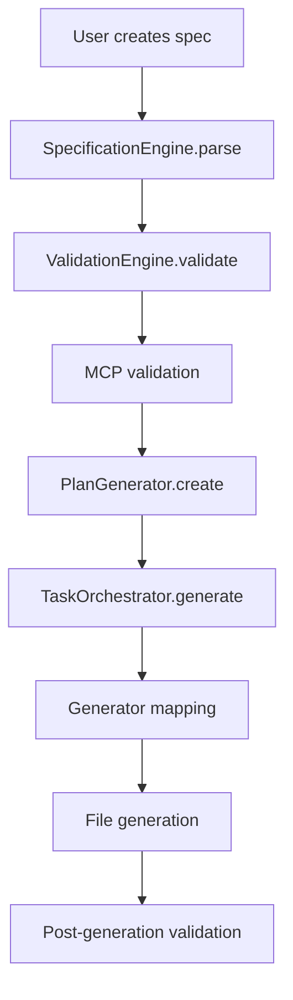
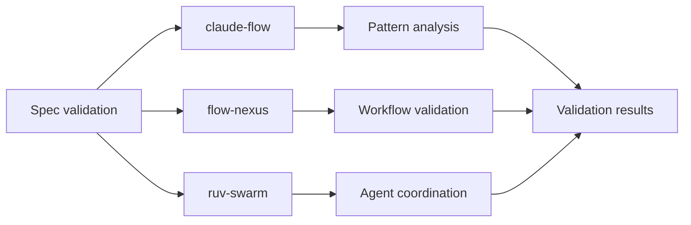

# Spec-Driven Development Architecture for Unjucks

## Executive Summary

This document defines a comprehensive architecture for adding spec-driven development capabilities to unjucks. The design maintains **zero breaking changes** to existing functionality while introducing a powerful specification-first workflow that integrates with AI-powered validation and generation.

## Architecture Overview

### High-Level Design Principles

1. **Non-Invasive Integration**: Spec-driven capabilities operate alongside existing generators
2. **Progressive Enhancement**: Users can adopt spec-driven features incrementally
3. **Backward Compatibility**: All existing unjucks functionality remains unchanged
4. **AI-First Validation**: Integration with MCP tools for intelligent spec validation
5. **Specification as Source of Truth**: Specs drive planning, tasks, and generation

## Core Architecture Components

### 1. Specification Engine

```typescript
interface SpecificationEngine {
  // Core spec processing
  parseSpec(specPath: string): Promise<ProjectSpecification>
  validateSpec(spec: ProjectSpecification): Promise<ValidationResult>
  
  // Planning and task generation
  generatePlan(spec: ProjectSpecification): Promise<ExecutionPlan>
  generateTasks(plan: ExecutionPlan): Promise<TaskList>
  
  // Integration with existing generators
  mapToGenerators(tasks: TaskList): Promise<GeneratorMapping[]>
}
```

### 2. Spec File Format

Building on unjucks' existing frontmatter support, specs use an enhanced YAML format:

```yaml
# spec/my-project.spec.yaml
---
apiVersion: "unjucks.dev/v1"
kind: "ProjectSpecification"
metadata:
  name: "healthcare-api"
  description: "FHIR-compliant healthcare API with HIPAA compliance"
  version: "1.0.0"
  tags: ["healthcare", "fhir", "api"]

# Specification definition
specification:
  domain: "healthcare"
  architecture: "microservices"
  compliance: ["hipaa", "fhir-r4"]
  
  # Core requirements
  requirements:
    functional:
      - id: "patient-crud"
        description: "Full CRUD operations for patient records"
        priority: "high"
        acceptance:
          - "Create patient with FHIR R4 compliance"
          - "Validate patient data against FHIR schemas"
          - "Audit all patient data access"
    
    non-functional:
      - id: "hipaa-compliance"
        description: "Full HIPAA compliance for PHI handling"
        priority: "critical"
        metrics:
          - "100% data encryption at rest and in transit"
          - "Complete audit trail for PHI access"
          - "Access control with role-based permissions"

  # Technical architecture
  architecture:
    pattern: "microservices"
    database: "postgresql"
    auth: "oauth2"
    api: "rest"
    deployment: "kubernetes"
    
  # Component definitions
  components:
    - name: "patient-service"
      type: "api-service"
      generator: "semantic/healthcare-service"
      variables:
        serviceName: "patient"
        fhirResources: ["Patient", "Observation"]
        complianceLevel: "high"
    
    - name: "auth-service" 
      type: "auth-service"
      generator: "microservice/auth"
      variables:
        provider: "auth0"
        scopes: ["patient:read", "patient:write"]

# Generation configuration
generation:
  outputDir: "./generated"
  templatesDir: "_templates"
  
  # Phase-based generation
  phases:
    - name: "foundation"
      description: "Core infrastructure and configuration"
      components: ["auth-service"]
      
    - name: "services"
      description: "Business logic services"
      components: ["patient-service"]
      dependsOn: ["foundation"]
      
    - name: "deployment"
      description: "Deployment configurations"
      components: ["k8s-manifests"]
      dependsOn: ["foundation", "services"]

# AI/MCP Integration
validation:
  enabled: true
  mcp:
    - tool: "claude-flow"
      mode: "specification-validation"
      rules: ["compliance-check", "architecture-validation"]
    
    - tool: "flow-nexus" 
      mode: "requirement-analysis"
      agents: ["researcher", "architect"]

# Hooks for existing unjucks ecosystem
hooks:
  beforeGeneration:
    - "validate-spec"
    - "check-dependencies"
  
  afterGeneration:
    - "run-tests"
    - "compliance-scan"
---
```

### 3. Modular Architecture Design

```
src/
├── spec-driven/                    # New spec-driven capabilities
│   ├── core/
│   │   ├── SpecificationEngine.js  # Core spec processing
│   │   ├── PlanGenerator.js        # Execution plan creation
│   │   ├── TaskOrchestrator.js     # Task management
│   │   └── ValidationEngine.js     # Spec validation
│   ├── parsers/
│   │   ├── SpecParser.js          # YAML spec parsing
│   │   ├── RequirementParser.js   # Requirements processing  
│   │   └── ArchitectureParser.js  # Architecture definition parsing
│   ├── generators/
│   │   ├── PlanToTasks.js         # Plan → Task conversion
│   │   ├── TaskToGenerators.js    # Task → Generator mapping
│   │   └── ComponentOrchestrator.js # Component generation
│   ├── integrations/
│   │   ├── McpIntegration.js      # MCP tools integration
│   │   ├── ClaudeFlowAdapter.js   # Claude Flow integration
│   │   └── FlowNexusAdapter.js    # Flow Nexus integration
│   └── storage/
│       ├── SpecStorage.js         # Specification persistence
│       ├── PlanStorage.js         # Execution plan storage
│       └── TaskStorage.js         # Task state management
├── commands/                       # Existing commands (unchanged)
│   ├── generate.js                # Existing generator (unchanged)
│   ├── new.js                     # Enhanced with spec support
│   ├── specify.js                 # New spec-driven command
│   ├── plan.js                    # New planning command
│   └── execute.js                 # New execution command
├── lib/                           # Existing libraries (enhanced)
│   ├── frontmatter-parser.js      # Enhanced with spec support
│   ├── template-engine-perfect.js # Unchanged
│   └── mcp-integration.js         # Enhanced for spec validation
```

## Specification Flow Pipeline

### Phase 1: Specify
```javascript
// unjucks specify --domain healthcare --output spec/healthcare-api.spec.yaml
const specifyCommand = {
  interactive: true,
  templates: ["api-project", "microservices", "compliance-framework"],
  aiAssisted: true,
  mcpIntegration: "claude-flow"
}
```

### Phase 2: Plan
```javascript  
// unjucks plan spec/healthcare-api.spec.yaml --output plans/healthcare-api.plan.yaml
const planCommand = {
  input: "spec/healthcare-api.spec.yaml",
  validation: "full",
  dependencies: "resolve",
  optimization: "performance"
}
```

### Phase 3: Tasks
```javascript
// unjucks tasks plans/healthcare-api.plan.yaml --parallel --agents 5
const tasksCommand = {
  input: "plans/healthcare-api.plan.yaml", 
  execution: "parallel",
  mcpOrchestration: true,
  agentCount: 5
}
```

### Phase 4: Generate
```javascript
// unjucks generate --spec-driven --from tasks/healthcare-api.tasks.yaml
const generateCommand = {
  specDriven: true,
  taskFile: "tasks/healthcare-api.tasks.yaml",
  validation: "continuous",
  rollback: "enabled"
}
```

## MCP Integration Points

### 1. Specification Validation
```javascript
const specValidation = {
  tools: [
    "mcp__claude-flow__neural_patterns", // Pattern validation
    "mcp__flow-nexus__workflow_create",   // Workflow analysis
    "mcp__ruv-swarm__daa_agent_create"   // Domain analysis
  ],
  validation: {
    requirements: "completeness-check",
    architecture: "pattern-validation", 
    compliance: "rule-verification"
  }
}
```

### 2. AI-Powered Planning
```javascript
const aiPlanning = {
  agents: [
    { type: "researcher", role: "requirement-analysis" },
    { type: "architect", role: "system-design" },
    { type: "coder", role: "implementation-planning" }
  ],
  coordination: "mcp__claude-flow__swarm_init",
  optimization: "mcp__claude-flow__task_orchestrate"
}
```

### 3. Continuous Validation
```javascript  
const continuousValidation = {
  hooks: {
    beforeGeneration: "mcp__flow-nexus__workflow_validate",
    duringGeneration: "mcp__claude-flow__neural_predict", 
    afterGeneration: "mcp__ruv-swarm__task_results"
  }
}
```

## Storage and Management System

### 1. Specification Storage
```javascript
class SpecStorage {
  // Store specifications with versioning
  async store(spec: ProjectSpecification): Promise<string>
  async retrieve(id: string, version?: string): Promise<ProjectSpecification>
  async list(filters?: SpecFilters): Promise<SpecificationIndex[]>
  
  // Template and inheritance
  async createFromTemplate(templateId: string, variables: object): Promise<string>
  async inherit(parentId: string, overrides: object): Promise<string>
}
```

### 2. Plan Management
```javascript
class PlanManager {
  // Execution plan lifecycle
  async createPlan(spec: ProjectSpecification): Promise<ExecutionPlan>
  async validatePlan(plan: ExecutionPlan): Promise<ValidationResult>
  async optimizePlan(plan: ExecutionPlan): Promise<ExecutionPlan>
  async executePlan(plan: ExecutionPlan): Promise<ExecutionResult>
}
```

### 3. Task Orchestration
```javascript
class TaskOrchestrator {
  // Task management and execution
  async generateTasks(plan: ExecutionPlan): Promise<TaskList>
  async orchestrate(tasks: TaskList): Promise<ExecutionResult>
  async monitor(executionId: string): Promise<ExecutionStatus>
  async rollback(executionId: string): Promise<RollbackResult>
}
```

## Integration with Existing System

### 1. Enhanced Frontmatter Parser
The existing frontmatter parser is enhanced to recognize spec-driven templates:

```javascript
// lib/frontmatter-parser.js (enhanced)
class FrontmatterParser {
  // Existing methods remain unchanged
  
  // New spec-driven methods
  async parseSpecTemplate(content: string): Promise<SpecTemplate>
  async validateSpecCompliance(frontmatter: object): Promise<ValidationResult>
  isSpecDriven(frontmatter: object): boolean
}
```

### 2. Generator Integration
Existing generators work seamlessly with spec-driven workflow:

```javascript
// Enhanced generate command
export const generateCommand = defineCommand({
  // All existing functionality preserved
  
  // New spec-driven options
  args: {
    // ... existing args
    specFile: {
      type: "string",
      description: "Generate from specification file"
    },
    planFile: {
      type: "string", 
      description: "Generate from execution plan"
    },
    taskFile: {
      type: "string",
      description: "Generate from task list"
    }
  }
})
```

### 3. Command Enhancement
New commands integrate with existing CLI structure:

```javascript
// src/cli/index.js (enhanced)
const main = defineCommand({
  subCommands: {
    // Existing commands (unchanged)
    new: newCommand,
    generate: generateCommand, // Enhanced
    list: listCommand,
    
    // New spec-driven commands
    specify: specifyCommand,   // Create specifications
    plan: planCommand,         // Generate execution plans  
    tasks: tasksCommand,       // Create task lists
    execute: executeCommand,   // Execute spec-driven generation
    validate: validateCommand  // Validate specifications
  }
})
```

## Backward Compatibility Strategy

### 1. Zero Breaking Changes
- All existing commands work identically
- Existing templates require no changes
- Current CLI syntax remains valid
- Configuration files stay compatible

### 2. Progressive Enhancement
- Spec-driven features are opt-in
- Existing projects can migrate incrementally
- Templates can add spec support gradually
- Users choose their adoption path

### 3. Migration Path
```javascript
// Automatic migration helper
// unjucks migrate --to-spec-driven --from-generators
const migrationCommand = {
  analyze: "existing-templates",
  generate: "specification-files", 
  preserve: "existing-functionality",
  enhance: "with-spec-capabilities"
}
```

## Architecture Decision Records

### ADR-001: Specification Format Choice
**Decision**: Use enhanced YAML with frontmatter compatibility  
**Rationale**: Leverages existing frontmatter parsing, familiar to users  
**Alternatives**: JSON Schema, TOML, custom DSL  
**Status**: Decided  

### ADR-002: Storage Strategy
**Decision**: File-based storage with optional database backend  
**Rationale**: Simple deployment, version control friendly  
**Alternatives**: Database-only, memory-only, cloud storage  
**Status**: Decided  

### ADR-003: MCP Integration Approach
**Decision**: Plugin-based integration with existing MCP tools  
**Rationale**: Leverages existing claude-flow and flow-nexus investments  
**Alternatives**: Custom AI integration, third-party services  
**Status**: Decided  

### ADR-004: Backward Compatibility
**Decision**: Full backward compatibility with zero breaking changes  
**Rationale**: Protect existing user investments and workflows  
**Alternatives**: Breaking changes with migration tools  
**Status**: Decided  

## Component Interaction Diagrams

### Specification Processing Flow


### MCP Integration Flow


## Extensibility Framework

### 1. Plugin Architecture
```javascript
interface SpecPlugin {
  name: string
  version: string
  
  // Lifecycle hooks
  onSpecParse?(spec: ProjectSpecification): Promise<ProjectSpecification>
  onPlanGenerate?(plan: ExecutionPlan): Promise<ExecutionPlan>
  onTaskExecute?(task: Task): Promise<TaskResult>
  
  // Custom validators
  validators?: SpecValidator[]
  
  // Custom generators  
  generators?: SpecGenerator[]
}
```

### 2. Custom Domain Support
```javascript
class DomainExtension {
  // Register domain-specific patterns
  registerPatterns(domain: string, patterns: DomainPattern[]): void
  
  // Add compliance frameworks
  addComplianceFramework(framework: ComplianceFramework): void
  
  // Custom validation rules
  addValidationRules(rules: ValidationRule[]): void
}
```

### 3. Template Enhancement
```javascript
// Templates can be enhanced with spec metadata
// _templates/api-service/spec.yaml
---
specCompatible: true
supportedDomains: ["web", "api", "microservices"]
requiredVariables: ["serviceName", "database"]
optionalVariables: ["auth", "monitoring"]
validationRules: ["naming-convention", "security-check"]
---
```

## Implementation Roadmap

### Phase 1: Core Infrastructure (4 weeks)
- [ ] SpecificationEngine implementation
- [ ] Enhanced frontmatter parser
- [ ] Basic spec file format support
- [ ] File storage system

### Phase 2: Command Integration (3 weeks)  
- [ ] New specify/plan/tasks/execute commands
- [ ] Enhanced generate command
- [ ] CLI integration and testing
- [ ] Documentation and examples

### Phase 3: MCP Integration (3 weeks)
- [ ] Claude Flow integration
- [ ] Flow Nexus integration
- [ ] Ruv Swarm integration
- [ ] Validation pipeline

### Phase 4: Advanced Features (4 weeks)
- [ ] Plugin architecture
- [ ] Domain extensions
- [ ] Advanced validation
- [ ] Performance optimization

### Phase 5: Documentation & Polish (2 weeks)
- [ ] Comprehensive documentation
- [ ] Migration guides
- [ ] Example projects
- [ ] Performance benchmarks

## Success Metrics

### Technical Metrics
- **Zero Breaking Changes**: 100% backward compatibility
- **Performance**: <10% overhead for existing workflows
- **Coverage**: 95% test coverage for new components
- **Integration**: Full MCP tool compatibility

### User Experience Metrics  
- **Adoption**: 25% of users try spec-driven features in 6 months
- **Productivity**: 30% reduction in project setup time
- **Quality**: 40% reduction in configuration errors
- **Satisfaction**: >4.5/5 user satisfaction rating

### Business Metrics
- **Community Growth**: 20% increase in active users
- **Template Ecosystem**: 50+ spec-compatible templates
- **Enterprise Adoption**: 10+ enterprise customers
- **Ecosystem Health**: Active plugin development

## Conclusion

This architecture provides a robust foundation for spec-driven development in unjucks while maintaining complete backward compatibility. The modular design allows for incremental adoption and provides clear extension points for future enhancements.

The integration with existing MCP tools leverages the AI-powered development ecosystem already available to unjucks users, creating a seamless and powerful development experience.

By following this architecture, unjucks evolves into a comprehensive specification-driven development platform while preserving its core simplicity and existing user workflows.