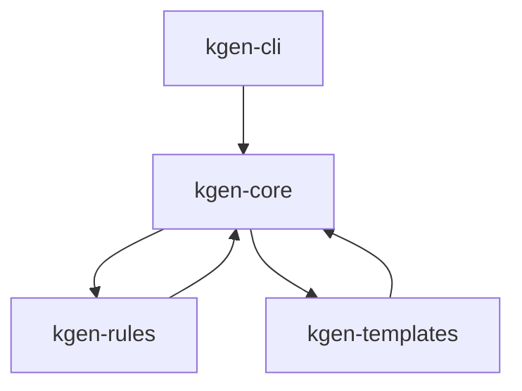
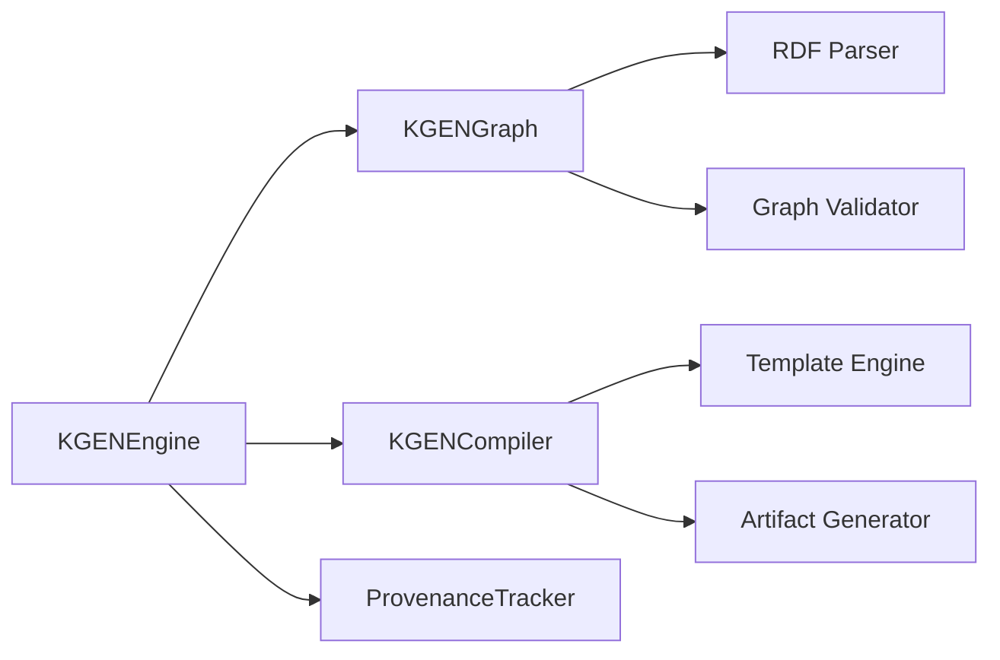
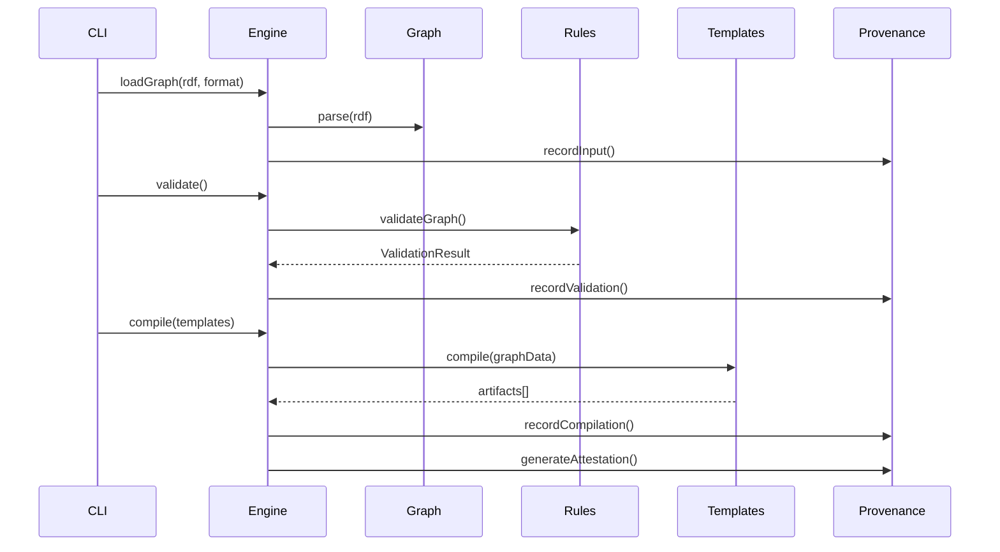

# KGEN System Architecture

## Overview

KGEN (Knowledge Graph Engine) is a deterministic, stateless CLI tool designed for compiling RDF graphs into various artifacts with full provenance tracking. The system follows a monorepo architecture with clear separation of concerns across four main packages.

## Architecture Principles

### 1. Deterministic Processing
- All operations produce identical results given identical inputs
- Cryptographic hashing ensures reproducibility
- Deterministic ID generation for all entities

### 2. Stateless Design
- No persistent state between invocations
- Pure functional approach to transformations
- Immutable data structures throughout

### 3. Provenance Tracking
- Full lineage tracking from input to output
- Cryptographic attestations in .attest.json
- Audit trail for compliance and reproducibility

### 4. Modular Architecture
- Clear separation between packages
- Well-defined interfaces and boundaries
- Dependency injection for testability

## Package Architecture

```
kgen/
├── packages/
│   ├── kgen-cli/          # Command-line interface
│   ├── kgen-core/         # Core engine and orchestration
│   ├── kgen-rules/        # Validation and transformation rules
│   └── kgen-templates/    # Template engine for artifact generation
├── config/                # Shared configurations
└── docs/                  # Architecture and API documentation
```

### Package Dependencies



## Core Engine Architecture (kgen-core)

The core engine orchestrates all knowledge graph processing through these key components:

### 1. KGENEngine Class
**Location**: `packages/kgen-core/src/engine.js`

**Responsibilities**:
- Main orchestration layer
- Component lifecycle management
- Event emission and handling
- Operation coordination

**Key Methods**:
- `loadGraph(data, format, source)` - Load and parse RDF data
- `validate()` - Validate graph against rules
- `compile(templates, options)` - Generate artifacts from templates
- `query(sparql)` - Execute SPARQL queries

### 2. Component Architecture



### 3. Data Flow



## Module Boundaries and Interfaces

### 1. kgen-cli ↔ kgen-core
**Interface**: ES6 imports of KGENEngine class
**Data Exchange**: Configuration objects, file paths, CLI arguments
**Coupling**: Loose - CLI only knows about Engine interface

### 2. kgen-core ↔ kgen-rules
**Interface**: Validation and transformation functions
**Data Exchange**: RDF graphs, validation results, rule definitions
**Coupling**: Medium - Core knows about Rules API

### 3. kgen-core ↔ kgen-templates
**Interface**: Template compilation and rendering
**Data Exchange**: Graph data, template names, generated artifacts
**Coupling**: Medium - Core knows about Templates API

### 4. Cross-Package Communication
- **Event-driven**: Core engine emits events for logging and monitoring
- **Promise-based**: All async operations return promises
- **Type-safe**: JSDoc annotations provide compile-time type checking

## Configuration Architecture

### 1. Configuration Loading (c12)
```javascript
// kgen.config.js
export default {
  baseIRI: 'http://kgen.local/',
  deterministic: true,
  trackProvenance: true,
  validation: {
    enabled: true,
    strictMode: true,
    rules: ['./src/rules/custom.shacl']
  },
  templates: {
    directory: './src/templates'
  },
  output: {
    directory: './output',
    format: 'pretty'
  }
};
```

### 2. Configuration Schema
- **Base IRI**: Root namespace for generated identifiers
- **Deterministic**: Enable deterministic processing mode
- **Provenance**: Control provenance tracking behavior
- **Validation**: Configure validation rules and behavior
- **Templates**: Template engine configuration
- **Output**: Output formatting and destination

## Provenance Architecture

### 1. Provenance Tracking
```javascript
// Example .attest.json structure
{
  "version": "1.0.0",
  "attestation": {
    "timestamp": "2024-01-15T10:30:00Z",
    "inputs": [{
      "source": "data.ttl",
      "hash": "sha256:abc123...",
      "format": "turtle"
    }],
    "outputs": [{
      "artifact": "generated.js",
      "hash": "sha256:def456...",
      "template": "api-service"
    }],
    "process": {
      "engine": "kgen-core@0.1.0",
      "rules": ["validation-rules@1.0.0"],
      "templates": ["api-service@2.1.0"]
    },
    "signature": "cryptographic-signature"
  }
}
```

### 2. Deterministic ID Generation
- **Seed-based**: All IDs generated from deterministic seeds
- **Content-addressable**: IDs based on content hashes
- **Reproducible**: Same input always produces same IDs

## Security Architecture

### 1. Input Validation
- **Format validation**: RDF syntax validation
- **Schema validation**: SHACL shape validation
- **Security rules**: Custom security constraints

### 2. Provenance Integrity
- **Cryptographic hashing**: SHA-256 for all content
- **Digital signatures**: Optional signing of attestations
- **Audit trail**: Complete operation history

### 3. Isolation
- **Stateless processing**: No persistent state
- **Sandboxed templates**: Template execution in controlled environment
- **Resource limits**: Memory and CPU constraints

## Performance Architecture

### 1. Streaming Processing
- **Memory efficient**: Stream-based RDF parsing
- **Lazy evaluation**: Templates rendered on-demand
- **Incremental validation**: Validate changes only

### 2. Caching Strategy
- **Parse cache**: Parsed RDF graphs cached by hash
- **Template cache**: Compiled templates cached
- **Validation cache**: Validation results cached

### 3. Parallel Processing
- **Concurrent validation**: Multiple rules in parallel
- **Batch processing**: Multiple templates concurrently
- **Worker threads**: CPU-intensive tasks in workers

## Extension Architecture

### 1. Plugin System
- **Rule plugins**: Custom validation rules
- **Template plugins**: New template engines
- **Output plugins**: Custom artifact formats

### 2. Hook System
- **Pre/post processing**: Lifecycle hooks
- **Event system**: Observable processing pipeline
- **Middleware**: Transformation middleware

## Quality Attributes

### 1. Reliability
- **Error handling**: Comprehensive error handling
- **Rollback**: Safe failure modes
- **Validation**: Multi-layer validation

### 2. Maintainability
- **Modular design**: Clear package boundaries
- **Type safety**: JSDoc type annotations
- **Testing**: Comprehensive test coverage

### 3. Performance
- **Deterministic**: O(n) complexity for most operations
- **Memory efficient**: Stream processing
- **Scalable**: Horizontal scaling support

### 4. Security
- **Input validation**: All inputs validated
- **Provenance**: Full audit trail
- **Isolation**: Sandboxed execution

## Deployment Architecture

### 1. Distribution
- **NPM packages**: Published as scoped packages
- **Workspace**: Monorepo with npm workspaces
- **Semantic versioning**: Coordinated releases

### 2. Dependencies
- **Minimal external**: Few external dependencies
- **Security scanning**: All dependencies scanned
- **Lock files**: Exact version locking

### 3. Compatibility
- **Node.js**: >= 18.0.0
- **ES modules**: Pure ESM packages
- **Cross-platform**: Windows, macOS, Linux

This architecture provides a solid foundation for the KGEN system with clear separation of concerns, strong interfaces, and comprehensive provenance tracking while maintaining deterministic and stateless operation.