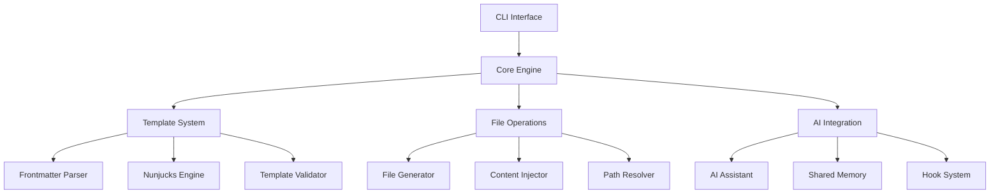

# Unjucks v2 Architecture

## Overview

This document details the architectural design of Unjucks v2, demonstrating modern software architecture principles applied through the SPARC methodology with AI assistance.

## System Architecture

### High-Level Architecture



### Core Components

#### 1. CLI Interface Layer
```typescript
interface CLIInterface {
  commands: {
    list: () => Promise<TemplateList>;
    help: (generator: string) => Promise<HelpInfo>;
    generate: (generator: string, options: GenerateOptions) => Promise<GenerationResult>;
  };
  
  middleware: {
    validation: ValidationMiddleware;
    authentication: AuthMiddleware;
    logging: LoggingMiddleware;
  };
}
```

#### 2. Core Engine
```typescript
class UnjucksEngine {
  private templateSystem: TemplateSystem;
  private fileOperations: FileOperations;
  private aiIntegration: AIIntegration;
  
  async process(request: ProcessingRequest): Promise<ProcessingResult> {
    const template = await this.templateSystem.load(request.templateId);
    const context = await this.aiIntegration.enrichContext(request.context, template);
    const generated = await this.templateSystem.render(template, context);
    const result = await this.fileOperations.write(generated, request.outputPath);
    
    return result;
  }
}
```

#### 3. Template System
```typescript
interface TemplateSystem {
  indexer: TemplateIndexer;
  parser: FrontmatterParser;
  engine: NunjucksEngine;
  validator: TemplateValidator;
  
  load(templateId: string): Promise<Template>;
  render(template: Template, context: Context): Promise<RenderedContent>;
  validate(template: Template): Promise<ValidationResult>;
}
```

## Architectural Patterns

### 1. Layered Architecture

```
┌─────────────────────────┐
│     Presentation        │  CLI, API interfaces
├─────────────────────────┤
│      Application        │  Use cases, orchestration
├─────────────────────────┤
│        Domain          │  Business logic, entities
├─────────────────────────┤
│    Infrastructure      │  File system, AI services
└─────────────────────────┘
```

### 2. Dependency Injection

```typescript
// Dependency container configuration
const container = new Container();

container.bind<ITemplateEngine>('TemplateEngine').to(NunjucksEngine);
container.bind<IFileSystem>('FileSystem').to(NodeFileSystem);
container.bind<IAIService>('AIService').to(ClaudeService);
container.bind<ILogger>('Logger').to(WinstonLogger);

// Usage in classes
@injectable()
class TemplateProcessor {
  constructor(
    @inject('TemplateEngine') private templateEngine: ITemplateEngine,
    @inject('FileSystem') private fileSystem: IFileSystem,
    @inject('AIService') private aiService: IAIService
  ) {}
}
```

### 3. Plugin Architecture

```typescript
interface Plugin {
  name: string;
  version: string;
  hooks: PluginHooks;
  
  initialize(context: PluginContext): Promise<void>;
  cleanup(): Promise<void>;
}

interface PluginHooks {
  beforeTemplateProcess?: (template: Template) => Promise<Template>;
  afterTemplateRender?: (content: string, template: Template) => Promise<string>;
  beforeFileWrite?: (content: string, path: string) => Promise<{ content: string; path: string }>;
  afterFileWrite?: (path: string) => Promise<void>;
}
```

## Design Decisions

### 1. TypeScript and ESM

**Decision**: Use TypeScript with ES modules for modern JavaScript support

**Rationale**:
- Type safety reduces runtime errors
- Better IDE support and developer experience
- ESM enables tree shaking and modern bundling
- Future-proofs the codebase

**Implementation**:
```json
{
  "type": "module",
  "exports": {
    ".": {
      "types": "./dist/index.d.ts",
      "import": "./dist/index.js"
    },
    "./cli": {
      "types": "./dist/cli/index.d.ts",
      "import": "./dist/cli/index.js"
    }
  }
}
```

### 2. Nunjucks Template Engine

**Decision**: Use Nunjucks as the core template engine

**Rationale**:
- Powerful templating features (inheritance, macros, filters)
- JavaScript-based, easy integration
- Active community and maintenance
- Familiar syntax for developers

**Custom Extensions**:
```typescript
class UnjucksNunjucksExtensions {
  static install(env: nunjucks.Environment) {
    // Custom filters
    env.addFilter('kebabCase', (str: string) => kebabCase(str));
    env.addFilter('pascalCase', (str: string) => pascalCase(str));
    env.addFilter('camelCase', (str: string) => camelCase(str));
    
    // Custom functions
    env.addGlobal('now', () => new Date().toISOString());
    env.addGlobal('uuid', () => crypto.randomUUID());
  }
}
```

### 3. Frontmatter-Based Configuration

**Decision**: Use YAML frontmatter for template configuration

**Rationale**:
- Separates configuration from template content
- Human-readable and editable
- Supports complex configuration objects
- Industry standard approach

**Example Configuration**:
```yaml
---
to: src/components/{{ pascalCase name }}/{{ pascalCase name }}.tsx
inject: false
skipIf: "{{ !withComponent }}"
chmod: 644
description: "Generate React component with TypeScript"
variables:
  name:
    type: string
    required: true
    description: "Component name"
  withProps:
    type: boolean
    default: false
    description: "Include props interface"
---
```

### 4. AI Integration Architecture

**Decision**: Modular AI integration with plugin support

**Rationale**:
- Supports multiple AI providers
- Allows feature-specific AI assistance
- Enables testing without AI dependencies
- Future-proofs against AI service changes

**Implementation**:
```typescript
interface AIProvider {
  name: string;
  capabilities: AICapability[];
  
  analyzeTemplate(template: Template): Promise<TemplateAnalysis>;
  enrichContext(context: Context, template: Template): Promise<Context>;
  generateSuggestions(input: string): Promise<Suggestion[]>;
}

class AIIntegrationManager {
  private providers: Map<string, AIProvider> = new Map();
  
  registerProvider(provider: AIProvider) {
    this.providers.set(provider.name, provider);
  }
  
  async executeCapability<T>(capability: AICapability, input: any): Promise<T> {
    const provider = this.findProviderWithCapability(capability);
    return await provider[capability](input);
  }
}
```

## Performance Architecture

### 1. Caching Strategy

```typescript
interface CacheStrategy {
  templates: {
    level: 'memory' | 'disk' | 'distributed';
    ttl: number;
    maxSize: string;
  };
  
  aiResponses: {
    level: 'memory';
    ttl: number;
    keyStrategy: 'hash' | 'semantic';
  };
  
  fileOperations: {
    level: 'memory';
    invalidation: 'time-based' | 'change-based';
  };
}

class CacheManager {
  private caches: Map<string, Cache> = new Map();
  
  async get<T>(key: string, category: string): Promise<T | null> {
    const cache = this.caches.get(category);
    return await cache?.get(key) || null;
  }
  
  async set<T>(key: string, value: T, category: string, options?: CacheOptions): Promise<void> {
    const cache = this.caches.get(category);
    await cache?.set(key, value, options);
  }
}
```

### 2. Streaming and Lazy Loading

```typescript
class TemplateStream {
  async *processTemplates(templates: AsyncIterable<Template>): AsyncGenerator<ProcessedTemplate> {
    for await (const template of templates) {
      yield await this.processTemplate(template);
    }
  }
  
  async processLargeTemplate(template: LargeTemplate): Promise<ProcessedTemplate> {
    const chunks = this.chunkTemplate(template);
    const processed = [];
    
    for await (const chunk of chunks) {
      processed.push(await this.processChunk(chunk));
    }
    
    return this.combineChunks(processed);
  }
}
```

## Security Architecture

### 1. Input Validation

```typescript
class SecurityValidator {
  validateTemplateContent(content: string): ValidationResult {
    const risks = [
      this.checkForCodeInjection(content),
      this.checkForPathTraversal(content),
      this.checkForScriptInjection(content)
    ];
    
    return {
      isValid: risks.every(r => r.level < SecurityLevel.HIGH),
      risks: risks.filter(r => r.level >= SecurityLevel.MEDIUM)
    };
  }
  
  sanitizePath(path: string): string {
    return path
      .replace(/\.\./g, '')  // Remove parent directory references
      .replace(/[<>:"|?*]/g, '') // Remove invalid filename characters
      .trim();
  }
}
```

### 2. Sandboxing

```typescript
class TemplateSandbox {
  private allowedModules = new Set(['path', 'crypto']);
  private deniedPatterns = [/require\(/g, /import\(/g, /eval\(/g];
  
  async executeInSandbox(code: string, context: Context): Promise<any> {
    // Create isolated VM context
    const sandbox = vm.createContext({
      ...this.getSafeGlobals(),
      ...context
    });
    
    // Validate code before execution
    this.validateCode(code);
    
    // Execute with timeout
    return vm.runInContext(code, sandbox, {
      timeout: 5000,
      displayErrors: false
    });
  }
}
```

## Testing Architecture

### 1. Testing Strategy

```typescript
// Unit tests
describe('TemplateProcessor', () => {
  let processor: TemplateProcessor;
  let mockAI: jest.Mocked<IAIService>;
  let mockFileSystem: jest.Mocked<IFileSystem>;
  
  beforeEach(() => {
    mockAI = createMockAI();
    mockFileSystem = createMockFileSystem();
    processor = new TemplateProcessor(mockAI, mockFileSystem);
  });
  
  test('should process template with variables', async () => {
    const template = createTestTemplate('{{ name }}');
    const context = { name: 'TestComponent' };
    
    const result = await processor.process(template, context);
    
    expect(result.content).toBe('TestComponent');
  });
});
```

### 2. Integration Testing

```typescript
// Integration tests with real file system
describe('File Generation Integration', () => {
  const testDir = './test-output';
  
  beforeEach(async () => {
    await fs.mkdir(testDir, { recursive: true });
  });
  
  afterEach(async () => {
    await fs.rm(testDir, { recursive: true });
  });
  
  test('should generate files from template', async () => {
    const generator = new FileGenerator(testDir);
    const template = await loadTemplate('component');
    
    await generator.generate(template, { name: 'UserProfile' });
    
    const generated = await fs.readFile(
      path.join(testDir, 'UserProfile', 'UserProfile.tsx'),
      'utf-8'
    );
    
    expect(generated).toContain('export const UserProfile');
  });
});
```

## Deployment Architecture

### 1. Distribution Strategy

```json
{
  "name": "unjucks",
  "version": "2.0.0",
  "type": "module",
  "bin": {
    "unjucks": "./dist/cli/index.js"
  },
  "files": [
    "dist/",
    "templates/",
    "README.md"
  ],
  "engines": {
    "node": ">=18.0.0"
  }
}
```

### 2. Release Pipeline

```yaml
# .github/workflows/release.yml
name: Release

on:
  release:
    types: [published]

jobs:
  release:
    runs-on: ubuntu-latest
    steps:
      - uses: actions/checkout@v3
      
      - name: Setup Node.js
        uses: actions/setup-node@v3
        with:
          node-version: 18
          registry-url: https://registry.npmjs.org
      
      - name: Install dependencies
        run: npm ci
      
      - name: Run tests
        run: npm test
      
      - name: Build package
        run: npm run build
      
      - name: Publish to NPM
        run: npm publish
        env:
          NODE_AUTH_TOKEN: ${{ secrets.NPM_TOKEN }}
```

## Monitoring and Observability

### 1. Metrics Collection

```typescript
class MetricsCollector {
  private metrics = new Map<string, Metric>();
  
  recordTemplateProcessing(templateId: string, duration: number) {
    this.incrementCounter('templates.processed.total');
    this.recordHistogram('templates.processing.duration', duration, {
      template: templateId
    });
  }
  
  recordAIRequest(provider: string, duration: number, success: boolean) {
    this.incrementCounter('ai.requests.total', { provider, success: success.toString() });
    this.recordHistogram('ai.request.duration', duration, { provider });
  }
}
```

### 2. Error Tracking

```typescript
class ErrorTracker {
  captureException(error: Error, context?: Record<string, any>) {
    const errorReport = {
      message: error.message,
      stack: error.stack,
      context,
      timestamp: new Date().toISOString(),
      version: process.env.npm_package_version
    };
    
    // Send to error tracking service
    this.sendToTrackingService(errorReport);
  }
}
```

This architectural documentation demonstrates how modern software architecture principles can be effectively applied using AI-assisted development methodologies, resulting in a scalable, maintainable, and robust system.