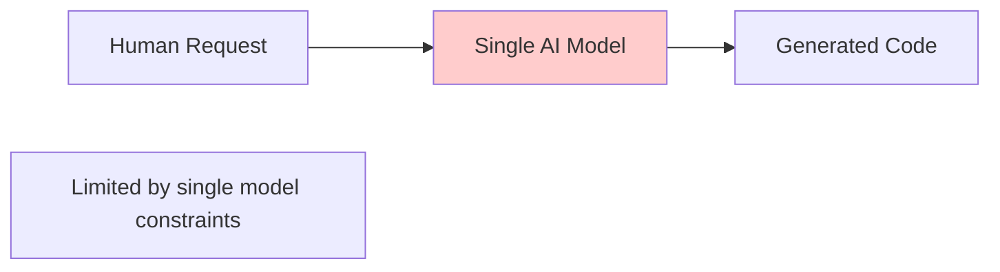
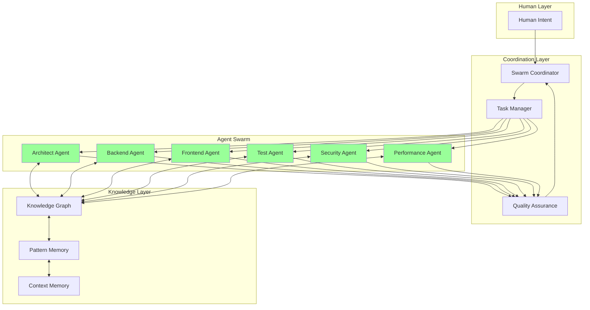
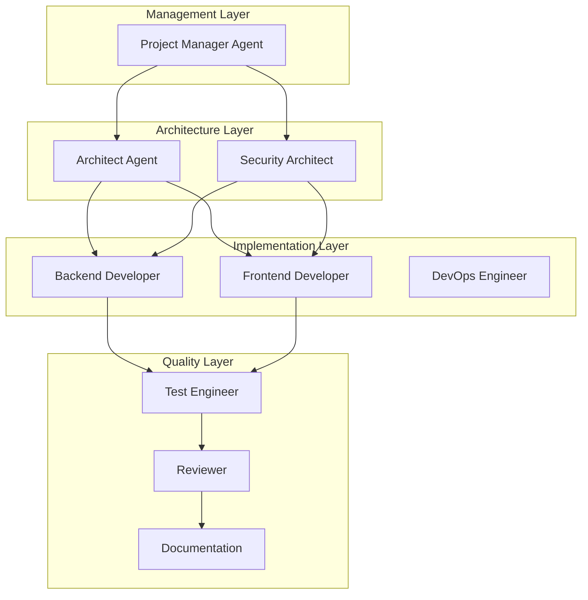
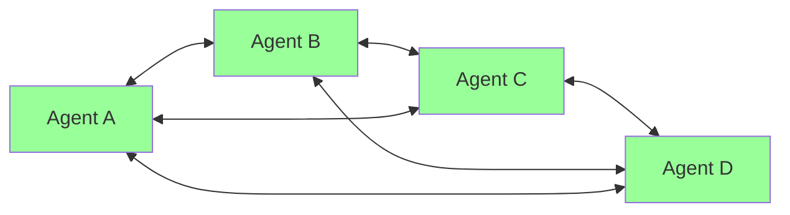

# Claude-Flow Integration

> *"The future of development is not a single AI writing code—it's an intelligent swarm of specialized agents coordinating to solve complex problems with unprecedented efficiency and quality."*

## Introduction to Claude-Flow

Claude-Flow represents a paradigm shift in AI-powered development. Instead of relying on a single AI model to handle all development tasks, Claude-Flow orchestrates **multiple specialized AI agents** that collaborate through sophisticated coordination protocols.

### The Swarm Intelligence Advantage

Traditional AI development follows a linear pattern:



**Claude-Flow swarm intelligence** enables parallel, specialized processing:



## Core Claude-Flow Concepts

### 1. **Agent Specialization**

Each agent in the swarm has specific expertise and responsibilities:

```typescript
interface AgentSpecification {
  type: AgentType;
  capabilities: Capability[];
  expertise: ExpertiseDomain[];
  qualityMetrics: QualityGuarantee[];
  coordinationProtocol: CoordinationRules;
}

enum AgentType {
  ARCHITECT = 'architect',        // System design and architecture
  CODER = 'coder',               // Implementation and coding
  TESTER = 'tester',             // Testing and validation
  REVIEWER = 'reviewer',         // Code review and quality
  RESEARCHER = 'researcher',     // Research and analysis
  OPTIMIZER = 'optimizer',       // Performance optimization
  DOCUMENTER = 'documenter',     // Documentation generation
  SECURITY = 'security',         // Security analysis and hardening
  COORDINATOR = 'coordinator'    // Swarm coordination and orchestration
}
```

**Agent Capability Examples:**

```typescript
const architectAgent: AgentSpecification = {
  type: AgentType.ARCHITECT,
  capabilities: [
    'system_design',
    'pattern_recognition',
    'scalability_analysis',
    'technology_selection',
    'dependency_management'
  ],
  expertise: [
    'microservices_architecture',
    'event_driven_systems',
    'domain_driven_design',
    'cloud_native_patterns',
    'api_design'
  ],
  qualityMetrics: [
    { metric: 'architectural_consistency', threshold: 0.9 },
    { metric: 'scalability_score', threshold: 0.85 },
    { metric: 'maintainability_index', threshold: 0.8 }
  ],
  coordinationProtocol: {
    inputFrom: ['researcher'],
    outputTo: ['coder', 'tester'],
    feedbackLoop: ['reviewer', 'optimizer'],
    decisionAuthority: ['architecture', 'patterns', 'tech_stack']
  }
};
```

### 2. **Swarm Topologies**

Different coordination patterns for different scenarios:

```typescript
enum SwarmTopology {
  HIERARCHICAL = 'hierarchical',  // Tree-like coordination
  MESH = 'mesh',                  // Peer-to-peer coordination
  STAR = 'star',                  // Central coordinator
  RING = 'ring',                  // Sequential processing
  ADAPTIVE = 'adaptive'           // Dynamic topology selection
}
```

**Hierarchical Topology** - Best for complex, structured projects:



**Mesh Topology** - Best for collaborative, exploratory work:



### 3. **Coordination Protocols**

Agents coordinate through sophisticated protocols:

```typescript
interface CoordinationMessage {
  from: AgentId;
  to: AgentId[];
  type: MessageType;
  payload: any;
  context: CoordinationContext;
  priority: Priority;
  expectations: ResponseExpectation[];
}

enum MessageType {
  TASK_ASSIGNMENT = 'task_assignment',
  STATUS_UPDATE = 'status_update',
  KNOWLEDGE_SHARE = 'knowledge_share',
  QUALITY_FEEDBACK = 'quality_feedback',
  COORDINATION_REQUEST = 'coordination_request',
  COMPLETION_NOTIFICATION = 'completion_notification'
}

class SwarmCoordinator {
  async orchestrateTask(task: ComplexTask): Promise<TaskResult> {
    // Analyze task complexity and requirements
    const analysis = await this.analyzeTask(task);
    
    // Select optimal swarm topology
    const topology = await this.selectTopology(analysis);
    
    // Spawn specialized agents
    const agents = await this.spawnAgents(analysis.requiredExpertise);
    
    // Configure coordination protocols
    await this.configureCoordination(agents, topology);
    
    // Execute coordinated workflow
    return this.executeCoordinatedWorkflow(task, agents);
  }
}
```

## Unjucks 2026 + Claude-Flow Integration

### Swarm-Powered Code Generation

```typescript
class UnjucksClaudeFlowIntegration {
  private swarmManager: SwarmManager;
  private knowledgeGraph: KnowledgeGraph;
  
  async generateWithSwarm(intent: GenerationIntent): Promise<GenerationResult> {
    // Initialize swarm for this generation task
    const swarm = await this.swarmManager.initializeSwarm({
      topology: this.selectOptimalTopology(intent),
      agents: this.selectRequiredAgents(intent),
      context: await this.buildGenerationContext(intent)
    });
    
    // Coordinate generation workflow
    const workflow = new GenerationWorkflow([
      {
        stage: 'analysis',
        agents: ['researcher', 'architect'],
        parallel: true,
        deliverables: ['requirements_analysis', 'architecture_design']
      },
      {
        stage: 'implementation',
        agents: ['coder', 'tester'],
        parallel: true,
        dependencies: ['analysis'],
        deliverables: ['source_code', 'test_suite']
      },
      {
        stage: 'quality_assurance',
        agents: ['reviewer', 'security', 'performance'],
        parallel: true,
        dependencies: ['implementation'],
        deliverables: ['quality_report', 'security_audit', 'performance_analysis']
      },
      {
        stage: 'documentation',
        agents: ['documenter'],
        dependencies: ['quality_assurance'],
        deliverables: ['technical_documentation', 'user_guides']
      }
    ]);
    
    return swarm.executeWorkflow(workflow);
  }
  
  private selectOptimalTopology(intent: GenerationIntent): SwarmTopology {
    const complexity = this.calculateComplexity(intent);
    const requirements = intent.requirements;
    
    if (complexity.architectural > 0.8) return SwarmTopology.HIERARCHICAL;
    if (requirements.includes('experimentation')) return SwarmTopology.MESH;
    if (complexity.coordination < 0.3) return SwarmTopology.STAR;
    
    return SwarmTopology.ADAPTIVE;
  }
  
  private selectRequiredAgents(intent: GenerationIntent): AgentType[] {
    const agents: AgentType[] = [];
    
    // Core agents always included
    agents.push(AgentType.RESEARCHER, AgentType.ARCHITECT, AgentType.CODER);
    
    // Conditional agents based on requirements
    if (intent.requirements.includes('testing')) {
      agents.push(AgentType.TESTER);
    }
    
    if (intent.requirements.includes('security')) {
      agents.push(AgentType.SECURITY);
    }
    
    if (intent.requirements.includes('performance')) {
      agents.push(AgentType.OPTIMIZER);
    }
    
    if (intent.requirements.includes('documentation')) {
      agents.push(AgentType.DOCUMENTER);
    }
    
    // Quality control
    agents.push(AgentType.REVIEWER);
    
    // Coordination
    if (agents.length > 4) {
      agents.push(AgentType.COORDINATOR);
    }
    
    return agents;
  }
}
```

### Neural Pattern Training

Claude-Flow enables sophisticated pattern learning across the swarm:

```typescript
class NeuralPatternTraining {
  async trainSwarmPatterns(
    swarm: AgentSwarm,
    trainingData: TrainingDataset
  ): Promise<TrainingResult> {
    
    // Individual agent training
    const individualResults = await Promise.all(
      swarm.agents.map(agent => this.trainAgentPatterns(agent, trainingData))
    );
    
    // Swarm coordination pattern training
    const coordinationResults = await this.trainCoordinationPatterns(
      swarm,
      trainingData.coordinationScenarios
    );
    
    // Cross-agent knowledge transfer
    const knowledgeTransfer = await this.facilitateKnowledgeTransfer(
      swarm,
      individualResults
    );
    
    return {
      individualPerformance: individualResults,
      coordinationEfficiency: coordinationResults,
      knowledgeTransfer: knowledgeTransfer,
      overallImprovement: this.calculateOverallImprovement(
        individualResults,
        coordinationResults
      )
    };
  }
  
  private async trainCoordinationPatterns(
    swarm: AgentSwarm,
    scenarios: CoordinationScenario[]
  ): Promise<CoordinationTrainingResult> {
    const patterns: CoordinationPattern[] = [];
    
    for (const scenario of scenarios) {
      // Simulate coordination scenario
      const result = await swarm.simulateCoordination(scenario);
      
      // Extract successful patterns
      if (result.success && result.efficiency > 0.8) {
        patterns.push(this.extractPattern(scenario, result));
      }
    }
    
    // Train neural networks on successful patterns
    return this.trainCoordinationNeuralNet(patterns);
  }
}
```

## Advanced Swarm Patterns

### 1. **Self-Healing Workflows**

Swarms can detect and recover from failures:

```typescript
class SelfHealingSwarm {
  async executeResilientWorkflow(
    workflow: Workflow,
    agents: AgentSwarm
  ): Promise<WorkflowResult> {
    
    const monitor = new SwarmMonitor();
    const healer = new SwarmHealer();
    
    try {
      return await this.executeWithMonitoring(workflow, agents, monitor);
    } catch (error) {
      if (error instanceof AgentFailure) {
        // Attempt healing
        const healingPlan = await healer.createHealingPlan(error, agents);
        await healer.executeHealing(healingPlan);
        
        // Retry with healed swarm
        return this.executeResilientWorkflow(workflow, agents);
      }
      
      throw error;
    }
  }
  
  private async executeWithMonitoring(
    workflow: Workflow,
    agents: AgentSwarm,
    monitor: SwarmMonitor
  ): Promise<WorkflowResult> {
    
    monitor.startMonitoring(agents);
    
    const result = await agents.executeWorkflow(workflow);
    
    // Check for degraded performance
    const healthReport = monitor.getHealthReport();
    if (healthReport.overallHealth < 0.7) {
      throw new SwarmDegradation(healthReport);
    }
    
    return result;
  }
}
```

### 2. **Dynamic Agent Spawning**

Add specialized agents as needed:

```typescript
class DynamicSwarmManager {
  async adaptSwarmToComplexity(
    task: ComplexTask,
    currentSwarm: AgentSwarm
  ): Promise<AgentSwarm> {
    
    const complexityAnalysis = await this.analyzeTaskComplexity(task);
    
    // Identify capability gaps
    const gaps = this.identifyCapabilityGaps(
      complexityAnalysis.requiredCapabilities,
      currentSwarm.capabilities
    );
    
    // Spawn additional agents for gaps
    const newAgents: Agent[] = [];
    
    for (const gap of gaps) {
      const agentType = this.mapCapabilityToAgentType(gap);
      const agent = await this.spawnSpecializedAgent(agentType, {
        context: task.context,
        requirements: gap.requirements,
        coordinationRules: this.deriveCoordinationRules(currentSwarm, agentType)
      });
      
      newAgents.push(agent);
    }
    
    // Integrate new agents into existing swarm
    return this.integrateAgents(currentSwarm, newAgents);
  }
}
```

### 3. **Quality-Driven Coordination**

Quality metrics drive swarm behavior:

```typescript
class QualityDrivenCoordinator {
  async coordinateWithQualityFocus(
    task: Task,
    agents: AgentSwarm,
    qualityTargets: QualityTargets
  ): Promise<QualityAssuredResult> {
    
    const qualityMonitor = new RealTimeQualityMonitor(qualityTargets);
    
    // Execute with continuous quality monitoring
    const execution = this.executeWithQualityGates(task, agents, qualityMonitor);
    
    // Adapt coordination based on quality feedback
    for await (const progress of execution) {
      const qualityScore = await qualityMonitor.assessProgress(progress);
      
      if (qualityScore.overall < qualityTargets.minimum) {
        // Adjust coordination strategy
        await this.adjustCoordination(agents, qualityScore.weakAreas);
      }
      
      if (qualityScore.individual.some(score => score < qualityTargets.agentMinimum)) {
        // Provide targeted agent assistance
        await this.provideAgentAssistance(agents, qualityScore.individual);
      }
    }
    
    return execution.result;
  }
}
```

## Performance Optimization

### Parallel Agent Execution

```typescript
class ParallelExecutionOptimizer {
  async optimizeParallelExecution(
    tasks: Task[],
    agents: AgentSwarm
  ): Promise<ExecutionPlan> {
    
    // Build dependency graph
    const dependencyGraph = this.buildDependencyGraph(tasks);
    
    // Identify parallelizable task groups
    const parallelGroups = this.identifyParallelGroups(dependencyGraph);
    
    // Assign agents to maximize parallelism
    const agentAssignments = this.optimizeAgentAssignments(
      parallelGroups,
      agents.capabilities
    );
    
    // Create execution plan
    return {
      phases: parallelGroups.map((group, index) => ({
        phaseId: index,
        tasks: group,
        agentAssignments: agentAssignments[index],
        estimatedDuration: this.estimatePhaseDuration(group, agentAssignments[index]),
        parallelism: group.length
      })),
      totalEstimatedDuration: this.calculateTotalDuration(parallelGroups),
      parallelismRatio: this.calculateParallelismRatio(tasks, parallelGroups)
    };
  }
}
```

This integration of Claude-Flow with Unjucks 2026 creates an unprecedented development environment where intelligent agents collaborate to produce high-quality code with minimal human intervention while maintaining full human control over the creative and strategic aspects of development.

---

**Next:** [Swarm Coordination](./swarm-coordination.md) - Deep dive into agent coordination protocols and strategies →