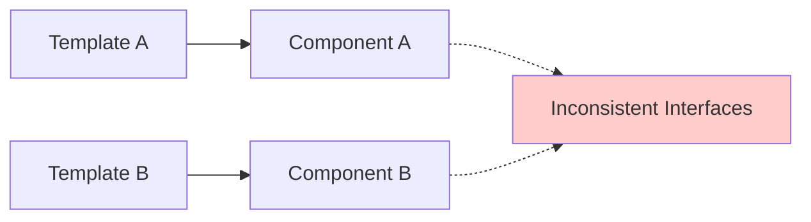
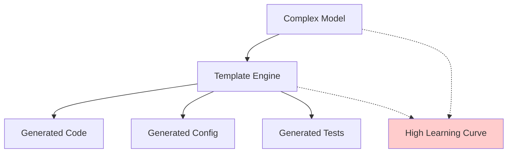
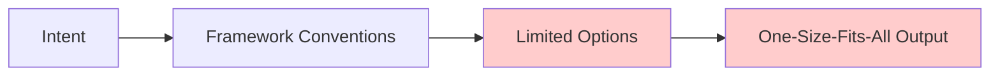
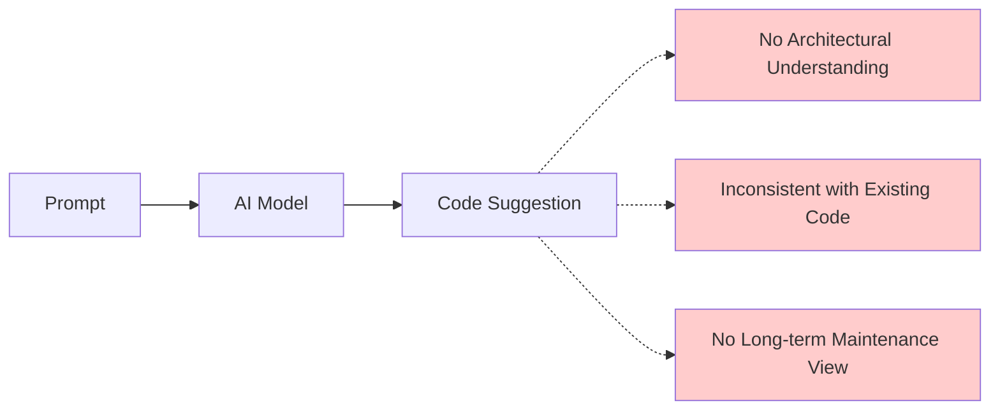
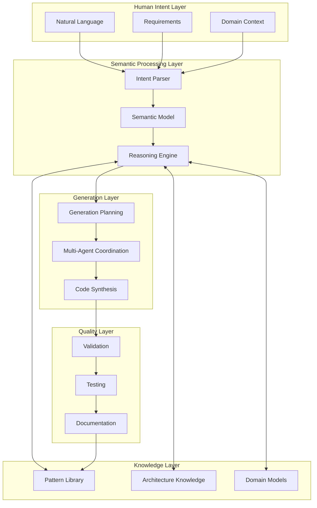
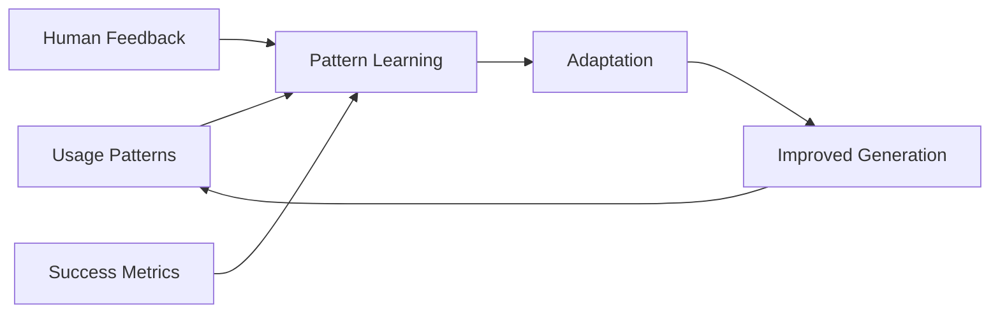
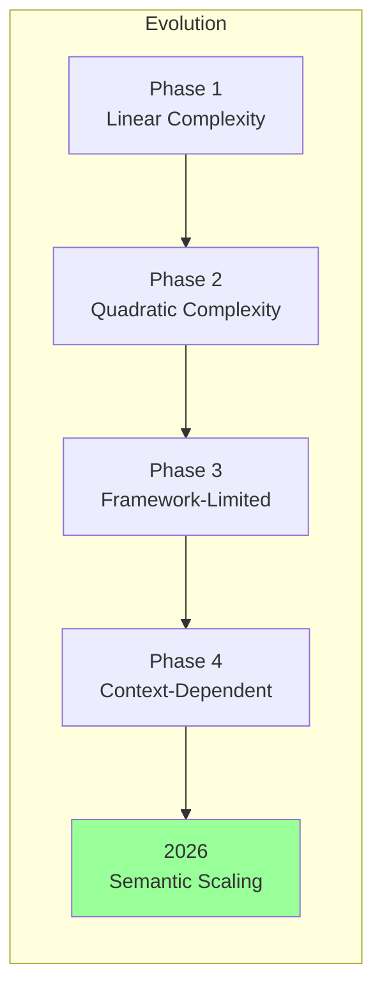
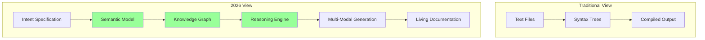

# Evolution of Code Generation

> *"Understanding where we've been illuminates where we're going. The evolution of code generation reflects our growing understanding of software as a knowledge representation problem rather than a text manipulation challenge."*

## The Historical Context

Code generation has evolved through distinct phases, each representing a fundamental shift in how we conceptualize the relationship between human intent and machine-executable code.

### Phase 1: Static Templates (1990s-2000s)
The earliest code generators were simple text replacement systems:

```bash
# Early template-based generation
sed 's/{{CLASS_NAME}}/UserService/g' template.java > UserService.java
```

**Characteristics:**
- **Static substitution** of variables in templates
- **File-by-file** generation with no cross-file awareness
- **Manual coordination** between related components
- **Limited reusability** beyond specific use cases

**Legacy Systems:**
- Early J2EE code generators
- Database-driven CRUD generators
- Simple scaffolding tools

### Phase 2: Model-Driven Architecture (2000s-2010s)
Introduction of formal models to drive generation:

```xml
<!-- UML/XML-based model definitions -->
<class name="User">
  <property name="id" type="String" required="true"/>
  <property name="email" type="String" required="true"/>
  <relationship name="orders" type="OneToMany" target="Order"/>
</class>
```

**Advances:**
- **Model-centric approach** with formal specifications
- **Cross-cutting concerns** handling (validation, persistence)
- **Consistency** across generated components
- **Tool ecosystems** around specific modeling approaches

**Representative Technologies:**
- Eclipse Modeling Framework (EMF)
- Microsoft T4 Templates
- AndroMDA
- OpenArchitectureWare

### Phase 3: Convention-Based Frameworks (2010s-2020s)
Smart defaults and convention-over-configuration:

```javascript
// Rails-style generators with conventions
rails generate model User email:string name:string
rails generate controller Users index show create update destroy
```

**Innovation:**
- **Convention-driven** generation with smart defaults
- **Framework integration** with runtime behavior
- **Incremental generation** and updates
- **Developer experience** focus

**Examples:**
- Ruby on Rails generators
- Angular CLI
- Create React App
- Spring Boot starters

### Phase 4: AI-Assisted Generation (2020s-Present)
Large language models revolutionize code creation:

```bash
# AI-powered generation from natural language
copilot suggest "function that validates email addresses with regex"
chatgpt generate "React component for user profile with form validation"
```

**Breakthrough:**
- **Natural language** to code translation
- **Context awareness** from existing codebase
- **Pattern recognition** from training data
- **Real-time assistance** during development

**Current Tools:**
- GitHub Copilot
- ChatGPT/Claude for coding
- TabNine
- Replit Ghostwriter

## The Limitations We've Encountered

Each phase solved problems but introduced new challenges:

### Static Templates: The Consistency Problem


**Issues:**
- Components generated from different templates were inconsistent
- No understanding of relationships between components
- Manual effort required to maintain coherence

### Model-Driven: The Complexity Problem


**Issues:**
- Models became as complex as the code they generated
- Tool vendor lock-in
- Limited flexibility for edge cases

### Convention-Based: The Rigidity Problem


**Issues:**
- Great for common cases, inflexible for unique requirements
- Framework-specific knowledge required
- Difficulty customizing beyond predefined patterns

### AI-Assisted: The Context Problem


**Issues:**
- Limited understanding of broader system architecture
- Suggestions may conflict with existing patterns
- No consideration of long-term maintainability

## The 2026 Synthesis: Semantic Intelligence

Unjucks 2026 represents a synthesis of all previous approaches, enhanced with semantic understanding:



### Key Evolutionary Advances

**1. Semantic Understanding**
Unlike previous approaches that manipulated text or followed rigid rules, Unjucks 2026 understands the *meaning* of code:

```typescript
// Traditional approach: Text manipulation
const template = `class {{className}} extends {{baseClass}} {}`;

// Unjucks 2026 approach: Semantic modeling
const componentSpec = {
  type: 'class',
  name: '{{className}}',
  semantics: {
    purpose: 'domain_entity',
    patterns: ['active_record', 'validation'],
    relationships: [{
      type: 'inheritance',
      target: '{{baseClass}}',
      semantics: 'is_a_relationship'
    }],
    context: {
      domain: 'user_management',
      bounded_context: 'authentication',
      architectural_layer: 'domain'
    }
  }
};
```

**2. Multi-Modal Intelligence**
Integration of multiple AI capabilities:

- **Language Models** for natural language understanding
- **Code Models** for programming pattern recognition
- **Knowledge Graphs** for relationship reasoning
- **Neural Networks** for pattern learning and adaptation

**3. Collaborative Agent Architecture**
Instead of a single generation process, coordinate multiple specialized agents:

```typescript
interface GenerationOrchestration {
  agents: {
    analyst: 'Requirements analysis and domain modeling',
    architect: 'System design and pattern selection',
    implementer: 'Code generation and implementation',
    validator: 'Quality assurance and testing',
    documenter: 'Documentation and knowledge capture'
  };
  
  coordination: {
    topology: 'hierarchical' | 'mesh' | 'pipeline',
    communication: 'shared_memory' | 'message_passing',
    consensus: 'majority_vote' | 'expert_authority' | 'quality_weighted'
  };
}
```

**4. Continuous Learning and Adaptation**
The system improves through usage:



## Measuring the Evolution

### Complexity Handling


### Quality Metrics Over Time
| Metric | Phase 1 | Phase 2 | Phase 3 | Phase 4 | 2026 |
|--------|---------|---------|---------|---------|------|
| Consistency | 30% | 70% | 85% | 60% | 95% |
| Maintainability | 40% | 60% | 80% | 65% | 90% |
| Adaptability | 20% | 40% | 30% | 80% | 95% |
| Context Awareness | 10% | 30% | 60% | 70% | 95% |
| Learning Capability | 0% | 10% | 20% | 60% | 90% |

### Developer Productivity Impact
```typescript
interface ProductivityMetrics {
  timeToFirstWorking: {
    phase1: '2-4 hours',    // Manual template customization
    phase2: '1-2 hours',    // Model setup and generation
    phase3: '15-30 minutes', // Convention-based scaffolding
    phase4: '5-15 minutes',  // AI-assisted generation
    phase5: '2-5 minutes'    // Intent-to-working-code
  };
  
  maintenanceOverhead: {
    phase1: '40% of development time',
    phase2: '25% of development time',
    phase3: '15% of development time',
    phase4: '20% of development time', // Inconsistency issues
    phase5: '5% of development time'   // Semantic consistency
  };
  
  knowledgeTransfer: {
    phase1: 'Documentation-dependent',
    phase2: 'Model-dependent',
    phase3: 'Convention-dependent',
    phase4: 'Context-dependent',
    phase5: 'Self-documenting'
  };
}
```

## The Paradigm Shift

### From Text to Meaning
The fundamental shift in Unjucks 2026 is treating code as **structured knowledge** rather than **formatted text**:



### From Generation to Orchestration
Instead of generating isolated artifacts, we orchestrate the creation of coherent systems:

```typescript
// Traditional: Generate individual files
generate('UserController.js', userControllerTemplate, userData);
generate('UserService.js', userServiceTemplate, userData);
generate('UserModel.js', userModelTemplate, userData);

// 2026: Orchestrate system creation
orchestrate({
  intent: 'Create user management system with CRUD operations',
  context: {
    architecture: 'hexagonal',
    patterns: ['repository', 'service_layer', 'dto'],
    constraints: ['security', 'audit_logging', 'performance']
  },
  agents: ['architect', 'implementer', 'tester', 'documenter']
});
```

This evolutionary foundation sets the stage for understanding how Unjucks 2026 implements these advances in practice, starting with the architectural decisions that make semantic code generation possible.

---

**Next:** [The 2026 Landscape](./landscape-2026.md) - Understanding the current technological ecosystem →