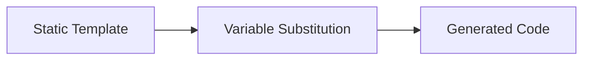
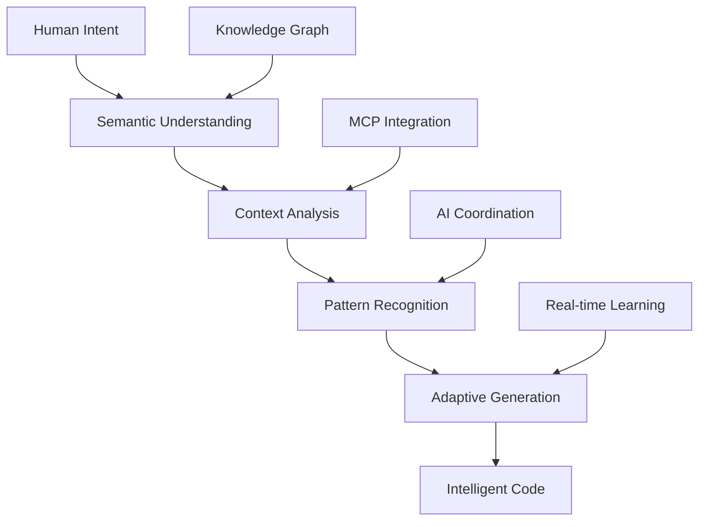
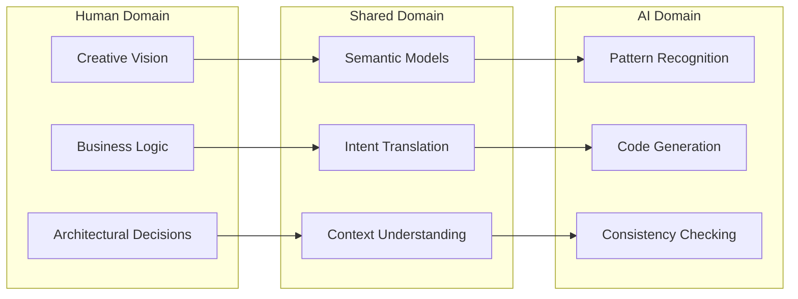
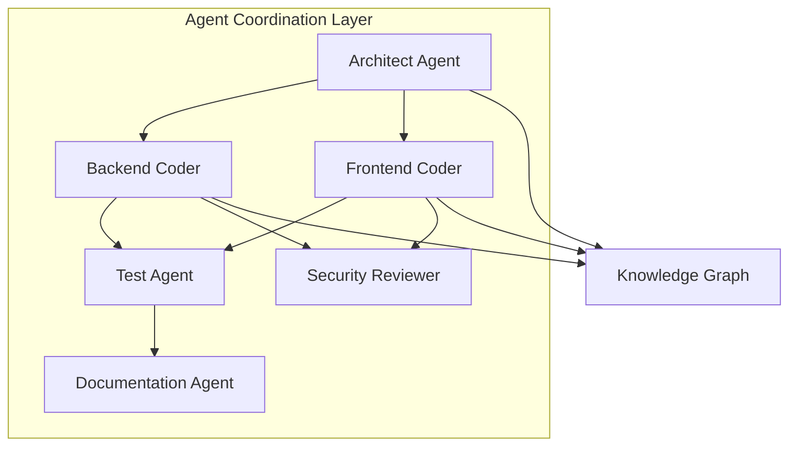

# Vision & Philosophy

> *"Code generation in 2026 is not about replacing human creativity—it's about amplifying human intent through intelligent automation that understands context, meaning, and purpose."*

## The Paradigm Shift

The landscape of software development has undergone a fundamental transformation. We've moved beyond simple templating systems and basic code scaffolding into an era where **intelligent code generation** understands not just syntax, but semantics, intent, and architectural patterns.

### From Templates to Intelligence

Traditional code generation followed a predictable pattern:



**Unjucks 2026** represents a quantum leap forward:



## Core Philosophical Principles

### 1. **Semantic-First Development**

Code is not just text—it's structured knowledge with meaning, relationships, and intent. Unjucks 2026 treats code generation as a **knowledge transformation process** rather than simple text substitution.

```javascript
// Traditional approach: Text-based templates
const template = `
class {{className}} {
  constructor({{params}}) {
    {{assignments}}
  }
}
`;

// Unjucks 2026 approach: Semantic understanding
const semanticIntent = {
  type: 'class_definition',
  domain: 'user_management',
  patterns: ['domain_entity', 'validation', 'persistence'],
  relationships: ['extends:BaseEntity', 'implements:Validatable'],
  context: 'enterprise_application'
};
```

**Why this matters:**
- Generated code understands its **purpose and context**
- Automatic **consistency** across related components
- **Intelligent refactoring** when requirements change
- **Living documentation** that stays synchronized

### 2. **Human-AI Collaborative Intelligence**

We don't replace human judgment—we amplify it. The optimal development flow combines:

- **Human Creativity**: Architecture decisions, business logic, creative problem-solving
- **AI Precision**: Pattern recognition, consistency enforcement, boilerplate elimination
- **Semantic Coordination**: Shared understanding of intent and context



### 3. **Context-Aware Adaptation**

Every project is unique. Unjucks 2026 adapts its generation patterns based on:

- **Project Architecture**: Microservices, monolith, serverless, etc.
- **Technology Stack**: React/Vue/Angular, Node.js/Python/Go, SQL/NoSQL
- **Domain Context**: E-commerce, healthcare, finance, gaming
- **Team Patterns**: Coding standards, naming conventions, structural preferences
- **Organizational Requirements**: Compliance, security, performance standards

### 4. **Evolutionary Learning**

The system improves through use:

```typescript
interface EvolutionaryLearning {
  patternDiscovery: {
    // Learn new patterns from successful code
    extractPatterns: (codebase: Codebase) => Pattern[];
    validatePatterns: (pattern: Pattern) => QualityScore;
    integratePatterns: (pattern: Pattern) => void;
  };
  
  contextualAdaptation: {
    // Adapt to specific project context
    analyzeContext: (project: Project) => Context;
    customizeGeneration: (context: Context) => GenerationRules;
    refineThroughFeedback: (feedback: Feedback) => void;
  };
  
  qualityImprovement: {
    // Continuously improve output quality
    measureQuality: (generatedCode: Code) => QualityMetrics;
    identifyImprovement: (metrics: QualityMetrics) => ImprovementPlan;
    applyImprovement: (plan: ImprovementPlan) => void;
  };
}
```

## The 2026 Development Experience

### Intelligent Code Conversations

Imagine describing your intent in natural language and watching it transform into production-ready code:

```bash
# Natural language to semantic intent
$ unjucks generate "Create a user authentication system with JWT, role-based 
  permissions, and audit logging for a Node.js microservice architecture"

# System analyzes intent and generates:
✓ JWT authentication middleware with refresh token rotation
✓ Role-based access control with hierarchical permissions  
✓ Audit logging with structured events and correlation IDs
✓ OpenAPI documentation with security schemas
✓ Integration tests with realistic scenarios
✓ Deployment configurations for Docker and Kubernetes
✓ Monitoring and alerting configurations
```

### Semantic Web Integration

Your code becomes part of a broader knowledge ecosystem:

```turtle
@prefix unjucks: <https://unjucks.dev/ontology#> .
@prefix code: <https://schema.org/SoftwareSourceCode> .

:UserAuthenticationSystem a unjucks:GeneratedSystem ;
    code:programmingLanguage "TypeScript" ;
    unjucks:domainContext :WebApplicationSecurity ;
    unjucks:implements :JWTAuthentication, :RBAC, :AuditLogging ;
    unjucks:compatibleWith :NodeJSMicroservices ;
    unjucks:qualityScore 0.94 ;
    unjucks:generatedAt "2026-01-15T10:30:00Z" .
```

### Multi-Agent Orchestration

Complex generation tasks are handled by coordinated AI agents:



Each agent brings specialized knowledge:
- **Architect**: System design patterns, scalability considerations
- **Backend Coder**: API design, data modeling, business logic
- **Frontend Coder**: UI patterns, user experience, accessibility
- **Test Agent**: Testing strategies, edge cases, performance scenarios
- **Documentation Agent**: API docs, user guides, architectural decisions
- **Security Reviewer**: Vulnerability patterns, compliance requirements

## Vision Outcomes

By embracing this philosophical foundation, Unjucks 2026 enables:

### **Developer Productivity**
- **10x faster** initial development through intelligent scaffolding
- **90% reduction** in boilerplate code maintenance
- **Instant consistency** across team and organizational standards

### **Code Quality**
- **Semantic correctness** through understanding, not just syntax
- **Automatic best practices** application
- **Living documentation** that evolves with code

### **System Intelligence**
- **Self-documenting** architectures through semantic metadata
- **Intelligent refactoring** that understands business logic
- **Proactive optimization** suggestions based on usage patterns

### **Team Collaboration**
- **Shared vocabulary** through semantic models
- **Knowledge transfer** through intelligent code generation
- **Onboarding acceleration** through contextual guidance

## The Path Forward

This vision guides every design decision in Unjucks 2026:

1. **Semantic-first architecture** that treats code as structured knowledge
2. **Human-AI collaboration** that amplifies creativity rather than replacing it  
3. **Context-aware adaptation** that understands project-specific needs
4. **Evolutionary learning** that improves through use
5. **Ecosystem integration** that connects with modern development tools

The next chapter explores how this vision manifests in the practical architecture of Unjucks 2026.

---

**Next:** [Evolution of Code Generation](./evolution.md) - Understanding how we arrived at this paradigm →