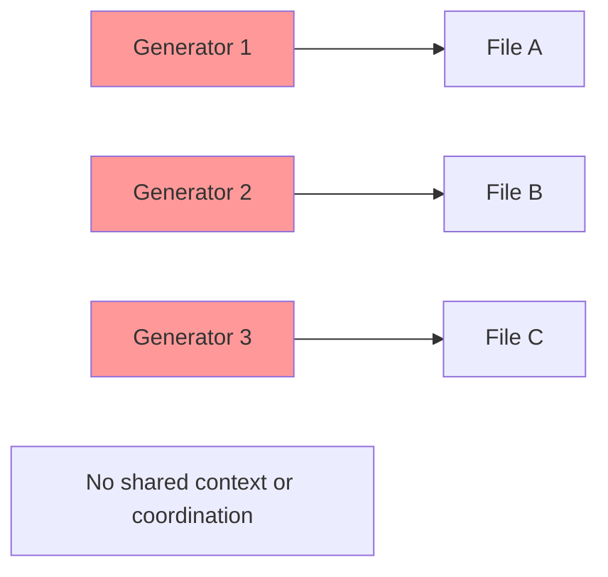
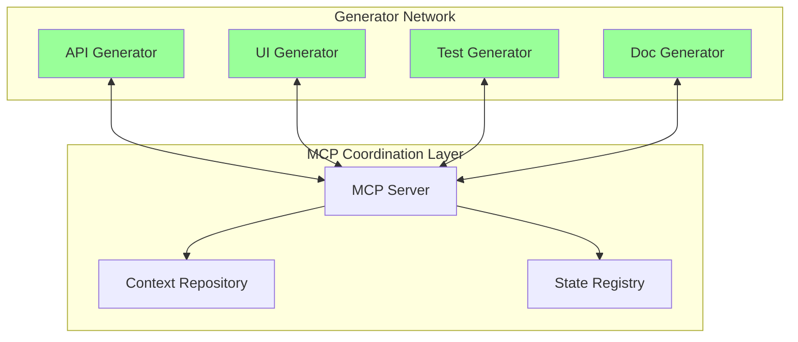
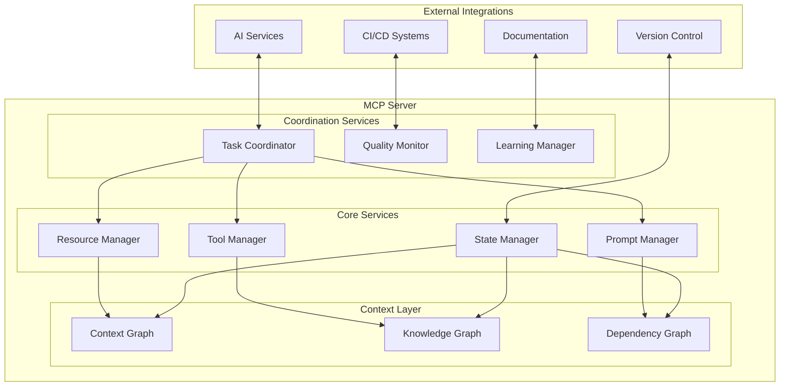

# MCP Fundamentals

> *"The Model Context Protocol represents the connective tissue that enables AI systems to coordinate, share knowledge, and work together seamlessly—transforming isolated tools into a coherent development ecosystem."*

## Understanding the Model Context Protocol (MCP)

The Model Context Protocol (MCP) is not just another API specification—it's a **coordination framework** that enables multiple AI systems, tools, and services to work together with shared context and understanding.

### Why MCP Matters for Code Generation

Traditional code generation operates in isolation:



**MCP-enabled generation** creates a coordinated ecosystem:



## Core MCP Concepts

### 1. **Resources and Context**

MCP treats everything as a **resource** with **context**:

```typescript
interface MCPResource {
  uri: string;              // Unique resource identifier
  name: string;             // Human-readable name
  description?: string;     // Resource description
  mimeType?: string;       // Content type
  metadata: {              // Rich context information
    domain: string;        // Business domain
    patterns: string[];    // Architectural patterns
    dependencies: string[]; // Resource dependencies
    quality: QualityMetrics;
    timestamp: Date;
    version: string;
  };
}
```

**Example:** A user authentication API endpoint as an MCP resource:

```json
{
  "uri": "unjucks://api/auth/login",
  "name": "User Login Endpoint",
  "description": "JWT-based authentication endpoint with rate limiting",
  "mimeType": "application/typescript",
  "metadata": {
    "domain": "user_management",
    "patterns": ["jwt_auth", "rate_limiting", "input_validation"],
    "dependencies": ["unjucks://models/User", "unjucks://middleware/auth"],
    "quality": {
      "testCoverage": 0.95,
      "securityScore": 0.88,
      "performanceRating": "A"
    },
    "timestamp": "2026-01-15T10:30:00Z",
    "version": "1.2.0"
  }
}
```

### 2. **Tools and Operations**

MCP **tools** are operations that can be performed on resources:

```typescript
interface MCPTool {
  name: string;
  description: string;
  inputSchema: JSONSchema;
  outputSchema: JSONSchema;
  
  // Enhanced capabilities for code generation
  semanticCapabilities: {
    understands: string[];    // What patterns it recognizes
    produces: string[];       // What it can generate
    requires: string[];       // What context it needs
  };
  
  qualityGuarantees: {
    consistency: number;      // 0-1 consistency score
    completeness: number;     // 0-1 completeness score
    correctness: number;      // 0-1 correctness score
  };
}
```

**Example:** A React component generation tool:

```json
{
  "name": "generate_react_component",
  "description": "Generate React component with TypeScript, tests, and stories",
  "semanticCapabilities": {
    "understands": ["ui_patterns", "react_conventions", "accessibility_requirements"],
    "produces": ["tsx_component", "unit_tests", "storybook_stories", "documentation"],
    "requires": ["component_spec", "design_system", "project_context"]
  },
  "qualityGuarantees": {
    "consistency": 0.92,
    "completeness": 0.89,
    "correctness": 0.94
  }
}
```

### 3. **Prompts and Intent**

MCP **prompts** capture human intent and translate it into machine-actionable instructions:

```typescript
interface MCPPrompt {
  name: string;
  description: string;
  
  // Semantic intent structure
  intent: {
    goal: string;           // High-level objective
    constraints: string[];  // Requirements and limitations
    context: Context;       // Situational information
    preferences: Preferences; // Stylistic and technical preferences
  };
  
  // Template for execution
  template: string;
  variables: Variable[];
  
  // Learning and improvement
  successMetrics: Metric[];
  feedbackLoop: FeedbackConfiguration;
}
```

## MCP Architecture in Unjucks 2026

### Server Architecture



### Client Integration

Unjucks 2026 acts as both an MCP **client** (consuming services) and **server** (providing generation capabilities):

```typescript
class UnjucksMCPIntegration {
  private client: MCPClient;
  private server: MCPServer;
  
  constructor() {
    // Initialize as MCP client
    this.client = new MCPClient({
      transports: ['stdio', 'http', 'websocket'],
      capabilities: ['resources', 'tools', 'prompts', 'sampling']
    });
    
    // Initialize as MCP server
    this.server = new MCPServer({
      name: 'unjucks-generator',
      version: '2026.1.0',
      capabilities: this.getGenerationCapabilities()
    });
  }
  
  // Consume external MCP services
  async consumeExternalServices(): Promise<void> {
    const availableServers = await this.client.discoverServers();
    
    for (const server of availableServers) {
      if (server.capabilities.includes('code_analysis')) {
        await this.integrateCodeAnalysisServer(server);
      }
      
      if (server.capabilities.includes('semantic_modeling')) {
        await this.integrateSemanticServer(server);
      }
    }
  }
  
  // Provide generation capabilities to others
  private getGenerationCapabilities(): MCPCapabilities {
    return {
      resources: [
        'templates', 'patterns', 'configurations',
        'generated_code', 'documentation', 'tests'
      ],
      tools: [
        'generate_component', 'scaffold_project', 'create_api',
        'generate_tests', 'create_documentation', 'refactor_code'
      ],
      prompts: [
        'describe_intent', 'specify_requirements', 'provide_context',
        'configure_generation', 'review_output', 'refine_result'
      ]
    };
  }
}
```

## Practical MCP Implementation

### 1. **Resource Discovery and Management**

```typescript
// Discover available resources across the MCP network
const resourceDiscovery = async (): Promise<MCPResource[]> => {
  const servers = await mcpClient.listServers();
  const allResources: MCPResource[] = [];
  
  for (const server of servers) {
    const resources = await server.listResources({
      filters: {
        domain: 'code_generation',
        patterns: ['api', 'ui', 'database'],
        quality: { min: 0.8 }
      }
    });
    
    allResources.push(...resources);
  }
  
  return allResources.sort((a, b) => 
    b.metadata.quality.overall - a.metadata.quality.overall
  );
};
```

### 2. **Tool Orchestration**

```typescript
// Orchestrate multiple tools for complex generation
const orchestrateGeneration = async (intent: GenerationIntent): Promise<GenerationResult> => {
  const orchestrator = new MCPToolOrchestrator();
  
  // Analyze intent and plan tool usage
  const plan = await orchestrator.planExecution(intent);
  
  // Execute tools in coordinated manner
  const results = await orchestrator.executeParallel([
    {
      tool: 'analyze_requirements',
      input: intent.requirements,
      dependencies: []
    },
    {
      tool: 'generate_api',
      input: intent.api_spec,
      dependencies: ['analyze_requirements']
    },
    {
      tool: 'generate_tests',
      input: intent.test_requirements,
      dependencies: ['generate_api']
    },
    {
      tool: 'generate_documentation',
      input: intent.doc_requirements,
      dependencies: ['generate_api', 'generate_tests']
    }
  ]);
  
  return orchestrator.synthesizeResults(results);
};
```

### 3. **Context Sharing and State Management**

```typescript
// Share context across multiple generation sessions
class MCPContextManager {
  private contextGraph: ContextGraph;
  
  async shareContext(context: GenerationContext): Promise<void> {
    // Store context in MCP-compatible format
    const mcpResource: MCPResource = {
      uri: `unjucks://context/${context.id}`,
      name: context.name,
      description: context.description,
      mimeType: 'application/json',
      metadata: {
        domain: context.domain,
        patterns: context.patterns,
        dependencies: context.dependencies,
        timestamp: new Date(),
        version: context.version
      }
    };
    
    await this.contextGraph.addResource(mcpResource);
    
    // Notify other MCP participants
    await this.broadcastContextUpdate(mcpResource);
  }
  
  async retrieveContext(contextId: string): Promise<GenerationContext> {
    const resource = await this.contextGraph.getResource(
      `unjucks://context/${contextId}`
    );
    
    return this.deserializeContext(resource);
  }
}
```

## Benefits of MCP Integration

### **1. Coordinated Generation**
- Multiple generators work together seamlessly
- Shared understanding of project context and requirements
- Consistent patterns across all generated code

### **2. Knowledge Accumulation**
- Learning from successful generation patterns
- Building organizational knowledge bases
- Continuous improvement through feedback loops

### **3. Tool Ecosystem**
- Integration with external development tools
- Extensible architecture for new capabilities
- Standardized interfaces for tool communication

### **4. Quality Assurance**
- Automated quality checks across the generation pipeline
- Consistency validation between related components
- Performance monitoring and optimization

## Getting Started with MCP

The next sections will dive deep into specific MCP integration patterns, from basic resource management to advanced multi-server orchestration scenarios.

---

**Next:** [Protocol Overview](./protocol.md) - Understanding MCP message flows and communication patterns →