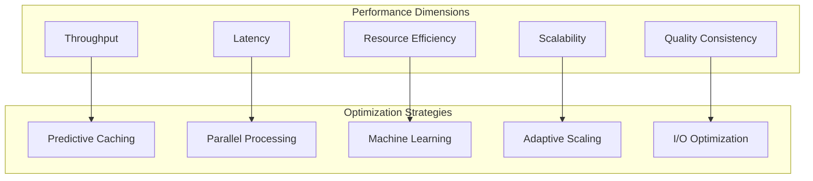

# Optimization Strategies

> *"Performance in code generation isn't just about speed—it's about intelligent resource utilization, predictive caching, and adaptive scaling that grows with your development needs."*

## The Performance Imperative

As development teams scale and codebases grow, code generation performance becomes critical to developer productivity. Unjucks 2026 implements sophisticated optimization strategies that go beyond simple caching to create truly intelligent performance characteristics.

### Performance Dimensions

Modern code generation performance must be optimized across multiple dimensions:



## Intelligent Caching Strategies

### Multi-Level Caching Architecture

Unjucks 2026 implements a sophisticated multi-level caching system:

```typescript
interface CacheArchitecture {
  levels: {
    l1_memory: {
      type: 'in-memory',
      scope: 'process',
      size: '256MB',
      ttl: '15min',
      eviction: 'lru'
    },
    l2_semantic: {
      type: 'semantic-graph',
      scope: 'project',
      size: '1GB',
      ttl: '4hours',
      eviction: 'semantic-relevance'
    },
    l3_distributed: {
      type: 'redis-cluster',
      scope: 'team',
      size: '10GB',
      ttl: '24hours',
      eviction: 'usage-prediction'
    },
    l4_persistent: {
      type: 'filesystem',
      scope: 'global',
      size: 'unlimited',
      ttl: '7days',
      eviction: 'quality-weighted'
    }
  }
}
```

### Semantic-Aware Caching

Traditional caching misses opportunities for semantic reuse:

```typescript
class SemanticCache {
  private graph: KnowledgeGraph;
  private patterns: PatternMatcher;
  
  async getCachedGeneration(intent: GenerationIntent): Promise<CacheResult> {
    // Exact match (traditional caching)
    const exactMatch = await this.findExactMatch(intent);
    if (exactMatch) return { hit: true, source: 'exact', data: exactMatch };
    
    // Semantic similarity match
    const semanticMatch = await this.findSemanticMatch(intent);
    if (semanticMatch.similarity > 0.85) {
      const adapted = await this.adaptCachedResult(semanticMatch, intent);
      return { hit: true, source: 'semantic', data: adapted, confidence: semanticMatch.similarity };
    }
    
    // Pattern-based prediction
    const patternMatch = await this.predictFromPatterns(intent);
    if (patternMatch.confidence > 0.8) {
      return { hit: 'predictive', source: 'pattern', data: patternMatch };
    }
    
    return { hit: false };
  }
  
  private async findSemanticMatch(intent: GenerationIntent): Promise<SemanticMatch> {
    const intentVector = await this.vectorizeIntent(intent);
    
    // Query semantic graph for similar intents
    const query = `
      PREFIX unjucks: <https://unjucks.dev/ontology#>
      
      SELECT ?cachedIntent ?similarity WHERE {
        ?cachedIntent unjucks:hasVector ?vector .
        ?cachedIntent unjucks:hasResult ?result .
        
        BIND(unjucks:cosineSimilarity(?vector, "${intentVector}") AS ?similarity)
        
        FILTER(?similarity > 0.7)
      }
      ORDER BY DESC(?similarity)
      LIMIT 5
    `;
    
    const results = await this.graph.query(query);
    return results[0] || { similarity: 0 };
  }
}
```

### Predictive Caching with ML

Machine learning models predict what will be generated next:

```typescript
class PredictiveCache {
  private model: TensorFlowModel;
  private trainingData: GenerationHistory;
  
  async trainPredictionModel(): Promise<void> {
    // Prepare training data from generation history
    const features = await this.extractFeatures(this.trainingData);
    const labels = await this.extractLabels(this.trainingData);
    
    // Train sequence-to-sequence model
    await this.model.fit(features, labels, {
      epochs: 100,
      batchSize: 32,
      validationSplit: 0.2,
      callbacks: {
        onEpochEnd: (epoch, logs) => {
          console.log(`Epoch ${epoch}: loss = ${logs.loss}, accuracy = ${logs.accuracy}`);
        }
      }
    });
  }
  
  async predictNext(context: GenerationContext): Promise<PredictionResult[]> {
    const contextVector = await this.vectorizeContext(context);
    const predictions = await this.model.predict(contextVector);
    
    return predictions.map((pred, index) => ({
      template: pred.template,
      variables: pred.variables,
      probability: pred.confidence,
      estimatedBenefit: this.calculateCacheBenefit(pred),
      priority: pred.confidence * this.calculateCacheBenefit(pred)
    })).sort((a, b) => b.priority - a.priority);
  }
  
  async preloadPredicted(predictions: PredictionResult[]): Promise<void> {
    // Pre-generate high-probability predictions
    const highProbability = predictions.filter(p => p.probability > 0.8);
    
    await Promise.all(
      highProbability.map(async (prediction) => {
        try {
          const result = await this.generator.generate(
            prediction.template,
            prediction.variables,
            { background: true, priority: 'low' }
          );
          
          await this.cache.store(prediction, result, {
            source: 'predictive',
            confidence: prediction.probability,
            benefit: prediction.estimatedBenefit
          });
        } catch (error) {
          // Log prediction miss for model improvement
          await this.logPredictionMiss(prediction, error);
        }
      })
    );
  }
}
```

## Parallel Processing Optimization

### Agent-Level Parallelism

Different agents can work simultaneously on different aspects:

```typescript
class ParallelGenerationOrchestrator {
  async optimizeParallelExecution(task: GenerationTask): Promise<ExecutionPlan> {
    // Analyze task for parallelizable components
    const analysis = await this.analyzeTaskComplexity(task);
    
    // Build dependency graph
    const dependencies = this.buildDependencyGraph(analysis);
    
    // Identify parallel execution opportunities
    const parallelGroups = this.identifyParallelGroups(dependencies);
    
    // Optimize resource allocation
    const resourcePlan = await this.optimizeResourceAllocation(parallelGroups);
    
    return {
      phases: parallelGroups.map((group, index) => ({
        phase: index + 1,
        agents: group.agents,
        tasks: group.tasks,
        estimatedDuration: group.duration,
        resourceRequirements: resourcePlan[index],
        parallelism: group.parallelism
      })),
      totalEstimatedTime: this.calculateTotalTime(parallelGroups),
      resourceUtilization: this.calculateResourceUtilization(resourcePlan),
      scalabilityFactor: this.calculateScalabilityFactor(parallelGroups)
    };
  }
  
  private identifyParallelGroups(dependencies: DependencyGraph): ParallelGroup[] {
    const groups: ParallelGroup[] = [];
    const processed = new Set<string>();
    
    // Topological sort to identify parallel opportunities
    const levels = this.topologicalSort(dependencies);
    
    for (const level of levels) {
      const parallelTasks: Task[] = [];
      const requiredAgents: AgentType[] = [];
      
      for (const taskId of level) {
        if (!processed.has(taskId)) {
          const task = dependencies.getTask(taskId);
          parallelTasks.push(task);
          requiredAgents.push(...task.requiredAgents);
          processed.add(taskId);
        }
      }
      
      if (parallelTasks.length > 0) {
        groups.push({
          tasks: parallelTasks,
          agents: [...new Set(requiredAgents)],
          parallelism: parallelTasks.length,
          duration: Math.max(...parallelTasks.map(t => t.estimatedDuration))
        });
      }
    }
    
    return groups;
  }
}
```

### Template-Level Optimization

Optimize template processing itself:

```typescript
class TemplateOptimizer {
  async optimizeTemplate(template: Template): Promise<OptimizedTemplate> {
    // Static analysis of template complexity
    const complexity = await this.analyzeTemplateComplexity(template);
    
    // Identify cacheable sub-templates
    const cacheableSegments = this.identifyCacheableSegments(template);
    
    // Pre-compile frequently used expressions
    const compiledExpressions = await this.precompileExpressions(template);
    
    // Optimize variable resolution order
    const optimizedVariables = this.optimizeVariableResolution(template.variables);
    
    return {
      ...template,
      metadata: {
        ...template.metadata,
        complexity,
        optimizations: {
          cacheableSegments: cacheableSegments.length,
          compiledExpressions: compiledExpressions.length,
          variableOptimization: optimizedVariables.improvement
        }
      },
      runtime: {
        compiledExpressions,
        cacheableSegments,
        variableResolutionOrder: optimizedVariables.order,
        estimatedPerformance: this.estimatePerformance(complexity, optimizedVariables)
      }
    };
  }
  
  private identifyCacheableSegments(template: Template): CacheableSegment[] {
    const segments: CacheableSegment[] = [];
    
    // Find template segments with no dynamic variables
    const staticSegments = this.findStaticSegments(template);
    
    // Find segments with only slowly-changing variables
    const semiStaticSegments = this.findSemiStaticSegments(template);
    
    // Find repeating patterns within template
    const patterns = this.findRepeatingPatterns(template);
    
    return [
      ...staticSegments.map(s => ({ ...s, type: 'static', priority: 1 })),
      ...semiStaticSegments.map(s => ({ ...s, type: 'semi-static', priority: 2 })),
      ...patterns.map(s => ({ ...s, type: 'pattern', priority: 3 }))
    ].sort((a, b) => a.priority - b.priority);
  }
}
```

## Memory Optimization

### Smart Memory Management

```typescript
class MemoryOptimizer {
  private memoryPool: MemoryPool;
  private gcScheduler: GCScheduler;
  
  async optimizeMemoryUsage(): Promise<MemoryOptimizationResult> {
    // Analyze current memory usage patterns
    const memoryAnalysis = await this.analyzeMemoryUsage();
    
    // Implement pool-based allocation for frequently used objects
    await this.initializeObjectPools(memoryAnalysis.frequentObjects);
    
    // Schedule intelligent garbage collection
    await this.optimizeGarbageCollection(memoryAnalysis.gcPatterns);
    
    // Implement memory-aware caching
    await this.configureMemoryAwareCaching(memoryAnalysis.availableMemory);
    
    return {
      poolsCreated: this.memoryPool.getPoolCount(),
      gcOptimization: this.gcScheduler.getOptimizationLevel(),
      memorySavings: this.calculateMemorySavings(memoryAnalysis),
      performanceImpact: await this.measurePerformanceImpact()
    };
  }
  
  private async initializeObjectPools(frequentObjects: ObjectFrequency[]): Promise<void> {
    for (const obj of frequentObjects) {
      if (obj.frequency > 100 && obj.size > 1024) {
        await this.memoryPool.createPool(obj.type, {
          initialSize: Math.min(obj.frequency / 10, 100),
          maxSize: Math.min(obj.frequency / 2, 1000),
          growthFactor: 1.5,
          shrinkThreshold: 0.25
        });
      }
    }
  }
  
  private async optimizeGarbageCollection(gcPatterns: GCPattern[]): Promise<void> {
    // Analyze GC pressure patterns
    const highPressure = gcPatterns.filter(p => p.pressure > 0.8);
    
    if (highPressure.length > 0) {
      // Schedule GC during low-activity periods
      this.gcScheduler.scheduleIntelligentGC({
        lowActivityThreshold: 0.3,
        maxGCDuration: 50, // milliseconds
        adaptiveScheduling: true,
        generationalOptimization: true
      });
    }
  }
}
```

## I/O Optimization

### Asynchronous File Operations

```typescript
class IOOptimizer {
  private filePool: FileHandlePool;
  private writeQueue: WriteQueue;
  
  async optimizeFileOperations(): Promise<void> {
    // Use file handle pooling
    this.filePool = new FileHandlePool({
      maxHandles: 100,
      reuseThreshold: 3,
      cleanupInterval: 60000
    });
    
    // Implement write coalescing
    this.writeQueue = new WriteQueue({
      batchSize: 50,
      flushInterval: 1000,
      priorityLevels: 3
    });
    
    // Enable async file system operations
    await this.enableAsyncFS();
  }
  
  async writeFileOptimized(path: string, content: string, options: WriteOptions = {}): Promise<void> {
    // Check if file handle can be reused
    const handle = await this.filePool.acquireHandle(path);
    
    if (options.priority === 'immediate') {
      // Write immediately
      await handle.write(content);
      await this.filePool.releaseHandle(path, handle);
    } else {
      // Queue for batch writing
      this.writeQueue.enqueue({
        path,
        content,
        handle,
        priority: options.priority || 'normal',
        callback: options.callback
      });
    }
  }
  
  private async enableAsyncFS(): Promise<void> {
    // Use native async file operations
    const fs = await import('fs/promises');
    
    // Implement read-ahead for predictable patterns
    this.setupReadAhead();
    
    // Use memory-mapped files for large templates
    this.setupMemoryMapping();
  }
}
```

## Performance Monitoring

### Real-Time Performance Metrics

```typescript
class PerformanceMonitor {
  private metrics: PerformanceMetrics;
  private alerts: AlertManager;
  
  async startMonitoring(): Promise<void> {
    // Monitor generation performance
    this.monitorGenerationMetrics();
    
    // Monitor resource utilization
    this.monitorResourceUtilization();
    
    // Monitor cache performance
    this.monitorCachePerformance();
    
    // Setup performance alerts
    await this.setupPerformanceAlerts();
  }
  
  private monitorGenerationMetrics(): void {
    setInterval(async () => {
      const metrics = await this.collectGenerationMetrics();
      
      // Check for performance regressions
      if (metrics.averageLatency > this.baseline.latency * 1.5) {
        await this.alerts.triggerAlert('PERFORMANCE_REGRESSION', {
          current: metrics.averageLatency,
          baseline: this.baseline.latency,
          regression: (metrics.averageLatency / this.baseline.latency - 1) * 100
        });
      }
      
      // Update performance dashboard
      await this.updateDashboard(metrics);
      
    }, 10000); // Every 10 seconds
  }
  
  private async collectGenerationMetrics(): Promise<GenerationMetrics> {
    return {
      timestamp: Date.now(),
      throughput: this.calculateThroughput(),
      averageLatency: this.calculateAverageLatency(),
      p95Latency: this.calculateP95Latency(),
      cacheHitRate: this.calculateCacheHitRate(),
      resourceUtilization: await this.getResourceUtilization(),
      errorRate: this.calculateErrorRate(),
      qualityScore: this.calculateAverageQuality()
    };
  }
}
```

## Adaptive Optimization

### Self-Tuning Performance

```typescript
class AdaptiveOptimizer {
  private optimizer: MachineLearningOptimizer;
  private config: AdaptiveConfig;
  
  async enableAdaptiveOptimization(): Promise<void> {
    // Start performance learning
    await this.startPerformanceLearning();
    
    // Enable auto-tuning
    await this.enableAutoTuning();
    
    // Setup feedback loops
    await this.setupFeedbackLoops();
  }
  
  private async startPerformanceLearning(): Promise<void> {
    this.optimizer = new MachineLearningOptimizer({
      features: [
        'template_complexity',
        'variable_count',
        'output_size',
        'dependency_depth',
        'semantic_similarity'
      ],
      target: 'generation_time',
      algorithm: 'gradient_boosting'
    });
    
    // Train on historical data
    const historicalData = await this.loadHistoricalPerformanceData();
    await this.optimizer.train(historicalData);
    
    // Start online learning
    this.optimizer.enableOnlineLearning();
  }
  
  private async enableAutoTuning(): Promise<void> {
    setInterval(async () => {
      const currentPerformance = await this.getCurrentPerformance();
      const optimizationSuggestions = await this.optimizer.suggest(currentPerformance);
      
      // Apply safe optimizations automatically
      const safeOptimizations = optimizationSuggestions.filter(s => s.risk < 0.3);
      
      for (const optimization of safeOptimizations) {
        try {
          await this.applyOptimization(optimization);
          await this.measureImpact(optimization);
        } catch (error) {
          await this.rollbackOptimization(optimization);
          console.warn('Optimization failed, rolled back:', optimization.name);
        }
      }
      
    }, 300000); // Every 5 minutes
  }
}
```

These optimization strategies ensure that Unjucks 2026 maintains high performance even as it scales to handle complex enterprise workloads and sophisticated AI-powered workflows.

---

**Next:** [Template Caching](./caching.md) - Deep dive into intelligent caching mechanisms →