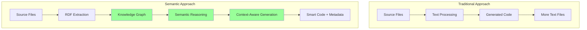

# RDF & Turtle Integration

> *"When code becomes data and data becomes knowledge, we unlock the ability to reason about our systems at a level previously impossible—creating truly intelligent development workflows."*

## The Semantic Web Revolution in Development

Traditional development tools treat code as text. **Unjucks 2026** treats code as **structured knowledge** using RDF (Resource Description Framework) and Turtle syntax to create rich, queryable representations of software systems.

### Why RDF for Code Generation?



**Benefits of the semantic approach:**

1. **Rich Relationships**: Understand how components relate to each other
2. **Inferencing**: Derive new knowledge from existing relationships
3. **Querying**: Ask complex questions about your codebase
4. **Consistency**: Maintain semantic consistency across generations
5. **Evolution**: Track how code and requirements evolve over time

## RDF Fundamentals for Developers

### Triple-Based Knowledge Representation

Every piece of knowledge is expressed as a **triple**: `Subject -> Predicate -> Object`

```turtle
# Example: A React component in RDF
@prefix unjucks: <https://unjucks.dev/ontology#> .
@prefix code: <https://schema.org/SoftwareSourceCode> .
@prefix react: <https://unjucks.dev/react#> .

:UserProfileComponent 
    a react:FunctionalComponent ;
    code:name "UserProfile" ;
    unjucks:hasProps :UserProfileProps ;
    unjucks:usesDependency :UserService, :ValidationUtils ;
    unjucks:implementsPattern :DataFetching, :ErrorHandling ;
    unjucks:generatedAt "2026-01-15T10:30:00Z"^^xsd:dateTime ;
    unjucks:qualityScore 0.92 .

:UserProfileProps
    a react:PropsInterface ;
    unjucks:hasField :userId, :displayMode ;
    unjucks:isRequired true .
```

### Ontology Design for Code Generation

Unjucks 2026 uses a comprehensive ontology to describe software systems:

```turtle
@prefix unjucks: <https://unjucks.dev/ontology#> .
@prefix rdfs: <http://www.w3.org/2000/01/rdf-schema#> .
@prefix owl: <http://www.w3.org/2002/07/owl#> .

# Core Classes
unjucks:CodeComponent a owl:Class ;
    rdfs:label "Code Component" ;
    rdfs:comment "Any generated or analyzed piece of code" .

unjucks:Pattern a owl:Class ;
    rdfs:label "Code Pattern" ;
    rdfs:comment "Reusable architectural or design pattern" .

unjucks:Context a owl:Class ;
    rdfs:label "Generation Context" ;
    rdfs:comment "Situational information for code generation" .

# Properties
unjucks:implementsPattern a owl:ObjectProperty ;
    rdfs:domain unjucks:CodeComponent ;
    rdfs:range unjucks:Pattern .

unjucks:dependsOn a owl:ObjectProperty ;
    rdfs:domain unjucks:CodeComponent ;
    rdfs:range unjucks:CodeComponent .

unjucks:hasQualityScore a owl:DatatypeProperty ;
    rdfs:domain unjucks:CodeComponent ;
    rdfs:range xsd:decimal .
```

## Turtle Integration in Practice

### 1. **Code Analysis to RDF**

Transform existing code into semantic knowledge:

```typescript
class CodeToRDFTransformer {
  private graph: Store;
  
  async analyzeTypeScriptFile(filePath: string): Promise<void> {
    const ast = this.parseTypeScript(filePath);
    const namedNode = DataFactory.namedNode;
    const literal = DataFactory.literal;
    
    // Extract components and their relationships
    for (const node of ast.statements) {
      if (ts.isClassDeclaration(node)) {
        await this.processClass(node);
      } else if (ts.isFunctionDeclaration(node)) {
        await this.processFunction(node);
      } else if (ts.isInterfaceDeclaration(node)) {
        await this.processInterface(node);
      }
    }
  }
  
  private async processClass(node: ts.ClassDeclaration): Promise<void> {
    const className = node.name?.getText() || 'Anonymous';
    const classURI = namedNode(`unjucks://component/${className}`);
    
    // Basic class information
    this.graph.add(quad(
      classURI,
      namedNode('http://www.w3.org/1999/02/22-rdf-syntax-ns#type'),
      namedNode('https://unjucks.dev/ontology#Class')
    ));
    
    this.graph.add(quad(
      classURI,
      namedNode('https://schema.org/name'),
      literal(className)
    ));
    
    // Analyze inheritance
    if (node.heritageClauses) {
      for (const heritage of node.heritageClauses) {
        if (heritage.token === ts.SyntaxKind.ExtendsKeyword) {
          const baseClass = heritage.types[0].expression.getText();
          this.graph.add(quad(
            classURI,
            namedNode('https://unjucks.dev/ontology#extends'),
            namedNode(`unjucks://component/${baseClass}`)
          ));
        }
      }
    }
    
    // Analyze methods and properties
    for (const member of node.members) {
      if (ts.isMethodDeclaration(member)) {
        await this.processMethod(classURI, member);
      } else if (ts.isPropertyDeclaration(member)) {
        await this.processProperty(classURI, member);
      }
    }
  }
}
```

### 2. **SPARQL Queries for Code Intelligence**

Query your codebase semantically:

```sparql
# Find all React components that handle user data but lack error handling
PREFIX unjucks: <https://unjucks.dev/ontology#>
PREFIX react: <https://unjucks.dev/react#>

SELECT ?component ?missingPattern WHERE {
  ?component a react:Component ;
             unjucks:handlesDataType :UserData .
  
  FILTER NOT EXISTS {
    ?component unjucks:implementsPattern :ErrorHandling
  }
  
  BIND(:ErrorHandling as ?missingPattern)
}
```

```sparql
# Find circular dependencies in the codebase
PREFIX unjucks: <https://unjucks.dev/ontology#>

SELECT ?component1 ?component2 WHERE {
  ?component1 unjucks:dependsOn+ ?component2 .
  ?component2 unjucks:dependsOn+ ?component1 .
  
  FILTER(?component1 != ?component2)
}
```

```sparql
# Identify components that would benefit from caching patterns
PREFIX unjucks: <https://unjucks.dev/ontology#>

SELECT ?component ?dataSource ?frequency WHERE {
  ?component unjucks:fetchesFrom ?dataSource ;
             unjucks:callFrequency ?frequency .
  
  FILTER(?frequency > 100)
  
  FILTER NOT EXISTS {
    ?component unjucks:implementsPattern :Caching
  }
}
```

### 3. **Generation from Semantic Models**

Use RDF data to drive intelligent generation:

```typescript
class SemanticGenerator {
  private graph: Store;
  private reasoner: RDFReasoner;
  
  async generateFromModel(componentURI: string): Promise<GeneratedCode> {
    // Query component specification
    const component = await this.queryComponent(componentURI);
    
    // Apply reasoning to infer missing patterns
    const inferredPatterns = await this.reasoner.inferPatterns(component);
    
    // Generate code with semantic awareness
    return this.generateCode({
      ...component,
      patterns: [...component.patterns, ...inferredPatterns],
      context: await this.buildSemanticContext(componentURI)
    });
  }
  
  private async queryComponent(uri: string): Promise<ComponentSpec> {
    const query = `
      PREFIX unjucks: <https://unjucks.dev/ontology#>
      
      SELECT ?property ?value WHERE {
        <${uri}> ?property ?value .
      }
    `;
    
    const results = await this.graph.query(query);
    return this.buildComponentSpec(results);
  }
  
  private async buildSemanticContext(uri: string): Promise<SemanticContext> {
    const contextQuery = `
      PREFIX unjucks: <https://unjucks.dev/ontology#>
      
      SELECT ?related ?relationship ?depth WHERE {
        {
          <${uri}> unjucks:dependsOn ?related .
          BIND(1 as ?depth)
          BIND("depends" as ?relationship)
        }
        UNION
        {
          ?related unjucks:dependsOn <${uri}> .
          BIND(1 as ?depth)
          BIND("dependedBy" as ?relationship)
        }
        UNION
        {
          <${uri}> unjucks:implementsPattern ?pattern .
          ?related unjucks:implementsPattern ?pattern .
          FILTER(?related != <${uri}>)
          BIND(2 as ?depth)
          BIND("sharedPattern" as ?relationship)
        }
      }
      ORDER BY ?depth
    `;
    
    const results = await this.graph.query(contextQuery);
    return this.buildContext(results);
  }
}
```

## N3.js Integration Deep Dive

Unjucks 2026 uses N3.js as its primary RDF processing engine:

### Store Management

```typescript
import { Store, DataFactory, Writer, StreamParser } from 'n3';

class UnjucksRDFStore {
  private store: Store;
  private writer: Writer;
  
  constructor() {
    this.store = new Store();
    this.writer = new Writer({
      prefixes: {
        unjucks: 'https://unjucks.dev/ontology#',
        code: 'https://schema.org/SoftwareSourceCode',
        xsd: 'http://www.w3.org/2001/XMLSchema#'
      }
    });
  }
  
  // Add semantic facts about code
  async addCodeFact(subject: string, predicate: string, object: string | number | Date): Promise<void> {
    const { namedNode, literal } = DataFactory;
    
    let objectNode;
    if (typeof object === 'string' && object.startsWith('http')) {
      objectNode = namedNode(object);
    } else if (typeof object === 'number') {
      objectNode = literal(object.toString(), namedNode('http://www.w3.org/2001/XMLSchema#decimal'));
    } else if (object instanceof Date) {
      objectNode = literal(object.toISOString(), namedNode('http://www.w3.org/2001/XMLSchema#dateTime'));
    } else {
      objectNode = literal(object.toString());
    }
    
    this.store.addQuad(
      namedNode(subject),
      namedNode(predicate),
      objectNode
    );
  }
  
  // Query with SPARQL-like functionality
  async query(pattern: {
    subject?: string;
    predicate?: string;
    object?: string;
  }): Promise<any[]> {
    const results = this.store.getQuads(
      pattern.subject ? DataFactory.namedNode(pattern.subject) : null,
      pattern.predicate ? DataFactory.namedNode(pattern.predicate) : null,
      pattern.object ? DataFactory.namedNode(pattern.object) : null
    );
    
    return results.map(quad => ({
      subject: quad.subject.value,
      predicate: quad.predicate.value,
      object: quad.object.value,
      objectType: quad.object.termType
    }));
  }
  
  // Export as Turtle for human readability
  async exportTurtle(): Promise<string> {
    return new Promise((resolve, reject) => {
      const quads = this.store.getQuads(null, null, null, null);
      this.writer.addQuads(quads);
      this.writer.end((error, result) => {
        if (error) reject(error);
        else resolve(result);
      });
    });
  }
}
```

### Real-time RDF Updates

```typescript
class RDFEventStream {
  private store: UnjucksRDFStore;
  private subscribers: Map<string, Function[]>;
  
  constructor(store: UnjucksRDFStore) {
    this.store = store;
    this.subscribers = new Map();
  }
  
  // Subscribe to RDF changes
  subscribe(pattern: string, callback: Function): string {
    const id = generateUUID();
    
    if (!this.subscribers.has(pattern)) {
      this.subscribers.set(pattern, []);
    }
    
    this.subscribers.get(pattern)!.push(callback);
    return id;
  }
  
  // Notify subscribers of RDF updates
  async notifyUpdate(subject: string, predicate: string, object: any): Promise<void> {
    await this.store.addCodeFact(subject, predicate, object);
    
    // Notify pattern subscribers
    for (const [pattern, callbacks] of this.subscribers) {
      if (this.matchesPattern(pattern, subject, predicate, object)) {
        for (const callback of callbacks) {
          callback({ subject, predicate, object });
        }
      }
    }
    
    // Trigger reasoning if needed
    await this.triggerInference(subject, predicate, object);
  }
  
  private matchesPattern(pattern: string, subject: string, predicate: string, object: any): boolean {
    // Implement pattern matching logic
    const [patternS, patternP, patternO] = pattern.split(' ');
    
    return (patternS === '*' || patternS === subject) &&
           (patternP === '*' || patternP === predicate) &&
           (patternO === '*' || patternO === object.toString());
  }
}
```

## Advanced Semantic Patterns

### 1. **Ontology Evolution**

Track how your domain model evolves:

```turtle
# Version 1.0 of User model
:UserV1 a unjucks:DomainModel ;
    unjucks:version "1.0" ;
    unjucks:hasField :id, :name, :email ;
    unjucks:createdAt "2026-01-01T00:00:00Z"^^xsd:dateTime .

# Version 1.1 adds phone number
:UserV1_1 a unjucks:DomainModel ;
    unjucks:version "1.1" ;
    unjucks:previousVersion :UserV1 ;
    unjucks:hasField :id, :name, :email, :phone ;
    unjucks:addedField :phone ;
    unjucks:migrationRequired true ;
    unjucks:createdAt "2026-02-01T00:00:00Z"^^xsd:dateTime .
```

### 2. **Pattern Recognition and Recommendation**

Identify and suggest patterns based on usage:

```sparql
# Find frequently co-occurring patterns
PREFIX unjucks: <https://unjucks.dev/ontology#>

SELECT ?pattern1 ?pattern2 (COUNT(*) as ?cooccurrences) WHERE {
  ?component unjucks:implementsPattern ?pattern1 ;
             unjucks:implementsPattern ?pattern2 .
  
  FILTER(?pattern1 != ?pattern2)
  FILTER(str(?pattern1) < str(?pattern2))
}
GROUP BY ?pattern1 ?pattern2
HAVING (?cooccurrences > 10)
ORDER BY DESC(?cooccurrences)
```

### 3. **Quality Metrics Through Inference**

Derive quality insights from semantic relationships:

```typescript
class SemanticQualityAnalyzer {
  async calculateComplexityScore(componentURI: string): Promise<number> {
    // Query direct dependencies
    const directDeps = await this.store.query({
      subject: componentURI,
      predicate: 'https://unjucks.dev/ontology#dependsOn'
    });
    
    // Query transitive dependencies (via SPARQL)
    const transitiveDeps = await this.store.sparqlQuery(`
      PREFIX unjucks: <https://unjucks.dev/ontology#>
      
      SELECT (COUNT(DISTINCT ?dep) as ?count) WHERE {
        <${componentURI}> unjucks:dependsOn+ ?dep .
      }
    `);
    
    // Calculate complexity based on dependency graph
    const directCount = directDeps.length;
    const transitiveCount = transitiveDeps[0].count.value;
    
    return this.normalizeComplexity(directCount, transitiveCount);
  }
}
```

This semantic foundation enables Unjucks 2026 to understand code at a conceptual level, leading to more intelligent generation, better consistency, and evolving architectural insights.

---

**Next:** [N3.js Integration](./n3-integration.md) - Deep dive into N3.js library usage patterns →