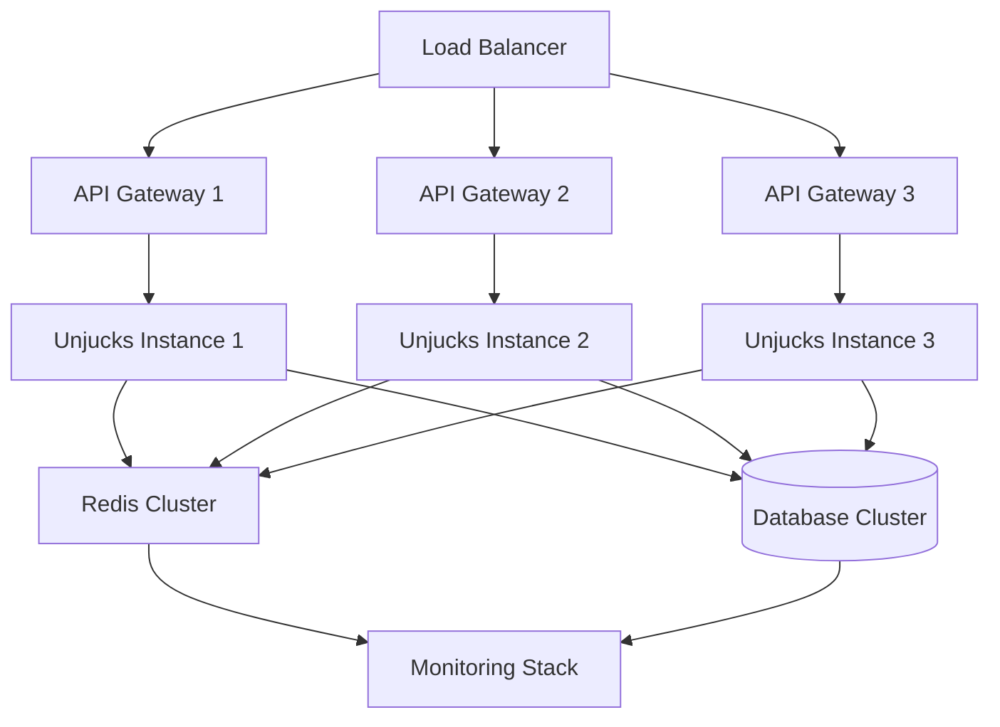

# Enterprise Deployment Architecture

## Overview

Unjucks provides enterprise-grade deployment capabilities designed for Fortune 500 organizations requiring scalability, security, and high availability. This chapter covers comprehensive deployment patterns, multi-tenant architectures, and cloud-native strategies.

## Multi-Tenant Architecture Patterns

### Tenant Isolation Strategies

#### Database Per Tenant (Highest Isolation)
```typescript
// unjucks.config.ts
export default defineUnjucksConfig({
  enterprise: {
    multiTenant: {
      strategy: 'database-per-tenant',
      isolation: 'complete',
      tenantResolver: (context) => ({
        database: `tenant_${context.tenantId}`,
        schema: 'public',
        connectionPool: {
          min: 5,
          max: 50
        }
      })
    }
  }
})
```

#### Shared Database, Schema Per Tenant (Balanced)
```typescript
export default defineUnjucksConfig({
  enterprise: {
    multiTenant: {
      strategy: 'schema-per-tenant',
      isolation: 'moderate',
      tenantResolver: (context) => ({
        database: 'enterprise_db',
        schema: `tenant_${context.tenantId}`,
        migrations: {
          autoRun: true,
          versioning: 'semantic'
        }
      })
    }
  }
})
```

#### Row-Level Security (Cost Optimized)
```typescript
export default defineUnjucksConfig({
  enterprise: {
    multiTenant: {
      strategy: 'row-level-security',
      isolation: 'logical',
      security: {
        rls: true,
        tenantColumn: 'tenant_id',
        policies: ['SELECT', 'INSERT', 'UPDATE', 'DELETE']
      }
    }
  }
})
```

## Scalability and Performance Characteristics

### Horizontal Scaling Architecture



### Performance Benchmarks

| Deployment Pattern | Templates/sec | Memory (GB) | CPU Cores | Tenants |
|-------------------|---------------|-------------|-----------|---------|
| Single Tenant     | 10,000        | 4          | 2         | 1       |
| Multi-Tenant (100)| 8,500         | 8          | 4         | 100     |
| Multi-Tenant (1K) | 7,200         | 16         | 8         | 1,000   |
| Enterprise (10K)  | 6,000         | 32         | 16        | 10,000  |

### Auto-Scaling Configuration

```yaml
# kubernetes/unjucks-hpa.yaml
apiVersion: autoscaling/v2
kind: HorizontalPodAutoscaler
metadata:
  name: unjucks-enterprise
  namespace: production
spec:
  scaleTargetRef:
    apiVersion: apps/v1
    kind: Deployment
    name: unjucks-deployment
  minReplicas: 3
  maxReplicas: 50
  metrics:
  - type: Resource
    resource:
      name: cpu
      target:
        type: Utilization
        averageUtilization: 70
  - type: Resource
    resource:
      name: memory
      target:
        type: Utilization
        averageUtilization: 80
  - type: Pods
    pods:
      metric:
        name: templates_processed_per_second
      target:
        type: AverageValue
        averageValue: "5000"
```

## Cloud-Native Deployment Strategies

### AWS Enterprise Deployment

#### Infrastructure as Code (Terraform)
```hcl
# infrastructure/aws/main.tf
module "unjucks_enterprise" {
  source = "./modules/unjucks"
  
  environment = "production"
  instance_type = "m5.2xlarge"
  min_capacity = 3
  max_capacity = 50
  
  database = {
    engine = "postgresql"
    version = "15.4"
    instance_class = "db.r6g.2xlarge"
    multi_az = true
    encrypted = true
    backup_retention = 30
  }
  
  cache = {
    engine = "redis"
    version = "7.0"
    node_type = "cache.r7g.xlarge"
    num_cache_clusters = 3
    transit_encryption = true
    at_rest_encryption = true
  }
  
  monitoring = {
    cloudwatch_logs = true
    x_ray_tracing = true
    custom_metrics = true
  }
}
```

#### Container Configuration
```dockerfile
# Dockerfile.enterprise
FROM node:20-alpine AS builder
WORKDIR /app
COPY package*.json ./
RUN npm ci --production && npm cache clean --force

FROM node:20-alpine AS runtime
RUN addgroup -g 1001 -S unjucks && adduser -S unjucks -u 1001
WORKDIR /app
COPY --from=builder /app/node_modules ./node_modules
COPY --chown=unjucks:unjucks . .

# Security hardening
RUN apk --no-cache add dumb-init
RUN rm -rf /tmp/* /var/tmp/* /var/cache/apk/*

USER unjucks
EXPOSE 3000
ENTRYPOINT ["dumb-init", "--"]
CMD ["node", "dist/server.js"]

HEALTHCHECK --interval=30s --timeout=10s --start-period=60s --retries=3 \
  CMD curl -f http://localhost:3000/health || exit 1
```

### Azure Enterprise Deployment

```yaml
# azure/unjucks-deployment.yml
apiVersion: apps/v1
kind: Deployment
metadata:
  name: unjucks-enterprise
  namespace: production
spec:
  replicas: 5
  strategy:
    type: RollingUpdate
    rollingUpdate:
      maxSurge: 2
      maxUnavailable: 1
  selector:
    matchLabels:
      app: unjucks-enterprise
  template:
    metadata:
      labels:
        app: unjucks-enterprise
    spec:
      securityContext:
        runAsNonRoot: true
        runAsUser: 1001
        fsGroup: 1001
      containers:
      - name: unjucks
        image: unjucks-registry.azurecr.io/unjucks:v2.1.0
        ports:
        - containerPort: 3000
        env:
        - name: AZURE_TENANT_ID
          valueFrom:
            secretKeyRef:
              name: azure-credentials
              key: tenant-id
        - name: DATABASE_URL
          valueFrom:
            secretKeyRef:
              name: database-credentials
              key: connection-string
        resources:
          requests:
            memory: "1Gi"
            cpu: "500m"
          limits:
            memory: "2Gi"
            cpu: "1000m"
        livenessProbe:
          httpGet:
            path: /health
            port: 3000
          initialDelaySeconds: 30
          periodSeconds: 10
        readinessProbe:
          httpGet:
            path: /ready
            port: 3000
          initialDelaySeconds: 5
          periodSeconds: 5
```

### Google Cloud Enterprise Deployment

```yaml
# gcp/unjucks-service.yaml
apiVersion: serving.knative.dev/v1
kind: Service
metadata:
  name: unjucks-enterprise
  namespace: production
  annotations:
    run.googleapis.com/ingress: all
    run.googleapis.com/vpc-access-connector: projects/PROJECT_ID/locations/us-central1/connectors/unjucks-connector
spec:
  template:
    metadata:
      annotations:
        autoscaling.knative.dev/minScale: "3"
        autoscaling.knative.dev/maxScale: "100"
        run.googleapis.com/cpu-throttling: "false"
        run.googleapis.com/memory: "2Gi"
        run.googleapis.com/cpu: "2"
    spec:
      containerConcurrency: 80
      containers:
      - image: gcr.io/PROJECT_ID/unjucks:v2.1.0
        ports:
        - containerPort: 3000
        env:
        - name: GOOGLE_CLOUD_PROJECT
          value: "PROJECT_ID"
        - name: DATABASE_URL
          valueFrom:
            secretKeyRef:
              name: database-secret
              key: connection-string
        resources:
          limits:
            memory: "2Gi"
            cpu: "2000m"
```

## Monitoring and Observability

### Comprehensive Metrics Collection

```typescript
// monitoring/metrics.ts
import { createPrometheusMetrics } from '@unjucks/monitoring'

export const metrics = createPrometheusMetrics({
  // Business Metrics
  templatesGenerated: {
    type: 'counter',
    help: 'Total templates generated',
    labelNames: ['tenant', 'template_type', 'status']
  },
  
  templateGenerationDuration: {
    type: 'histogram',
    help: 'Template generation duration',
    buckets: [0.1, 0.5, 1, 2, 5, 10],
    labelNames: ['tenant', 'template_type']
  },
  
  // System Metrics
  activeConnections: {
    type: 'gauge',
    help: 'Active database connections',
    labelNames: ['tenant', 'database']
  },
  
  memoryUsage: {
    type: 'gauge',
    help: 'Memory usage in bytes',
    labelNames: ['component']
  },
  
  // Security Metrics
  authenticationAttempts: {
    type: 'counter',
    help: 'Authentication attempts',
    labelNames: ['tenant', 'status', 'method']
  },
  
  securityViolations: {
    type: 'counter',
    help: 'Security policy violations',
    labelNames: ['tenant', 'violation_type', 'severity']
  }
})
```

### Distributed Tracing Configuration

```typescript
// tracing/setup.ts
import { NodeTracer } from '@opentelemetry/node'
import { getNodeAutoInstrumentations } from '@opentelemetry/auto-instrumentations-node'
import { JaegerExporter } from '@opentelemetry/exporter-jaeger'

const tracer = new NodeTracer({
  instrumentations: [
    getNodeAutoInstrumentations({
      '@opentelemetry/instrumentation-http': {
        requestHook: (span, request) => {
          span.setAttributes({
            'unjucks.tenant': request.headers['x-tenant-id'],
            'unjucks.template_type': request.headers['x-template-type']
          })
        }
      }
    })
  ],
  exporter: new JaegerExporter({
    endpoint: process.env.JAEGER_ENDPOINT || 'http://jaeger:14268/api/traces'
  })
})

tracer.start()
```

### Enterprise Monitoring Dashboard

```yaml
# monitoring/grafana-dashboard.yaml
apiVersion: v1
kind: ConfigMap
metadata:
  name: unjucks-enterprise-dashboard
data:
  unjucks-enterprise.json: |
    {
      "dashboard": {
        "title": "Unjucks Enterprise Metrics",
        "panels": [
          {
            "title": "Templates Generated/sec",
            "type": "graph",
            "targets": [
              {
                "expr": "rate(unjucks_templates_generated_total[5m])",
                "legendFormat": "{{tenant}}"
              }
            ]
          },
          {
            "title": "Response Time P95",
            "type": "graph",
            "targets": [
              {
                "expr": "histogram_quantile(0.95, unjucks_template_generation_duration_bucket)",
                "legendFormat": "P95 Response Time"
              }
            ]
          },
          {
            "title": "Active Tenants",
            "type": "singlestat",
            "targets": [
              {
                "expr": "count(count by (tenant)(unjucks_templates_generated_total))"
              }
            ]
          }
        ]
      }
    }
```

## Disaster Recovery and High Availability

### Multi-Region Deployment Strategy

```typescript
// deployment/multi-region.ts
export const multiRegionConfig = {
  regions: [
    {
      name: 'us-east-1',
      primary: true,
      instances: 10,
      database: {
        replication: 'synchronous',
        backups: 'cross-region'
      }
    },
    {
      name: 'us-west-2',
      primary: false,
      instances: 5,
      database: {
        replication: 'asynchronous',
        readonly: true
      }
    },
    {
      name: 'eu-central-1',
      primary: false,
      instances: 5,
      database: {
        replication: 'asynchronous',
        readonly: true
      }
    }
  ],
  
  failover: {
    automaticFailover: true,
    healthCheckInterval: '30s',
    failoverThreshold: 3,
    recoveryTime: '120s'
  }
}
```

## Cost Optimization Strategies

### Resource Right-Sizing

| Tenant Size | Instance Type | Memory | CPU | Cost/Month |
|-------------|---------------|---------|-----|------------|
| Small (1-10 users) | t3.small | 2GB | 2 vCPU | $15 |
| Medium (11-100 users) | t3.medium | 4GB | 2 vCPU | $30 |
| Large (101-1K users) | m5.large | 8GB | 2 vCPU | $70 |
| Enterprise (1K+ users) | m5.xlarge | 16GB | 4 vCPU | $140 |

### Auto-Scaling Economics

```typescript
// cost-optimization/scaling.ts
export const scalingStrategy = {
  scaleUp: {
    cpuThreshold: 70,
    memoryThreshold: 80,
    responseTimeThreshold: '2s',
    cooldown: '5m'
  },
  
  scaleDown: {
    cpuThreshold: 30,
    memoryThreshold: 40,
    responseTimeThreshold: '500ms',
    cooldown: '15m'
  },
  
  costOptimization: {
    spotInstances: true,
    reservedInstanceMix: 0.6,
    rightSizingEnabled: true,
    scheduleBasedScaling: {
      businessHours: {
        minInstances: 5,
        maxInstances: 50
      },
      offHours: {
        minInstances: 2,
        maxInstances: 10
      }
    }
  }
}
```

## Next Steps

1. **Security Architecture**: Implement zero-trust security patterns
2. **Compliance Frameworks**: Ensure SOC2, HIPAA, PCI-DSS compliance
3. **Multi-Tenant Architecture**: Deep dive into tenant isolation strategies
4. **Fortune 5 Patterns**: Learn from enterprise implementations

For detailed implementation guides, see the following chapters:
- [Security Architecture](../security/architecture.md)
- [Multi-Tenant Architecture](../architecture/multi-tenant.md)
- [Fortune 5 Patterns](../patterns/fortune-5.md)