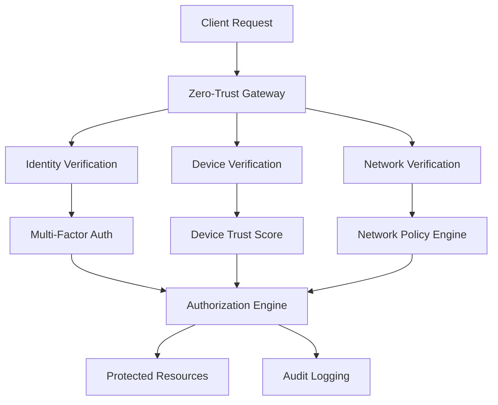

# Security Architecture

## Overview

Enterprise security for code generation systems requires a comprehensive defense-in-depth approach. This chapter covers zero-trust implementation, encryption standards, multi-factor authentication, and behavioral monitoring patterns specifically designed for Unjucks enterprise deployments.

## Zero-Trust Implementation

### Architecture Principles

Zero-trust security assumes no implicit trust and requires verification for every access request, regardless of location or user credentials.



### Zero-Trust Configuration

```typescript
// security/zero-trust-config.ts
export const zeroTrustConfig = {
  gateway: {
    // Every request must be authenticated and authorized
    requireAuthentication: true,
    requireAuthorization: true,
    
    // Continuous verification
    sessionValidation: {
      interval: 300, // 5 minutes
      riskAssessment: true,
      deviceFingerprinting: true,
      behavioralAnalytics: true
    },
    
    // Network micro-segmentation
    networkPolicies: {
      denyByDefault: true,
      allowList: {
        templateGenerators: ['10.0.1.0/24'],
        adminConsole: ['10.0.2.0/24'],
        apiGateways: ['10.0.3.0/24']
      },
      
      // Dynamic network policies
      contextualAccess: {
        location: true,
        timeOfDay: true,
        deviceTrust: true,
        userBehavior: true
      }
    }
  },
  
  // Identity and Access Management
  identity: {
    providers: [
      {
        type: 'saml',
        provider: 'okta',
        configuration: {
          ssoUrl: process.env.OKTA_SSO_URL,
          certificate: process.env.OKTA_CERTIFICATE,
          attributeMapping: {
            userId: 'NameID',
            email: 'email',
            groups: 'memberOf',
            department: 'department'
          }
        }
      },
      {
        type: 'oauth2',
        provider: 'azure-ad',
        configuration: {
          clientId: process.env.AZURE_CLIENT_ID,
          authority: process.env.AZURE_AUTHORITY,
          scopes: ['openid', 'profile', 'email', 'unjucks.access']
        }
      }
    ],
    
    // Multi-factor authentication requirements
    mfa: {
      required: true,
      methods: ['totp', 'sms', 'hardware-token', 'biometric'],
      adaptiveAuthentication: {
        riskThreshold: 0.7,
        deviceTrustThreshold: 0.8,
        locationAnomalyDetection: true
      }
    }
  },
  
  // Authorization policies
  authorization: {
    model: 'abac', // Attribute-Based Access Control
    
    policies: [
      {
        id: 'template-generation',
        name: 'Template Generation Access',
        effect: 'allow',
        principals: ['developers', 'architects'],
        actions: ['template:generate', 'template:preview'],
        resources: ['templates/*'],
        conditions: {
          timeWindow: '06:00-22:00',
          approvedDevices: true,
          minimumTrustScore: 0.8
        }
      },
      {
        id: 'production-deployment',
        name: 'Production Deployment',
        effect: 'allow',
        principals: ['senior-developers', 'devops'],
        actions: ['deploy:production'],
        resources: ['environments/production'],
        conditions: {
          requireApproval: true,
          multiPersonAuthorization: true,
          changeControlTicket: true
        }
      }
    ]
  }
}
```

### Device Trust Implementation

```typescript
// security/device-trust.ts
import { DeviceTrustEngine, RiskCalculator } from '@unjucks/security'

export class DeviceTrustManager {
  
  async calculateDeviceTrustScore(device: DeviceInfo, user: UserContext): Promise<TrustScore> {
    const factors = await Promise.all([
      this.assessDeviceCompliance(device),
      this.checkDeviceReputation(device),
      this.validateDeviceFingerprint(device),
      this.analyzeDeviceBehavior(device, user),
      this.verifyDeviceCertificates(device)
    ])
    
    const trustScore = this.aggregateTrustFactors(factors)
    
    // Store trust score for continuous monitoring
    await this.storeTrustScore(device.id, trustScore, {
      calculatedAt: new Date(),
      factors,
      validUntil: new Date(Date.now() + 3600000) // 1 hour
    })
    
    return trustScore
  }
  
  private async assessDeviceCompliance(device: DeviceInfo): Promise<ComplianceFactor> {
    return {
      factor: 'compliance',
      score: this.calculateComplianceScore({
        operatingSystemVersion: device.os.version,
        securityPatches: device.securityPatches,
        antimalwareStatus: device.antimalware,
        firewallEnabled: device.firewall,
        diskEncryption: device.encryption.disk,
        screenLock: device.screenLock
      }),
      weight: 0.3
    }
  }
  
  private async analyzeDeviceBehavior(device: DeviceInfo, user: UserContext): Promise<BehaviorFactor> {
    const historicalBehavior = await this.getDeviceBehaviorHistory(device.id, user.id)
    
    const anomalies = this.detectAnomalies({
      loginTimes: historicalBehavior.loginTimes,
      locations: historicalBehavior.locations,
      networkPatterns: historicalBehavior.networkPatterns,
      applicationUsage: historicalBehavior.applicationUsage
    })
    
    return {
      factor: 'behavior',
      score: 1 - (anomalies.length * 0.1), // Reduce trust for each anomaly
      weight: 0.2,
      details: { anomalies }
    }
  }
}
```

## FIPS 140-2 Compliant Encryption

### Encryption Architecture

```typescript
// security/fips-encryption.ts
import { FIPS1402Module, EncryptionManager } from '@unjucks/crypto'

export class FIPSCompliantEncryption implements EncryptionManager {
  
  private fipsModule: FIPS1402Module
  
  constructor() {
    // Initialize FIPS 140-2 Level 3 certified crypto module
    this.fipsModule = new FIPS1402Module({
      level: 3,
      algorithms: {
        symmetric: ['AES-256-GCM', 'AES-256-CBC'],
        asymmetric: ['RSA-4096', 'ECDSA-P384'],
        hash: ['SHA-256', 'SHA-384', 'SHA-512'],
        keyDerivation: ['PBKDF2', 'HKDF', 'scrypt']
      },
      keyManagement: {
        hsm: true, // Hardware Security Module required
        keyRotation: '90d',
        keyEscrow: true
      }
    })
  }
  
  // Encrypt template data at rest
  async encryptTemplateData(data: TemplateData, context: EncryptionContext): Promise<EncryptedData> {
    const dataClassification = this.classifyData(data)
    
    const encryptionParams = this.getEncryptionParams(dataClassification, context)
    
    // Generate unique encryption key per template
    const dataKey = await this.fipsModule.generateDataKey({
      algorithm: 'AES-256-GCM',
      keyUsage: 'encryption',
      extractable: false
    })
    
    // Encrypt data with generated key
    const encryptedData = await this.fipsModule.encrypt(data, dataKey, {
      algorithm: encryptionParams.algorithm,
      additionalAuthenticatedData: {
        templateId: context.templateId,
        userId: context.userId,
        timestamp: new Date().toISOString()
      }
    })
    
    // Encrypt the data key with Key Encryption Key (KEK)
    const encryptedKey = await this.fipsModule.encryptKey(dataKey, context.kek)
    
    return {
      encryptedData: encryptedData.ciphertext,
      encryptedKey: encryptedKey,
      iv: encryptedData.iv,
      authTag: encryptedData.authTag,
      algorithm: encryptionParams.algorithm,
      keyId: encryptedKey.keyId,
      metadata: {
        dataClassification,
        encryptedAt: new Date(),
        fipsLevel: 'Level-3'
      }
    }
  }
  
  // Encrypt data in transit
  async setupTLSConfiguration(): Promise<TLSConfig> {
    return {
      minVersion: 'TLSv1.3',
      cipherSuites: [
        'TLS_AES_256_GCM_SHA384',
        'TLS_CHACHA20_POLY1305_SHA256',
        'TLS_AES_128_GCM_SHA256'
      ],
      
      // FIPS-approved elliptic curves
      curves: ['P-384', 'P-256'],
      
      // Certificate configuration
      certificates: {
        serverCert: await this.generateFIPSCertificate({
          keySize: 4096,
          algorithm: 'RSA',
          validityPeriod: '1y',
          extensions: {
            keyUsage: ['digitalSignature', 'keyEncipherment'],
            extendedKeyUsage: ['serverAuth', 'clientAuth']
          }
        }),
        
        // Mutual TLS for high-security communications
        clientCertRequired: true,
        caCertChain: await this.loadCACertificateChain()
      },
      
      // Perfect Forward Secrecy
      dhParams: {
        keySize: 4096,
        generator: 2
      },
      
      // HSTS and security headers
      securityHeaders: {
        'Strict-Transport-Security': 'max-age=31536000; includeSubDomains; preload',
        'Content-Security-Policy': "default-src 'self'",
        'X-Frame-Options': 'DENY',
        'X-Content-Type-Options': 'nosniff'
      }
    }
  }
  
  // Key management with automatic rotation
  async setupKeyRotation(): Promise<KeyRotationConfig> {
    return {
      schedule: {
        dataKeys: '30d',    // Rotate data encryption keys monthly
        keyEncryptionKeys: '90d',  // Rotate KEKs quarterly
        signingKeys: '180d', // Rotate signing keys biannually
        tlsCertificates: '1y' // Rotate TLS certificates annually
      },
      
      rotation: {
        preRotation: {
          warningPeriod: '7d',
          keyDerivation: true,
          testing: true
        },
        
        rotation: {
          atomicOperation: true,
          rollbackSupport: true,
          zeroDowntime: true
        },
        
        postRotation: {
          verification: true,
          oldKeyRetention: '30d',
          auditLogging: true
        }
      },
      
      // Emergency key revocation
      revocation: {
        compromiseDetection: true,
        automaticRevocation: true,
        emergencyContacts: process.env.SECURITY_TEAM_CONTACTS?.split(',') || [],
        revocationPropagationTime: '5m'
      }
    }
  }
}
```

### Hardware Security Module Integration

```typescript
// security/hsm-integration.ts
export class HSMKeyManager {
  
  async initializeHSM(): Promise<HSMConnection> {
    const hsmConfig = {
      provider: process.env.HSM_PROVIDER || 'aws-cloudhsm',
      cluster: {
        id: process.env.HSM_CLUSTER_ID,
        endpoints: process.env.HSM_ENDPOINTS?.split(','),
        credentials: {
          username: process.env.HSM_USERNAME,
          password: process.env.HSM_PASSWORD,
          certificate: process.env.HSM_CLIENT_CERT
        }
      },
      
      // High availability configuration
      failover: {
        enabled: true,
        retryAttempts: 3,
        backoffStrategy: 'exponential',
        healthCheckInterval: 30000
      },
      
      // Performance optimization
      connectionPool: {
        minConnections: 5,
        maxConnections: 50,
        idleTimeout: 300000,
        maxLifetime: 3600000
      }
    }
    
    const hsm = await HSM.connect(hsmConfig)
    
    // Initialize root key hierarchy
    await this.setupKeyHierarchy(hsm)
    
    return hsm
  }
  
  private async setupKeyHierarchy(hsm: HSMConnection): Promise<void> {
    // Root Key Encryption Key (never leaves HSM)
    const rootKEK = await hsm.generateKey({
      keyType: 'AES',
      keySize: 256,
      keyUsage: ['wrap', 'unwrap'],
      extractable: false,
      label: 'unjucks-root-kek'
    })
    
    // Domain-specific KEKs
    const domainKEKs = await Promise.all([
      hsm.generateKey({
        keyType: 'AES',
        keySize: 256,
        keyUsage: ['wrap', 'unwrap'],
        extractable: false,
        label: 'unjucks-template-kek'
      }),
      hsm.generateKey({
        keyType: 'AES',
        keySize: 256,
        keyUsage: ['wrap', 'unwrap'],
        extractable: false,
        label: 'unjucks-config-kek'
      }),
      hsm.generateKey({
        keyType: 'AES',
        keySize: 256,
        keyUsage: ['wrap', 'unwrap'],
        extractable: false,
        label: 'unjucks-audit-kek'
      })
    ])
    
    // Store key hierarchy metadata
    await this.storeKeyMetadata({
      rootKEK: rootKEK.id,
      domainKEKs: domainKEKs.map(k => ({ id: k.id, domain: k.label })),
      createdAt: new Date(),
      fipsCompliant: true
    })
  }
}
```

## Multi-Factor Authentication

### Adaptive MFA Implementation

```typescript
// security/adaptive-mfa.ts
export class AdaptiveMFAEngine {
  
  async evaluateAuthenticationRisk(context: AuthContext): Promise<MFARequirement> {
    const riskFactors = await this.calculateRiskFactors(context)
    const riskScore = this.aggregateRiskScore(riskFactors)
    
    // Adaptive MFA based on risk score
    if (riskScore >= 0.8) {
      return {
        required: true,
        methods: ['hardware-token', 'biometric'],
        minimumMethods: 2,
        stepUp: true, // Require additional verification
        timeout: 300 // 5 minutes
      }
    } else if (riskScore >= 0.6) {
      return {
        required: true,
        methods: ['totp', 'sms', 'push-notification'],
        minimumMethods: 1,
        stepUp: false,
        timeout: 600 // 10 minutes
      }
    } else if (riskScore >= 0.3) {
      return {
        required: true,
        methods: ['push-notification', 'totp'],
        minimumMethods: 1,
        stepUp: false,
        timeout: 1800 // 30 minutes
      }
    } else {
      // Low risk - single factor may be sufficient for certain operations
      return {
        required: false,
        methods: [],
        minimumMethods: 0,
        stepUp: false,
        timeout: 3600 // 1 hour
      }
    }
  }
  
  private async calculateRiskFactors(context: AuthContext): Promise<RiskFactor[]> {
    return await Promise.all([
      // Geographic location risk
      this.assessLocationRisk(context.clientIP, context.user.id),
      
      // Device risk assessment
      this.assessDeviceRisk(context.deviceFingerprint, context.user.id),
      
      // Temporal pattern analysis
      this.assessTemporalRisk(context.timestamp, context.user.id),
      
      // Behavioral analysis
      this.assessBehavioralRisk(context.sessionData, context.user.id),
      
      // Network risk assessment
      this.assessNetworkRisk(context.networkInfo),
      
      // Application-specific risk
      this.assessApplicationRisk(context.requestedAction, context.resourceSensitivity)
    ])
  }
  
  async setupMFAMethods(userId: string): Promise<MFASetupResult> {
    const availableMethods = await this.getAvailableMFAMethods()
    const userPreferences = await this.getUserMFAPreferences(userId)
    
    const recommendedMethods = this.recommendMFAMethods(userPreferences, {
      securityLevel: 'high',
      usabilityWeight: 0.3,
      securityWeight: 0.7
    })
    
    return {
      availableMethods,
      recommendedMethods,
      setupInstructions: this.generateSetupInstructions(recommendedMethods),
      backupCodes: await this.generateBackupCodes(userId, 10),
      enrollmentDeadline: new Date(Date.now() + 7 * 24 * 60 * 60 * 1000) // 7 days
    }
  }
}
```

### Hardware Token Integration

```typescript
// security/hardware-tokens.ts
export class HardwareTokenManager {
  
  async registerHardwareToken(userId: string, tokenInfo: HardwareTokenInfo): Promise<TokenRegistration> {
    // Validate token authenticity
    const tokenValidation = await this.validateTokenAuthenticity(tokenInfo)
    if (!tokenValidation.isValid) {
      throw new InvalidTokenError('Hardware token validation failed')
    }
    
    // Generate token-specific configuration
    const tokenConfig = {
      userId,
      tokenId: tokenInfo.id,
      tokenType: tokenInfo.type, // YubiKey, RSA SecurID, etc.
      publicKey: tokenInfo.publicKey,
      certificateChain: tokenInfo.certificateChain,
      
      // Security configuration
      pinRequired: true,
      touchRequired: tokenInfo.capabilities.includes('touch'),
      biometricRequired: tokenInfo.capabilities.includes('biometric'),
      
      // Usage policies
      maxConsecutiveFailures: 3,
      lockoutDuration: 900, // 15 minutes
      inactivityTimeout: 300, // 5 minutes
      
      // Attestation and verification
      attestationCertificate: tokenInfo.attestationCertificate,
      verificationMethod: 'FIDO2',
      
      registeredAt: new Date(),
      expiresAt: new Date(Date.now() + 3 * 365 * 24 * 60 * 60 * 1000) // 3 years
    }
    
    // Store token configuration securely
    await this.storeTokenConfig(tokenConfig)
    
    // Generate backup authentication codes
    const backupCodes = await this.generateBackupCodes(userId, 10)
    
    return {
      tokenId: tokenInfo.id,
      registrationSuccessful: true,
      backupCodes,
      setupInstructions: this.generateTokenSetupInstructions(tokenInfo.type),
      testVerificationRequired: true
    }
  }
  
  async verifyHardwareToken(
    userId: string, 
    tokenId: string, 
    challenge: string, 
    response: TokenResponse
  ): Promise<TokenVerificationResult> {
    
    const tokenConfig = await this.getTokenConfig(userId, tokenId)
    if (!tokenConfig) {
      throw new TokenNotFoundError('Hardware token not registered')
    }
    
    // Verify token response against challenge
    const verificationResult = await this.verifyTokenResponse(
      challenge,
      response,
      tokenConfig.publicKey
    )
    
    if (!verificationResult.isValid) {
      await this.recordFailedAttempt(userId, tokenId)
      
      // Check for lockout condition
      const failureCount = await this.getConsecutiveFailures(userId, tokenId)
      if (failureCount >= tokenConfig.maxConsecutiveFailures) {
        await this.lockoutToken(userId, tokenId, tokenConfig.lockoutDuration)
        throw new TokenLockoutError('Hardware token locked due to repeated failures')
      }
      
      throw new InvalidTokenResponseError('Hardware token verification failed')
    }
    
    // Reset failure counter on successful verification
    await this.resetFailureCounter(userId, tokenId)
    
    // Update token usage statistics
    await this.updateTokenUsage(userId, tokenId, {
      lastUsed: new Date(),
      usageCount: (tokenConfig.usageCount || 0) + 1
    })
    
    return {
      verified: true,
      tokenId,
      challengeId: challenge,
      verifiedAt: new Date(),
      trustScore: this.calculateTokenTrustScore(tokenConfig, verificationResult)
    }
  }
}
```

## Behavioral Analysis and Monitoring

### User Behavior Analytics

```typescript
// security/behavior-analytics.ts
export class UserBehaviorAnalytics {
  
  async analyzeUserBehavior(userId: string, session: UserSession): Promise<BehaviorAnalysis> {
    const behaviorHistory = await this.getUserBehaviorHistory(userId, 30) // 30 days
    
    const analyses = await Promise.all([
      this.analyzeLoginPatterns(session, behaviorHistory.loginPatterns),
      this.analyzeTemplateUsagePatterns(session, behaviorHistory.templateUsage),
      this.analyzeNetworkPatterns(session, behaviorHistory.networkPatterns),
      this.analyzeDevicePatterns(session, behaviorHistory.devicePatterns),
      this.analyzeApplicationUsagePatterns(session, behaviorHistory.applicationUsage)
    ])
    
    const anomalies = this.detectAnomalies(analyses)
    const riskScore = this.calculateBehavioralRiskScore(anomalies)
    
    // Machine learning-based anomaly detection
    const mlAnomalies = await this.runMLAnomalyDetection(userId, session, behaviorHistory)
    
    const combinedAnalysis = {
      userId,
      sessionId: session.id,
      timestamp: new Date(),
      
      riskScore,
      anomalies: [...anomalies, ...mlAnomalies],
      
      behaviorMetrics: {
        loginFrequency: analyses[0].metrics,
        templateUsageFrequency: analyses[1].metrics,
        networkConsistency: analyses[2].metrics,
        deviceConsistency: analyses[3].metrics,
        applicationConsistency: analyses[4].metrics
      },
      
      recommendations: this.generateSecurityRecommendations(anomalies, riskScore),
      
      confidence: this.calculateConfidenceScore(analyses, behaviorHistory.dataPoints)
    }
    
    // Store analysis for future reference
    await this.storeBehaviorAnalysis(combinedAnalysis)
    
    // Trigger alerts for high-risk scenarios
    if (riskScore >= 0.8) {
      await this.triggerHighRiskAlert(combinedAnalysis)
    }
    
    return combinedAnalysis
  }
  
  private async runMLAnomalyDetection(
    userId: string, 
    session: UserSession, 
    history: BehaviorHistory
  ): Promise<MLAnomaly[]> {
    
    // Feature extraction for ML model
    const features = this.extractBehaviorFeatures(session, history)
    
    // Run multiple ML models for different anomaly types
    const modelResults = await Promise.all([
      this.runIsolationForest(features), // Unsupervised anomaly detection
      this.runOneClassSVM(features),     // Outlier detection
      this.runLSTMAnomaly(features),     // Sequential pattern anomalies
      this.runAutoencoderAnomaly(features) // Reconstruction-based anomalies
    ])
    
    // Ensemble voting for final anomaly determination
    const anomalies = this.ensembleVoting(modelResults, features)
    
    return anomalies.map(anomaly => ({
      type: 'ml-detected',
      confidence: anomaly.confidence,
      description: anomaly.description,
      severity: this.classifySeverity(anomaly.score),
      modelUsed: anomaly.model,
      features: anomaly.contributingFeatures
    }))
  }
  
  async setupRealTimeMonitoring(userId: string): Promise<MonitoringConfig> {
    return {
      enabled: true,
      
      // Real-time analysis triggers
      triggers: [
        {
          event: 'login',
          analysis: ['location', 'device', 'timing'],
          threshold: 0.7,
          action: 'additional-verification'
        },
        {
          event: 'template-generation',
          analysis: ['frequency', 'volume', 'sensitivity'],
          threshold: 0.8,
          action: 'step-up-authentication'
        },
        {
          event: 'configuration-change',
          analysis: ['authorization', 'pattern', 'impact'],
          threshold: 0.6,
          action: 'approval-required'
        }
      ],
      
      // Continuous monitoring
      monitoring: {
        sessionDuration: true,
        activityPatterns: true,
        resourceAccess: true,
        dataExfiltration: true,
        privilegeEscalation: true
      },
      
      // Alert configuration
      alerting: {
        channels: ['email', 'slack', 'pagerduty'],
        escalation: {
          level1: { threshold: 0.6, response: '5m' },
          level2: { threshold: 0.8, response: '2m' },
          level3: { threshold: 0.95, response: '30s' }
        }
      }
    }
  }
}
```

### Security Event Monitoring

```typescript
// security/event-monitoring.ts
export class SecurityEventMonitor {
  
  async initializeEventMonitoring(): Promise<EventMonitoringSystem> {
    const monitoring = {
      // Security events to monitor
      events: {
        authentication: [
          'login-attempt',
          'login-success',
          'login-failure',
          'mfa-challenge',
          'mfa-success',
          'mfa-failure',
          'password-change',
          'account-lockout'
        ],
        
        authorization: [
          'permission-granted',
          'permission-denied',
          'privilege-escalation-attempt',
          'role-change',
          'policy-violation'
        ],
        
        dataAccess: [
          'template-access',
          'configuration-read',
          'sensitive-data-access',
          'bulk-data-export',
          'unauthorized-access-attempt'
        ],
        
        systemSecurity: [
          'configuration-change',
          'security-policy-update',
          'encryption-key-rotation',
          'certificate-renewal',
          'vulnerability-detected'
        ]
      },
      
      // Real-time processing pipeline
      processing: {
        ingestion: {
          sources: ['application-logs', 'system-logs', 'network-logs', 'security-devices'],
          format: 'structured-json',
          encryption: true,
          compression: true
        },
        
        enrichment: {
          geoLocation: true,
          threatIntelligence: true,
          userContext: true,
          deviceContext: true,
          riskScoring: true
        },
        
        correlation: {
          timeWindow: 300, // 5 minutes
          rules: await this.loadCorrelationRules(),
          machineLearning: true,
          baselineComparison: true
        }
      },
      
      // Response automation
      responseAutomation: {
        immediateResponse: {
          'multiple-failed-logins': 'account-lockout',
          'privilege-escalation': 'session-termination',
          'suspicious-data-access': 'additional-verification',
          'malware-detected': 'quarantine-device'
        },
        
        escalationRules: {
          'high-risk-user-activity': {
            level1: 'security-team-alert',
            level2: 'manager-notification',
            level3: 'incident-response-activation'
          }
        }
      }
    }
    
    // Start real-time monitoring
    const eventStream = await this.initializeEventStream(monitoring)
    const alertingSystem = await this.initializeAlerting(monitoring)
    const responseSystem = await this.initializeAutomatedResponse(monitoring)
    
    return {
      monitoring,
      eventStream,
      alertingSystem,
      responseSystem,
      healthCheck: () => this.performHealthCheck([eventStream, alertingSystem, responseSystem])
    }
  }
  
  async generateSecurityDashboard(): Promise<SecurityDashboard> {
    const timeRange = { start: new Date(Date.now() - 24 * 60 * 60 * 1000), end: new Date() }
    
    const [
      threatMetrics,
      complianceMetrics,
      performanceMetrics,
      incidentMetrics
    ] = await Promise.all([
      this.getThreatMetrics(timeRange),
      this.getComplianceMetrics(timeRange),
      this.getPerformanceMetrics(timeRange),
      this.getIncidentMetrics(timeRange)
    ])
    
    return {
      overview: {
        securityScore: this.calculateOverallSecurityScore({
          threatMetrics,
          complianceMetrics,
          incidentMetrics
        }),
        
        threatLevel: this.assessCurrentThreatLevel(threatMetrics),
        complianceStatus: complianceMetrics.overallScore,
        systemHealth: performanceMetrics.healthScore
      },
      
      metrics: {
        threats: {
          detected: threatMetrics.detectedThreats,
          blocked: threatMetrics.blockedThreats,
          resolved: threatMetrics.resolvedThreats,
          falsePositives: threatMetrics.falsePositives
        },
        
        authentication: {
          successRate: this.calculateAuthSuccessRate(timeRange),
          mfaAdoptionRate: this.calculateMFAAdoption(),
          averageAuthTime: performanceMetrics.authTime
        },
        
        incidents: {
          open: incidentMetrics.openIncidents,
          resolved: incidentMetrics.resolvedIncidents,
          averageResolutionTime: incidentMetrics.averageResolutionTime,
          criticalIncidents: incidentMetrics.criticalIncidents
        }
      },
      
      alerts: {
        active: await this.getActiveAlerts(),
        recent: await this.getRecentAlerts(timeRange),
        trends: await this.getAlertTrends(timeRange)
      },
      
      recommendations: await this.generateSecurityRecommendations()
    }
  }
}
```

## Compliance Integration

### Automated Compliance Validation

```typescript
// security/compliance-validation.ts
export class ComplianceValidator {
  
  async validateSOC2Compliance(): Promise<SOC2ComplianceReport> {
    const controls = await this.evaluateSOC2Controls()
    
    return {
      controlResults: {
        // Common Criteria (CC)
        CC1: await this.validateControlEnvironment(),
        CC2: await this.validateCommunicationAndInformation(),
        CC3: await this.validateRiskAssessment(),
        CC4: await this.validateMonitoringActivities(),
        CC5: await this.validateControlActivities(),
        CC6: await this.validateLogicalAndPhysicalAccess(),
        CC7: await this.validateSystemOperations(),
        CC8: await this.validateChangeManagement(),
        CC9: await this.validateRiskMitigation(),
        
        // Additional Criteria for Security
        A1: await this.validateAccessControls()
      },
      
      overallCompliance: this.calculateComplianceScore(controls),
      findings: controls.flatMap(control => control.findings),
      recommendations: this.generateComplianceRecommendations(controls),
      
      report: {
        generatedAt: new Date(),
        period: this.getCurrentReportingPeriod(),
        auditor: 'automated-system',
        nextReview: this.calculateNextReviewDate()
      }
    }
  }
  
  async validateHIPAACompliance(): Promise<HIPAAComplianceReport> {
    return {
      administrativeSafeguards: await this.validateAdministrativeSafeguards(),
      physicalSafeguards: await this.validatePhysicalSafeguards(),
      technicalSafeguards: await this.validateTechnicalSafeguards(),
      
      // Specific HIPAA requirements
      riskAssessment: await this.validateHIPAARiskAssessment(),
      auditControls: await this.validateAuditControls(),
      integrityControls: await this.validateIntegrityControls(),
      transmissionSecurity: await this.validateTransmissionSecurity(),
      
      breachNotification: {
        procedures: await this.validateBreachProcedures(),
        timeline: await this.validateNotificationTimeline(),
        documentation: await this.validateBreachDocumentation()
      }
    }
  }
  
  private async validateTechnicalSafeguards(): Promise<TechnicalSafeguards> {
    return {
      accessControl: {
        uniqueUserIdentification: await this.validateUniqueUserIDs(),
        emergencyAccessProcedure: await this.validateEmergencyAccess(),
        automaticLogoff: await this.validateAutomaticLogoff(),
        encryptionDecryption: await this.validateEncryptionControls()
      },
      
      auditControls: {
        auditLogsEnabled: await this.validateAuditLogging(),
        auditLogReview: await this.validateAuditReview(),
        auditLogProtection: await this.validateAuditProtection()
      },
      
      integrity: {
        dataIntegrityControls: await this.validateDataIntegrity(),
        transmissionIntegrity: await this.validateTransmissionIntegrity()
      },
      
      personOrEntityAuthentication: {
        userAuthentication: await this.validateUserAuthentication(),
        deviceAuthentication: await this.validateDeviceAuthentication()
      },
      
      transmissionSecurity: {
        endToEndEncryption: await this.validateE2EEncryption(),
        networkSecurityControls: await this.validateNetworkSecurity()
      }
    }
  }
}
```

## Next Steps

The security architecture provides a comprehensive foundation for enterprise deployments. For implementation details, see:

- [Multi-Tenant Architecture](../architecture/multi-tenant.md)
- [Compliance Frameworks](../compliance/frameworks.md)
- [Enterprise Deployment Overview](../deployment/overview.md)
- [Fortune 5 Patterns](../patterns/fortune-5.md)