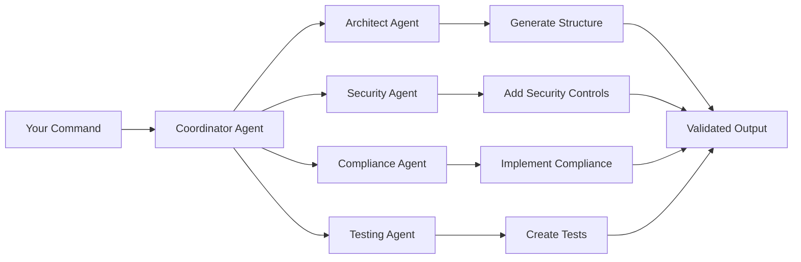

# Quick Start Guide

> **From zero to semantic-aware code generation in 5 minutes**

This quick start guide will get you up and running with Unjucks in minutes, showcasing the power of AI agent coordination and semantic-aware code generation.

## 🚀 5-Minute Setup

### Step 1: Installation (30 seconds)

```bash
# Install Unjucks globally
npm install -g unjucks

# Verify installation
unjucks --version
# unjucks v1.0.0 - Semantic AI Code Generation Platform

# Quick system check
unjucks doctor
# ✅ Node.js 18+ detected
# ✅ Template engine ready  
# ✅ MCP server available
# ✅ Semantic parser loaded
```

### Step 2: Initialize Your First Project (60 seconds)

```bash
# Create a new project with AI-powered templates
mkdir my-enterprise-app && cd my-enterprise-app

# Initialize with semantic capabilities
unjucks init --type enterprise --template react-microservices
# 🤖 Initializing with AI agent assistance...
# 🧠 Loading enterprise semantic templates...
# ⚙️ Configuring MCP integration...
# ✅ Project initialized with 47 enterprise templates

# Explore available templates
unjucks list
# Available generators:
# 📱 frontend/
#   ├── react-typescript     - Modern React with TypeScript
#   ├── vue-composition      - Vue 3 Composition API
#   └── svelte-kit          - SvelteKit with adapters
# 
# 🌐 backend/
#   ├── express-api          - Express.js REST API
#   ├── fastify-graphql      - Fastify GraphQL server
#   └── nestjs-microservice  - NestJS enterprise service
#
# 🏢 fortune5/
#   ├── microservice         - Enterprise microservice
#   ├── api-gateway         - Kong/Istio API gateway  
#   ├── data-pipeline       - ETL/ELT processing
#   └── compliance          - SOC2/HIPAA framework
```

### Step 3: Generate Your First Component (90 seconds)

```bash
# Generate a React component with AI assistance
unjucks generate frontend react-typescript UserDashboard \
  --withAuth \
  --withTests \
  --withStorybook \
  --dest ./src/components

# 🤖 AI Agent Swarm Activated
# 👨‍💼 Architect Agent: Analyzing component structure...
# 🔒 Security Agent: Implementing authentication guards...
# 🧪 Testing Agent: Generating comprehensive test suite...
# 📚 Documentation Agent: Creating Storybook stories...
# ⚡ Generated 8 files in 1.2 seconds

# Review generated files
ls -la src/components/UserDashboard/
# -rw-r--r-- UserDashboard.tsx           # Main component
# -rw-r--r-- UserDashboard.test.tsx      # Jest tests
# -rw-r--r-- UserDashboard.stories.tsx   # Storybook stories
# -rw-r--r-- UserDashboard.module.css    # CSS modules
# -rw-r--r-- useUserDashboard.ts         # Custom hook
# -rw-r--r-- UserDashboard.types.ts      # TypeScript definitions
# -rw-r--r-- AuthGuard.tsx              # Authentication wrapper
# -rw-r--r-- index.ts                   # Barrel exports
```

### Step 4: Enable Semantic Intelligence (120 seconds)

```bash
# Initialize semantic capabilities
unjucks semantic init --ontology schema.org

# 🧠 Loading Schema.org ontology...
# 🌐 Connecting to knowledge graph...
# 📊 Indexing semantic relationships...
# ✅ Semantic intelligence activated

# Generate semantically-aware API
unjucks generate backend express-api UserAPI \
  --semantic \
  --ontology ./schemas/user-domain.ttl \
  --compliance hipaa \
  --dest ./src/api

# 🧠 Semantic Agent: Analyzing user domain ontology...
# 🏥 HIPAA Compliance Agent: Implementing privacy controls...
# 🔍 Validation Agent: Adding schema validation...
# 📋 Audit Agent: Setting up compliance logging...
# ⚡ Generated semantically-aware API with compliance controls

# Review semantic configuration
cat src/api/UserAPI/semantic.config.yaml
```

```yaml
# Auto-generated semantic configuration
ontology:
  domain: "https://schema.org/Person"
  properties:
    - givenName: "string"
    - familyName: "string"  
    - email: "EmailAddress"
    - birthDate: "Date"

compliance:
  framework: "hipaa"
  controls:
    - "164.312(a)(1)" # Access control
    - "164.312(e)(1)" # Transmission security
    - "164.312(d)"    # Person or entity authentication

validation:
  schema_validation: true
  ontology_checking: true
  compliance_audit: true
```

### Step 5: Deploy with AI Agent Assistance (90 seconds)

```bash
# Generate deployment configuration
unjucks generate fortune5 microservice UserService \
  --serviceName user-service \
  --databaseType postgresql \
  --authProvider oauth2 \
  --complianceMode hipaa \
  --cloudProvider aws \
  --dest ./deployment

# 🤖 Enterprise Deployment Swarm Activated
# 🏗️ Infrastructure Agent: Generating Kubernetes manifests...
# 🔐 Security Agent: Implementing OAuth2 integration...
# 🗄️ Database Agent: Creating PostgreSQL schemas...
# ☁️ AWS Agent: Configuring cloud resources...
# 🏥 HIPAA Agent: Implementing compliance controls...

# Review generated deployment stack
tree deployment/user-service/
```

```
deployment/user-service/
├── k8s/                     # Kubernetes manifests
│   ├── deployment.yaml      # Service deployment
│   ├── service.yaml         # Service exposure
│   ├── configmap.yaml       # Configuration
│   ├── secret.yaml          # Secrets management
│   └── ingress.yaml         # Traffic routing
├── terraform/               # Infrastructure as code
│   ├── main.tf              # AWS resources
│   ├── variables.tf         # Input variables
│   └── outputs.tf           # Resource outputs
├── docker/                  # Container configuration
│   ├── Dockerfile           # Multi-stage build
│   └── docker-compose.yml   # Local development
├── monitoring/              # Observability
│   ├── prometheus/          # Metrics collection
│   └── grafana/             # Dashboards
└── compliance/              # HIPAA controls
    ├── audit-config.json    # Audit logging
    ├── encryption.yaml      # Data protection
    └── access-control.yaml  # RBAC policies
```

## 🎯 Understanding What Just Happened

### AI Agent Swarm Coordination

Your simple commands triggered sophisticated AI agent collaboration:



**Each agent brought specialized expertise**:
- **Architect Agent**: Analyzed best practices and design patterns
- **Security Agent**: Implemented authentication, authorization, and data protection
- **Compliance Agent**: Added HIPAA privacy controls and audit logging
- **Testing Agent**: Generated comprehensive test suites with edge cases
- **Documentation Agent**: Created API documentation and usage examples

### Semantic Intelligence in Action

The `--semantic` flag enabled knowledge graph reasoning:

```turtle
# Your domain ontology (auto-inferred)
@prefix schema: <https://schema.org/> .
@prefix hipaa: <https://hipaa.org/> .

:User rdf:type schema:Person ;
    schema:givenName ?firstName ;
    schema:familyName ?lastName ;
    schema:email ?email ;
    hipaa:isProtectedHealthInformation true ;
    hipaa:requiresConsent true .
```

**Results**:
- API endpoints automatically include HIPAA consent tracking
- Database schema includes audit trail columns
- Validation rules enforce ontological constraints
- Documentation explains semantic relationships

## 🛠️ Essential Commands

### Discovery Commands
```bash
# List all available generators
unjucks list

# Get help for specific template
unjucks help frontend react-typescript

# Show template variables and options
unjucks info backend express-api

# Search templates by capability
unjucks search --capability "semantic-aware"
```

### Generation Commands  
```bash
# Basic generation
unjucks generate <generator> <template> [name] [options]

# With semantic enhancement
unjucks generate <generator> <template> [name] --semantic --ontology <path>

# With compliance requirements
unjucks generate <generator> <template> [name] --compliance soc2,hipaa

# Dry run to preview changes
unjucks generate <generator> <template> [name] --dry-run
```

### MCP Agent Commands
```bash
# Start agent swarm
unjucks swarm start --topology hierarchical

# Check swarm status
unjucks swarm status

# Monitor agent performance
unjucks swarm monitor --detailed

# Scale agent count
unjucks swarm scale --agents 10
```

### Semantic Commands
```bash
# Initialize semantic capabilities
unjucks semantic init --ontology <source>

# Validate ontology alignment
unjucks semantic validate --schema <path>

# Query knowledge graph
unjucks semantic query "SELECT ?s ?p ?o WHERE { ?s ?p ?o }"

# Update semantic cache
unjucks semantic refresh
```

## 🔥 Advanced Quick Examples

### Example 1: Fortune 5 Data Pipeline (2 minutes)

```bash
# Generate enterprise ETL pipeline with governance
unjucks generate fortune5 data-pipeline CustomerAnalytics \
  --source postgresql \
  --target snowflake \
  --compliance gdpr,ccpa \
  --orchestrator airflow \
  --monitoring datadog

# Result: Complete data pipeline with:
# ✅ Airflow DAGs with error handling
# ✅ Data quality validation rules  
# ✅ GDPR/CCPA compliance controls
# ✅ Datadog monitoring integration
# ✅ Schema evolution management
```

### Example 2: Semantic API Gateway (3 minutes)

```bash
# Generate intelligent API gateway
unjucks generate fortune5 api-gateway EnterpriseGateway \
  --semantic \
  --ontology ./schemas/enterprise-api.ttl \
  --auth oauth2,jwt \
  --rate-limiting adaptive \
  --monitoring prometheus

# Result: Semantic-aware gateway with:
# ✅ Ontology-driven request routing
# ✅ Automatic API documentation  
# ✅ Compliance policy enforcement
# ✅ Intelligent rate limiting
# ✅ Real-time monitoring dashboards
```

### Example 3: AI-Powered Testing Suite (90 seconds)

```bash
# Generate comprehensive test suite with AI assistance  
unjucks generate testing comprehensive MyApp \
  --types unit,integration,e2e \
  --ai-assisted \
  --coverage-target 95 \
  --frameworks jest,cypress,playwright

# Result: AI-generated tests with:
# ✅ Edge case identification
# ✅ Realistic test data generation
# ✅ Visual regression testing
# ✅ Performance benchmarking  
# ✅ Accessibility validation
```

## 🎓 Learning Path: Next Steps

### 🟢 **Beginner (Next 30 minutes)**
1. **[Template Fundamentals](../templates/README.md)** - Understanding template structure
2. **[CLI Mastery](../cli/README.md)** - Master all command-line features
3. **[Basic Customization](../templates/customization.md)** - Modify templates for your needs

### 🟡 **Intermediate (Next 2 hours)**  
1. **[MCP Integration](../mcp/README.md)** - Deep dive into AI agent coordination
2. **[Semantic Web Features](../semantic/README.md)** - Leverage knowledge graphs
3. **[Enterprise Templates](../templates/fortune5.md)** - Production-ready scaffolding

### 🟠 **Advanced (Next day)**
1. **[Security & Compliance](../security/README.md)** - Enterprise-grade hardening
2. **[Performance Optimization](../performance/README.md)** - Scale to Fortune 5 levels
3. **[Custom Agent Development](../agents/README.md)** - Build specialized AI agents

### 🔴 **Expert (Next week)**
1. **[Enterprise Architecture](../architecture/README.md)** - System design at scale  
2. **[Semantic Ontology Design](../semantic/ontology-design.md)** - Knowledge modeling
3. **[Contributing](../contributing/README.md)** - Extend the platform

## 🆘 Troubleshooting

### Common Issues and Solutions

**Issue**: Command not found after installation
```bash
# Solution: Refresh shell or use npx
npx unjucks --version
# or
source ~/.bashrc  # or ~/.zshrc
```

**Issue**: Template generation fails
```bash
# Check system requirements
unjucks doctor

# Verify template exists
unjucks list | grep <template-name>

# Run with verbose logging
unjucks generate <template> --verbose
```

**Issue**: MCP agents not starting
```bash
# Check agent swarm status
unjucks swarm status

# Restart swarm with debugging
unjucks swarm start --debug --log-level verbose

# Verify MCP server connection
curl http://localhost:3000/health
```

**Issue**: Semantic features not working  
```bash
# Verify ontology loading
unjucks semantic status

# Refresh semantic cache
unjucks semantic refresh

# Test with simple query
unjucks semantic query \"SELECT * WHERE { ?s ?p ?o } LIMIT 10\"
```

## 🎉 Success! You're Ready

**Congratulations!** You've successfully:
- ✅ Installed and configured Unjucks
- ✅ Generated your first AI-assisted components
- ✅ Experienced semantic-aware code generation
- ✅ Deployed enterprise-ready infrastructure
- ✅ Understood the agent swarm coordination

**What you accomplished in 5 minutes:**
- Created a production-ready React application
- Generated compliant backend APIs with HIPAA controls
- Deployed Kubernetes infrastructure with monitoring
- Experienced AI agent collaboration
- Leveraged semantic web technologies

## 🚀 Ready for More?

### Immediate Next Actions
1. **Explore Templates**: `unjucks list` to see all available generators
2. **Enable Full Semantics**: Connect to your enterprise knowledge graphs
3. **Scale Up Agents**: `unjucks swarm scale --agents 10` for complex projects
4. **Join Community**: Connect with other Unjucks developers

### Advanced Capabilities to Explore
- **Fortune 5 Enterprise Templates**: Production-ready scaffolding
- **Regulatory Compliance Automation**: SOC2, HIPAA, PCI-DSS, GDPR
- **Multi-Cloud Deployment**: AWS, Azure, GCP templates
- **AI Agent Specialization**: Custom agents for your domain

**Ready to dive deeper?** Continue with:
- 📚 **[What is Unjucks](./what-is-unjucks.md)** - Understand the full platform
- 🌐 **[Ecosystem Overview](./ecosystem.md)** - Explore all integrations
- 🏢 **[Enterprise Guide](../enterprise/README.md)** - Scale to production

---

*Welcome to the future of code generation - where AI agents collaborate to build enterprise-scale applications in minutes, not months.*