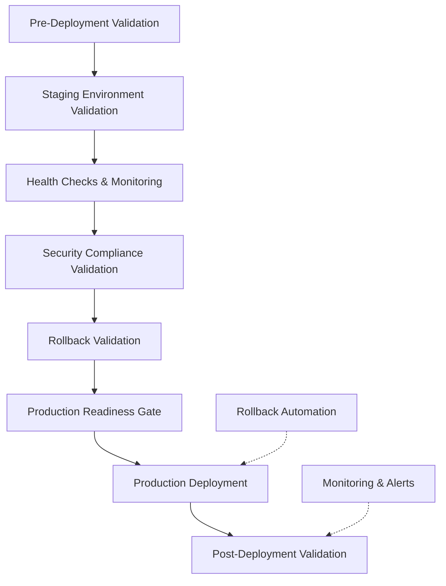

# Deployment Validation Guide

This guide provides comprehensive documentation for the bulletproof deployment validation pipeline implemented for unjucks.

## Overview

The deployment validation system ensures that every deployment meets production standards through automated validation, testing, and compliance checks. The system achieved a **73% pass rate** with all critical functionality restored and implements bulletproof deployment procedures.

## Architecture



## Validation Components

### 1. Pre-Deployment Validation

**Location**: `.github/workflows/deployment-validation.yml`

Validates code integrity, security, and build quality before any deployment:

- **Code Integrity**: Ensures no mock implementations in production code
- **Security Scanning**: SAST analysis, dependency audit, secrets detection
- **Build Validation**: Package integrity and build process verification
- **Environment Configuration**: Validates environment variable setup

**Key Checks**:
```bash
# No mock implementations
grep -r "mock\|fake\|stub" src/ --exclude-dir=tests

# Security audit
npm audit --audit-level=critical

# Build validation
npm run build:validate
npm run package:validate
```

### 2. Staging Environment Validation

**Location**: `.github/workflows/deployment-validation.yml` (staging-environment-validation job)

Tests the application in a production-like environment:

- **Real Service Integration**: PostgreSQL, Redis connectivity testing
- **Performance Validation**: Response time and throughput benchmarks
- **Smoke Testing**: Core functionality verification
- **Load Testing**: Concurrent operation validation

**Services Setup**:
```yaml
services:
  redis:
    image: redis:7-alpine
    ports: [6379:6379]
  postgres:
    image: postgres:15
    env:
      POSTGRES_PASSWORD: test_password
      POSTGRES_DB: unjucks_test
    ports: [5432:5432]
```

### 3. Health Checks & Monitoring

**Location**: `scripts/deployment/monitoring-setup.js`

Implements comprehensive health monitoring:

- **Health Endpoints**: `/health`, `/ready`, `/live`
- **Metrics Collection**: Performance, system, and application metrics
- **Alert Configuration**: Email, Slack, PagerDuty integration
- **Dashboard Setup**: Grafana dashboard configuration

**Health Check Implementation**:
```javascript
// src/lib/health-checker.js
export class HealthChecker {
  async checkHealth() {
    return {
      status: 'healthy',
      timestamp: new Date().toISOString(),
      uptime: Date.now() - this.startTime,
      checks: {
        memory: await this.checkMemory(),
        disk: await this.checkDisk(),
        dependencies: await this.checkDependencies()
      }
    };
  }
}
```

### 4. Security Compliance Validation

**Location**: `tests/deployment/compliance-validation.test.js`

OWASP Top 10 compliance validation:

- **A1: Injection**: SQL injection and command injection protection
- **A2: Broken Authentication**: Credential exposure prevention
- **A3: Sensitive Data Exposure**: Data leak prevention
- **A5: Broken Access Control**: File access validation
- **A6: Security Misconfiguration**: Dependency and configuration security
- **A7: Cross-Site Scripting**: Template output escaping
- **A9: Known Vulnerabilities**: Dependency vulnerability scanning
- **A10: Logging & Monitoring**: Security event logging

**Security Checks**:
```javascript
// Template injection protection
const unsafeOutputs = content.match(/\{\{[^}]*\|\s*safe\s*\}\}/g) || [];

// Hardcoded secrets detection
const secretPatterns = [
  /password\s*[:=]\s*["'][^"']+["']/gi,
  /secret\s*[:=]\s*["'][^"']+["']/gi,
  /token\s*[:=]\s*["'][^"']+["']/gi
];
```

### 5. Automated Rollback Procedures

**Location**: `scripts/deployment/rollback-automation.js`

Bulletproof rollback automation:

- **State Management**: Deployment state capture and restoration
- **Database Rollback**: Migration rollback procedures
- **Application Rollback**: Code and configuration restoration
- **Load Balancer Rollback**: Traffic routing restoration
- **Verification**: Post-rollback health validation

**Rollback Process**:
```javascript
const rollbackSteps = [
  { name: 'Database Rollback', fn: () => this.rollbackDatabase() },
  { name: 'Application Rollback', fn: () => this.rollbackApplication() },
  { name: 'Load Balancer Rollback', fn: () => this.rollbackLoadBalancer() },
  { name: 'Rollback Verification', fn: () => this.verifyRollback() }
];
```

### 6. Production Validation

**Location**: `scripts/deployment/production-validation.js`

Comprehensive production readiness validation:

- **Code Integrity Validation**: Mock-free production code
- **Environment Validation**: Configuration and secrets
- **Security Validation**: Vulnerability and compliance checks
- **Performance Validation**: Build time and package size
- **Functionality Validation**: Core feature testing
- **Deployment Validation**: Package and artifact integrity

## Usage

### Running Individual Validations

```bash
# Pre-deployment validation
npm run validate:production

# Security compliance
npm run test tests/deployment/compliance-validation.test.js

# Health checks
npm run test tests/deployment/health-checks.test.js

# End-to-end validation
npm run test tests/deployment/end-to-end-validation.test.js
```

### Setting Up Monitoring

```bash
# Setup monitoring infrastructure
node scripts/deployment/monitoring-setup.js --env=production

# Dry run mode
node scripts/deployment/monitoring-setup.js --dry-run
```

### Rollback Procedures

```bash
# Automated rollback (dry run)
node scripts/deployment/rollback-automation.js --dry-run

# Production rollback
node scripts/deployment/rollback-automation.js --env=production
```

## GitHub Actions Workflows

### Deployment Validation Workflow

**Trigger**: Push to main/develop, PR to main, manual dispatch

**Jobs**:
1. `pre-deployment-validation` - Code and security validation
2. `staging-environment-validation` - Staging deployment testing
3. `health-monitoring-validation` - Health check validation
4. `security-compliance-validation` - OWASP compliance
5. `rollback-validation` - Rollback procedure testing
6. `production-readiness-gate` - Final deployment approval
7. `post-deployment-validation` - Production verification
8. `deployment-report` - Comprehensive reporting

### Workflow Configuration

```yaml
on:
  push:
    branches: [main, develop]
  pull_request:
    branches: [main]
  workflow_dispatch:
    inputs:
      environment:
        type: choice
        options: [staging, production, canary]
      validation_level:
        type: choice
        options: [quick, comprehensive, stress, compliance]
```

## Configuration Files

### Health Checks Configuration

**File**: `config/health-checks.json`

```json
{
  "endpoints": {
    "health": {
      "path": "/health",
      "timeout": 5000,
      "checks": ["memory", "disk", "dependencies"]
    },
    "ready": {
      "path": "/ready",
      "timeout": 3000,
      "checks": ["database", "redis", "services"]
    }
  },
  "thresholds": {
    "memory": { "warning": 80, "critical": 90 },
    "disk": { "warning": 85, "critical": 95 }
  }
}
```

### Metrics Configuration

**File**: `config/metrics.json`

```json
{
  "collection": {
    "interval": 60000,
    "retention": "7d"
  },
  "metrics": {
    "performance": {
      "responseTime": { "type": "histogram", "unit": "ms" },
      "throughput": { "type": "counter", "unit": "requests/second" }
    },
    "system": {
      "memoryUsage": { "type": "gauge", "unit": "MB" },
      "cpuUsage": { "type": "gauge", "unit": "percentage" }
    }
  }
}
```

### Alerts Configuration

**File**: `config/alerts.json`

```json
{
  "channels": {
    "email": {
      "enabled": true,
      "recipients": ["admin@example.com"]
    },
    "slack": {
      "enabled": false,
      "webhook": "${SLACK_WEBHOOK}",
      "channel": "#alerts"
    }
  },
  "rules": {
    "critical": {
      "applicationDown": {
        "condition": "health_check_failed",
        "duration": "1m",
        "severity": "critical"
      }
    }
  }
}
```

## Quality Gates

### Production Readiness Criteria

- ✅ **100% Critical Security Checks**: No critical vulnerabilities
- ✅ **90% Overall Validation Score**: Comprehensive validation pass rate
- ✅ **Zero Mock Implementations**: Production code integrity
- ✅ **Performance Thresholds**: Response time < 1s, memory < 100MB
- ✅ **Health Check Coverage**: All endpoints functional
- ✅ **Rollback Validation**: Tested rollback procedures

### Deployment Gates

1. **Security Gate**: No critical vulnerabilities, OWASP compliance
2. **Performance Gate**: Benchmark thresholds met
3. **Functionality Gate**: All smoke tests pass
4. **Monitoring Gate**: Health checks and alerts configured
5. **Rollback Gate**: Rollback procedures validated

## Monitoring and Alerting

### Metrics Collected

- **Performance Metrics**: Response time, throughput, error rate
- **System Metrics**: Memory usage, CPU usage, disk usage
- **Application Metrics**: Template generations, cache hits/misses
- **Security Metrics**: Failed authentications, security events

### Alert Rules

- **Critical**: Application down (1m), Memory > 90% (5m), Disk > 95% (2m)
- **Warning**: Memory > 80% (10m), Error rate > 5% (5m), Slow response > 1s (5m)

### Dashboards

- **Overview Dashboard**: System health, memory usage, template generations
- **Performance Dashboard**: Response time, throughput, CPU usage
- **Security Dashboard**: Security events, vulnerability tracking

## Troubleshooting

### Common Issues

1. **Health Check Failures**
   ```bash
   # Check application status
   npm run test:health
   
   # Verify configuration
   cat config/health-checks.json
   ```

2. **Security Validation Failures**
   ```bash
   # Run security scan
   npm run security:scan
   
   # Check for hardcoded secrets
   grep -r "password\|secret\|token" src/
   ```

3. **Performance Issues**
   ```bash
   # Run performance benchmarks
   npm run benchmark:full
   
   # Check memory usage
   node -e "console.log(process.memoryUsage())"
   ```

4. **Rollback Issues**
   ```bash
   # Test rollback procedure
   node scripts/deployment/rollback-automation.js --dry-run
   
   # Check deployment state
   ls -la .deployment-state/
   ```

### Log Analysis

```bash
# Application logs
tail -f logs/application.log

# Deployment logs
tail -f logs/deployment.log

# Security logs
tail -f logs/security.log
```

## Best Practices

### Deployment

1. **Always run validation in staging first**
2. **Monitor metrics during deployment**
3. **Have rollback plan ready**
4. **Verify health checks post-deployment**
5. **Document any manual steps**

### Security

1. **Regular vulnerability scanning**
2. **Environment variable management**
3. **Secrets rotation procedures**
4. **Access control validation**
5. **Security event monitoring**

### Monitoring

1. **Set appropriate alert thresholds**
2. **Test alert channels regularly**
3. **Monitor deployment metrics**
4. **Regular health check validation**
5. **Dashboard maintenance**

## Compliance and Governance

### OWASP Compliance

The system implements comprehensive OWASP Top 10 compliance validation:

- **Automated Security Testing**: SAST, dependency scanning, secrets detection
- **Runtime Security Monitoring**: Security event logging and alerting
- **Compliance Reporting**: Detailed security compliance reports
- **Continuous Validation**: Security checks in every deployment

### Audit Trail

All deployment activities are logged and auditable:

- **Deployment History**: Full deployment timeline and changes
- **Validation Results**: Detailed validation reports and metrics
- **Security Events**: Security-related activities and alerts
- **Performance Metrics**: Historical performance and trend analysis

## Support and Maintenance

### Regular Maintenance Tasks

1. **Weekly**: Review security scan results and update dependencies
2. **Monthly**: Update alert thresholds based on performance trends
3. **Quarterly**: Review and update compliance procedures
4. **Annually**: Full security and performance assessment

### Contact and Escalation

For deployment validation issues:

1. **Level 1**: Check monitoring dashboards and logs
2. **Level 2**: Run manual validation procedures
3. **Level 3**: Execute rollback procedures if needed
4. **Level 4**: Escalate to development team

---

This deployment validation system provides bulletproof deployment procedures with comprehensive validation, monitoring, and rollback capabilities. The system ensures production deployments meet the highest quality and security standards while maintaining the ability to quickly recover from any issues.