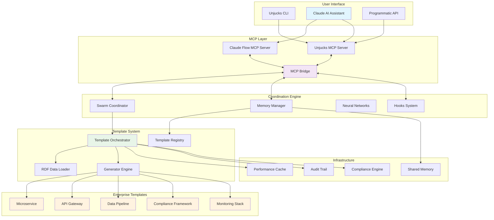
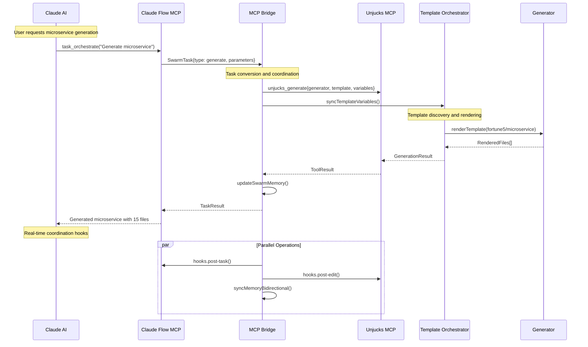
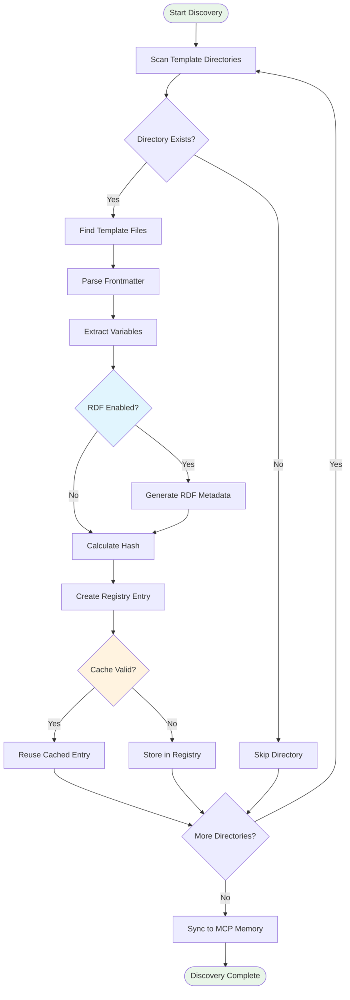
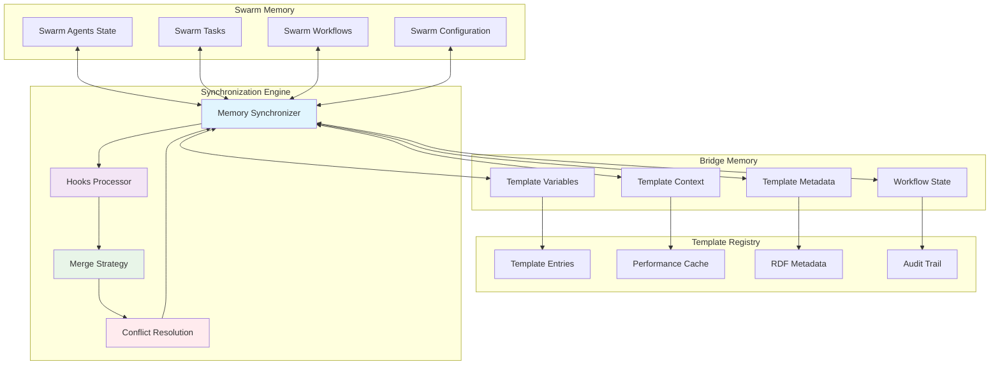
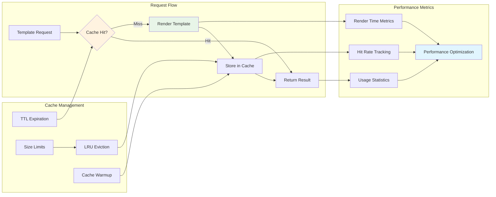
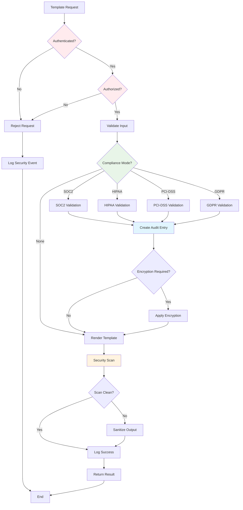
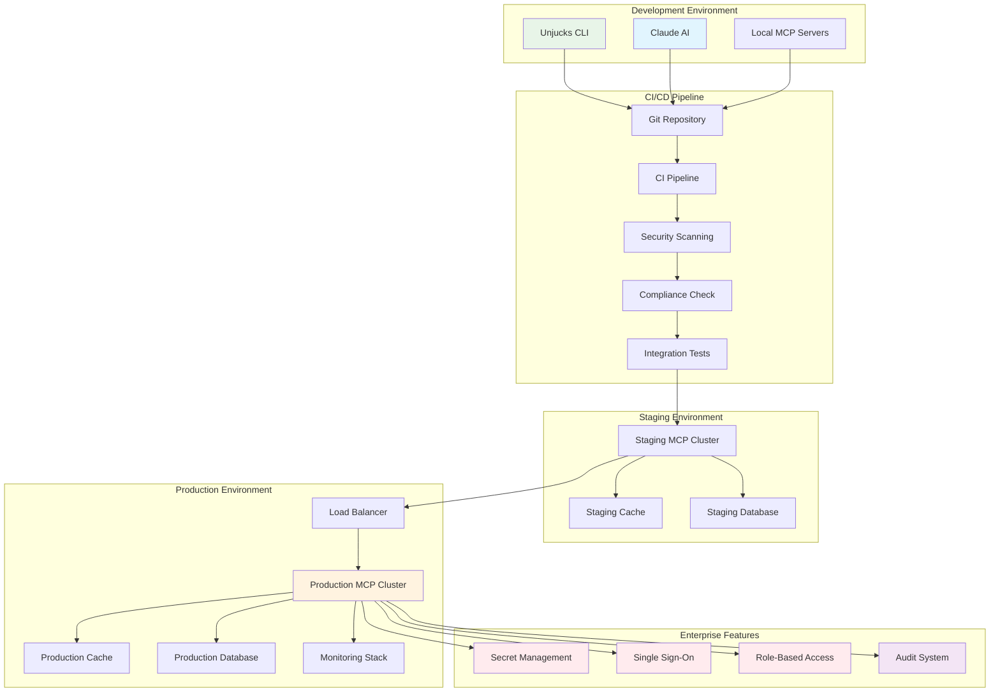

# MCP Integration Architecture Diagrams

## System Architecture Overview



## Data Flow Diagram



## Template Discovery Process



## JTBD Workflow Execution

```mermaid
stateDiagram-v2
    [*] --> WorkflowReceived
    
    WorkflowReceived --> ValidatingSteps
    ValidatingSteps --> ExecutionPlanning
    ExecutionPlanning --> StepExecution
    
    state StepExecution {
        [*] --> StepStart
        StepStart --> GenerateAction : action == 'generate'
        StepStart --> InjectAction : action == 'inject'
        StepStart --> AnalyzeAction : action == 'analyze'
        StepStart --> ValidateAction : action == 'validate'
        
        GenerateAction --> RenderTemplate
        InjectAction --> ModifyFile
        AnalyzeAction --> ScanTemplate
        ValidateAction --> CheckFiles
        
        RenderTemplate --> StepComplete
        ModifyFile --> StepComplete
        ScanTemplate --> StepComplete
        CheckFiles --> StepComplete
        
        StepComplete --> [*]
    }
    
    StepExecution --> MoreSteps{More Steps?}
    MoreSteps -->|Yes| StepExecution
    MoreSteps -->|No| ResultAggregation
    
    ResultAggregation --> MemorySync
    MemorySync --> AuditLogging
    AuditLogging --> WorkflowComplete
    
    WorkflowComplete --> [*]
    
    note right of ValidatingSteps
        • Check step dependencies
        • Validate parameters
        • Verify template availability
    end note
    
    note right of MemorySync
        • Update swarm memory
        • Sync template variables
        • Store workflow results
    end note
```

## Memory Synchronization Architecture



## Performance and Caching Layer



## Security and Compliance Flow



## Deployment Architecture



## Error Handling and Recovery

```mermaid
stateDiagram-v2
    [*] --> OperationStart
    
    OperationStart --> Executing
    Executing --> OperationError : Error Occurs
    Executing --> OperationSuccess : Success
    
    state OperationError {
        [*] --> ErrorClassification
        ErrorClassification --> ConnectionError : Network/MCP Issue
        ErrorClassification --> TemplateError : Template Issue
        ErrorClassification --> ValidationError : Input Issue
        ErrorClassification --> ComplianceError : Compliance Issue
        
        ConnectionError --> RetryConnection
        TemplateError --> FallbackTemplate
        ValidationError --> RequestInput
        ComplianceError --> ComplianceBypass
        
        RetryConnection --> RetryExecution
        FallbackTemplate --> RetryExecution
        RequestInput --> RetryExecution
        ComplianceBypass --> RetryExecution
        
        RetryExecution --> MaxRetriesReached{Max Retries?}
        MaxRetriesReached -->|No| [*]
        MaxRetriesReached -->|Yes| FailureLogging
        
        FailureLogging --> NotifyUser
        NotifyUser --> GracefulDegradation
        GracefulDegradation --> [*]
    }
    
    OperationError --> AuditError
    OperationSuccess --> AuditSuccess
    
    AuditError --> [*]
    AuditSuccess --> [*]
    
    note right of ErrorClassification
        Errors are classified by:
        • Error type and code
        • Originating component
        • Severity level
        • Recovery strategy
    end note
    
    note right of GracefulDegradation
        Fallback strategies:
        • Basic template generation
        • Cached results
        • Manual intervention
    end note
```

These architectural diagrams provide comprehensive visual documentation of the MCP integration system, covering all major components, data flows, and operational patterns.