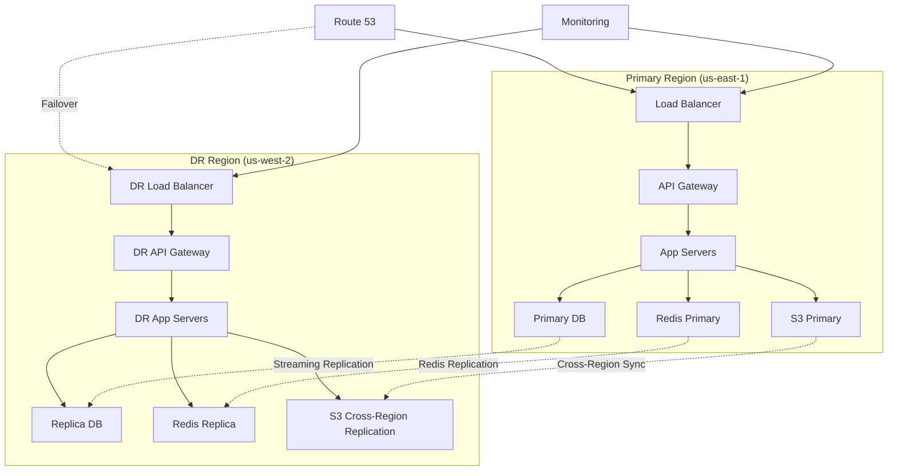

# Disaster Recovery Plan - Unjucks Enterprise Platform

## Executive Summary

This document outlines the comprehensive disaster recovery (DR) procedures for the Unjucks Enterprise Platform. The plan ensures business continuity with a Recovery Time Objective (RTO) of 4 hours and Recovery Point Objective (RPO) of 15 minutes for critical systems.

### Key Metrics
- **RTO (Recovery Time Objective)**: 4 hours maximum
- **RPO (Recovery Point Objective)**: 15 minutes maximum
- **SLA Commitment**: 99.9% uptime (8.77 hours downtime/year)
- **DR Site Location**: AWS us-west-2 (Primary: us-east-1)
- **Data Replication**: Continuous with 15-minute lag maximum

---

## Table of Contents

1. [Disaster Scenarios](#disaster-scenarios)
2. [Recovery Architecture](#recovery-architecture)
3. [Data Protection Strategy](#data-protection-strategy)
4. [Recovery Procedures](#recovery-procedures)
5. [Testing and Validation](#testing-and-validation)
6. [Communication Plan](#communication-plan)
7. [Post-Recovery Activities](#post-recovery-activities)
8. [Appendices](#appendices)

---

## Disaster Scenarios

### Classification Matrix

| Scenario | Probability | Impact | RTO | RPO | Response Level |
|----------|-------------|--------|-----|-----|----------------|
| **Regional AWS Outage** | Low | Critical | 4 hours | 15 min | Level 1 |
| **Database Corruption** | Medium | High | 2 hours | 15 min | Level 2 |
| **Application Server Failure** | High | Medium | 30 min | 0 min | Level 3 |
| **Network/CDN Outage** | Medium | Medium | 1 hour | 0 min | Level 3 |
| **Security Breach** | Low | Critical | 8 hours | 1 hour | Level 1 |
| **Data Center Fire/Natural Disaster** | Very Low | Critical | 6 hours | 15 min | Level 1 |
| **Third-party Service Outage** | Medium | Low | 2 hours | 0 min | Level 4 |

### Response Levels

#### Level 1: Critical (Full DR Activation)
- **Triggers**: Complete regional failure, security breach, natural disaster
- **Response Team**: Full DR team + executives
- **Communication**: All stakeholders + external notifications
- **Resources**: Full DR site activation

#### Level 2: High (Partial DR Activation)
- **Triggers**: Major component failure, data corruption
- **Response Team**: Technical DR team + management
- **Communication**: Internal teams + key customers
- **Resources**: Targeted system recovery

#### Level 3: Medium (Standard Recovery)
- **Triggers**: Service degradation, single component failure
- **Response Team**: On-call engineers + technical lead
- **Communication**: Internal teams only
- **Resources**: Hot-swap/failover procedures

#### Level 4: Low (Minimal Impact)
- **Triggers**: Non-critical service issues
- **Response Team**: Individual engineer or small team
- **Communication**: Team notifications
- **Resources**: Standard troubleshooting

---

## Recovery Architecture

### Multi-Region Setup



### Infrastructure Components

#### Primary Region (us-east-1)
- **Compute**: EKS cluster with 6 nodes (3 AZs)
- **Database**: RDS PostgreSQL Multi-AZ
- **Cache**: ElastiCache Redis cluster
- **Storage**: S3 with versioning enabled
- **CDN**: CloudFront with multiple origins
- **DNS**: Route 53 with health checks

#### DR Region (us-west-2)
- **Compute**: EKS cluster with 3 nodes (standby)
- **Database**: RDS Read Replica with automated failover
- **Cache**: ElastiCache Redis (standby)
- **Storage**: S3 with Cross-Region Replication
- **CDN**: CloudFront origin failover
- **DNS**: Route 53 failover routing

### Network Architecture

```yaml
# VPC Configuration
Primary_VPC:
  cidr: 10.0.0.0/16
  availability_zones: 3
  private_subnets: [10.0.1.0/24, 10.0.2.0/24, 10.0.3.0/24]
  public_subnets: [10.0.101.0/24, 10.0.102.0/24, 10.0.103.0/24]
  nat_gateways: 3
  
DR_VPC:
  cidr: 10.1.0.0/16
  availability_zones: 3
  private_subnets: [10.1.1.0/24, 10.1.2.0/24, 10.1.3.0/24]
  public_subnets: [10.1.101.0/24, 10.1.102.0/24, 10.1.103.0/24]
  nat_gateways: 2
  
VPC_Peering:
  connection: enabled
  dns_resolution: enabled
  cross_region: true
```

---

## Data Protection Strategy

### Backup Strategy

#### Database Backups

```bash
#!/bin/bash
# Database backup strategy implementation

# Continuous backup with point-in-time recovery
aws rds modify-db-instance \
    --db-instance-identifier unjucks-prod \
    --backup-retention-period 35 \
    --preferred-backup-window "03:00-04:00" \
    --delete-automated-backups false

# Manual snapshots for major releases
aws rds create-db-snapshot \
    --db-instance-identifier unjucks-prod \
    --db-snapshot-identifier "unjucks-prod-pre-release-$(date +%Y%m%d)"

# Cross-region snapshot copy
aws rds copy-db-snapshot \
    --source-db-snapshot-identifier arn:aws:rds:us-east-1:account:snapshot:source-snapshot \
    --target-db-snapshot-identifier target-snapshot \
    --source-region us-east-1 \
    --region us-west-2
```

#### Application Data Backups

```yaml
# Kubernetes backup using Velero
apiVersion: velero.io/v1
kind: Schedule
metadata:
  name: unjucks-daily-backup
  namespace: velero
spec:
  template:
    includedNamespaces:
    - unjucks-prod
    - unjucks-config
    excludedResources:
    - secrets
    storageLocation: aws-s3-backup
    volumeSnapshotLocations:
    - aws-ebs
    ttl: 720h0m0s  # 30 days
  schedule: "0 1 * * *"  # Daily at 1 AM UTC
```

#### Configuration Backups

```bash
#!/bin/bash
# Infrastructure as Code backup

# Terraform state backup
aws s3 sync s3://unjucks-terraform-state/ ./terraform-backup/

# Kubernetes manifests backup
kubectl get all,configmap,secret,ingress,pv,pvc --all-namespaces -o yaml > k8s-backup-$(date +%Y%m%d).yaml

# Helm releases backup
helm list --all-namespaces -o yaml > helm-releases-$(date +%Y%m%d).yaml

# Store in secure S3 bucket
aws s3 cp k8s-backup-$(date +%Y%m%d).yaml s3://unjucks-config-backup/kubernetes/
aws s3 cp helm-releases-$(date +%Y%m%d).yaml s3://unjucks-config-backup/helm/
```

### Data Replication

#### Database Replication

```sql
-- PostgreSQL streaming replication setup
-- Primary database configuration
ALTER SYSTEM SET wal_level = 'replica';
ALTER SYSTEM SET max_wal_senders = 3;
ALTER SYSTEM SET wal_keep_segments = 64;
ALTER SYSTEM SET archive_mode = 'on';
ALTER SYSTEM SET archive_command = 'aws s3 cp %p s3://unjucks-wal-backup/%f';

-- Create replication user
CREATE USER replicator REPLICATION LOGIN CONNECTION LIMIT 1 ENCRYPTED PASSWORD 'secure_password';

-- Configure pg_hba.conf for replication
-- host replication replicator 10.1.0.0/16 md5

SELECT pg_reload_conf();
```

#### File Storage Replication

```yaml
# S3 Cross-Region Replication
ReplicationConfiguration:
  Role: arn:aws:iam::account:role/replication-role
  Rules:
    - ID: ReplicateEverything
      Status: Enabled
      Priority: 1
      Filter:
        Prefix: ""
      Destination:
        Bucket: arn:aws:s3:::unjucks-dr-bucket
        StorageClass: STANDARD_IA
        ReplicationTime:
          Status: Enabled
          Time:
            Minutes: 15
        Metrics:
          Status: Enabled
          EventThreshold:
            Minutes: 15
```

---

## Recovery Procedures

### Automated Failover

#### Database Failover

```bash
#!/bin/bash
# Automated database failover script

set -e

DR_DB_INSTANCE="unjucks-dr-db"
PROD_DB_INSTANCE="unjucks-prod-db"

echo "Starting automated database failover..."

# Promote read replica to primary
aws rds promote-read-replica \
    --db-instance-identifier $DR_DB_INSTANCE

# Wait for promotion to complete
echo "Waiting for database promotion to complete..."
aws rds wait db-instance-available --db-instance-identifier $DR_DB_INSTANCE

# Update application configuration
echo "Updating application database configuration..."
kubectl patch configmap unjucks-config -p '{"data":{"DB_HOST":"'$(aws rds describe-db-instances --db-instance-identifier $DR_DB_INSTANCE --query 'DBInstances[0].Endpoint.Address' --output text)'"}}'

# Restart application pods
kubectl rollout restart deployment/unjucks-api

echo "Database failover completed successfully"
```

#### DNS Failover

```bash
#!/bin/bash
# Route 53 DNS failover script

set -e

HOSTED_ZONE_ID="Z1234567890"
DOMAIN="api.unjucks.dev"
DR_ENDPOINT="dr-api.unjucks.dev"

echo "Initiating DNS failover to DR site..."

# Create change batch for DNS failover
cat > dns-failover.json << EOF
{
    "Changes": [{
        "Action": "UPSERT",
        "ResourceRecordSet": {
            "Name": "$DOMAIN",
            "Type": "CNAME",
            "TTL": 60,
            "ResourceRecords": [{
                "Value": "$DR_ENDPOINT"
            }]
        }
    }]
}
EOF

# Apply DNS changes
CHANGE_ID=$(aws route53 change-resource-record-sets \
    --hosted-zone-id $HOSTED_ZONE_ID \
    --change-batch file://dns-failover.json \
    --query 'ChangeInfo.Id' --output text)

# Wait for DNS propagation
echo "Waiting for DNS changes to propagate..."
aws route53 wait resource-record-sets-changed --id $CHANGE_ID

echo "DNS failover completed successfully"
```

### Manual Recovery Procedures

#### Full DR Site Activation

```bash
#!/bin/bash
# Complete DR site activation procedure

set -e

echo "=== DISASTER RECOVERY ACTIVATION ==="
echo "Timestamp: $(date -u '+%Y-%m-%d %H:%M:%S UTC')"
echo "Initiated by: ${USER:-system}"

# Step 1: Validate DR infrastructure
echo "Step 1: Validating DR infrastructure..."
./scripts/validate-dr-infrastructure.sh

# Step 2: Promote databases
echo "Step 2: Promoting database replicas..."
./scripts/promote-database-replicas.sh

# Step 3: Scale up DR application servers
echo "Step 3: Scaling up DR application servers..."
kubectl scale deployment/unjucks-api --replicas=6 -n unjucks-dr
kubectl scale deployment/unjucks-worker --replicas=3 -n unjucks-dr

# Step 4: Update load balancer configuration
echo "Step 4: Configuring load balancer..."
./scripts/configure-dr-load-balancer.sh

# Step 5: Switch DNS traffic
echo "Step 5: Switching DNS traffic to DR site..."
./scripts/switch-dns-to-dr.sh

# Step 6: Validate service functionality
echo "Step 6: Validating service functionality..."
./scripts/validate-dr-services.sh

# Step 7: Send notifications
echo "Step 7: Sending completion notifications..."
./scripts/send-dr-activation-notification.sh

echo "=== DR ACTIVATION COMPLETED ==="
echo "DR site is now active and serving traffic"
echo "Monitor dashboards: https://monitoring-dr.unjucks.dev"
```

#### Database Point-in-Time Recovery

```bash
#!/bin/bash
# Point-in-time recovery procedure

set -e

RECOVERY_TIME="$1"
NEW_DB_IDENTIFIER="unjucks-pitr-$(date +%Y%m%d-%H%M%S)"

if [ -z "$RECOVERY_TIME" ]; then
    echo "Usage: $0 'YYYY-MM-DD HH:MM:SS'"
    echo "Example: $0 '2024-03-20 14:30:00'"
    exit 1
fi

echo "Starting point-in-time recovery to: $RECOVERY_TIME"

# Step 1: Stop application to prevent new writes
echo "Step 1: Stopping application..."
kubectl scale deployment/unjucks-api --replicas=0

# Step 2: Create new database instance from point-in-time
echo "Step 2: Creating database from point-in-time backup..."
aws rds restore-db-instance-to-point-in-time \
    --source-db-instance-identifier unjucks-prod \
    --target-db-instance-identifier $NEW_DB_IDENTIFIER \
    --restore-time "$RECOVERY_TIME" \
    --db-instance-class db.r5.2xlarge \
    --multi-az \
    --storage-encrypted

# Step 3: Wait for database to be available
echo "Step 3: Waiting for database to be available..."
aws rds wait db-instance-available --db-instance-identifier $NEW_DB_IDENTIFIER

# Step 4: Update application configuration
echo "Step 4: Updating application database configuration..."
NEW_DB_ENDPOINT=$(aws rds describe-db-instances \
    --db-instance-identifier $NEW_DB_IDENTIFIER \
    --query 'DBInstances[0].Endpoint.Address' \
    --output text)

kubectl patch configmap unjucks-config -p '{"data":{"DB_HOST":"'$NEW_DB_ENDPOINT'"}}'

# Step 5: Restart application
echo "Step 5: Restarting application..."
kubectl scale deployment/unjucks-api --replicas=3
kubectl rollout status deployment/unjucks-api

# Step 6: Validate recovery
echo "Step 6: Validating recovery..."
curl -f https://api.unjucks.dev/health

echo "Point-in-time recovery completed successfully"
echo "New database identifier: $NEW_DB_IDENTIFIER"
echo "Recovery time: $RECOVERY_TIME"
```

### Application Recovery

#### Container Recovery

```yaml
# Kubernetes deployment with recovery policies
apiVersion: apps/v1
kind: Deployment
metadata:
  name: unjucks-api
  namespace: unjucks-prod
spec:
  replicas: 3
  strategy:
    type: RollingUpdate
    rollingUpdate:
      maxSurge: 1
      maxUnavailable: 0
  template:
    spec:
      containers:
      - name: unjucks-api
        image: unjucks:latest
        resources:
          requests:
            memory: "1Gi"
            cpu: "500m"
          limits:
            memory: "2Gi"
            cpu: "1000m"
        livenessProbe:
          httpGet:
            path: /health
            port: 3000
          initialDelaySeconds: 30
          periodSeconds: 10
          timeoutSeconds: 5
          failureThreshold: 3
        readinessProbe:
          httpGet:
            path: /ready
            port: 3000
          initialDelaySeconds: 5
          periodSeconds: 5
          timeoutSeconds: 3
          failureThreshold: 2
        env:
        - name: NODE_ENV
          value: "production"
        - name: DB_HOST
          valueFrom:
            configMapKeyRef:
              name: unjucks-config
              key: DB_HOST
```

---

## Testing and Validation

### DR Testing Schedule

| Test Type | Frequency | Duration | Participants | Success Criteria |
|-----------|-----------|----------|--------------|-------------------|
| **Automated Monitoring** | Continuous | N/A | System | All health checks pass |
| **Backup Verification** | Daily | 30 min | Operations | Backup integrity confirmed |
| **Failover Testing** | Weekly | 2 hours | Engineering | RTO < 30 min |
| **DR Drill (Partial)** | Monthly | 4 hours | All teams | RTO < 4 hours |
| **DR Drill (Full)** | Quarterly | 8 hours | All teams + Executives | Full recovery success |
| **Annual DR Exercise** | Yearly | 24 hours | Organization-wide | Business continuity validated |

### Automated Testing

```bash
#!/bin/bash
# Automated DR testing script

set -e

TEST_TYPE="${1:-basic}"
LOG_FILE="/var/log/dr-test-$(date +%Y%m%d-%H%M%S).log"

echo "Starting DR test: $TEST_TYPE" | tee -a $LOG_FILE
echo "Timestamp: $(date -u '+%Y-%m-%d %H:%M:%S UTC')" | tee -a $LOG_FILE

case $TEST_TYPE in
    "basic")
        echo "Running basic DR tests..." | tee -a $LOG_FILE
        
        # Test 1: Database connectivity
        echo "Test 1: Database connectivity" | tee -a $LOG_FILE
        pg_isready -h $DR_DB_HOST -p 5432 && echo "✅ DR Database accessible" || echo "❌ DR Database unreachable"
        
        # Test 2: Application health
        echo "Test 2: Application health" | tee -a $LOG_FILE
        curl -f $DR_API_URL/health && echo "✅ DR API healthy" || echo "❌ DR API unhealthy"
        
        # Test 3: Storage accessibility
        echo "Test 3: Storage accessibility" | tee -a $LOG_FILE
        aws s3 ls s3://unjucks-dr-bucket/ > /dev/null && echo "✅ DR Storage accessible" || echo "❌ DR Storage unreachable"
        ;;
        
    "failover")
        echo "Running failover tests..." | tee -a $LOG_FILE
        
        # Simulate database failover
        echo "Simulating database failover..." | tee -a $LOG_FILE
        ./scripts/test-database-failover.sh
        
        # Test DNS switching
        echo "Testing DNS failover..." | tee -a $LOG_FILE
        ./scripts/test-dns-failover.sh
        
        # Validate service recovery
        echo "Validating service recovery..." | tee -a $LOG_FILE
        ./scripts/validate-service-recovery.sh
        ;;
        
    "full")
        echo "Running full DR drill..." | tee -a $LOG_FILE
        
        # Complete DR site activation
        ./scripts/full-dr-activation.sh
        
        # Run comprehensive tests
        ./scripts/comprehensive-dr-tests.sh
        
        # Measure recovery times
        ./scripts/measure-recovery-metrics.sh
        ;;
esac

echo "DR test completed: $TEST_TYPE" | tee -a $LOG_FILE
echo "Log file: $LOG_FILE"
```

### Performance Validation

```bash
#!/bin/bash
# DR site performance validation

set -e

DR_ENDPOINT="https://dr-api.unjucks.dev"
TEST_DURATION=300  # 5 minutes
CONCURRENCY=10

echo "Starting DR site performance validation"
echo "Endpoint: $DR_ENDPOINT"
echo "Duration: ${TEST_DURATION}s"
echo "Concurrency: $CONCURRENCY"

# Load testing with Apache Bench
echo "Running load tests..."
ab -t $TEST_DURATION -c $CONCURRENCY "$DR_ENDPOINT/health" > dr-performance-test.txt

# Extract key metrics
REQUESTS_PER_SEC=$(grep "Requests per second" dr-performance-test.txt | awk '{print $4}')
MEAN_RESPONSE_TIME=$(grep "Time per request" dr-performance-test.txt | head -1 | awk '{print $4}')
FAILED_REQUESTS=$(grep "Failed requests" dr-performance-test.txt | awk '{print $3}')

echo "Performance Results:"
echo "  Requests/sec: $REQUESTS_PER_SEC"
echo "  Mean response time: ${MEAN_RESPONSE_TIME}ms"
echo "  Failed requests: $FAILED_REQUESTS"

# Validate against thresholds
if (( $(echo "$REQUESTS_PER_SEC > 100" | bc -l) )); then
    echo "✅ Throughput test PASSED"
else
    echo "❌ Throughput test FAILED"
fi

if (( $(echo "$MEAN_RESPONSE_TIME < 500" | bc -l) )); then
    echo "✅ Response time test PASSED"
else
    echo "❌ Response time test FAILED"
fi

if [ "$FAILED_REQUESTS" -eq 0 ]; then
    echo "✅ Reliability test PASSED"
else
    echo "❌ Reliability test FAILED"
fi
```

---

## Communication Plan

### Stakeholder Matrix

| Stakeholder Group | Contact Method | Information Level | Update Frequency |
|-------------------|----------------|-------------------|------------------|
| **Executive Team** | Phone + Email | High-level status | Every 2 hours |
| **Engineering Team** | Slack + Email | Technical details | Every 30 minutes |
| **Customer Success** | Slack + Phone | Customer impact | Every hour |
| **External Customers** | Status Page | Service status | Real-time |
| **Partners/Vendors** | Email | Relevant updates | As needed |
| **Regulators** | Formal notification | Compliance info | Within 24 hours |

### Communication Templates

#### Initial Incident Notification

```
Subject: [URGENT] Disaster Recovery Activation - Unjucks Platform

🚨 DISASTER RECOVERY ACTIVATION

Incident ID: DR-{YYYY}{MM}{DD}-{HHMMSS}
Severity: CRITICAL
Start Time: {timestamp}
Impact: {description}

ACTIONS TAKEN:
• DR team activated
• Emergency procedures initiated
• Backup systems being prepared

EXPECTED RESOLUTION:
• Estimated recovery time: {RTO}
• Next update: {timestamp + 1 hour}

INCIDENT COMMANDER: {name}
CONTACT: {phone} | {email}

Status updates: https://status.unjucks.dev
Incident bridge: +1-555-BRIDGE (PIN: 1234)
```

#### Customer Communication

```
Subject: Service Restoration Update - Unjucks Platform

Dear Unjucks Customers,

We are currently experiencing a service disruption and have activated our disaster recovery procedures to restore full functionality.

CURRENT STATUS:
• Service availability: {percentage}%
• Affected features: {list}
• Estimated restoration: {timeline}

WHAT WE'RE DOING:
• Our disaster recovery site is now active
• All customer data remains secure and intact
• Our team is working around the clock

WHAT YOU CAN EXPECT:
• Service restoration within {RTO}
• No data loss (last backup: {timestamp})
• Regular updates every hour

We sincerely apologize for this disruption and appreciate your patience.

For real-time updates: https://status.unjucks.dev
Support: support@unjucks.dev | +1-555-SUPPORT

The Unjucks Team
```

### Status Page Updates

```yaml
# Automated status page configuration
status_page:
  provider: "statuspage.io"
  page_id: "unjucks-status"
  
  incident_templates:
    disaster_recovery:
      name: "Disaster Recovery Activation"
      status: "major_outage"
      components:
        - "API"
        - "Web Application"
        - "Template Generation"
      updates:
        - status: "investigating"
          body: "We are investigating a service disruption and have activated disaster recovery procedures."
        - status: "monitoring"
          body: "Disaster recovery site is active. Monitoring service restoration."
        - status: "resolved"
          body: "All services have been restored. Post-incident review will be published within 24 hours."
```

---

## Post-Recovery Activities

### Immediate Actions (0-4 hours after recovery)

1. **Service Validation**
   ```bash
   # Comprehensive service validation
   ./scripts/post-recovery-validation.sh
   ```

2. **Performance Monitoring**
   - Monitor all KPIs for 4 hours
   - Compare metrics to baseline
   - Address any performance degradation

3. **Customer Communication**
   - Send service restoration notification
   - Update status page to "resolved"
   - Begin customer outreach for critical accounts

### Short-term Actions (4-24 hours)

1. **Data Integrity Verification**
   ```sql
   -- Database integrity checks
   SELECT schemaname, tablename, attname, n_distinct, correlation 
   FROM pg_stats 
   WHERE schemaname = 'public';
   
   -- Check for data inconsistencies
   SELECT COUNT(*) FROM templates WHERE created_at > updated_at;
   ```

2. **Performance Analysis**
   ```bash
   # Generate performance report
   ./scripts/generate-performance-report.sh --post-recovery
   ```

3. **Security Validation**
   ```bash
   # Security posture verification
   ./scripts/security-validation.sh --post-incident
   ```

### Medium-term Actions (1-7 days)

1. **Post-Incident Review (PIR)**
   - Schedule PIR meeting within 24 hours
   - Gather timeline and technical details
   - Interview all involved team members
   - Document lessons learned

2. **Root Cause Analysis**
   ```bash
   # Automated log analysis
   ./scripts/root-cause-analysis.sh --incident-id DR-{incident-id}
   ```

3. **DR Plan Updates**
   - Review and update procedures based on learnings
   - Update RTO/RPO targets if needed
   - Enhance monitoring and alerting

### Long-term Actions (1-4 weeks)

1. **Process Improvements**
   - Implement automation for manual steps
   - Enhance monitoring capabilities
   - Update documentation

2. **Training Updates**
   - Conduct training based on lessons learned
   - Update runbooks and procedures
   - Schedule additional DR drills

3. **Technology Enhancements**
   - Evaluate need for infrastructure changes
   - Consider additional redundancy
   - Implement process automation

### Post-Incident Review Template

```markdown
# Post-Incident Review: {Incident ID}

## Executive Summary
- **Incident**: {description}
- **Duration**: {start} to {end} ({total duration})
- **Impact**: {customer/revenue impact}
- **Root Cause**: {summary}

## Timeline
| Time | Event | Action Taken |
|------|-------|-------------|
| {time} | {event} | {action} |

## What Went Well
- {positive observation 1}
- {positive observation 2}

## What Could Be Improved
- {improvement area 1}
- {improvement area 2}

## Action Items
| Action | Owner | Due Date | Priority |
|--------|-------|----------|----------|
| {action} | {owner} | {date} | {priority} |

## Lessons Learned
- {lesson 1}
- {lesson 2}

## Prevention Measures
- {measure 1}
- {measure 2}
```

---

## Appendices

### Appendix A: Emergency Contacts

#### Internal Team
| Role | Primary | Secondary | Phone | Email |
|------|---------|-----------|-------|-------|
| **Incident Commander** | Sarah Chen | Mike Johnson | +1-555-0201 | sarah.chen@unjucks.dev |
| **DR Technical Lead** | David Kim | Lisa Wang | +1-555-0202 | david.kim@unjucks.dev |
| **Database Administrator** | Alex Rodriguez | Emma Davis | +1-555-0203 | alex.rodriguez@unjucks.dev |
| **Security Lead** | Jennifer Liu | Ryan Martinez | +1-555-0204 | jennifer.liu@unjucks.dev |
| **Communications Lead** | Mark Thompson | Anna Brown | +1-555-0205 | mark.thompson@unjucks.dev |

#### External Vendors
| Service | Support Level | Phone | Email | Portal |
|---------|---------------|-------|-------|--------|
| **AWS** | Enterprise | +1-206-266-4064 | aws-support@unjucks.dev | https://console.aws.amazon.com/support |
| **Datadog** | Pro | +1-866-329-4466 | support@datadoghq.com | https://app.datadoghq.com/support |
| **PagerDuty** | Advanced | +1-844-700-6278 | support@pagerduty.com | https://unjucks.pagerduty.com |

### Appendix B: Recovery Scripts

#### Database Recovery Script

```bash
#!/bin/bash
# Database recovery automation

set -euo pipefail

SCRIPT_DIR="$(cd "$(dirname "${BASH_SOURCE[0]}")" && pwd)"
source "$SCRIPT_DIR/config/dr-config.sh"

function log() {
    echo "[$(date '+%Y-%m-%d %H:%M:%S')] $*" | tee -a "$LOG_FILE"
}

function check_prerequisites() {
    log "Checking prerequisites..."
    
    # Check AWS CLI
    aws --version > /dev/null || { log "ERROR: AWS CLI not found"; exit 1; }
    
    # Check database connectivity
    pg_isready -h "$PRIMARY_DB_HOST" > /dev/null || {
        log "WARNING: Primary database unreachable"
    }
    
    # Check DR database
    pg_isready -h "$DR_DB_HOST" > /dev/null || {
        log "ERROR: DR database unreachable"; exit 1;
    }
    
    log "Prerequisites check completed"
}

function promote_replica() {
    log "Promoting database replica..."
    
    aws rds promote-read-replica \
        --db-instance-identifier "$DR_DB_INSTANCE" \
        --region "$DR_REGION"
    
    log "Waiting for promotion to complete..."
    aws rds wait db-instance-available \
        --db-instance-identifier "$DR_DB_INSTANCE" \
        --region "$DR_REGION"
    
    log "Database promotion completed"
}

function update_application_config() {
    log "Updating application configuration..."
    
    # Get new database endpoint
    NEW_DB_ENDPOINT=$(aws rds describe-db-instances \
        --db-instance-identifier "$DR_DB_INSTANCE" \
        --region "$DR_REGION" \
        --query 'DBInstances[0].Endpoint.Address' \
        --output text)
    
    # Update Kubernetes ConfigMap
    kubectl patch configmap unjucks-config \
        --namespace "$NAMESPACE" \
        -p '{"data":{"DB_HOST":"'$NEW_DB_ENDPOINT'"}}'
    
    log "Application configuration updated"
}

function restart_applications() {
    log "Restarting application components..."
    
    # Restart API deployment
    kubectl rollout restart deployment/unjucks-api \
        --namespace "$NAMESPACE"
    
    # Wait for rollout to complete
    kubectl rollout status deployment/unjucks-api \
        --namespace "$NAMESPACE" \
        --timeout=300s
    
    log "Application restart completed"
}

function validate_recovery() {
    log "Validating database recovery..."
    
    # Test database connectivity
    psql -h "$NEW_DB_ENDPOINT" -U "$DB_USER" -d "$DB_NAME" \
        -c "SELECT 1" > /dev/null || {
        log "ERROR: Database connectivity test failed"
        exit 1
    }
    
    # Test application health
    curl -f "$APP_URL/health" > /dev/null || {
        log "ERROR: Application health check failed"
        exit 1
    }
    
    log "Recovery validation completed successfully"
}

# Main execution
main() {
    log "Starting database recovery procedure"
    
    check_prerequisites
    promote_replica
    update_application_config
    restart_applications
    validate_recovery
    
    log "Database recovery procedure completed successfully"
}

# Execute main function
main "$@"
```

### Appendix C: Monitoring and Alerting Configuration

```yaml
# Prometheus alerting rules for DR
groups:
  - name: disaster-recovery
    rules:
      - alert: DRSiteUnreachable
        expr: up{job="unjucks-dr"} == 0
        for: 2m
        labels:
          severity: critical
          team: platform
        annotations:
          summary: "DR site is unreachable"
          description: "DR site has been unreachable for more than 2 minutes"
          runbook_url: "https://runbooks.unjucks.dev/dr-site-unreachable"
      
      - alert: DatabaseReplicationLag
        expr: pg_replication_lag_seconds > 900  # 15 minutes
        for: 1m
        labels:
          severity: warning
          team: database
        annotations:
          summary: "Database replication lag is high"
          description: "Replication lag is {{ $value }} seconds"
      
      - alert: CrossRegionBackupFailed
        expr: increase(backup_failures_total{type="cross_region"}[1h]) > 0
        for: 0m
        labels:
          severity: critical
          team: platform
        annotations:
          summary: "Cross-region backup failed"
          description: "Cross-region backup has failed"
```

### Appendix D: Compliance and Regulatory Requirements

#### SOC 2 Compliance
- **Availability**: 99.9% uptime commitment
- **Processing Integrity**: Data validation during recovery
- **Confidentiality**: Encryption in transit and at rest during DR

#### GDPR Compliance
- **Data Portability**: Customer data export capabilities
- **Right to Erasure**: Data deletion procedures during recovery
- **Breach Notification**: 72-hour notification requirement

#### ISO 27001 Requirements
- **Business Continuity**: Documented DR procedures
- **Risk Assessment**: Regular DR testing and validation
- **Incident Management**: Structured response procedures

---

**Document Control:**
- **Version**: 3.1.0
- **Last Updated**: 2024-03-20
- **Next Review**: 2024-06-20
- **Document Owner**: Platform Engineering Team
- **Approved By**: Chief Technology Officer
- **Classification**: Internal Use - Confidential

**Distribution List:**
- Executive Team
- Engineering Leadership
- DevOps/SRE Team
- Security Team
- Customer Success Team
- Compliance Team