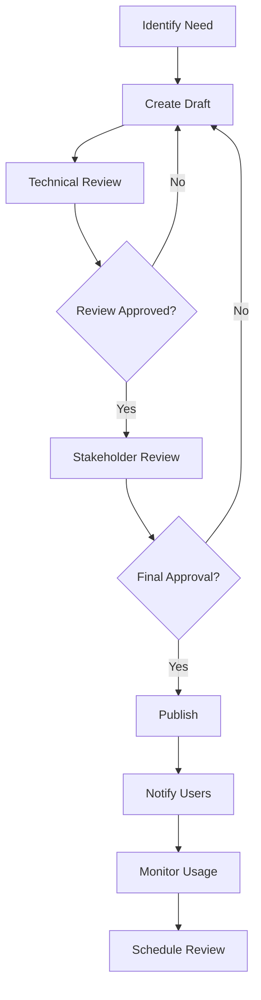

# Unjucks Enterprise Platform - Documentation Index

## Overview

This is the comprehensive documentation index for the Unjucks Enterprise Platform. Our documentation follows Fortune 500 standards with clear organization, version control, and regular updates to ensure accuracy and usefulness.

### Documentation Standards
- **Version Control**: All documentation is version-controlled and reviewed
- **Update Frequency**: Monthly reviews with quarterly comprehensive updates
- **Approval Process**: Technical review by subject matter experts, final approval by department heads
- **Access Control**: Role-based access with public, internal, and confidential classifications

---

## Quick Navigation

### For New Users
- 🚀 [Getting Started Guide](./getting-started.md)
- 🎯 [Training and Onboarding](./training/onboarding-training-guide.md)
- 📚 [User Guide](./USER_GUIDE.md)
- 🔍 [API Quick Reference](./api/openapi-specification.yaml)

### For Developers
- 🛠️ [Developer Onboarding](./DEVELOPER_ONBOARDING_GUIDE.md)
- 🏧 [Architecture Documentation](./architecture.md)
- 📝 [API Documentation](./API_DOCUMENTATION.md)
- 🧪 [Testing Guide](./testing/)

### For Operations
- 📊 [Runbooks](./runbooks/operational-procedures.md)
- 🎆 [Disaster Recovery](./disaster-recovery/disaster-recovery-plan.md)
- 🔒 [Security Guide](./security/security-compliance-guide.md)
- 📊 [Monitoring](./monitoring/)

---

## Documentation Structure

### 📚 Core Documentation

| Document | Description | Audience | Last Updated |
|----------|-------------|----------|-------------|
| [API Documentation](./api/openapi-specification.yaml) | Complete OpenAPI 3.0 specification | Developers, Integrators | 2024-03-20 |
| [Architecture Guide](./architecture.md) | System architecture and design | Engineers, Architects | 2024-03-15 |
| [User Guide](./USER_GUIDE.md) | End-user documentation | All Users | 2024-03-18 |
| [Configuration Guide](./configuration-guide.md) | Setup and configuration | Administrators | 2024-03-10 |

### 🏢 Enterprise Documentation

| Document | Description | Audience | Classification |
|----------|-------------|----------|----------------|
| [Security & Compliance](./security/security-compliance-guide.md) | Security policies and compliance | Security, Legal | Confidential |
| [Disaster Recovery Plan](./disaster-recovery/disaster-recovery-plan.md) | DR procedures and protocols | Operations, Management | Internal |
| [Operational Runbooks](./runbooks/operational-procedures.md) | Day-to-day operations | DevOps, SRE | Internal |
| [Training Materials](./training/onboarding-training-guide.md) | Comprehensive training guide | HR, Managers | Internal |

### 🛠️ Technical Guides

#### API and Integration
- [OpenAPI Specification](./api/openapi-specification.yaml) - Complete API documentation
- [API Examples](./api/examples/) - Code samples and integration guides
- [SDK Documentation](./api/sdk/) - Language-specific SDKs
- [Webhook Guide](./api/webhooks.md) - Event-driven integrations

#### Development
- [Development Setup](./development/setup.md) - Local development environment
- [Coding Standards](./development/standards.md) - Code style and best practices
- [Testing Guide](./testing/) - Testing frameworks and procedures
- [CI/CD Guide](./deployment/ci-cd.md) - Continuous integration and deployment

#### Deployment and Operations
- [Deployment Guide](./deployment/production-deployment-guide.md) - Production deployment procedures
- [Infrastructure Guide](./deployment/infrastructure-requirements.md) - Infrastructure requirements
- [Monitoring Setup](./monitoring/) - Observability and monitoring
- [Performance Guide](./performance/) - Optimization and tuning

### 📈 Business Documentation

#### Product Management
- [Product Roadmap](./product/roadmap.md) - Feature roadmap and timeline
- [Requirements Documentation](./product/requirements/) - Feature specifications
- [Market Analysis](./product/market-analysis.md) - Competitive landscape
- [Customer Feedback](./product/feedback/) - User research and feedback

#### Compliance and Legal
- [Privacy Policy](./legal/privacy-policy.md) - Data handling and privacy
- [Terms of Service](./legal/terms-of-service.md) - Service terms and conditions
- [Compliance Reports](./compliance/) - Regulatory compliance documentation
- [Audit Reports](./audit/) - Security and compliance audits

---

## Documentation by Role

### 💻 Software Engineers

**Essential Reading:**
1. [Developer Onboarding Guide](./DEVELOPER_ONBOARDING_GUIDE.md)
2. [API Documentation](./API_DOCUMENTATION.md)
3. [Architecture Overview](./architecture.md)
4. [Coding Standards](./development/standards.md)
5. [Testing Guide](./testing/)

**Reference Materials:**
- [OpenAPI Specification](./api/openapi-specification.yaml)
- [Code Examples](./examples/)
- [Troubleshooting Guide](./TROUBLESHOOTING_GUIDE.md)
- [Performance Optimization](./performance/)

### 🛡️ DevOps/SRE Engineers

**Essential Reading:**
1. [Operational Runbooks](./runbooks/operational-procedures.md)
2. [Deployment Guide](./deployment/production-deployment-guide.md)
3. [Monitoring Setup](./monitoring/)
4. [Disaster Recovery Plan](./disaster-recovery/disaster-recovery-plan.md)
5. [Security Guide](./security/security-compliance-guide.md)

**Reference Materials:**
- [Infrastructure Requirements](./deployment/infrastructure-requirements.md)
- [CI/CD Pipelines](./deployment/ci-cd.md)
- [Performance Monitoring](./performance/performance-monitoring-architecture.md)
- [Incident Response](./runbooks/incident-response.md)

### 📊 Product Managers

**Essential Reading:**
1. [Product Overview](./product/overview.md)
2. [User Guide](./USER_GUIDE.md)
3. [Market Analysis](./product/market-analysis.md)
4. [Feature Specifications](./product/requirements/)
5. [Customer Feedback](./product/feedback/)

**Reference Materials:**
- [Roadmap Planning](./product/roadmap.md)
- [Competitive Analysis](./product/competitive-analysis.md)
- [Usage Analytics](./analytics/)
- [Success Metrics](./product/metrics.md)

### 🔒 Security Engineers

**Essential Reading:**
1. [Security & Compliance Guide](./security/security-compliance-guide.md)
2. [Security Architecture](./security/architecture.md)
3. [Incident Response Plan](./security/incident-response.md)
4. [Audit Requirements](./compliance/audit-requirements.md)
5. [Threat Model](./security/threat-model.md)

**Reference Materials:**
- [Security Policies](./security/policies/)
- [Compliance Reports](./compliance/)
- [Vulnerability Management](./security/vulnerability-management.md)
- [Security Training](./training/security-training.md)

### 💼 Executive Leadership

**Essential Reading:**
1. [Executive Summary](./EXECUTIVE_SUMMARY_ENTERPRISE_READINESS.md)
2. [Business Continuity Plan](./disaster-recovery/business-continuity.md)
3. [Compliance Status](./compliance/status-report.md)
4. [Risk Assessment](./risk/enterprise-risk-assessment.md)
5. [Performance Metrics](./metrics/executive-dashboard.md)

**Reference Materials:**
- [Quarterly Business Reviews](./business/qbr/)
- [Regulatory Updates](./compliance/regulatory-updates.md)
- [Strategic Planning](./business/strategy/)
- [Vendor Assessments](./vendor/assessments/)

---

## Documentation Lifecycle

### Creation Process



### Review Schedule

| Document Type | Review Frequency | Owner | Approver |
|---------------|------------------|-------|----------|
| **API Documentation** | Monthly | Engineering | CTO |
| **Security Policies** | Quarterly | Security Team | CISO |
| **Runbooks** | Bi-monthly | DevOps | VP Engineering |
| **User Guides** | Monthly | Product Team | CPO |
| **Training Materials** | Quarterly | HR/Training | VP People |
| **Compliance Docs** | As Required | Legal/Compliance | General Counsel |

### Version Control

```yaml
# Documentation versioning strategy
versioning:
  scheme: "semantic"
  format: "major.minor.patch"
  
  triggers:
    major: "Breaking changes, complete rewrites"
    minor: "New sections, significant updates"
    patch: "Bug fixes, minor corrections"
  
  retention:
    current: "Indefinite"
    previous_major: "2 years"
    previous_minor: "1 year"
    patches: "6 months"

metadata:
  required_fields:
    - version
    - last_updated
    - owner
    - approver
    - classification
    - next_review_date
```

---

## Search and Discovery

### Search Tools

- **Full-Text Search**: Available through internal wiki
- **Tag-Based Filtering**: Documents tagged by topic, audience, type
- **AI-Powered Search**: Semantic search for complex queries
- **Version History**: Access to all document versions

### Common Searches

| What you're looking for | Start here |
|------------------------|------------|
| "How do I integrate with the API?" | [API Documentation](./API_DOCUMENTATION.md) |
| "What's the deployment process?" | [Deployment Guide](./deployment/production-deployment-guide.md) |
| "How do I handle security incidents?" | [Security Guide](./security/security-compliance-guide.md) |
| "What are the coding standards?" | [Development Standards](./development/standards.md) |
| "How do I set up monitoring?" | [Monitoring Guide](./monitoring/) |
| "What's our disaster recovery plan?" | [DR Plan](./disaster-recovery/disaster-recovery-plan.md) |

### Documentation Tags

```yaml
# Tagging taxonomy
tags:
  audience:
    - developers
    - operations
    - security
    - product
    - executives
    - customers
  
  type:
    - guide
    - reference
    - tutorial
    - runbook
    - policy
    - specification
  
  topic:
    - api
    - deployment
    - security
    - monitoring
    - compliance
    - training
  
  classification:
    - public
    - internal
    - confidential
    - restricted
```

---

## Quality Standards

### Documentation Quality Checklist

**Content Quality:**
- [ ] Accurate and up-to-date information
- [ ] Clear, concise language
- [ ] Proper grammar and spelling
- [ ] Logical structure and flow
- [ ] Appropriate level of detail for audience

**Technical Quality:**
- [ ] Code examples are tested and working
- [ ] Screenshots are current and clear
- [ ] Links are functional and relevant
- [ ] Formatting is consistent
- [ ] Version information is accurate

**Usability:**
- [ ] Easy to navigate
- [ ] Searchable content
- [ ] Mobile-friendly format
- [ ] Accessible to users with disabilities
- [ ] Multiple formats available (web, PDF, etc.)

### Style Guide

```markdown
# Unjucks Documentation Style Guide

## Writing Style
- Use active voice
- Write in second person ("you")
- Use clear, simple language
- Avoid jargon unless necessary
- Include examples for complex concepts

## Formatting Standards
- Use Markdown for all documentation
- Consistent heading hierarchy (H1 > H2 > H3)
- Code blocks with language specification
- Consistent bullet point style
- Standard table formatting

## Visual Elements
- Screenshots should be 1200px wide maximum
- Diagrams use Mermaid syntax when possible
- Consistent color scheme for diagrams
- Alt text for all images
- Captions for complex visuals
```

---

## Feedback and Contributions

### How to Provide Feedback

**Quick Feedback:**
- Use the feedback widget on each page
- Rate documents (1-5 stars)
- Leave comments on specific sections

**Detailed Feedback:**
- Create an issue in our documentation repository
- Email the document owner directly
- Suggest improvements during regular reviews

**Contributing Changes:**
1. Fork the documentation repository
2. Create a feature branch
3. Make your changes
4. Submit a pull request
5. Undergo review process
6. Merge after approval

### Documentation Metrics

```yaml
# Documentation success metrics
metrics:
  usage:
    - page_views
    - unique_visitors
    - time_on_page
    - bounce_rate
    - search_queries
  
  quality:
    - user_ratings
    - feedback_scores
    - update_frequency
    - accuracy_reports
    - accessibility_scores
  
  effectiveness:
    - task_completion_rates
    - support_ticket_reduction
    - onboarding_time
    - feature_adoption
    - developer_productivity
```

---

## Contact Information

### Documentation Team

| Role | Name | Email | Slack |
|------|------|-------|-------|
| **Documentation Lead** | Sarah Chen | sarah.chen@unjucks.dev | @sarah.chen |
| **Technical Writer** | Mike Johnson | mike.johnson@unjucks.dev | @mike.johnson |
| **Developer Advocate** | Lisa Wang | lisa.wang@unjucks.dev | @lisa.wang |
| **Content Strategist** | David Kim | david.kim@unjucks.dev | @david.kim |

### Subject Matter Experts

| Area | Expert | Contact |
|------|--------|----------|
| **API Documentation** | Engineering Team | #engineering |
| **Security Documentation** | Security Team | #security |
| **Operations Documentation** | DevOps Team | #devops |
| **Product Documentation** | Product Team | #product |
| **Training Materials** | People Team | #people-ops |

### Getting Help

- **General Questions**: #documentation in Slack
- **Technical Issues**: #it-support in Slack
- **Content Requests**: documentation@unjucks.dev
- **Emergency Updates**: Contact documentation lead directly

---

## Related Resources

### External Standards and References
- [OpenAPI 3.0 Specification](https://spec.openapis.org/oas/v3.0.3)
- [Markdown Guide](https://www.markdownguide.org/)
- [Mermaid Diagram Syntax](https://mermaid-js.github.io/mermaid/)
- [WCAG Accessibility Guidelines](https://www.w3.org/WAG/WCAG21/quickref/)

### Industry Best Practices
- [Google Developer Documentation Style Guide](https://developers.google.com/style)
- [Microsoft Writing Style Guide](https://docs.microsoft.com/en-us/style-guide/welcome/)
- [Red Hat Technical Writing Style Guide](https://redhat-documentation.github.io/)

---

**Document Information:**
- **Version**: 2.0.0
- **Last Updated**: 2024-03-20
- **Owner**: Documentation Team
- **Next Review**: 2024-06-20
- **Classification**: Internal

**Quick Links:**
- [Submit Feedback](https://forms.unjucks.dev/doc-feedback)
- [Request New Documentation](https://forms.unjucks.dev/doc-request)
- [Report Issues](https://github.com/unjucks/docs/issues)
- [Style Guide](./style-guide.md)

---

*This documentation index is maintained by the Unjucks Documentation Team. For questions or suggestions, please reach out through the contact channels listed above.*