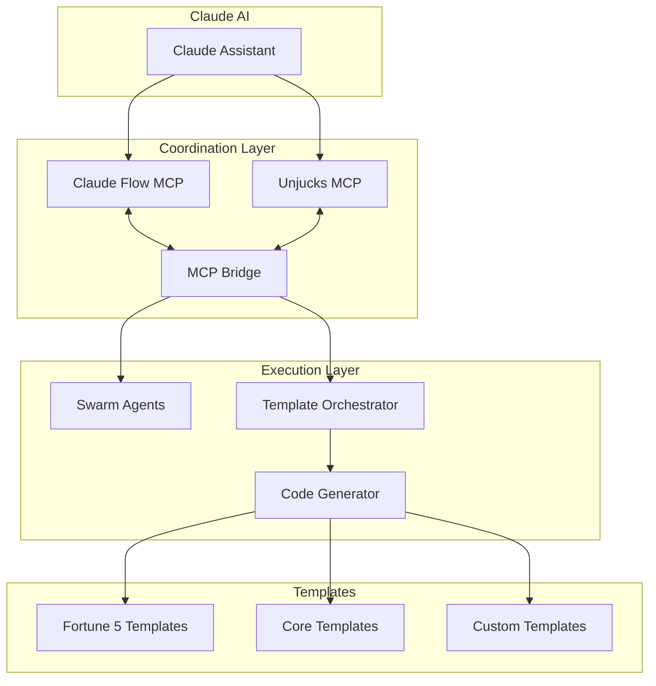

# Unjucks + Claude Flow Integration Summary

## Quick Overview

The integration between Unjucks and Claude Flow creates a powerful hive mind architecture for enterprise code generation and orchestration. This document provides a quick reference for getting started.

## What This Integration Enables

### 🚀 Intelligent Code Generation
- **AI-Coordinated Scaffolding**: Claude AI directly orchestrates template generation
- **Context-Aware Templates**: Templates adapt based on project context and requirements
- **Real-Time Coordination**: Swarm agents coordinate template operations in parallel

### 🏢 Enterprise-Grade Templates
- **Fortune 5 Collection**: Production-ready templates for microservices, API gateways, data pipelines
- **Compliance Built-In**: SOC2, HIPAA, PCI-DSS, GDPR compliance controls
- **Multi-Cloud Ready**: AWS, Azure, GCP, and on-premises deployments

### 🧠 Hive Mind Capabilities
- **Memory Synchronization**: Shared context between swarm agents and template system
- **Workflow Orchestration**: Jobs-to-be-Done (JTBD) workflow execution
- **Performance Optimization**: Intelligent caching and resource management

## Quick Start Guide

### 1. Setup

```bash
# Install Unjucks
npm install -g unjucks

# Add Claude Flow MCP server
claude mcp add claude-flow npx claude-flow@alpha mcp start

# Add Unjucks MCP server
claude mcp add unjucks node /path/to/unjucks/dist/mcp-server.mjs
```

### 2. Initialize Integration

```bash
# Initialize swarm coordination
npx claude-flow@alpha swarm init --topology mesh --maxAgents 5

# Discover available templates
unjucks list
```

### 3. Basic Usage

#### Via Claude AI (Recommended)
Simply describe what you want to build in natural language:

> "Create a production-ready microservice with PostgreSQL database, OAuth2 authentication, and SOC2 compliance for AWS deployment"

Claude will automatically:
1. Identify the appropriate Fortune 5 template
2. Configure variables based on your requirements
3. Generate the complete project structure
4. Provide deployment instructions

#### Via Command Line
```bash
# Generate microservice
unjucks generate fortune5/microservice \
  --serviceName user-management \
  --databaseType postgresql \
  --authProvider oauth2 \
  --complianceMode soc2 \
  --cloudProvider aws
  
# Generate API gateway
unjucks generate fortune5/api-gateway \
  --gatewayName enterprise-api \
  --authStrategy jwt \
  --rateLimitStrategy sliding-window
```

### 4. Template Discovery

```bash
# List all templates
unjucks list

# Get help for specific template
unjucks help fortune5/microservice

# Search templates by category
unjucks list --category microservice
```

## Available Templates

### Enterprise Templates (Fortune 5)

| Template | Purpose | Compliance | Key Features |
|----------|---------|------------|--------------|
| `fortune5/microservice` | Production microservice | SOC2, HIPAA, PCI-DSS | Kubernetes, multi-DB, auth, observability |
| `fortune5/api-gateway` | API gateway/proxy | SOC2, OWASP API | Rate limiting, load balancing, WAF |
| `fortune5/data-pipeline` | Data processing | GDPR, CCPA | ETL/ELT, governance, lineage |
| `fortune5/compliance` | Compliance framework | All standards | Audit trails, controls, reporting |
| `fortune5/monitoring` | Observability stack | SOC2 | Metrics, logging, tracing, alerting |

### Core Templates

| Template | Purpose | Use Case |
|----------|---------|----------|
| `component/react` | React component | Frontend development |
| `service/express` | Express.js API | Backend services |
| `config/typescript` | TypeScript config | Project setup |
| `docs/api` | API documentation | Documentation generation |

## Common Workflows

### 1. Full-Stack Application

```typescript
// Orchestrated via Claude AI
const workflow = {
  job: "Deploy full-stack application with monitoring",
  steps: [
    "Generate React frontend with authentication",
    "Create Express.js backend with PostgreSQL", 
    "Setup API gateway with rate limiting",
    "Deploy monitoring and logging stack",
    "Configure CI/CD pipeline"
  ]
};
```

### 2. Microservices Platform

```bash
# Generate multiple services in parallel via swarm
claude-flow task orchestrate \
  --task "Create user, product, and order microservices with shared API gateway" \
  --strategy parallel \
  --maxAgents 4
```

### 3. Compliance Implementation

```bash
# Add compliance controls to existing project
unjucks generate fortune5/compliance \
  --complianceType soc2 \
  --auditingEnabled true \
  --inject true \
  --dest ./existing-project
```

## MCP Commands Reference

### Swarm Coordination

```bash
# Initialize swarm
npx claude-flow@alpha swarm init --topology mesh

# Check status
npx claude-flow@alpha swarm status

# Spawn agents
npx claude-flow@alpha agent spawn --type coder --capabilities "template-generation"

# Orchestrate tasks
npx claude-flow@alpha task orchestrate --task "Generate enterprise API"
```

### Template Operations

```bash
# List templates via MCP
npx unjucks list --format json

# Generate with MCP integration  
npx unjucks generate --mcp --coordination swarm

# Inject into existing code
npx unjucks inject --file src/app.js --template middleware
```

### Memory Management

```bash
# Store template variables in swarm memory
npx claude-flow@alpha hooks post-edit \
  --memoryKey "hive/templates/variables" \
  --data '{"serviceName": "user-api", "authType": "jwt"}'

# Sync memory between systems
npx claude-flow@alpha hooks memory-sync
```

## Integration Architecture



## Key Benefits

### For Developers
- **Faster Development**: 10x faster scaffolding with enterprise standards
- **Consistency**: Standardized patterns across all projects
- **Best Practices**: Built-in security, compliance, and observability
- **AI Assistance**: Natural language project generation

### For Enterprises
- **Compliance**: Built-in regulatory compliance (SOC2, HIPAA, PCI-DSS, GDPR)
- **Security**: Security-first design with comprehensive controls
- **Scalability**: Production-ready infrastructure from day one
- **Governance**: Centralized template management and versioning

### For Platform Teams
- **Standardization**: Consistent architecture across teams
- **Observability**: Built-in monitoring and alerting
- **Automation**: Automated deployment and operations
- **Flexibility**: Customizable templates for specific needs

## Performance Characteristics

### Generation Speed
- **Simple Templates**: < 1 second
- **Enterprise Templates**: 2-5 seconds
- **Complex Workflows**: 10-30 seconds
- **Parallel Generation**: 50-80% time savings

### Cache Performance
- **Cache Hit Rate**: 85-95% for frequently used templates
- **Memory Usage**: < 100MB for template registry
- **Concurrent Operations**: Up to 10 simultaneous generations

### Scalability
- **Template Registry**: Supports 1000+ templates
- **Concurrent Users**: 50+ developers simultaneously
- **Memory Sync**: < 5 second synchronization latency
- **Error Recovery**: Automatic retry and failover

## Troubleshooting Quick Reference

### Common Issues

| Issue | Symptom | Solution |
|-------|---------|----------|
| MCP Connection Failure | Bridge initialization errors | `npx claude-flow@alpha restart` |
| Template Not Found | Empty template list | Check template directory paths |
| Memory Sync Issues | Stale variables | `bridge.emit('memory-sync')` |
| Render Failures | Template compilation errors | Validate required variables |

### Debug Commands

```bash
# Enable debug mode
export DEBUG_UNJUCKS=true

# Check MCP status
npx claude-flow@alpha status --verbose

# Validate template structure
unjucks help <template-name> --validate

# Test memory synchronization
npx claude-flow@alpha hooks memory-sync --test
```

## Next Steps

1. **Explore Templates**: Browse available templates with `unjucks list`
2. **Read Documentation**: Check detailed guides in `/docs/`
3. **Customize Templates**: Create organization-specific templates
4. **Setup CI/CD**: Integrate with deployment pipelines
5. **Monitor Usage**: Track template performance and usage

## Resources

- **Full Documentation**: `/docs/mcp-integration-guide.md`
- **Enterprise Guide**: `/docs/fortune5-enterprise-guide.md`
- **API Reference**: `/docs/api/README.md`
- **Examples**: `/examples/` directory
- **Community**: GitHub Discussions and Issues

This integration represents a paradigm shift toward intelligent, AI-coordinated development tooling that delivers enterprise-grade results with unprecedented developer experience.