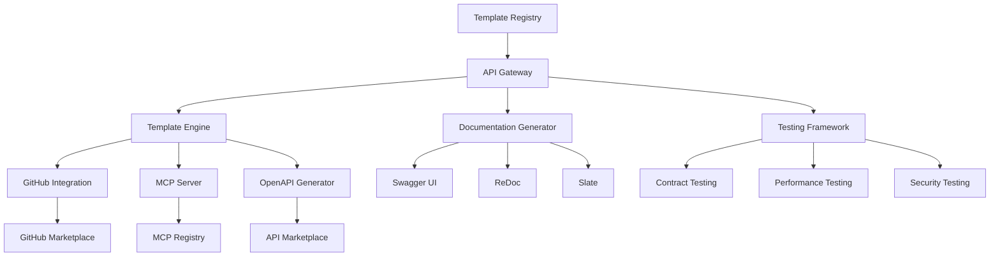

# API and Integration Marketplace Documentation

## Overview

This document outlines the comprehensive API and integration marketplace capabilities within the Unjucks ecosystem, covering GitHub integration patterns, MCP protocol sharing, API template generation, OpenAPI/Swagger marketplace integration, and template sharing mechanisms.

## Table of Contents

1. [GitHub Integration Marketplace](#github-integration-marketplace)
2. [MCP Protocol Sharing and Distribution](#mcp-protocol-sharing-and-distribution)
3. [API Template Generation](#api-template-generation)
4. [OpenAPI/Swagger Marketplace Integration](#openapiswagger-marketplace-integration)
5. [Integration Template Sharing](#integration-template-sharing)
6. [API Documentation Generation](#api-documentation-generation)
7. [API Testing and Validation](#api-testing-and-validation)
8. [Marketplace Architecture](#marketplace-architecture)
9. [Implementation Guide](#implementation-guide)
10. [Best Practices](#best-practices)

## GitHub Integration Marketplace

### Overview
GitHub Marketplace serves as a powerful platform for sharing API integrations, tools, and development resources within the software development ecosystem. With over 10,000 published actions as of 2024, it demonstrates substantial growth in the developer marketplace.

### Key Integration Approaches

#### GitHub Apps
GitHub Apps provide the most flexible integration mechanism:

```yaml
# Example GitHub App configuration
app_config:
  name: "Unjucks API Integration"
  description: "Template generation and API scaffolding tool"
  permissions:
    contents: read
    pull_requests: write
    repository_projects: read
  webhook_events:
    - push
    - pull_request
    - repository
```

#### Integration Types
- **Continuous Integration Tools**: Automated testing, building, and deployment
- **Code Quality Tools**: Linting, security scanning, performance analysis
- **Project Management**: Issue tracking, project boards, workflow automation
- **API Documentation**: Automated documentation generation and updates

### Marketplace Distribution Strategies

1. **Direct Marketplace Publishing**
   - Submit GitHub App to marketplace
   - Include comprehensive documentation
   - Provide usage examples and templates

2. **Open Source Distribution**
   - Public repository with clear README
   - MIT or Apache licensing
   - Community contribution guidelines

3. **Enterprise Solutions**
   - Private app distribution
   - Organization-specific integrations
   - Custom deployment strategies

### Implementation Example

```javascript
// GitHub Integration for Unjucks
export class GitHubIntegration {
  constructor(config) {
    this.github = new Octokit({ auth: config.token });
    this.templates = config.templates;
  }
  
  async createPullRequestWithTemplate(repo, template, variables) {
    const generated = await this.generateFromTemplate(template, variables);
    
    return await this.github.pulls.create({
      ...repo,
      title: `Add ${template} integration`,
      body: generated.description,
      head: `feature/${template}-integration`,
      base: 'main'
    });
  }
  
  async setupWebhooks(repo, events) {
    return await this.github.repos.createWebhook({
      ...repo,
      config: {
        url: `${this.baseUrl}/webhooks/github`,
        content_type: 'json',
        secret: this.webhookSecret
      },
      events
    });
  }
}
```

## MCP Protocol Sharing and Distribution

### Model Context Protocol Overview
The Model Context Protocol (MCP), introduced by Anthropic in November 2024, standardizes AI system integration with external tools and data sources. It has experienced explosive growth with nearly 16,000 unique servers.

### MCP Server Architecture

```typescript
// MCP Server Implementation for Unjucks
interface MCPServerConfig {
  name: string;
  version: string;
  capabilities: MCPCapability[];
  tools: MCPTool[];
  resources: MCPResource[];
}

class UnjucksMCPServer {
  constructor(config: MCPServerConfig) {
    this.config = config;
    this.bridge = new MCPBridge();
  }
  
  async handleToolCall(request: MCPRequest): Promise<MCPResponse> {
    switch (request.params.name) {
      case 'unjucks_generate':
        return await this.generateTemplate(request.params.arguments);
      case 'unjucks_list':
        return await this.listTemplates();
      case 'unjucks_validate':
        return await this.validateTemplate(request.params.arguments);
      default:
        throw new Error(`Unknown tool: ${request.params.name}`);
    }
  }
  
  async generateTemplate(params: GenerateParams): Promise<GenerateResult> {
    const { generator, template, variables, dest } = params;
    
    // Execute template generation
    const result = await this.templateEngine.generate({
      generator,
      template,
      variables,
      dest,
      options: { force: params.force, dry: params.dry }
    });
    
    return {
      success: true,
      files: result.files,
      metadata: result.metadata
    };
  }
}
```

### Server Distribution Methods

#### Official Repository
```bash
# Clone MCP servers repository
git clone https://github.com/modelcontextprotocol/servers
cd servers/unjucks

# Install dependencies
npm install

# Configure server
cp .env.example .env
# Edit configuration

# Start server
npm start
```

#### Package Registry Distribution
```json
{
  "name": "@unjucks/mcp-server",
  "version": "1.0.0",
  "description": "Unjucks MCP Server for template generation",
  "main": "dist/server.js",
  "bin": {
    "unjucks-mcp": "bin/server.js"
  },
  "mcp": {
    "server": {
      "command": "node",
      "args": ["dist/server.js"]
    },
    "capabilities": ["tools", "resources", "templates"]
  }
}
```

### Security and Trust Considerations

```typescript
// Security validation for MCP operations
class MCPSecurityValidator {
  async validateRequest(request: MCPRequest): Promise<boolean> {
    // Validate request structure
    if (!this.isValidMCPRequest(request)) {
      throw new SecurityError('Invalid MCP request structure');
    }
    
    // Check permissions
    const permissions = await this.getPermissions(request.source);
    if (!this.hasRequiredPermissions(request, permissions)) {
      throw new SecurityError('Insufficient permissions');
    }
    
    // Validate parameters
    if (!this.validateParameters(request.params)) {
      throw new SecurityError('Invalid parameters');
    }
    
    return true;
  }
  
  private isValidMCPRequest(request: any): request is MCPRequest {
    return (
      request.jsonrpc === '2.0' &&
      typeof request.id === 'number' &&
      typeof request.method === 'string'
    );
  }
}
```

## API Template Generation

### Template Structure
Unjucks supports comprehensive API template generation with semantic scaffolding:

```yaml
# API Template Configuration
name: rest-api
description: RESTful API with authentication and CRUD operations
version: 1.0.0
category: api

frontmatter:
  to: "{{ dest }}/{{ serviceName | kebab }}-api"
  inject: false
  skipIf: "{{ !includeAPI }}"

templates:
  - name: server
    files:
      - server.js.njk → server.js
      - routes/index.js.njk → routes/index.js
      - middleware/auth.js.njk → middleware/auth.js
      
  - name: models
    files:
      - models/{{ modelName }}.js.njk → models/{{ modelName | pascal }}.js
      
  - name: controllers
    files:
      - controllers/{{ modelName }}.js.njk → controllers/{{ modelName | pascal }}Controller.js

variables:
  - name: serviceName
    type: string
    description: Name of the API service
    required: true
    
  - name: modelName
    type: string
    description: Primary data model name
    required: true
    
  - name: includeAuth
    type: boolean
    description: Include authentication middleware
    default: true
    
  - name: database
    type: select
    description: Database type
    options: [postgresql, mysql, mongodb, sqlite]
    default: postgresql
```

### Dynamic Template Generation

```javascript
// API Template Generator
export class APITemplateGenerator {
  constructor() {
    this.templates = new Map();
    this.validators = new Map();
  }
  
  async generateAPI(specification) {
    const { openapi, paths, components } = specification;
    
    // Extract models from OpenAPI components
    const models = this.extractModels(components.schemas);
    
    // Generate routes from paths
    const routes = this.extractRoutes(paths);
    
    // Create template context
    const context = {
      apiVersion: openapi,
      models,
      routes,
      security: this.extractSecurity(specification),
      metadata: this.extractMetadata(specification)
    };
    
    // Generate file structure
    const files = await this.generateFiles(context);
    
    return {
      files,
      context,
      validation: await this.validateGenerated(files)
    };
  }
  
  extractModels(schemas) {
    return Object.entries(schemas).map(([name, schema]) => ({
      name: this.toPascalCase(name),
      properties: this.extractProperties(schema.properties),
      required: schema.required || [],
      validation: this.extractValidation(schema)
    }));
  }
  
  extractRoutes(paths) {
    return Object.entries(paths).flatMap(([path, methods]) =>
      Object.entries(methods).map(([method, operation]) => ({
        path,
        method: method.toUpperCase(),
        operationId: operation.operationId,
        parameters: operation.parameters || [],
        requestBody: operation.requestBody,
        responses: operation.responses,
        security: operation.security
      }))
    );
  }
}
```

### Template Marketplace Integration

```yaml
# Template marketplace metadata
marketplace:
  id: unjucks-api-templates
  name: "Unjucks API Templates"
  description: "Comprehensive API scaffolding templates"
  version: "2.1.0"
  author: "Unjucks Team"
  license: "MIT"
  
  categories:
    - api
    - backend
    - microservices
    - openapi
  
  tags:
    - rest
    - graphql
    - authentication
    - validation
    - documentation
  
  pricing:
    tier: free
    enterprise_features:
      - advanced_security
      - custom_middleware
      - performance_optimization
  
  compatibility:
    node_versions: ["18.x", "20.x", "22.x"]
    frameworks:
      - express
      - fastify
      - koa
      - hapi
  
  support:
    documentation: "https://docs.unjucks.dev/api-templates"
    examples: "https://github.com/unjucks/examples/api"
    community: "https://discord.gg/unjucks"
```

## OpenAPI/Swagger Marketplace Integration

### Integration Architecture

```typescript
// OpenAPI Integration Service
export class OpenAPIMarketplaceIntegration {
  constructor(config: IntegrationConfig) {
    this.config = config;
    this.swaggerHub = new SwaggerHubAPI(config.swaggerHub);
    this.redocly = new RedoclyAPI(config.redocly);
  }
  
  async publishToMarketplace(specification: OpenAPISpec): Promise<PublishResult> {
    // Validate specification
    const validation = await this.validateSpecification(specification);
    if (!validation.valid) {
      throw new ValidationError('Invalid OpenAPI specification', validation.errors);
    }
    
    // Generate documentation
    const docs = await this.generateDocumentation(specification);
    
    // Create marketplace entry
    const entry = await this.createMarketplaceEntry({
      specification,
      documentation: docs,
      metadata: this.extractMetadata(specification)
    });
    
    // Publish to multiple platforms
    const results = await Promise.allSettled([
      this.publishToSwaggerHub(entry),
      this.publishToRedocly(entry),
      this.publishToRapidAPI(entry)
    ]);
    
    return {
      success: results.every(r => r.status === 'fulfilled'),
      platforms: results,
      entry
    };
  }
  
  async generateTemplateFromSpec(spec: OpenAPISpec): Promise<Template> {
    const analyzer = new OpenAPIAnalyzer(spec);
    
    return {
      name: spec.info.title,
      version: spec.info.version,
      generators: await this.createGenerators(analyzer),
      variables: await this.extractVariables(analyzer),
      templates: await this.createTemplateFiles(analyzer)
    };
  }
}
```

### Swagger Hub Integration

```javascript
// SwaggerHub API Integration
export class SwaggerHubIntegration {
  async publishAPI(apiSpec, options = {}) {
    const payload = {
      swagger: apiSpec.swagger || apiSpec.openapi,
      info: apiSpec.info,
      paths: apiSpec.paths,
      components: apiSpec.components,
      servers: apiSpec.servers
    };
    
    const response = await this.client.post(`/apis/${options.owner}/${options.name}`, payload);
    
    if (options.generateSDK) {
      await this.generateSDK(options.owner, options.name, options.version);
    }
    
    if (options.enableCollaboration) {
      await this.setupCollaboration(options.owner, options.name, options.collaborators);
    }
    
    return response.data;
  }
  
  async generateSDK(owner, name, version, languages = ['javascript', 'python', 'java']) {
    const sdks = {};
    
    for (const language of languages) {
      const sdk = await this.client.post(`/apis/${owner}/${name}/${version}/codegen/${language}`);
      sdks[language] = sdk.data.downloadUrl;
    }
    
    return sdks;
  }
}
```

### ReDoc Integration

```javascript
// ReDoc Documentation Generator
export class ReDocGenerator {
  async generateDocumentation(spec, options = {}) {
    const config = {
      spec,
      options: {
        theme: {
          colors: {
            primary: {
              main: options.primaryColor || '#1976d2'
            }
          }
        },
        scrollYOffset: options.scrollOffset || 60,
        hideDownloadButton: options.hideDownload || false,
        disableSearch: options.disableSearch || false,
        ...options.customOptions
      }
    };
    
    // Generate static HTML
    const html = await ReDoc.generateHTML(config);
    
    // Create interactive version
    const interactive = await this.createInteractiveVersion(spec, options);
    
    return {
      static: html,
      interactive,
      assets: await this.generateAssets(spec, options)
    };
  }
  
  async createInteractiveVersion(spec, options) {
    return {
      html: this.generateInteractiveHTML(spec, options),
      css: this.generateCustomCSS(options.theme),
      js: this.generateCustomJS(options.interactions)
    };
  }
}
```

## Integration Template Sharing

### Template Registry

```typescript
// Template Registry for sharing integration templates
export class IntegrationTemplateRegistry {
  constructor(config: RegistryConfig) {
    this.storage = new StorageProvider(config.storage);
    this.index = new SearchIndex(config.search);
    this.validator = new TemplateValidator();
  }
  
  async publishTemplate(template: IntegrationTemplate): Promise<PublishResult> {
    // Validate template structure
    const validation = await this.validator.validate(template);
    if (!validation.valid) {
      throw new ValidationError('Invalid template', validation.errors);
    }
    
    // Generate template ID
    const templateId = this.generateTemplateId(template);
    
    // Store template files
    const stored = await this.storage.store(templateId, template);
    
    // Update search index
    await this.index.add({
      id: templateId,
      name: template.name,
      description: template.description,
      category: template.category,
      tags: template.tags,
      author: template.author,
      version: template.version
    });
    
    // Generate marketplace entry
    const marketplaceEntry = await this.generateMarketplaceEntry(template, stored);
    
    return {
      success: true,
      templateId,
      url: stored.url,
      marketplaceUrl: marketplaceEntry.url
    };
  }
  
  async searchTemplates(query: SearchQuery): Promise<SearchResult[]> {
    const results = await this.index.search({
      query: query.text,
      filters: {
        category: query.category,
        tags: query.tags,
        author: query.author
      },
      sort: query.sort || 'popularity',
      limit: query.limit || 20
    });
    
    return results.map(result => ({
      ...result,
      downloadUrl: this.storage.getDownloadUrl(result.id),
      previewUrl: this.storage.getPreviewUrl(result.id)
    }));
  }
}
```

### Community Sharing Platform

```yaml
# Community template sharing configuration
community:
  platform: github
  organization: unjucks-community
  repositories:
    templates: unjucks-templates
    integrations: unjucks-integrations
    examples: unjucks-examples
  
  contribution:
    guidelines: CONTRIBUTING.md
    template_format: unjucks-template-spec.json
    review_process:
      - automated_validation
      - community_review
      - maintainer_approval
  
  discovery:
    categories:
      - api
      - frontend
      - backend
      - database
      - deployment
      - testing
    
    tags:
      - beginner
      - intermediate
      - advanced
      - enterprise
    
    quality_metrics:
      - downloads
      - stars
      - community_rating
      - maintenance_score

workflows:
  template_submission:
    trigger: pull_request
    steps:
      - validate_structure
      - test_generation
      - security_scan
      - performance_check
      - community_review
  
  template_update:
    trigger: push
    steps:
      - version_bump
      - changelog_update
      - compatibility_check
      - republish
```

## API Documentation Generation

### Documentation Pipeline

```javascript
// Comprehensive API Documentation Generator
export class APIDocumentationPipeline {
  constructor(config) {
    this.generators = {
      swagger: new SwaggerUIGenerator(config.swagger),
      redoc: new ReDocGenerator(config.redoc),
      slate: new SlateGenerator(config.slate),
      docusaurus: new DocusaurusGenerator(config.docusaurus)
    };
    
    this.processors = [
      new SpecificationProcessor(),
      new ExampleGenerator(),
      new SchemaValidator(),
      new SecurityAnalyzer()
    ];
  }
  
  async generateDocumentation(apiSpec, options = {}) {
    // Process specification
    const processedSpec = await this.processSpecification(apiSpec);
    
    // Generate examples
    const examples = await this.generateExamples(processedSpec);
    
    // Create multiple documentation formats
    const documentation = {};
    
    for (const [format, generator] of Object.entries(this.generators)) {
      if (options.formats?.includes(format) || !options.formats) {
        documentation[format] = await generator.generate(processedSpec, {
          examples,
          theme: options.theme?.[format],
          customization: options.customization?.[format]
        });
      }
    }
    
    // Generate SDK documentation
    if (options.includSDK) {
      documentation.sdks = await this.generateSDKDocumentation(processedSpec);
    }
    
    // Create interactive tutorials
    if (options.includeTutorials) {
      documentation.tutorials = await this.generateTutorials(processedSpec);
    }
    
    return {
      documentation,
      metadata: this.extractMetadata(processedSpec),
      validation: await this.validateDocumentation(documentation)
    };
  }
  
  async generateExamples(spec) {
    const examples = {};
    
    for (const [path, methods] of Object.entries(spec.paths)) {
      examples[path] = {};
      
      for (const [method, operation] of Object.entries(methods)) {
        examples[path][method] = {
          request: await this.generateRequestExample(operation),
          response: await this.generateResponseExamples(operation.responses),
          curl: this.generateCurlExample(path, method, operation),
          javascript: this.generateJavaScriptExample(path, method, operation),
          python: this.generatePythonExample(path, method, operation)
        };
      }
    }
    
    return examples;
  }
}
```

### Multi-Format Documentation

```typescript
// Multi-format documentation generator
interface DocumentationFormat {
  name: string;
  generate(spec: OpenAPISpec, options: FormatOptions): Promise<GeneratedDocs>;
  validate(docs: GeneratedDocs): Promise<ValidationResult>;
}

class SwaggerUIGenerator implements DocumentationFormat {
  name = 'swagger-ui';
  
  async generate(spec: OpenAPISpec, options: FormatOptions): Promise<GeneratedDocs> {
    const config = {
      spec,
      dom_id: '#swagger-ui',
      deepLinking: true,
      presets: [SwaggerUIBundle.presets.apis, SwaggerUIBundle.presets.standalone],
      plugins: [SwaggerUIBundle.plugins.DownloadUrl],
      layout: 'StandaloneLayout',
      ...options.swaggerUI
    };
    
    return {
      html: this.generateHTML(config),
      css: this.generateCSS(options.theme),
      js: this.generateJS(config),
      assets: await this.generateAssets(spec)
    };
  }
}

class ReDocGenerator implements DocumentationFormat {
  name = 'redoc';
  
  async generate(spec: OpenAPISpec, options: FormatOptions): Promise<GeneratedDocs> {
    const redocOptions = {
      theme: {
        colors: {
          primary: { main: options.theme?.primaryColor || '#1976d2' }
        }
      },
      scrollYOffset: 60,
      hideDownloadButton: false,
      ...options.redoc
    };
    
    return {
      html: await ReDoc.generateHTML({ spec, options: redocOptions }),
      standalone: true,
      interactive: true
    };
  }
}
```

## API Testing and Validation

### Testing Framework Integration

```typescript
// Comprehensive API Testing Framework
export class APITestingFramework {
  constructor(config: TestingConfig) {
    this.config = config;
    this.runners = {
      postman: new PostmanRunner(config.postman),
      karate: new KarateRunner(config.karate),
      restAssured: new RestAssuredRunner(config.restAssured),
      newman: new NewmanRunner(config.newman)
    };
    
    this.validators = {
      schema: new SchemaValidator(),
      contract: new ContractValidator(),
      performance: new PerformanceValidator(),
      security: new SecurityValidator()
    };
  }
  
  async generateTestSuite(apiSpec: OpenAPISpec): Promise<TestSuite> {
    // Extract test cases from OpenAPI specification
    const testCases = await this.extractTestCases(apiSpec);
    
    // Generate test implementations
    const implementations = {};
    for (const [framework, runner] of Object.entries(this.runners)) {
      implementations[framework] = await runner.generateTests(testCases);
    }
    
    // Create validation tests
    const validationTests = await this.generateValidationTests(apiSpec);
    
    // Generate performance tests
    const performanceTests = await this.generatePerformanceTests(apiSpec);
    
    // Create security tests
    const securityTests = await this.generateSecurityTests(apiSpec);
    
    return {
      functional: implementations,
      validation: validationTests,
      performance: performanceTests,
      security: securityTests,
      metadata: {
        apiVersion: apiSpec.info.version,
        testCount: testCases.length,
        coverage: await this.calculateCoverage(testCases, apiSpec)
      }
    };
  }
  
  async extractTestCases(apiSpec: OpenAPISpec): Promise<TestCase[]> {
    const testCases: TestCase[] = [];
    
    for (const [path, methods] of Object.entries(apiSpec.paths)) {
      for (const [method, operation] of Object.entries(methods)) {
        // Generate positive test cases
        testCases.push(...await this.generatePositiveTests(path, method, operation));
        
        // Generate negative test cases
        testCases.push(...await this.generateNegativeTests(path, method, operation));
        
        // Generate edge case tests
        testCases.push(...await this.generateEdgeCaseTests(path, method, operation));
      }
    }
    
    return testCases;
  }
}
```

### Contract Testing

```javascript
// Contract Testing with Pact
export class ContractTestingService {
  constructor(config) {
    this.pact = new PactV3(config.pact);
    this.contracts = new Map();
  }
  
  async generateConsumerContract(apiSpec, consumerName) {
    const interactions = [];
    
    for (const [path, methods] of Object.entries(apiSpec.paths)) {
      for (const [method, operation] of Object.entries(methods)) {
        const interaction = {
          description: operation.summary || `${method.toUpperCase()} ${path}`,
          providerState: this.generateProviderState(operation),
          request: await this.generateContractRequest(path, method, operation),
          response: await this.generateContractResponse(operation.responses['200'])
        };
        
        interactions.push(interaction);
      }
    }
    
    const contract = {
      consumer: { name: consumerName },
      provider: { name: apiSpec.info.title },
      interactions,
      metadata: {
        pact_specification: { version: '3.0.0' },
        client: { name: 'unjucks-contract-generator', version: '1.0.0' }
      }
    };
    
    this.contracts.set(consumerName, contract);
    return contract;
  }
  
  async validateContract(contract, providerUrl) {
    const verifier = new PactV3Verifier();
    
    return await verifier.verifyProvider({
      provider: contract.provider.name,
      providerBaseUrl: providerUrl,
      pactUrls: [this.getContractUrl(contract)],
      publishVerificationResult: true,
      providerVersion: process.env.PROVIDER_VERSION || '1.0.0'
    });
  }
}
```

### Performance Testing

```typescript
// Performance Testing Integration
export class PerformanceTestingService {
  constructor(config: PerformanceConfig) {
    this.config = config;
    this.k6 = new K6Runner(config.k6);
    this.artillery = new ArtilleryRunner(config.artillery);
    this.loadRunner = new LoadRunner(config.load);
  }
  
  async generatePerformanceTests(apiSpec: OpenAPISpec): Promise<PerformanceTestSuite> {
    const scenarios = await this.extractPerformanceScenarios(apiSpec);
    
    return {
      load_tests: await this.generateLoadTests(scenarios),
      stress_tests: await this.generateStressTests(scenarios),
      spike_tests: await this.generateSpikeTests(scenarios),
      volume_tests: await this.generateVolumeTests(scenarios),
      endurance_tests: await this.generateEnduranceTests(scenarios)
    };
  }
  
  async generateLoadTests(scenarios: PerformanceScenario[]): Promise<LoadTest[]> {
    return scenarios.map(scenario => ({
      name: `load_test_${scenario.endpoint}`,
      script: this.k6.generateScript({
        endpoint: scenario.endpoint,
        method: scenario.method,
        payload: scenario.payload,
        thresholds: {
          http_req_duration: ['p(95)<500'],
          http_req_failed: ['rate<0.1']
        },
        stages: [
          { duration: '2m', target: 10 },
          { duration: '5m', target: 50 },
          { duration: '2m', target: 0 }
        ]
      }),
      config: scenario.config
    }));
  }
}
```

## Marketplace Architecture

### Core Architecture



### Service Architecture

```typescript
// Marketplace Service Architecture
export class MarketplaceArchitecture {
  constructor(config: ArchitectureConfig) {
    this.services = {
      registry: new TemplateRegistry(config.registry),
      gateway: new APIGateway(config.gateway),
      engine: new TemplateEngine(config.engine),
      documentation: new DocumentationService(config.docs),
      testing: new TestingService(config.testing),
      integration: new IntegrationService(config.integration)
    };
    
    this.middleware = {
      auth: new AuthenticationMiddleware(config.auth),
      validation: new ValidationMiddleware(config.validation),
      rateLimit: new RateLimitMiddleware(config.rateLimit),
      logging: new LoggingMiddleware(config.logging)
    };
  }
  
  async initialize(): Promise<void> {
    // Initialize services in dependency order
    await this.services.registry.initialize();
    await this.services.engine.initialize();
    await this.services.documentation.initialize();
    await this.services.testing.initialize();
    await this.services.integration.initialize();
    
    // Setup API gateway with middleware
    await this.services.gateway.setup([
      this.middleware.logging,
      this.middleware.auth,
      this.middleware.validation,
      this.middleware.rateLimit
    ]);
    
    // Register service endpoints
    await this.registerEndpoints();
  }
  
  private async registerEndpoints(): Promise<void> {
    const routes = [
      // Template management
      { path: '/api/v1/templates', methods: ['GET', 'POST'], handler: this.services.registry },
      { path: '/api/v1/templates/:id', methods: ['GET', 'PUT', 'DELETE'], handler: this.services.registry },
      
      // Generation endpoints
      { path: '/api/v1/generate', methods: ['POST'], handler: this.services.engine },
      { path: '/api/v1/validate', methods: ['POST'], handler: this.services.engine },
      
      // Documentation endpoints
      { path: '/api/v1/docs/generate', methods: ['POST'], handler: this.services.documentation },
      { path: '/api/v1/docs/validate', methods: ['POST'], handler: this.services.documentation },
      
      // Testing endpoints
      { path: '/api/v1/tests/generate', methods: ['POST'], handler: this.services.testing },
      { path: '/api/v1/tests/run', methods: ['POST'], handler: this.services.testing },
      
      // Integration endpoints
      { path: '/api/v1/integrations', methods: ['GET', 'POST'], handler: this.services.integration },
      { path: '/api/v1/integrations/:type/:id', methods: ['GET', 'PUT'], handler: this.services.integration }
    ];
    
    for (const route of routes) {
      await this.services.gateway.registerRoute(route);
    }
  }
}
```

## Implementation Guide

### Getting Started

#### 1. Template Creation

```bash
# Create a new API template
unjucks create template api-template
cd api-template

# Configure template metadata
cat > template.yaml << EOF
name: my-api-template
description: Custom API template with authentication
version: 1.0.0
category: api
author: Your Name

frontmatter:
  to: "{{ dest }}/{{ serviceName }}"
  inject: false

variables:
  - name: serviceName
    type: string
    required: true
  - name: includeAuth
    type: boolean
    default: true
EOF

# Create template files
mkdir -p templates/server templates/routes templates/models
echo "<!-- Server template -->" > templates/server/app.js.njk
echo "<!-- Routes template -->" > templates/routes/index.js.njk
echo "<!-- Model template -->" > templates/models/user.js.njk
```

#### 2. GitHub Integration Setup

```javascript
// Setup GitHub integration
import { GitHubIntegration } from '@unjucks/github';

const github = new GitHubIntegration({
  token: process.env.GITHUB_TOKEN,
  templates: './templates',
  webhooks: {
    secret: process.env.WEBHOOK_SECRET,
    events: ['push', 'pull_request']
  }
});

// Handle webhook events
github.on('push', async (payload) => {
  if (payload.ref === 'refs/heads/main') {
    await github.generateFromTemplate('api-template', {
      serviceName: payload.repository.name,
      includeAuth: true
    });
  }
});

await github.initialize();
```

#### 3. MCP Server Deployment

```json
{
  "name": "unjucks-mcp-server",
  "servers": {
    "unjucks": {
      "command": "node",
      "args": ["dist/mcp-server.js"],
      "env": {
        "TEMPLATES_PATH": "./templates",
        "DEBUG": "true"
      }
    }
  }
}
```

#### 4. OpenAPI Integration

```typescript
// OpenAPI marketplace integration
import { OpenAPIMarketplace } from '@unjucks/openapi';

const marketplace = new OpenAPIMarketplace({
  swaggerHub: {
    apiKey: process.env.SWAGGER_HUB_KEY,
    owner: 'your-organization'
  },
  redocly: {
    apiKey: process.env.REDOCLY_KEY
  }
});

// Publish API specification
const result = await marketplace.publish({
  specification: './api-spec.yaml',
  generateSDK: true,
  languages: ['javascript', 'python', 'java'],
  documentation: {
    formats: ['swagger-ui', 'redoc'],
    theme: 'dark'
  }
});

console.log('Published to:', result.urls);
```

### Development Workflow

#### 1. Template Development

```bash
# Initialize template project
unjucks init api-marketplace-template

# Develop templates with live reload
unjucks dev --watch --port 3000

# Test template generation
unjucks generate api-template my-api --dry-run

# Validate template structure
unjucks validate api-template

# Package for distribution
unjucks package api-template --output dist/
```

#### 2. Testing Pipeline

```yaml
# .github/workflows/template-ci.yml
name: Template CI

on: [push, pull_request]

jobs:
  test:
    runs-on: ubuntu-latest
    steps:
      - uses: actions/checkout@v4
      - uses: actions/setup-node@v4
        with:
          node-version: '20'
      
      - name: Install dependencies
        run: npm ci
      
      - name: Validate templates
        run: unjucks validate --all
      
      - name: Test generation
        run: unjucks test --coverage
      
      - name: Generate documentation
        run: unjucks docs generate --output docs/
      
      - name: Security scan
        run: unjucks security scan
```

#### 3. Distribution Setup

```javascript
// Distribution configuration
export const distributionConfig = {
  platforms: {
    npm: {
      registry: 'https://registry.npmjs.org',
      scope: '@unjucks',
      access: 'public'
    },
    github: {
      marketplace: true,
      releases: true,
      packages: true
    },
    mcp: {
      registry: 'https://registry.mcp.dev',
      categories: ['templates', 'api', 'integration']
    }
  },
  
  automation: {
    versioning: 'semantic',
    changelog: true,
    documentation: {
      generate: true,
      deploy: 'netlify'
    },
    testing: {
      before_publish: true,
      compatibility_matrix: ['node-18', 'node-20', 'node-22']
    }
  }
};
```

## Best Practices

### Template Design

1. **Modular Architecture**
   - Separate concerns into logical modules
   - Use composition over inheritance
   - Implement dependency injection patterns

2. **Variable Management**
   - Use meaningful variable names
   - Provide clear descriptions and defaults
   - Implement proper validation rules

3. **Documentation Integration**
   - Include inline documentation
   - Generate README files automatically
   - Provide usage examples

### Security Considerations

1. **Input Validation**
   ```typescript
   // Validate all template variables
   const validator = new TemplateValidator({
     sanitization: true,
     xss_protection: true,
     path_traversal_protection: true
   });
   
   await validator.validate(variables);
   ```

2. **Permission Management**
   ```yaml
   # Template permissions
   permissions:
     file_system:
       read: ["./templates", "./config"]
       write: ["./output", "./generated"]
     network:
       allow: ["api.github.com", "registry.npmjs.org"]
       deny: ["*"]
   ```

3. **Audit Logging**
   ```javascript
   // Audit all template operations
   const auditLogger = new AuditLogger({
     level: 'info',
     destinations: ['console', 'file', 'webhook'],
     include_variables: false, // Don't log sensitive data
     include_metadata: true
   });
   ```

### Performance Optimization

1. **Template Caching**
   ```typescript
   const cache = new TemplateCache({
     strategy: 'lru',
     max_size: 1000,
     ttl: 3600000, // 1 hour
     compression: true
   });
   ```

2. **Parallel Processing**
   ```javascript
   // Generate multiple templates concurrently
   const results = await Promise.allSettled(
     templates.map(template => 
       this.generateTemplate(template, variables)
     )
   );
   ```

3. **Resource Management**
   ```yaml
   # Resource limits
   limits:
     memory: 512MB
     cpu: 1.0
     disk: 10GB
     concurrent_generations: 10
     template_size: 100MB
   ```

### Testing Strategies

1. **Unit Testing**
   ```javascript
   describe('Template Generation', () => {
     it('should generate valid API structure', async () => {
       const result = await generator.generate('api-template', {
         serviceName: 'test-service',
         includeAuth: true
       });
       
       expect(result.files).toHaveLength(5);
       expect(result.files[0]).toMatch(/server\.js$/);
     });
   });
   ```

2. **Integration Testing**
   ```javascript
   describe('Marketplace Integration', () => {
     it('should publish to multiple platforms', async () => {
       const result = await marketplace.publish(template);
       
       expect(result.github.success).toBe(true);
       expect(result.npm.success).toBe(true);
       expect(result.mcp.success).toBe(true);
     });
   });
   ```

3. **End-to-End Testing**
   ```yaml
   # E2E test configuration
   scenarios:
     - name: complete_api_generation
       steps:
         - create_template
         - generate_api
         - validate_output
         - test_functionality
         - publish_to_marketplace
   ```

### Monitoring and Analytics

1. **Usage Metrics**
   ```typescript
   const analytics = new MarketplaceAnalytics({
     track: ['downloads', 'generations', 'errors', 'performance'],
     privacy: 'anonymized',
     retention: '90d'
   });
   ```

2. **Health Monitoring**
   ```javascript
   const healthMonitor = new HealthMonitor({
     endpoints: ['/health', '/ready', '/metrics'],
     checks: ['database', 'file_system', 'external_apis'],
     interval: 30000
   });
   ```

3. **Error Tracking**
   ```yaml
   error_tracking:
     sentry:
       dsn: ${SENTRY_DSN}
       environment: ${NODE_ENV}
       traces_sample_rate: 0.1
   ```

---

## Conclusion

The Unjucks API and Integration Marketplace provides a comprehensive ecosystem for sharing, distributing, and collaborating on API templates and integrations. By leveraging GitHub's marketplace capabilities, the emerging MCP protocol, OpenAPI standards, and modern development practices, developers can efficiently create, share, and maintain high-quality API integrations.

This documentation serves as a complete guide for implementing marketplace capabilities, from basic template creation to advanced distribution strategies. The architecture supports scalability, security, and community collaboration while maintaining ease of use for developers at all skill levels.

For additional resources, examples, and community support, visit:
- GitHub Repository: https://github.com/seanchatmangpt/unjucks
- Documentation: https://docs.unjucks.dev
- Community Discord: https://discord.gg/unjucks
- Template Marketplace: https://marketplace.unjucks.dev