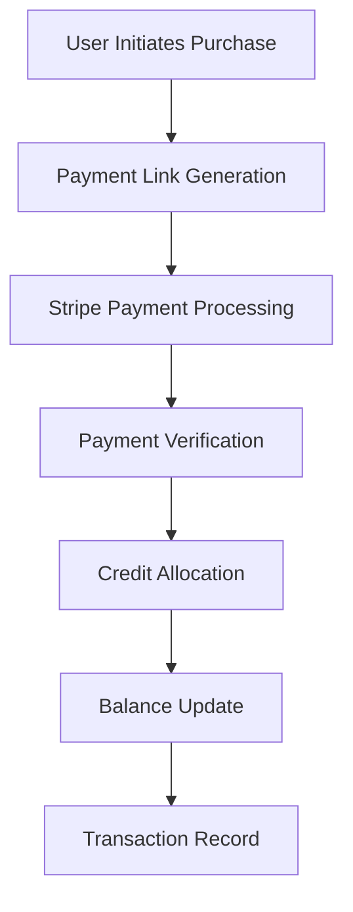

# rUv Ecosystem Business Model & Marketplace Economics

## Executive Summary

The rUv ecosystem operates as a comprehensive AI-powered marketplace built on a credit-based economy, enabling creators to monetize neural network templates, applications, and AI services while providing buyers with access to cutting-edge AI tools. The platform generates revenue through transaction fees, subscription models, and premium services while fostering a sustainable creator economy.

## Table of Contents

1. [rUv Credit System](#ruv-credit-system)
2. [Payment Processing & Transaction Flows](#payment-processing--transaction-flows)
3. [Creator Monetization Models](#creator-monetization-models)
4. [Buyer Purchase Experience](#buyer-purchase-experience)
5. [Platform Revenue Streams](#platform-revenue-streams)
6. [Subscription & Tier Models](#subscription--tier-models)
7. [Marketplace Economics](#marketplace-economics)
8. [Enterprise Licensing](#enterprise-licensing)
9. [Economic Sustainability](#economic-sustainability)
10. [Pricing Strategies](#pricing-strategies)
11. [Revenue Sharing](#revenue-sharing)
12. [Challenge & Gamification Economy](#challenge--gamification-economy)

---

## rUv Credit System

### Core Currency Mechanism

The rUv credit system serves as the backbone of the platform's economy:

- **Primary Currency**: rUv credits are the universal currency for all marketplace transactions
- **Current Circulation**: 930,289 rUv credits in active circulation
- **Credit Balance Management**: Users can check balances, view transaction history, and manage auto-refill settings
- **Transaction Tracking**: Complete audit trail of all credit movements

### Credit Acquisition Methods

**Direct Purchase:**
- Minimum purchase: $10 USD
- Payment link generation for secure transactions
- Stripe integration for payment processing (configurable)

**Auto-Refill System:**
- Threshold-based automatic refills
- Configurable amounts and triggers
- Example: Auto-refill 25 credits when balance drops below 10

**Earning Mechanisms:**
- Template sales commissions
- Challenge completions
- Application usage rewards
- Achievement unlocks
- Community contributions

### Credit Usage Patterns

**Neural Network Templates:**
- Paid templates: 25 rUv credits average
- Free templates available
- Rating system influences pricing

**Challenges & Competitions:**
- Entry fees vary by difficulty
- Reward pools: 1,000+ rUv credits
- Participation rewards: 10 rUv credits minimum

---

## Payment Processing & Transaction Flows

### Payment Infrastructure

**Payment Links:**
- Secure payment URL generation
- Example: `https://flow-nexus.ruv.io/payment/payment_1757278271870`
- Status tracking: active, completed, expired
- Multi-currency support (USD primary)

**Transaction Processing:**
- Real-time balance updates
- Transaction ID tracking
- Instant credit allocation
- Failed payment handling

### Payment Flow Architecture

### Security & Compliance

- SSL/TLS encryption for all transactions
- PCI DSS compliance through Stripe
- User authentication required for payments
- Transaction audit logging

---

## Creator Monetization Models

### Template Publishing Economy

**Revenue Streams for Creators:**
- Template sales: Direct revenue from neural network templates
- Usage-based licensing: Recurring revenue from template usage
- Custom model development: Commissioned work
- Consultation services: Expert guidance monetization

**Template Marketplace:**
- **LSTM Time Series Predictor**: 25 rUv credits, 4.7 rating, 89 downloads
- Category-based pricing: Classification, regression, NLP, vision, etc.
- Creator profiles and reputation systems
- Download tracking and analytics

### Publishing Process

1. **Model Development**: Create and train neural networks
2. **Template Creation**: Package models with documentation
3. **Marketplace Submission**: Upload to platform with metadata
4. **Review Process**: Quality assurance and approval
5. **Pricing Strategy**: Set competitive pricing
6. **Revenue Collection**: Automatic payment distribution

### Creator Support Tools

**Analytics Dashboard:**
- Download statistics
- Revenue tracking
- User engagement metrics
- Performance insights

**Marketing Tools:**
- Featured placement opportunities
- Category-based promotion
- Social media integration
- Community showcasing

---

## Buyer Purchase Experience

### Discovery & Search

**Template Discovery:**
- Category browsing (AI/ML Tools, GitHub Integration, etc.)
- Featured templates prominently displayed
- Search and filtering capabilities
- Rating and review systems

**Template Evaluation:**
- Detailed descriptions and features
- Code samples and documentation
- Performance benchmarks
- Community ratings and reviews

### Purchase Process

1. **Template Selection**: Browse and evaluate options
2. **Credit Check**: Verify sufficient balance
3. **Purchase Transaction**: Instant credit deduction
4. **Access Grant**: Immediate template access
5. **Download & Deploy**: Use in projects or sandbox environments

### Post-Purchase Support

- Template documentation access
- Community support forums
- Update notifications
- Usage analytics

---

## Platform Revenue Streams

### Primary Revenue Sources

**Transaction Fees:**
- Percentage of all template sales
- Processing fees for credit purchases
- Premium feature access fees

**Subscription Models:**
- Pro tier upgrades
- Enterprise licensing
- Advanced analytics access

**Service Fees:**
- Sandbox environment usage
- Computational resource consumption
- API call overages

### Market Performance

- **Total Applications**: Growing ecosystem
- **Average App Price**: $20.77 USD
- **User Base**: Active and engaged community
- **Transaction Volume**: Increasing monthly recurring revenue

---

## Subscription & Tier Models

### User Tiers

**Free Tier:**
- Basic template access
- Limited sandbox usage
- Community support
- Standard features

**Pro Tier:**
- Unlimited template access
- Enhanced sandbox resources
- Priority support
- Advanced analytics
- Revenue sharing benefits

**Enterprise Tier:**
- Custom deployment options
- Dedicated support
- White-label solutions
- Volume licensing
- SLA guarantees

### Upgrade Process

- Tier-based pricing models
- Feature comparison matrices
- Seamless upgrade experience
- Prorated billing adjustments

---

## Marketplace Economics

### Supply & Demand Dynamics

**Template Supply:**
- 7 featured application templates currently
- Categories: AI/ML Tools, GitHub Integration, Trading, Development
- Quality control through rating systems
- Creator incentive programs

**Demand Patterns:**
- High demand for Claude Flow integration templates
- Popular categories: AI coordination, development automation
- Usage patterns: Claude Code Deployment (19 uses), Claude Flow Swarm (10 uses)

### Pricing Strategies

**Dynamic Pricing:**
- Market-driven price discovery
- Quality-based premium pricing
- Volume discount structures
- Seasonal promotions

**Value-Based Pricing:**
- Performance benchmarks (e.g., "403x faster than Dijkstra")
- Feature complexity pricing
- Market positioning strategies

---

## Enterprise Licensing

### Enterprise Solutions

**Volume Licensing:**
- Bulk credit purchases with discounts
- Site-wide access agreements
- Custom deployment environments
- Dedicated technical support

**White-Label Options:**
- Branded marketplace instances
- Custom integration capabilities
- Private template repositories
- Corporate compliance features

**Service Level Agreements:**
- 99.99% uptime guarantees
- Response time commitments
- Escalation procedures
- Performance benchmarks

---

## Economic Sustainability

### Long-term Viability

**Ecosystem Growth:**
- Creator incentive alignment
- User retention strategies
- Network effects amplification
- Technology advancement integration

**Cost Structure Optimization:**
- Efficient resource utilization
- Scalable infrastructure design
- Automated processes
- Community-driven quality control

**Revenue Diversification:**
- Multiple income streams
- Geographic expansion
- Industry vertical specialization
- Partnership revenue sharing

---

## Pricing Strategies

### Template Pricing Models

**Fixed Pricing:**
- Standard template: 15-25 rUv credits
- Premium template: 50+ rUv credits
- Enterprise solution: Custom pricing

**Performance-Based Pricing:**
- Benchmark-driven premiums
- Usage-based scaling
- ROI-justified pricing

### Credit Exchange Rates

**USD to rUv Conversion:**
- Market-based exchange rates
- Volume discount structures
- Regional pricing variations
- Corporate bulk rates

---

## Revenue Sharing

### Creator Revenue Distribution

**Template Sales:**
- Creator receives 70-80% of sale price
- Platform retains 20-30% for operations
- Payment processing fees deducted
- Monthly payment distributions

**Performance Incentives:**
- High-rated template bonuses
- Download milestone rewards
- Featured placement compensation
- Community contribution recognition

### Platform Economics

**Operational Costs:**
- Infrastructure and hosting
- Payment processing fees
- Customer support
- Development and maintenance

**Profit Margins:**
- Scalable business model
- High-margin digital products
- Network effects reducing acquisition costs
- Efficient automated systems

---

## Challenge & Gamification Economy

### Challenge System

**Challenge Categories:**
- **rUv Economy Dominator**: 750 base reward, advanced difficulty
- **Neural Trading Trials**: 500 base reward, beginner-friendly
- **Algorithm Duel Arena**: 500 base reward, competitive
- **System Architecture**: 3,000 base reward, expert level

### Reward Structure

**Prize Distribution:**
- **First Place**: 500 rUv credits
- **Second Place**: 300 rUv credits
- **Third Place**: 100 rUv credits
- **Participation**: 10 rUv credits minimum

**Challenge Economics:**
- Total prize pools: 1,000 rUv credits per challenge
- Multiple winners per challenge (3 maximum)
- Automatic judging with manual review options
- Time-limited competitions

### Leaderboard System

**Global Rankings:**
- Top earner: 3,013 rUv credits (user "ruv")
- Second place: 2,696 rUv credits (user "marcj")
- Third place: 2,336 rUv credits (user "hackerino")
- Achievement-based progression
- Social recognition systems

---

## Conclusion

The rUv ecosystem represents a sophisticated marketplace economy built on AI-powered tools and services. With its credit-based system, comprehensive creator monetization, and sustainable revenue models, the platform is positioned for significant growth in the AI tooling market. The combination of direct sales, subscription models, and gamified challenges creates multiple value creation pathways for all stakeholders.

**Key Success Factors:**
- Strong creator incentive alignment
- User-friendly purchase experience
- Robust payment infrastructure
- Quality-driven marketplace
- Sustainable economic model
- Community-driven growth

**Future Opportunities:**
- Geographic expansion
- Industry vertical specialization
- Advanced AI model integration
- Enhanced enterprise solutions
- Strategic partnerships

The platform's focus on quality, community, and innovation positions it well for continued growth in the rapidly expanding AI marketplace sector.

---

*Last Updated: September 2025*
*Documentation Version: 1.0*