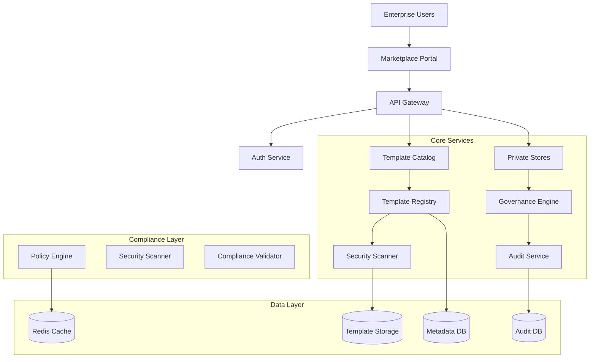

# Enterprise Template Marketplace

## Executive Summary

The Unjucks Enterprise Template Marketplace represents a comprehensive solution for organizations to create, manage, and monetize private template stores. This enterprise-grade platform provides advanced template management, compliance controls, security scanning, role-based access, and audit logging capabilities tailored for Fortune 500 organizations.

## Table of Contents

1. [Enterprise Architecture Overview](#enterprise-architecture-overview)
2. [Template Categories and Patterns](#template-categories-and-patterns)
3. [Private Template Store Architecture](#private-template-store-architecture)
4. [Security and Compliance Framework](#security-and-compliance-framework)
5. [Role-Based Access Control (RBAC)](#role-based-access-control-rbac)
6. [Audit Logging and Compliance Tracking](#audit-logging-and-compliance-tracking)
7. [Template Security Scanning](#template-security-scanning)
8. [Marketplace Monetization](#marketplace-monetization)
9. [Enterprise Integration Patterns](#enterprise-integration-patterns)
10. [Governance and Policy Management](#governance-and-policy-management)
11. [Implementation Guide](#implementation-guide)

## Enterprise Architecture Overview

### Multi-Tenant Marketplace Architecture



### Enterprise Quality Attributes

| Attribute | Target | Implementation |
|-----------|--------|---------------|
| **Availability** | 99.9% | Multi-region deployment with auto-failover |
| **Scalability** | 50K+ templates | Horizontal scaling with microservices |
| **Security** | Zero-trust model | mTLS, RBAC, security scanning |
| **Compliance** | SOC2, HIPAA, PCI-DSS | Automated compliance validation |
| **Performance** | < 100ms search | Distributed caching and indexing |

## Template Categories and Patterns

### 1. Microservice Generators

#### Fortune 500 Microservice Template
```yaml
---
name: "Fortune 500 Microservice"
category: "enterprise-microservice"
compliance:
  standards: [SOC2, ISO27001, PCI-DSS]
  certifications: [NIST, CIS]
  auditTrail: true
variables:
  - name: serviceName
    type: string
    validation: "^[a-z0-9-]+$"
    required: true
  - name: databaseType
    type: string
    options: [postgresql, mongodb, redis]
    required: true
  - name: complianceMode
    type: string
    options: [soc2, hipaa, pci-dss, gdpr]
    required: true
features:
  - authentication: oauth2/jwt/saml/ldap
  - observability: datadog/newrelic/prometheus
  - security: zero-trust, encryption, audit
  - scalability: kubernetes, auto-scaling
---
```

#### API Gateway Template
```yaml
---
name: "Enterprise API Gateway"
category: "api-gateway"
description: "High-performance API gateway with rate limiting and security"
variables:
  - name: gatewayType
    options: [kong, nginx-plus, istio, envoy]
  - name: authStrategy
    options: [jwt, oauth2, api-key, mutual-tls]
  - name: rateLimitStrategy
    options: [fixed-window, sliding-window, token-bucket]
features:
  - waf: enabled
  - ddos_protection: enabled
  - circuit_breaker: enabled
  - load_balancing: advanced_algorithms
---
```

### 2. Compliance Templates

#### SOC2/HIPAA Compliant Service
```yaml
---
name: "SOC2/HIPAA Compliant Service"
category: "compliance"
compliance:
  standards: [SOC2, HIPAA, ISO27001]
  controls:
    - access_control: rbac
    - data_encryption: aes-256
    - audit_logging: comprehensive
    - incident_response: automated
variables:
  - name: dataClassification
    options: [public, internal, confidential, restricted]
  - name: auditRetention
    type: number
    defaultValue: 2555  # 7 years
  - name: encryptionLevel
    options: [standard, high, fips-140-2]
features:
  - gdpr_compliance: data_subject_rights
  - breach_detection: real_time
  - access_reviews: automated
---
```

### 3. Data Pipeline Templates

#### Enterprise Data Pipeline
```yaml
---
name: "Enterprise Data Pipeline"
category: "data-engineering"
description: "Scalable data processing with governance and lineage"
variables:
  - name: pipelineType
    options: [batch, streaming, hybrid]
  - name: dataSource
    options: [kafka, kinesis, database, s3]
  - name: governance
    options: [apache-atlas, datahub, alation]
features:
  - data_lineage: automatic
  - quality_validation: great_expectations
  - privacy_controls: data_masking
  - cost_optimization: spot_instances
---
```

### 4. Monitoring and Observability

#### Enterprise Observability Stack
```yaml
---
name: "Enterprise Observability Stack"
category: "monitoring"
description: "Complete observability with metrics, logs, and traces"
variables:
  - name: metricsBackend
    options: [prometheus, datadog, newrelic, dynatrace]
  - name: logsBackend
    options: [elk-stack, splunk, datadog, sumo-logic]
  - name: tracingBackend
    options: [jaeger, zipkin, datadog, x-ray]
features:
  - sla_monitoring: automated
  - anomaly_detection: ml_powered
  - root_cause_analysis: ai_assisted
  - capacity_planning: predictive
---
```

## Private Template Store Architecture

### Store Hierarchy and Organization

```typescript
interface EnterpriseStore {
  id: string
  name: string
  organizationId: string
  visibility: 'private' | 'organization' | 'public'
  governance: GovernancePolicy
  access: AccessControlList
  compliance: ComplianceRequirements
  monetization?: MonetizationConfig
}

interface StoreHierarchy {
  global: GlobalTemplates[]      // Public marketplace
  organization: OrgTemplates[]   // Organization-wide
  department: DeptTemplates[]    // Department-specific
  team: TeamTemplates[]          // Team-private
  personal: PersonalTemplates[]  // Individual user
}
```

### Store Management API

```typescript
// Create private template store
export class EnterpriseStoreService {
  async createPrivateStore(config: StoreConfig): Promise<Store> {
    const store = await this.storeRepository.create({
      ...config,
      governance: await this.applyGovernancePolicies(config),
      compliance: await this.validateComplianceRequirements(config),
      security: await this.setupSecurityControls(config)
    });
    
    // Initialize store with default templates
    await this.seedStoreTemplates(store.id, config.seedTemplates);
    
    // Setup audit logging
    await this.auditService.logStoreCreation(store);
    
    return store;
  }
  
  async publishTemplate(
    storeId: string, 
    template: Template,
    publishConfig: PublishConfig
  ): Promise<PublishedTemplate> {
    // Security scanning
    const scanResults = await this.securityScanner.scanTemplate(template);
    if (!scanResults.passed) {
      throw new SecurityViolationError(scanResults.violations);
    }
    
    // Compliance validation
    await this.complianceValidator.validate(template);
    
    // Quality gates
    await this.qualityGates.validate(template);
    
    const published = await this.templateRegistry.publish(
      storeId, 
      template, 
      publishConfig
    );
    
    // Audit logging
    await this.auditService.logTemplatePublish(published);
    
    return published;
  }
}
```

### Template Registry Architecture

```typescript
interface TemplateRegistry {
  // Core operations
  search(query: SearchQuery): Promise<SearchResults>
  publish(template: Template): Promise<PublishedTemplate>
  install(templateId: string, config: InstallConfig): Promise<Installation>
  
  // Enterprise features
  approve(templateId: string, approval: ApprovalConfig): Promise<Approval>
  certify(templateId: string, certification: Certification): Promise<void>
  deprecate(templateId: string, reason: string): Promise<void>
  
  // Governance
  applyPolicy(templateId: string, policy: Policy): Promise<void>
  validateCompliance(templateId: string): Promise<ComplianceReport>
  generateAuditReport(criteria: AuditCriteria): Promise<AuditReport>
}
```

## Security and Compliance Framework

### Zero-Trust Security Model

```typescript
// Zero-trust template access validation
export class TemplateSecurityValidator {
  async validateAccess(request: AccessRequest): Promise<AccessDecision> {
    const validation = await this.zeroTrust.validateRequest(request);
    
    if (!validation.isValid) {
      await this.auditService.logAccessDenied(request, validation.reason);
      throw new AccessDeniedError(validation.reason);
    }
    
    // Device trust validation
    const deviceTrust = await this.deviceManager.validateDevice(
      request.deviceFingerprint
    );
    
    // Network validation
    const networkValidation = await this.networkValidator.validate(
      request.sourceIP,
      request.geolocation
    );
    
    // Risk assessment
    const riskScore = await this.riskEngine.assessRisk({
      user: request.user,
      device: deviceTrust,
      network: networkValidation,
      resource: request.templateId
    });
    
    return {
      allowed: riskScore < this.config.riskThreshold,
      riskScore,
      conditions: this.getAccessConditions(riskScore)
    };
  }
}
```

### Security Scanning Engine

```typescript
export class TemplateSecurityScanner {
  async scanTemplate(template: Template): Promise<ScanResults> {
    const results: ScanResults = {
      passed: true,
      violations: [],
      recommendations: []
    };
    
    // Static analysis
    const staticScan = await this.staticAnalyzer.scan(template.content);
    results.violations.push(...staticScan.violations);
    
    // Secret detection
    const secretScan = await this.secretDetector.scan(template.content);
    results.violations.push(...secretScan.violations);
    
    // Dependency vulnerability scan
    if (template.dependencies) {
      const depScan = await this.dependencyScanner.scan(template.dependencies);
      results.violations.push(...depScan.violations);
    }
    
    // License compliance
    const licenseScan = await this.licenseScanner.scan(template);
    results.violations.push(...licenseScan.violations);
    
    // Custom policy validation
    const policyScan = await this.policyEngine.validate(template);
    results.violations.push(...policyScan.violations);
    
    results.passed = results.violations.length === 0;
    
    // Generate recommendations
    results.recommendations = await this.generateRecommendations(results.violations);
    
    return results;
  }
  
  private async generateRecommendations(
    violations: SecurityViolation[]
  ): Promise<SecurityRecommendation[]> {
    return violations.map(violation => ({
      type: violation.type,
      severity: violation.severity,
      description: violation.description,
      remediation: this.getRemediationSteps(violation),
      references: this.getSecurityReferences(violation)
    }));
  }
}
```

### Compliance Validation Framework

```typescript
interface ComplianceFramework {
  standards: {
    soc2: SOC2Controls
    hipaa: HIPAAControls  
    pci: PCIControls
    gdpr: GDPRControls
    iso27001: ISO27001Controls
  }
  
  validators: {
    dataClassification: DataClassificationValidator
    accessControls: AccessControlValidator
    encryption: EncryptionValidator
    auditTrail: AuditTrailValidator
    dataRetention: DataRetentionValidator
  }
}

export class ComplianceValidator {
  async validateTemplate(
    template: Template, 
    standards: ComplianceStandard[]
  ): Promise<ComplianceReport> {
    const report: ComplianceReport = {
      template: template.id,
      standards,
      results: [],
      overallCompliance: 'pending'
    };
    
    for (const standard of standards) {
      const validator = this.getValidator(standard);
      const result = await validator.validate(template);
      
      report.results.push({
        standard,
        compliance: result.compliant,
        violations: result.violations,
        recommendations: result.recommendations,
        score: result.score
      });
    }
    
    report.overallCompliance = this.calculateOverallCompliance(report.results);
    
    return report;
  }
}
```

## Role-Based Access Control (RBAC)

### Enterprise RBAC Model

```typescript
interface EnterpriseRole {
  id: string
  name: string
  description: string
  permissions: Permission[]
  scope: AccessScope
  conditions?: AccessCondition[]
}

interface Permission {
  resource: ResourceType
  actions: Action[]
  constraints?: PermissionConstraint[]
}

enum ResourceType {
  TEMPLATES = 'templates',
  STORES = 'stores', 
  ORGANIZATIONS = 'organizations',
  USERS = 'users',
  AUDIT_LOGS = 'audit-logs',
  POLICIES = 'policies'
}

enum Action {
  CREATE = 'create',
  READ = 'read',
  UPDATE = 'update',
  DELETE = 'delete',
  PUBLISH = 'publish',
  APPROVE = 'approve',
  AUDIT = 'audit'
}
```

### Predefined Enterprise Roles

```typescript
const ENTERPRISE_ROLES = {
  // Executive Level
  ENTERPRISE_ADMIN: {
    name: 'Enterprise Administrator',
    permissions: ['*:*'],  // Full access
    scope: 'global',
    description: 'Complete system administration rights'
  },
  
  // Management Level
  TEMPLATE_STORE_MANAGER: {
    name: 'Template Store Manager',
    permissions: [
      'stores:create,read,update,delete',
      'templates:create,read,update,delete,publish',
      'users:read,update',
      'audit-logs:read'
    ],
    scope: 'organization',
    description: 'Manage organization template stores'
  },
  
  COMPLIANCE_OFFICER: {
    name: 'Compliance Officer',
    permissions: [
      'templates:read,audit',
      'policies:create,read,update',
      'audit-logs:read,export',
      'compliance:*'
    ],
    scope: 'organization',
    description: 'Oversee compliance and governance'
  },
  
  // Development Level
  TEMPLATE_DEVELOPER: {
    name: 'Template Developer',
    permissions: [
      'templates:create,read,update',
      'templates:test',
      'stores:read'
    ],
    scope: 'department',
    conditions: ['own_templates_only'],
    description: 'Develop and maintain templates'
  },
  
  TEMPLATE_USER: {
    name: 'Template Consumer',
    permissions: [
      'templates:read,install',
      'stores:read'
    ],
    scope: 'team',
    description: 'Use approved templates for development'
  },
  
  // Security Level
  SECURITY_AUDITOR: {
    name: 'Security Auditor',
    permissions: [
      'templates:read,scan',
      'audit-logs:read,export',
      'security:*',
      'compliance:read'
    ],
    scope: 'organization',
    description: 'Security assessment and auditing'
  }
};
```

### Dynamic Permission System

```typescript
export class DynamicRBAC {
  async evaluatePermission(
    user: User,
    resource: Resource,
    action: Action,
    context: AccessContext
  ): Promise<PermissionDecision> {
    // Get user roles and permissions
    const roles = await this.userService.getUserRoles(user.id);
    const permissions = await this.aggregatePermissions(roles);
    
    // Evaluate base permissions
    const basePermission = this.evaluateBasePermission(
      permissions,
      resource,
      action
    );
    
    if (!basePermission.allowed) {
      return { allowed: false, reason: 'insufficient_permissions' };
    }
    
    // Evaluate conditions
    const conditionResult = await this.evaluateConditions(
      permissions,
      resource,
      action,
      context
    );
    
    if (!conditionResult.satisfied) {
      return { 
        allowed: false, 
        reason: 'condition_not_satisfied',
        requiredConditions: conditionResult.failed
      };
    }
    
    // Evaluate policy constraints
    const policyResult = await this.policyEngine.evaluate(
      user,
      resource,
      action,
      context
    );
    
    return {
      allowed: policyResult.allowed,
      reason: policyResult.reason,
      conditions: policyResult.conditions,
      auditInfo: {
        user: user.id,
        resource: resource.id,
        action,
        decision: policyResult.allowed,
        timestamp: new Date()
      }
    };
  }
}
```

## Audit Logging and Compliance Tracking

### Comprehensive Audit Framework

```typescript
interface AuditEvent {
  id: string
  timestamp: Date
  eventType: AuditEventType
  actor: Actor
  resource: Resource
  action: Action
  outcome: Outcome
  metadata: AuditMetadata
  compliance: ComplianceContext
}

enum AuditEventType {
  // Template operations
  TEMPLATE_CREATED = 'template.created',
  TEMPLATE_PUBLISHED = 'template.published',
  TEMPLATE_INSTALLED = 'template.installed',
  TEMPLATE_MODIFIED = 'template.modified',
  TEMPLATE_DELETED = 'template.deleted',
  
  // Access events
  ACCESS_GRANTED = 'access.granted',
  ACCESS_DENIED = 'access.denied',
  AUTHENTICATION_SUCCESS = 'auth.success',
  AUTHENTICATION_FAILED = 'auth.failed',
  
  // Compliance events
  COMPLIANCE_VIOLATION = 'compliance.violation',
  POLICY_APPLIED = 'policy.applied',
  AUDIT_EXPORT = 'audit.export',
  
  // Administrative events
  ROLE_ASSIGNED = 'role.assigned',
  PERMISSION_CHANGED = 'permission.changed',
  STORE_CREATED = 'store.created'
}
```

### Audit Service Implementation

```typescript
export class EnterpriseAuditService {
  async logEvent(event: AuditEvent): Promise<void> {
    // Enrich event with contextual information
    const enrichedEvent = await this.enrichEvent(event);
    
    // Store in audit database
    await this.auditRepository.store(enrichedEvent);
    
    // Real-time compliance monitoring
    await this.complianceMonitor.processEvent(enrichedEvent);
    
    // Threat detection
    await this.threatDetector.analyzeEvent(enrichedEvent);
    
    // Stream to external systems if required
    if (this.config.externalIntegrations.enabled) {
      await this.streamToExternal(enrichedEvent);
    }
  }
  
  async generateComplianceReport(
    criteria: ComplianceReportCriteria
  ): Promise<ComplianceReport> {
    const events = await this.auditRepository.query({
      dateRange: criteria.dateRange,
      eventTypes: criteria.eventTypes,
      actors: criteria.actors,
      resources: criteria.resources
    });
    
    return {
      reportId: crypto.randomUUID(),
      criteria,
      generatedAt: new Date(),
      events: events.length,
      violations: this.identifyViolations(events),
      compliance: this.calculateComplianceScore(events),
      recommendations: await this.generateRecommendations(events),
      attestation: await this.generateAttestation(events, criteria)
    };
  }
  
  private async enrichEvent(event: AuditEvent): Promise<EnrichedAuditEvent> {
    return {
      ...event,
      sessionId: await this.getSessionId(event.actor),
      ipAddress: await this.getIPAddress(event.actor),
      userAgent: await this.getUserAgent(event.actor),
      geolocation: await this.getGeolocation(event.actor),
      riskScore: await this.calculateRiskScore(event),
      complianceImpact: await this.assessComplianceImpact(event),
      dataClassification: await this.classifyData(event.resource)
    };
  }
}
```

### Real-time Compliance Monitoring

```typescript
export class ComplianceMonitor {
  async processEvent(event: EnrichedAuditEvent): Promise<void> {
    // Check for immediate violations
    const violations = await this.detectViolations(event);
    
    if (violations.length > 0) {
      await this.handleViolations(violations, event);
    }
    
    // Update compliance metrics
    await this.updateComplianceMetrics(event);
    
    // Pattern analysis for anomaly detection
    await this.analyzePatterns(event);
  }
  
  private async detectViolations(
    event: EnrichedAuditEvent
  ): Promise<ComplianceViolation[]> {
    const violations: ComplianceViolation[] = [];
    
    // SOC2 compliance checks
    if (this.config.standards.includes('SOC2')) {
      violations.push(...await this.soc2Validator.validate(event));
    }
    
    // HIPAA compliance checks
    if (this.config.standards.includes('HIPAA')) {
      violations.push(...await this.hipaaValidator.validate(event));
    }
    
    // Custom policy violations
    violations.push(...await this.policyEngine.validateEvent(event));
    
    return violations;
  }
  
  private async handleViolations(
    violations: ComplianceViolation[],
    event: EnrichedAuditEvent
  ): Promise<void> {
    for (const violation of violations) {
      // Log violation
      await this.auditService.logViolation(violation, event);
      
      // Immediate response based on severity
      switch (violation.severity) {
        case 'critical':
          await this.emergencyResponse.trigger(violation);
          break;
        case 'high':
          await this.alertingService.sendUrgentAlert(violation);
          break;
        case 'medium':
          await this.notificationService.notifyCompliance(violation);
          break;
        default:
          await this.reportingService.recordViolation(violation);
      }
    }
  }
}
```

## Template Security Scanning

### Multi-Layer Security Scanning

```typescript
export class TemplateSecurityScanner {
  async comprehensiveScan(template: Template): Promise<SecurityScanReport> {
    const report: SecurityScanReport = {
      templateId: template.id,
      scanId: crypto.randomUUID(),
      timestamp: new Date(),
      scanners: [],
      overallRisk: 'pending',
      findings: [],
      recommendations: []
    };
    
    // Layer 1: Static Code Analysis
    const staticAnalysis = await this.staticCodeAnalyzer.scan(template);
    report.scanners.push(staticAnalysis);
    
    // Layer 2: Secret Detection
    const secretDetection = await this.secretScanner.scan(template);
    report.scanners.push(secretDetection);
    
    // Layer 3: Dependency Vulnerability Scan
    const dependencyScan = await this.dependencyScanner.scan(template);
    report.scanners.push(dependencyScan);
    
    // Layer 4: License Compliance
    const licenseScan = await this.licenseScanner.scan(template);
    report.scanners.push(licenseScan);
    
    // Layer 5: Infrastructure Security
    const infraScan = await this.infrastructureScanner.scan(template);
    report.scanners.push(infraScan);
    
    // Layer 6: Compliance Validation
    const complianceScan = await this.complianceScanner.scan(template);
    report.scanners.push(complianceScan);
    
    // Aggregate results
    report.findings = this.aggregateFindings(report.scanners);
    report.overallRisk = this.calculateOverallRisk(report.findings);
    report.recommendations = await this.generateRecommendations(report.findings);
    
    return report;
  }
}
```

### Advanced Threat Detection

```typescript
export class AdvancedThreatDetector {
  async analyzeTemplate(template: Template): Promise<ThreatAnalysisReport> {
    const analysis: ThreatAnalysisReport = {
      templateId: template.id,
      threats: [],
      riskScore: 0,
      recommendations: []
    };
    
    // Behavioral analysis
    const behaviorThreats = await this.behaviorAnalyzer.analyze(template);
    analysis.threats.push(...behaviorThreats);
    
    // Supply chain analysis
    const supplyChainThreats = await this.supplyChainAnalyzer.analyze(template);
    analysis.threats.push(...supplyChainThreats);
    
    // Machine learning based detection
    const mlThreats = await this.mlThreatDetector.analyze(template);
    analysis.threats.push(...mlThreats);
    
    // Signature-based detection
    const signatureThreats = await this.signatureDetector.analyze(template);
    analysis.threats.push(...signatureThreats);
    
    analysis.riskScore = this.calculateThreatRisk(analysis.threats);
    analysis.recommendations = this.generateThreatRecommendations(analysis.threats);
    
    return analysis;
  }
}
```

## Marketplace Monetization

### Enterprise Monetization Models

```typescript
interface MonetizationConfig {
  model: MonetizationModel
  pricing: PricingStrategy
  licensing: LicenseType
  billing: BillingConfig
  marketplace: MarketplaceConfig
}

enum MonetizationModel {
  FREE = 'free',
  SUBSCRIPTION = 'subscription',
  USAGE_BASED = 'usage-based',
  ENTERPRISE_LICENSE = 'enterprise-license',
  HYBRID = 'hybrid'
}

interface PricingStrategy {
  type: 'flat_rate' | 'tiered' | 'usage_based' | 'value_based'
  tiers?: PricingTier[]
  usage_metrics?: UsageMetric[]
  enterprise_features?: EnterpriseFeature[]
}
```

### Template Marketplace Platform

```typescript
export class TemplateMarketplace {
  async publishTemplate(
    template: Template,
    monetization: MonetizationConfig
  ): Promise<MarketplaceTemplate> {
    // Validate template quality
    const qualityScore = await this.qualityAssurance.assess(template);
    if (qualityScore < this.config.minimumQualityThreshold) {
      throw new QualityAssuranceError('Template does not meet quality standards');
    }
    
    // Security and compliance validation
    const securityScan = await this.securityScanner.scan(template);
    const complianceScan = await this.complianceValidator.validate(template);
    
    if (!securityScan.passed || !complianceScan.passed) {
      throw new ValidationError('Security or compliance validation failed');
    }
    
    // Create marketplace listing
    const listing = await this.marketplaceService.createListing({
      template,
      monetization,
      quality: qualityScore,
      security: securityScan,
      compliance: complianceScan,
      certification: await this.certificationService.evaluate(template)
    });
    
    // Initialize billing and licensing
    await this.billingService.setupBilling(listing.id, monetization);
    await this.licenseService.generateLicenses(listing.id, monetization);
    
    return listing;
  }
  
  async purchaseTemplate(
    templateId: string,
    buyer: Organization,
    licenseType: LicenseType
  ): Promise<TemplateLicense> {
    // Validate purchase eligibility
    await this.validatePurchaseEligibility(buyer, templateId);
    
    // Process payment
    const payment = await this.paymentProcessor.processPayment({
      buyer: buyer.id,
      template: templateId,
      license: licenseType,
      amount: await this.calculateLicenseCost(templateId, licenseType)
    });
    
    // Generate license
    const license = await this.licenseService.generateLicense({
      template: templateId,
      buyer: buyer.id,
      type: licenseType,
      payment: payment.id,
      terms: await this.getLicenseTerms(templateId, licenseType)
    });
    
    // Grant access
    await this.accessService.grantTemplateAccess(buyer.id, templateId, license);
    
    // Audit logging
    await this.auditService.logTemplatePurchase({
      buyer: buyer.id,
      template: templateId,
      license: license.id,
      payment: payment.id
    });
    
    return license;
  }
}
```

### Revenue Sharing and Analytics

```typescript
export class RevenueManagement {
  async calculateRevenue(
    templateId: string,
    period: DateRange
  ): Promise<RevenueReport> {
    const sales = await this.salesRepository.findByTemplate(templateId, period);
    const licenses = await this.licenseRepository.findByTemplate(templateId, period);
    
    return {
      templateId,
      period,
      totalRevenue: this.calculateTotalRevenue(sales),
      revenueByLicense: this.groupRevenueByLicense(sales),
      marketplaceCommission: this.calculateCommission(sales),
      publisherRevenue: this.calculatePublisherRevenue(sales),
      growthMetrics: this.calculateGrowthMetrics(sales),
      projections: await this.generateRevenueProjections(templateId)
    };
  }
  
  async distributeRevenue(
    templateId: string,
    revenue: number
  ): Promise<RevenueDistribution> {
    const template = await this.templateRepository.findById(templateId);
    const marketplace = await this.marketplaceRepository.findByTemplate(templateId);
    
    const distribution = {
      total: revenue,
      marketplace: revenue * marketplace.commissionRate,
      publisher: revenue * (1 - marketplace.commissionRate),
      affiliates: revenue * this.calculateAffiliateCommission(templateId),
      taxes: revenue * this.calculateTaxRate(template.publisherId)
    };
    
    // Process payments
    await this.paymentProcessor.distributePayments(distribution);
    
    // Update balances
    await this.accountingService.updateBalances(distribution);
    
    return distribution;
  }
}
```

## Enterprise Integration Patterns

### Single Sign-On (SSO) Integration

```typescript
export class EnterpriseSSO {
  async configureSAMLIntegration(
    organizationId: string,
    samlConfig: SAMLConfig
  ): Promise<SAMLIntegration> {
    // Validate SAML configuration
    await this.samlValidator.validate(samlConfig);
    
    // Create SAML provider
    const provider = await this.samlProvider.create({
      organization: organizationId,
      entityId: samlConfig.entityId,
      ssoUrl: samlConfig.ssoUrl,
      certificate: samlConfig.certificate,
      attributes: samlConfig.attributeMapping
    });
    
    // Test connection
    const testResult = await this.testSAMLConnection(provider);
    if (!testResult.success) {
      throw new SAMLConfigurationError(testResult.error);
    }
    
    // Enable for organization
    await this.organizationService.enableSSO(organizationId, provider.id);
    
    return provider;
  }
  
  async configureOIDCIntegration(
    organizationId: string,
    oidcConfig: OIDCConfig
  ): Promise<OIDCIntegration> {
    // Similar implementation for OIDC
    const provider = await this.oidcProvider.create({
      organization: organizationId,
      issuer: oidcConfig.issuer,
      clientId: oidcConfig.clientId,
      clientSecret: oidcConfig.clientSecret,
      scopes: oidcConfig.scopes
    });
    
    await this.organizationService.enableSSO(organizationId, provider.id);
    
    return provider;
  }
}
```

### API Integration Framework

```typescript
export class EnterpriseAPIIntegration {
  async setupWebhookIntegration(
    organizationId: string,
    webhookConfig: WebhookConfig
  ): Promise<WebhookIntegration> {
    const integration = await this.webhookService.create({
      organization: organizationId,
      endpoints: webhookConfig.endpoints,
      events: webhookConfig.events,
      authentication: webhookConfig.authentication,
      retryPolicy: webhookConfig.retryPolicy || this.defaultRetryPolicy
    });
    
    // Validate endpoints
    for (const endpoint of webhookConfig.endpoints) {
      await this.validateWebhookEndpoint(endpoint);
    }
    
    return integration;
  }
  
  async configureGraphQLAPI(
    organizationId: string,
    apiConfig: GraphQLAPIConfig
  ): Promise<GraphQLIntegration> {
    const schema = await this.schemaBuilder.buildOrganizationSchema(
      organizationId,
      apiConfig.permissions
    );
    
    const integration = await this.graphqlService.create({
      organization: organizationId,
      schema,
      resolvers: this.generateEnterpriseResolvers(organizationId),
      authentication: apiConfig.authentication,
      rateLimit: apiConfig.rateLimit,
      caching: apiConfig.caching
    });
    
    return integration;
  }
}
```

## Governance and Policy Management

### Policy Engine Architecture

```typescript
interface PolicyEngine {
  // Policy management
  createPolicy(policy: Policy): Promise<Policy>
  updatePolicy(id: string, updates: PolicyUpdate): Promise<Policy>
  deletePolicy(id: string): Promise<void>
  
  // Policy evaluation
  evaluatePolicy(context: PolicyContext): Promise<PolicyDecision>
  evaluatePolicies(context: PolicyContext): Promise<PolicyDecision[]>
  
  // Policy monitoring
  monitorCompliance(policy: Policy): Promise<ComplianceStatus>
  generatePolicyReport(criteria: ReportCriteria): Promise<PolicyReport>
}

interface Policy {
  id: string
  name: string
  description: string
  type: PolicyType
  rules: PolicyRule[]
  scope: PolicyScope
  enforcement: EnforcementLevel
  compliance: ComplianceRequirement[]
}

enum PolicyType {
  ACCESS_CONTROL = 'access-control',
  DATA_GOVERNANCE = 'data-governance',
  SECURITY = 'security',
  COMPLIANCE = 'compliance',
  QUALITY = 'quality'
}
```

### Enterprise Policy Templates

```typescript
const ENTERPRISE_POLICIES = {
  DATA_CLASSIFICATION: {
    name: 'Data Classification Policy',
    description: 'Automatically classify and protect data based on sensitivity',
    rules: [
      {
        condition: 'contains_pii',
        action: 'classify_as_restricted',
        enforcement: 'mandatory'
      },
      {
        condition: 'contains_financial_data',
        action: 'apply_encryption',
        enforcement: 'mandatory'
      }
    ]
  },
  
  TEMPLATE_APPROVAL: {
    name: 'Template Approval Workflow',
    description: 'Require approval for template publication',
    rules: [
      {
        condition: 'template_category_enterprise',
        action: 'require_security_review',
        enforcement: 'mandatory'
      },
      {
        condition: 'security_scan_failed',
        action: 'block_publication',
        enforcement: 'mandatory'
      }
    ]
  },
  
  ACCESS_CONTROL: {
    name: 'Least Privilege Access',
    description: 'Enforce minimum required access permissions',
    rules: [
      {
        condition: 'new_user_access',
        action: 'grant_minimal_permissions',
        enforcement: 'mandatory'
      },
      {
        condition: 'elevated_access_request',
        action: 'require_manager_approval',
        enforcement: 'mandatory'
      }
    ]
  }
};
```

### Automated Governance Workflows

```typescript
export class GovernanceOrchestrator {
  async orchestrateTemplateGovernance(
    template: Template
  ): Promise<GovernanceWorkflow> {
    const workflow = await this.workflowEngine.createWorkflow({
      name: 'Template Governance Workflow',
      template: template.id,
      steps: [
        'security_scan',
        'compliance_validation',
        'quality_assessment',
        'policy_evaluation',
        'approval_process',
        'publication_authorization'
      ]
    });
    
    // Execute workflow steps
    for (const step of workflow.steps) {
      const result = await this.executeGovernanceStep(step, template);
      
      if (!result.passed) {
        await this.handleGovernanceFailure(step, result, template);
        break;
      }
      
      await this.updateWorkflowProgress(workflow.id, step, result);
    }
    
    return workflow;
  }
  
  private async executeGovernanceStep(
    step: GovernanceStep,
    template: Template
  ): Promise<GovernanceStepResult> {
    switch (step) {
      case 'security_scan':
        return this.securityScanner.scan(template);
      case 'compliance_validation':
        return this.complianceValidator.validate(template);
      case 'quality_assessment':
        return this.qualityAssessor.assess(template);
      case 'policy_evaluation':
        return this.policyEngine.evaluate(template);
      case 'approval_process':
        return this.approvalWorkflow.initiate(template);
      case 'publication_authorization':
        return this.publicationService.authorize(template);
      default:
        throw new Error(`Unknown governance step: ${step}`);
    }
  }
}
```

## Implementation Guide

### Phase 1: Core Infrastructure Setup

```bash
# 1. Initialize enterprise marketplace
npm install @unjucks/enterprise-marketplace

# 2. Configure enterprise features
cat > unjucks.enterprise.config.js << EOF
export default {
  enterprise: {
    enabled: true,
    marketplace: {
      privateStores: true,
      monetization: true,
      governance: true
    },
    security: {
      zeroTrust: true,
      scanning: true,
      compliance: ['SOC2', 'HIPAA']
    },
    rbac: {
      enabled: true,
      defaultRoles: 'enterprise',
      customRoles: true
    },
    audit: {
      enabled: true,
      retention: '7-years',
      export: true
    }
  }
}
EOF

# 3. Initialize database with enterprise schema
npx unjucks enterprise init-db

# 4. Setup authentication providers
npx unjucks enterprise setup-auth --saml --oidc
```

### Phase 2: Store Configuration

```bash
# 1. Create organization store
npx unjucks store create \
  --name "ACME Corp Templates" \
  --type private \
  --governance strict \
  --compliance "SOC2,HIPAA"

# 2. Setup governance policies
npx unjucks governance apply-policies \
  --store "acme-corp" \
  --policies "data-classification,template-approval"

# 3. Configure RBAC
npx unjucks rbac setup \
  --store "acme-corp" \
  --roles "admin,developer,user" \
  --sso-integration
```

### Phase 3: Template Migration

```bash
# 1. Scan existing templates
npx unjucks enterprise scan-templates \
  --source ./templates \
  --security-scan \
  --compliance-check

# 2. Migrate templates with governance
npx unjucks enterprise migrate-templates \
  --source ./templates \
  --destination "acme-corp" \
  --apply-governance \
  --auto-classify

# 3. Setup approval workflows
npx unjucks governance setup-workflows \
  --approval-required \
  --reviewers "security,compliance"
```

### Phase 4: Integration & Monitoring

```bash
# 1. Configure SSO integration
npx unjucks enterprise sso configure \
  --provider saml \
  --metadata-url "https://sso.acme.com/metadata"

# 2. Setup audit logging
npx unjucks audit configure \
  --retention "7-years" \
  --export-format "json,csv" \
  --real-time-monitoring

# 3. Enable security scanning
npx unjucks security enable-scanning \
  --static-analysis \
  --secret-detection \
  --dependency-scan \
  --license-compliance
```

### Enterprise API Examples

```typescript
// Template store management
const storeManager = new EnterpriseStoreManager();

// Create private store
const store = await storeManager.createPrivateStore({
  name: 'ACME Corp Engineering Templates',
  organizationId: 'acme-corp',
  governance: {
    approvalRequired: true,
    securityScanning: true,
    complianceStandards: ['SOC2', 'HIPAA']
  },
  access: {
    visibility: 'organization',
    roles: ['template-developer', 'template-user']
  }
});

// Publish enterprise template
const template = await storeManager.publishTemplate(store.id, {
  name: 'Microservice Template',
  category: 'enterprise-microservice',
  content: templateContent,
  metadata: {
    compliance: ['SOC2'],
    security: 'high',
    certification: 'enterprise'
  }
});

// Configure monetization
await storeManager.configureMonetization(template.id, {
  model: 'enterprise-license',
  pricing: {
    type: 'tiered',
    tiers: [
      { name: 'Team', price: 1000, maxUsers: 50 },
      { name: 'Enterprise', price: 5000, maxUsers: 500 }
    ]
  }
});
```

### Monitoring and Analytics

```typescript
// Compliance dashboard
const complianceDashboard = new ComplianceDashboard();

const metrics = await complianceDashboard.getMetrics({
  period: 'last-30-days',
  standards: ['SOC2', 'HIPAA'],
  stores: ['acme-corp']
});

console.log('Compliance Metrics:', {
  overallScore: metrics.overallScore,
  violations: metrics.violations,
  templatesCertified: metrics.templatesCertified,
  auditEvents: metrics.auditEvents
});

// Revenue analytics
const revenueAnalytics = new RevenueAnalytics();

const revenue = await revenueAnalytics.getReport({
  period: 'last-quarter',
  breakdown: ['template', 'license-type', 'organization']
});

console.log('Revenue Report:', {
  totalRevenue: revenue.total,
  growth: revenue.growth,
  topTemplates: revenue.topTemplates,
  projections: revenue.projections
});
```

## Conclusion

The Unjucks Enterprise Template Marketplace provides a comprehensive solution for organizations to create, manage, and monetize private template stores. With enterprise-grade security, compliance frameworks, role-based access control, and advanced governance capabilities, organizations can maintain control over their intellectual property while enabling developer productivity and innovation.

The platform's modular architecture allows for gradual adoption, starting with basic private stores and evolving to full enterprise governance and monetization capabilities. Integration with existing enterprise systems through SSO, APIs, and webhooks ensures seamless adoption within existing IT ecosystems.

---

*Document Version: 1.0*  
*Last Updated: September 7, 2025*  
*Authors: Enterprise Architecture Team*  
*Classification: Internal Use*