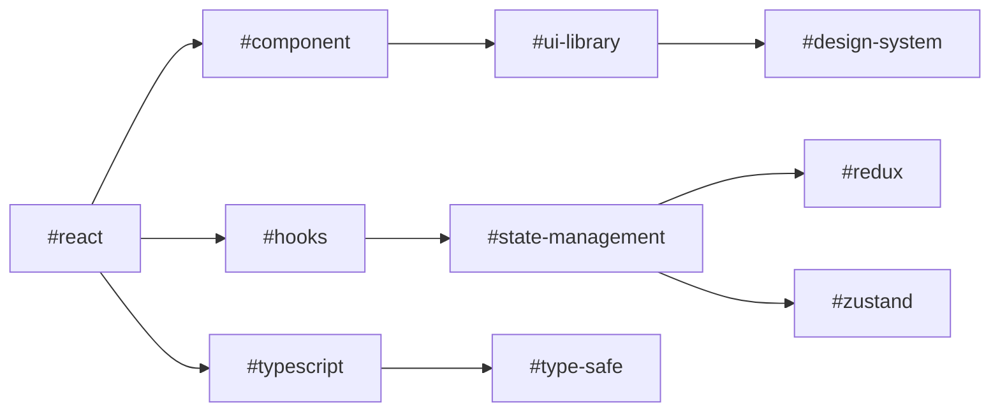
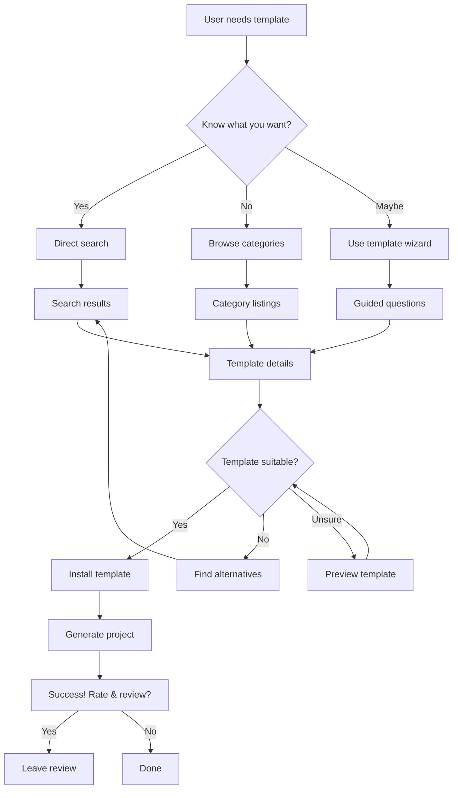
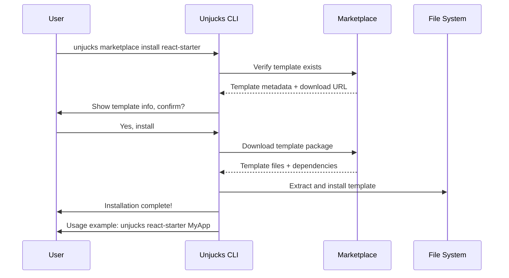
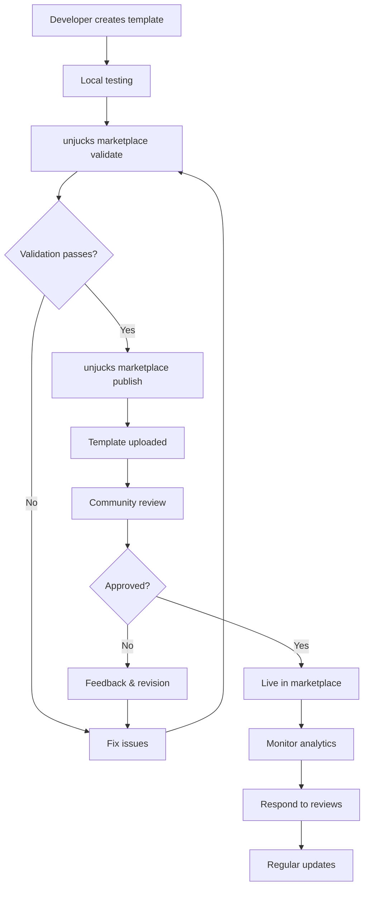
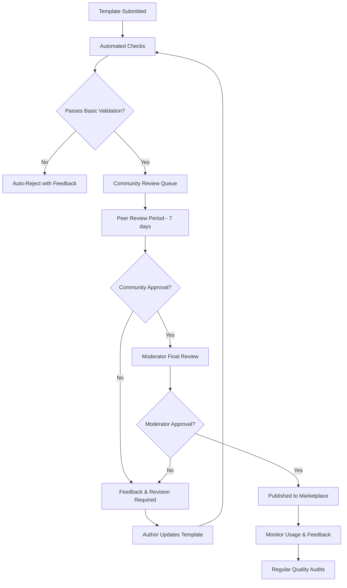

# Unjucks Marketplace User Experience Design

## Executive Summary

The Unjucks Marketplace provides a comprehensive platform for discovering, sharing, and consuming code generation templates. This document outlines the complete user experience design, from CLI commands to web interfaces, ensuring seamless template discovery, installation, and contribution workflows.

## Table of Contents

1. [CLI Marketplace Commands](#cli-marketplace-commands)
2. [Web Interface Features](#web-interface-features)
3. [Discovery Mechanisms](#discovery-mechanisms)
4. [Search and Filtering](#search-and-filtering)
5. [Ratings and Reviews System](#ratings-and-reviews-system)
6. [User Journey Flows](#user-journey-flows)
7. [Interface Mockups](#interface-mockups)
8. [Accessibility and Interaction Patterns](#accessibility-and-interaction-patterns)
9. [Marketplace Governance](#marketplace-governance)

## CLI Marketplace Commands

### Core Marketplace Commands

```bash
# Marketplace discovery and browsing
unjucks marketplace list                    # List all available templates
unjucks marketplace search <query>          # Search templates by name/tags/description
unjucks marketplace browse [category]       # Browse templates by category
unjucks marketplace featured                # Show featured/trending templates
unjucks marketplace trending                # Show trending templates this week/month

# Template information and details
unjucks marketplace show <template-id>      # Show detailed template information
unjucks marketplace info <template-id>      # Alias for show
unjucks marketplace preview <template-id>   # Preview template without installing
unjucks marketplace dependencies <template-id> # Show template dependencies

# Template installation and management
unjucks marketplace install <template-id>   # Install template locally
unjucks marketplace update <template-id>    # Update installed template
unjucks marketplace uninstall <template-id> # Remove installed template
unjucks marketplace installed               # List locally installed templates
unjucks marketplace outdated               # Show templates with available updates

# Template publishing and contribution
unjucks marketplace publish [path]          # Publish local template to marketplace
unjucks marketplace unpublish <template-id> # Remove published template
unjucks marketplace validate [path]         # Validate template before publishing
unjucks marketplace draft [path]           # Publish as draft for testing

# User account and social features
unjucks marketplace login                   # Login to marketplace account
unjucks marketplace logout                  # Logout from marketplace
unjucks marketplace profile [username]      # View user profile and templates
unjucks marketplace following               # Show templates/users you follow
unjucks marketplace followers               # Show your followers

# Rating and review system
unjucks marketplace rate <template-id> <1-5> # Rate a template
unjucks marketplace review <template-id>     # Write/edit template review
unjucks marketplace reviews <template-id>    # View all reviews for template
unjucks marketplace my-reviews               # View your reviews

# Analytics and insights
unjucks marketplace stats <template-id>     # Show template usage statistics
unjucks marketplace analytics               # Show your published templates' analytics
unjucks marketplace popular                 # Most popular templates this month
unjucks marketplace new                     # Recently published templates
```

### Advanced CLI Features

```bash
# Collection and curation
unjucks marketplace collections             # Browse curated collections
unjucks marketplace collection <name>       # View specific collection
unjucks marketplace create-collection <name> # Create new collection
unjucks marketplace add-to-collection <template-id> <collection>

# Quality and compatibility
unjucks marketplace compatible <framework>   # Find templates compatible with framework
unjucks marketplace quality-score <template-id> # Show quality metrics
unjucks marketplace verified               # Show verified templates only
unjucks marketplace enterprise             # Show enterprise-grade templates

# Advanced search and filtering
unjucks marketplace filter --language js --framework react --license mit
unjucks marketplace filter --min-rating 4 --updated-since 30days
unjucks marketplace filter --author username --category frontend

# Template generation and scaffolding
unjucks marketplace scaffold <template-id> [project-name] # Create project from template
unjucks marketplace quick-start <category>  # Interactive template selection
unjucks marketplace wizard                 # Step-by-step template finder
```

## Web Interface Features

### Primary Navigation Structure

```
Unjucks Marketplace
├── Discover
│   ├── Browse All Templates
│   ├── Categories
│   ├── Featured & Trending
│   ├── New Releases
│   └── Collections
├── Search
│   ├── Advanced Filters
│   ├── Saved Searches
│   └── Search History
├── My Account
│   ├── Dashboard
│   ├── My Templates
│   ├── Installed Templates
│   ├── Reviews & Ratings
│   ├── Following
│   └── Analytics
├── Create
│   ├── Publish Template
│   ├── Template Builder (Visual)
│   ├── Import from Git
│   └── Documentation Helper
└── Community
    ├── Forums
    ├── Featured Contributors
    ├── Template Contests
    └── Help & Documentation
```

### Dashboard Features

#### User Dashboard
- **Template Library**: Grid view of installed templates with quick actions
- **Recent Activity**: Recent downloads, ratings, and reviews
- **Recommendations**: Personalized template suggestions
- **Quick Actions**: One-click access to frequent operations
- **Usage Statistics**: Personal template usage analytics
- **Notification Center**: Updates, new releases, and community notifications

#### Publisher Dashboard
- **Template Analytics**: Downloads, ratings, usage patterns
- **Revenue Tracking**: For premium templates (if applicable)
- **Community Feedback**: Reviews, issues, and feature requests
- **Template Management**: Version control, publishing status
- **Performance Metrics**: Quality scores, compatibility ratings

## Discovery Mechanisms

### 1. Category-Based Browsing

```
Categories:
├── Frontend Frameworks
│   ├── React/Next.js (2,341 templates)
│   ├── Vue/Nuxt (1,892 templates)
│   ├── Angular (1,234 templates)
│   └── Svelte/SvelteKit (892 templates)
├── Backend & APIs
│   ├── Node.js/Express (1,956 templates)
│   ├── Python/FastAPI (1,445 templates)
│   ├── Go/Gin (892 templates)
│   └── Rust/Axum (567 templates)
├── Databases
│   ├── SQL Schemas (1,234 templates)
│   ├── NoSQL Models (892 templates)
│   └── ORM Configurations (678 templates)
├── DevOps & Infrastructure
│   ├── Docker/Kubernetes (1,567 templates)
│   ├── CI/CD Pipelines (1,123 templates)
│   └── Monitoring/Logging (789 templates)
├── Mobile Development
│   ├── React Native (1,234 templates)
│   ├── Flutter/Dart (892 templates)
│   └── Native iOS/Android (567 templates)
└── Specialized
    ├── Machine Learning (892 templates)
    ├── Blockchain/Web3 (456 templates)
    ├── IoT/Embedded (234 templates)
    └── Enterprise Integration (678 templates)
```

### 2. Tag-Based Discovery

#### Smart Tag System
- **Technology Tags**: `#react`, `#typescript`, `#mongodb`, `#docker`
- **Pattern Tags**: `#mvc`, `#microservices`, `#crud`, `#authentication`
- **Quality Tags**: `#verified`, `#enterprise`, `#tested`, `#documented`
- **Use Case Tags**: `#starter-kit`, `#component-library`, `#boilerplate`, `#scaffold`
- **Level Tags**: `#beginner`, `#intermediate`, `#advanced`, `#expert`

#### Tag Relationships and Clustering


### 3. Semantic and AI-Powered Discovery

#### Intent-Based Search
- **Natural Language Queries**: "Create a REST API with authentication"
- **Context-Aware Suggestions**: Based on current project structure
- **Smart Recommendations**: ML-powered suggestions based on usage patterns
- **Similar Templates**: "Users who used this also used..."

## Search and Filtering

### Advanced Search Interface

```javascript
// Search API Structure
{
  query: "react component library",
  filters: {
    categories: ["frontend", "ui-components"],
    languages: ["typescript", "javascript"],
    frameworks: ["react", "next.js"],
    license: ["MIT", "Apache-2.0"],
    rating: { min: 4.0, max: 5.0 },
    downloads: { min: 1000 },
    updated: { since: "30days" },
    author: { verified: true },
    features: ["typescript", "storybook", "testing"],
    size: { max: "10MB" },
    complexity: ["beginner", "intermediate"]
  },
  sort: {
    by: "popularity", // popularity, rating, recent, downloads, alphabetical
    order: "desc"
  },
  pagination: {
    page: 1,
    limit: 20
  }
}
```

### Search Experience Features

#### Real-Time Search
- **Autocomplete**: Smart suggestions as you type
- **Search History**: Quick access to previous searches
- **Saved Searches**: Bookmark complex filter combinations
- **Search Alerts**: Notifications for new templates matching criteria

#### Visual Search Filters
```
Filter Panel:
├── Quick Filters (Pills)
│   ├── [Verified] [Enterprise] [Free] [Premium]
│   ├── [React] [Vue] [Angular] [Node.js]
│   └── [Last 30 Days] [4+ Stars] [1K+ Downloads]
├── Categories
│   └── Multi-select tree with counts
├── Technologies
│   └── Tag cloud with selection
├── Quality Metrics
│   ├── Rating: ★★★★☆ (4+ stars)
│   ├── Downloads: 1K+ | 10K+ | 100K+
│   └── Verified: ☑ Verified Publishers Only
├── Compatibility
│   ├── Node.js Version: 16+ | 18+ | 20+
│   ├── Framework Version: React 17+ | Vue 3+
│   └── Dependencies: Minimal | Standard | Full
└── Advanced Options
    ├── File Size: < 1MB | < 10MB | Any
    ├── Last Updated: 7d | 30d | 90d | 1y
    ├── License: Open Source | Commercial | Any
    └── Language: English | Multi-language
```

### Search Results Layout

#### Grid View (Default)
```
[Template Card Layout]
┌─────────────────────────────┐
│ [Icon] Template Name        │
│ by @author ⭐ 4.8 (234)     │
│ └─ React, TypeScript, TailwindCSS
│                             │
│ Brief description of what   │
│ this template generates...  │
│                             │
│ 📥 12.3K   🔄 Last week     │
│ [Preview] [Install] [♡ Save]│
└─────────────────────────────┘
```

#### List View (Detailed)
```
📦 react-component-library                    ⭐ 4.8 (234 reviews)
   by @facebook-incubator                     📥 12,345 downloads
   
   A complete React component library starter with TypeScript,
   Storybook, testing, and automated documentation.
   
   🏷️ react typescript storybook jest rollup
   🔄 Updated 3 days ago  📄 MIT License  📦 2.3MB
   
   [Preview] [Install] [♡ Save] [More Details]
```

## Ratings and Reviews System

### Rating Categories

#### Overall Quality (1-5 stars)
- **Documentation Quality**: How well is it documented?
- **Code Quality**: Clean, maintainable, follows best practices?
- **Ease of Use**: How easy is it to understand and customize?
- **Completeness**: Does it cover all necessary aspects?
- **Maintenance**: Is it actively maintained and updated?

#### Specialized Ratings
```javascript
{
  overall: 4.7,
  categories: {
    documentation: 4.8,
    codeQuality: 4.9,
    easeOfUse: 4.5,
    completeness: 4.6,
    maintenance: 4.8
  },
  breakdown: {
    5: 156,  // 65%
    4: 67,   // 28%
    3: 12,   // 5%
    2: 3,    // 1%
    1: 2     // 1%
  }
}
```

### Review System Features

#### Review Structure
```markdown
**★★★★☆ Excellent React starter, minor issues with TypeScript config**

**Pros:**
- Clean, well-structured code
- Comprehensive documentation
- Great developer experience
- Active community support

**Cons:**
- TypeScript configuration needs update
- Missing some modern React patterns
- Large bundle size for simple projects

**Use Case:** Perfect for medium to large React applications needing a solid foundation.

**Would you recommend this template?** ✅ Yes, with minor modifications

**Experience Level:** Intermediate
**Project Type:** Production application
**Used for:** E-commerce platform rebuild
```

#### Review Management
- **Helpful Votes**: Community can vote on review helpfulness
- **Response from Authors**: Template creators can respond to reviews
- **Verified Reviews**: From confirmed users who've actually used the template
- **Review Updates**: Users can update reviews as templates evolve
- **Moderation**: Community moderation for quality control

### Trust and Verification

#### Verification Badges
- **☑️ Verified Publisher**: Identity verified, established contributor
- **🏢 Enterprise**: Meets enterprise quality standards
- **🧪 Tested**: Includes comprehensive test suite
- **📚 Documented**: Complete documentation and examples
- **🔒 Secure**: Security audit passed
- **⚡ Performance**: Performance benchmarked
- **♿ Accessible**: Accessibility compliance verified

## User Journey Flows

### 1. Discovery Journey



### 2. Installation Journey



### 3. Publishing Journey



## Interface Mockups

### 1. Marketplace Home Page

```
┌─────────────────────────────────────────────────────────────────────────────────┐
│ 🌆 Unjucks Marketplace                    🔍 [Search templates...] [🔍] [Login] │
├─────────────────────────────────────────────────────────────────────────────────┤
│                                                                                 │
│ 🎯 Find the perfect template for your next project                              │
│ ━━━━━━━━━━━━━━━━━━━━━━━━━━━━━━━━━━━━━━━━━━━━━━━━━━━━━━━━━━━━━━━━━━━━━━━━━━━━━━━━━ │
│                                                                                 │
│ 🔥 Trending This Week                                          [View All →]    │
│ ┌─────────┐ ┌─────────┐ ┌─────────┐ ┌─────────┐                              │
│ │ [📦]    │ │ [🎨]    │ │ [⚡]    │ │ [🚀]    │                              │
│ │ Next.js │ │ UI Kit  │ │ FastAPI │ │ K8s     │                              │
│ │ Starter │ │ React   │ │ Backend │ │ Deploy  │                              │
│ │ ⭐ 4.9  │ │ ⭐ 4.7  │ │ ⭐ 4.8  │ │ ⭐ 4.6  │                              │
│ └─────────┘ └─────────┘ └─────────┘ └─────────┘                              │
│                                                                                 │
│ 📚 Browse by Category                                                           │
│ ┌────────────────┬────────────────┬────────────────┬────────────────┐        │
│ │ 🖥️ Frontend     │ ⚙️ Backend      │ 📱 Mobile       │ 🔧 DevOps       │        │
│ │ 2,341 templates│ 1,956 templates│ 1,234 templates│ 1,567 templates│        │
│ ├────────────────┼────────────────┼────────────────┼────────────────┤        │
│ │ 🗄️ Database     │ 🤖 AI/ML       │ 🔐 Security     │ 🏢 Enterprise   │        │
│ │ 892 templates  │ 678 templates  │ 456 templates  │ 234 templates  │        │
│ └────────────────┴────────────────┴────────────────┴────────────────┘        │
│                                                                                 │
│ ⭐ Featured Collections                                         [View All →]    │
│ • 🚀 Production-Ready Starters (12 templates)                                  │
│ • 🎨 Modern UI Component Libraries (8 templates)                               │
│ • 🔥 Trending TypeScript Templates (15 templates)                              │
│ • 🏢 Enterprise Application Scaffolds (6 templates)                            │
│                                                                                 │
└─────────────────────────────────────────────────────────────────────────────────┘
```

### 2. Template Detail Page

```
┌─────────────────────────────────────────────────────────────────────────────────┐
│ ← Back to Results    📦 react-component-library                        [♡ Save] │
├─────────────────────────────────────────────────────────────────────────────────┤
│                                                                                 │
│ ┌─────────────────────┬─────────────────────────────────────────────────────┐ │
│ │ 📷 [Screenshot]     │ ⭐ 4.8/5 (234 reviews)  📥 12,345 downloads        │ │
│ │                     │ by @facebook-incubator  ☑️ Verified Publisher       │ │
│ │ [Live Demo →]       │                                                     │ │
│ │ [GitHub Repository] │ 🏷️ react typescript storybook jest rollup         │ │
│ │                     │                                                     │ │
│ │                     │ A complete React component library starter with    │ │
│ │                     │ TypeScript, Storybook, testing, and automated      │ │
│ │                     │ documentation generation.                          │ │
│ │                     │                                                     │ │
│ │                     │ [📥 Install Template] [👁️ Preview] [📋 Copy CLI]   │ │
│ └─────────────────────┴─────────────────────────────────────────────────────┘ │
│                                                                                 │
│ ┌─ 📋 Quick Info ─────────────────┬─ 🔧 Generated Files ──────────────────────┐ │
│ │ 📦 Size: 2.3MB                  │ • package.json (dependencies & scripts)    │ │
│ │ 🔄 Updated: 3 days ago          │ • src/components/ (component library)      │ │
│ │ 📄 License: MIT                 │ • stories/ (Storybook configurations)      │ │
│ │ 🏷️ Version: 2.1.4               │ • tests/ (Jest test suites)               │ │
│ │ 📊 Complexity: Intermediate     │ • rollup.config.js (build configuration)  │ │
│ │ 🌟 Quality Score: 94/100        │ • documentation/ (auto-generated docs)     │ │
│ └─────────────────────────────────┴────────────────────────────────────────────┘ │
│                                                                                 │
│ ┌─ 📖 README Preview ──────────────────────────────────────────────────────────┐ │
│ │ # React Component Library Starter                                            │ │
│ │                                                                               │ │
│ │ ## Quick Start                                                                │ │
│ │ ```bash                                                                       │ │
│ │ unjucks react-component-library MyLibrary                                    │ │
│ │ cd MyLibrary                                                                  │ │
│ │ npm install                                                                   │ │
│ │ npm run storybook                                                             │ │
│ │ ```                                                                           │ │
│ │                                                                               │ │
│ │ ## Features                                                                   │ │
│ │ ✅ TypeScript configuration                                                   │ │
│ │ ✅ Storybook for component development                                        │ │
│ │ ✅ Jest + Testing Library setup                                               │ │
│ │ [Show More...]                                                                │ │
│ └───────────────────────────────────────────────────────────────────────────────┘ │
│                                                                                 │
└─────────────────────────────────────────────────────────────────────────────────┘
```

### 3. Search Results Page

```
┌─────────────────────────────────────────────────────────────────────────────────┐
│ 🔍 Search: "react component library"           [Grid] [List]  Sort: Popularity ↓│
│ 47 results found                                                                │
├─────────────────────────────────────────────────────────────────────────────────┤
│ ┌─ Filters ─────────┐ ┌─ Results ───────────────────────────────────────────┐ │
│ │ ☑️ React           │ │ ┌─────────────────────────────────────────────────┐ │ │
│ │ ☑️ TypeScript      │ │ │ 📦 react-component-library          ⭐ 4.8 📥12K│ │ │
│ │ ☐ Vue              │ │ │ A complete React component library starter...  │ │ │
│ │ ☐ Angular          │ │ │ [Preview] [Install] [♡]                         │ │ │
│ │                    │ │ └─────────────────────────────────────────────────┘ │ │
│ │ Categories:        │ │ ┌─────────────────────────────────────────────────┐ │ │
│ │ ☑️ UI Components   │ │ │ 🎨 modern-ui-kit                    ⭐ 4.6 📥8.5K│ │ │
│ │ ☐ Forms            │ │ │ Modern React UI components with Tailwind...    │ │ │
│ │ ☐ Navigation       │ │ │ [Preview] [Install] [♡]                         │ │ │
│ │                    │ │ └─────────────────────────────────────────────────┘ │ │
│ │ Rating:            │ │ ┌─────────────────────────────────────────────────┐ │ │
│ │ ⭐⭐⭐⭐☆ & up      │ │ │ 🚀 design-system-starter          ⭐ 4.7 📥6.2K│ │ │
│ │                    │ │ │ Enterprise design system with React...         │ │ │
│ │ Updated:           │ │ │ [Preview] [Install] [♡]                         │ │ │
│ │ ☑️ Last 30 days    │ │ └─────────────────────────────────────────────────┘ │ │
│ │                    │ │                                                     │ │
│ │ [Clear Filters]    │ │ ... (more results)                                  │ │
│ └───────────────────┘ └─────────────────────────────────────────────────────┘ │
└─────────────────────────────────────────────────────────────────────────────────┘
```

### 4. User Dashboard

```
┌─────────────────────────────────────────────────────────────────────────────────┐
│ 👋 Welcome back, @username!                              [Settings] [Help]      │
├─────────────────────────────────────────────────────────────────────────────────┤
│                                                                                 │
│ ┌─ Quick Stats ───────────────────────────────────────────────────────────────┐ │
│ │ 📥 23 Installed  📤 5 Published  ⭐ 4.6 Avg Rating  📈 1.2K Downloads       │ │
│ └─────────────────────────────────────────────────────────────────────────────┘ │
│                                                                                 │
│ ┌─ My Templates ─────────────────────────────┬─ Recent Activity ──────────────┐ │
│ │                                            │ • Downloaded react-starter (2h) │ │
│ │ 📦 vue-component-lib  ⭐4.8  📥 2.3K       │ • Rated fastapi-template ⭐⭐⭐⭐⭐│ │
│ │ 🔄 Updated 2 days ago  [Edit] [Analytics]  │ • Published ui-kit v1.2.0 (1d)  │ │
│ │                                            │ • Review on docker-template (2d) │ │
│ │ 🚀 fastapi-backend    ⭐4.6  📥 892        │ • New follower: @dev_jane (3d)   │ │
│ │ 🔄 Updated 1 week ago  [Edit] [Analytics]  │                                  │ │
│ │                                            │ [View All Activity →]           │ │
│ │ [+ Publish New Template]                   │                                  │ │
│ └────────────────────────────────────────────┴──────────────────────────────────┘ │
│                                                                                 │
│ ┌─ Installed Templates ──────────────────────────────────────────────────────┐ │
│ │ 📦 next-starter      📥 Installed 3 days ago      [Update Available] [Use]  │ │
│ │ 🎨 tailwind-config   📥 Installed 1 week ago                        [Use]  │ │
│ │ 🔧 docker-compose    📥 Installed 2 weeks ago                       [Use]  │ │
│ │                                                              [View All →]  │ │
│ └─────────────────────────────────────────────────────────────────────────────┘ │
│                                                                                 │
│ ┌─ Recommendations ──────────────────────────────────────────────────────────┐ │
│ │ Based on your recent activity:                                              │ │
│ │                                                                             │ │
│ │ 🔥 prisma-schema-generator  ⭐4.7  Similar to: fastapi-backend              │ │
│ │ 🎯 react-native-starter     ⭐4.9  Trending in: Mobile Development           │ │
│ │ ⚡ microservice-template    ⭐4.5  Used with: docker-compose               │ │
│ └─────────────────────────────────────────────────────────────────────────────┘ │
│                                                                                 │
└─────────────────────────────────────────────────────────────────────────────────┘
```

## Accessibility and Interaction Patterns

### Accessibility Standards

#### WCAG 2.1 Compliance
- **AA Level Compliance**: Color contrast ratios, text sizing, navigation
- **Keyboard Navigation**: Full keyboard accessibility for all functions
- **Screen Reader Support**: Proper ARIA labels and semantic HTML
- **Focus Management**: Clear focus indicators and logical tab order
- **Reduced Motion**: Respect user preferences for animations

#### Inclusive Design Patterns
```css
/* High contrast mode support */
@media (prefers-contrast: high) {
  .template-card {
    border: 2px solid var(--high-contrast-border);
    background: var(--high-contrast-bg);
  }
}

/* Reduced motion preferences */
@media (prefers-reduced-motion: reduce) {
  .search-animation, .loading-spinner {
    animation: none;
  }
}

/* Dark mode support */
@media (prefers-color-scheme: dark) {
  :root {
    --bg-primary: #1a1a1a;
    --text-primary: #ffffff;
    --accent-color: #0ea5e9;
  }
}
```

### Interaction Patterns

#### Progressive Disclosure
```
Template Card (Collapsed)
├── Essential Info (Title, Author, Rating)
├── Key Tags (Max 3)
└── Primary Actions (Preview, Install)

Template Card (Hover/Focus)
├── Additional Details (Download count, Last updated)
├── More Tags (All relevant tags)
├── Secondary Actions (Save, Share, More info)
└── Quick Preview (Thumbnail or code snippet)

Template Card (Expanded)
├── Full Description
├── Complete Tag List
├── Compatibility Information
├── Installation Instructions
└── All Available Actions
```

#### Search Behavior
```javascript
// Search interaction timeline
const searchBehavior = {
  onInput: {
    debounce: 300, // Wait 300ms after typing stops
    minChars: 2,   // Start searching after 2 characters
    actions: ['showAutoComplete', 'updateResults']
  },
  onFocus: {
    actions: ['showSearchHistory', 'showSavedSearches']
  },
  onResults: {
    actions: ['updateURL', 'trackSearchMetrics', 'showFilters']
  },
  onEmpty: {
    actions: ['showSuggestions', 'showTrending', 'showRecentlyViewed']
  }
};
```

#### Error Handling and Recovery
```
Error States:
├── Network Issues
│   ├── Show offline indicator
│   ├── Cache last successful results
│   └── Provide retry mechanism
├── Search No Results
│   ├── Suggest similar searches
│   ├── Show popular alternatives
│   └── Option to create request
├── Template Not Found
│   ├── Show similar templates
│   ├── Report broken link
│   └── Navigate to category
└── Installation Failures
    ├── Clear error message
    ├── Troubleshooting steps
    └── Alternative installation methods
```

#### Loading States and Feedback
```
Loading Patterns:
├── Initial Page Load
│   └── Skeleton screens for consistent layout
├── Search Results
│   └── Progressive loading with placeholders
├── Template Details
│   └── Staged loading (meta first, then content)
├── Installation Process
│   ├── Step-by-step progress indicator
│   ├── Real-time status updates
│   └── Cancellation option
└── Upload/Publish
    ├── File upload progress
    ├── Processing status
    └── Success/error confirmation
```

## Marketplace Governance

### Quality Standards

#### Template Requirements
```yaml
mandatory_requirements:
  - Valid package.json or equivalent manifest
  - README.md with clear documentation
  - Working template files with proper frontmatter
  - Test or example generation
  - License specification
  - Version control history

quality_guidelines:
  documentation:
    - Clear description and use cases
    - Installation and usage instructions
    - Configuration options explained
    - Troubleshooting section
  code_quality:
    - Follows language/framework conventions
    - No hardcoded credentials or secrets
    - Proper error handling
    - Performance considerations
  maintainability:
    - Regular updates within 90 days
    - Response to community issues
    - Backward compatibility notes
    - Migration guides for breaking changes
```

#### Review Process


### Community Guidelines

#### Contributor Responsibilities
- **Quality Commitment**: Maintain templates with regular updates
- **Documentation Standards**: Keep documentation current and comprehensive
- **Community Support**: Respond to issues and questions promptly
- **Ethical Publishing**: No plagiarism, respect intellectual property
- **Security Awareness**: Regular security updates and vulnerability fixes

#### User Responsibilities
- **Constructive Feedback**: Provide helpful reviews and ratings
- **Proper Attribution**: Credit original authors when modifying templates
- **Bug Reporting**: Report issues with sufficient detail for reproduction
- **Community Respect**: Maintain professional and respectful communication

### Moderation and Safety

#### Content Moderation
```javascript
const moderationRules = {
  prohibited_content: [
    'malicious_code',
    'security_vulnerabilities',
    'copyright_infringement',
    'inappropriate_content',
    'spam_or_duplicate'
  ],
  automated_detection: {
    malware_scanning: true,
    vulnerability_scanning: true,
    license_compliance: true,
    duplicate_detection: true
  },
  escalation_process: {
    community_reports: 'reviewed_within_24h',
    automated_flags: 'immediate_review',
    security_issues: 'emergency_response'
  }
};
```

#### Trust and Safety Features
- **Verification Systems**: Identity verification for publishers
- **Reputation Scoring**: Community-driven trust metrics
- **Sandboxed Testing**: Safe template preview environments
- **Version Control**: Full audit trail of template changes
- **Rollback Capabilities**: Quick reversion of problematic updates

### Analytics and Insights

#### Marketplace Metrics
```javascript
const marketplaceMetrics = {
  usage_analytics: {
    template_downloads: 'by_category_and_time',
    search_patterns: 'popular_queries_and_filters',
    user_journeys: 'from_discovery_to_installation',
    conversion_rates: 'search_to_install_ratios'
  },
  quality_metrics: {
    template_ratings: 'average_and_distribution',
    review_sentiment: 'automated_sentiment_analysis',
    issue_resolution: 'time_to_resolution',
    maintenance_status: 'update_frequency_tracking'
  },
  community_health: {
    active_contributors: 'publishing_and_reviewing',
    user_retention: 'return_visit_patterns',
    support_quality: 'response_times_and_satisfaction',
    knowledge_sharing: 'documentation_contributions'
  }
};
```

#### Personalization Engine
```javascript
const personalizationFeatures = {
  recommendation_algorithm: {
    collaborative_filtering: 'users_with_similar_patterns',
    content_based: 'template_similarity_analysis',
    contextual: 'project_type_and_technology_match',
    temporal: 'trending_and_seasonal_patterns'
  },
  customization_options: {
    interface_preferences: 'grid_vs_list_layouts',
    notification_settings: 'update_and_review_alerts',
    privacy_controls: 'usage_tracking_opt_out',
    accessibility_settings: 'motion_and_contrast_preferences'
  }
};
```

---

## Conclusion

This comprehensive marketplace UX design ensures that Unjucks provides a world-class template discovery and sharing experience. The combination of powerful CLI tools, intuitive web interfaces, robust search capabilities, and strong community governance creates a sustainable ecosystem for code generation templates.

The design prioritizes:
- **Developer Experience**: Fast, intuitive, and powerful tools
- **Quality Assurance**: Comprehensive review and testing processes  
- **Community Growth**: Sustainable contributor and user engagement
- **Accessibility**: Inclusive design for all users
- **Trust and Safety**: Secure, reliable template ecosystem

This marketplace will position Unjucks as the premier platform for code generation templates, fostering innovation and collaboration in the developer community.