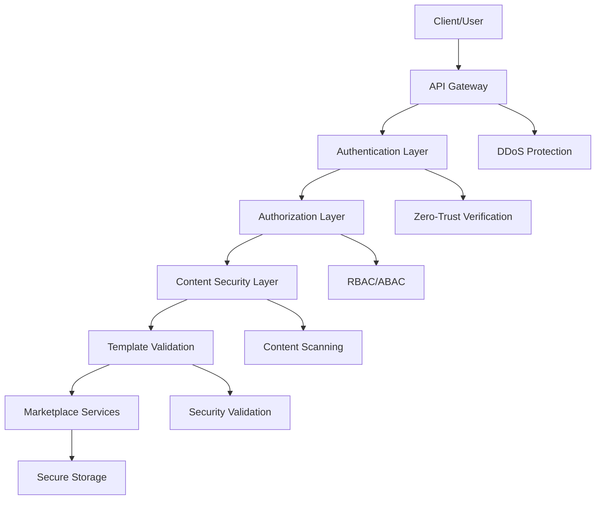

# Marketplace Security, Compliance, and Governance Framework

## Executive Summary

This document outlines the comprehensive security, compliance, and governance framework for the Unjucks template marketplace. The framework implements enterprise-grade security controls, automated compliance validation, and robust governance processes to ensure safe template distribution and usage in Fortune 500 environments.

## Table of Contents

1. [Security Architecture](#security-architecture)
2. [Template Security Scanning](#template-security-scanning)
3. [Code Validation Pipeline](#code-validation-pipeline)
4. [Malware Detection](#malware-detection)
5. [Compliance Framework](#compliance-framework)
6. [Content Moderation](#content-moderation)
7. [Marketplace Governance](#marketplace-governance)
8. [Audit Logging](#audit-logging)
9. [Security Monitoring](#security-monitoring)
10. [Incident Response](#incident-response)

## Security Architecture

### Zero-Trust Security Model

The marketplace implements a comprehensive zero-trust architecture with the following components:

```typescript
// Security architecture overview
interface MarketplaceSecurityArchitecture {
  authentication: {
    multiFactorAuth: boolean;
    certificateBasedAuth: boolean;
    deviceTrust: boolean;
    aiAgentVerification: boolean;
  };
  authorization: {
    roleBasedAccess: boolean;
    attributeBasedAccess: boolean;
    dynamicPermissions: boolean;
    templateAccessControl: boolean;
  };
  dataProtection: {
    encryptionAtRest: boolean;
    encryptionInTransit: boolean;
    endToEndEncryption: boolean;
    keyRotation: boolean;
  };
  networkSecurity: {
    networkSegmentation: boolean;
    apiGateway: boolean;
    ddosProtection: boolean;
    trafficAnalysis: boolean;
  };
}
```

### Security Layers



## Template Security Scanning

### Multi-Layer Security Scanning

#### 1. Static Analysis Security Testing (SAST)

```typescript
interface SASTConfig {
  scanners: {
    codeql: {
      enabled: boolean;
      languages: string[];
      securityQueries: string[];
      customRules: string[];
    };
    semgrep: {
      enabled: boolean;
      rulesets: string[];
      customPatterns: SecurityPattern[];
    };
    eslint: {
      enabled: boolean;
      securityPlugins: string[];
      customRules: ESLintRule[];
    };
  };
  scanTargets: {
    templateFiles: boolean;
    generatedCode: boolean;
    configFiles: boolean;
    dependencies: boolean;
  };
  vulnerabilityClassification: {
    critical: VulnerabilityRule[];
    high: VulnerabilityRule[];
    medium: VulnerabilityRule[];
    low: VulnerabilityRule[];
  };
}
```

#### 2. Dynamic Analysis Security Testing (DAST)

```typescript
interface DASTConfig {
  runtime: {
    sandboxExecution: boolean;
    containerIsolation: boolean;
    resourceLimits: ResourceLimits;
    networkIsolation: boolean;
  };
  behaviorAnalysis: {
    fileSystemAccess: boolean;
    networkConnections: boolean;
    processExecution: boolean;
    environmentAccess: boolean;
  };
  exploitTesting: {
    injectionAttacks: boolean;
    privilegeEscalation: boolean;
    dataExfiltration: boolean;
    maliciousPayloads: boolean;
  };
}
```

#### 3. Interactive Application Security Testing (IAST)

```typescript
interface IASTConfig {
  realTimeAnalysis: {
    codeInstrumentation: boolean;
    runtimeMonitoring: boolean;
    dataFlowTracking: boolean;
    vulnerabilityCorrelation: boolean;
  };
  hybridApproach: {
    staticAnalysisIntegration: boolean;
    dynamicAnalysisIntegration: boolean;
    contextAwareScanning: boolean;
    falsePositiveReduction: boolean;
  };
}
```

### Security Scanning Pipeline

```yaml
# Template Security Scanning Pipeline
template-security-scan:
  stages:
    - name: "Pre-Processing"
      steps:
        - extract-template-files
        - parse-frontmatter
        - identify-variables
        - map-dependencies
    
    - name: "Static Analysis"
      parallel:
        - codeql-analysis
        - semgrep-scan
        - dependency-check
        - license-compliance
    
    - name: "Dynamic Analysis"
      steps:
        - sandbox-execution
        - behavior-monitoring
        - exploit-testing
        - resource-usage-analysis
    
    - name: "Interactive Analysis"
      steps:
        - runtime-instrumentation
        - vulnerability-correlation
        - context-analysis
        - false-positive-filtering
    
    - name: "Results Aggregation"
      steps:
        - vulnerability-classification
        - risk-scoring
        - remediation-suggestions
        - compliance-mapping
```

## Code Validation Pipeline

### Multi-Stage Validation Process

#### 1. Syntax and Structure Validation

```typescript
interface SyntaxValidation {
  nunjucksValidation: {
    templateSyntax: boolean;
    variableValidation: boolean;
    filterValidation: boolean;
    macroValidation: boolean;
  };
  frontmatterValidation: {
    yamlSyntax: boolean;
    requiredFields: string[];
    fieldTypes: Record<string, string>;
    customValidators: Validator[];
  };
  codeValidation: {
    languageSpecific: Record<string, LanguageValidator>;
    styleGuideCompliance: boolean;
    bestPractices: boolean;
  };
}
```

#### 2. Security Validation

```typescript
interface SecurityValidation {
  injectionPrevention: {
    sqlInjection: boolean;
    commandInjection: boolean;
    templateInjection: boolean;
    pathTraversal: boolean;
  };
  privilegeEscalation: {
    fileSystemAccess: boolean;
    processExecution: boolean;
    networkAccess: boolean;
    environmentVariables: boolean;
  };
  dataProtection: {
    secretDetection: boolean;
    piiDetection: boolean;
    sensitiveDataHandling: boolean;
    encryptionRequirements: boolean;
  };
}
```

#### 3. Quality Validation

```typescript
interface QualityValidation {
  codeMetrics: {
    complexity: number;
    maintainability: number;
    testCoverage: number;
    documentation: number;
  };
  performanceValidation: {
    executionTime: number;
    memoryUsage: number;
    resourceEfficiency: number;
    scalability: number;
  };
  reliabilityValidation: {
    errorHandling: boolean;
    edgeCases: boolean;
    failureRecovery: boolean;
    robustness: number;
  };
}
```

### Validation Workflow

```typescript
class CodeValidationPipeline {
  async validateTemplate(template: Template): Promise<ValidationResult> {
    const results: ValidationResult = {
      syntax: await this.validateSyntax(template),
      security: await this.validateSecurity(template),
      quality: await this.validateQuality(template),
      compliance: await this.validateCompliance(template)
    };
    
    return this.aggregateResults(results);
  }
  
  private async validateSyntax(template: Template): Promise<SyntaxResult> {
    // Comprehensive syntax validation
    const nunjucksValidation = await this.validateNunjucksSyntax(template);
    const frontmatterValidation = await this.validateFrontmatter(template);
    const codeValidation = await this.validateGeneratedCode(template);
    
    return {
      nunjucks: nunjucksValidation,
      frontmatter: frontmatterValidation,
      code: codeValidation
    };
  }
}
```

## Malware Detection

### Advanced Threat Detection

#### 1. Signature-Based Detection

```typescript
interface SignatureDetection {
  knownMalware: {
    virusSignatures: string[];
    trojanSignatures: string[];
    backdoorSignatures: string[];
    exploitSignatures: string[];
  };
  behaviorSignatures: {
    suspiciousPatterns: Pattern[];
    maliciousAPICalls: string[];
    networkBehavior: NetworkPattern[];
    fileSystemBehavior: FilePattern[];
  };
  updateMechanism: {
    signatureUpdates: boolean;
    frequencyHours: number;
    sources: string[];
    verification: boolean;
  };
}
```

#### 2. Heuristic Analysis

```typescript
interface HeuristicAnalysis {
  behaviorAnalysis: {
    abnormalExecution: boolean;
    suspiciousNetworkActivity: boolean;
    unauthorizedFileAccess: boolean;
    privilegeEscalation: boolean;
  };
  codePatterns: {
    obfuscatedCode: boolean;
    encodedPayloads: boolean;
    suspiciousImports: boolean;
    maliciousFunctions: boolean;
  };
  riskScoring: {
    algorithm: string;
    thresholds: RiskThreshold[];
    weightings: RiskWeighting[];
  };
}
```

#### 3. Machine Learning Detection

```typescript
interface MLDetection {
  models: {
    anomalyDetection: MLModel;
    classificationModel: MLModel;
    deepLearningModel: MLModel;
  };
  training: {
    malwareSamples: number;
    benignSamples: number;
    updateFrequency: string;
    accuracyThreshold: number;
  };
  features: {
    staticFeatures: string[];
    dynamicFeatures: string[];
    metadataFeatures: string[];
  };
}
```

### Malware Detection Pipeline

```typescript
class MalwareDetectionEngine {
  async scanTemplate(template: Template): Promise<MalwareResult> {
    const scanResults = await Promise.all([
      this.signatureBasedScan(template),
      this.heuristicAnalysis(template),
      this.machineLearningAnalysis(template),
      this.sandboxAnalysis(template)
    ]);
    
    return this.correlateResults(scanResults);
  }
  
  private async sandboxAnalysis(template: Template): Promise<SandboxResult> {
    const sandbox = await this.createSecureSandbox();
    
    try {
      // Execute template in isolated environment
      const execution = await sandbox.execute(template, {
        timeLimit: 30000, // 30 seconds
        memoryLimit: 128 * 1024 * 1024, // 128MB
        networkAccess: false,
        fileSystemAccess: 'restricted'
      });
      
      return {
        behaviorAnalysis: execution.behavior,
        resourceUsage: execution.resources,
        networkActivity: execution.network,
        fileSystemActivity: execution.filesystem
      };
    } finally {
      await sandbox.destroy();
    }
  }
}
```

## Compliance Framework

### Regulatory Compliance Support

#### 1. GDPR Compliance

```typescript
interface GDPRCompliance {
  dataProtection: {
    personalDataIdentification: boolean;
    dataMinimization: boolean;
    purposeLimitation: boolean;
    storageMinimization: boolean;
  };
  rightsManagement: {
    rightToAccess: boolean;
    rightToRectification: boolean;
    rightToErasure: boolean;
    rightToPortability: boolean;
  };
  consentManagement: {
    explicitConsent: boolean;
    consentWithdrawal: boolean;
    consentRecords: boolean;
    cookieCompliance: boolean;
  };
  privacyByDesign: {
    dataProtectionImpactAssessment: boolean;
    privacyEnhancingTechnologies: boolean;
    defaultPrivacySettings: boolean;
  };
}
```

#### 2. HIPAA Compliance

```typescript
interface HIPAACompliance {
  phiProtection: {
    encryption: boolean;
    accessControls: boolean;
    auditLogging: boolean;
    dataIntegrity: boolean;
  };
  businessAssociateAgreements: {
    vendorCompliance: boolean;
    contractualSafeguards: boolean;
    breachNotification: boolean;
  };
  administrativeSafeguards: {
    securityOfficer: boolean;
    workforceTraining: boolean;
    accessManagement: boolean;
    incidentResponse: boolean;
  };
  physicalSafeguards: {
    facilityAccess: boolean;
    workstationUse: boolean;
    deviceControls: boolean;
  };
}
```

#### 3. SOX Compliance

```typescript
interface SOXCompliance {
  internalControls: {
    changeManagement: boolean;
    segregationOfDuties: boolean;
    authorizationControls: boolean;
    documentationRequirements: boolean;
  };
  auditTrails: {
    completeAuditLog: boolean;
    tamperEvidence: boolean;
    retentionPolicies: boolean;
    reportingCapabilities: boolean;
  };
  riskAssessment: {
    riskIdentification: boolean;
    controlEffectiveness: boolean;
    continuousMonitoring: boolean;
    deficiencyRemediation: boolean;
  };
}
```

#### 4. Basel III Compliance

```typescript
interface Basel3Compliance {
  riskManagement: {
    creditRisk: boolean;
    operationalRisk: boolean;
    marketRisk: boolean;
    liquidityRisk: boolean;
  };
  capitalAdequacy: {
    tier1Capital: boolean;
    tier2Capital: boolean;
    riskWeightedAssets: boolean;
    leverageRatio: boolean;
  };
  stressTesting: {
    scenarioAnalysis: boolean;
    sensitivityAnalysis: boolean;
    reverseStressTesting: boolean;
    recoveryPlanning: boolean;
  };
}
```

### Compliance Automation

```typescript
class ComplianceEngine {
  async validateCompliance(
    template: Template,
    frameworks: ComplianceFramework[]
  ): Promise<ComplianceResult> {
    const results = new Map<ComplianceFramework, ComplianceValidation>();
    
    for (const framework of frameworks) {
      const validation = await this.validateFramework(template, framework);
      results.set(framework, validation);
    }
    
    return {
      overall: this.calculateOverallCompliance(results),
      frameworkResults: results,
      recommendations: this.generateRecommendations(results)
    };
  }
  
  private async validateFramework(
    template: Template,
    framework: ComplianceFramework
  ): Promise<ComplianceValidation> {
    const validator = this.getFrameworkValidator(framework);
    
    return await validator.validate(template, {
      strictMode: true,
      detailedReporting: true,
      remediationSuggestions: true
    });
  }
}
```

## Content Moderation

### Multi-Layered Content Review

#### 1. Automated Content Screening

```typescript
interface ContentScreening {
  textAnalysis: {
    profanityDetection: boolean;
    toxicityScoring: boolean;
    hateSpecchDetection: boolean;
    spamDetection: boolean;
  };
  codeAnalysis: {
    maliciousCode: boolean;
    obfuscatedContent: boolean;
    backdoorDetection: boolean;
    intellectualPropertyViolation: boolean;
  };
  metadataAnalysis: {
    inappropriateMetadata: boolean;
    misleadingDescriptions: boolean;
    falseClaims: boolean;
    categorizeation: boolean;
  };
}
```

#### 2. Human Review Process

```typescript
interface HumanReview {
  reviewQueue: {
    prioritization: ReviewPriority;
    assignmentRules: AssignmentRule[];
    escalationRules: EscalationRule[];
  };
  reviewCriteria: {
    technicalQuality: ReviewCriterion;
    securityCompliance: ReviewCriterion;
    contentAppropriate: ReviewCriterion;
    businessValue: ReviewCriterion;
  };
  reviewWorkflow: {
    initialReview: ReviewStage;
    technicalReview: ReviewStage;
    securityReview: ReviewStage;
    finalApproval: ReviewStage;
  };
}
```

#### 3. Community Moderation

```typescript
interface CommunityModeration {
  userReporting: {
    reportingMechanism: boolean;
    reportCategories: string[];
    reportProcessing: boolean;
  };
  communityVoting: {
    qualityRating: boolean;
    trustScoring: boolean;
    peerReview: boolean;
  };
  reputationSystem: {
    userReputation: boolean;
    contributorBadges: boolean;
    trustMetrics: boolean;
  };
}
```

## Marketplace Governance

### Governance Structure

#### 1. Template Lifecycle Management

```typescript
interface TemplateLifecycle {
  submission: {
    requirements: SubmissionRequirement[];
    validationProcess: ValidationProcess;
    approvalWorkflow: ApprovalWorkflow;
  };
  publication: {
    visibility: VisibilityLevel;
    distribution: DistributionRule[];
    promotion: PromotionRule[];
  };
  maintenance: {
    updateProcess: UpdateProcess;
    versionControl: VersionControl;
    deprecationPolicy: DeprecationPolicy;
  };
  retirement: {
    removalCriteria: RemovalCriterion[];
    migrationSupport: MigrationSupport;
    archivalProcess: ArchivalProcess;
  };
}
```

#### 2. Quality Assurance

```typescript
interface QualityAssurance {
  standards: {
    codingStandards: CodingStandard[];
    securityStandards: SecurityStandard[];
    documentationStandards: DocumentationStandard[];
  };
  testing: {
    functionalTesting: TestingRequirement;
    securityTesting: TestingRequirement;
    performanceTesting: TestingRequirement;
  };
  metrics: {
    qualityMetrics: QualityMetric[];
    performanceMetrics: PerformanceMetric[];
    usageMetrics: UsageMetric[];
  };
}
```

#### 3. Access Control and Permissions

```typescript
interface AccessControl {
  roles: {
    templateCreator: Role;
    templateReviewer: Role;
    securityAnalyst: Role;
    complianceOfficer: Role;
    marketplaceAdmin: Role;
  };
  permissions: {
    create: Permission;
    read: Permission;
    update: Permission;
    delete: Permission;
    publish: Permission;
    approve: Permission;
  };
  policies: {
    accessPolicies: AccessPolicy[];
    approvalPolicies: ApprovalPolicy[];
    securityPolicies: SecurityPolicy[];
  };
}
```

## Audit Logging

### Comprehensive Audit Trail

#### 1. Event Logging

```typescript
interface AuditLogging {
  events: {
    authentication: AuditEvent[];
    authorization: AuditEvent[];
    dataAccess: AuditEvent[];
    dataModification: AuditEvent[];
    administrativeActions: AuditEvent[];
    securityEvents: AuditEvent[];
  };
  logFormat: {
    timestamp: string;
    userId: string;
    sessionId: string;
    action: string;
    resource: string;
    result: string;
    details: Record<string, any>;
  };
  storage: {
    immutableLogs: boolean;
    encryption: boolean;
    retention: RetentionPolicy;
    backup: BackupPolicy;
  };
}
```

#### 2. Compliance Logging

```typescript
interface ComplianceLogging {
  regulatoryRequirements: {
    gdprLogging: GDPRLogRequirement;
    hipaaLogging: HIPAALogRequirement;
    soxLogging: SOXLogRequirement;
  };
  logIntegrity: {
    digitalSignatures: boolean;
    hashChaining: boolean;
    tamperDetection: boolean;
  };
  reporting: {
    automatedReports: Report[];
    customReports: ReportTemplate[];
    realTimeAlerts: AlertRule[];
  };
}
```

### Audit Implementation

```typescript
class AuditLogger {
  async logEvent(event: AuditEvent): Promise<void> {
    const enrichedEvent = await this.enrichEvent(event);
    const signedEvent = await this.signEvent(enrichedEvent);
    
    await Promise.all([
      this.writeToAuditLog(signedEvent),
      this.sendToSIEM(signedEvent),
      this.checkComplianceRules(signedEvent)
    ]);
  }
  
  private async enrichEvent(event: AuditEvent): Promise<EnrichedAuditEvent> {
    return {
      ...event,
      timestamp: new Date().toISOString(),
      sessionId: this.getSessionId(),
      ipAddress: this.getClientIP(),
      userAgent: this.getUserAgent(),
      riskScore: await this.calculateRiskScore(event)
    };
  }
  
  private async signEvent(event: EnrichedAuditEvent): Promise<SignedAuditEvent> {
    const signature = await this.cryptoService.sign(
      JSON.stringify(event),
      this.config.signingKey
    );
    
    return {
      ...event,
      signature: signature,
      signatureAlgorithm: 'SHA256withRSA'
    };
  }
}
```

## Security Monitoring

### Real-Time Security Monitoring

#### 1. Threat Detection

```typescript
interface ThreatDetection {
  indicators: {
    networkAnomalies: Indicator[];
    behavioralAnomalies: Indicator[];
    fileSystemAnomalies: Indicator[];
    processAnomalies: Indicator[];
  };
  correlationRules: {
    multiStageAttacks: CorrelationRule[];
    attackPatterns: CorrelationRule[];
    threatIntelligence: CorrelationRule[];
  };
  alerting: {
    realTimeAlerts: AlertRule[];
    escalationProcedures: EscalationProcedure[];
    notificationChannels: NotificationChannel[];
  };
}
```

#### 2. Security Metrics

```typescript
interface SecurityMetrics {
  kpis: {
    securityIncidents: MetricDefinition;
    meanTimeToDetection: MetricDefinition;
    meanTimeToResponse: MetricDefinition;
    vulnerabilityExposure: MetricDefinition;
  };
  dashboards: {
    executiveDashboard: Dashboard;
    operationalDashboard: Dashboard;
    threatIntelligenceDashboard: Dashboard;
  };
  reporting: {
    dailyReports: ReportTemplate;
    weeklyReports: ReportTemplate;
    monthlyReports: ReportTemplate;
    incidentReports: ReportTemplate;
  };
}
```

### Monitoring Implementation

```typescript
class SecurityMonitor {
  async initialize(): Promise<void> {
    await this.setupMetricCollection();
    await this.initializeThreatDetection();
    await this.configureAlerting();
  }
  
  async processSecurityEvent(event: SecurityEvent): Promise<void> {
    const enrichedEvent = await this.enrichEvent(event);
    const threatScore = await this.calculateThreatScore(enrichedEvent);
    
    if (threatScore >= this.config.alertThreshold) {
      await this.triggerAlert(enrichedEvent, threatScore);
    }
    
    await this.updateMetrics(enrichedEvent);
    await this.correlateWithOtherEvents(enrichedEvent);
  }
}
```

## Incident Response

### Incident Response Framework

#### 1. Incident Classification

```typescript
interface IncidentClassification {
  severity: {
    critical: SeverityDefinition;
    high: SeverityDefinition;
    medium: SeverityDefinition;
    low: SeverityDefinition;
  };
  categories: {
    securityBreach: IncidentCategory;
    malwareInfection: IncidentCategory;
    dataLeak: IncidentCategory;
    complianceViolation: IncidentCategory;
    serviceDisruption: IncidentCategory;
  };
  responseTime: {
    critical: number; // minutes
    high: number;
    medium: number;
    low: number;
  };
}
```

#### 2. Response Procedures

```typescript
interface ResponseProcedures {
  detection: {
    alertProcessing: Procedure;
    initialAssessment: Procedure;
    escalation: Procedure;
  };
  containment: {
    immediateContainment: Procedure;
    systemIsolation: Procedure;
    evidencePreservation: Procedure;
  };
  eradication: {
    rootCauseAnalysis: Procedure;
    threatRemoval: Procedure;
    vulnerabilityPatching: Procedure;
  };
  recovery: {
    systemRestoration: Procedure;
    serviceValidation: Procedure;
    monitoringEnhancement: Procedure;
  };
  postIncident: {
    lessonsLearned: Procedure;
    processImprovement: Procedure;
    documentationUpdate: Procedure;
  };
}
```

### Incident Response Implementation

```typescript
class IncidentResponseManager {
  async handleIncident(incident: SecurityIncident): Promise<IncidentResponse> {
    const response = await this.initializeResponse(incident);
    
    try {
      await this.executePhase('detection', incident, response);
      await this.executePhase('containment', incident, response);
      await this.executePhase('eradication', incident, response);
      await this.executePhase('recovery', incident, response);
      await this.executePhase('postIncident', incident, response);
      
      return response;
    } catch (error) {
      await this.handleResponseError(error, incident, response);
      throw error;
    }
  }
  
  private async executePhase(
    phase: ResponsePhase,
    incident: SecurityIncident,
    response: IncidentResponse
  ): Promise<void> {
    const procedures = this.getPhaseProcedures(phase);
    
    for (const procedure of procedures) {
      await this.executeProcedure(procedure, incident, response);
    }
  }
}
```

## Configuration and Deployment

### Security Configuration

```typescript
// security-config.ts
export const marketplaceSecurityConfig = {
  scanning: {
    malware: {
      enabled: true,
      engines: ['clamav', 'yara', 'custom-ml'],
      updateInterval: 3600, // 1 hour
      quarantineThreshold: 0.7
    },
    vulnerability: {
      enabled: true,
      databases: ['nvd', 'snyk', 'github-advisories'],
      severityThreshold: 'medium',
      blockOnCritical: true
    },
    compliance: {
      frameworks: ['gdpr', 'hipaa', 'sox', 'basel3'],
      strictMode: true,
      auditMode: true
    }
  },
  
  governance: {
    approval: {
      required: true,
      multiStageApproval: true,
      minimumReviewers: 2,
      securityReviewRequired: true
    },
    quality: {
      minimumQualityScore: 8.0,
      mandatoryTesting: true,
      documentationRequired: true,
      performanceThresholds: {
        maxExecutionTime: 5000,
        maxMemoryUsage: 256 * 1024 * 1024
      }
    }
  },
  
  monitoring: {
    realTime: true,
    alerting: {
      channels: ['email', 'slack', 'pagerduty'],
      escalation: true,
      responseTimesSLA: {
        critical: 15, // minutes
        high: 60,
        medium: 240,
        low: 1440
      }
    }
  }
};
```

### Deployment Checklist

```bash
# Marketplace Security Deployment Checklist

# 1. Security Infrastructure
□ Security scanning engines deployed
□ Malware detection configured
□ Vulnerability databases updated
□ Compliance frameworks activated

# 2. Governance Setup
□ Approval workflows configured
□ Quality gates implemented
□ Access controls established
□ Audit logging enabled

# 3. Monitoring Configuration
□ Security dashboards deployed
□ Alert rules configured
□ Incident response procedures tested
□ Escalation paths verified

# 4. Compliance Validation
□ GDPR compliance verified
□ HIPAA requirements met
□ SOX controls implemented
□ Basel III procedures tested

# 5. Testing and Validation
□ Security tests passing
□ Compliance tests verified
□ Performance tests validated
□ End-to-end workflows tested
```

## Conclusion

The Unjucks marketplace security, compliance, and governance framework provides enterprise-grade protection suitable for Fortune 500 environments. The multi-layered security approach, automated compliance validation, and comprehensive governance processes ensure that templates distributed through the marketplace meet the highest standards for security, quality, and regulatory compliance.

The framework's key strengths include:

- **Comprehensive Security**: Multi-layer security scanning with SAST, DAST, and IAST capabilities
- **Automated Compliance**: Support for GDPR, HIPAA, SOX, and Basel III with automated validation
- **Robust Governance**: Multi-stage approval processes with quality assurance
- **Complete Audit Trail**: Immutable audit logging with compliance reporting
- **Real-time Monitoring**: Continuous security monitoring with incident response
- **Enterprise Integration**: Compatible with existing enterprise security infrastructure

This framework ensures that the Unjucks template marketplace operates at the highest levels of security and compliance, providing confidence for enterprise adoption and regulatory compliance.