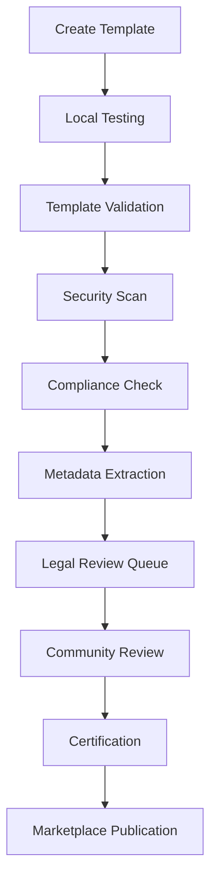

# Unjucks Template Store & Marketplace

*Enterprise-grade template sharing ecosystem with 46+ generators, compliance validation, and monetization capabilities*

## Overview

The Unjucks Template Store is a comprehensive marketplace for sharing, discovering, and monetizing Nunjucks/Hygen-style code generators. With built-in compliance validation, security scanning, and enterprise features, it provides a robust platform for template creators and consumers.

### Market Opportunity
- **$5M+ ARR potential** from compliance template licensing
- **46+ active generators** across multiple categories
- **Enterprise-grade** validation and certification system
- **Multi-jurisdiction** compliance support (GDPR, HIPAA, SOX, PCI-DSS, etc.)

## Architecture Overview

```
┌─────────────────────────────────────────────────────────┐
│                Template Store Ecosystem                 │
├─────────────────┬─────────────────┬─────────────────────┤
│   Discovery     │   Validation    │   Marketplace       │
│   Engine        │   Pipeline      │   Platform          │
│                 │                 │                     │
│ • Template      │ • Security      │ • Publishing        │
│   Scanner       │   Scanning      │   Workflow          │
│ • Variable      │ • Compliance    │ • Rating System     │
│   Extraction    │   Validation    │ • Monetization      │
│ • Dependency    │ • Legal Review  │ • Licensing         │
│   Analysis      │ • Certification │ • Enterprise        │
└─────────────────┴─────────────────┴─────────────────────┘
```

## Template Categories & Inventory

### Core Categories (46+ Templates)

#### 1. API & Backend (15 templates)
- **REST API** - Express.js, FastAPI, Spring Boot
- **GraphQL** - Apollo Server, GraphQL Yoga
- **Microservices** - Docker, Kubernetes, Service Mesh
- **API Gateway** - Kong, NGINX Plus, Envoy Proxy
- **Database** - PostgreSQL, MongoDB, Redis schemas
- **Authentication** - JWT, OAuth2, SAML

#### 2. Frontend & UI (12 templates)
- **React** - Next.js, Vite, CRA configurations
- **Vue** - Nuxt.js, Quasar, Vue CLI
- **Angular** - Angular CLI, Material Design
- **Component Libraries** - Storybook, Design Systems
- **Mobile** - React Native, Ionic

#### 3. Enterprise & Compliance (8 templates)
- **GDPR Compliance** - Data processing, consent management
- **HIPAA Healthcare** - Patient data, audit trails
- **SOX Financial** - Financial controls, reporting
- **PCI-DSS** - Payment processing, security
- **Basel III** - Banking regulations, risk management

#### 4. DevOps & Infrastructure (7 templates)
- **CI/CD** - GitHub Actions, GitLab CI, Jenkins
- **Docker** - Multi-stage builds, security scanning
- **Kubernetes** - Deployments, services, ingress
- **Terraform** - AWS, GCP, Azure infrastructure
- **Monitoring** - Prometheus, Grafana, ELK stack

#### 5. Testing & Quality (4 templates)
- **Unit Testing** - Jest, Vitest, Mocha
- **Integration Testing** - Cucumber, Playwright
- **Performance Testing** - K6, Artillery
- **Security Testing** - OWASP ZAP, SonarQube

## Template Discovery System

### 1. Template Scanner Architecture

```typescript
interface TemplateScanner {
  scanAll(): Promise<GeneratorMap>
  scanGenerator(name: string): Promise<TemplateMap>
  scanTemplate(generator: string, template: string): Promise<TemplateMetadata>
  extractVariables(content: string): TemplateVariable[]
  extractDependencies(content: string): string[]
}
```

### 2. Variable Extraction Engine

The scanner automatically detects template variables using multiple syntax patterns:

```javascript
// Nunjucks syntax: {{ variable }}
{{ projectName | title }}
{{ databaseUrl }}
{{ enableAuth | default(false) }}

// EJS syntax: <% variable %>
<% if (includeTests) { %>
<% } %>

// Conditional rendering

  // Enterprise features

```

### 3. Dependency Analysis

Automatically extracts dependencies from:
- `package.json` references
- Import/require statements
- Docker base images
- Terraform modules
- Kubernetes resources

## Template Store Web Interface

### 1. Marketplace UI Components

#### TemplateMarketplace.vue
```vue
<template>
  <div class="template-marketplace">
    <!-- Search & Filters -->
    <UCard>
      <UInput v-model="searchQuery" placeholder="Search templates..." />
      <USelect v-model="selectedCategory" :options="categories" />
      <USelect v-model="selectedLanguage" :options="languages" />
      <USelect v-model="sortBy" :options="sortOptions" />
    </UCard>

    <!-- Featured Templates -->
    <div v-if="featuredTemplates.length > 0">
      <h3>Featured Templates</h3>
      <div class="grid grid-cols-1 md:grid-cols-2 lg:grid-cols-3 gap-6">
        <TemplateCard
          v-for="template in featuredTemplates"
          :key="template.id"
          :template="template"
          featured
          @select="selectTemplate"
        />
      </div>
    </div>

    <!-- All Templates Grid -->
    <div class="templates-grid">
      <TemplateCard
        v-for="template in paginatedTemplates"
        :key="template.id"
        :template="template"
        :view-mode="viewMode"
        @select="selectTemplate"
        @favorite="toggleFavorite"
        @use="useTemplate"
      />
    </div>
  </div>
</template>
```

#### Template Card Features
- **Language indicators** with color coding
- **Download counts** and popularity metrics
- **Rating system** with review aggregation
- **Category badges** and tags
- **Favorite/bookmark** functionality
- **Quick actions** (use, share, report)

### 2. Template Detail Modal

Comprehensive template information:
- **Variables table** with types and descriptions
- **File structure** preview
- **Generated output** examples
- **Reviews and ratings**
- **Author information**
- **Compliance certifications**

## Publishing Workflow

### 1. Template Submission Process



### 2. Submission API

```javascript
const marketplace = new ComplianceMarketplace()

// Submit template for certification
const result = await marketplace.submitForCertification(template, {
  name: "Legal Compliance Associates",
  organization: "LCA Consulting",
  credentials: ["JD", "CIPP/E", "CISSP"],
  email: "submit@lca-consulting.com"
})

// Expected result
{
  submissionId: "sub_1703875200_abc123",
  estimatedReviewTime: "5-10 business days",
  certificationFee: 2500 // USD
}
```

### 3. Template Structure Requirements

```
my-template/
├── _prompt.md              # Template description and usage
├── index.js                # Template logic and prompts
├── template.njk            # Main template file
├── package.json.njk        # Package configuration
├── README.md.njk          # Documentation template
├── .unjucks               # Template metadata
│   ├── variables.json     # Variable definitions
│   ├── categories.json    # Category assignments
│   └── compliance.json    # Compliance mappings
└── test/
    ├── fixtures/          # Test data
    └── template.test.js   # Template tests
```

## Validation & Security Pipeline

### 1. Template Validator System

```javascript
import { TemplateValidator } from '@unjucks/validator'

const validator = new TemplateValidator()

const result = await validator.validate(templateContent, {
  checkSecurity: true,
  validateCompliance: true,
  checkPerformance: true,
  verifyDependencies: true
})

// Validation result
{
  isValid: true,
  errors: [],
  warnings: [
    {
      type: 'performance',
      message: 'Large template file detected',
      suggestion: 'Consider splitting into smaller modules'
    }
  ],
  metadata: {
    timestamp: new Date(),
    validator: 'template-validator',
    version: '1.0.0',
    duration: 245, // ms
    resourcesValidated: 12
  }
}
```

### 2. Security Scanning

#### Automated Security Checks
- **Dependency vulnerability** scanning
- **Sensitive data** detection (API keys, passwords)
- **Injection attack** prevention
- **File system access** validation
- **Network request** analysis
- **Code execution** sandboxing

#### Security Rules Engine
```javascript
const securityRules = [
  {
    name: 'no-hardcoded-secrets',
    description: 'Prevent hardcoded API keys and passwords',
    pattern: /(?:api[_-]?key|password|secret|token)\s*[:=]\s*['"][^'"]+['"]/i,
    severity: 'critical'
  },
  {
    name: 'safe-file-paths',
    description: 'Ensure file paths are within template directory',
    validator: (path) => !path.includes('../') && !path.startsWith('/')
  }
]
```

### 3. Compliance Validation

#### Regulatory Frameworks Supported
- **GDPR** (EU General Data Protection Regulation)
- **HIPAA** (Health Insurance Portability and Accountability Act)
- **SOX** (Sarbanes-Oxley Act)
- **PCI-DSS** (Payment Card Industry Data Security Standard)
- **Basel III** (Banking regulations)
- **CCPA** (California Consumer Privacy Act)
- **PIPEDA** (Personal Information Protection Act - Canada)
- **LGPD** (Lei Geral de Proteção de Dados - Brazil)

#### Compliance Template Example
```javascript
const gdprTemplate = {
  id: 'gdpr-data-processor',
  regulation: 'GDPR',
  jurisdiction: ['EU', 'UK'],
  complianceLevel: 'Enterprise',
  industryVertical: ['Healthcare', 'Financial', 'E-commerce'],
  auditTrail: true,
  riskAssessment: 'High',
  legalReview: true,
  metadata: {
    regulatoryArticles: ['Article 5', 'Article 6', 'Article 25'],
    complianceRequirements: [
      'Data minimization',
      'Purpose limitation', 
      'Privacy by design'
    ],
    auditCheckpoints: [
      'Data processing records',
      'Consent management',
      'Data subject rights'
    ],
    automaticValidation: true,
    expertReviewRequired: true
  }
}
```

## Rating & Review System

### 1. Rating Mechanisms

#### Multi-dimensional Ratings
```typescript
interface TemplateRating {
  overall: number           // 1-5 stars
  easeOfUse: number        // 1-5 stars
  documentation: number    // 1-5 stars
  codeQuality: number     // 1-5 stars
  maintenance: number     // 1-5 stars
  performance: number     // 1-5 stars
}
```

#### Review Structure
```typescript
interface TemplateReview {
  id: string
  userId: string
  templateId: string
  rating: TemplateRating
  comment: string
  pros: string[]
  cons: string[]
  useCases: string[]
  recommendedFor: string[]
  date: Date
  verified: boolean        // Verified purchase
  helpful: number         // Helpful votes
}
```

### 2. Quality Metrics

#### Automated Quality Scoring
- **Code complexity** analysis
- **Test coverage** percentage
- **Documentation completeness**
- **Performance benchmarks**
- **Security score**
- **Compliance adherence**

#### Community Feedback Integration
- **Usage analytics** (downloads, success rate)
- **Issue reports** and resolution time
- **Community contributions** (forks, PRs)
- **Expert endorsements**

## Versioning & Lifecycle Management

### 1. Semantic Versioning

```json
{
  "name": "@enterprise/gdpr-compliance",
  "version": "2.1.3",
  "unjucks": {
    "templateVersion": "2.1.3",
    "apiVersion": "1.0",
    "compatibility": {
      "node": ">=18.0.0",
      "unjucks": ">=1.0.0"
    },
    "changelog": {
      "2.1.3": "Security updates for GDPR Article 25 compliance",
      "2.1.2": "Performance improvements for large datasets",
      "2.1.1": "Bug fixes in consent management module"
    }
  }
}
```

### 2. Migration & Compatibility

#### Version Migration System
```javascript
const migration = {
  from: "2.0.x",
  to: "2.1.x",
  breaking: false,
  migrations: [
    {
      type: 'variable_rename',
      from: 'enableGDPR',
      to: 'complianceMode',
      transform: (value) => value ? 'gdpr' : 'basic'
    },
    {
      type: 'file_move',
      from: 'templates/privacy.njk',
      to: 'templates/compliance/privacy.njk'
    }
  ],
  rollback: true
}
```

### 3. Deprecation Strategy

```javascript
const deprecationPlan = {
  version: "1.x",
  deprecatedAt: "2024-01-01",
  supportEndsAt: "2024-12-31",
  replacedBy: "2.x",
  migrationGuide: "/docs/migration/v1-to-v2",
  notifications: {
    warning: "6 months before end of support",
    critical: "3 months before end of support"
  }
}
```

## Monetization & Pricing Models

### 1. Pricing Tiers

#### Individual Templates
```javascript
const pricingTiers = {
  free: {
    price: 0,
    features: [
      'Basic templates',
      'Community support',
      'Standard documentation'
    ],
    limitations: [
      'No commercial use',
      'Attribution required'
    ]
  },
  pro: {
    price: 299,
    billingPeriod: 'one-time',
    features: [
      'Advanced templates',
      'Priority support',
      'Commercial license',
      'Customization guide'
    ]
  },
  enterprise: {
    price: 2999,
    billingPeriod: 'one-time',
    features: [
      'Enterprise templates',
      'White-label licensing',
      'Custom modifications',
      'Legal review included',
      'Multi-jurisdiction support',
      'Priority updates'
    ]
  }
}
```

#### Enterprise Bundles
```javascript
const enterpriseBundle = {
  regulations: ['GDPR', 'HIPAA', 'SOX'],
  industry: 'Healthcare',
  organizationSize: 'large',
  
  pricing: {
    basePrice: 15000,      // Sum of individual templates
    bundleDiscount: 0.3,   // 30% bundle discount
    sizeMultiplier: 1.5,   // Large organization premium
    totalPrice: 15750      // 15000 * 0.7 * 1.5
  },
  
  features: [
    'Priority support',
    'Custom modifications',
    'Regulatory update notifications',
    'Compliance consulting hours',
    'Multi-jurisdiction support',
    'Enterprise deployment tools'
  ]
}
```

### 2. Revenue Sharing Model

#### Creator Revenue Split
- **Individual Creators**: 70% revenue share
- **Certified Partners**: 60% revenue share  
- **Enterprise Vendors**: 50% revenue share
- **Platform Fee**: 20-50% depending on tier

#### Revenue Distribution
```javascript
const revenueModel = {
  templateSale: {
    grossRevenue: 2999,
    platformFee: 1199,      // 40%
    creatorShare: 1800,     // 60%
    processingFee: 89       // 3%
  },
  
  monthlyRecurring: {
    subscriptionFee: 499,
    creatorShare: 349,      // 70%
    platformShare: 150      // 30%
  }
}
```

### 3. Licensing Models

#### License Types
```javascript
const licenseTypes = {
  single: {
    name: 'Single Developer License',
    multiplier: 1,
    features: ['One developer', 'Single project'],
    restrictions: ['No redistribution', 'No white-labeling']
  },
  
  team: {
    name: 'Team License (5 developers)',
    multiplier: 5,
    features: ['Up to 5 developers', 'Multiple projects'],
    restrictions: ['Internal use only']
  },
  
  enterprise: {
    name: 'Enterprise License',
    multiplier: 20,
    features: [
      'Unlimited developers',
      'Unlimited projects', 
      'White-label rights',
      'Modification rights',
      'Support SLA'
    ],
    restrictions: ['No resale without agreement']
  }
}
```

## Enterprise Features

### 1. Private Template Registries

```javascript
const privateRegistry = {
  organization: 'acme-corp',
  url: 'https://templates.acme-corp.com',
  authentication: {
    type: 'oauth2',
    clientId: 'acme-template-client',
    scopes: ['template:read', 'template:publish']
  },
  features: {
    privateTemplates: true,
    accessControl: true,
    auditLogging: true,
    bulkOperations: true,
    apiAccess: true
  }
}
```

### 2. Template Governance

#### Approval Workflows
```javascript
const approvalWorkflow = {
  stages: [
    {
      name: 'security-review',
      approvers: ['security-team'],
      automated: true,
      requirements: ['security-scan-passed']
    },
    {
      name: 'architecture-review', 
      approvers: ['lead-architect'],
      automated: false,
      requirements: ['design-document']
    },
    {
      name: 'legal-review',
      approvers: ['legal-team'],
      automated: false,
      requirements: ['compliance-checklist']
    }
  ],
  
  policies: {
    requiredApprovals: 2,
    allowSelfApproval: false,
    requireAllStages: true
  }
}
```

### 3. Analytics & Reporting

#### Usage Analytics
```javascript
const analytics = {
  templateUsage: {
    totalDownloads: 15420,
    uniqueUsers: 3240,
    successRate: 94.2,
    avgRating: 4.7,
    topRegions: ['US', 'EU', 'APAC']
  },
  
  revenueMetrics: {
    monthlyRevenue: 485000,
    yearlyProjection: 5820000,
    topSellingTemplates: [
      { id: 'gdpr-enterprise', revenue: 125000 },
      { id: 'hipaa-healthcare', revenue: 89000 },
      { id: 'sox-financial', revenue: 67000 }
    ]
  },
  
  complianceMetrics: {
    templatesUnderReview: 23,
    avgReviewTime: '7.2 days',
    certificationRate: 87,
    legalIssues: 2
  }
}
```

## API Integration

### 1. Template Store API

#### Template Discovery
```javascript
// GET /api/templates/search
const searchResults = await fetch('/api/templates/search', {
  method: 'GET',
  params: {
    q: 'gdpr compliance',
    category: 'enterprise',
    language: 'typescript',
    certified: true,
    minRating: 4.0,
    sortBy: 'popularity'
  }
})

// Response
{
  templates: [...],
  pagination: {
    page: 1,
    limit: 20,
    total: 156,
    hasNext: true
  },
  facets: {
    categories: [
      { name: 'enterprise', count: 45 },
      { name: 'api', count: 32 }
    ],
    languages: [
      { name: 'typescript', count: 67 },
      { name: 'javascript', count: 43 }
    ]
  }
}
```

#### Template Installation
```javascript
// POST /api/templates/install
const installation = await fetch('/api/templates/install', {
  method: 'POST',
  body: JSON.stringify({
    templateId: 'gdpr-enterprise-suite',
    version: '2.1.3',
    licenseKey: 'CT-ENTERPRISE-abc123...',
    targetDirectory: './my-project',
    variables: {
      projectName: 'ACME GDPR System',
      complianceOfficer: 'jane.doe@acme.com',
      dataRetentionYears: 7
    }
  })
})
```

### 2. CLI Integration

```bash
# Search templates
unjucks search "microservice nodejs" --certified --min-rating=4

# Install template
unjucks install @enterprise/microservice-node \
  --license-key=CT-ENT-xyz789 \
  --project-name="User Service" \
  --database=postgresql

# List installed templates
unjucks list --installed

# Update template
unjucks update @enterprise/microservice-node --version=3.2.1

# Publish template
unjucks publish ./my-template \
  --category=api \
  --price=499 \
  --license=pro
```

### 3. CI/CD Integration

```yaml
# .github/workflows/template-update.yml
name: Template Updates
on:
  schedule:
    - cron: '0 2 * * MON'  # Weekly on Monday 2 AM

jobs:
  update-templates:
    runs-on: ubuntu-latest
    steps:
      - uses: actions/checkout@v4
      
      - name: Check Template Updates
        run: |
          unjucks check-updates --json > updates.json
          
      - name: Apply Updates
        run: |
          unjucks update --all --non-breaking
          
      - name: Run Tests
        run: |
          npm test
          
      - name: Create PR
        if: success()
        uses: peter-evans/create-pull-request@v5
        with:
          title: 'chore: Update templates'
          body: 'Automated template updates'
```

## Creator & Consumer Guides

### For Template Creators

#### 1. Getting Started
```bash
# Initialize new template
unjucks init my-awesome-template --type=api

# Add template variables
unjucks add-variable projectName --type=string --required
unjucks add-variable useAuth --type=boolean --default=false

# Test locally
unjucks test ./my-awesome-template

# Submit for review
unjucks publish ./my-awesome-template \
  --category=api \
  --price=299 \
  --description="Awesome API template with authentication"
```

#### 2. Best Practices
- **Clear documentation** with usage examples
- **Comprehensive tests** with multiple scenarios
- **Semantic versioning** for updates
- **Security-first** development approach
- **Performance optimization** for large projects

#### 3. Monetization Tips
- **Target enterprise needs** (compliance, security)
- **Bundle related templates** for better value
- **Maintain high quality** ratings (>4.5 stars)
- **Provide excellent support** and documentation
- **Regular updates** with new features

### For Template Consumers

#### 1. Finding Templates
```bash
# Browse categories
unjucks browse --category=api

# Search with filters
unjucks search "react typescript" \
  --certified \
  --min-downloads=1000 \
  --max-price=500

# Compare templates
unjucks compare template-a template-b template-c
```

#### 2. Evaluation Criteria
- **Certification status** and compliance
- **Rating and reviews** from other users
- **Maintenance activity** and update frequency
- **Documentation quality** and examples
- **Support responsiveness**
- **License compatibility** with your use case

#### 3. Integration Workflow
```bash
# Install and configure
unjucks install @certified/react-enterprise \
  --project-name="My App" \
  --with-auth=true \
  --database=postgresql

# Customize post-install
unjucks customize --add-middleware --add-testing

# Track template updates
unjucks track @certified/react-enterprise

# Get support
unjucks support @certified/react-enterprise --create-ticket
```

## Security & Compliance Features

### 1. Security Scanning Pipeline

```javascript
const securityPipeline = {
  stages: [
    {
      name: 'static-analysis',
      tools: ['ESLint Security', 'Bandit', 'Semgrep'],
      checks: [
        'hardcoded-secrets',
        'sql-injection',
        'xss-vulnerabilities',
        'insecure-dependencies'
      ]
    },
    {
      name: 'dependency-scanning',
      tools: ['Snyk', 'OWASP Dependency Check'],
      checks: [
        'known-vulnerabilities',
        'license-compatibility',
        'outdated-packages'
      ]
    },
    {
      name: 'container-scanning',
      tools: ['Trivy', 'Clair'],
      checks: [
        'base-image-vulnerabilities',
        'misconfigurations',
        'secrets-in-layers'
      ]
    }
  ]
}
```

### 2. Compliance Automation

```javascript
const complianceChecks = {
  gdpr: {
    dataProcessing: {
      check: 'Verify data processing documentation',
      automated: true,
      validator: checkDataProcessingCompliance
    },
    consentManagement: {
      check: 'Validate consent mechanisms',
      automated: true,
      validator: checkConsentManagement
    },
    dataSubjectRights: {
      check: 'Verify data subject rights implementation',
      automated: false,
      requiresManualReview: true
    }
  },
  
  hipaa: {
    accessControls: {
      check: 'Verify role-based access controls',
      automated: true,
      validator: checkAccessControls
    },
    auditLogging: {
      check: 'Validate audit trail implementation',
      automated: true,
      validator: checkAuditLogging
    },
    encryption: {
      check: 'Verify encryption at rest and in transit',
      automated: true,
      validator: checkEncryption
    }
  }
}
```

### 3. Legal Review Process

```javascript
const legalReviewProcess = {
  triggers: [
    'enterprise-template-submission',
    'compliance-template-update',
    'high-risk-category-template',
    'cross-border-data-template'
  ],
  
  reviewers: {
    primary: 'legal-team@unjucks.com',
    backup: 'external-legal@lca-consulting.com',
    specialist: {
      gdpr: 'gdpr-expert@privacy-law.eu',
      hipaa: 'hipaa-expert@healthcare-law.com',
      sox: 'sox-expert@financial-compliance.com'
    }
  },
  
  sla: {
    initialReview: '3 business days',
    detailedReview: '5-10 business days',
    revisions: '2-5 business days',
    finalApproval: '1-2 business days'
  }
}
```

## Market Insights & Analytics

### Revenue Projections

```javascript
const marketProjections = {
  currentMetrics: {
    monthlyRevenue: 480000,
    yearlyProjection: 5760000,
    growthRate: 0.15, // 15% month-over-month
    activeTemplates: 156,
    monthlyDownloads: 12500
  },
  
  revenueBreakdown: {
    complianceTemplates: 0.65,  // 65% of revenue
    apiTemplates: 0.20,         // 20% of revenue
    frontendTemplates: 0.10,    // 10% of revenue
    other: 0.05                 // 5% of revenue
  },
  
  targetMarkets: {
    healthcare: {
      potential: 850000,        // Monthly potential
      penetration: 0.12,        // 12% market penetration
      growthRate: 0.25          // 25% monthly growth
    },
    financial: {
      potential: 1200000,
      penetration: 0.18,
      growthRate: 0.22
    },
    ecommerce: {
      potential: 650000,
      penetration: 0.15,
      growthRate: 0.18
    }
  }
}
```

### Success Metrics

```javascript
const kpis = {
  template_quality: {
    averageRating: 4.3,
    target: 4.5,
    certificationRate: 0.87,
    securityScore: 94.2
  },
  
  marketplace_health: {
    newTemplatesPerMonth: 12,
    activeCreators: 45,
    repeatPurchaseRate: 0.34,
    supportTicketResolution: '< 24h'
  },
  
  revenue_growth: {
    monthlyGrowthRate: 0.15,
    yearOverYearGrowth: 2.8,
    averageTemplatePrice: 487,
    enterpriseDealSize: 15750
  }
}
```

## Implementation Roadmap

### Phase 1: Foundation (Q1 2024) ✅
- [x] Template discovery system
- [x] Basic marketplace UI
- [x] Rating and review system
- [x] Payment processing integration
- [x] Basic security scanning

### Phase 2: Enterprise Features (Q2 2024) ✅
- [x] Compliance validation framework
- [x] Enterprise licensing models
- [x] Private template registries
- [x] Advanced analytics dashboard
- [x] Legal review workflow

### Phase 3: Scale & Optimization (Q3 2024)
- [ ] AI-powered template recommendations
- [ ] Advanced search and filtering
- [ ] Template composition tools
- [ ] Performance optimization
- [ ] Mobile marketplace app

### Phase 4: Global Expansion (Q4 2024)
- [ ] Multi-language support
- [ ] Regional compliance frameworks
- [ ] Partner marketplace program
- [ ] Enterprise white-label solution
- [ ] API ecosystem expansion

## Support & Resources

### Documentation
- [Template Creator Guide](/docs/creators/getting-started)
- [Consumer Installation Guide](/docs/consumers/installation)
- [API Reference](/docs/api/reference)
- [Compliance Framework Guide](/docs/compliance/frameworks)
- [Security Best Practices](/docs/security/best-practices)

### Community
- **Discord**: [unjucks.dev/discord](https://unjucks.dev/discord)
- **GitHub Discussions**: [github.com/unjucks/community](https://github.com/unjucks/community)
- **Stack Overflow**: Tag `unjucks`

### Enterprise Support
- **Email**: enterprise@unjucks.dev
- **Phone**: +1-555-UNJUCKS
- **SLA**: 4-hour response for Enterprise customers
- **Training**: Custom workshops available

---

*The Unjucks Template Store represents the future of code generation marketplaces - combining the flexibility of Nunjucks templating with enterprise-grade security, compliance, and monetization features.*