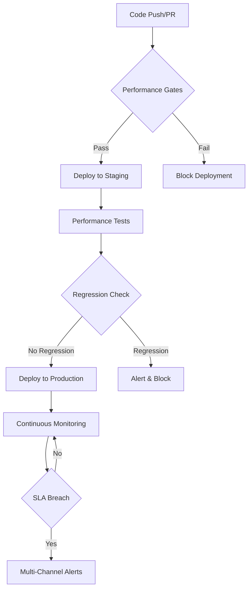
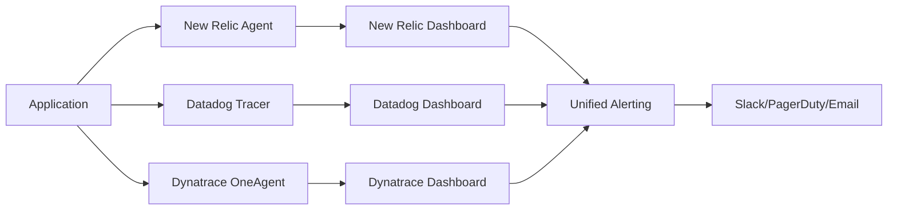

# 📊 Performance Monitoring Architecture

## Overview

This document outlines the comprehensive performance monitoring and alerting system implemented for the Unjucks project. The architecture provides enterprise-grade monitoring with automated regression detection, load testing, APM integration, and deployment gates.

## Architecture Components

### 🎯 Core Workflows

#### 1. Performance Monitoring (`performance-monitoring.yml`)
- **Purpose**: Continuous performance regression detection
- **Frequency**: Hourly monitoring, daily comprehensive benchmarks
- **Features**:
  - k6-based baseline performance measurement
  - Automated regression detection (>20% degradation)
  - Performance dashboard generation
  - Artifact retention for historical analysis
  - GitHub Pages deployment for dashboards

#### 2. Load Testing Suite (`load-testing.yml`)
- **Purpose**: Multi-tool comprehensive load testing
- **Tools**:
  - **k6**: Developer-friendly scripting with CI/CD integration
  - **Artillery**: Quick stress testing with JSON configuration  
  - **JMeter**: Enterprise features for complex scenarios
- **Test Types**:
  - Load testing (gradual ramp-up)
  - Stress testing (find breaking point)
  - Spike testing (sudden traffic increases)
  - Endurance testing (long duration stability)

#### 3. APM Integration (`apm-integration.yml`)
- **Purpose**: Enterprise APM tool integration
- **Providers**:
  - **New Relic**: Distributed tracing, browser monitoring, AI monitoring
  - **Datadog**: APM, profiling, runtime metrics, log injection
  - **Dynatrace**: OneAgent SDK, custom attributes, problem detection
- **Features**:
  - Synthetic monitoring setup
  - Custom dashboards creation
  - Alert policy configuration
  - Automated monitor deployment

#### 4. Performance Alerting (`performance-alerting.yml`)
- **Purpose**: Real-time performance degradation alerts
- **Channels**:
  - **Slack**: Rich formatted alerts with action buttons
  - **PagerDuty**: Critical incident escalation
  - **Email**: HTML formatted notifications with metrics
- **Automation**:
  - GitHub issue creation for critical alerts
  - Diagnostic data collection
  - Automated incident response workflows

#### 5. Performance Gates (`performance-gates.yml`)
- **Purpose**: Deployment blocking based on performance SLA
- **Gate Types**:
  - Response time thresholds
  - Error rate limits
  - Throughput requirements
  - Availability SLA compliance
- **Modes**:
  - Standard mode (production-ready thresholds)
  - Strict mode (enterprise-grade thresholds)

## Performance Thresholds

### Standard Mode
| Metric | Threshold | Purpose |
|--------|-----------|---------|
| P95 Response Time | < 300ms | User experience |
| Error Rate | < 1% | Reliability |
| Throughput | > 500 RPS | Capacity |
| Availability | > 99.9% | SLA compliance |

### Strict Mode (Enterprise)
| Metric | Threshold | Purpose |
|--------|-----------|---------|
| P95 Response Time | < 200ms | Premium experience |
| Error Rate | < 0.5% | High reliability |
| Throughput | > 800 RPS | High capacity |
| Availability | > 99.95% | Enterprise SLA |

## Integration Architecture

### GitHub Actions Workflow


### APM Integration Flow


## Monitoring Capabilities

### Real-time Metrics
- Response time percentiles (P50, P95, P99)
- Request rate and throughput
- Error rate and success ratio
- Resource utilization (CPU, Memory)
- Custom business metrics

### Historical Analysis
- Performance trend analysis
- Baseline comparison over time
- Regression detection algorithms
- Capacity planning insights
- Performance regression reports

### Alerting Features
- Multi-threshold alerting (warning, critical, emergency)
- Smart alert deduplication
- Escalation policies
- Automated incident creation
- Rich notification formatting

## Security Considerations

### Secret Management
- All sensitive data stored in GitHub Secrets
- No hardcoded credentials in workflows
- Secure API token handling
- Environment-specific configurations

### Webhook Security
- HTTPS-only webhook endpoints
- Token-based authentication
- Request validation and sanitization
- Rate limiting considerations

## Deployment Strategy

### Environment Progression
1. **Development**: Basic monitoring, relaxed thresholds
2. **Staging**: Full monitoring suite, production-like thresholds
3. **Production**: Strict monitoring, enterprise SLA enforcement

### Rollout Phases
1. **Phase 1**: Performance gates on staging
2. **Phase 2**: APM integration and dashboards
3. **Phase 3**: Full alerting and incident response
4. **Phase 4**: Production performance gates

## Validation & Testing

### Workflow Validation
- YAML syntax validation
- GitHub Actions compatibility
- act (local runner) testing
- Security scan for hardcoded secrets

### Performance Testing
- Load testing with multiple tools
- Baseline establishment
- Regression detection accuracy
- Alert system validation

## Configuration

### Environment Variables
```bash
# Performance Thresholds
MAX_RESPONSE_TIME_MS=300
MAX_ERROR_RATE_PERCENT=1.0
MIN_THROUGHPUT_RPS=500
MIN_AVAILABILITY_PERCENT=99.9

# APM Configuration
NEW_RELIC_APP_NAME="Unjucks-${ENVIRONMENT}"
DATADOG_SERVICE_NAME="unjucks"
DYNATRACE_ENVIRONMENT_ID="${DT_ENV_ID}"
```

### Required Secrets
```bash
# Alerting
SLACK_WEBHOOK_URL
PAGERDUTY_API_TOKEN
SMTP_SERVER
ALERT_EMAIL_LIST

# APM Providers
NEW_RELIC_LICENSE_KEY
NEW_RELIC_API_KEY
DATADOG_API_KEY
DATADOG_APP_KEY
DYNATRACE_API_TOKEN

# GitHub
GITHUB_TOKEN (auto-provided)
```

## Benefits

### Development Team
- Early performance regression detection
- Automated quality gates
- Comprehensive performance insights
- Reduced manual monitoring overhead

### Operations Team
- Proactive alerting and incident response
- Multi-channel notification system
- Automated diagnostic data collection
- Historical performance analytics

### Business Value
- Improved user experience through performance SLA
- Reduced downtime and faster incident resolution
- Data-driven capacity planning
- Cost optimization through efficient resource usage

## Future Enhancements

### Planned Features
- Machine learning-based anomaly detection
- Predictive scaling recommendations
- Cross-service dependency monitoring
- Mobile performance monitoring
- Cost-per-request analytics

### Integration Roadmap
- Kubernetes performance monitoring
- Serverless function monitoring
- Database performance correlation
- CDN performance tracking
- Third-party service monitoring

## Maintenance

### Regular Tasks
- Review and update performance thresholds
- Validate alert channel configurations
- Update APM agent versions
- Performance baseline recalibration
- Dashboard and report optimization

### Monitoring Health
- Alert system health checks
- Workflow execution monitoring
- APM agent connectivity validation
- Performance test result validation
- Historical data retention management

---

**Last Updated**: September 2025  
**Version**: 1.0.0  
**Owner**: Performance Engineering Team