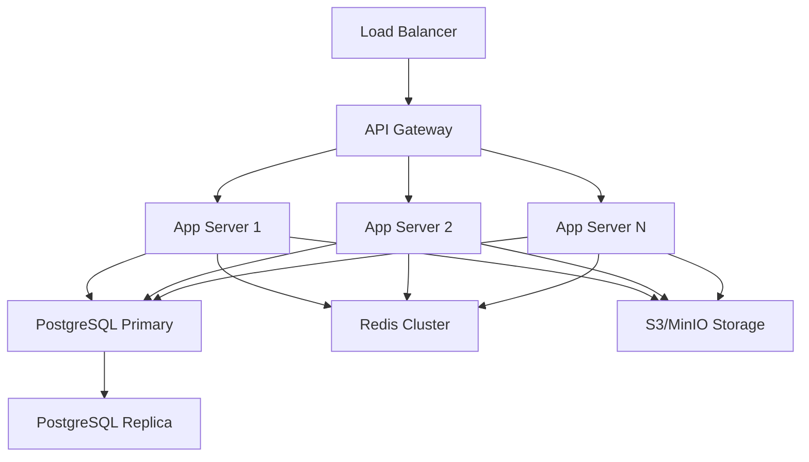

# Operational Runbooks - Unjucks Enterprise Platform

## Table of Contents

1. [System Overview](#system-overview)
2. [Daily Operations](#daily-operations)
3. [Incident Response](#incident-response)
4. [Maintenance Procedures](#maintenance-procedures)
5. [Monitoring & Alerting](#monitoring--alerting)
6. [Troubleshooting Guide](#troubleshooting-guide)
7. [Emergency Procedures](#emergency-procedures)
8. [Contact Information](#contact-information)

---

## System Overview

### Architecture Components

- **API Gateway**: Load balancer and rate limiting (HAProxy/NGINX)
- **Application Servers**: Node.js instances (PM2 managed)
- **Database**: PostgreSQL primary/replica setup
- **Cache Layer**: Redis cluster
- **File Storage**: AWS S3/MinIO for templates
- **Monitoring**: Prometheus + Grafana + AlertManager
- **Logging**: ELK Stack (Elasticsearch, Logstash, Kibana)
- **Security**: SAML/OAuth2 providers, LDAP integration

### Service Dependencies



### Critical Metrics Dashboard

- **Response Time**: < 200ms (95th percentile)
- **Error Rate**: < 0.1%
- **Uptime**: > 99.9%
- **Database Connections**: < 80% of max pool
- **Memory Usage**: < 85% per instance
- **CPU Usage**: < 70% per instance

---

## Daily Operations

### Morning Health Check (09:00 UTC)

**Checklist:**

- [ ] Review overnight alerts in AlertManager
- [ ] Check system metrics in Grafana dashboard
- [ ] Verify backup completion status
- [ ] Review application logs for errors
- [ ] Test critical API endpoints
- [ ] Check SSL certificate expiration (30-day warning)
- [ ] Verify template generation functionality

**Commands:**

```bash
# Check system health
curl -f https://api.unjucks.dev/health || echo "ALERT: Health check failed"

# Verify database connectivity
psql -h db-primary -U monitor -c "SELECT 1" > /dev/null || echo "ALERT: Database unreachable"

# Check Redis cluster status
redis-cli -c cluster info | grep cluster_state:ok || echo "ALERT: Redis cluster unhealthy"

# Review error logs
tail -100 /var/log/unjucks/error.log | grep -i "fatal\|error" | wc -l
```

### Performance Monitoring

**Hourly Checks:**

1. **Response Time Monitoring**
   ```bash
   # Check API response times
   curl -w "@curl-format.txt" -s -o /dev/null https://api.unjucks.dev/templates
   ```

2. **Database Performance**
   ```sql
   -- Check slow queries
   SELECT query, mean_time, calls 
   FROM pg_stat_statements 
   WHERE mean_time > 1000 
   ORDER BY mean_time DESC LIMIT 10;
   ```

3. **Cache Hit Rates**
   ```bash
   # Redis cache hit rate
   redis-cli info stats | grep keyspace_hits
   ```

### Template System Checks

**Template Health Verification:**

```bash
#!/bin/bash
# Template system health check script

echo "=== Template System Health Check ==="

# Test template listing
echo "Testing template listing..."
unjucks list > /dev/null && echo "✅ Template listing: OK" || echo "❌ Template listing: FAILED"

# Test generation with sample template
echo "Testing template generation..."
cd /tmp && unjucks generate test-template --name "HealthCheck" --dry-run > /dev/null
if [ $? -eq 0 ]; then
    echo "✅ Template generation: OK"
else
    echo "❌ Template generation: FAILED"
fi

# Test semantic web functionality
echo "Testing semantic web features..."
unjucks semantic generate --type vocabulary --namespace "http://test.example.com" --dry-run > /dev/null
if [ $? -eq 0 ]; then
    echo "✅ Semantic features: OK"
else
    echo "❌ Semantic features: FAILED"
fi

echo "=== Health Check Complete ==="
```

---

## Incident Response

### Severity Levels

| Severity | Description | Response Time | Escalation |
|----------|-------------|---------------|------------|
| **P0 - Critical** | Complete service outage | 15 minutes | Immediate page to on-call |
| **P1 - High** | Major functionality broken | 1 hour | Page if not acknowledged |
| **P2 - Medium** | Degraded performance | 4 hours | Business hours escalation |
| **P3 - Low** | Minor issues | 24 hours | Next business day |

### Critical Incident Response

#### Step 1: Initial Assessment (0-15 minutes)

1. **Acknowledge the alert** in PagerDuty/AlertManager
2. **Join incident bridge**: Slack #incidents channel
3. **Assess impact**: Check monitoring dashboards
4. **Communicate status**: Post initial update

```bash
# Quick system status check
kubectl get pods -n unjucks-prod
docker ps | grep unjucks
systemctl status unjucks-api
```

#### Step 2: Diagnosis (15-30 minutes)

1. **Check recent deployments**:
   ```bash
   git log --oneline -10 production
   kubectl rollout history deployment/unjucks-api -n unjucks-prod
   ```

2. **Review error logs**:
   ```bash
   # Application logs
   kubectl logs -f deployment/unjucks-api -n unjucks-prod --tail=100
   
   # System logs
   journalctl -u unjucks-api -n 100 --no-pager
   ```

3. **Database health**:
   ```sql
   -- Check active connections
   SELECT state, count(*) FROM pg_stat_activity GROUP BY state;
   
   -- Check for locks
   SELECT * FROM pg_locks WHERE NOT granted;
   ```

#### Step 3: Mitigation (30-60 minutes)

**Common Mitigation Strategies:**

1. **Service Restart**:
   ```bash
   # Kubernetes deployment
   kubectl rollout restart deployment/unjucks-api -n unjucks-prod
   
   # Docker container
   docker restart unjucks-api
   
   # Systemd service
   systemctl restart unjucks-api
   ```

2. **Rollback to Previous Version**:
   ```bash
   # Kubernetes rollback
   kubectl rollout undo deployment/unjucks-api -n unjucks-prod
   
   # Docker rollback
   docker stop unjucks-api
   docker run -d --name unjucks-api-rollback unjucks:previous-tag
   ```

3. **Scale Up Resources**:
   ```bash
   # Scale horizontally
   kubectl scale deployment/unjucks-api --replicas=6 -n unjucks-prod
   
   # Scale vertically (requires restart)
   kubectl patch deployment unjucks-api -p '{"spec":{"template":{"spec":{"containers":[{"name":"unjucks-api","resources":{"requests":{"memory":"2Gi","cpu":"1000m"}}}]}}}}' -n unjucks-prod
   ```

### Communication Templates

#### Initial Incident Report
```
🚨 INCIDENT: P{severity} - {brief_description}

Status: INVESTIGATING
Impact: {affected_services}
Start Time: {timestamp}
Next Update: {time + 30min}

Incident Commander: @{name}
Technical Lead: @{name}
```

#### Resolution Report
```
✅ RESOLVED: P{severity} - {brief_description}

Resolution: {solution_summary}
Duration: {total_time}
Root Cause: {preliminary_cause}

Post-mortem: Will be posted within 24 hours
```

---

## Maintenance Procedures

### Scheduled Maintenance Windows

- **Weekly**: Sunday 02:00-04:00 UTC (Low traffic period)
- **Monthly**: First Sunday 01:00-05:00 UTC (Extended maintenance)
- **Emergency**: Any time with 2-hour notice if possible

### Pre-Maintenance Checklist

**24 Hours Before:**
- [ ] Send maintenance notification to users
- [ ] Verify backup systems are functional
- [ ] Prepare rollback procedures
- [ ] Test maintenance procedures in staging
- [ ] Update monitoring thresholds
- [ ] Coordinate with customer success team

**2 Hours Before:**
- [ ] Final backup verification
- [ ] Disable automated deployments
- [ ] Set up maintenance page
- [ ] Join maintenance bridge call
- [ ] Verify team availability

### Application Deployment

#### Blue-Green Deployment Process

```bash
#!/bin/bash
# Blue-Green deployment script

set -e

CURRENT_ENV="blue"
NEW_ENV="green"
NEW_VERSION="$1"

if [ -z "$NEW_VERSION" ]; then
    echo "Usage: $0 <version>"
    exit 1
fi

echo "Starting blue-green deployment to $NEW_VERSION"

# Step 1: Deploy to green environment
echo "Deploying to $NEW_ENV environment..."
kubectl set image deployment/unjucks-api-$NEW_ENV unjucks-api=unjucks:$NEW_VERSION -n unjucks-prod
kubectl rollout status deployment/unjucks-api-$NEW_ENV -n unjucks-prod --timeout=300s

# Step 2: Health check new environment
echo "Running health checks on $NEW_ENV..."
for i in {1..30}; do
    if kubectl exec deployment/unjucks-api-$NEW_ENV -n unjucks-prod -- curl -f http://localhost:3000/health; then
        echo "Health check passed"
        break
    fi
    echo "Health check attempt $i failed, retrying..."
    sleep 10
done

# Step 3: Run smoke tests
echo "Running smoke tests..."
./scripts/smoke-tests.sh $NEW_ENV

# Step 4: Switch traffic
echo "Switching traffic to $NEW_ENV..."
kubectl patch service unjucks-api -p '{"spec":{"selector":{"version":"'$NEW_ENV'"}}}' -n unjucks-prod

# Step 5: Verify traffic switch
sleep 30
echo "Verifying traffic switch..."
curl -f https://api.unjucks.dev/health

echo "Deployment completed successfully"
echo "Previous environment ($CURRENT_ENV) is still running for quick rollback if needed"
```

#### Database Migrations

```bash
#!/bin/bash
# Database migration procedure

set -e

MIGRATION_VERSION="$1"
DRY_RUN="${2:-false}"

if [ -z "$MIGRATION_VERSION" ]; then
    echo "Usage: $0 <migration_version> [dry_run]"
    exit 1
fi

echo "Starting database migration to version $MIGRATION_VERSION"

# Step 1: Backup database
echo "Creating database backup..."
pg_dump -h $DB_HOST -U $DB_USER -d $DB_NAME | gzip > "/backups/migration-backup-$(date +%Y%m%d-%H%M%S).sql.gz"

# Step 2: Check migration status
echo "Checking current migration status..."
psql -h $DB_HOST -U $DB_USER -d $DB_NAME -c "SELECT version FROM schema_migrations ORDER BY version DESC LIMIT 1;"

# Step 3: Run migration
if [ "$DRY_RUN" = "true" ]; then
    echo "DRY RUN: Would run migration $MIGRATION_VERSION"
    npx knex migrate:list --env production
else
    echo "Running migration $MIGRATION_VERSION..."
    npx knex migrate:up --env production
    
    # Verify migration
    echo "Verifying migration..."
    npx knex migrate:currentVersion --env production
fi

echo "Migration completed successfully"
```

### System Updates

#### Security Updates

```bash
#!/bin/bash
# Security update procedure

echo "Starting security update process..."

# Update package lists
sudo apt update

# Check for security updates
sudo apt list --upgradable | grep -i security

# Apply security updates
sudo DEBIAN_FRONTEND=noninteractive apt-get -y upgrade

# Update Docker images
docker pull unjucks:latest
docker pull postgres:13
docker pull redis:6

# Restart services if required
if [ -f /var/run/reboot-required ]; then
    echo "System reboot required after updates"
    # Schedule reboot during maintenance window
fi

echo "Security updates completed"
```

---

## Monitoring & Alerting

### Key Performance Indicators (KPIs)

#### Application Metrics

| Metric | Threshold | Alert Level |
|--------|-----------|-------------|
| Response Time (95th percentile) | > 500ms | Warning |
| Response Time (95th percentile) | > 1000ms | Critical |
| Error Rate | > 1% | Warning |
| Error Rate | > 5% | Critical |
| Template Generation Success Rate | < 95% | Warning |
| Template Generation Success Rate | < 90% | Critical |

#### Infrastructure Metrics

| Metric | Threshold | Alert Level |
|--------|-----------|-------------|
| CPU Usage | > 80% | Warning |
| CPU Usage | > 90% | Critical |
| Memory Usage | > 85% | Warning |
| Memory Usage | > 95% | Critical |
| Disk Usage | > 80% | Warning |
| Disk Usage | > 90% | Critical |
| Database Connections | > 80% of pool | Warning |
| Database Connections | > 95% of pool | Critical |

### Prometheus Alert Rules

```yaml
# prometheus-alerts.yml
groups:
  - name: unjucks-api
    rules:
      - alert: HighResponseTime
        expr: histogram_quantile(0.95, rate(http_request_duration_seconds_bucket[5m])) > 0.5
        for: 2m
        labels:
          severity: warning
        annotations:
          summary: "High response time detected"
          description: "95th percentile response time is {{ $value }}s"
      
      - alert: HighErrorRate
        expr: rate(http_requests_total{status=~"5.."}[5m]) / rate(http_requests_total[5m]) > 0.01
        for: 1m
        labels:
          severity: critical
        annotations:
          summary: "High error rate detected"
          description: "Error rate is {{ $value | humanizePercentage }}"
      
      - alert: DatabaseConnectionsHigh
        expr: pg_stat_database_numbackends / pg_settings_max_connections > 0.8
        for: 5m
        labels:
          severity: warning
        annotations:
          summary: "Database connections high"
          description: "Database connections at {{ $value | humanizePercentage }} of maximum"
      
      - alert: TemplateGenerationFailure
        expr: rate(template_generation_failures_total[5m]) > 0.1
        for: 2m
        labels:
          severity: warning
        annotations:
          summary: "Template generation failures detected"
          description: "Template generation failure rate: {{ $value }}/second"
```

### Log Analysis Queries

#### Elasticsearch/Kibana Queries

```json
# High-frequency errors
{
  "query": {
    "bool": {
      "must": [
        {"range": {"@timestamp": {"gte": "now-1h"}}},
        {"term": {"level": "error"}}
      ]
    }
  },
  "aggs": {
    "error_types": {
      "terms": {
        "field": "message.keyword",
        "size": 10
      }
    }
  }
}
```

```json
# Performance analysis
{
  "query": {
    "bool": {
      "must": [
        {"range": {"@timestamp": {"gte": "now-24h"}}},
        {"exists": {"field": "response_time"}}
      ]
    }
  },
  "aggs": {
    "avg_response_time": {
      "avg": {"field": "response_time"}
    },
    "response_time_histogram": {
      "histogram": {
        "field": "response_time",
        "interval": 100
      }
    }
  }
}
```

---

## Troubleshooting Guide

### Common Issues

#### 1. High Response Times

**Symptoms:**
- API response times > 1 second
- Users reporting slow template generation
- Timeout errors in logs

**Investigation:**
```bash
# Check system resources
top -p $(pgrep node)
iostat -x 1 5

# Check database performance
psql -c "SELECT * FROM pg_stat_activity WHERE state = 'active';"

# Check for slow queries
psql -c "SELECT query, mean_time FROM pg_stat_statements ORDER BY mean_time DESC LIMIT 10;"
```

**Solutions:**
1. Scale horizontally: Add more application instances
2. Optimize database queries
3. Increase cache TTL for frequently accessed data
4. Review and optimize template complexity

#### 2. Template Generation Failures

**Symptoms:**
- Templates fail to generate
- "Template not found" errors
- Malformed output files

**Investigation:**
```bash
# Check template directory permissions
ls -la /opt/unjucks/templates/

# Test template syntax
unjucks validate template-name

# Check for missing dependencies
npm ls --depth=0
```

**Solutions:**
1. Verify template file integrity
2. Check variable validation rules
3. Ensure all required dependencies are installed
4. Validate Nunjucks template syntax

#### 3. Database Connection Issues

**Symptoms:**
- "Connection pool exhausted" errors
- Database timeouts
- Unable to connect to database

**Investigation:**
```bash
# Check database connectivity
psql -h $DB_HOST -U $DB_USER -c "SELECT 1;"

# Check connection pool status
psql -c "SELECT count(*) as active_connections FROM pg_stat_activity;"

# Check for long-running queries
psql -c "SELECT pid, now() - pg_stat_activity.query_start AS duration, query FROM pg_stat_activity WHERE state = 'active' ORDER BY duration DESC;"
```

**Solutions:**
1. Increase connection pool size
2. Kill long-running queries
3. Restart database if necessary
4. Implement connection pooling optimization

#### 4. Authentication/Authorization Issues

**Symptoms:**
- Users unable to login
- "Access denied" errors
- SAML/OAuth failures

**Investigation:**
```bash
# Check LDAP connectivity
ldapsearch -H $LDAP_URL -D $BIND_DN -w $BIND_PASSWORD -b $BASE_DN "(uid=testuser)"

# Test OAuth flow
curl -v "$OAUTH_PROVIDER/oauth/authorize?client_id=$CLIENT_ID&response_type=code&redirect_uri=$REDIRECT_URI"

# Check JWT token validity
node -e "console.log(require('jsonwebtoken').verify('$TOKEN', '$JWT_SECRET'))"
```

**Solutions:**
1. Verify identity provider configuration
2. Check certificate validity
3. Refresh OAuth client credentials
4. Verify user permissions in directory

### Performance Optimization

#### Database Optimization

```sql
-- Create indexes for frequently queried columns
CREATE INDEX CONCURRENTLY idx_templates_type_status ON templates(type, status);
CREATE INDEX CONCURRENTLY idx_generations_created_at ON template_generations(created_at);

-- Update table statistics
ANALYZE templates;
ANALYZE template_generations;

-- Check for unused indexes
SELECT indexrelname, idx_tup_read, idx_tup_fetch 
FROM pg_stat_user_indexes 
WHERE idx_tup_read = 0;
```

#### Application Optimization

```bash
# Enable Node.js performance monitoring
export NODE_OPTIONS="--inspect --max-old-space-size=4096"

# Profile memory usage
node --prof app.js
node --prof-process isolate-*.log > processed.txt

# Monitor event loop lag
node -e "setInterval(() => console.log('Event loop lag:', process.hrtime.bigint() - Date.now() * 1000000n), 1000)"
```

---

## Emergency Procedures

### Complete Service Outage

#### Step 1: Immediate Response (0-5 minutes)

1. **Activate incident bridge**
   - Join #emergency-response Slack channel
   - Dial into emergency conference bridge
   - Page all on-call engineers

2. **Initial status communication**
   ```
   🚨 CRITICAL OUTAGE: Unjucks platform unavailable
   Status: INVESTIGATING
   ETA for update: 15 minutes
   Incident Commander: [Name]
   ```

3. **Enable maintenance page**
   ```bash
   # Route traffic to maintenance page
   kubectl patch ingress unjucks-ingress -p '{"metadata":{"annotations":{"nginx.ingress.kubernetes.io/configuration-snippet":"return 503;"}}}'
   ```

#### Step 2: Rapid Diagnosis (5-15 minutes)

1. **Check infrastructure status**
   ```bash
   # Kubernetes cluster health
   kubectl get nodes
   kubectl get pods --all-namespaces | grep -v Running
   
   # Load balancer status
   curl -I https://api.unjucks.dev
   
   # Database connectivity
   pg_isready -h $DB_HOST -p $DB_PORT
   ```

2. **Review recent changes**
   ```bash
   # Check deployment history
   kubectl rollout history deployment/unjucks-api
   
   # Review recent commits
   git log --oneline -10 production
   
   # Check infrastructure changes
   terraform plan -detailed-exitcode
   ```

#### Step 3: Emergency Recovery (15-60 minutes)

1. **Rollback to last known good state**
   ```bash
   # Application rollback
   kubectl rollout undo deployment/unjucks-api
   
   # Database rollback (if needed)
   pg_restore -h $DB_HOST -U $DB_USER -d $DB_NAME /backups/latest-backup.sql
   ```

2. **Failover to secondary systems**
   ```bash
   # Activate disaster recovery site
   ./scripts/activate-dr-site.sh
   
   # Update DNS to point to DR
   aws route53 change-resource-record-sets --hosted-zone-id $ZONE_ID --change-batch file://failover-dns.json
   ```

### Data Loss Prevention

#### Database Backup Verification

```bash
#!/bin/bash
# Backup verification script

BACKUP_FILE="$1"
TEST_DB="unjucks_backup_test"

if [ -z "$BACKUP_FILE" ]; then
    echo "Usage: $0 <backup_file>"
    exit 1
fi

echo "Verifying backup file: $BACKUP_FILE"

# Create test database
psql -h $DB_HOST -U $DB_USER -c "CREATE DATABASE $TEST_DB;"

# Restore backup to test database
psql -h $DB_HOST -U $DB_USER -d $TEST_DB < $BACKUP_FILE

# Verify data integrity
ROW_COUNT=$(psql -h $DB_HOST -U $DB_USER -d $TEST_DB -t -c "SELECT COUNT(*) FROM templates;")
echo "Template count in backup: $ROW_COUNT"

# Cleanup test database
psql -h $DB_HOST -U $DB_USER -c "DROP DATABASE $TEST_DB;"

if [ $ROW_COUNT -gt 0 ]; then
    echo "✅ Backup verification successful"
else
    echo "❌ Backup verification failed"
    exit 1
fi
```

#### Point-in-Time Recovery

```bash
#!/bin/bash
# Point-in-time recovery procedure

RECOVERY_TIME="$1"
if [ -z "$RECOVERY_TIME" ]; then
    echo "Usage: $0 'YYYY-MM-DD HH:MM:SS'"
    exit 1
fi

echo "Starting point-in-time recovery to: $RECOVERY_TIME"

# Stop application to prevent writes
kubectl scale deployment/unjucks-api --replicas=0

# Create recovery.conf
cat > recovery.conf << EOF
restore_command = 'cp /wal_archive/%f %p'
recovery_target_time = '$RECOVERY_TIME'
recovery_target_action = 'promote'
EOF

# Restore from base backup
pg_basebackup -h $DB_HOST -D /var/lib/postgresql/data-recovery

# Copy recovery.conf
cp recovery.conf /var/lib/postgresql/data-recovery/

# Start PostgreSQL in recovery mode
sudo -u postgres pg_ctl start -D /var/lib/postgresql/data-recovery

echo "Point-in-time recovery initiated"
echo "Monitor PostgreSQL logs for recovery completion"
```

---

## Contact Information

### Escalation Matrix

| Role | Primary | Secondary | Phone | Slack |
|------|---------|-----------|-------|-------|
| **Incident Commander** | John Smith | Sarah Chen | +1-555-0101 | @john.smith |
| **Technical Lead** | Mike Johnson | Lisa Wang | +1-555-0102 | @mike.johnson |
| **Database Admin** | David Brown | Emma Davis | +1-555-0103 | @david.brown |
| **Security Lead** | Alex Wilson | Ryan Garcia | +1-555-0104 | @alex.wilson |
| **Product Manager** | Jennifer Lee | Mark Taylor | +1-555-0105 | @jennifer.lee |

### External Contacts

| Service | Contact | Phone | Email |
|---------|---------|-------|-------|
| **AWS Support** | Enterprise | +1-206-266-4064 | aws-support@company.com |
| **CloudFlare** | Business | +1-650-319-8930 | cf-support@company.com |
| **PagerDuty** | Premium | +1-844-700-6278 | support@pagerduty.com |
| **MongoDB Atlas** | Enterprise | +1-855-423-4691 | support@mongodb.com |

### Communication Channels

- **Primary**: Slack #incidents
- **Escalation**: Slack #emergency-response
- **Status Updates**: https://status.unjucks.dev
- **Internal Wiki**: https://wiki.internal.unjucks.dev/runbooks
- **Conference Bridge**: +1-555-BRIDGE (PIN: 1234)

### Documentation References

- **API Documentation**: https://docs.unjucks.dev/api
- **Architecture Diagrams**: https://diagrams.unjucks.dev
- **Security Playbooks**: https://security.unjucks.dev/playbooks
- **Disaster Recovery Plan**: https://wiki.internal.unjucks.dev/dr-plan
- **Change Management**: https://wiki.internal.unjucks.dev/change-mgmt

---

**Document Information:**
- **Version**: 2.1.0
- **Last Updated**: 2024-03-20
- **Next Review**: 2024-06-20
- **Owner**: Platform Engineering Team
- **Approved By**: Chief Technology Officer

**Distribution:**
- All Engineering Staff
- DevOps Team
- On-Call Engineers
- Customer Success Team
- Security Team