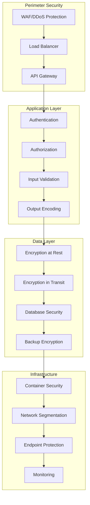

# Security and Compliance Guide - Unjucks Enterprise Platform

## Executive Summary

This comprehensive security and compliance guide outlines the security architecture, policies, and procedures for the Unjucks Enterprise Platform. The platform maintains SOC 2 Type II, ISO 27001, and GDPR compliance while providing robust security controls for Fortune 500 enterprises.

### Security Posture Overview
- **Security Framework**: NIST Cybersecurity Framework
- **Compliance Standards**: SOC 2 Type II, ISO 27001, GDPR, CCPA
- **Security Certifications**: ISO 27001, SOC 2 Type II
- **Penetration Testing**: Quarterly by certified third parties
- **Vulnerability Management**: Continuous scanning and remediation

---

## Table of Contents

1. [Security Architecture](#security-architecture)
2. [Identity and Access Management](#identity-and-access-management)
3. [Data Protection](#data-protection)
4. [Network Security](#network-security)
5. [Application Security](#application-security)
6. [Infrastructure Security](#infrastructure-security)
7. [Compliance Framework](#compliance-framework)
8. [Incident Response](#incident-response)
9. [Security Monitoring](#security-monitoring)
10. [Third-Party Security](#third-party-security)

---

## Security Architecture

### Defense in Depth Model



### Security Zones

| Zone | Description | Access Controls | Monitoring Level |
|------|-------------|-----------------|------------------|
| **DMZ** | Public-facing services | WAF, Rate limiting | High |
| **Application Tier** | Business logic | RBAC, mTLS | High |
| **Data Tier** | Database and storage | Network isolation, encryption | Critical |
| **Management** | Admin interfaces | VPN, MFA, privileged access | Critical |
| **Monitoring** | Security tools | Dedicated network, SOC access | High |

### Security Controls Matrix

| Control Category | Implementation | Status | Compliance Mapping |
|------------------|----------------|--------|-----------------|
| **Access Control** | RBAC + ABAC | ✅ Implemented | SOC 2 CC6.1 |
| **Authentication** | MFA + SSO | ✅ Implemented | SOC 2 CC6.2 |
| **Encryption** | AES-256 + TLS 1.3 | ✅ Implemented | ISO 27001 A.10.1 |
| **Vulnerability Management** | Automated scanning | ✅ Implemented | SOC 2 CC7.1 |
| **Incident Response** | 24/7 SOC | ✅ Implemented | ISO 27001 A.16.1 |
| **Data Loss Prevention** | DLP tools | ✅ Implemented | GDPR Article 32 |

---

## Identity and Access Management

### Authentication Framework

#### Multi-Factor Authentication (MFA)

```yaml
# MFA Configuration
mfa_policy:
  enabled: true
  required_for:
    - admin_access
    - production_systems
    - sensitive_data_access
  methods:
    - totp  # Time-based OTP
    - sms   # SMS codes (backup)
    - push  # Push notifications
    - fido2 # Hardware tokens
  enforcement:
    grace_period: 7_days
    trusted_devices: 30_days
    session_timeout: 8_hours
```

#### Single Sign-On (SSO) Integration

```javascript
// SAML SSO Configuration
const samlConfig = {
  entryPoint: 'https://idp.company.com/saml/sso',
  issuer: 'unjucks-platform',
  cert: process.env.SAML_CERT,
  privateKey: process.env.SAML_PRIVATE_KEY,
  signatureAlgorithm: 'sha256',
  digestAlgorithm: 'sha256',
  
  // Attribute mapping
  attributeMapping: {
    'http://schemas.xmlsoap.org/ws/2005/05/identity/claims/emailaddress': 'email',
    'http://schemas.xmlsoap.org/ws/2005/05/identity/claims/name': 'displayName',
    'http://schemas.microsoft.com/ws/2008/06/identity/claims/groups': 'groups'
  },
  
  // Security settings
  wantAssertionsSigned: true,
  wantNameIdEncrypted: true,
  signMetadata: true
};
```

### Role-Based Access Control (RBAC)

#### Permission Matrix

| Role | Templates | Projects | Admin | System | API Access |
|------|-----------|----------|-------|--------|-------------|
| **Viewer** | Read | Read | - | - | Read-only |
| **Developer** | Read/Write | Read/Write | - | - | Full |
| **Team Lead** | Full | Full | Team | - | Full |
| **Admin** | Full | Full | Full | Read | Full |
| **Super Admin** | Full | Full | Full | Full | Full |
| **Service Account** | Scoped | Scoped | - | - | API-only |

#### RBAC Implementation

```javascript
// Role-based access control middleware
class RBACMiddleware {
  constructor() {
    this.permissions = new Map();
    this.roles = new Map();
    this.loadPermissions();
  }
  
  async checkPermission(user, resource, action) {
    // Get user roles
    const userRoles = await this.getUserRoles(user.id);
    
    // Check each role for permission
    for (const role of userRoles) {
      const rolePermissions = this.roles.get(role);
      if (rolePermissions && rolePermissions.has(`${resource}:${action}`)) {
        return true;
      }
    }
    
    // Check attribute-based access control
    return await this.checkABAC(user, resource, action);
  }
  
  async checkABAC(user, resource, action) {
    const context = {
      user: user,
      resource: resource,
      action: action,
      environment: {
        time: new Date(),
        ip: user.lastIpAddress,
        location: user.location
      }
    };
    
    return await this.evaluatePolicy(context);
  }
}
```

### Privileged Access Management (PAM)

#### Just-in-Time (JIT) Access

```bash
#!/bin/bash
# JIT access request script

set -e

RESOURCE="$1"
JUSTIFICATION="$2"
DURATION="${3:-1h}"

if [ -z "$RESOURCE" ] || [ -z "$JUSTIFICATION" ]; then
    echo "Usage: $0 <resource> <justification> [duration]"
    echo "Example: $0 prod-database 'Emergency fix for ticket #12345' 2h"
    exit 1
fi

echo "Requesting JIT access to: $RESOURCE"
echo "Justification: $JUSTIFICATION"
echo "Duration: $DURATION"

# Create access request
REQUEST_ID=$(curl -s -X POST \
  -H "Authorization: Bearer $API_TOKEN" \
  -H "Content-Type: application/json" \
  -d '{
    "resource": "'$RESOURCE'",
    "justification": "'$JUSTIFICATION'",
    "duration": "'$DURATION'",
    "requester": "'$USER'"
  }' \
  https://pam.unjucks.dev/api/requests | jq -r '.id')

echo "Access request created: $REQUEST_ID"
echo "Waiting for approval..."

# Poll for approval
while true; do
    STATUS=$(curl -s -H "Authorization: Bearer $API_TOKEN" \
        https://pam.unjucks.dev/api/requests/$REQUEST_ID | jq -r '.status')
    
    case $STATUS in
        "approved")
            echo "Access granted! Credentials available for $DURATION"
            # Retrieve temporary credentials
            curl -s -H "Authorization: Bearer $API_TOKEN" \
                https://pam.unjucks.dev/api/requests/$REQUEST_ID/credentials
            break
            ;;
        "denied")
            echo "Access request denied"
            exit 1
            ;;
        "pending")
            echo "Still pending approval..."
            sleep 30
            ;;
    esac
done
```

---

## Data Protection

### Data Classification

| Classification | Description | Access Level | Retention | Encryption |
|----------------|-------------|--------------|-----------|------------|
| **Public** | Marketing materials | Public | 7 years | TLS |
| **Internal** | Documentation | Employees | 5 years | TLS + AES-256 |
| **Confidential** | Customer data | Role-based | 7 years | AES-256 + field-level |
| **Restricted** | Payment info, PII | Privileged | 10 years | AES-256 + tokenization |
| **Top Secret** | Trade secrets | C-level only | Indefinite | AES-256 + HSM |

### Encryption Standards

#### Encryption at Rest

```yaml
# Database encryption configuration
database_encryption:
  engine: postgresql
  encryption:
    method: transparent_data_encryption
    algorithm: aes_256_gcm
    key_management: aws_kms
    key_rotation: 90_days
    
  field_level_encryption:
    enabled: true
    fields:
      - pii_data
      - payment_info
      - api_keys
    algorithm: aes_256_gcm
    
  backup_encryption:
    enabled: true
    algorithm: aes_256_cbc
    key_derivation: pbkdf2
    iterations: 10000
```

#### Encryption in Transit

```nginx
# NGINX TLS configuration
server {
    listen 443 ssl http2;
    server_name api.unjucks.dev;
    
    # SSL/TLS Configuration
    ssl_certificate /etc/ssl/certs/api.unjucks.dev.crt;
    ssl_certificate_key /etc/ssl/private/api.unjucks.dev.key;
    
    # Security headers
    ssl_protocols TLSv1.2 TLSv1.3;
    ssl_ciphers ECDHE-ECDSA-AES128-GCM-SHA256:ECDHE-RSA-AES128-GCM-SHA256;
    ssl_prefer_server_ciphers off;
    ssl_ecdh_curve secp384r1;
    
    # HSTS
    add_header Strict-Transport-Security "max-age=63072000; includeSubDomains; preload";
    
    # Certificate transparency
    ssl_ct on;
    ssl_ct_static_scts /etc/ssl/scts;
    
    # OCSP stapling
    ssl_stapling on;
    ssl_stapling_verify on;
    ssl_trusted_certificate /etc/ssl/certs/ca-certs.pem;
}
```

### Data Loss Prevention (DLP)

```python
# DLP scanning and prevention
class DLPScanner:
    def __init__(self):
        self.patterns = {
            'ssn': r'\b(?:\d{3}-?\d{2}-?\d{4})\b',
            'credit_card': r'\b(?:\d{4}[- ]?){3}\d{4}\b',
            'email': r'\b[A-Za-z0-9._%+-]+@[A-Za-z0-9.-]+\.[A-Z|a-z]{2,}\b',
            'phone': r'\b(?:\+?1[-. ]?)?\(?([0-9]{3})\)?[-. ]?([0-9]{3})[-. ]?([0-9]{4})\b',
            'api_key': r'\b[A-Za-z0-9]{32,}\b'
        }
        
    def scan_content(self, content, context=None):
        violations = []
        
        for pattern_name, pattern in self.patterns.items():
            matches = re.finditer(pattern, content, re.IGNORECASE)
            for match in matches:
                violations.append({
                    'type': pattern_name,
                    'match': match.group(),
                    'position': match.span(),
                    'context': context
                })
                
        return violations
    
    def enforce_policy(self, violations, action='block'):
        if not violations:
            return {'allowed': True}
            
        high_risk = ['ssn', 'credit_card', 'api_key']
        critical_violations = [v for v in violations if v['type'] in high_risk]
        
        if critical_violations and action == 'block':
            return {
                'allowed': False,
                'reason': 'Critical PII detected',
                'violations': critical_violations
            }
            
        return {
            'allowed': True,
            'warnings': violations
        }
```

### Data Anonymization and Pseudonymization

```sql
-- Data anonymization procedures
CREATE OR REPLACE FUNCTION anonymize_user_data()
RETURNS void AS $$
BEGIN
    -- Anonymize email addresses
    UPDATE users 
    SET email = 'user' || id || '@example.com'
    WHERE environment = 'development';
    
    -- Pseudonymize names
    UPDATE users 
    SET 
        first_name = 'User',
        last_name = id::text
    WHERE environment = 'development';
    
    -- Mask phone numbers
    UPDATE users 
    SET phone = regexp_replace(phone, '\d{4}$', 'XXXX')
    WHERE environment = 'development';
    
    -- Clear sensitive fields
    UPDATE users 
    SET 
        ssn = NULL,
        date_of_birth = '1900-01-01'
    WHERE environment = 'development';
END;
$$ LANGUAGE plpgsql;
```

---

## Network Security

### Network Segmentation

```yaml
# Kubernetes Network Policies
apiVersion: networking.k8s.io/v1
kind: NetworkPolicy
metadata:
  name: unjucks-api-network-policy
  namespace: unjucks-prod
spec:
  podSelector:
    matchLabels:
      app: unjucks-api
  policyTypes:
  - Ingress
  - Egress
  
  ingress:
  - from:
    - namespaceSelector:
        matchLabels:
          name: unjucks-ingress
    ports:
    - protocol: TCP
      port: 3000
  
  egress:
  - to:
    - namespaceSelector:
        matchLabels:
          name: unjucks-database
    ports:
    - protocol: TCP
      port: 5432
  - to: []
    ports:
    - protocol: TCP
      port: 443  # HTTPS
    - protocol: TCP
      port: 53   # DNS
    - protocol: UDP
      port: 53   # DNS
```

### Web Application Firewall (WAF)

```yaml
# AWS WAF Rules
waf_rules:
  - name: "SQL Injection Protection"
    priority: 1
    statement:
      sqli_match_statement:
        field_to_match:
          all_query_arguments: {}
        text_transformations:
        - priority: 1
          type: "URL_DECODE"
        - priority: 2
          type: "HTML_ENTITY_DECODE"
    action:
      block: {}
  
  - name: "XSS Protection"
    priority: 2
    statement:
      xss_match_statement:
        field_to_match:
          all_query_arguments: {}
        text_transformations:
        - priority: 1
          type: "URL_DECODE"
    action:
      block: {}
  
  - name: "Rate Limiting"
    priority: 3
    statement:
      rate_based_statement:
        limit: 2000
        aggregate_key_type: "IP"
    action:
      block: {}
```

### VPN and Remote Access

```bash
#!/bin/bash
# VPN connection script with certificate-based authentication

set -e

VPN_CONFIG="/etc/openvpn/unjucks-client.conf"
CERT_DIR="/etc/openvpn/certs"

# Verify certificate validity
if ! openssl x509 -in "$CERT_DIR/client.crt" -noout -checkend 86400; then
    echo "ERROR: Client certificate expires within 24 hours"
    exit 1
fi

# Check certificate revocation
if openssl verify -CAfile "$CERT_DIR/ca.crt" -crl_check "$CERT_DIR/client.crt" 2>&1 | grep -q "certificate revoked"; then
    echo "ERROR: Client certificate has been revoked"
    exit 1
fi

# Connect to VPN
echo "Connecting to Unjucks VPN..."
sudo openvpn --config "$VPN_CONFIG" --daemon

# Verify connection
sleep 5
if pgrep -f "openvpn.*$VPN_CONFIG" > /dev/null; then
    echo "VPN connection established successfully"
    # Test internal connectivity
    if ping -c 1 -W 5 10.0.1.1 > /dev/null 2>&1; then
        echo "Internal network reachable"
    else
        echo "WARNING: Internal network unreachable"
    fi
else
    echo "ERROR: VPN connection failed"
    exit 1
fi
```

---

## Application Security

### Secure Development Lifecycle (SDLC)

#### Security Requirements

```yaml
# Security requirements checklist
security_requirements:
  authentication:
    - implement_mfa
    - secure_session_management
    - password_complexity_enforcement
  
  authorization:
    - implement_rbac
    - principle_of_least_privilege
    - resource_level_permissions
  
  input_validation:
    - sanitize_all_inputs
    - parameterized_queries
    - file_upload_restrictions
  
  output_encoding:
    - context_aware_encoding
    - content_security_policy
    - xss_protection
  
  error_handling:
    - generic_error_messages
    - secure_logging
    - no_sensitive_data_exposure
```

#### Static Application Security Testing (SAST)

```yaml
# GitHub Actions security scanning
name: Security Scan
on:
  push:
    branches: [main, develop]
  pull_request:
    branches: [main]

jobs:
  security-scan:
    runs-on: ubuntu-latest
    steps:
    - uses: actions/checkout@v3
    
    - name: Run Semgrep
      uses: returntocorp/semgrep-action@v1
      with:
        config: >
          p/security-audit
          p/secrets
          p/owasp-top-ten
          p/nodejs
    
    - name: Run CodeQL
      uses: github/codeql-action/analyze@v2
      with:
        languages: javascript
        queries: security-and-quality
    
    - name: Run npm audit
      run: |
        npm audit --audit-level moderate
        npm audit fix --dry-run
    
    - name: Run Snyk
      uses: snyk/actions/node@master
      env:
        SNYK_TOKEN: ${{ secrets.SNYK_TOKEN }}
      with:
        args: --severity-threshold=medium
```

### API Security

#### Rate Limiting and Throttling

```javascript
// Express rate limiting middleware
const rateLimit = require('express-rate-limit');
const RedisStore = require('rate-limit-redis');
const redis = require('redis');

const redisClient = redis.createClient({
  host: process.env.REDIS_HOST,
  port: process.env.REDIS_PORT,
  password: process.env.REDIS_PASSWORD
});

// Different rate limits for different endpoints
const createRateLimiter = (windowMs, max, message) => {
  return rateLimit({
    store: new RedisStore({
      sendCommand: (...args) => redisClient.call(...args),
    }),
    windowMs: windowMs,
    max: max,
    message: {
      error: 'rate_limit_exceeded',
      message: message,
      retry_after: Math.ceil(windowMs / 1000)
    },
    standardHeaders: true,
    legacyHeaders: false,
    keyGenerator: (req) => {
      // Use API key if available, otherwise IP
      return req.headers['x-api-key'] || req.ip;
    }
  });
};

// Apply rate limits
app.use('/api/auth', createRateLimiter(15 * 60 * 1000, 5, 'Too many auth attempts'));
app.use('/api/templates', createRateLimiter(60 * 1000, 100, 'Template API rate limit exceeded'));
app.use('/api/generate', createRateLimiter(60 * 1000, 10, 'Generation rate limit exceeded'));
app.use('/api', createRateLimiter(60 * 1000, 1000, 'General API rate limit exceeded'));
```

#### Input Validation and Sanitization

```javascript
// Comprehensive input validation
const Joi = require('joi');
const DOMPurify = require('isomorphic-dompurify');
const validator = require('validator');

class InputValidator {
  static validateTemplateRequest(data) {
    const schema = Joi.object({
      name: Joi.string()
        .pattern(/^[a-zA-Z0-9_-]+$/)
        .min(1)
        .max(100)
        .required(),
      
      description: Joi.string()
        .max(500)
        .optional(),
      
      variables: Joi.object()
        .pattern(Joi.string(), Joi.alternatives([
          Joi.string().max(1000),
          Joi.number(),
          Joi.boolean()
        ]))
        .max(50),
      
      files: Joi.array()
        .items(Joi.object({
          path: Joi.string().pattern(/^[^<>:"|?*\x00-\x1f]+$/),
          content: Joi.string().max(50000)
        }))
        .max(100)
    });
    
    return schema.validate(data);
  }
  
  static sanitizeHtml(html) {
    return DOMPurify.sanitize(html, {
      ALLOWED_TAGS: ['b', 'i', 'em', 'strong', 'a', 'p', 'br'],
      ALLOWED_ATTR: ['href'],
      ALLOWED_URI_REGEXP: /^https?:\/\//
    });
  }
  
  static validateEmail(email) {
    return validator.isEmail(email) && 
           !validator.contains(email, '<') && 
           !validator.contains(email, '>');
  }
  
  static validateUrl(url) {
    return validator.isURL(url, {
      protocols: ['http', 'https'],
      require_protocol: true,
      require_host: true,
      require_valid_protocol: true,
      allow_underscores: false,
      allow_trailing_dot: false,
      allow_protocol_relative_urls: false
    });
  }
}
```

### Secure Code Review Checklist

```markdown
# Secure Code Review Checklist

## Authentication & Authorization
- [ ] MFA implemented for sensitive operations
- [ ] Session management follows OWASP guidelines
- [ ] JWT tokens properly validated and expired
- [ ] Role-based access controls enforced
- [ ] Privilege escalation prevention

## Input Validation
- [ ] All inputs validated on server-side
- [ ] Parameterized queries used (no SQL injection)
- [ ] File upload restrictions enforced
- [ ] Input length limits enforced
- [ ] Special characters properly handled

## Output Encoding
- [ ] Context-aware output encoding
- [ ] Content Security Policy implemented
- [ ] XSS protection headers present
- [ ] JSON responses properly encoded

## Error Handling
- [ ] Generic error messages to users
- [ ] Detailed errors logged securely
- [ ] No sensitive data in error responses
- [ ] Stack traces not exposed

## Cryptography
- [ ] Strong encryption algorithms used
- [ ] Proper key management
- [ ] Secure random number generation
- [ ] Certificate validation

## Logging & Monitoring
- [ ] Security events logged
- [ ] Log integrity protected
- [ ] Sensitive data not logged
- [ ] Anomaly detection implemented
```

---

## Infrastructure Security

### Container Security

#### Docker Security Configuration

```dockerfile
# Secure Dockerfile
FROM node:18-alpine AS base

# Create non-root user
RUN addgroup -g 1001 -S nodejs && \
    adduser -S unjucks -u 1001

# Install security updates
RUN apk update && \
    apk upgrade && \
    apk add --no-cache dumb-init && \
    rm -rf /var/cache/apk/*

# Set working directory
WORKDIR /app

# Copy package files
COPY package*.json ./

# Install dependencies
RUN npm ci --only=production && \
    npm cache clean --force

# Copy application code
COPY --chown=unjucks:nodejs . .

# Remove development files
RUN rm -rf tests/ docs/ .git/

# Switch to non-root user
USER unjucks

# Health check
HEALTHCHECK --interval=30s --timeout=3s --start-period=5s --retries=3 \
  CMD node healthcheck.js

# Use dumb-init for proper signal handling
ENTRYPOINT ["dumb-init", "--"]
CMD ["node", "src/server/index.js"]
```

#### Kubernetes Security Policies

```yaml
# Pod Security Policy
apiVersion: policy/v1beta1
kind: PodSecurityPolicy
metadata:
  name: unjucks-restricted
spec:
  privileged: false
  allowPrivilegeEscalation: false
  requiredDropCapabilities:
    - ALL
  volumes:
    - 'configMap'
    - 'emptyDir'
    - 'projected'
    - 'secret'
    - 'downwardAPI'
    - 'persistentVolumeClaim'
  runAsUser:
    rule: 'MustRunAsNonRoot'
  runAsGroup:
    rule: 'MustRunAs'
    ranges:
      - min: 1
        max: 65535
  seLinux:
    rule: 'RunAsAny'
  fsGroup:
    rule: 'RunAsAny'
  readOnlyRootFilesystem: true
  seccompProfile:
    type: 'RuntimeDefault'
```

### Infrastructure as Code Security

```hcl
# Terraform security configuration
resource "aws_s3_bucket" "unjucks_storage" {
  bucket = "unjucks-prod-storage"
  
  versioning {
    enabled = true
  }
  
  server_side_encryption_configuration {
    rule {
      apply_server_side_encryption_by_default {
        sse_algorithm     = "aws:kms"
        kms_master_key_id = aws_kms_key.unjucks_key.arn
      }
      bucket_key_enabled = true
    }
  }
  
  public_access_block {
    block_public_acls       = true
    block_public_policy     = true
    ignore_public_acls      = true
    restrict_public_buckets = true
  }
  
  logging {
    target_bucket = aws_s3_bucket.access_logs.id
    target_prefix = "storage-access/"
  }
}

# RDS security configuration
resource "aws_db_instance" "unjucks_db" {
  identifier = "unjucks-prod-db"
  
  engine            = "postgres"
  engine_version    = "13.7"
  instance_class    = "db.r5.2xlarge"
  allocated_storage = 500
  
  db_name  = "unjucks_prod"
  username = "unjucks_admin"
  password = random_password.db_password.result
  
  # Security settings
  encrypted                = true
  kms_key_id              = aws_kms_key.unjucks_key.arn
  storage_encrypted       = true
  
  vpc_security_group_ids = [aws_security_group.database.id]
  db_subnet_group_name   = aws_db_subnet_group.database.name
  
  # Backup and maintenance
  backup_retention_period = 35
  backup_window          = "03:00-04:00"
  maintenance_window     = "sun:04:00-sun:05:00"
  
  # Monitoring
  monitoring_interval = 60
  monitoring_role_arn = aws_iam_role.rds_monitoring.arn
  
  # Security
  deletion_protection      = true
  skip_final_snapshot     = false
  final_snapshot_identifier = "unjucks-prod-final-snapshot"
  
  tags = {
    Name        = "Unjucks Production Database"
    Environment = "production"
    Compliance  = "SOC2"
  }
}
```

---

## Compliance Framework

### SOC 2 Type II Compliance

#### Trust Services Criteria

| Criteria | Description | Implementation | Evidence |
|----------|-------------|----------------|----------|
| **Security** | Protection against unauthorized access | Multi-layered security controls | Penetration test reports |
| **Availability** | System availability for operation and use | 99.9% uptime SLA | Monitoring dashboards |
| **Processing Integrity** | System processing is complete, valid, accurate, timely | Input validation, error handling | Code reviews, testing reports |
| **Confidentiality** | Information designated as confidential is protected | Encryption, access controls | Data flow diagrams |
| **Privacy** | Personal information is collected, used, retained, disclosed | Privacy policies, consent management | Privacy impact assessments |

#### SOC 2 Control Implementation

```yaml
# SOC 2 control mapping
soc2_controls:
  CC1.1:
    description: "COSO principles and governance"
    implementation:
      - board_oversight
      - security_policies
      - risk_management_framework
    evidence:
      - policy_documents
      - board_minutes
      - risk_assessments
  
  CC6.1:
    description: "Logical and physical access controls"
    implementation:
      - rbac_system
      - mfa_enforcement
      - access_reviews
    evidence:
      - access_logs
      - provisioning_records
      - review_reports
  
  CC7.1:
    description: "System boundaries and data flow"
    implementation:
      - network_segmentation
      - data_classification
      - encryption_standards
    evidence:
      - network_diagrams
      - data_flow_maps
      - encryption_reports
```

### GDPR Compliance

#### Data Subject Rights Implementation

```javascript
// GDPR data subject rights implementation
class GDPRCompliance {
  constructor(userService, auditService) {
    this.userService = userService;
    this.auditService = auditService;
  }
  
  // Right to access (Article 15)
  async exportUserData(userId, requesterId) {
    await this.validateRequest(userId, requesterId);
    
    const userData = await this.userService.getCompleteUserData(userId);
    const processedData = this.anonymizeThirdPartyData(userData);
    
    await this.auditService.log({
      action: 'data_export',
      userId: userId,
      requesterId: requesterId,
      timestamp: new Date()
    });
    
    return {
      personal_data: processedData,
      processing_purposes: this.getProcessingPurposes(),
      data_sources: this.getDataSources(),
      retention_periods: this.getRetentionPeriods(),
      recipients: this.getDataRecipients()
    };
  }
  
  // Right to erasure (Article 17)
  async deleteUserData(userId, requesterId, reason) {
    await this.validateRequest(userId, requesterId);
    
    // Check if deletion is legally required
    const canDelete = await this.validateDeletionRequest(userId, reason);
    if (!canDelete.allowed) {
      throw new Error(`Deletion not allowed: ${canDelete.reason}`);
    }
    
    // Perform deletion
    await this.userService.anonymizeUserData(userId);
    await this.userService.deletePersonalData(userId);
    
    await this.auditService.log({
      action: 'data_deletion',
      userId: userId,
      requesterId: requesterId,
      reason: reason,
      timestamp: new Date()
    });
    
    return { success: true, deletionDate: new Date() };
  }
  
  // Right to portability (Article 20)
  async portUserData(userId, requesterId, format = 'json') {
    await this.validateRequest(userId, requesterId);
    
    const userData = await this.userService.getPortableData(userId);
    
    const exportData = {
      user_profile: userData.profile,
      templates: userData.templates,
      projects: userData.projects,
      usage_data: userData.usage,
      export_metadata: {
        export_date: new Date(),
        format: format,
        version: '1.0'
      }
    };
    
    await this.auditService.log({
      action: 'data_portability',
      userId: userId,
      requesterId: requesterId,
      format: format,
      timestamp: new Date()
    });
    
    return exportData;
  }
}
```

### ISO 27001 Implementation

#### Information Security Management System (ISMS)

```yaml
# ISO 27001 ISMS Structure
isms:
  scope:
    description: "Unjucks platform and supporting infrastructure"
    boundaries:
      - cloud_infrastructure
      - application_services
      - customer_data
      - employee_systems
  
  risk_assessment:
    methodology: "ISO 27005"
    frequency: "Annually"
    criteria:
      confidentiality: ["Low", "Medium", "High", "Very High"]
      integrity: ["Low", "Medium", "High", "Very High"]
      availability: ["Low", "Medium", "High", "Very High"]
  
  controls:
    a5_information_security_policies:
      - policy_for_information_security
      - review_of_policies
    
    a6_organization_of_information_security:
      - internal_organization
      - mobile_devices_and_teleworking
    
    a8_asset_management:
      - responsibility_for_assets
      - information_classification
      - media_handling
```

---

## Incident Response

### Security Incident Classification

| Severity | Description | Response Time | Escalation |
|----------|-------------|---------------|------------|
| **Critical** | Data breach, system compromise | 1 hour | CISO, Legal, PR |
| **High** | Privilege escalation, malware | 4 hours | Security team, Management |
| **Medium** | Suspicious activity, policy violation | 24 hours | Security team |
| **Low** | Security awareness, minor violations | 72 hours | IT team |

### Incident Response Playbooks

#### Data Breach Response

```bash
#!/bin/bash
# Data breach incident response playbook

set -e

INCIDENT_ID="$1"
BREACH_TYPE="$2"
AFFECTED_SYSTEMS="$3"

if [ -z "$INCIDENT_ID" ]; then
    echo "Usage: $0 <incident_id> <breach_type> <affected_systems>"
    exit 1
fi

echo "=== DATA BREACH RESPONSE INITIATED ==="
echo "Incident ID: $INCIDENT_ID"
echo "Breach Type: $BREACH_TYPE"
echo "Affected Systems: $AFFECTED_SYSTEMS"
echo "Start Time: $(date -u '+%Y-%m-%d %H:%M:%S UTC')"

# Step 1: Immediate containment
echo "Step 1: Immediate containment..."
./scripts/isolate-affected-systems.sh "$AFFECTED_SYSTEMS"
./scripts/preserve-evidence.sh "$INCIDENT_ID"

# Step 2: Assessment
echo "Step 2: Breach assessment..."
./scripts/assess-data-exposure.sh "$INCIDENT_ID"
./scripts/identify-affected-users.sh "$INCIDENT_ID"

# Step 3: Notification
echo "Step 3: Stakeholder notification..."
./scripts/notify-incident-team.sh "$INCIDENT_ID" "$BREACH_TYPE"
./scripts/notify-legal-team.sh "$INCIDENT_ID"

# Step 4: Regulatory requirements
echo "Step 4: Checking regulatory requirements..."
if ./scripts/check-gdpr-notification-required.sh "$INCIDENT_ID"; then
    echo "GDPR notification required within 72 hours"
    ./scripts/prepare-gdpr-notification.sh "$INCIDENT_ID"
fi

# Step 5: Customer communication preparation
echo "Step 5: Preparing customer communications..."
./scripts/prepare-customer-notification.sh "$INCIDENT_ID"

echo "=== IMMEDIATE RESPONSE COMPLETED ==="
echo "Follow-up actions required:"
echo "1. Complete forensic analysis"
echo "2. Implement additional security measures"
echo "3. Conduct post-incident review"
echo "4. Update incident response procedures"
```

#### Malware Response

```python
# Malware incident response automation
import subprocess
import json
import time
from datetime import datetime

class MalwareResponse:
    def __init__(self, incident_id):
        self.incident_id = incident_id
        self.start_time = datetime.utcnow()
        
    def isolate_infected_systems(self, systems):
        """Isolate infected systems from network"""
        for system in systems:
            # Remove from network
            subprocess.run([
                'kubectl', 'patch', 'networkpolicy', f'{system}-netpol',
                '-p', '{"spec":{"policyTypes":["Ingress","Egress"],"ingress":[],"egress":[]}}'
            ])
            
            # Stop running containers
            subprocess.run([
                'kubectl', 'scale', 'deployment', system, '--replicas=0'
            ])
            
        self.log_action(f"Isolated systems: {', '.join(systems)}")
    
    def collect_evidence(self, systems):
        """Collect forensic evidence"""
        evidence_dir = f"/var/forensics/{self.incident_id}"
        subprocess.run(['mkdir', '-p', evidence_dir])
        
        for system in systems:
            # Memory dump
            subprocess.run([
                'kubectl', 'exec', f'deployment/{system}', '--',
                'dd', 'if=/proc/kcore', f'of={evidence_dir}/{system}-memory.dump'
            ])
            
            # File system analysis
            subprocess.run([
                'kubectl', 'exec', f'deployment/{system}', '--',
                'find', '/', '-type', 'f', '-newer', '/tmp/infection-time',
                '-exec', 'cp', '{}', f'{evidence_dir}/{system}-files/', '\;'
            ])
            
        self.log_action(f"Evidence collected in {evidence_dir}")
    
    def scan_for_malware(self, systems):
        """Run malware scans"""
        results = {}
        
        for system in systems:
            # ClamAV scan
            result = subprocess.run([
                'kubectl', 'exec', f'deployment/{system}', '--',
                'clamscan', '-r', '--bell', '/'
            ], capture_output=True, text=True)
            
            results[system] = {
                'scanner': 'clamav',
                'exit_code': result.returncode,
                'output': result.stdout,
                'timestamp': datetime.utcnow().isoformat()
            }
            
        with open(f'/var/forensics/{self.incident_id}/scan-results.json', 'w') as f:
            json.dump(results, f, indent=2)
            
        self.log_action("Malware scans completed")
        return results
    
    def log_action(self, message):
        """Log incident response actions"""
        log_entry = {
            'incident_id': self.incident_id,
            'timestamp': datetime.utcnow().isoformat(),
            'action': message
        }
        
        with open(f'/var/logs/incident-{self.incident_id}.log', 'a') as f:
            f.write(json.dumps(log_entry) + '\n')
```

---

## Security Monitoring

### Security Information and Event Management (SIEM)

```yaml
# Elasticsearch SIEM rules
siem_rules:
  - name: "Failed Login Attempts"
    query: |
      event.type:"authentication" AND event.outcome:"failure"
    threshold: 5
    window: "5m"
    severity: "medium"
    action: "alert"
    
  - name: "Privilege Escalation"
    query: |
      process.name:("sudo" OR "su" OR "runas") AND 
      event.outcome:"success" AND 
      user.name:("root" OR "administrator")
    threshold: 1
    window: "1m"
    severity: "high"
    action: "alert"
    
  - name: "Suspicious File Access"
    query: |
      file.path:("/etc/passwd" OR "/etc/shadow" OR "*.key" OR "*.pem")
    threshold: 1
    window: "1m"
    severity: "high"
    action: "alert"
```

### Intrusion Detection System (IDS)

```yaml
# Suricata IDS rules
suricata_rules:
  - alert tcp any any -> $HOME_NET 22 (
      msg:"SSH Brute Force Attack Detected";
      flow:to_server,established;
      threshold: type both, track by_src, count 10, seconds 60;
      classtype:attempted-admin;
      sid:1000001;
    )
  
  - alert http any any -> $HOME_NET any (
      msg:"SQL Injection Attempt";
      content:"union"; nocase;
      content:"select"; nocase;
      distance:0; within:100;
      classtype:web-application-attack;
      sid:1000002;
    )
  
  - alert tcp any any -> $HOME_NET 443 (
      msg:"TLS Certificate Anomaly";
      tls.cert_subject; content:"*.unjucks.dev";
      tls.cert_issuer; content:!"Let's Encrypt";
      classtype:protocol-command-decode;
      sid:1000003;
    )
```

### Security Metrics Dashboard

```python
# Security metrics collector
import json
import time
from datetime import datetime, timedelta
from collections import defaultdict

class SecurityMetrics:
    def __init__(self):
        self.metrics = defaultdict(int)
        self.events = []
        
    def collect_authentication_metrics(self):
        """Collect authentication-related metrics"""
        # Query authentication logs
        auth_events = self.query_logs({
            'query': 'event.type:authentication',
            'time_range': '24h'
        })
        
        for event in auth_events:
            if event.get('outcome') == 'success':
                self.metrics['successful_logins'] += 1
            else:
                self.metrics['failed_logins'] += 1
                
            if event.get('mfa_used'):
                self.metrics['mfa_logins'] += 1
                
    def collect_security_alerts(self):
        """Collect security alert metrics"""
        alerts = self.query_logs({
            'query': 'event.type:alert',
            'time_range': '24h'
        })
        
        severity_counts = defaultdict(int)
        for alert in alerts:
            severity = alert.get('severity', 'unknown')
            severity_counts[severity] += 1
            
        self.metrics.update({
            'critical_alerts': severity_counts['critical'],
            'high_alerts': severity_counts['high'],
            'medium_alerts': severity_counts['medium'],
            'low_alerts': severity_counts['low']
        })
        
    def collect_vulnerability_metrics(self):
        """Collect vulnerability management metrics"""
        vulns = self.query_vulnerability_db()
        
        self.metrics.update({
            'critical_vulnerabilities': len([v for v in vulns if v['severity'] == 'critical']),
            'high_vulnerabilities': len([v for v in vulns if v['severity'] == 'high']),
            'medium_vulnerabilities': len([v for v in vulns if v['severity'] == 'medium']),
            'low_vulnerabilities': len([v for v in vulns if v['severity'] == 'low']),
            'mean_time_to_patch': self.calculate_mttr(vulns)
        })
        
    def generate_dashboard_data(self):
        """Generate dashboard data"""
        self.collect_authentication_metrics()
        self.collect_security_alerts()
        self.collect_vulnerability_metrics()
        
        dashboard_data = {
            'timestamp': datetime.utcnow().isoformat(),
            'metrics': dict(self.metrics),
            'security_score': self.calculate_security_score(),
            'trends': self.calculate_trends()
        }
        
        return dashboard_data
    
    def calculate_security_score(self):
        """Calculate overall security score"""
        # Scoring algorithm based on various factors
        base_score = 100
        
        # Deduct points for vulnerabilities
        base_score -= self.metrics['critical_vulnerabilities'] * 10
        base_score -= self.metrics['high_vulnerabilities'] * 5
        base_score -= self.metrics['medium_vulnerabilities'] * 2
        
        # Deduct points for failed logins
        failed_login_rate = self.metrics['failed_logins'] / max(self.metrics['successful_logins'], 1)
        if failed_login_rate > 0.1:  # More than 10% failure rate
            base_score -= 15
            
        # Add points for MFA usage
        mfa_rate = self.metrics['mfa_logins'] / max(self.metrics['successful_logins'], 1)
        if mfa_rate > 0.9:  # More than 90% MFA usage
            base_score += 10
            
        return max(0, min(100, base_score))
```

---

## Third-Party Security

### Vendor Risk Assessment

```yaml
# Vendor security assessment framework
vendor_assessment:
  categories:
    data_handling:
      weight: 30
      criteria:
        - data_encryption
        - data_residency
        - data_retention
        - data_deletion
        - backup_security
    
    access_controls:
      weight: 25
      criteria:
        - authentication_methods
        - authorization_controls
        - privileged_access_management
        - session_management
    
    compliance:
      weight: 20
      criteria:
        - soc2_compliance
        - iso27001_certification
        - gdpr_compliance
        - industry_certifications
    
    security_practices:
      weight: 15
      criteria:
        - vulnerability_management
        - penetration_testing
        - security_training
        - incident_response
    
    infrastructure:
      weight: 10
      criteria:
        - network_security
        - monitoring_logging
        - disaster_recovery
        - change_management
  
  scoring:
    excellent: 4
    good: 3
    adequate: 2
    poor: 1
    unacceptable: 0
  
  minimum_score: 2.5
  approval_required_below: 3.0
```

### Supply Chain Security

```javascript
// Dependency security scanning
const { exec } = require('child_process');
const fs = require('fs');
const path = require('path');

class SupplyChainSecurity {
  constructor() {
    this.vulnerabilityDb = new Map();
    this.allowedPackages = new Set();
    this.blockedPackages = new Set();
  }
  
  async scanDependencies(projectPath) {
    const packageJsonPath = path.join(projectPath, 'package.json');
    const packageJson = JSON.parse(fs.readFileSync(packageJsonPath, 'utf8'));
    
    const results = {
      vulnerabilities: [],
      licenseIssues: [],
      blockedPackages: [],
      recommendations: []
    };
    
    // Scan production dependencies
    for (const [name, version] of Object.entries(packageJson.dependencies || {})) {
      const scanResult = await this.scanPackage(name, version);
      if (scanResult.vulnerabilities.length > 0) {
        results.vulnerabilities.push(...scanResult.vulnerabilities);
      }
      
      if (this.blockedPackages.has(name)) {
        results.blockedPackages.push({ name, version, reason: 'Blocked by security policy' });
      }
      
      const licenseCheck = await this.checkLicense(name, version);
      if (!licenseCheck.approved) {
        results.licenseIssues.push({ name, version, license: licenseCheck.license });
      }
    }
    
    return results;
  }
  
  async scanPackage(name, version) {
    // Use multiple sources for vulnerability data
    const sources = ['npm-audit', 'snyk', 'ossindex'];
    const vulnerabilities = [];
    
    for (const source of sources) {
      try {
        const vulns = await this.queryVulnerabilitySource(source, name, version);
        vulnerabilities.push(...vulns);
      } catch (error) {
        console.warn(`Failed to query ${source} for ${name}@${version}:`, error.message);
      }
    }
    
    // Deduplicate vulnerabilities
    const uniqueVulns = this.deduplicateVulnerabilities(vulnerabilities);
    
    return {
      package: name,
      version: version,
      vulnerabilities: uniqueVulns
    };
  }
  
  async checkLicense(name, version) {
    const approvedLicenses = [
      'MIT', 'Apache-2.0', 'BSD-2-Clause', 'BSD-3-Clause',
      'ISC', 'CC0-1.0', 'Unlicense'
    ];
    
    const restrictedLicenses = [
      'GPL-2.0', 'GPL-3.0', 'AGPL-1.0', 'AGPL-3.0',
      'LGPL-2.1', 'LGPL-3.0', 'MPL-2.0'
    ];
    
    try {
      const licenseInfo = await this.getPackageLicense(name, version);
      
      return {
        approved: approvedLicenses.includes(licenseInfo.license),
        license: licenseInfo.license,
        restricted: restrictedLicenses.includes(licenseInfo.license)
      };
    } catch (error) {
      return {
        approved: false,
        license: 'Unknown',
        error: error.message
      };
    }
  }
  
  generateSecurityReport(scanResults) {
    const report = {
      summary: {
        totalVulnerabilities: scanResults.vulnerabilities.length,
        criticalVulnerabilities: scanResults.vulnerabilities.filter(v => v.severity === 'critical').length,
        highVulnerabilities: scanResults.vulnerabilities.filter(v => v.severity === 'high').length,
        licenseIssues: scanResults.licenseIssues.length,
        blockedPackages: scanResults.blockedPackages.length
      },
      details: scanResults,
      recommendations: this.generateRecommendations(scanResults)
    };
    
    return report;
  }
}
```

---

**Document Information:**
- **Version**: 4.0.0
- **Last Updated**: 2024-03-20
- **Next Review**: 2024-06-20
- **Classification**: Internal Use - Confidential
- **Owner**: Chief Information Security Officer
- **Approved By**: Chief Technology Officer, Chief Legal Officer

**Distribution:**
- Executive Leadership Team
- Security Team
- Engineering Team
- Compliance Team
- Legal Team
- Customer Success Team

**Related Documents:**
- Incident Response Plan
- Disaster Recovery Plan
- Privacy Policy
- Data Processing Agreement
- Vendor Security Requirements
- Employee Security Handbook