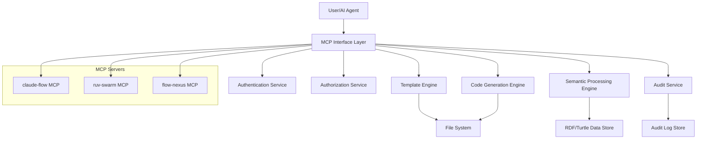

# Threat Model Analysis

## Executive Summary

This threat model analysis identifies, categorizes, and provides mitigation strategies for security threats to the Unjucks v2025 platform. The analysis uses the STRIDE methodology (Spoofing, Tampering, Repudiation, Information Disclosure, Denial of Service, Elevation of Privilege) to systematically assess threats across all system components.

## System Architecture Overview

### High-Level Architecture Components



### Trust Boundaries

1. **External Boundary**: User/AI agents to MCP interface
2. **MCP Boundary**: MCP interface to internal services
3. **Service Boundary**: Inter-service communications
4. **Data Boundary**: Services to data stores
5. **File System Boundary**: Services to file system

## STRIDE Threat Analysis

### Spoofing Threats

#### S1: User/AI Agent Spoofing
**Description**: Malicious actors impersonating legitimate users or AI agents
**Impact**: High - Unauthorized code generation, data access
**Likelihood**: Medium

**Mitigations**:
- Strong authentication mechanisms (MFA, certificates)
- AI agent identity verification through MCP protocol
- Session management with secure tokens
- Behavioral analysis for anomaly detection

```typescript
// Enhanced authentication with anti-spoofing measures
export class AntiSpoofingAuthService {
  @MultiFactorAuth
  @DeviceFingerprinting
  @BehavioralAnalysis
  async authenticateUser(credentials: AuthCredentials): Promise<AuthResult> {
    // Multi-layer verification to prevent spoofing
    const identityVerification = await this.verifyIdentity(credentials);
    const deviceVerification = await this.verifyDevice(credentials.deviceInfo);
    const behaviorVerification = await this.analyzeBehavior(credentials.userPattern);
    
    return this.combineVerificationResults([
      identityVerification,
      deviceVerification, 
      behaviorVerification
    ]);
  }
}
```

#### S2: MCP Server Spoofing
**Description**: Rogue MCP servers masquerading as legitimate services
**Impact**: High - Code injection, data exfiltration
**Likelihood**: Low

**Mitigations**:
- MCP server certificate validation
- Server registration and verification process
- Encrypted communication channels
- Server reputation and trust scoring

### Tampering Threats

#### T1: Template Tampering
**Description**: Unauthorized modification of code generation templates
**Impact**: Critical - Malicious code injection into generated applications
**Likelihood**: Medium

**Mitigations**:
- Template integrity verification (cryptographic hashing)
- Version control integration with signing
- Access controls for template modification
- Template approval workflows

```typescript
export class TemplateIntegrityService {
  @CryptographicSigning
  async verifyTemplateIntegrity(template: Template): Promise<IntegrityResult> {
    const storedHash = await this.getTemplateHash(template.id);
    const currentHash = await this.calculateHash(template.content);
    
    if (storedHash !== currentHash) {
      await this.alertSecurityTeam({
        type: 'TEMPLATE_TAMPERING',
        templateId: template.id,
        severity: 'CRITICAL'
      });
      
      throw new TemplateIntegrityViolationException(
        `Template ${template.id} has been tampered with`
      );
    }
    
    return { verified: true, hash: currentHash };
  }
}
```

#### T2: Generated Code Tampering
**Description**: Modification of generated code before deployment
**Impact**: High - Introduction of vulnerabilities or backdoors
**Likelihood**: Medium

**Mitigations**:
- Generated code signing and verification
- Secure code transmission channels
- Immutable generation logs
- Code review integration

#### T3: Audit Log Tampering
**Description**: Modification or deletion of audit logs
**Impact**: High - Loss of forensic evidence, compliance violations
**Likelihood**: Low

**Mitigations**:
- Immutable audit log storage (append-only)
- Log integrity verification (blockchain or hash chains)
- Separate audit infrastructure
- Real-time log replication

### Repudiation Threats

#### R1: Code Generation Repudiation
**Description**: Users denying they requested specific code generation
**Impact**: Medium - Compliance and audit challenges
**Likelihood**: Medium

**Mitigations**:
- Comprehensive audit trails with digital signatures
- Request validation and confirmation workflows
- User consent mechanisms
- Non-repudiation certificates

```typescript
export class NonRepudiationService {
  @DigitalSigning
  async recordGenerationRequest(request: GenerationRequest): Promise<NonRepudiableRecord> {
    const digitalSignature = await this.signRequest(request, request.user.privateKey);
    const timestamp = await this.getTrustedTimestamp();
    
    const record = {
      request,
      signature: digitalSignature,
      timestamp,
      userCertificate: request.user.certificate,
      hash: await this.calculateRequestHash(request)
    };
    
    await this.immutableStorage.store(record);
    return record;
  }
}
```

#### R2: Administrative Action Repudiation
**Description**: Administrators denying privileged actions
**Impact**: High - Security and compliance risks
**Likelihood**: Low

**Mitigations**:
- Multi-party approval for critical actions
- Video recording of administrative sessions
- Cryptographic proof of authorization
- External witness systems

### Information Disclosure Threats

#### I1: Template Content Disclosure
**Description**: Unauthorized access to proprietary templates
**Impact**: Medium - Intellectual property theft
**Likelihood**: Medium

**Mitigations**:
- Template encryption at rest and in transit
- Access control lists for template access
- Data loss prevention (DLP) monitoring
- Template watermarking

#### I2: Generated Code Disclosure
**Description**: Exposure of sensitive generated code
**Impact**: High - Business logic exposure, security vulnerabilities
**Likelihood**: Medium

**Mitigations**:
- Secure code storage and transmission
- Access controls for generated artifacts
- Automatic secret detection and redaction
- Secure disposal of temporary files

#### I3: Audit Data Disclosure
**Description**: Unauthorized access to audit logs and compliance data
**Impact**: High - Privacy violations, competitive intelligence
**Likelihood**: Low

**Mitigations**:
- Audit data encryption and access controls
- Data classification and handling procedures
- Privacy-preserving audit techniques
- Secure audit data sharing protocols

```typescript
export class SecureAuditService {
  @Encrypt('AES-256-GCM')
  @AccessControl(['AUDIT_VIEWER', 'COMPLIANCE_OFFICER'])
  async retrieveAuditData(query: AuditQuery): Promise<AuditData> {
    // Validate access permissions
    await this.validateAccess(query.requester, query.dataType);
    
    // Apply data minimization principles
    const filteredQuery = this.applyDataMinimization(query);
    
    // Retrieve and decrypt audit data
    const encryptedData = await this.auditStore.query(filteredQuery);
    const decryptedData = await this.decrypt(encryptedData);
    
    // Log access for compliance
    await this.logDataAccess({
      requester: query.requester,
      dataAccessed: query.dataType,
      timestamp: new Date()
    });
    
    return decryptedData;
  }
}
```

### Denial of Service Threats

#### D1: MCP Service Flooding
**Description**: Overwhelming MCP services with excessive requests
**Impact**: High - Service unavailability, business disruption
**Likelihood**: Medium

**Mitigations**:
- Rate limiting and throttling mechanisms
- Request queuing and prioritization
- Service scaling and load balancing
- DDoS protection services

#### D2: Resource Exhaustion
**Description**: Consuming excessive system resources during code generation
**Impact**: Medium - Performance degradation, service instability
**Likelihood**: High

**Mitigations**:
- Resource quotas and limits
- Generation timeout mechanisms
- Resource monitoring and alerting
- Graceful degradation strategies

```typescript
export class ResourceProtectionService {
  @ResourceLimit(cpu: '80%', memory: '2GB', timeout: '10m')
  async generateCode(request: GenerationRequest): Promise<GenerationResult> {
    const resourceMonitor = this.startResourceMonitoring();
    
    try {
      const result = await this.codeGenerator.generate(request);
      return result;
    } catch (error) {
      if (error instanceof ResourceLimitExceededException) {
        await this.handleResourceExhaustion(request, error);
      }
      throw error;
    } finally {
      await resourceMonitor.stop();
    }
  }
}
```

#### D3: Template Processing DoS
**Description**: Malicious templates designed to consume excessive resources
**Impact**: High - Service degradation, availability issues
**Likelihood**: Medium

**Mitigations**:
- Template complexity analysis
- Processing time limits
- Template sandboxing
- Resource usage monitoring

### Elevation of Privilege Threats

#### E1: Template Injection Privilege Escalation
**Description**: Using template injection to gain elevated system access
**Impact**: Critical - System compromise, data breach
**Likelihood**: Medium

**Mitigations**:
- Template input sanitization
- Sandboxed template execution environment
- Least privilege template processing
- Template security scanning

```typescript
export class SecureTemplateProcessor {
  @Sandbox
  @LeastPrivilege
  async processTemplate(template: Template, context: TemplateContext): Promise<ProcessingResult> {
    // Create isolated execution environment
    const sandbox = await this.createSandbox({
      allowedOperations: ['string-manipulation', 'basic-logic'],
      forbiddenOperations: ['file-system', 'network', 'process-execution'],
      resourceLimits: { cpu: '10%', memory: '100MB', timeout: '30s' }
    });
    
    // Sanitize template content
    const sanitizedTemplate = await this.sanitizer.sanitize(template);
    
    // Execute in sandbox with monitoring
    const result = await sandbox.execute(sanitizedTemplate, context);
    
    // Validate output before returning
    await this.validateOutput(result);
    
    return result;
  }
}
```

#### E2: MCP Protocol Exploitation
**Description**: Exploiting MCP protocol vulnerabilities for privilege escalation
**Impact**: Critical - Full system compromise
**Likelihood**: Low

**Mitigations**:
- MCP protocol version validation
- Secure MCP implementation
- Protocol-level access controls
- Regular security updates

#### E3: File System Privilege Escalation
**Description**: Using file operations to gain elevated file system access
**Impact**: High - Unauthorized file access, system compromise
**Likelihood**: Medium

**Mitigations**:
- Chroot jails for file operations
- Path traversal prevention
- File access logging and monitoring
- Principle of least privilege for file operations

## Attack Trees

### Code Injection Attack Tree

```
Goal: Inject malicious code into generated applications
├── Template Injection
│   ├── Bypass input sanitization
│   ├── Exploit template parsing vulnerabilities
│   └── Use template inheritance for injection
├── Parameter Injection
│   ├── Inject through generation parameters
│   ├── Exploit variable substitution
│   └── Use configuration injection
└── Direct Code Insertion
    ├── Modify templates directly
    ├── Inject through version control
    └── Replace generated files
```

### Data Exfiltration Attack Tree

```
Goal: Extract sensitive data from the system
├── Template Data Extraction
│   ├── Access proprietary templates
│   ├── Extract business logic patterns
│   └── Steal intellectual property
├── Generated Code Extraction
│   ├── Intercept generated applications
│   ├── Extract sensitive algorithms
│   └── Access embedded secrets
└── Audit Data Extraction
    ├── Access compliance data
    ├── Extract user activity logs
    └── Steal configuration information
```

## Risk Assessment Matrix

| Threat ID | Threat | Impact | Likelihood | Risk Level | Priority |
|-----------|--------|---------|------------|------------|----------|
| S1 | User/AI Agent Spoofing | High | Medium | High | P1 |
| S2 | MCP Server Spoofing | High | Low | Medium | P2 |
| T1 | Template Tampering | Critical | Medium | Critical | P0 |
| T2 | Generated Code Tampering | High | Medium | High | P1 |
| T3 | Audit Log Tampering | High | Low | Medium | P2 |
| R1 | Code Generation Repudiation | Medium | Medium | Medium | P2 |
| R2 | Administrative Action Repudiation | High | Low | Medium | P2 |
| I1 | Template Content Disclosure | Medium | Medium | Medium | P2 |
| I2 | Generated Code Disclosure | High | Medium | High | P1 |
| I3 | Audit Data Disclosure | High | Low | Medium | P2 |
| D1 | MCP Service Flooding | High | Medium | High | P1 |
| D2 | Resource Exhaustion | Medium | High | Medium | P2 |
| D3 | Template Processing DoS | High | Medium | High | P1 |
| E1 | Template Injection Privilege Escalation | Critical | Medium | Critical | P0 |
| E2 | MCP Protocol Exploitation | Critical | Low | High | P1 |
| E3 | File System Privilege Escalation | High | Medium | High | P1 |

## Security Controls Mapping

### Preventive Controls
- Multi-factor authentication (S1)
- Template integrity verification (T1)
- Input sanitization and validation (E1)
- Rate limiting and throttling (D1)
- Access control lists (I1, I2, I3)

### Detective Controls
- Behavioral analysis and anomaly detection (S1)
- Audit trail monitoring (T3, R1, R2)
- Resource usage monitoring (D2, D3)
- Security event correlation (All threats)
- Real-time threat detection (All threats)

### Corrective Controls
- Incident response procedures (All threats)
- Automated threat remediation (D1, D2, D3)
- Backup and recovery procedures (T1, T2, T3)
- Security patch management (E2)
- User account management (S1, E1, E2, E3)

## Threat Intelligence Integration

### External Threat Feeds
- CVE database monitoring
- Security vendor threat feeds
- Industry-specific threat intelligence
- Government cybersecurity alerts
- Open source intelligence (OSINT)

### Threat Modeling Updates
- Quarterly threat model reviews
- Post-incident threat model updates
- New feature security assessments
- Emerging threat integration
- Risk assessment recalibration

## Incident Response Integration

### Threat-Specific Response Procedures

#### Critical Threats (P0)
- Immediate escalation to CISO
- Emergency response team activation
- System isolation and containment
- Forensic evidence preservation
- Stakeholder communication

#### High Priority Threats (P1)
- Security team notification
- Automated containment measures
- Investigation initiation
- Impact assessment
- Remediation planning

#### Medium Priority Threats (P2)
- Standard security procedures
- Monitoring enhancement
- Vulnerability management
- Risk mitigation planning
- Process improvement

## Continuous Threat Assessment

### Threat Modeling Lifecycle
1. **Initial Assessment**: Comprehensive threat identification
2. **Regular Reviews**: Quarterly threat model updates
3. **Change Assessment**: Security review for new features
4. **Incident Learning**: Post-incident threat model updates
5. **Intelligence Integration**: External threat intelligence incorporation

### Metrics and KPIs
- Threat coverage completeness
- Risk reduction effectiveness
- Security control coverage
- Incident response effectiveness
- Threat model accuracy

## Recommendations

### Immediate Actions (0-30 days)
1. Implement template integrity verification
2. Deploy comprehensive audit logging
3. Establish MCP server validation
4. Configure rate limiting and resource quotas
5. Enhance authentication mechanisms

### Short-term Actions (30-90 days)
1. Deploy behavioral analysis systems
2. Implement template sandboxing
3. Establish threat intelligence integration
4. Enhance incident response procedures
5. Deploy security monitoring and alerting

### Long-term Actions (90+ days)
1. Implement advanced threat detection
2. Deploy automated security remediation
3. Establish security metrics and dashboards
4. Conduct regular security assessments
5. Maintain continuous security improvement

## Conclusion

This threat model provides a comprehensive analysis of security threats to the Unjucks v2025 platform, with prioritized mitigation strategies and implementation recommendations. The analysis should be regularly updated to address emerging threats and evolving system architecture.

The identified threats span across all STRIDE categories, with template tampering and privilege escalation representing the highest risk scenarios. Implementing the recommended security controls will significantly reduce the overall risk profile while maintaining system functionality and performance.

Regular review and updates of this threat model, combined with continuous monitoring and incident response capabilities, will ensure the platform maintains strong security posture against evolving threat landscapes.