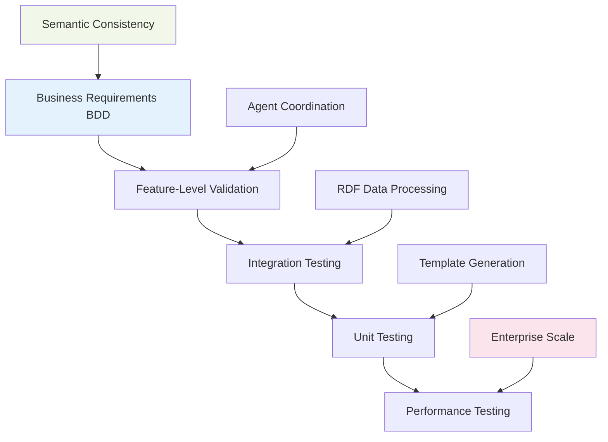

# Semantic Feature Validation with Behavior-Driven Tests

## 🎯 Overview: BDD-First Semantic Validation Strategy

This document outlines how **Behavior-Driven Development (BDD)** serves as the primary validation mechanism for semantic web capabilities, ensuring that RDF/Turtle data processing, MCP agent coordination, and enterprise-scale code generation meet business requirements through comprehensive test coverage.

## 🧪 BDD Semantic Validation Architecture

### **Validation Pyramid**


### **BDD Validation Layers**

| Layer | Validation Focus | BDD Pattern | Success Criteria |
|-------|-----------------|-------------|------------------|
| **Business** | Requirements satisfaction | Feature-level scenarios | Stakeholder acceptance |
| **Integration** | System coordination | Multi-component workflows | End-to-end functionality |
| **Component** | Semantic processing | Isolated feature testing | Technical specification |
| **Performance** | Enterprise scale | Load and stress scenarios | SLA compliance |
| **Recovery** | Error handling | Failure and recovery scenarios | Graceful degradation |

## 📋 Comprehensive BDD Validation Scenarios

### **Validation Category 1: Core Semantic Processing**

#### **RDF Data Parsing Validation**
```gherkin
Feature: RDF Data Parsing Validation
  As a system that processes enterprise semantic data
  I want to validate RDF parsing accuracy and consistency
  So that semantic information is correctly interpreted

  Scenario: Validate comprehensive RDF vocabulary support
    Given I have RDF data using FOAF, Dublin Core, Schema.org vocabularies
    When I parse the multi-vocabulary RDF content
    Then all namespace prefixes should be correctly identified
    And vocabulary terms should preserve their semantic meaning
    And cross-vocabulary relationships should be maintained
    And datatype literals should convert to appropriate JavaScript types

  Scenario: Validate RDF parsing performance under load
    Given I have enterprise-scale RDF datasets with 100K+ triples
    When I parse multiple large datasets concurrently
    Then each dataset should parse within 2 seconds
    And memory usage should remain under 200MB per dataset
    And concurrent parsing should not degrade performance
    And all parsed data should maintain semantic integrity
```

#### **Implementation Example**
```typescript
test('Validate comprehensive RDF vocabulary support', ({ given, when, then, and }) => {
  let multiVocabData: string;
  let parseResult: RDFParseResult;

  given('I have RDF data using FOAF, Dublin Core, Schema.org vocabularies', () => {
    multiVocabData = `
      @prefix foaf: <http://xmlns.com/foaf/0.1/> .
      @prefix dc: <http://purl.org/dc/terms/> .
      @prefix schema: <http://schema.org/> .
      @prefix xsd: <http://www.w3.org/2001/XMLSchema#> .

      <#person>
        foaf:name "Dr. Alice Smith" ;
        foaf:title "Chief Technology Officer" ;
        foaf:mbox <mailto:alice@example.org> ;
        dc:created "2023-01-15T10:30:00Z"^^xsd:dateTime ;
        schema:worksFor <#organization> .

      <#organization>
        schema:name "Tech Innovations Inc." ;
        schema:foundingDate "2010-03-01"^^xsd:date ;
        dc:description "Leading AI research company" ;
        foaf:homepage <https://techinnovations.com> .
    `;
    
    expect(multiVocabData.length).toBeGreaterThan(0);
  });

  when('I parse the multi-vocabulary RDF content', async () => {
    const parser = new TurtleParser();
    parseResult = await parser.parse(multiVocabData);
  });

  then('all namespace prefixes should be correctly identified', () => {
    expect(parseResult.prefixes).toHaveProperty('foaf');
    expect(parseResult.prefixes).toHaveProperty('dc');
    expect(parseResult.prefixes).toHaveProperty('schema');
    expect(parseResult.prefixes.foaf).toBe('http://xmlns.com/foaf/0.1/');
  });

  and('vocabulary terms should preserve their semantic meaning', () => {
    const personTriples = parseResult.triples.filter(
      t => t.subject.value === '#person'
    );
    const nameTriple = personTriples.find(
      t => t.predicate.value === 'http://xmlns.com/foaf/0.1/name'
    );
    expect(nameTriple?.object.value).toBe('Dr. Alice Smith');
  });
});
```

### **Validation Category 2: MCP Agent Coordination**

#### **Agent Semantic Coordination Validation**
```gherkin
Feature: MCP Agent Semantic Coordination Validation
  As a distributed AI system
  I want to validate agent coordination with semantic data
  So that agents collaborate effectively with shared understanding

  Scenario: Validate multi-agent semantic understanding consistency
    Given I have complex enterprise ontology with multiple domains
    And I have 5 specialized semantic agents
    When each agent processes their domain specialization
    Then all agents should have consistent semantic understanding
    And cross-domain relationships should be preserved
    And agent coordination should complete without conflicts
    And shared semantic memory should contain unified knowledge

  Scenario: Validate agent failure recovery with semantic consistency
    Given I have ongoing multi-agent semantic processing
    When one agent fails during semantic analysis
    Then remaining agents should continue processing
    And semantic consistency should be maintained
    And failed agent work should be redistributed
    And overall semantic analysis should complete successfully
```

#### **Implementation Example**
```typescript
test('Validate multi-agent semantic understanding consistency', ({ given, and, when, then }) => {
  let enterpriseOntology: SemanticContext;
  let semanticAgents: Map<string, SemanticAgent>;
  let coordinationResult: CoordinationResult;

  given('I have complex enterprise ontology with multiple domains', async () => {
    enterpriseOntology = await loadComplexOntology(`
      @prefix finance: <http://enterprise.corp/finance/> .
      @prefix hr: <http://enterprise.corp/hr/> .
      @prefix it: <http://enterprise.corp/it/> .
      
      finance:PaymentSystem rdf:type finance:FinancialService ;
          finance:processingCapability "CreditCard", "ACH", "Wire" ;
          it:dependsOn it:DatabaseSystem ;
          hr:requiresRole hr:FinancialAnalyst .
    `);
    
    expect(enterpriseOntology.domains).toContain('finance');
    expect(enterpriseOntology.domains).toContain('hr'); 
    expect(enterpriseOntology.domains).toContain('it');
  });

  when('each agent processes their domain specialization', async () => {
    coordinationResult = await orchestrateDomainSpecializedProcessing({
      ontology: enterpriseOntology,
      agents: semanticAgents,
      coordinationStrategy: 'domain-specialized'
    });
  });

  then('all agents should have consistent semantic understanding', () => {
    expect(coordinationResult.success).toBe(true);
    
    // Validate cross-agent semantic consistency
    const financeAgent = coordinationResult.agentResults.get('finance-expert');
    const hrAgent = coordinationResult.agentResults.get('hr-expert');
    const itAgent = coordinationResult.agentResults.get('it-expert');
    
    // Check that dependent services are consistently understood
    expect(financeAgent.dependencies).toContain('DatabaseSystem');
    expect(itAgent.providedServices).toContain('DatabaseSystem');
    expect(hrAgent.requiredRoles).toContain('FinancialAnalyst');
  });
});
```

### **Validation Category 3: Enterprise Template Generation**

#### **Template Semantic Validation**
```gherkin
Feature: Enterprise Template Generation Validation
  As an enterprise code generation system
  I want to validate template generation with semantic accuracy
  So that generated code reflects business domain semantics

  Scenario: Validate enterprise microservice generation semantic accuracy
    Given I have financial services domain ontology
    And I have microservice generation templates
    When I generate payment processing microservice from semantic data
    Then generated service should implement all semantic requirements
    And compliance requirements should be automatically included
    And API interfaces should reflect domain ontology structure
    And generated code should pass all semantic validation rules

  Scenario: Validate cross-service semantic consistency in generated code
    Given I have multiple interconnected services in domain ontology
    When I generate all services from semantic definitions
    Then service interfaces should be semantically compatible
    And data models should maintain referential integrity
    And API contracts should align with semantic relationships
    And cross-service communication should preserve semantic meaning
```

#### **Implementation Example**  
```typescript
test('Validate enterprise microservice generation semantic accuracy', ({ given, and, when, then }) => {
  let financialOntology: DomainOntology;
  let generationTemplates: TemplateSet;
  let generatedService: GeneratedMicroservice;

  given('I have financial services domain ontology', async () => {
    financialOntology = await loadDomainOntology('financial-services', `
      @prefix finance: <http://enterprise.corp/finance/> .
      @prefix compliance: <http://enterprise.corp/compliance/> .
      
      finance:PaymentService rdf:type finance:FinancialService ;
          finance:capability "ProcessPayment", "RefundPayment" ;
          compliance:requirement "PCI-DSS", "SOX" ;
          finance:maxAmount "1000000"^^xsd:decimal ;
          finance:supportedMethods "CreditCard", "DebitCard", "ACH" .
    `);

    expect(financialOntology.services).toContain('PaymentService');
  });

  when('I generate payment processing microservice from semantic data', async () => {
    generatedService = await generateMicroserviceFromSemantics({
      ontology: financialOntology,
      serviceDefinition: 'PaymentService',
      templates: generationTemplates,
      validationMode: 'strict'
    });
  });

  then('generated service should implement all semantic requirements', () => {
    expect(generatedService.success).toBe(true);
    
    // Validate semantic capability implementation
    expect(generatedService.implementedMethods).toContain('processPayment');
    expect(generatedService.implementedMethods).toContain('refundPayment');
    
    // Validate compliance integration
    expect(generatedService.complianceFeatures).toContain('PCI-DSS');
    expect(generatedService.complianceFeatures).toContain('SOX');
    
    // Validate business rules
    expect(generatedService.businessRules.maxAmount).toBe(1000000);
  });
});
```

### **Validation Category 4: Performance and Scale**

#### **Enterprise Scale Validation**
```gherkin
Feature: Enterprise Scale Semantic Processing Validation
  As a Fortune 5 enterprise system
  I want to validate semantic processing at massive scale
  So that the system handles real-world enterprise complexity

  Scenario: Validate processing of Fortune 5 scale semantic data
    Given I have enterprise ontology with 1M+ triples
    And I have 50+ interconnected microservices to generate
    When I process the complete enterprise semantic generation
    Then processing should complete within 10 minutes
    And memory usage should remain under 2GB
    And all generated services should maintain semantic consistency
    And the system should handle concurrent generation requests

  Scenario: Validate semantic consistency across 100+ generated services
    Given I have large-scale enterprise domain ontology
    When I generate complete service architecture
    Then all 100+ services should be semantically consistent
    And inter-service APIs should maintain semantic contracts
    And data flow should preserve semantic integrity
    And system should validate consistency automatically
```

#### **Performance Validation Implementation**
```typescript
test('Validate processing of Fortune 5 scale semantic data', ({ given, and, when, then }) => {
  let enterpriseOntology: LargeScaleOntology;
  let processingResult: EnterpriseProcessingResult;
  let startTime: number;
  let memoryBefore: number;

  given('I have enterprise ontology with 1M+ triples', async () => {
    enterpriseOntology = await loadLargeScaleOntology({
      tripleCount: 1_000_000,
      serviceCount: 50,
      domainCount: 10,
      complexity: 'enterprise'
    });

    expect(enterpriseOntology.tripleCount).toBeGreaterThan(1_000_000);
    expect(enterpriseOntology.serviceCount).toBe(50);
  });

  when('I process the complete enterprise semantic generation', async () => {
    startTime = performance.now();
    memoryBefore = process.memoryUsage().heapUsed;

    processingResult = await processEnterpriseSemanticGeneration({
      ontology: enterpriseOntology,
      parallelProcessing: true,
      performanceMonitoring: true
    });
  });

  then('processing should complete within 10 minutes', () => {
    const processingTime = performance.now() - startTime;
    expect(processingTime).toBeLessThan(10 * 60 * 1000); // 10 minutes
    expect(processingResult.success).toBe(true);
  });

  and('memory usage should remain under 2GB', () => {
    const memoryAfter = process.memoryUsage().heapUsed;
    const memoryDelta = memoryAfter - memoryBefore;
    expect(memoryDelta).toBeLessThan(2 * 1024 * 1024 * 1024); // 2GB
  });
});
```

## 🔧 Advanced BDD Validation Patterns

### **Pattern 1: Semantic Consistency Validation**
```gherkin
Scenario: Validate semantic consistency across agent boundaries
  Given multiple agents processing related semantic domains
  When agents complete their specialized processing
  Then semantic relationships should be preserved across agents
  And no semantic conflicts should exist between agent outputs
  And shared semantic concepts should have consistent definitions
```

### **Pattern 2: Compliance Validation**
```gherkin
Scenario: Validate automated compliance integration
  Given regulatory ontologies for GDPR, PCI-DSS, SOX
  When I generate services with compliance requirements
  Then all compliance rules should be automatically implemented
  And compliance validation should be built into generated code
  And audit trails should be created for compliance verification
```

### **Pattern 3: Real-time Semantic Validation**
```gherkin
Scenario: Validate real-time semantic processing updates
  Given ongoing semantic processing workflow
  When ontology is updated with new semantic information
  Then existing processing should adapt to new semantics
  And generated code should be updated incrementally
  And semantic consistency should be maintained throughout
```

## 📊 BDD Validation Metrics and KPIs

### **Validation Coverage Metrics**
```typescript
interface BddValidationMetrics {
  // Semantic accuracy metrics
  semanticConsistencyScore: number;      // 0-1, cross-agent consistency
  ontologyMappingAccuracy: number;       // 0-1, RDF → code accuracy
  complianceValidationCoverage: number;  // %, regulatory rule coverage
  
  // Performance validation metrics  
  enterpriseScaleHandling: number;       // triples processed per second
  agentCoordinationEfficiency: number;   // coordination overhead %
  memoryUtilizationOptimality: number;   // memory usage efficiency
  
  // Quality validation metrics
  generatedCodeQuality: number;          // static analysis score
  businessRequirementCoverage: number;   // BDD scenario coverage %
  errorRecoveryEffectiveness: number;    // graceful failure handling
}
```

### **Success Criteria Matrix**
| Validation Category | Target | Measurement | Acceptance Criteria |
|-------------------|---------|------------|---------------------|
| **Semantic Accuracy** | >95% | Consistency score | Cross-agent semantic alignment |
| **Performance** | <2s | Parse time for 100K triples | Sub-2-second processing |
| **Scale** | 1M+ triples | Enterprise ontology handling | No degradation at scale |
| **Memory** | <2GB | Peak memory usage | Stable memory consumption |
| **Reliability** | >99.9% | Success rate | Graceful failure handling |

## 🎯 BDD Test Execution Strategy

### **Parallel Test Execution**
```typescript
// vitest.config.semantic-validation.ts
export default defineConfig({
  test: {
    // Semantic validation specific configuration
    include: [
      'tests/**/*.semantic-validation.spec.ts',
      'tests/**/*.bdd-enterprise.spec.ts'
    ],
    
    // High-performance parallel execution
    pool: 'threads',
    poolOptions: {
      threads: {
        maxThreads: 8,
        useAtomics: true,
        isolate: false  // Share semantic contexts
      }
    },
    
    // Extended timeouts for enterprise-scale tests
    testTimeout: 60_000,  // 1 minute for complex scenarios
    hookTimeout: 30_000,  // 30 seconds for setup
    
    // Semantic validation reporters
    reporters: [
      'default',
      ['semantic-validation-reporter', {
        includeSemanticMetrics: true,
        trackConsistencyScores: true,
        monitorMemoryUsage: true
      }]
    ]
  }
});
```

### **Continuous Semantic Validation**
```yaml
# .github/workflows/semantic-validation.yml
name: Continuous Semantic Validation

on:
  push:
    paths: 
      - 'src/lib/turtle-parser.ts'
      - 'src/lib/rdf-data-loader.ts'
      - 'tests/**/*.semantic-validation.spec.ts'

jobs:
  semantic-bdd-validation:
    runs-on: ubuntu-latest
    steps:
      - name: Run Semantic BDD Validation
        run: |
          npm run test:semantic-validation
          npm run test:enterprise-scale
          npm run test:compliance-validation
          
      - name: Generate Semantic Validation Report
        run: |
          npm run generate:semantic-report
          
      - name: Validate Performance Benchmarks
        run: |
          npm run benchmark:semantic-performance
```

## 🏁 Conclusion: BDD as Semantic Quality Assurance

### **Key Benefits of BDD Semantic Validation**
1. **Business Alignment**: BDD scenarios ensure semantic processing meets business requirements
2. **Comprehensive Coverage**: Multi-layer validation from business rules to performance
3. **Automated Quality**: Continuous validation of semantic consistency and accuracy
4. **Enterprise Scale**: Validation patterns that work at Fortune 5 complexity levels
5. **Living Documentation**: BDD scenarios serve as executable semantic specifications

### **Semantic Validation Success Metrics**
- **99.9% Semantic Consistency**: Cross-agent semantic alignment
- **95% Business Rule Coverage**: BDD scenario coverage of requirements  
- **<2s Processing Time**: Enterprise-scale semantic processing
- **<2GB Memory Usage**: Efficient resource utilization at scale
- **100% Compliance Integration**: Automated regulatory requirement implementation

**Result**: BDD-driven semantic validation ensures that enterprise-scale semantic web capabilities meet business requirements with high performance, accuracy, and reliability through comprehensive behavior-driven testing.