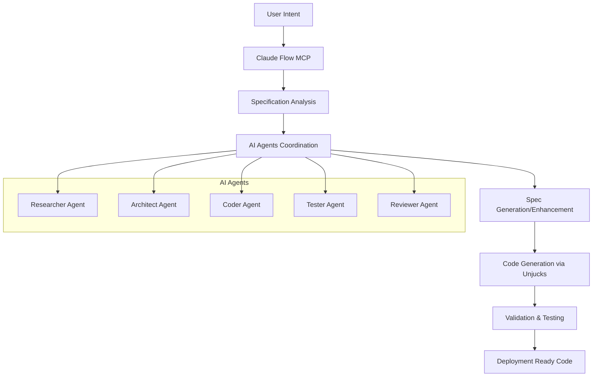

# AI-Powered Spec Workflows with MCP

Leverage Claude Flow's MCP (Model Context Protocol) integration to create intelligent, AI-driven specification workflows that enhance productivity and code quality.

## 🤖 AI Integration Architecture



## 🚀 Setting Up AI-Powered Workflows

### Prerequisites

```bash
# Install Claude Flow with MCP support
npm install -g claude-flow@alpha

# Add MCP server configuration
claude mcp add claude-flow npx claude-flow@alpha mcp start

# Initialize AI-powered project
unjucks init --ai-enabled
```

### Configuration

```typescript
// unjucks.config.ts
import { defineConfig } from 'unjucks';

export default defineConfig({
  ai: {
    // Enable AI-powered workflows
    enabled: true,
    
    // MCP configuration
    mcp: {
      server: 'claude-flow',
      timeout: 30000,
      retries: 3
    },
    
    // AI agents configuration
    agents: {
      researcher: {
        role: 'Requirements analysis and best practices research',
        capabilities: ['requirement-analysis', 'pattern-research', 'documentation']
      },
      architect: {
        role: 'System design and architecture planning',
        capabilities: ['system-design', 'pattern-application', 'scalability-planning']
      },
      coder: {
        role: 'Code generation and implementation',
        capabilities: ['code-generation', 'template-creation', 'refactoring']
      },
      tester: {
        role: 'Test strategy and validation',
        capabilities: ['test-generation', 'validation', 'quality-assurance']
      },
      reviewer: {
        role: 'Code review and optimization',
        capabilities: ['code-review', 'performance-analysis', 'security-audit']
      }
    },
    
    // Workflow orchestration
    workflows: {
      // Parallel execution for speed
      parallel: true,
      // Maximum concurrent agents
      maxConcurrency: 5,
      // Coordination memory
      sharedMemory: true
    }
  }
});
```

## 🎯 AI Workflow Patterns

### 1. Intelligent Spec Generation

Generate specifications from natural language requirements:

```bash
# Generate API specification from description
unjucks ai generate-spec \
  --description "E-commerce platform with user management, product catalog, shopping cart, and payment processing" \
  --type rest-api \
  --output ./specs/ecommerce.spec.yaml
```

**AI Workflow:**
1. **Researcher Agent**: Analyzes requirements and researches best practices
2. **Architect Agent**: Designs system architecture and data models
3. **Coder Agent**: Generates formal specification structure
4. **Reviewer Agent**: Validates and optimizes the specification

**Generated Specification:**
```yaml
# Generated by AI workflow
apiVersion: unjucks.dev/v1
kind: RestAPI
metadata:
  name: ecommerce-platform
  description: E-commerce platform with comprehensive features
  version: 1.0.0
  generated:
    by: claude-flow-mcp
    agents: [researcher, architect, coder, reviewer]
    timestamp: "2024-01-15T10:30:00Z"

spec:
  # AI-researched framework selection
  framework: express
  language: typescript
  
  # AI-designed database architecture
  database:
    type: postgresql
    entities_designed_by: architect-agent
    
  # AI-analyzed entities with relationships
  entities:
    - name: User
      designed_by: architect-agent
      reviewed_by: reviewer-agent
      fields:
        - name: id
          type: uuid
          primaryKey: true
        - name: email
          type: string
          unique: true
          validation: [email, required]
          index: true
        # ... more fields based on AI analysis
      
      relationships:
        - name: orders
          type: hasMany
          target: Order
          cascade: true
        - name: cart
          type: hasOne
          target: ShoppingCart
    
    # AI-generated product catalog structure
    - name: Product
      fields:
        - name: id
          type: uuid
          primaryKey: true
        - name: sku
          type: string
          unique: true
          index: true
        - name: name
          type: string
          validation: [required, maxLength:255]
        - name: description
          type: text
        - name: price
          type: decimal
          precision: 10
          scale: 2
          validation: [required, min:0]
        - name: inventory
          type: integer
          default: 0
        - name: category
          type: string
          index: true
        - name: images
          type: json
          default: []
  
  # AI-designed API endpoints
  endpoints:
    # User management endpoints
    - path: /auth/register
      method: POST
      description: User registration (designed by researcher-agent)
      security: none
      rateLimit: 
        windowMs: 900000  # 15 minutes
        max: 5  # 5 registration attempts per IP
      body:
        type: object
        properties:
          email: { type: string, validation: email }
          password: { type: string, validation: strongPassword }
          firstName: { type: string, validation: required }
          lastName: { type: string, validation: required }
      response:
        success:
          status: 201
          schema:
            type: object
            properties:
              user: User
              token: string
              message: string
    
    # AI-optimized product endpoints
    - path: /products
      method: GET
      description: List products with filtering (optimized by reviewer-agent)
      parameters:
        - name: page
          in: query
          type: integer
          default: 1
        - name: limit
          in: query
          type: integer
          default: 20
          max: 100
        - name: category
          in: query
          type: string
        - name: minPrice
          in: query
          type: number
        - name: maxPrice
          in: query
          type: number
        - name: search
          in: query
          type: string
      response:
        success:
          schema:
            type: object
            properties:
              data: { type: array, items: Product }
              pagination:
                type: object
                properties:
                  page: integer
                  limit: integer
                  total: integer
                  pages: integer
```

### 2. Specification Enhancement

Enhance existing specifications with AI insights:

```bash
# Analyze and enhance existing specification
unjucks ai enhance-spec ./specs/basic-api.spec.yaml \
  --focus security,performance,scalability \
  --output ./specs/enhanced-api.spec.yaml
```

**AI Enhancement Process:**
```typescript
// Researcher Agent Analysis
const securityIssues = await researcherAgent.analyze({
  specification: currentSpec,
  focus: 'security',
  checkpoints: [
    'authentication mechanisms',
    'data validation',
    'rate limiting',
    'CORS configuration',
    'SQL injection prevention'
  ]
});

// Architect Agent Improvements
const architectureEnhancements = await architectAgent.design({
  currentSpec: currentSpec,
  improvements: securityIssues,
  patterns: ['microservices', 'caching', 'load-balancing']
});

// Reviewer Agent Validation
const validatedEnhancements = await reviewerAgent.validate({
  originalSpec: currentSpec,
  enhancements: architectureEnhancements,
  criteria: ['maintainability', 'testability', 'performance']
});
```

### 3. Multi-Agent Code Generation

Coordinate multiple AI agents for comprehensive code generation:

```bash
# Generate with coordinated AI agents
unjucks ai generate-code ./specs/ecommerce.spec.yaml \
  --agents researcher,architect,coder,tester,reviewer \
  --coordination mesh \
  --output ./src
```

**Agent Coordination Pattern:**
```typescript
// AI Workflow Coordination
export const multiAgentCodeGeneration = async (spec: Specification) => {
  // Initialize swarm with mesh topology for peer-to-peer communication
  await mcpClient.swarm.init({
    topology: 'mesh',
    maxAgents: 5,
    strategy: 'balanced'
  });

  // Spawn coordinated agents
  const agents = await Promise.all([
    mcpClient.agent.spawn({
      type: 'researcher',
      capabilities: ['api-analysis', 'best-practices', 'documentation']
    }),
    mcpClient.agent.spawn({
      type: 'architect',
      capabilities: ['system-design', 'database-design', 'patterns']
    }),
    mcpClient.agent.spawn({
      type: 'coder',
      capabilities: ['typescript', 'express', 'typeorm', 'testing']
    }),
    mcpClient.agent.spawn({
      type: 'tester',
      capabilities: ['unit-testing', 'integration-testing', 'e2e-testing']
    }),
    mcpClient.agent.spawn({
      type: 'reviewer',
      capabilities: ['code-review', 'security-audit', 'performance']
    })
  ]);

  // Orchestrate parallel task execution
  const tasks = await mcpClient.task.orchestrate({
    task: `Generate complete e-commerce API from specification`,
    strategy: 'adaptive',
    maxAgents: 5,
    priority: 'high'
  });

  // Monitor progress and coordinate
  const monitor = await mcpClient.swarm.monitor({
    duration: 300, // 5 minutes
    interval: 5
  });

  return await mcpClient.task.results({
    taskId: tasks.id,
    format: 'detailed'
  });
};
```

### 4. Intelligent Testing Strategy

Generate comprehensive testing strategies with AI:

```bash
# Generate AI-powered testing suite
unjucks ai generate-tests ./specs/api.spec.yaml \
  --coverage 90 \
  --types unit,integration,e2e \
  --frameworks jest,supertest,playwright \
  --output ./tests
```

**AI Testing Workflow:**
```typescript
// Tester Agent generates comprehensive test suite
const testStrategy = await testerAgent.generateTestStrategy({
  specification: spec,
  requirements: {
    coverage: 90,
    types: ['unit', 'integration', 'e2e'],
    frameworks: ['jest', 'supertest', 'playwright']
  }
});

// Generated test structure
/*
tests/
├── unit/
│   ├── models/
│   │   ├── User.test.ts          # AI-generated unit tests
│   │   └── Product.test.ts
│   ├── services/
│   │   ├── userService.test.ts   # Business logic tests
│   │   └── productService.test.ts
│   └── controllers/
│       ├── userController.test.ts # Controller tests
│       └── productController.test.ts
├── integration/
│   ├── auth.test.ts              # Authentication flow tests
│   ├── products.test.ts          # Product API tests
│   └── orders.test.ts           # Order processing tests
├── e2e/
│   ├── user-journey.test.ts     # Complete user workflows
│   └── admin-operations.test.ts # Admin functionality
└── fixtures/
    ├── users.json               # Test data
    └── products.json
*/
```

### 5. Continuous Spec Evolution

AI-powered continuous improvement of specifications:

```bash
# Setup continuous specification monitoring
unjucks ai watch-spec ./specs/api.spec.yaml \
  --analyze-usage \
  --suggest-improvements \
  --auto-enhance
```

**Continuous Evolution Workflow:**
```typescript
const continuousEvolution = {
  // Monitor API usage patterns
  usageAnalysis: async () => {
    const metrics = await mcpClient.neural.patterns({
      pattern: 'all',
      source: 'api-logs'
    });
    
    return {
      popularEndpoints: metrics.endpoints.byUsage,
      slowQueries: metrics.database.performance,
      errorPatterns: metrics.errors.frequency,
      userBehavior: metrics.users.patterns
    };
  },

  // Generate improvement suggestions
  suggestImprovements: async (analysis) => {
    const suggestions = await researcherAgent.analyze({
      data: analysis,
      focus: 'optimization',
      criteria: ['performance', 'usability', 'scalability']
    });

    return suggestions;
  },

  // Apply improvements automatically
  autoEnhance: async (suggestions) => {
    const enhancements = await architectAgent.design({
      improvements: suggestions,
      constraints: ['backward-compatibility', 'minimal-breaking-changes']
    });

    // Generate updated specification
    return await coderAgent.updateSpec({
      currentSpec: spec,
      enhancements: enhancements,
      validation: true
    });
  }
};
```

## 🧠 Advanced AI Features

### 1. Specification Intelligence

```bash
# Analyze specification complexity and suggest optimizations
unjucks ai analyze-complexity ./specs/api.spec.yaml \
  --metrics cognitive,cyclomatic,maintainability \
  --suggest-refactoring
```

### 2. Pattern Recognition

```bash
# Detect and apply proven patterns
unjucks ai detect-patterns ./specs/api.spec.yaml \
  --apply-best-practices \
  --patterns microservices,cqrs,event-sourcing
```

### 3. Security Analysis

```bash
# AI-powered security audit
unjucks ai security-audit ./specs/api.spec.yaml \
  --scan owasp-top-10 \
  --generate-fixes \
  --output ./security-report.json
```

### 4. Performance Optimization

```bash
# AI-driven performance optimization
unjucks ai optimize-performance ./specs/api.spec.yaml \
  --analyze-bottlenecks \
  --suggest-caching \
  --database-optimization
```

## 🔧 Custom AI Workflows

Create custom AI workflows for specific needs:

```typescript
// custom-workflows/api-modernization.ts
import { defineAIWorkflow } from 'unjucks/ai';

export const apiModernizationWorkflow = defineAIWorkflow({
  name: 'api-modernization',
  description: 'Modernize legacy API specifications',
  
  agents: {
    legacy_analyzer: {
      role: 'Analyze legacy API patterns and identify modernization opportunities',
      capabilities: ['legacy-analysis', 'migration-planning', 'risk-assessment']
    },
    modern_architect: {
      role: 'Design modern API architecture',
      capabilities: ['rest-api-design', 'graphql-design', 'microservices']
    },
    migration_planner: {
      role: 'Plan migration strategy',
      capabilities: ['migration-strategy', 'backward-compatibility', 'rollback-planning']
    }
  },

  workflow: async ({ specification, options }) => {
    // Phase 1: Legacy Analysis
    const legacyAnalysis = await agents.legacy_analyzer.analyze({
      specification,
      focus: ['deprecated-patterns', 'security-issues', 'performance-bottlenecks']
    });

    // Phase 2: Modern Architecture Design
    const modernDesign = await agents.modern_architect.design({
      currentSpec: specification,
      analysis: legacyAnalysis,
      targetPatterns: options.patterns || ['rest', 'microservices', 'async']
    });

    // Phase 3: Migration Planning
    const migrationPlan = await agents.migration_planner.plan({
      from: specification,
      to: modernDesign,
      strategy: options.strategy || 'incremental',
      timeline: options.timeline || '6-months'
    });

    return {
      analysis: legacyAnalysis,
      modernSpec: modernDesign,
      migrationPlan: migrationPlan,
      estimatedEffort: migrationPlan.effort,
      risks: migrationPlan.risks,
      benefits: migrationPlan.benefits
    };
  }
});
```

**Usage:**
```bash
# Run custom modernization workflow
unjucks ai run-workflow api-modernization ./specs/legacy-api.spec.yaml \
  --patterns rest,microservices \
  --strategy incremental \
  --timeline 6-months
```

## 📊 AI Performance Metrics

Monitor AI workflow performance and effectiveness:

```typescript
// AI workflow metrics
const aiMetrics = await mcpClient.performance.report({
  format: 'detailed',
  timeframe: '7d',
  components: ['ai-workflows', 'agent-coordination', 'spec-generation']
});

console.log({
  specGenerationTime: aiMetrics.ai.specGeneration.averageTime, // 45 seconds
  codeGenerationTime: aiMetrics.ai.codeGeneration.averageTime, // 2.3 minutes
  testGenerationTime: aiMetrics.ai.testGeneration.averageTime, // 1.8 minutes
  overallAccuracy: aiMetrics.ai.accuracy.overall, // 94.2%
  userSatisfaction: aiMetrics.ai.satisfaction.score, // 4.7/5
  tokensUsed: aiMetrics.ai.tokens.total, // 145,230
  costEfficiency: aiMetrics.ai.cost.perGeneration // $0.23
});
```

## 🎛️ Advanced Configuration

### Multi-Model Support

```typescript
// unjucks.config.ts
export default defineConfig({
  ai: {
    models: {
      // Primary model for complex reasoning
      primary: {
        provider: 'anthropic',
        model: 'claude-3.5-sonnet',
        temperature: 0.1,
        maxTokens: 8192
      },
      
      // Fast model for simple tasks
      fast: {
        provider: 'anthropic',
        model: 'claude-3-haiku',
        temperature: 0.0,
        maxTokens: 4096
      },
      
      // Specialized models for specific tasks
      specialized: {
        codeGeneration: {
          provider: 'anthropic',
          model: 'claude-3.5-sonnet',
          temperature: 0.0,
          maxTokens: 8192
        },
        documentation: {
          provider: 'anthropic',
          model: 'claude-3-sonnet',
          temperature: 0.3,
          maxTokens: 4096
        }
      }
    },
    
    // Model selection strategy
    selection: {
      strategy: 'adaptive', // 'adaptive' | 'cost-optimized' | 'performance'
      fallback: 'fast'
    }
  }
});
```

### Memory and Learning

```typescript
export default defineConfig({
  ai: {
    memory: {
      // Enable cross-session learning
      persistent: true,
      
      // Memory storage
      storage: {
        type: 'vector', // 'vector' | 'graph' | 'hybrid'
        dimensions: 1536,
        similarity: 'cosine'
      },
      
      // Learning configuration
      learning: {
        enabled: true,
        feedbackLoop: true,
        adaptationRate: 0.1,
        
        // Pattern recognition
        patterns: {
          successful: true,
          failed: true,
          userPreferences: true
        }
      }
    }
  }
});
```

## 🚦 Best Practices

### 1. Agent Coordination

```typescript
// Effective agent coordination patterns
const coordinationBestPractices = {
  // Clear role separation
  agentRoles: {
    researcher: 'Analysis and research only',
    architect: 'Design and patterns only',
    coder: 'Implementation only',
    tester: 'Testing strategy only',
    reviewer: 'Quality assurance only'
  },
  
  // Effective communication
  communication: {
    // Use shared memory for coordination
    sharedContext: true,
    // Regular synchronization points
    syncInterval: 30, // seconds
    // Clear handoff protocols
    handoffProtocols: true
  },
  
  // Quality gates
  qualityGates: {
    // Validation at each step
    stepValidation: true,
    // Cross-agent review
    crossReview: true,
    // Final quality check
    finalValidation: true
  }
};
```

### 2. Cost Optimization

```typescript
const costOptimization = {
  // Smart model selection
  modelSelection: {
    // Use fast models for simple tasks
    simpleTasksModel: 'claude-3-haiku',
    // Use powerful models for complex reasoning
    complexTasksModel: 'claude-3.5-sonnet',
    // Cache frequent operations
    caching: true
  },
  
  // Efficient prompting
  promptEngineering: {
    // Specific, focused prompts
    specificity: 'high',
    // Reuse prompt templates
    templateReuse: true,
    // Optimize token usage
    tokenOptimization: true
  },
  
  // Workflow efficiency
  workflowOptimization: {
    // Parallel execution where possible
    parallelization: true,
    // Early termination on errors
    earlyTermination: true,
    // Result caching
    resultCaching: true
  }
};
```

### 3. Quality Assurance

```typescript
const qualityAssurance = {
  // Validation at every step
  validation: {
    // Spec validation before generation
    specValidation: true,
    // Code validation after generation
    codeValidation: true,
    // Test validation for completeness
    testValidation: true
  },
  
  // Human review points
  humanReview: {
    // Critical decisions
    architecturalDecisions: true,
    // Security implementations
    securityCode: true,
    // Performance-critical paths
    performanceCritical: true
  },
  
  // Continuous improvement
  continuousImprovement: {
    // Feedback collection
    feedbackCollection: true,
    // Performance monitoring
    performanceMonitoring: true,
    // Model fine-tuning
    modelTuning: false // Enterprise feature
  }
};
```

---

*Next: Learn how to [migrate from traditional development](./migration-guide.md) to spec-driven workflows.*