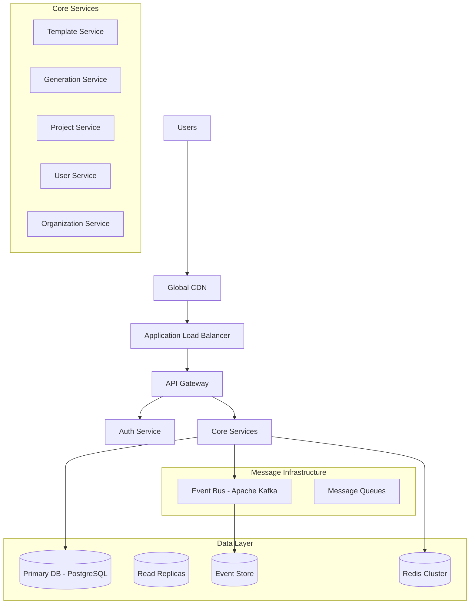
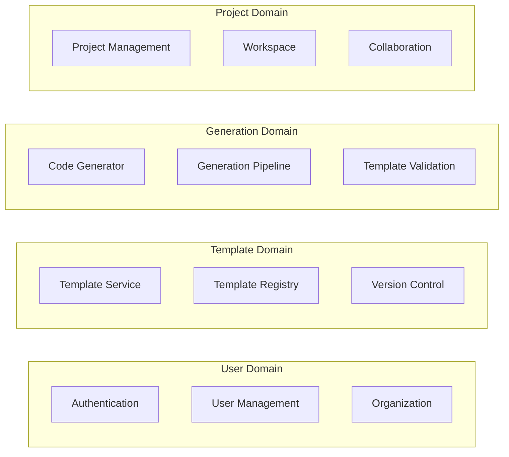

# Unjucks Enterprise SaaS Architecture

## Executive Summary

This document outlines the comprehensive enterprise architecture for Unjucks Enterprise SaaS, a multi-tenant code generation platform built on modern cloud-native principles. The architecture emphasizes scalability, security, resilience, and operational excellence through microservices, event-driven patterns, and zero-trust security.

## Table of Contents

1. [Architecture Overview](#architecture-overview)
2. [Multi-Tenant Database Architecture](#multi-tenant-database-architecture)
3. [Microservices Architecture](#microservices-architecture)
4. [Event-Driven Architecture](#event-driven-architecture)
5. [CQRS and Event Sourcing](#cqrs-and-event-sourcing)
6. [Distributed Caching Strategy](#distributed-caching-strategy)
7. [Container Orchestration](#container-orchestration)
8. [CI/CD Pipeline with GitOps](#cicd-pipeline-with-gitops)
9. [Zero-Trust Security Model](#zero-trust-security-model)
10. [Global CDN and Edge Computing](#global-cdn-and-edge-computing)
11. [Architecture Decision Records](#architecture-decision-records)

## Architecture Overview

### High-Level Architecture



### Quality Attributes

| Attribute | Target | Justification |
|-----------|---------|---------------|
| **Availability** | 99.95% | Multi-region deployment with auto-failover |
| **Scalability** | 10K+ concurrent users | Horizontal scaling with Kubernetes |
| **Performance** | < 200ms API response | Distributed caching and CDN |
| **Security** | Zero-trust model | Defense in depth with mTLS |
| **Compliance** | SOC2, GDPR | Audit trails and data sovereignty |

## Multi-Tenant Database Architecture

### Tenant Isolation Strategy

We implement a **hybrid multi-tenancy** approach combining row-level security (RLS) with database-per-tier for enterprise customers.

#### Database Schema Design

```sql
-- Core tenant management
CREATE TABLE tenants (
    id UUID PRIMARY KEY DEFAULT gen_random_uuid(),
    slug VARCHAR(63) UNIQUE NOT NULL,
    tier tenant_tier NOT NULL DEFAULT 'starter',
    region VARCHAR(10) NOT NULL,
    created_at TIMESTAMPTZ DEFAULT NOW(),
    updated_at TIMESTAMPTZ DEFAULT NOW()
);

-- Row-level security policies
CREATE POLICY tenant_isolation ON templates 
    FOR ALL TO application_user
    USING (tenant_id = current_setting('app.current_tenant_id')::UUID);

-- Database-per-enterprise-tenant for large customers
CREATE DATABASE tenant_enterprise_acme;
```

#### Multi-Tenant Data Access Patterns

```typescript
// Tenant context middleware
export class TenantContextMiddleware {
  async use(req: Request, res: Response, next: NextFunction) {
    const tenantId = this.extractTenantId(req);
    
    // Set tenant context for RLS
    await this.dbConnection.query(
      'SET app.current_tenant_id = $1', 
      [tenantId]
    );
    
    req.context = { tenantId };
    next();
  }
}
```

#### Data Sovereignty and Compliance

- **Regional data residency**: EU data stays in EU regions
- **Encryption at rest**: AES-256 with customer-managed keys
- **Audit logging**: All data access logged with tenant context
- **Data retention policies**: Configurable per tenant tier

### Performance Optimization

- **Connection pooling**: PgBouncer with tenant-aware routing
- **Read replicas**: Geography-based read scaling
- **Partitioning**: Time-based partitioning for large tables
- **Indexes**: Tenant-aware composite indexes

## Microservices Architecture

### Service Decomposition

The platform is decomposed into domain-driven microservices following bounded context principles:

#### Core Domain Services



#### API Gateway Pattern

**Kong API Gateway** serves as the single entry point with:

```yaml
# Kong Gateway Configuration
services:
- name: template-service
  url: http://template-service:3000
  plugins:
  - name: rate-limiting
    config:
      minute: 1000
  - name: oauth2
  - name: request-transformer
    config:
      add:
        headers:
        - "X-Tenant-ID:$(headers.x-tenant-id)"

routes:
- service: template-service
  paths:
  - "/api/v1/templates"
  methods:
  - GET
  - POST
  - PUT
  - DELETE
```

#### Service Communication Patterns

1. **Synchronous**: REST APIs for real-time operations
2. **Asynchronous**: Event-driven for cross-service coordination
3. **Service Mesh**: Istio for secure service-to-service communication

```typescript
// Service registry and discovery
@Injectable()
export class ServiceDiscovery {
  async getService(serviceName: string): Promise<ServiceEndpoint> {
    return this.consul.health.service({
      service: serviceName,
      passing: true
    });
  }
}
```

### Resilience Patterns

- **Circuit Breaker**: Hystrix pattern implementation
- **Retry with Exponential Backoff**: Automatic retry logic
- **Bulkhead**: Resource isolation between tenants
- **Timeout**: Configurable request timeouts

## Event-Driven Architecture

### Event Streaming Platform

**Apache Kafka** serves as the backbone for event streaming with the following topology:

```yaml
# Kafka Topic Configuration
topics:
  template.events:
    partitions: 12
    replication: 3
    config:
      retention.ms: 604800000  # 7 days
  
  generation.events:
    partitions: 8
    replication: 3
    config:
      retention.ms: 2592000000  # 30 days
  
  user.events:
    partitions: 4
    replication: 3
    config:
      retention.ms: 31536000000  # 1 year
```

#### Event Schema Registry

Using **Confluent Schema Registry** for event schema evolution:

```json
{
  "type": "record",
  "name": "TemplateGeneratedEvent",
  "namespace": "com.unjucks.events",
  "fields": [
    {"name": "eventId", "type": "string"},
    {"name": "tenantId", "type": "string"},
    {"name": "userId", "type": "string"},
    {"name": "templateId", "type": "string"},
    {"name": "generatedFiles", "type": {"type": "array", "items": "string"}},
    {"name": "timestamp", "type": "long"},
    {"name": "metadata", "type": {"type": "map", "values": "string"}}
  ]
}
```

#### Event Processing Patterns

```typescript
// Event handler with idempotency
@EventHandler(TemplateGeneratedEvent)
export class TemplateAnalyticsHandler {
  async handle(event: TemplateGeneratedEvent): Promise<void> {
    const idempotencyKey = `analytics-${event.eventId}`;
    
    if (await this.cache.exists(idempotencyKey)) {
      return; // Already processed
    }
    
    await this.analyticsService.recordGeneration(event);
    await this.cache.setex(idempotencyKey, 3600, 'processed');
  }
}
```

### Message Queues for Reliable Processing

**Redis Streams** and **AWS SQS** for different use cases:

- **Redis Streams**: High-throughput, low-latency processing
- **AWS SQS**: Guaranteed delivery with DLQ support

## CQRS and Event Sourcing

### Command Query Responsibility Segregation

Separate read and write models for optimal performance:

#### Command Side (Write Model)

```typescript
// Aggregate root with event sourcing
export class Template extends AggregateRoot {
  constructor(
    private id: TemplateId,
    private name: string,
    private tenantId: TenantId
  ) {
    super();
  }
  
  updateContent(content: string, userId: UserId): void {
    const event = new TemplateContentUpdatedEvent(
      this.id,
      content,
      userId,
      this.tenantId
    );
    
    this.applyEvent(event);
  }
  
  private applyTemplateContentUpdatedEvent(
    event: TemplateContentUpdatedEvent
  ): void {
    // Update internal state
    this.content = event.content;
    this.lastModified = event.timestamp;
  }
}
```

#### Query Side (Read Model)

```typescript
// Read model for optimized queries
export class TemplateReadModel {
  constructor(
    public readonly id: string,
    public readonly name: string,
    public readonly content: string,
    public readonly tags: string[],
    public readonly usage_count: number,
    public readonly last_used: Date,
    public readonly tenant_id: string
  ) {}
}

// Materialized view in PostgreSQL
CREATE MATERIALIZED VIEW template_analytics AS
SELECT 
  t.id,
  t.name,
  t.tenant_id,
  COUNT(g.id) as usage_count,
  MAX(g.created_at) as last_used,
  AVG(g.generation_time_ms) as avg_generation_time
FROM templates t
LEFT JOIN generations g ON t.id = g.template_id
GROUP BY t.id, t.name, t.tenant_id;
```

### Event Store Implementation

Using **EventStore DB** for event persistence:

```typescript
// Event store repository
export class EventStoreRepository<T extends AggregateRoot> {
  async save(aggregate: T): Promise<void> {
    const events = aggregate.getUncommittedEvents();
    const streamName = `${aggregate.constructor.name}-${aggregate.getId()}`;
    
    await this.eventStore.appendToStream(streamName, events);
    aggregate.markEventsAsCommitted();
  }
  
  async getById(id: string): Promise<T> {
    const streamName = `${this.aggregateType.name}-${id}`;
    const events = await this.eventStore.readStreamEvents(streamName);
    
    return this.aggregateFactory.createFromEvents(events);
  }
}
```

## Distributed Caching Strategy

### Redis Cluster Architecture

Multi-tier caching strategy with Redis:

```yaml
# Redis Cluster Configuration
redis-cluster:
  nodes: 6
  masters: 3
  replicas: 1
  memory: 16GB per node
  persistence: RDB + AOF
  
  cache-tiers:
    L1: # Application-level cache
      - Local in-memory cache (1GB)
      - TTL: 60 seconds
    
    L2: # Distributed cache
      - Redis cluster
      - TTL: 3600 seconds (1 hour)
    
    L3: # Persistent cache
      - Database query cache
      - TTL: 86400 seconds (24 hours)
```

#### Caching Patterns

```typescript
// Multi-level cache implementation
export class CacheService {
  async get<T>(key: string): Promise<T | null> {
    // L1: Memory cache
    let value = this.memoryCache.get(key);
    if (value) return value;
    
    // L2: Redis cache
    value = await this.redisCache.get(key);
    if (value) {
      this.memoryCache.set(key, value, 60);
      return value;
    }
    
    return null;
  }
  
  async set(key: string, value: any, ttl: number): Promise<void> {
    // Write-through caching
    await this.redisCache.setex(key, ttl, value);
    this.memoryCache.set(key, value, Math.min(ttl, 60));
  }
}
```

#### Cache Invalidation Strategy

- **Event-driven invalidation**: Cache invalidation through events
- **TTL-based expiration**: Automatic expiration for time-sensitive data
- **Manual purging**: Admin tools for cache management

## Container Orchestration

### Kubernetes Architecture

Production-ready Kubernetes setup with:

#### Cluster Configuration

```yaml
# EKS Cluster Configuration
apiVersion: v1
kind: ConfigMap
metadata:
  name: cluster-config
data:
  cluster.yaml: |
    apiVersion: eks.amazonaws.com/v1
    kind: Cluster
    metadata:
      name: unjucks-production
      region: us-west-2
    spec:
      version: "1.28"
      nodeGroups:
      - name: general-workers
        instanceType: m5.xlarge
        asgDesiredSize: 3
        asgMaxSize: 10
      - name: compute-workers
        instanceType: c5.2xlarge
        asgDesiredSize: 2
        asgMaxSize: 8
        taints:
        - key: workload-type
          value: compute-intensive
          effect: NoSchedule
```

#### Service Deployment

```yaml
# Template Service Deployment
apiVersion: apps/v1
kind: Deployment
metadata:
  name: template-service
spec:
  replicas: 3
  selector:
    matchLabels:
      app: template-service
  template:
    spec:
      containers:
      - name: template-service
        image: unjucks/template-service:v1.2.0
        ports:
        - containerPort: 3000
        env:
        - name: DATABASE_URL
          valueFrom:
            secretKeyRef:
              name: db-credentials
              key: url
        resources:
          requests:
            memory: "256Mi"
            cpu: "250m"
          limits:
            memory: "512Mi"
            cpu: "500m"
        livenessProbe:
          httpGet:
            path: /health
            port: 3000
          initialDelaySeconds: 30
        readinessProbe:
          httpGet:
            path: /ready
            port: 3000
          initialDelaySeconds: 5
```

#### Auto-scaling Configuration

```yaml
# Horizontal Pod Autoscaler
apiVersion: autoscaling/v2
kind: HorizontalPodAutoscaler
metadata:
  name: template-service-hpa
spec:
  scaleTargetRef:
    apiVersion: apps/v1
    kind: Deployment
    name: template-service
  minReplicas: 3
  maxReplicas: 20
  metrics:
  - type: Resource
    resource:
      name: cpu
      target:
        type: Utilization
        averageUtilization: 70
  - type: Resource
    resource:
      name: memory
      target:
        type: Utilization
        averageUtilization: 80
```

### Service Mesh with Istio

```yaml
# Istio Service Mesh Configuration
apiVersion: install.istio.io/v1alpha1
kind: IstioOperator
metadata:
  name: control-plane
spec:
  components:
    pilot:
      k8s:
        resources:
          requests:
            cpu: 500m
            memory: 2048Mi
    proxy:
      k8s:
        resources:
          requests:
            cpu: 100m
            memory: 128Mi
          limits:
            cpu: 200m
            memory: 256Mi
  meshConfig:
    defaultConfig:
      proxyStatsMatcher:
        inclusionRegexps:
        - ".*outlier_detection.*"
        - ".*circuit_breakers.*"
        - ".*upstream_rq_retry.*"
```

## CI/CD Pipeline with GitOps

### GitOps Workflow with ArgoCD

```yaml
# ArgoCD Application
apiVersion: argoproj.io/v1alpha1
kind: Application
metadata:
  name: unjucks-template-service
  namespace: argocd
spec:
  project: unjucks
  source:
    repoURL: https://github.com/unjucks/k8s-manifests
    targetRevision: main
    path: template-service
  destination:
    server: https://kubernetes.default.svc
    namespace: production
  syncPolicy:
    automated:
      prune: true
      selfHeal: true
    syncOptions:
    - CreateNamespace=true
```

#### Multi-Environment Pipeline

```yaml
# GitHub Actions CI/CD
name: Deploy to Production
on:
  push:
    branches: [main]

jobs:
  test:
    runs-on: ubuntu-latest
    steps:
    - uses: actions/checkout@v3
    - name: Run tests
      run: |
        npm test
        npm run test:e2e
  
  security-scan:
    runs-on: ubuntu-latest
    steps:
    - uses: actions/checkout@v3
    - name: Run security scan
      uses: securecodewarrior/github-action-security-scan@v1
  
  build-and-push:
    needs: [test, security-scan]
    runs-on: ubuntu-latest
    steps:
    - name: Build and push to ECR
      uses: aws-actions/amazon-ecr-login@v1
    - name: Update GitOps repo
      run: |
        # Update image tags in k8s manifests
        git clone https://github.com/unjucks/k8s-manifests
        cd k8s-manifests
        # Update image tag
        sed -i "s|image: unjucks/template-service:.*|image: unjucks/template-service:${GITHUB_SHA}|" template-service/deployment.yaml
        git commit -am "Update template-service to ${GITHUB_SHA}"
        git push
```

#### Progressive Deployment Strategy

```yaml
# Argo Rollouts Canary Deployment
apiVersion: argoproj.io/v1alpha1
kind: Rollout
metadata:
  name: template-service
spec:
  replicas: 10
  strategy:
    canary:
      steps:
      - setWeight: 10
      - pause: {duration: 1m}
      - setWeight: 20
      - pause: {duration: 2m}
      - setWeight: 50
      - pause: {duration: 5m}
      - setWeight: 100
      canaryService: template-service-canary
      stableService: template-service-stable
      trafficRouting:
        istio:
          virtualService: template-service-vs
          destinationRule: template-service-dr
```

## Zero-Trust Security Model

### Identity and Access Management

#### Multi-Factor Authentication

```typescript
// MFA implementation with TOTP
export class MFAService {
  async generateSecretKey(userId: string): Promise<string> {
    const secret = speakeasy.generateSecret({
      name: `Unjucks (${userId})`,
      issuer: 'Unjucks Enterprise'
    });
    
    await this.userService.updateMFASecret(userId, secret.base32);
    return secret.otpauth_url;
  }
  
  async verifyToken(userId: string, token: string): Promise<boolean> {
    const secret = await this.userService.getMFASecret(userId);
    
    return speakeasy.totp.verify({
      secret,
      token,
      window: 2,  // Allow 60-second window
      time: Math.floor(Date.now() / 1000)
    });
  }
}
```

#### Role-Based Access Control (RBAC)

```yaml
# Kubernetes RBAC
apiVersion: rbac.authorization.k8s.io/v1
kind: Role
metadata:
  namespace: production
  name: template-service-operator
rules:
- apiGroups: [""]
  resources: ["pods", "services", "configmaps"]
  verbs: ["get", "list", "watch", "create", "update", "patch"]
- apiGroups: ["apps"]
  resources: ["deployments"]
  verbs: ["get", "list", "watch", "create", "update", "patch"]

---
apiVersion: rbac.authorization.k8s.io/v1
kind: RoleBinding
metadata:
  name: template-service-binding
  namespace: production
subjects:
- kind: ServiceAccount
  name: template-service
  namespace: production
roleRef:
  kind: Role
  name: template-service-operator
  apiGroup: rbac.authorization.k8s.io
```

### Network Security

#### Zero-Trust Network Policies

```yaml
# Istio Security Policies
apiVersion: security.istio.io/v1beta1
kind: PeerAuthentication
metadata:
  name: default
  namespace: production
spec:
  mtls:
    mode: STRICT

---
apiVersion: security.istio.io/v1beta1
kind: AuthorizationPolicy
metadata:
  name: template-service-authz
  namespace: production
spec:
  selector:
    matchLabels:
      app: template-service
  rules:
  - from:
    - source:
        principals: ["cluster.local/ns/production/sa/api-gateway"]
    to:
    - operation:
        methods: ["GET", "POST", "PUT", "DELETE"]
        paths: ["/api/v1/templates/*"]
```

#### Security Monitoring

```typescript
// Security event monitoring
export class SecurityMonitor {
  @EventHandler(AuthenticationFailedEvent)
  async handleAuthFailure(event: AuthenticationFailedEvent): Promise<void> {
    const attempts = await this.redis.incr(`auth_failures:${event.clientIP}`);
    
    if (attempts > 5) {
      await this.blockIP(event.clientIP);
      await this.alertSecurityTeam(event);
    }
  }
  
  @EventHandler(UnauthorizedAccessEvent)
  async handleUnauthorizedAccess(event: UnauthorizedAccessEvent): Promise<void> {
    // Log security event
    await this.securityLogger.warn('Unauthorized access attempt', {
      userId: event.userId,
      resource: event.resource,
      timestamp: event.timestamp,
      metadata: event.metadata
    });
  }
}
```

### Data Protection

#### Encryption at Rest and in Transit

- **Database encryption**: Transparent Data Encryption (TDE)
- **File encryption**: AES-256 encryption for template files
- **TLS 1.3**: All communication encrypted in transit
- **mTLS**: Service-to-service authentication and encryption

#### Data Loss Prevention (DLP)

```typescript
// DLP scanning for sensitive data
export class DLPScanner {
  async scanTemplateContent(content: string): Promise<ScanResult> {
    const patterns = [
      /\b\d{4}[- ]?\d{4}[- ]?\d{4}[- ]?\d{4}\b/, // Credit card numbers
      /\b\d{3}-\d{2}-\d{4}\b/, // SSN
      /[a-zA-Z0-9._%+-]+@[a-zA-Z0-9.-]+\.[a-zA-Z]{2,}/, // Email addresses
    ];
    
    const violations = patterns
      .map((pattern, index) => ({
        pattern: index,
        matches: content.match(pattern) || []
      }))
      .filter(result => result.matches.length > 0);
    
    return {
      safe: violations.length === 0,
      violations,
      recommendation: violations.length > 0 ? 'Remove sensitive data' : 'Content approved'
    };
  }
}
```

## Global CDN and Edge Computing

### Content Delivery Network Architecture

#### CloudFlare CDN Configuration

```javascript
// CloudFlare Workers for edge processing
export default {
  async fetch(request, env) {
    const url = new URL(request.url);
    
    // Route static assets to CDN
    if (url.pathname.startsWith('/static/')) {
      return handleStaticAsset(request);
    }
    
    // Route API requests to nearest edge
    if (url.pathname.startsWith('/api/')) {
      return handleAPIRequest(request, env);
    }
    
    return fetch(request);
  }
};

// Edge API processing
async function handleAPIRequest(request, env) {
  const cacheKey = `api:${request.url}`;
  const cachedResponse = await env.KV.get(cacheKey);
  
  if (cachedResponse) {
    return new Response(cachedResponse, {
      headers: { 'Content-Type': 'application/json' }
    });
  }
  
  // Forward to origin with regional routing
  const region = request.cf.colo;
  const originUrl = getOriginForRegion(region);
  
  const response = await fetch(originUrl + request.url);
  
  // Cache response at edge
  if (response.ok) {
    await env.KV.put(cacheKey, await response.text(), {
      expirationTtl: 300 // 5 minutes
    });
  }
  
  return response;
}
```

#### Regional Deployment Strategy

```yaml
# Multi-region deployment configuration
regions:
  us-east-1:
    primary: true
    services: [api-gateway, template-service, generation-service]
    database: primary
    cache: redis-cluster-east
  
  us-west-2:
    primary: false
    services: [api-gateway, template-service, generation-service]
    database: read-replica
    cache: redis-cluster-west
  
  eu-west-1:
    primary: false
    services: [api-gateway, template-service, generation-service]
    database: read-replica
    cache: redis-cluster-eu
    compliance: [GDPR]
  
  ap-southeast-1:
    primary: false
    services: [api-gateway, template-service]
    database: read-replica
    cache: redis-cluster-asia
```

### Edge Computing for Template Generation

```typescript
// Edge-based template processing
export class EdgeTemplateProcessor {
  async processTemplate(
    templateId: string, 
    variables: Record<string, any>,
    region: string
  ): Promise<ProcessedTemplate> {
    
    // Check edge cache first
    const cacheKey = `template:${templateId}:${hashVariables(variables)}`;
    const cached = await this.edgeCache.get(cacheKey);
    
    if (cached) {
      return JSON.parse(cached);
    }
    
    // Fetch template from nearest region
    const template = await this.getTemplate(templateId, region);
    
    // Process at edge for low latency
    const processed = await this.nunjucks.render(template.content, variables);
    
    // Cache result
    await this.edgeCache.setex(cacheKey, 900, JSON.stringify(processed));
    
    return processed;
  }
}
```

## Architecture Decision Records

### ADR-001: Multi-Tenant Database Strategy

**Status**: Accepted

**Context**: Need to support multiple tenancy models while ensuring data isolation and compliance.

**Decision**: Implement hybrid multi-tenancy with RLS for standard tenants and database-per-tenant for enterprise customers.

**Consequences**:
- ✅ Flexible tenancy models
- ✅ Strong data isolation for enterprise
- ✅ Cost-effective for smaller tenants
- ❌ Increased operational complexity

### ADR-002: Event Sourcing Implementation

**Status**: Accepted

**Context**: Need reliable audit trails and ability to rebuild state from events.

**Decision**: Implement event sourcing for core aggregates (Templates, Projects, Organizations).

**Consequences**:
- ✅ Complete audit trail
- ✅ Temporal queries possible
- ✅ Better debugging capabilities
- ❌ Increased storage requirements
- ❌ Additional complexity for developers

### ADR-003: Service Mesh Adoption

**Status**: Accepted

**Context**: Need secure service-to-service communication and traffic management.

**Decision**: Adopt Istio service mesh for production workloads.

**Consequences**:
- ✅ Automatic mTLS between services
- ✅ Advanced traffic management
- ✅ Observability out-of-the-box
- ❌ Additional resource overhead
- ❌ Learning curve for operations team

### ADR-004: Edge Computing Strategy

**Status**: Accepted

**Context**: Global user base requires low-latency template processing.

**Decision**: Implement edge computing with CloudFlare Workers for template processing.

**Consequences**:
- ✅ Reduced latency for global users
- ✅ Better user experience
- ✅ Reduced origin server load
- ❌ Limited processing capabilities at edge
- ❌ Additional deployment complexity

## Performance Benchmarks

### Target Performance Metrics

| Metric | Target | Measurement Method |
|--------|--------|--------------------|
| **API Response Time** | < 200ms P95 | Application Performance Monitoring |
| **Template Generation** | < 500ms P95 | Custom metrics in generation service |
| **Database Query Time** | < 50ms P95 | PostgreSQL slow query log |
| **Cache Hit Ratio** | > 85% | Redis metrics |
| **CDN Cache Hit Ratio** | > 95% | CloudFlare analytics |

### Load Testing Results

```javascript
// K6 load testing script
import http from 'k6/http';
import { check } from 'k6';

export let options = {
  stages: [
    { duration: '2m', target: 100 },
    { duration: '5m', target: 500 },
    { duration: '2m', target: 1000 },
    { duration: '5m', target: 1000 },
    { duration: '2m', target: 0 },
  ],
};

export default function() {
  let response = http.get('https://api.unjucks.com/api/v1/templates');
  
  check(response, {
    'status is 200': (r) => r.status === 200,
    'response time < 200ms': (r) => r.timings.duration < 200,
  });
}
```

## Monitoring and Observability

### Metrics Collection

```yaml
# Prometheus configuration
global:
  scrape_interval: 15s

scrape_configs:
- job_name: 'kubernetes-pods'
  kubernetes_sd_configs:
  - role: pod
  relabel_configs:
  - source_labels: [__meta_kubernetes_pod_annotation_prometheus_io_scrape]
    action: keep
    regex: true

- job_name: 'istio-mesh'
  kubernetes_sd_configs:
  - role: endpoints
  relabel_configs:
  - source_labels: [__meta_kubernetes_service_name, __meta_kubernetes_endpoint_port_name]
    action: keep
    regex: istio-proxy;.*-http-monitoring
```

### Alerting Rules

```yaml
# Prometheus alerting rules
groups:
- name: unjucks.rules
  rules:
  - alert: HighErrorRate
    expr: rate(http_requests_total{status=~"5.."}[5m]) > 0.1
    for: 5m
    labels:
      severity: critical
    annotations:
      summary: High error rate detected
      
  - alert: DatabaseConnectionsHigh
    expr: pg_stat_database_numbackends > 80
    for: 2m
    labels:
      severity: warning
    annotations:
      summary: Database connection pool utilization high
```

### Distributed Tracing

```typescript
// OpenTelemetry tracing setup
import { getNodeSDK } from '@opentelemetry/auto-instrumentations-node';
import { Resource } from '@opentelemetry/resources';
import { SemanticResourceAttributes } from '@opentelemetry/semantic-conventions';

const sdk = getNodeSDK({
  resource: new Resource({
    [SemanticResourceAttributes.SERVICE_NAME]: 'template-service',
    [SemanticResourceAttributes.SERVICE_VERSION]: process.env.SERVICE_VERSION,
  }),
  traceExporter: new JaegerExporter({
    endpoint: 'http://jaeger-collector:14268/api/traces',
  }),
});

sdk.start();
```

## Disaster Recovery and Business Continuity

### Backup Strategy

- **Database backups**: Continuous backup with point-in-time recovery
- **File storage backups**: Cross-region replication for template files
- **Configuration backups**: GitOps repository backups
- **Secrets backups**: Encrypted backups of secrets and certificates

### Recovery Time Objectives

| Component | RTO | RPO | Strategy |
|-----------|-----|-----|----------|
| **Database** | 15 minutes | 5 minutes | Hot standby with streaming replication |
| **Application** | 5 minutes | 0 minutes | Blue-green deployment |
| **File Storage** | 10 minutes | 1 hour | Cross-region sync |
| **Secrets** | 30 minutes | 24 hours | Manual restore from encrypted backup |

## Compliance and Governance

### Regulatory Compliance

- **SOC 2 Type II**: Annual compliance audit
- **GDPR**: Data protection and privacy compliance
- **ISO 27001**: Information security management
- **PCI DSS**: Payment card industry compliance (if applicable)

### Data Governance

```typescript
// Data classification and handling
export enum DataClassification {
  PUBLIC = 'public',
  INTERNAL = 'internal',
  CONFIDENTIAL = 'confidential',
  RESTRICTED = 'restricted'
}

export class DataGovernanceService {
  async classifyData(content: string): Promise<DataClassification> {
    // Automated data classification logic
    if (this.containsPII(content)) {
      return DataClassification.RESTRICTED;
    }
    
    if (this.containsBusinessSecrets(content)) {
      return DataClassification.CONFIDENTIAL;
    }
    
    return DataClassification.INTERNAL;
  }
  
  async applyRetentionPolicy(dataId: string, classification: DataClassification): Promise<void> {
    const retentionPeriod = this.getRetentionPeriod(classification);
    await this.scheduleDataDeletion(dataId, retentionPeriod);
  }
}
```

## Cost Optimization

### Resource Optimization Strategies

1. **Right-sizing**: Regular analysis of resource utilization
2. **Auto-scaling**: Demand-based scaling to optimize costs
3. **Reserved instances**: Long-term commitments for predictable workloads
4. **Spot instances**: Cost-effective compute for batch processing

### Cost Monitoring

```yaml
# Cost allocation tags
tags:
  Environment: production
  Team: platform
  Service: template-service
  CostCenter: engineering
  Project: unjucks-enterprise
```

## Future Architecture Evolution

### Planned Enhancements

1. **AI/ML Integration**: Template recommendation engine
2. **Serverless Computing**: Function-as-a-Service for template processing
3. **GraphQL Federation**: Unified API layer across microservices
4. **Blockchain Integration**: Template versioning and ownership tracking

### Technology Roadmap

| Quarter | Enhancement | Impact |
|---------|-------------|--------|
| **Q1 2025** | AI template recommendations | Improved user experience |
| **Q2 2025** | GraphQL federation | Simplified API consumption |
| **Q3 2025** | Serverless processing | Reduced operational costs |
| **Q4 2025** | Advanced analytics | Better business insights |

---

## Conclusion

This enterprise architecture provides a robust, scalable, and secure foundation for Unjucks Enterprise SaaS. The design emphasizes:

- **Scalability**: Horizontal scaling with Kubernetes and microservices
- **Security**: Zero-trust model with comprehensive security controls
- **Reliability**: High availability with disaster recovery capabilities
- **Performance**: Global CDN and edge computing for optimal user experience
- **Compliance**: Built-in compliance controls for enterprise requirements

The architecture supports the current requirements while providing flexibility for future enhancements and growth.

---

*Document Version: 1.0*  
*Last Updated: September 6, 2025*  
*Authors: Enterprise Architecture Team*  
*Reviewers: CTO, Security Team, Platform Team*