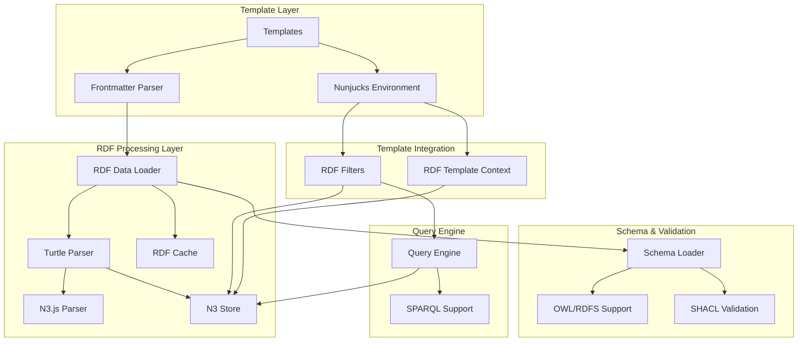

# N3.js Turtle/RDF Integration Architecture Design

## Executive Summary

This document outlines the comprehensive architecture for integrating N3.js Turtle/RDF support into the Unjucks template system. The design enables templates to load, query, and render semantic data while maintaining clean separation of concerns and optimal performance through strategic caching.

## Architecture Overview

### Core Components



### Integration Points

1. **Frontmatter Configuration**: Extended frontmatter supports RDF data sources
2. **Template Context**: Enhanced Nunjucks context with RDF-specific variables and functions
3. **Filter System**: Specialized RDF filters for querying and formatting semantic data
4. **Caching Layer**: Multi-level caching for parsed RDF data and query results
5. **Type System**: Comprehensive TypeScript definitions for RDF data structures

## Component Architecture

### 1. RDF Data Loading Architecture

#### RDFDataLoader Class
```typescript
interface RDFDataLoaderArchitecture {
  // Multi-source loading support
  sources: {
    file: FileRDFSource;      // Local .ttl files
    inline: InlineRDFSource;  // Embedded Turtle in frontmatter
    uri: URIRDFSource;        // Remote RDF endpoints
    store: StoreRDFSource;    // Pre-loaded N3 stores
  };
  
  // Caching strategy
  cache: {
    parsed: LRUCache<string, TurtleData>;
    queries: LRUCache<string, RDFQueryResult>;
    schemas: LRUCache<string, SchemaData>;
  };
  
  // Processing pipeline
  pipeline: {
    validate: SyntaxValidator;
    parse: N3Parser;
    transform: DataTransformer;
    index: VariableIndexer;
  };
}
```

#### Data Source Types
```yaml
# Frontmatter configurations
rdf:
  type: file
  source: "./data/persons.ttl"
  baseUri: "https://example.org/"
  prefixes:
    foaf: "http://xmlns.com/foaf/0.1/"
    dct: "http://purl.org/dc/terms/"

turtle:
  type: inline
  source: |
    @prefix ex: <https://example.org/> .
    ex:john foaf:name "John Doe" ;
            foaf:age 30 .

rdfQuery:
  subject: "?person"
  predicate: "foaf:name"
  object: "?name"
```

### 2. Template Integration Points

#### Enhanced Frontmatter Parser
```typescript
interface ExtendedFrontmatterConfig {
  // Existing Unjucks options
  to?: string;
  inject?: boolean;
  
  // RDF-specific options
  rdf?: RDFDataSource | string;
  turtle?: RDFDataSource | string;
  rdfBaseUri?: string;
  rdfPrefixes?: Record<string, string>;
  rdfQuery?: SPARQLQuery;
  
  // Schema validation
  schema?: SchemaSource;
  validate?: boolean;
}
```

#### Template Context Enhancement
```typescript
interface RDFTemplateContext {
  // Standard template variables
  [key: string]: any;
  
  // RDF-specific context
  $rdf: {
    // Direct access to subjects
    subjects: Record<string, RDFResource>;
    
    // Namespace prefixes
    prefixes: Record<string, string>;
    
    // Query functions
    query: (sparql: string) => RDFQueryResult;
    find: (subject?: string, predicate?: string, object?: string) => Quad[];
    
    // Type-specific queries
    getByType: (typeUri: string) => RDFResource[];
    
    // URI utilities
    compact: (uri: string) => string;
    expand: (prefixed: string) => string;
  };
  
  // Metadata from RDF
  $metadata: {
    vocabs: string[];
    classes: string[];
    properties: string[];
    individuals: string[];
  };
}
```

### 3. RDF Query Filter Architecture

#### Filter Categories
```typescript
interface RDFFilterSystem {
  // URI manipulation
  uriFilters: {
    rdfCompact: (uri: string, prefixes?: Record<string, string>) => string;
    rdfExpand: (prefixed: string, prefixes?: Record<string, string>) => string;
    rdfLocalName: (uri: string) => string;
    rdfNamespace: (uri: string) => string;
  };
  
  // Data access
  dataFilters: {
    rdfProperty: (resource: RDFResource, property: string) => any[];
    rdfPropertyFirst: (resource: RDFResource, property: string) => any;
    rdfLabel: (resource: RDFResource, data?: TurtleData) => string;
    rdfComment: (resource: RDFResource, data?: TurtleData) => string;
  };
  
  // Type checking
  typeFilters: {
    rdfHasType: (resource: RDFResource, typeUri: string) => boolean;
    rdfByType: (data: TurtleData, typeUri: string) => RDFResource[];
  };
  
  // Data transformation
  transformFilters: {
    rdfValue: (value: RDFValue) => any;
    rdfFormat: (value: RDFValue, format?: string) => string;
    rdfSortBy: (resources: RDFResource[], property: string) => RDFResource[];
    rdfFilter: (resources: RDFResource[], property: string, value: any) => RDFResource[];
  };
  
  // Query generation
  queryFilters: {
    rdfQuery: (template: string, bindings?: Record<string, string>) => string;
    rdfContext: (prefixes: Record<string, string>, additional?: any) => object;
  };
}
```

### 4. Caching Strategy Architecture

#### Multi-Level Cache Design
```typescript
interface RDFCacheArchitecture {
  // L1: In-memory parsed data cache
  l1Cache: {
    type: 'memory';
    strategy: 'LRU';
    maxSize: 100;
    ttl: 300; // 5 minutes
    storage: Map<string, TurtleData>;
  };
  
  // L2: Query result cache
  l2Cache: {
    type: 'memory';
    strategy: 'LRU';
    maxSize: 1000;
    ttl: 60; // 1 minute
    storage: Map<string, RDFQueryResult>;
  };
  
  // L3: File system cache for large datasets
  l3Cache: {
    type: 'filesystem';
    strategy: 'timestamp';
    path: '.unjucks-cache/rdf/';
    compression: true;
    encryption: false;
  };
  
  // Cache invalidation
  invalidation: {
    fileWatcher: boolean;
    manual: (key: string) => void;
    clearAll: () => void;
    stats: () => CacheStats;
  };
}
```

#### Cache Key Generation
```typescript
interface CacheKeyStrategy {
  // Data source keys
  fileKey: (filepath: string, mtime: number) => string;
  inlineKey: (content: string) => string; // SHA-256 hash
  uriKey: (uri: string, headers: Record<string, string>) => string;
  
  // Query keys
  sparqlKey: (query: string, dataKey: string) => string;
  filterKey: (filterName: string, args: any[], dataKey: string) => string;
}
```

### 5. Ontology and Schema Support

#### Schema Loading Architecture
```typescript
interface SchemaSupport {
  // Schema types
  schemaTypes: {
    owl: OWLSchemaLoader;
    rdfs: RDFSSchemaLoader;
    shacl: SHACLValidator;
    jsonld: JSONLDContextLoader;
  };
  
  // Validation pipeline
  validation: {
    syntax: TurtleSyntaxValidator;
    semantic: SemanticValidator;
    constraints: SHACLConstraintValidator;
    custom: CustomValidationRules;
  };
  
  // Schema inference
  inference: {
    rdfs: RDFSInferenceEngine;
    owl: OWLLiteInferenceEngine;
    custom: CustomInferenceRules;
  };
}
```

#### SHACL Constraint Validation
```typescript
interface SHACLIntegration {
  // Constraint loading
  loadConstraints: (shapesFile: string) => Promise<SHACLShapes>;
  
  // Validation execution
  validate: (data: TurtleData, shapes: SHACLShapes) => ValidationReport;
  
  // Integration with templates
  frontmatterSupport: {
    validateWith: string; // Path to SHACL shapes
    strictMode: boolean;
    reportLevel: 'error' | 'warning' | 'info';
  };
}
```

### 6. Type Definitions Architecture

#### Core RDF Types
```typescript
// Enhanced type definitions
interface EnhancedRDFTypes {
  // Core data structures
  TurtleData: {
    subjects: Record<string, RDFResource>;
    predicates: Set<string>;
    triples: Quad[];
    prefixes: Record<string, string>;
    metadata: RDFMetadata;
  };
  
  // Resource representation
  RDFResource: {
    uri: string;
    properties: Record<string, RDFValue[]>;
    types: string[];
    labels: LocalizedString[];
    comments: LocalizedString[];
  };
  
  // Value types with datatype support
  RDFValue: {
    value: string;
    type: 'literal' | 'uri' | 'blank';
    datatype?: XSDDatatype;
    language?: string;
    original: Quad; // Reference to original N3 quad
  };
  
  // Template-specific types
  RDFTemplateVariable: {
    name: string;
    rdfProperty?: string;
    jsType: 'string' | 'number' | 'boolean' | 'date' | 'uri' | 'array';
    datatype?: XSDDatatype;
    required: boolean;
    defaultValue?: any;
    validation?: ValidationRule[];
  };
}
```

## Usage Patterns and Examples

### 1. Basic RDF Data Loading
```yaml
---
to: "{{ person.name | kebabCase }}/profile.md"
turtle: "./data/persons.ttl"
rdfBaseUri: "https://example.org/"
rdfPrefixes:
  foaf: "http://xmlns.com/foaf/0.1/"
  dct: "http://purl.org/dc/terms/"
---

# {{ person | rdfLabel }}

**Name:** {{ person | rdfProperty("foaf:name") | join(", ") }}
**Age:** {{ person | rdfProperty("foaf:age") | rdfValue }}
**Homepage:** {{ person | rdfProperty("foaf:homepage") | rdfValue }}

## Description
{{ person | rdfComment }}
```

### 2. Advanced SPARQL Queries
```yaml
---
to: "reports/{{ reportType }}-analysis.md"
rdf:
  type: file
  source: "./data/dataset.ttl"
rdfQuery: |
  SELECT ?person ?name ?project WHERE {
    ?person foaf:name ?name ;
            foaf:currentProject ?project .
    FILTER (?project = "{{ projectName }}")
  }
---

# Project Analysis: {{ projectName }}


## {{ result.name | rdfValue }}
Working on: {{ result.project | rdfValue }}

```

### 3. Schema Validation
```yaml
---
to: "generated/{{ className | kebabCase }}.ts"
turtle: "./schemas/classes.ttl"
schema: "./shapes/class-shapes.ttl"
validate: true
rdfQuery:
  subject: "?class"
  predicate: "rdf:type"
  object: "owl:Class"
---

// Generated TypeScript interfaces from RDF schema

export interface {{ class | rdfLabel | pascalCase }} {
  
  {{ property | rdfLocalName | camelCase }}?: {{ property | rdfProperty("rdfs:range") | first | rdfLocalName }};
  
}

```

## Performance Considerations

### 1. Lazy Loading Strategy
```typescript
interface LazyLoadingStrategy {
  // Load RDF data only when accessed
  rdfDataProxy: ProxyHandler<RDFTemplateContext>;
  
  // Progressive loading for large datasets
  progressiveLoader: {
    chunkSize: 1000; // triples per chunk
    loadOnDemand: boolean;
    preloadQueries: string[];
  };
  
  // Background processing
  backgroundTasks: {
    indexBuilding: boolean;
    cacheWarming: boolean;
    schemaValidation: boolean;
  };
}
```

### 2. Memory Management
```typescript
interface MemoryManagement {
  // Resource limits
  limits: {
    maxTriplesInMemory: 100000;
    maxCacheSize: '50MB';
    maxQueryResultSize: 10000;
  };
  
  // Cleanup strategies
  cleanup: {
    gcTrigger: 'memory-pressure' | 'timer' | 'manual';
    weakReferences: boolean;
    resourcePooling: boolean;
  };
}
```

## Error Handling and Validation

### 1. Error Recovery Strategies
```typescript
interface ErrorHandling {
  // Parsing errors
  syntaxErrors: {
    strategy: 'fail-fast' | 'continue' | 'repair';
    reporting: 'console' | 'file' | 'silent';
    recovery: boolean;
  };
  
  // Data access errors
  queryErrors: {
    missingProperties: 'default' | 'null' | 'error';
    typeCoercion: boolean;
    fallbackValues: Record<string, any>;
  };
  
  // Schema validation errors
  validationErrors: {
    level: 'strict' | 'warn' | 'ignore';
    reportFormat: 'human' | 'json' | 'rdf';
    continueOnError: boolean;
  };
}
```

### 2. Development Tools
```typescript
interface DevelopmentSupport {
  // Debug mode
  debug: {
    logQueries: boolean;
    traceExecution: boolean;
    validateAccess: boolean;
    performanceMetrics: boolean;
  };
  
  // CLI tools
  cli: {
    validateRDF: (file: string) => ValidationReport;
    queryRDF: (file: string, query: string) => QueryResult;
    cacheStats: () => CacheStatistics;
    schemaCheck: (data: string, shapes: string) => ValidationReport;
  };
}
```

## Migration and Compatibility

### 1. Backward Compatibility
- Existing Unjucks templates continue to work without changes
- RDF features are opt-in through frontmatter configuration
- Non-RDF templates have zero performance impact

### 2. Migration Path
1. **Phase 1**: Basic RDF data loading in frontmatter
2. **Phase 2**: Template context and filter integration
3. **Phase 3**: Advanced querying and schema support
4. **Phase 4**: Performance optimization and caching

## Security Considerations

### 1. Data Source Validation
- File path sanitization for RDF sources
- URI validation for remote sources
- Content type validation
- Size limits for inline data

### 2. Query Security
- SPARQL injection prevention
- Resource usage limits
- Timeout controls
- Access control for sensitive data

## Conclusion

This architecture provides a comprehensive foundation for integrating semantic web technologies into the Unjucks template system while maintaining performance, security, and developer experience. The design emphasizes modularity, caching efficiency, and progressive enhancement to ensure smooth adoption and minimal impact on existing workflows.

The implementation will enable developers to leverage the power of linked data and semantic web technologies for code generation, documentation, and data-driven template scenarios while preserving the simplicity and flexibility that makes Unjucks effective.