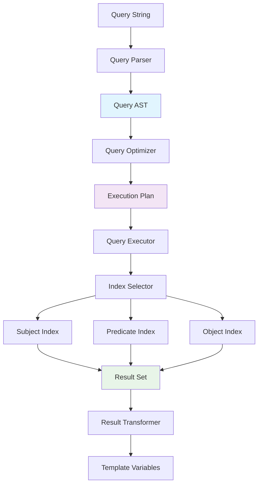

# RDF Query Engine Design

## Overview

The RDF Query Engine provides SPARQL-like querying capabilities for Turtle data within Unjucks templates, designed for simplicity and performance rather than full SPARQL compliance.

## Query Syntax Design

### Simple Pattern Matching
```javascript
// Basic triple patterns
rdf.query("?s rdf:type foaf:Person")
rdf.query("ex:john ?p ?o")
rdf.query("?s foaf:name 'John Doe'")
```

### Variable Binding
```javascript
// Get all subjects of a certain type
const people = rdf.query("?person rdf:type foaf:Person")
people.forEach(result => {
  console.log(result.person.value) // URI of person
})
```

### Fluent Query API
```javascript
// Chained query building
rdf.subjects()
   .ofType('foaf:Person')
   .withProperty('foaf:name')
   .limit(10)
   .toArray()
```

## Query Engine Architecture

### Core Components


### Query Parser Implementation
```typescript
interface QueryPattern {
  subject: QueryTerm;
  predicate: QueryTerm;
  object: QueryTerm;
}

interface QueryTerm {
  type: 'variable' | 'namedNode' | 'literal' | 'blankNode';
  value: string;
  prefix?: string;
}

class QueryParser {
  parse(query: string): QueryPattern {
    // Parse "?s rdf:type foaf:Person" into structured pattern
    const tokens = this.tokenize(query);
    return this.buildPattern(tokens);
  }
  
  private tokenize(query: string): Token[] {
    // Split on whitespace, handle prefixes and literals
    return query.trim().split(/\s+/).map(this.parseToken);
  }
  
  private parseToken(token: string): QueryTerm {
    if (token.startsWith('?')) {
      return { type: 'variable', value: token.slice(1) };
    }
    if (token.includes(':')) {
      const [prefix, local] = token.split(':');
      return { type: 'namedNode', value: local, prefix };
    }
    if (token.startsWith('"') || token.startsWith("'")) {
      return { type: 'literal', value: token.slice(1, -1) };
    }
    return { type: 'namedNode', value: token };
  }
}
```

### Query Execution Strategy
```typescript
interface QueryResult {
  bindings: Map<string, RDFTerm>;
}

class QueryExecutor {
  execute(pattern: QueryPattern, context: RDFContext): QueryResult[] {
    // Select optimal index based on pattern
    const index = this.selectIndex(pattern);
    
    // Execute pattern matching
    const candidates = this.getCandidates(pattern, index, context);
    
    // Apply filters and bindings
    return this.applyPattern(candidates, pattern);
  }
  
  private selectIndex(pattern: QueryPattern): 'subject' | 'predicate' | 'object' {
    // Use most specific non-variable term as index
    if (!pattern.subject.type !== 'variable') return 'subject';
    if (!pattern.predicate.type !== 'variable') return 'predicate';
    if (!pattern.object.type !== 'variable') return 'object';
    return 'subject'; // Default
  }
}
```

## Template Integration Patterns

### Direct Query Access
```nunjucks


  // {{ person.s.value | replace("http://", "") }}
  export class {{ person.s.value | split("/") | last | pascalCase }} {
    // Generated from {{ person.s.value }}
  }

```

### Query Results as Template Data
```nunjucks

const ORGANIZATIONS = [
  
  {
    id: "{{ org.org.value | split('/') | last }}",
    name: "{{ rdf.vocab.query(org.org.value + ' schema:name ?name')[0].name.value }}",
    type: "organization"
  },
  
];
```

### Fluent API in Templates
```nunjucks

interface PersonRegistry {
  
  {{ person.localName | camelCase }}: {
    uri: "{{ person.value }}";
    
    
    {{ prop.predicate.localName }}: {{ prop.object.value | toTypeScript }};
    
  };
  
}
```

## Performance Optimization

### Index Strategy
```typescript
interface RDFIndexes {
  bySubject: Map<string, Triple[]>;
  byPredicate: Map<string, Triple[]>;
  byObject: Map<string, Triple[]>;
  byType: Map<string, Triple[]>; // Special index for rdf:type
  fullText: Map<string, Triple[]>; // For literal search
}

class IndexBuilder {
  build(triples: Triple[]): RDFIndexes {
    const indexes: RDFIndexes = {
      bySubject: new Map(),
      byPredicate: new Map(),
      byObject: new Map(),
      byType: new Map(),
      fullText: new Map()
    };
    
    for (const triple of triples) {
      // Build subject index
      this.addToIndex(indexes.bySubject, triple.subject.value, triple);
      
      // Build predicate index
      this.addToIndex(indexes.byPredicate, triple.predicate.value, triple);
      
      // Build object index
      this.addToIndex(indexes.byObject, triple.object.value, triple);
      
      // Special handling for rdf:type
      if (triple.predicate.value === 'http://www.w3.org/1999/02/22-rdf-syntax-ns#type') {
        this.addToIndex(indexes.byType, triple.object.value, triple);
      }
      
      // Full-text index for literals
      if (triple.object.termType === 'Literal') {
        this.indexLiteral(indexes.fullText, triple.object.value, triple);
      }
    }
    
    return indexes;
  }
}
```

### Query Caching
```typescript
interface QueryCacheEntry {
  pattern: string;
  results: QueryResult[];
  timestamp: number;
  ttl: number;
}

class QueryCache {
  private cache = new Map<string, QueryCacheEntry>();
  
  get(pattern: string): QueryResult[] | null {
    const entry = this.cache.get(pattern);
    if (!entry) return null;
    
    if (Date.now() - entry.timestamp > entry.ttl) {
      this.cache.delete(pattern);
      return null;
    }
    
    return entry.results;
  }
  
  set(pattern: string, results: QueryResult[], ttl = 300000): void {
    this.cache.set(pattern, {
      pattern,
      results,
      timestamp: Date.now(),
      ttl
    });
  }
}
```

## Error Handling

### Query Validation
```typescript
interface QueryValidationResult {
  valid: boolean;
  errors: QueryError[];
  warnings: string[];
}

interface QueryError {
  type: 'syntax' | 'semantic' | 'namespace';
  message: string;
  position?: number;
}

class QueryValidator {
  validate(query: string, context: RDFContext): QueryValidationResult {
    const errors: QueryError[] = [];
    const warnings: string[] = [];
    
    try {
      const pattern = new QueryParser().parse(query);
      
      // Check namespace prefixes
      this.validateNamespaces(pattern, context, errors);
      
      // Check query complexity
      this.validateComplexity(pattern, warnings);
      
      return {
        valid: errors.length === 0,
        errors,
        warnings
      };
    } catch (error) {
      return {
        valid: false,
        errors: [{
          type: 'syntax',
          message: `Parse error: ${error.message}`
        }],
        warnings
      };
    }
  }
}
```

### Runtime Error Recovery
```typescript
class SafeQueryExecutor {
  execute(query: string, context: RDFContext): QueryResult[] {
    try {
      const validation = new QueryValidator().validate(query, context);
      
      if (!validation.valid) {
        console.warn('Query validation failed:', validation.errors);
        return [];
      }
      
      const pattern = new QueryParser().parse(query);
      return new QueryExecutor().execute(pattern, context);
    } catch (error) {
      console.error('Query execution failed:', error);
      return [];
    }
  }
}
```

## Query Language Extensions

### Template-Specific Functions
```javascript
// Count results
rdf.count("?s rdf:type foaf:Person") // Returns number

// Distinct values
rdf.distinct("?s rdf:type ?type") // Returns unique types

// Group by property
rdf.groupBy("?s rdf:type foaf:Person", "foaf:organization")

// Sort results
rdf.sort("?s foaf:name ?name", "name") // Sort by name
```

### Nunjucks Filter Integration
```nunjucks
{# Query and transform in one step #}


{# Count pattern matches #}
Total people: {{ "?s rdf:type foaf:Person" | rdfCount }}

{# Get property values #}

  - {{ name }}

```

## Integration with Unjucks Architecture

### Extension Points
1. **Frontmatter**: `turtle_query` property
2. **CLI**: `--turtle-query` argument  
3. **Context**: `rdf.query()` function
4. **Filters**: `rdfQuery`, `rdfCount` filters
5. **Caching**: Query result caching integration

### Implementation Steps
1. Query parser and AST
2. Index-based query execution
3. Template context integration
4. Nunjucks filter registration
5. Caching and optimization
6. Error handling and validation

This design provides powerful RDF querying while maintaining simplicity and performance for template generation use cases.