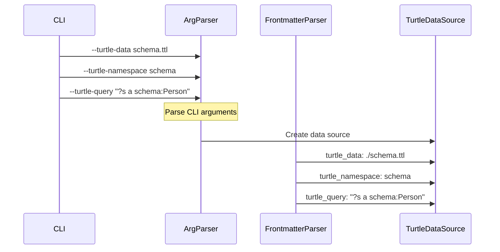
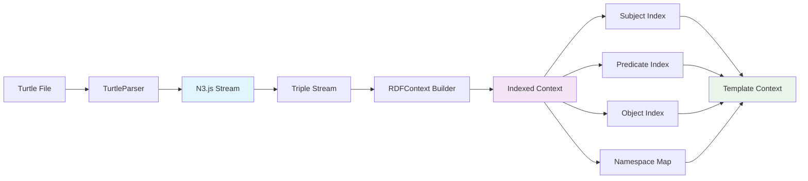
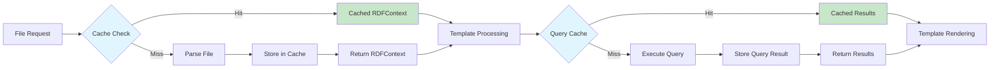
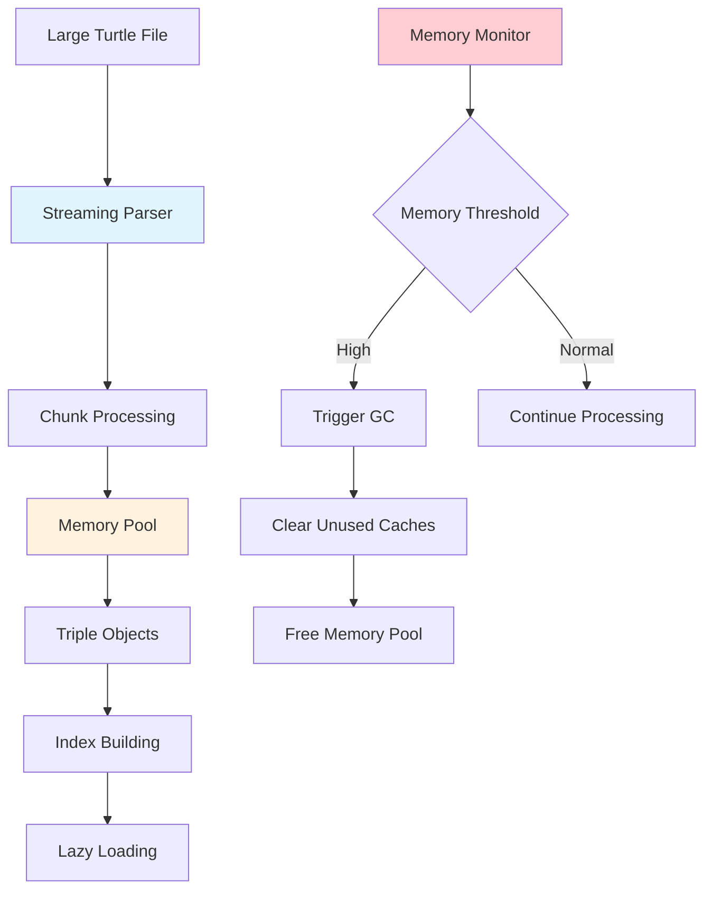
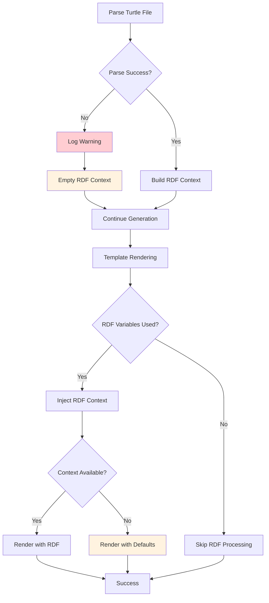

# Turtle Data Flow Architecture Diagram

## System Overview

```mermaid
graph TD
    A[CLI Command] --> B[Argument Parser]
    C[Frontmatter] --> D[Frontmatter Parser]
    
    B --> E[TurtleDataSource[]]
    D --> E
    
    E --> F[TurtleParser.parseFile()]
    F --> G[N3.js Parser]
    G --> H[RDFContext]
    
    H --> I[RDFContextBuilder]
    I --> J[Template Variables]
    
    J --> K[Generator.nunjucksEnv]
    K --> L[Rendered Content]
    
    L --> M[FileInjector]
    M --> N[Output Files]
    
    style G fill:#e1f5fe
    style H fill:#f3e5f5
    style J fill:#e8f5e8
```

## Detailed Component Interaction

### 1. Input Processing


### 2. RDF Processing Pipeline


### 3. Template Context Integration
```mermaid
graph TB
    A[Existing Variables] --> D[Merged Context]
    B[RDF Context] --> D
    C[CLI Arguments] --> D
    
    B --> E[rdf.subjects]
    B --> F[rdf.predicates]
    B --> G[rdf.namespaces]
    B --> H[rdf.query()]
    
    E --> I[{{ rdf.schema.subjects }}]
    F --> J[{{ rdf.schema.predicates }}]
    G --> K[{{ rdf.schema.namespaces.foaf }}]
    H --> L[{{ rdf.schema.query('?s a foaf:Person') }}]
    
    style D fill:#fff3e0
    style B fill:#f3e5f5
```

## Data Structure Details

### RDFContext Structure
```javascript
{
  triples: [
    {
      subject: { termType: 'NamedNode', value: 'http://example.org/person1' },
      predicate: { termType: 'NamedNode', value: 'http://www.w3.org/1999/02/22-rdf-syntax-ns#type' },
      object: { termType: 'NamedNode', value: 'http://xmlns.com/foaf/0.1/Person' }
    }
  ],
  subjects: Map {
    'http://example.org/person1' => [Triple, ...]
  },
  predicates: Map {
    'http://www.w3.org/1999/02/22-rdf-syntax-ns#type' => [Triple, ...]
  },
  objects: Map {
    'http://xmlns.com/foaf/0.1/Person' => [Triple, ...]
  },
  namespaces: Map {
    'foaf' => 'http://xmlns.com/foaf/0.1/',
    'schema' => 'https://schema.org/'
  }
}
```

### Template Context Integration
```javascript
{
  // Existing template variables
  name: "UserService",
  withTests: true,
  
  // New RDF context (namespaced)
  rdf: {
    schema: {
      subjects: [...],
      by_type: {
        "schema:Person": [...],
        "schema:Organization": [...]
      },
      query: (pattern) => [...],
      namespaces: {
        foaf: "http://xmlns.com/foaf/0.1/",
        schema: "https://schema.org/"
      }
    }
  }
}
```

## Performance Optimization Flow

### Caching Strategy


### Memory Management


## Error Handling Flow

### Graceful Degradation


## Integration Points Summary

1. **CLI Extension**: New `--turtle-*` arguments
2. **Frontmatter Extension**: New `turtle_*` properties
3. **Context Extension**: New `rdf.*` template variables
4. **Filter Extension**: New Nunjucks filters for RDF data
5. **Caching Extension**: New cache layers for RDF data
6. **Error Extension**: New error types and handling for RDF parsing

This architecture ensures that RDF integration is seamless while maintaining backward compatibility and performance.