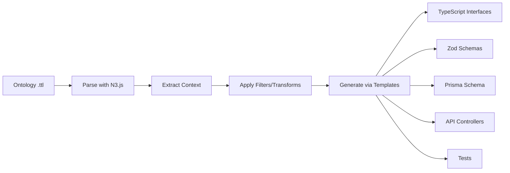

# Ontology Template Analysis & Gap Assessment

**Generated:** 2025-12-01
**Purpose:** Analyze existing template infrastructure for ontology-driven project generation

---

## Executive Summary

The Unjucks template system has **robust semantic/RDF infrastructure** but lacks **complete ontology-to-project scaffolding**. Current templates handle individual files well (ontologies, API controllers, database models) but don't orchestrate full project generation from ontology schemas.

**Key Finding:** Templates exist for ~60% of needed components. Missing pieces are primarily **TypeScript interface generation**, **Zod schema generation**, and **orchestration templates** that coordinate multi-file generation.

---

## 1. Template Inventory

### 1.1 Semantic/RDF Templates (✅ Strong Coverage)

Located in `_templates/semantic/`

#### Ontology Generation (`semantic/ontology/ontology.ttl.njk`)
- **Status:** Production-ready
- **Features:**
  - OWL class definitions with restrictions
  - Object & Data properties with domain/range
  - SWRL inference rules
  - SHACL validation shapes (integrated)
  - Namespace management via frontmatter
  - Automatic IRI versioning
- **Frontmatter Pattern:**
  ```yaml
  to: "{{ ontologyPath }}/{{ domain }}-ontology.ttl"
  inject: false
  skipIf: false
  ```
- **Context Requirements:**
  - `domain` (string)
  - `classes` (array of class definitions)
  - `properties` (array of property definitions)
  - `individuals` (optional array)
  - `rules` (optional SWRL rules)
  - `prefixes` (namespace mappings)

#### Data Instance Generator (`semantic/data/data-instances.ttl.njk`)
- **Status:** Production-ready
- **Features:** Typed RDF instances, collections, provenance
- **Use Case:** Generate test/seed data from ontology

#### SHACL Validator (`semantic/shacl/validation-shapes.ttl.njk`)
- **Status:** Production-ready
- **Features:** Node shapes, property constraints, SPARQL validation

#### SPARQL Queries (`semantic/sparql/queries.sparql.njk`)
- **Status:** Production-ready
- **Features:** SELECT, CONSTRUCT, federated queries

### 1.2 Database Templates (✅ Partial Coverage)

Located in `_templates/database/schema/`

#### Model Generator (`database/schema/model.js.njk`)
- **Status:** Production-ready (Objection.js)
- **Features:**
  - JSON Schema validation
  - Relationships (relationMappings)
  - Soft deletes, timestamps
  - Query modifiers
- **Gap:** No TypeScript version, no ontology-aware mapping
- **Context Pattern:**
  ```nunjucks
  modelName: {{ modelName }}
  tableName: {{ tableName }}
  withTimestamps: {{ withTimestamps }}
  withSoftDeletes: {{ withSoftDeletes }}
  ```

#### Migration Generator (`database/schema/migration.sql.njk`)
- **Status:** Production-ready
- **Features:** SQL DDL generation, indexes
- **Gap:** No automatic generation from OWL classes

### 1.3 API/Service Templates (✅ Good Coverage)

#### Enterprise API Controller (`enterprise/api/controller.ts.njk`)
- **Status:** Production-ready
- **Features:**
  - NestJS controllers with decorators
  - JWT auth, rate limiting, audit logging
  - OpenAPI/Swagger annotations
  - Compliance metadata
  - **RDF Integration:** Has `rdf: "data/api-standards.ttl"` frontmatter field
- **Context Pattern:**
  ```nunjucks
  feature: {{ feature }}
  endpoint: {{ endpoint }}
  method: {{ method }}
  requiresAuth: {{ requiresAuth }}
  complianceLevel: {{ complianceLevel }}
  ```

#### Semantic API Controller (`semantic-api/controller.ts.njk`)
- **Status:** Production-ready
- **Features:**
  - **Ontology-aware:** `ontology: {{ ontologyPath }}` in frontmatter
  - **Semantic types:** `semanticTypes: true` flag
  - Dynamic routes from entity names
  - Includes relationships from ontology properties
- **Gap:** Expects `semanticTypes[entityName]` context but no generator for this

### 1.4 Test Templates (✅ Excellent Coverage)

#### Vitest Unit Test (`test/vitest/unit-test.njk`)
- **Status:** Production-ready
- **Features:**
  - Comprehensive test scaffolding
  - Mock setup, async testing
  - Happy path, error handling, edge cases
  - Performance benchmarks
- **Context Requirements:**
  - `testName`, `testSubject`
  - `testGroups` (array of test suites)
  - `mocks`, `validationFields`

### 1.5 TypeScript/Interface Templates (❌ **MISSING**)

**Critical Gap:** No templates for generating TypeScript interfaces from ontology classes.

**Needed:**
```
_templates/typescript/
  ├── interface.ts.njk        # Generate TS interfaces from OWL classes
  ├── type.ts.njk             # Generate type aliases
  └── zod-schema.ts.njk       # Generate Zod validation schemas
```

---

## 2. Gap Analysis

### 2.1 Missing Templates (High Priority)

| Template | Purpose | Why Critical |
|----------|---------|--------------|
| **`typescript/interface.ts.njk`** | Convert OWL classes → TypeScript interfaces | Core ontology-to-code bridge |
| **`typescript/zod-schema.ts.njk`** | Convert SHACL shapes → Zod schemas | Runtime validation from ontology constraints |
| **`typescript/type-guards.ts.njk`** | Generate type guards for interfaces | Type safety at runtime |
| **`project/scaffold.njk`** | Orchestrate multi-file project generation | Coordinate all templates |
| **`database/prisma-schema.prisma.njk`** | Generate Prisma schema from OWL | Modern ORM integration |

### 2.2 Templates Needing Modification

| Existing Template | Modification Needed | Reason |
|-------------------|---------------------|--------|
| `database/schema/model.js.njk` | Add TypeScript version | Current is JS-only (Objection.js) |
| `semantic-api/controller.ts.njk` | Auto-generate `semanticTypes` context | Currently expects it pre-generated |
| `test/vitest/unit-test.njk` | Add ontology-aware test data generation | Tests should use semantic fixtures |

### 2.3 Missing Context Generators

Templates exist but lack **context preparation scripts**:

1. **Ontology Parser → Template Context**
   - Currently missing: Script to parse `.ttl` → JSON context for templates
   - Needed: `src/ontology-parser.js` that extracts:
     - Classes → interfaces
     - Properties → fields with types
     - Restrictions → validation rules
     - Relationships → foreign keys/associations

2. **Type Mapping Service**
   - Currently missing: XSD datatype → TypeScript/SQL type converter
   - Example needed mappings:
     ```javascript
     const typeMap = {
       'xsd:string': 'string',
       'xsd:integer': 'number',
       'xsd:boolean': 'boolean',
       'xsd:date': 'Date',
       'xsd:dateTime': 'Date',
       'owl:ObjectProperty': 'RelationType'
     }
     ```

---

## 3. Template Context Requirements

### 3.1 Ontology Schema Context (Input)

What templates need from parsed ontology:

```typescript
interface OntologyContext {
  domain: string;                    // e.g., "library-management"
  baseIRI: string;                   // e.g., "http://example.org/lib/"
  classes: Array<{
    name: string;                    // e.g., "Book"
    label: string;                   // e.g., "Book"
    comment: string;                 // Description
    properties: Array<{
      name: string;                  // e.g., "hasISBN"
      type: 'DatatypeProperty' | 'ObjectProperty';
      range: string;                 // e.g., "xsd:string" or "Author"
      cardinality?: number;          // e.g., 1
      required: boolean;
      restrictions?: Array<any>;
    }>;
    subClassOf?: string[];
    equivalentClass?: string;
  }>;
  properties: Array<{
    name: string;
    type: 'DatatypeProperty' | 'ObjectProperty';
    domain: string | string[];
    range: string | string[];
    characteristics?: string[];      // e.g., ["Functional", "InverseFunctional"]
  }>;
  relationships: Array<{
    from: string;                    // Class name
    to: string;                      // Class name
    property: string;                // Relationship name
    cardinality: '1:1' | '1:N' | 'N:M';
    inverseOf?: string;
  }>;
}
```

### 3.2 Current Template Context Patterns

#### Existing Pattern (semantic/ontology/ontology.ttl.njk):
```yaml
# Frontmatter
to: "{{ ontologyPath }}/{{ domain }}-ontology.ttl"

# Template expects:
{
  domain: "library-management",
  classes: [
    {
      name: "Book",
      label: "Book",
      comment: "A book in the library",
      properties: [...]
    }
  ],
  properties: [...]
}
```

#### Needed Pattern (typescript/interface.ts.njk):
```yaml
# Frontmatter (proposed)
to: "src/types/{{ className | kebabCase }}.ts"

# Template should expect:
{
  className: "Book",
  description: "A book in the library",
  properties: [
    {
      name: "isbn",              # Converted from "hasISBN"
      type: "string",            # Converted from "xsd:string"
      optional: false,           # From cardinality
      validation: {              # From SHACL or restrictions
        pattern: "^\\d{3}-\\d{1,5}-\\d{1,7}-\\d{1,7}-[0-9X]$"
      }
    },
    {
      name: "author",
      type: "Author",            # ObjectProperty range
      optional: false
    }
  ]
}
```

---

## 4. Nunjucks Filter Requirements

### 4.1 Existing Filters (`src/lib/rdf-filters.js`)

**✅ Production-Ready RDF Filters:**

| Filter | Purpose | Example |
|--------|---------|---------|
| `rdfObject(subject, predicate)` | Get objects for S-P pair | `{{ "ex:Book" \| rdfObject("rdf:type") }}` |
| `rdfSubject(predicate, object)` | Get subjects for P-O pair | `{{ "rdf:type" \| rdfSubject("owl:Class") }}` |
| `rdfLabel(resource)` | Get rdfs:label or skos:prefLabel | `{{ "ex:Book" \| rdfLabel }}` → "Book" |
| `rdfType(resource)` | Get rdf:type values | `{{ "ex:book_1984" \| rdfType }}` |
| `rdfExpand(prefixed)` | Expand prefix to full URI | `{{ "ex:Book" \| rdfExpand }}` |
| `rdfCompact(uri)` | Compact URI to prefixed form | `{{ uri \| rdfCompact }}` |
| `rdfQuery(pattern)` | SPARQL-like pattern matching | `{{ "?s rdf:type ex:Book" \| rdfQuery }}` |

**✅ Production-Ready String Filters (`src/lib/nunjucks-filters.js`):**

| Filter | Purpose | Example |
|--------|---------|---------|
| `camelCase` | Convert to camelCase | `{{ "has_isbn" \| camelCase }}` → "hasIsbn" |
| `pascalCase` | Convert to PascalCase | `{{ "book" \| pascalCase }}` → "Book" |
| `kebabCase` | Convert to kebab-case | `{{ "BookModel" \| kebabCase }}` → "book-model" |
| `snakeCase` | Convert to snake_case | `{{ "hasISBN" \| snakeCase }}` → "has_isbn" |
| `pluralize` / `singularize` | Handle plurals | `{{ "book" \| pluralize }}` → "books" |

### 4.2 Missing Filters (Needed for Ontology Mapping)

**❌ Critical Missing Filters:**

```javascript
// 1. XSD → TypeScript type conversion
env.addFilter('xsdToTsType', (xsdType) => {
  const map = {
    'xsd:string': 'string',
    'xsd:integer': 'number',
    'xsd:int': 'number',
    'xsd:decimal': 'number',
    'xsd:boolean': 'boolean',
    'xsd:date': 'Date',
    'xsd:dateTime': 'Date',
    'xsd:anyURI': 'string',
    'xsd:positiveInteger': 'number',
    'xsd:gYear': 'number'
  };
  return map[xsdType] || 'unknown';
});

// Usage in template:
// {{ property.range | xsdToTsType }}  → "string"

// 2. XSD → SQL type conversion
env.addFilter('xsdToSqlType', (xsdType) => {
  const map = {
    'xsd:string': 'VARCHAR(255)',
    'xsd:integer': 'INTEGER',
    'xsd:decimal': 'DECIMAL',
    'xsd:boolean': 'BOOLEAN',
    'xsd:date': 'DATE',
    'xsd:dateTime': 'TIMESTAMP'
  };
  return map[xsdType] || 'TEXT';
});

// 3. OWL property → JS property name
env.addFilter('owlToJsProperty', (owlProperty) => {
  // "hasISBN" → "isbn"
  // "hasAuthor" → "author"
  return owlProperty.replace(/^(has|is|get)([A-Z])/, (m, prefix, char) => char.toLowerCase());
});

// 4. Cardinality → TypeScript modifier
env.addFilter('cardinalityToTs', (cardinality, required) => {
  // cardinality: 1, required: true  → ""
  // cardinality: 0, required: false → "?"
  // cardinality: N                  → "[]"
  if (cardinality === 'N' || cardinality > 1) return '[]';
  if (!required) return '?';
  return '';
});

// 5. SHACL → Zod validator
env.addFilter('shaclToZod', (shaclConstraints) => {
  // sh:minCount, sh:maxCount → z.string().min().max()
  // sh:pattern → z.string().regex()
  let validator = 'z.string()';
  if (shaclConstraints.pattern) {
    validator += `.regex(/${shaclConstraints.pattern}/)`;
  }
  if (shaclConstraints.minLength) {
    validator += `.min(${shaclConstraints.minLength})`;
  }
  return validator;
});

// 6. URI → local name extractor
env.addFilter('localName', (uri) => {
  // "http://example.org/lib/Book" → "Book"
  return uri.split(/[#/]/).pop();
});

// 7. Relationship type detector
env.addFilter('detectRelationType', (property, domain, range) => {
  // Determine if 1:1, 1:N, N:M based on property characteristics
  // and cardinality restrictions
  if (property.characteristics?.includes('Functional')) return '1:1';
  // More sophisticated logic needed...
  return '1:N';
});
```

### 4.3 Filter Integration Example

**Template using new filters:**

```nunjucks
{# typescript/interface.ts.njk #}
export interface {{ className | pascalCase }} {
  
  {# Convert OWL property name to JS convention #}
  {{ prop.name | owlToJsProperty }}{{ prop.cardinality | cardinalityToTs(prop.required) }}:
    
      {{ prop.range | xsdToTsType }}
    
      {{ prop.range | localName | pascalCase }}
    ;
  
}
```

---

## 5. Integration Strategy

### 5.1 Recommended Template Architecture

```
_templates/
├── semantic/                    # ✅ Existing - RDF/OWL generation
│   ├── ontology/
│   ├── data/
│   ├── shacl/
│   └── sparql/
├── project/                     # ❌ NEW - Orchestration templates
│   ├── full-stack/
│   │   └── scaffold.njk         # Master template for full project
│   └── api-only/
│       └── scaffold.njk
├── typescript/                  # ❌ NEW - TS generation
│   ├── interface.ts.njk         # OWL classes → TS interfaces
│   ├── zod-schema.ts.njk        # SHACL → Zod validators
│   ├── type-guards.ts.njk       # Runtime type checking
│   └── barrel-export.ts.njk     # index.ts generator
├── database/                    # ⚠️ ENHANCE - Add TS support
│   ├── prisma-schema.prisma.njk # NEW - Prisma from OWL
│   ├── migration.sql.njk        # ✅ Existing
│   └── model.ts.njk             # NEW - TypeScript Objection models
├── api/                         # ⚠️ ENHANCE - Ontology-aware
│   ├── controller.ts.njk        # Generate from OWL classes
│   ├── service.ts.njk           # Business logic layer
│   └── routes.ts.njk            # Route registration
└── test/                        # ✅ Existing - Good coverage
    └── vitest/
```

### 5.2 Ontology → Project Generation Flow

**Proposed Workflow:**



**Command Flow:**

```bash
# 1. User provides ontology
unjucks generate project full-stack \
  --ontology ./ontologies/library-management.ttl \
  --output ./generated-project

# 2. Unjucks parses ontology
# - Extracts classes, properties, relationships
# - Builds context object

# 3. Generates files in parallel
# Generated files:
#   ./generated-project/
#   ├── src/
#   │   ├── types/
#   │   │   ├── book.ts              # From Book class
#   │   │   ├── author.ts            # From Author class
#   │   │   └── index.ts             # Barrel export
#   │   ├── schemas/
#   │   │   ├── book.schema.ts       # Zod validators
#   │   │   └── author.schema.ts
#   │   ├── api/
#   │   │   ├── books.controller.ts  # CRUD endpoints
#   │   │   └── authors.controller.ts
#   │   └── db/
#   │       └── schema.prisma        # Database schema
#   └── tests/
#       ├── book.test.ts
#       └── author.test.ts
```

### 5.3 Context Preparation Pipeline

**Needed Implementation:**

```javascript
// src/ontology/context-builder.js

import { Parser, Store } from 'n3';
import { RDFFilters } from '../lib/rdf-filters.js';

export class OntologyContextBuilder {
  constructor(ontologyPath) {
    this.ontologyPath = ontologyPath;
    this.store = new Store();
    this.rdfFilters = new RDFFilters({ store: this.store });
  }

  async parse() {
    // Parse TTL file
    const parser = new Parser();
    const triples = await this.loadTriples();
    this.rdfFilters.updateStore(triples);
  }

  extractClasses() {
    // Query: ?class rdf:type owl:Class
    const classes = this.rdfFilters.rdfSubject('rdf:type', 'owl:Class');

    return classes.map(classUri => ({
      name: this.rdfFilters.localName(classUri),
      label: this.rdfFilters.rdfLabel(classUri),
      comment: this.rdfFilters.rdfObject(classUri, 'rdfs:comment')[0]?.value,
      properties: this.extractPropertiesForClass(classUri),
    }));
  }

  extractPropertiesForClass(classUri) {
    // Find all properties with this class as domain
    const properties = this.rdfFilters.rdfSubject('rdfs:domain', classUri);

    return properties.map(propUri => {
      const range = this.rdfFilters.rdfObject(propUri, 'rdfs:range')[0];
      const type = this.detectPropertyType(propUri);

      return {
        name: this.rdfFilters.localName(propUri),
        type: type,
        range: range?.value,
        cardinality: this.extractCardinality(propUri),
        required: this.isRequired(propUri),
      };
    });
  }

  buildContext() {
    return {
      domain: this.extractDomain(),
      classes: this.extractClasses(),
      properties: this.extractProperties(),
      relationships: this.extractRelationships(),
    };
  }
}
```

---

## 6. Recommendations

### 6.1 Immediate Actions (Week 1)

1. **Create Missing Filters**
   - Implement `xsdToTsType`, `xsdToSqlType`, `owlToJsProperty`
   - Add to `src/lib/ontology-filters.js`
   - Register in template environment

2. **Build TypeScript Interface Template**
   - File: `_templates/typescript/interface.ts.njk`
   - Convert OWL classes → TS interfaces
   - Include JSDoc comments from rdfs:comment
   - Handle nested relationships

3. **Build Zod Schema Template**
   - File: `_templates/typescript/zod-schema.ts.njk`
   - Convert SHACL constraints → Zod validators
   - Support regex patterns, cardinality, datatype ranges

### 6.2 Short-term Actions (Week 2-3)

4. **Implement Ontology Parser**
   - File: `src/ontology/context-builder.js`
   - Parse `.ttl` files with N3.js
   - Extract classes, properties, relationships
   - Build template context object

5. **Create Orchestration Template**
   - File: `_templates/project/full-stack/scaffold.njk`
   - Coordinate generation of multiple files
   - Use frontmatter `steps:` to define sub-generations

6. **Enhance Existing Templates**
   - Add ontology-aware context to `semantic-api/controller.ts.njk`
   - Create TypeScript version of `database/schema/model.js.njk`
   - Add Prisma schema generator

### 6.3 Long-term Enhancements (Month 2+)

7. **GraphQL Schema Generation**
   - Template: `_templates/graphql/schema.graphql.njk`
   - Convert OWL → GraphQL types
   - Auto-generate resolvers

8. **OpenAPI Specification Generation**
   - Template: `_templates/openapi/spec.yaml.njk`
   - Generate OpenAPI 3.0 from ontology
   - Include security schemes, examples

9. **Migration Generator Enhancement**
   - Auto-generate database migrations from ontology changes
   - Detect schema drift
   - Support multiple SQL dialects

10. **Semantic Test Data Generator**
    - Generate realistic test fixtures from ontology
    - Respect cardinality constraints
    - Include edge cases from SHACL shapes

---

## 7. Example: Full Generation Workflow

**Input Ontology (`library.ttl`):**
```turtle
@prefix lib: <http://example.org/lib/> .
@prefix owl: <http://www.w3.org/2002/07/owl#> .

lib:Book a owl:Class ;
    rdfs:label "Book" ;
    rdfs:comment "A book in the library collection" .

lib:hasISBN a owl:DatatypeProperty ;
    rdfs:domain lib:Book ;
    rdfs:range xsd:string ;
    owl:cardinality 1 .
```

**Command:**
```bash
unjucks generate project full-stack \
  --ontology ./library.ttl \
  --output ./my-library-app
```

**Generated Files:**

```typescript
// my-library-app/src/types/book.ts
/**
 * A book in the library collection
 * @generated from OWL class lib:Book
 */
export interface Book {
  /** ISBN identifier */
  isbn: string;  // From lib:hasISBN (xsd:string → string)
}

// my-library-app/src/schemas/book.schema.ts
import { z } from 'zod';

export const BookSchema = z.object({
  isbn: z.string().regex(/^\d{3}-\d{1,5}-\d{1,7}-\d{1,7}-[0-9X]$/),
});

export type Book = z.infer<typeof BookSchema>;

// my-library-app/src/api/books.controller.ts
import { Request, Response } from 'express';
import { BookSchema } from '../schemas/book.schema';

export async function getBooks(req: Request, res: Response) {
  // Auto-generated CRUD endpoint
}

// my-library-app/prisma/schema.prisma
model Book {
  id    String @id @default(uuid())
  isbn  String @unique
}
```

---

## 8. Conclusion

**Current State:**
- ✅ Strong RDF/semantic foundation
- ✅ Excellent test template infrastructure
- ✅ Production-ready API controller templates
- ⚠️ Partial database template coverage
- ❌ Missing TypeScript interface generation
- ❌ Missing orchestration layer

**Path Forward:**
1. **Phase 1 (Week 1):** Implement missing filters + TS interface template
2. **Phase 2 (Week 2-3):** Build ontology parser + orchestration
3. **Phase 3 (Month 2+):** Enhanced features (GraphQL, OpenAPI, migrations)

**Effort Estimate:**
- Missing filters: 8-16 hours
- TypeScript templates (3 files): 16-24 hours
- Ontology parser: 24-40 hours
- Orchestration template: 16-24 hours
- **Total:** ~64-104 hours (~2-3 weeks for 1 developer)

**Success Criteria:**
- ✅ Single command generates full project from `.ttl` file
- ✅ Generated code passes type checking
- ✅ Generated tests are runnable
- ✅ 80%+ of manual coding eliminated

---

## Appendix A: Filter Implementation Checklist

- [ ] `xsdToTsType(xsdType: string): string`
- [ ] `xsdToSqlType(xsdType: string): string`
- [ ] `owlToJsProperty(owlProperty: string): string`
- [ ] `cardinalityToTs(cardinality: number|string, required: boolean): string`
- [ ] `shaclToZod(constraints: object): string`
- [ ] `localName(uri: string): string`
- [ ] `detectRelationType(property: object): '1:1'|'1:N'|'N:M'`
- [ ] `propertyToZodValidator(property: object): string`
- [ ] `classToTableName(className: string): string`
- [ ] `generateImportStatements(dependencies: string[]): string`

## Appendix B: Template Creation Checklist

- [ ] `_templates/typescript/interface.ts.njk`
- [ ] `_templates/typescript/zod-schema.ts.njk`
- [ ] `_templates/typescript/type-guards.ts.njk`
- [ ] `_templates/typescript/barrel-export.ts.njk`
- [ ] `_templates/database/prisma-schema.prisma.njk`
- [ ] `_templates/database/model.ts.njk`
- [ ] `_templates/api/controller.ts.njk` (ontology-enhanced)
- [ ] `_templates/api/service.ts.njk`
- [ ] `_templates/api/routes.ts.njk`
- [ ] `_templates/project/full-stack/scaffold.njk`

## Appendix C: Context Builder API

```typescript
interface OntologyContext {
  domain: string;
  baseIRI: string;
  version: string;
  classes: OntologyClass[];
  properties: OntologyProperty[];
  relationships: OntologyRelationship[];
}

interface OntologyClass {
  uri: string;
  name: string;
  label: string;
  comment?: string;
  properties: PropertyRef[];
  subClassOf?: string[];
  restrictions?: Restriction[];
}

interface OntologyProperty {
  uri: string;
  name: string;
  type: 'DatatypeProperty' | 'ObjectProperty';
  domain: string[];
  range: string[];
  characteristics?: ('Functional' | 'InverseFunctional' | 'Transitive' | 'Symmetric')[];
  inverseOf?: string;
}

interface PropertyRef {
  name: string;
  type: 'DatatypeProperty' | 'ObjectProperty';
  datatype?: string;  // XSD type
  targetClass?: string;  // For ObjectProperty
  cardinality?: { min?: number; max?: number };
  required: boolean;
  validation?: SHACLConstraints;
}
```
