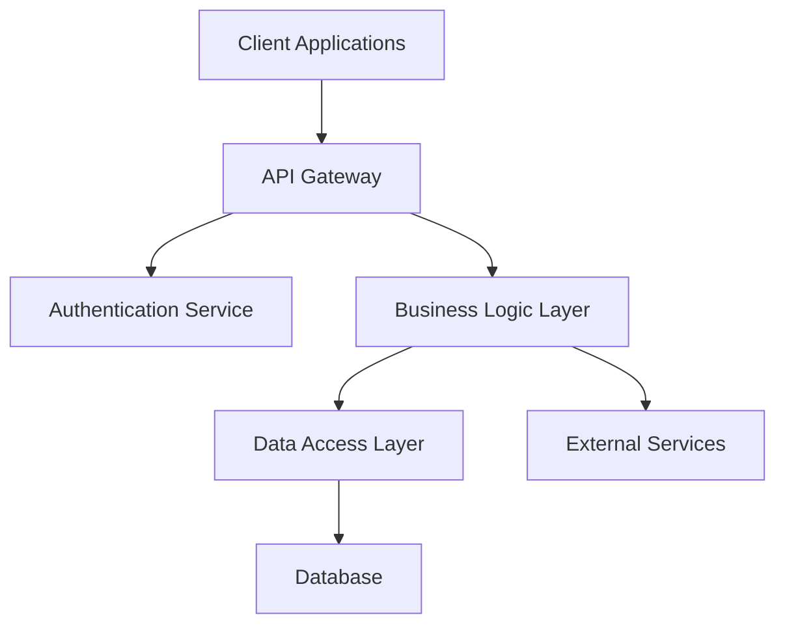
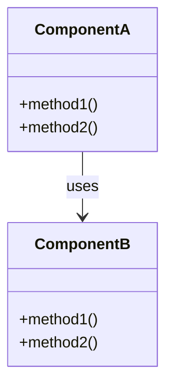
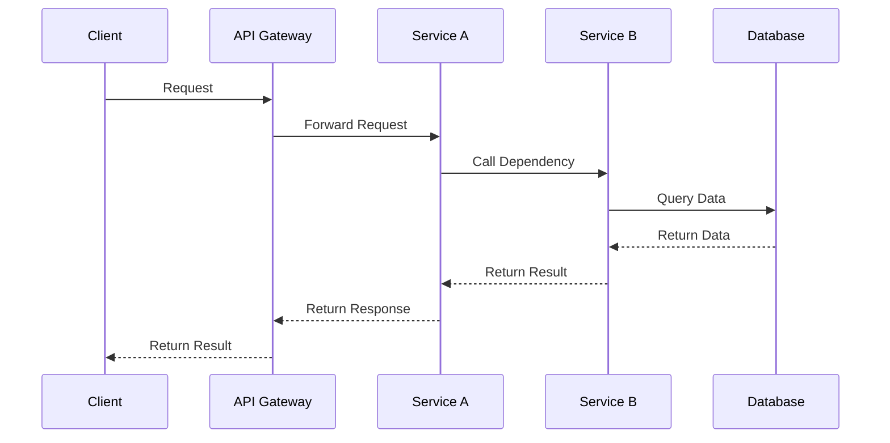
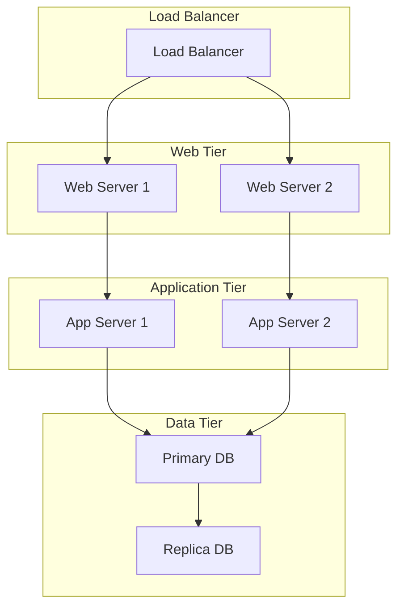
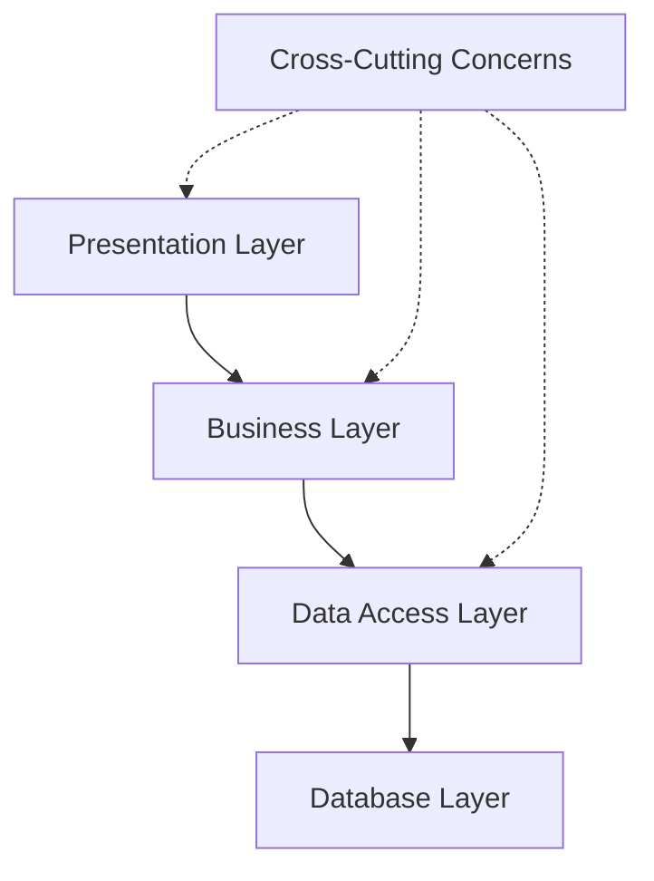
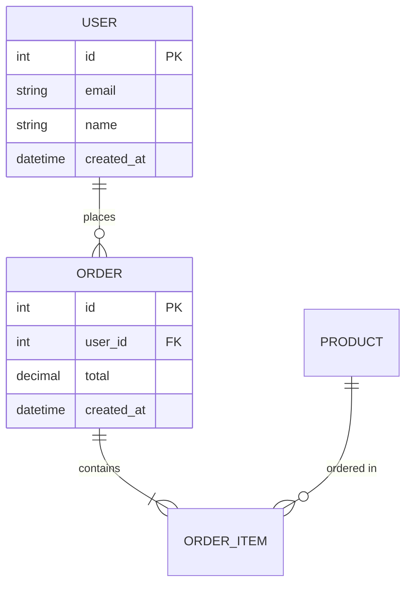

# Software Architecture Document (SAD) Template

## Document Information

| Field | Value |
|-------|-------|
| Project Name | `[PROJECT_NAME]` |
| Document Version | `[VERSION]` |
| Last Updated | `[DATE]` |
| Architects | `[ARCHITECT_NAMES]` |
| Reviewers | `[REVIEWER_NAMES]` |
| Status | `[DRAFT/REVIEW/APPROVED]` |

## Table of Contents

1. [Introduction](#1-introduction)
2. [Architectural Representation](#2-architectural-representation)
3. [Architectural Goals and Constraints](#3-architectural-goals-and-constraints)
4. [Use Case View](#4-use-case-view)
5. [Logical View](#5-logical-view)
6. [Process View](#6-process-view)
7. [Deployment View](#7-deployment-view)
8. [Implementation View](#8-implementation-view)
9. [Data View](#9-data-view)
10. [Size and Performance](#10-size-and-performance)
11. [Quality](#11-quality)

## 1. Introduction

### 1.1 Purpose
This Software Architecture Document provides a comprehensive architectural overview of `[PROJECT_NAME]`, using multiple architectural views to depict different aspects of the system.

### 1.2 Scope
This document describes the architecture for:
- `[COMPONENT_1]`
- `[COMPONENT_2]`
- `[COMPONENT_3]`

### 1.3 Definitions, Acronyms, and Abbreviations

| Term | Definition |
|------|------------|
| API | Application Programming Interface |
| MVC | Model-View-Controller |
| REST | Representational State Transfer |
| `[DOMAIN_TERM]` | `[DEFINITION]` |

### 1.4 References

- Software Requirements Specification: `[SRS_REFERENCE]`
- Business Requirements Document: `[BRD_REFERENCE]`
- API Design Document: `[API_DOC_REFERENCE]`

### 1.5 Overview
This document uses the "4+1" view model of architecture, describing the system through multiple views.

## 2. Architectural Representation

### 2.1 Architectural Style
`[ARCHITECTURAL_STYLE]` (e.g., Microservices, Layered, Event-Driven, etc.)

**Rationale**: `[REASON_FOR_CHOICE]`

### 2.2 High-Level Architecture



### 2.3 Architectural Patterns Applied
- **Pattern 1**: `[PATTERN_NAME]` - `[PURPOSE]`
- **Pattern 2**: `[PATTERN_NAME]` - `[PURPOSE]`
- **Pattern 3**: `[PATTERN_NAME]` - `[PURPOSE]`

## 3. Architectural Goals and Constraints

### 3.1 Architectural Goals

#### 3.1.1 Primary Goals
- **Scalability**: Support `[NUMBER]` concurrent users
- **Maintainability**: Modular design for easy updates
- **Performance**: Response time < `[TIME]` seconds
- **Reliability**: `[UPTIME_PERCENTAGE]`% uptime

#### 3.1.2 Secondary Goals
- **Portability**: Deploy across multiple environments
- **Reusability**: Components usable in other projects
- **Testability**: Automated testing at all layers

### 3.2 Constraints

#### 3.2.1 Technical Constraints
- Programming Language: `[LANGUAGE]`
- Database: `[DATABASE_TYPE]`
- Cloud Platform: `[CLOUD_PROVIDER]`
- Third-party Services: `[EXTERNAL_SERVICES]`

#### 3.2.2 Business Constraints
- Budget: `[BUDGET_LIMITATION]`
- Timeline: `[DELIVERY_DATE]`
- Team Size: `[TEAM_SIZE]`
- Compliance: `[REGULATORY_REQUIREMENTS]`

## 4. Use Case View

### 4.1 Key Use Cases

#### 4.1.1 Use Case 1: `[USE_CASE_NAME]`
- **Actors**: `[PRIMARY_ACTOR]`, `[SECONDARY_ACTORS]`
- **Description**: `[USE_CASE_DESCRIPTION]`
- **Architectural Significance**: `[WHY_ARCHITECTURALLY_IMPORTANT]`

#### 4.1.2 Use Case 2: `[USE_CASE_NAME]`
[Continue pattern for architecturally significant use cases]

### 4.2 Use Case Realizations
Describe how key use cases are realized through architectural components.

## 5. Logical View

### 5.1 Overview
The logical view describes the design's object model and key abstractions.

### 5.2 Architecturally Significant Design Packages

#### 5.2.1 Package 1: `[PACKAGE_NAME]`
- **Purpose**: `[PACKAGE_PURPOSE]`
- **Key Classes**: `[CLASS_LIST]`
- **Responsibilities**: `[RESPONSIBILITIES]`
- **Dependencies**: `[PACKAGE_DEPENDENCIES]`



### 5.3 Key Design Mechanisms
- **Authentication**: `[AUTH_MECHANISM]`
- **Authorization**: `[AUTHZ_MECHANISM]`
- **Data Persistence**: `[PERSISTENCE_MECHANISM]`
- **Communication**: `[COMMUNICATION_MECHANISM]`

## 6. Process View

### 6.1 Overview
The process view addresses concurrency, distribution, and system's runtime behavior.

### 6.2 Process Architecture



### 6.3 Key Processes
- **Process 1**: `[PROCESS_NAME]` - `[PROCESS_DESCRIPTION]`
- **Process 2**: `[PROCESS_NAME]` - `[PROCESS_DESCRIPTION]`

## 7. Deployment View

### 7.1 Overview
The deployment view describes the mapping of software to hardware.

### 7.2 Deployment Architecture



### 7.3 Deployment Configurations

#### 7.3.1 Development Environment
- **Hardware**: `[DEV_HARDWARE]`
- **Software**: `[DEV_SOFTWARE]`
- **Configuration**: `[DEV_CONFIG]`

#### 7.3.2 Production Environment
- **Hardware**: `[PROD_HARDWARE]`
- **Software**: `[PROD_SOFTWARE]`
- **Configuration**: `[PROD_CONFIG]`

## 8. Implementation View

### 8.1 Overview
The implementation view describes the organization of static software elements.

### 8.2 Layer Dependencies



### 8.3 Component Organization

#### 8.3.1 Source Code Structure
```
src/
├── presentation/
│   ├── controllers/
│   ├── views/
│   └── middleware/
├── business/
│   ├── services/
│   ├── models/
│   └── validators/
├── data/
│   ├── repositories/
│   ├── entities/
│   └── migrations/
└── shared/
    ├── utilities/
    ├── constants/
    └── types/
```

### 8.4 Key Components

#### 8.4.1 Component 1: `[COMPONENT_NAME]`
- **Location**: `[FILE_PATH]`
- **Purpose**: `[COMPONENT_PURPOSE]`
- **Dependencies**: `[COMPONENT_DEPENDENCIES]`
- **Interfaces**: `[EXPOSED_INTERFACES]`

## 9. Data View

### 9.1 Overview
The data view describes the persistent data storage and data management aspects.

### 9.2 Data Model



### 9.3 Data Management Strategy
- **Backup Strategy**: `[BACKUP_STRATEGY]`
- **Data Retention**: `[RETENTION_POLICY]`
- **Data Security**: `[SECURITY_MEASURES]`
- **Data Migration**: `[MIGRATION_STRATEGY]`

### 9.4 Data Flow
Describe how data flows through the system components.

## 10. Size and Performance

### 10.1 Performance Requirements

| Metric | Requirement | Current | Target |
|--------|-------------|---------|---------|
| Response Time | < 2s | `[CURRENT]` | < 1s |
| Throughput | 1000 TPS | `[CURRENT]` | 2000 TPS |
| Concurrent Users | 10,000 | `[CURRENT]` | 20,000 |
| Data Volume | 1TB | `[CURRENT]` | 5TB |

### 10.2 Performance Analysis
- **Bottlenecks**: `[IDENTIFIED_BOTTLENECKS]`
- **Optimization Strategies**: `[OPTIMIZATION_PLANS]`
- **Monitoring**: `[MONITORING_STRATEGY]`

### 10.3 Scalability Strategy
- **Horizontal Scaling**: `[HORIZONTAL_STRATEGY]`
- **Vertical Scaling**: `[VERTICAL_STRATEGY]`
- **Auto-scaling**: `[AUTO_SCALING_CONFIG]`

## 11. Quality

### 11.1 Quality Attributes

#### 11.1.1 Reliability
- **Availability**: `[AVAILABILITY_TARGET]`%
- **Fault Tolerance**: `[FAULT_TOLERANCE_MEASURES]`
- **Recovery**: `[RECOVERY_PROCEDURES]`

#### 11.1.2 Security
- **Authentication**: `[AUTH_IMPLEMENTATION]`
- **Authorization**: `[AUTHZ_IMPLEMENTATION]`
- **Data Protection**: `[DATA_PROTECTION_MEASURES]`

#### 11.1.3 Maintainability
- **Code Quality**: `[QUALITY_MEASURES]`
- **Testing Strategy**: `[TESTING_APPROACH]`
- **Documentation**: `[DOCUMENTATION_STRATEGY]`

#### 11.1.4 Usability
- **User Experience**: `[UX_CONSIDERATIONS]`
- **Accessibility**: `[ACCESSIBILITY_MEASURES]`
- **Internationalization**: `[I18N_SUPPORT]`

### 11.2 Quality Assurance
- **Code Reviews**: `[REVIEW_PROCESS]`
- **Testing Levels**: `[TESTING_LEVELS]`
- **Quality Gates**: `[QUALITY_GATES]`

---

## Template Usage Notes

### For Unjucks Integration:
```yaml
# frontmatter for SAD generation
---
to: docs/architecture/<%= projectName.toLowerCase() %>-sad.md
inject: false
skipIf: exists
---
```

### Variables to Customize:
- Replace all `[PLACEHOLDER]` values with project-specific information
- Adapt sections based on architectural complexity
- Include relevant diagrams and models
- Update references to match your documentation structure

### Architecture Decision Records (ADRs):
Link to specific ADRs for major architectural decisions:
- ADR-001: `[DECISION_TITLE]`
- ADR-002: `[DECISION_TITLE]`

### Maintenance:
- Review quarterly for accuracy
- Update with significant architectural changes
- Maintain traceability to requirements
- Version control all changes

### Integration with SPARC:
- **Specification**: Links to SRS and BRD
- **Pseudocode**: Algorithm descriptions in logical view
- **Architecture**: This document IS the architecture
- **Refinement**: Implementation details and decisions
- **Completion**: Links to implementation and deployment guides