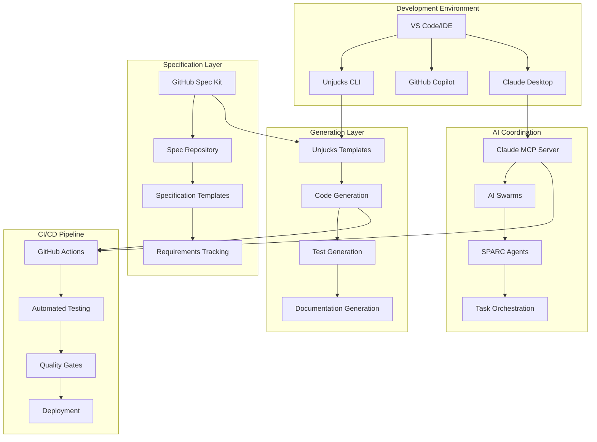

# Appendix B: Tool Ecosystem

## Overview

This appendix provides comprehensive setup and configuration guides for the complete Unjucks tool ecosystem, including GitHub Spec Kit, Unjucks MCP integration, and AI swarm configuration for specification-driven development.

## Ecosystem Components

### 1. GitHub Spec Kit
- [Installation and Setup](./github-spec-kit/installation.md)
- [Repository Configuration](./github-spec-kit/repository-setup.md)
- [Workflow Integration](./github-spec-kit/workflow-integration.md)
- [Collaborative Specification Development](./github-spec-kit/collaborative-specs.md)

### 2. Unjucks MCP Integration
- [MCP Server Setup](./unjucks-mcp/server-setup.md)
- [Claude Integration](./unjucks-mcp/claude-integration.md)
- [Template Management](./unjucks-mcp/template-management.md)
- [Code Generation Workflows](./unjucks-mcp/generation-workflows.md)

### 3. AI Swarm Configuration
- [Swarm Architecture Setup](./ai-swarms/architecture-setup.md)
- [Agent Configuration](./ai-swarms/agent-config.md)
- [Coordination Patterns](./ai-swarms/coordination-patterns.md)
- [SPARC Integration](./ai-swarms/sparc-integration.md)

### 4. Development Environment
- [IDE Configuration](./development/ide-setup.md)
- [Build System Integration](./development/build-integration.md)
- [Testing Framework Setup](./development/testing-setup.md)
- [CI/CD Pipeline Configuration](./development/cicd-setup.md)

## Quick Start Guide

### Prerequisites
- Node.js 18+ with npm/yarn/pnpm
- Git with SSH keys configured
- Claude Desktop or API access
- VS Code or preferred IDE

### 30-Second Setup
```bash
# 1. Install core tools
npm install -g @unjucks/cli @unjucks/mcp-server

# 2. Initialize project
npx @unjucks/cli init my-project --with-templates

# 3. Set up MCP integration
npx @unjucks/mcp-server setup

# 4. Configure GitHub integration
npx @unjucks/cli github-setup

# 5. Start developing
cd my-project && npm run dev
```

## Integration Architecture



## Tool Configuration Matrix

| Tool | Configuration File | Purpose | Integration Points |
|------|-------------------|---------|-------------------|
| Unjucks CLI | `unjucks.config.ts` | Code generation config | Templates, MCP, GitHub |
| MCP Server | `.mcp-config.json` | AI integration config | Claude, Swarms, Agents |
| GitHub Spec Kit | `.github/spec-kit.yml` | Spec management | Issues, PRs, Releases |
| SPARC Agents | `.sparc/config.yml` | Development workflow | Testing, Documentation |
| Build System | Package-specific | Build integration | Generation, Testing, Deploy |

## Environment Variables

### Required Variables
```bash
# Claude AI Integration
ANTHROPIC_API_KEY=your_claude_api_key
CLAUDE_DESKTOP_PATH=/path/to/claude/desktop

# GitHub Integration
GITHUB_TOKEN=your_github_token
GITHUB_ORG=your_organization
GITHUB_REPO=your_repository

# Unjucks Configuration
UNJUCKS_TEMPLATES_DIR=./templates
UNJUCKS_OUTPUT_DIR=./src
UNJUCKS_CONFIG_FILE=./unjucks.config.ts

# AI Swarm Configuration
SWARM_COORDINATOR_URL=http://localhost:3001
SWARM_AGENTS_CONFIG=./.sparc/agents.yml
SWARM_MEMORY_STORE=redis://localhost:6379
```

### Optional Variables
```bash
# Advanced Configuration
UNJUCKS_DEBUG=true
SWARM_TOPOLOGY=mesh
AGENT_PARALLEL_LIMIT=5
SPEC_VALIDATION_STRICT=true
GITHUB_WEBHOOK_SECRET=your_webhook_secret
```

## Setup Validation

### Health Check Script
```bash
#!/bin/bash
# tools-health-check.sh

echo "🔍 Checking Unjucks Tool Ecosystem Health..."

# Check CLI installation
if command -v unjucks &> /dev/null; then
    echo "✅ Unjucks CLI: $(unjucks --version)"
else
    echo "❌ Unjucks CLI not found"
fi

# Check MCP server
if curl -f http://localhost:3000/health &> /dev/null; then
    echo "✅ MCP Server: Running"
else
    echo "❌ MCP Server: Not running"
fi

# Check Claude integration
if [ -n "$ANTHROPIC_API_KEY" ]; then
    echo "✅ Claude API Key: Configured"
else
    echo "❌ Claude API Key: Missing"
fi

# Check GitHub integration
if [ -n "$GITHUB_TOKEN" ]; then
    echo "✅ GitHub Token: Configured"
else
    echo "❌ GitHub Token: Missing"
fi

# Check template directory
if [ -d "./templates" ]; then
    template_count=$(find ./templates -name "*.njk" | wc -l)
    echo "✅ Templates: $template_count found"
else
    echo "❌ Templates: Directory not found"
fi

# Check AI swarm configuration
if [ -f "./.sparc/config.yml" ]; then
    echo "✅ SPARC Config: Found"
else
    echo "❌ SPARC Config: Missing"
fi

echo ""
echo "🔧 Quick fixes for common issues:"
echo "- Missing CLI: npm install -g @unjucks/cli"
echo "- MCP Server: npx @unjucks/mcp-server start"
echo "- Templates: npx @unjucks/cli templates init"
echo "- SPARC Config: npx @unjucks/cli sparc init"
```

## Integration Workflows

### Specification-Driven Development Flow
1. **Spec Creation**: Use GitHub Spec Kit templates
2. **Validation**: AI agents validate specifications
3. **Generation**: Unjucks generates code from specs
4. **Testing**: Automated test generation and execution
5. **Refinement**: SPARC methodology for iterative improvement

### Collaborative Development Flow
1. **Team Setup**: Configure shared templates and workflows
2. **Role-Based Access**: GitHub teams with appropriate permissions
3. **Review Process**: Automated spec and code reviews
4. **Quality Gates**: Continuous validation and testing
5. **Deployment**: Automated deployment based on specifications

## Troubleshooting

### Common Issues and Solutions

#### Issue: MCP Server Connection Failed
```bash
# Check server status
curl http://localhost:3000/health

# Restart server
npx @unjucks/mcp-server restart

# Check logs
tail -f ~/.unjucks/logs/mcp-server.log
```

#### Issue: Template Generation Fails
```bash
# Validate template syntax
npx @unjucks/cli template validate ./templates/my-template.njk

# Check variables
npx @unjucks/cli template variables ./templates/my-template.njk

# Debug generation
npx @unjucks/cli generate my-template --debug --dry-run
```

#### Issue: GitHub Integration Not Working
```bash
# Test GitHub connection
npx @unjucks/cli github test-connection

# Update webhook configuration
npx @unjucks/cli github configure-webhooks

# Sync repository settings
npx @unjucks/cli github sync-settings
```

## Next Steps

1. **Choose Your Setup Path**:
   - [Quick Setup](./quick-setup.md) - Get started in 5 minutes
   - [Custom Setup](./custom-setup.md) - Tailored configuration
   - [Enterprise Setup](./enterprise-setup.md) - Organization-wide deployment

2. **Configure Integrations**:
   - Follow the specific setup guides for each tool
   - Configure environment variables
   - Test integrations with health check script

3. **Initialize Your First Project**:
   - Use specification templates from Appendix A
   - Generate initial code structure
   - Set up automated workflows

4. **Advanced Configuration**:
   - Custom agent configurations
   - Advanced SPARC workflows
   - Multi-repository coordination

## Support and Resources

- **Documentation**: Full setup guides in subdirectories
- **Examples**: Reference implementations and sample configurations
- **Community**: GitHub discussions and issue tracking
- **Enterprise**: Professional support and custom integrations