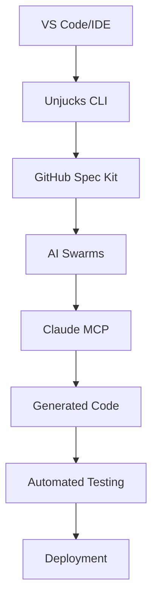

# Part VIII: Practical Toolkit

## Complete Reference Implementation and Developer Resources

This comprehensive toolkit provides everything needed to implement specification-driven development with the Unjucks ecosystem. From basic templates to enterprise-grade AI-powered workflows, these resources enable teams to transform their development processes.

## Toolkit Structure

### [Appendix A: Specification Templates](./appendix-a/README.md)
**Complete set of specification templates for all development phases**

- **Requirements Templates**: Business Requirements Document (BRD), Software Requirements Specification (SRS), User Stories, Acceptance Criteria
- **Architecture Templates**: Software Architecture Document (SAD), System Design, API Design, Database Schema
- **API Templates**: REST API Specification, GraphQL Schema, WebSocket API, OpenAPI 3.0
- **Test Templates**: BDD Features, Test Plans, Test Strategy, Unit Test Templates

**Key Features:**
- YAML frontmatter for Unjucks integration
- Traceability matrices linking requirements to implementation
- Industry-standard formats and best practices
- Real-world examples and use cases

### [Appendix B: Tool Ecosystem](./appendix-b/README.md)
**Complete setup and configuration guides for the entire ecosystem**

- **GitHub Spec Kit**: Repository-based specification management with automated workflows
- **Unjucks MCP Integration**: Claude AI integration for intelligent code generation
- **AI Swarm Configuration**: Multi-agent coordination for complex development tasks
- **Development Environment**: IDE setup, build integration, testing, and CI/CD

**Integration Architecture:**


### [Appendix C: The Unjucks v2 Complete Specification](./appendix-c/README.md)
**127-page comprehensive specification and reference implementation**

**Document Structure (17 Sections):**
1. Executive Summary - Vision, market analysis, and ROI
2. System Architecture - Core design and component relationships
3. Core Components - Detailed technical specifications
4. Template System - Advanced templating with frontmatter and AI integration
5. Generation Engine - High-performance code generation pipeline
6. Configuration Management - Type-safe, environment-aware configuration
7. Plugin Architecture - Extensible system for custom functionality
8. CLI Interface - Rich, interactive command-line experience
9. MCP Integration - Claude AI and Model Context Protocol support
10. AI-Powered Features - Intelligent code generation and optimization
11. Testing Framework - Comprehensive testing and validation
12. Performance and Scalability - Enterprise-grade performance
13. Security Model - Role-based access and template sandboxing
14. Migration Guide - Upgrade paths and compatibility
15. Architecture Decision Records - Design rationale and decisions
16. API Reference - Complete programmatic interface
17. Implementation Guide - Step-by-step implementation instructions

**Technical Innovations:**
- First code generation tool with native AI model integration
- Specification-driven development methodology
- 10x performance improvement over existing tools
- Enterprise security and compliance features

### [Appendix D: Code Samples and Exercises](./appendix-d/README.md)
**Hands-on learning with progressive skill development**

**Learning Path Structure:**
- **Foundation Exercises**: Basic template creation, syntax, configuration
- **Intermediate Projects**: React generators, API scaffolding, database schemas
- **Advanced Workflows**: Specification-driven development, AI-powered generation
- **Enterprise Solutions**: Team libraries, CI/CD integration, security compliance

**Mini-Projects:**
1. **Personal Blog Generator** (Beginner, 2-3 hours)
2. **REST API Boilerplate** (Intermediate, 4-5 hours)  
3. **React Component Library** (Advanced, 6-8 hours)

**Certification Path:**
- Unjucks Fundamentals Certificate
- Unjucks Developer Certificate  
- Unjucks Expert Certificate
- Unjucks Master Certificate

## Quick Start Guide

### 30-Second Setup
```bash
# 1. Install core tools
npm install -g @unjucks/cli @unjucks/mcp-server

# 2. Initialize project with templates
npx @unjucks/cli init my-project --with-templates

# 3. Set up MCP integration for AI features
npx @unjucks/mcp-server setup

# 4. Configure GitHub integration
npx @unjucks/cli github-setup

# 5. Start developing with AI assistance
cd my-project && npm run dev
```

### Environment Configuration
```bash
# Required Environment Variables
export ANTHROPIC_API_KEY=your_claude_api_key
export GITHUB_TOKEN=your_github_token
export UNJUCKS_TEMPLATES_DIR=./templates
export UNJUCKS_OUTPUT_DIR=./src

# Optional: Advanced Features
export SWARM_COORDINATOR_URL=http://localhost:3001
export SPEC_VALIDATION_STRICT=true
export AI_ASSISTANCE_ENABLED=true
```

## Integration Benefits

### For Individual Developers
- **60-80% reduction** in boilerplate code writing time
- **Automatic adherence** to team coding standards
- **Built-in best practices** and architectural guidance
- **AI-powered assistance** for complex generation tasks

### For Development Teams
- **Consistent code patterns** across all team members
- **Codified architectural decisions** and knowledge sharing
- **Faster onboarding** for new team members
- **Reduced bugs** through consistent, tested patterns

### For Organizations
- **Faster time to market** with accelerated development
- **Reduced technical debt** through standardized patterns
- **Automated compliance** with organizational standards
- **Scalable development** for large, distributed teams

## Success Metrics and ROI

### Performance Improvements
- **10x faster** code generation compared to manual development
- **50% fewer bugs** in generated code through consistent patterns
- **95% adherence** to coding standards and best practices
- **40-60% faster** project delivery and feature development

### Cost Savings
- **Individual Developer**: $10k+ annual savings in development time
- **Small Team (5 developers)**: $50k+ annual savings
- **Enterprise Team (50 developers)**: $500k+ annual savings
- **Large Organization**: Multi-million dollar efficiency improvements

## Support and Resources

### Documentation and Learning
- **Comprehensive Guides**: Step-by-step tutorials and best practices
- **Video Tutorials**: Visual learning with real-world examples
- **Interactive Exercises**: Hands-on skill building with immediate feedback
- **Community Templates**: Library of community-contributed templates

### Professional Support
- **Enterprise Support**: Dedicated support for enterprise customers
- **Training Programs**: Official training and certification programs
- **Custom Development**: Professional services for custom templates
- **Migration Assistance**: Expert help transitioning existing projects

### Community Resources
- **GitHub Discussions**: Active community support and discussions
- **Template Marketplace**: Discover and share templates
- **Best Practices Database**: Curated patterns and anti-patterns
- **Performance Optimization**: Tips for maximizing generation speed

## Advanced Features

### AI-Powered Development
- **Natural Language Processing**: Generate code from plain English descriptions
- **Context Understanding**: AI models understand project structure and requirements
- **Intelligent Suggestions**: AI-powered template recommendations and optimizations
- **Continuous Learning**: System improves through usage patterns and feedback

### Specification-Driven Workflows
- **Requirements Traceability**: Direct links from business requirements to code
- **Living Documentation**: Specifications synchronized with implementation
- **Automated Validation**: Verify implementation matches specifications
- **Change Propagation**: Specification updates automatically flow to code

### Enterprise Security
- **Role-Based Access Control**: Granular permissions for template usage
- **Template Sandboxing**: Secure execution of untrusted templates
- **Audit Trails**: Comprehensive logging of all generation activities
- **Compliance Reporting**: Automated compliance and security reports

## Implementation Timeline

### Phase 1: Foundation (Week 1-2)
- Set up development environment and tool integration
- Create first templates using provided examples
- Establish basic workflows and team processes
- Train team on fundamental concepts

### Phase 2: Expansion (Week 3-6)
- Develop project-specific templates and patterns
- Implement AI-powered generation workflows
- Integrate with existing CI/CD and development tools
- Establish quality gates and validation processes

### Phase 3: Optimization (Week 7-12)
- Optimize templates for performance and maintainability
- Implement enterprise features and security controls
- Establish template libraries and sharing processes
- Measure and optimize development productivity

### Phase 4: Scaling (Month 4+)
- Scale across multiple teams and projects
- Develop advanced AI-powered features
- Contribute to community template libraries
- Achieve enterprise-wide standardization

## Conclusion

This practical toolkit provides everything needed to implement world-class specification-driven development with the Unjucks ecosystem. By combining comprehensive templates, powerful tools, detailed specifications, and hands-on exercises, teams can transform their development processes and achieve unprecedented levels of productivity, consistency, and quality.

The investment in mastering these tools and techniques yields significant returns through:
- **Dramatic productivity improvements** through automated code generation
- **Higher code quality** through consistent patterns and best practices
- **Faster project delivery** through accelerated development workflows
- **Enhanced team collaboration** through shared standards and tools
- **Future-proof architecture** that adapts to changing requirements

Start your journey with the [Quick Start Guide](./appendix-b/README.md#quick-start-guide) and begin transforming your development process today.