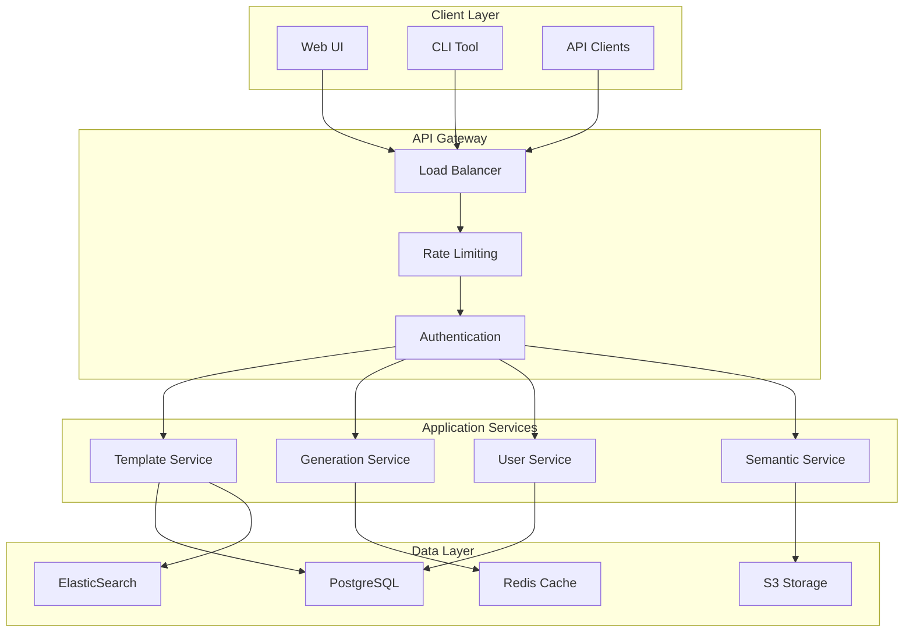
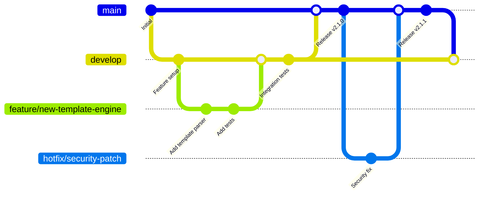
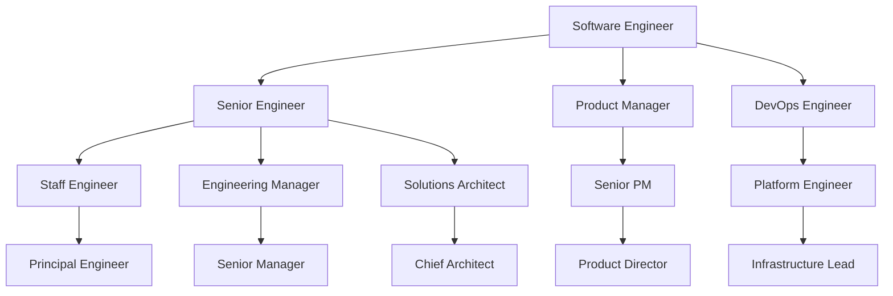

# Onboarding and Training Guide - Unjucks Enterprise Platform

## Welcome to Unjucks Enterprise

Welcome to the Unjucks team! This comprehensive onboarding guide will help you get up to speed with our platform, processes, and culture. Whether you're a developer, DevOps engineer, product manager, or security specialist, this guide provides the foundation you need to succeed.

### About Unjucks
Unjucks is an advanced template generation and scaffolding platform that combines the power of Nunjucks templating with Hygen-style scaffolding, extended with RDF/Turtle support for semantic web applications and Fortune 500 enterprise features.

---

## Table of Contents

1. [Pre-Boarding Checklist](#pre-boarding-checklist)
2. [First Day Setup](#first-day-setup)
3. [Technical Onboarding](#technical-onboarding)
4. [Role-Specific Training](#role-specific-training)
5. [Security and Compliance Training](#security-and-compliance-training)
6. [Development Workflows](#development-workflows)
7. [Tools and Platforms](#tools-and-platforms)
8. [Knowledge Base](#knowledge-base)
9. [Mentoring and Support](#mentoring-and-support)
10. [Career Development](#career-development)

---

## Pre-Boarding Checklist

### HR and Administrative Setup

**Before Your First Day:**
- [ ] Employment paperwork completed
- [ ] Equipment ordered and configured
- [ ] Office access and parking arranged
- [ ] Welcome email with first-day instructions sent
- [ ] Buddy/mentor assigned
- [ ] Calendar invitations for first-week meetings sent

**IT Setup (Completed by IT Team):**
- [ ] Corporate email account created
- [ ] Slack workspace access granted
- [ ] GitHub organization membership added
- [ ] AWS account and IAM roles configured
- [ ] VPN access provisioned
- [ ] Development environment templates prepared
- [ ] Security tools access granted (1Password, etc.)

### Equipment and Software

**Hardware:**
- MacBook Pro 16" (M2 Pro) or equivalent Linux workstation
- External monitor (27" 4K recommended)
- Mechanical keyboard and ergonomic mouse
- Noise-canceling headphones
- Standing desk converter (optional)

**Software Pre-installed:**
- macOS/Linux with latest updates
- Docker Desktop
- Visual Studio Code with Unjucks extension pack
- Node.js 18+ (via nvm)
- Git with company configuration
- Slack desktop app
- 1Password
- VPN client (WireGuard)

---

## First Day Setup

### Morning Session (9:00 AM - 12:00 PM)

#### Welcome Meeting (9:00-9:30 AM)
- Meet with your manager
- Overview of your role and expectations
- Introduction to team structure
- First-day schedule review

#### HR Orientation (9:30-10:30 AM)
- Company policies and procedures
- Benefits overview
- Code of conduct
- Security and confidentiality agreements

#### IT Setup Session (10:30-12:00 PM)

```bash
#!/bin/bash
# First day IT setup script

echo "Welcome to Unjucks! Setting up your development environment..."

# 1. Verify system requirements
echo "Checking system requirements..."
node --version
npm --version
docker --version
git --version

# 2. Clone essential repositories
echo "Cloning essential repositories..."
mkdir -p ~/unjucks-workspace
cd ~/unjucks-workspace

git clone git@github.com:unjucks/unjucks.git
git clone git@github.com:unjucks/platform-docs.git
git clone git@github.com:unjucks/development-tools.git

# 3. Install development dependencies
echo "Installing development dependencies..."
cd unjucks
npm install

# 4. Setup development environment
echo "Setting up development environment..."
cp .env.example .env.local

# 5. Run initial tests
echo "Running initial tests..."
npm test

# 6. Setup Git configuration
echo "Configuring Git..."
git config --global user.name "Your Name"
git config --global user.email "your.email@unjucks.dev"
git config --global init.defaultBranch main
git config --global pull.rebase true

echo "Setup complete! You're ready to start developing."
```

### Afternoon Session (1:00 PM - 5:00 PM)

#### Team Introductions (1:00-2:00 PM)
- Meet your immediate team members
- Understand team dynamics and communication styles
- Learn about current projects and priorities

#### Platform Overview (2:00-3:30 PM)
- Live demo of Unjucks platform
- Architecture overview
- Key features and capabilities
- Customer use cases and success stories

#### First Hands-on Exercise (3:30-5:00 PM)

```bash
# Your first Unjucks template
# Create a simple React component generator

# 1. Navigate to your workspace
cd ~/unjucks-workspace/unjucks

# 2. List available templates
unjucks list

# 3. Generate your first component
unjucks generate component my-first-component \
  --name="WelcomeWidget" \
  --withTests=true \
  --withStorybook=true

# 4. Examine the generated files
ls -la ./src/components/WelcomeWidget/
cat ./src/components/WelcomeWidget/WelcomeWidget.tsx

# 5. Run the component tests
npm test WelcomeWidget

# 6. Start Storybook to see your component
npm run storybook
```

---

## Technical Onboarding

### Week 1: Foundation Knowledge

#### Day 1-2: Platform Basics

**Learning Objectives:**
- Understand Unjucks core concepts
- Learn template syntax and structure
- Explore the CLI interface
- Understand variable injection and frontmatter

**Hands-on Exercises:**

1. **Template Exploration**
   ```bash
   # Explore existing templates
   unjucks list --detailed
   unjucks help generate
   unjucks inspect template react-component
   ```

2. **Create Your First Template**
   ```yaml
   # _templates/greeting/new/hello.ejs.t
   ---
   to: greetings/<%= name %>.txt
   ---
   Hello, <%= name %>!
   Welcome to Unjucks.
   
   Generated on: <%= new Date().toISOString() %>
   Template version: 1.0.0
   ```

3. **Variable Validation**
   ```yaml
   # _templates/greeting/new/prompt.js
   module.exports = {
     prompt: ({
       prompter
     }) => {
       return prompter
         .prompt({
           type: 'input',
           name: 'name',
           message: 'What is your name?',
           validate: (input) => input.length > 0 || 'Name is required'
         })
         .then((answers) => {
           return {
             ...answers,
             name: answers.name.trim()
           }
         })
     }
   }
   ```

#### Day 3-4: Advanced Features

**Learning Objectives:**
- File injection and modification
- Conditional generation
- Semantic web capabilities
- API integration

**Hands-on Exercises:**

1. **File Injection Example**
   ```yaml
   # _templates/feature/add/inject-route.ejs.t
   ---
   to: src/routes/index.js
   inject: true
   after: "// UNJUCKS-INJECT-ROUTES"
   ---
   app.use('/<%= name %>', require('./<%= name %>'));
   ```

2. **Semantic Template**
   ```turtle
   # _templates/ontology/new/vocab.ttl.t
   ---
   to: ontologies/<%= name %>.ttl
   ---
   @prefix <%= prefix %>: <<%= namespace %>> .
   @prefix rdf: <http://www.w3.org/1999/02/22-rdf-syntax-ns#> .
   @prefix rdfs: <http://www.w3.org/2000/01/rdf-schema#> .
   @prefix owl: <http://www.w3.org/2002/07/owl#> .
   
   <%= prefix %>:Ontology rdf:type owl:Ontology ;
       rdfs:label "<%= name %> Ontology" ;
       rdfs:comment "<%= description %>" ;
       owl:versionInfo "1.0.0" .
   ```

#### Day 5: Testing and Quality

**Learning Objectives:**
- Writing template tests
- Quality assurance practices
- Performance considerations
- Documentation standards

**Testing Framework:**

```javascript
// tests/templates/react-component.test.js
const { generateTemplate, validateOutput } = require('../../test-utils');

describe('React Component Template', () => {
  test('generates component with TypeScript', async () => {
    const result = await generateTemplate('component', {
      name: 'TestComponent',
      useTypeScript: true,
      withTests: true
    });
    
    expect(result.files).toContain('src/components/TestComponent/TestComponent.tsx');
    expect(result.files).toContain('src/components/TestComponent/TestComponent.test.tsx');
    
    const componentContent = result.getFileContent('TestComponent.tsx');
    expect(componentContent).toMatch(/interface TestComponentProps/);
    expect(componentContent).toMatch(/export const TestComponent/);
  });
  
  test('validates generated TypeScript code', async () => {
    const result = await generateTemplate('component', {
      name: 'ValidatedComponent',
      useTypeScript: true
    });
    
    const validation = await validateOutput(result, 'typescript');
    expect(validation.errors).toHaveLength(0);
    expect(validation.warnings).toHaveLength(0);
  });
});
```

### Week 2: Platform Architecture

#### System Architecture Deep Dive

**Learning Objectives:**
- Understand microservices architecture
- Learn about data flow and processing
- Explore monitoring and observability
- Understand deployment pipelines

**Architecture Components:**



#### Data Models and APIs

```typescript
// Core data models
interface Template {
  id: string;
  name: string;
  description: string;
  version: string;
  type: 'generator' | 'component' | 'semantic';
  variables: TemplateVariable[];
  files: TemplateFile[];
  metadata: Record<string, any>;
  createdAt: Date;
  updatedAt: Date;
}

interface TemplateVariable {
  name: string;
  type: 'string' | 'number' | 'boolean' | 'array' | 'object';
  description?: string;
  required: boolean;
  default?: any;
  validation?: ValidationRule;
}

interface TemplateFile {
  path: string;
  template: string;
  encoding: 'utf8' | 'base64' | 'binary';
  executable: boolean;
  inject: boolean;
  injection?: InjectionConfig;
}
```

### Week 3-4: Hands-on Project

#### Project: Build a Custom Template Generator

**Objective:** Create a complete template generator for a specific use case

**Requirements:**
- Multiple file generation
- Variable validation and transformation
- Conditional file inclusion
- Proper testing coverage
- Documentation

**Project Structure:**
```
_templates/api-endpoint/
├── new/
│   ├── prompt.js
│   ├── controller.ejs.t
│   ├── model.ejs.t
│   ├── routes.ejs.t
│   ├── test.ejs.t
│   └── inject-routes.ejs.t
├── README.md
└── package.json
```

**Deliverables:**
1. Working template generator
2. Comprehensive test suite
3. Documentation with examples
4. Code review with senior team member
5. Presentation to team

---

## Role-Specific Training

### Software Engineers

#### Core Technologies
- **JavaScript/TypeScript**: ES2022+, async/await, modules
- **Node.js**: Express.js, middleware, streaming
- **React**: Functional components, hooks, context
- **Database**: PostgreSQL, Redis, query optimization
- **Testing**: Jest, Vitest, integration testing

#### Development Environment Setup

```bash
# Engineering-specific setup
npm install -g @unjucks/cli
npm install -g typescript
npm install -g eslint
npm install -g prettier

# VS Code extensions
code --install-extension unjucks.unjucks-templates
code --install-extension ms-vscode.vscode-typescript-next
code --install-extension esbenp.prettier-vscode
code --install-extension ms-vscode.vscode-eslint
```

#### Coding Standards

```javascript
// Code style guidelines

// 1. Use TypeScript for all new code
interface UserProfile {
  id: string;
  email: string;
  preferences: UserPreferences;
}

// 2. Prefer functional programming patterns
const processTemplates = (templates: Template[]) => 
  templates
    .filter(t => t.status === 'active')
    .map(t => transformTemplate(t))
    .reduce(groupByType, {});

// 3. Use async/await over promises
async function generateFromTemplate(templateId: string, variables: Record<string, any>) {
  try {
    const template = await templateService.findById(templateId);
    const rendered = await templateEngine.render(template, variables);
    return await fileService.writeFiles(rendered.files);
  } catch (error) {
    logger.error('Template generation failed', { templateId, error });
    throw new TemplateGenerationError(error.message);
  }
}

// 4. Comprehensive error handling
class TemplateGenerationError extends Error {
  constructor(
    message: string,
    public readonly templateId: string,
    public readonly variables: Record<string, any>
  ) {
    super(message);
    this.name = 'TemplateGenerationError';
  }
}
```

### DevOps Engineers

#### Infrastructure Technologies
- **Containerization**: Docker, Kubernetes
- **Cloud Platforms**: AWS (EKS, RDS, S3, CloudFormation)
- **Infrastructure as Code**: Terraform, Helm
- **Monitoring**: Prometheus, Grafana, AlertManager
- **CI/CD**: GitHub Actions, ArgoCD

#### DevOps Onboarding Project

```yaml
# Kubernetes deployment exercise
apiVersion: apps/v1
kind: Deployment
metadata:
  name: unjucks-api
  namespace: unjucks-staging
spec:
  replicas: 2
  selector:
    matchLabels:
      app: unjucks-api
  template:
    metadata:
      labels:
        app: unjucks-api
        version: v1.0.0
    spec:
      containers:
      - name: api
        image: unjucks/api:latest
        ports:
        - containerPort: 3000
        env:
        - name: NODE_ENV
          value: "staging"
        - name: DB_HOST
          valueFrom:
            secretKeyRef:
              name: database-credentials
              key: host
        resources:
          requests:
            memory: "512Mi"
            cpu: "250m"
          limits:
            memory: "1Gi"
            cpu: "500m"
        livenessProbe:
          httpGet:
            path: /health
            port: 3000
          initialDelaySeconds: 30
          periodSeconds: 10
        readinessProbe:
          httpGet:
            path: /ready
            port: 3000
          initialDelaySeconds: 5
          periodSeconds: 5
```

### Product Managers

#### Product Knowledge Areas
- **Market Understanding**: Template ecosystem, developer tools market
- **Customer Segments**: Enterprise, SMB, individual developers
- **Competitive Analysis**: Hygen, Yeoman, Plop.js
- **Metrics and Analytics**: Usage patterns, feature adoption

#### PM Tools and Processes
- **Project Management**: Jira, Linear, Notion
- **Analytics**: Mixpanel, Google Analytics, Amplitude
- **Design**: Figma, Miro, Whimsical
- **Customer Feedback**: Intercom, UserVoice, customer interviews

#### Product Metrics Dashboard

```sql
-- Key product metrics queries

-- Monthly Active Users
SELECT 
  DATE_TRUNC('month', last_active_at) as month,
  COUNT(DISTINCT user_id) as mau
FROM user_activity 
WHERE last_active_at >= NOW() - INTERVAL '12 months'
GROUP BY month
ORDER BY month;

-- Template Generation Volume
SELECT 
  DATE_TRUNC('day', created_at) as date,
  template_type,
  COUNT(*) as generations
FROM template_generations
WHERE created_at >= NOW() - INTERVAL '30 days'
GROUP BY date, template_type
ORDER BY date, template_type;

-- Feature Adoption Rate
SELECT 
  feature_name,
  COUNT(DISTINCT user_id) as adopters,
  COUNT(DISTINCT user_id) * 100.0 / (SELECT COUNT(*) FROM users WHERE active = true) as adoption_rate
FROM feature_usage
WHERE first_used_at >= NOW() - INTERVAL '90 days'
GROUP BY feature_name
ORDER BY adoption_rate DESC;
```

### Security Engineers

#### Security Technologies
- **SIEM**: Splunk, Elastic Security
- **Vulnerability Scanning**: Nessus, Qualys, OpenVAS
- **Container Security**: Twistlock, Aqua Security
- **Identity Management**: Okta, Auth0, LDAP
- **Compliance**: SOC 2, ISO 27001, GDPR

#### Security Onboarding Exercises

1. **Threat Modeling Exercise**
   ```mermaid
   graph LR
       A[User] -->|HTTPS| B[Load Balancer]
       B --> C[API Gateway]
       C --> D[Auth Service]
       C --> E[Template Service]
       E --> F[Database]
       
       G[Attacker] -.->|SQL Injection| E
       G -.->|XSS| A
       G -.->|MITM| B
       G -.->|Credential Stuffing| D
   ```

2. **Security Code Review**
   ```javascript
   // Identify security issues in this code
   app.post('/api/generate', (req, res) => {
     const { templateId, variables } = req.body;
     
     // Issue 1: No input validation
     const query = `SELECT * FROM templates WHERE id = '${templateId}'`;
     
     db.query(query, (err, results) => {
       if (err) {
         // Issue 2: Information disclosure
         return res.status(500).json({ error: err.message });
       }
       
       const template = results[0];
       
       // Issue 3: Template injection vulnerability
       const rendered = eval(template.content);
       
       res.json({ output: rendered });
     });
   });
   ```

---

## Security and Compliance Training

### Security Awareness Training

#### Module 1: Data Classification and Handling

**Learning Objectives:**
- Understand data classification levels
- Learn proper data handling procedures
- Recognize sensitive information
- Follow encryption requirements

**Practical Exercise:**
```yaml
# Data classification exercise
scenarios:
  - data: "Customer email addresses"
    classification: "Confidential"
    handling: "Encrypt at rest and in transit"
    retention: "7 years after account closure"
  
  - data: "Marketing materials"
    classification: "Public"
    handling: "Standard security controls"
    retention: "Indefinite"
  
  - data: "Source code"
    classification: "Internal"
    handling: "Access control and versioning"
    retention: "Project lifetime + 5 years"
```

#### Module 2: Incident Response

**Scenario-Based Training:**

```markdown
# Incident Response Simulation

## Scenario: Suspicious Login Activity

You notice the following in the security logs:
- 50 failed login attempts from IP 203.0.113.15
- Attempts span multiple user accounts
- All attempts occurred within 10 minutes
- One attempt was successful for user john.doe@unjucks.dev

**Your Actions:**
1. [ ] Immediately disable the compromised account
2. [ ] Block the suspicious IP address
3. [ ] Notify the security team via #security-alerts
4. [ ] Document the incident with ticket ID
5. [ ] Monitor for additional suspicious activity

**Escalation Criteria:**
- Successful compromise of admin account
- Data exfiltration detected
- System-wide impact
```

#### Module 3: Secure Development Practices

**OWASP Top 10 Training:**

```javascript
// Security vulnerability examples and fixes

// 1. SQL Injection (A03:2021)
// ❌ Vulnerable
const query = `SELECT * FROM users WHERE email = '${email}'`;

// ✅ Secure
const query = 'SELECT * FROM users WHERE email = $1';
const result = await db.query(query, [email]);

// 2. Cross-Site Scripting (A03:2021)
// ❌ Vulnerable
res.send(`<h1>Welcome ${username}</h1>`);

// ✅ Secure
res.send(`<h1>Welcome ${escapeHtml(username)}</h1>`);

// 3. Insecure Direct Object References (A01:2021)
// ❌ Vulnerable
app.get('/api/templates/:id', (req, res) => {
  const template = db.getTemplate(req.params.id);
  res.json(template);
});

// ✅ Secure
app.get('/api/templates/:id', authenticate, authorize, (req, res) => {
  const template = db.getTemplate(req.params.id, req.user.id);
  if (!template || template.userId !== req.user.id) {
    return res.status(404).json({ error: 'Template not found' });
  }
  res.json(template);
});
```

### Compliance Training

#### GDPR Compliance

**Key Principles:**
1. **Lawfulness, fairness, and transparency**
2. **Purpose limitation**
3. **Data minimization**
4. **Accuracy**
5. **Storage limitation**
6. **Integrity and confidentiality**
7. **Accountability**

**Practical Implementation:**

```javascript
// GDPR-compliant data collection
class UserDataProcessor {
  async collectUserData(userData, consent) {
    // Verify consent
    if (!consent.marketing && userData.marketingPreferences) {
      delete userData.marketingPreferences;
    }
    
    // Data minimization
    const minimalData = this.extractMinimalData(userData);
    
    // Purpose limitation
    await this.logProcessingPurpose({
      purpose: 'account_creation',
      data_categories: ['contact_info', 'preferences'],
      legal_basis: 'contract'
    });
    
    // Store with retention policy
    return await this.storeWithRetention(minimalData, '7_years');
  }
  
  async handleDataDeletion(userId, reason) {
    // Verify deletion request
    const deletionAllowed = await this.validateDeletionRequest(userId, reason);
    
    if (!deletionAllowed.allowed) {
      throw new Error(`Deletion not permitted: ${deletionAllowed.reason}`);
    }
    
    // Perform deletion
    await this.anonymizeUserData(userId);
    await this.logDeletion(userId, reason);
    
    return { success: true, deletionDate: new Date() };
  }
}
```

---

## Development Workflows

### Git Workflow

#### Branch Strategy



#### Code Review Process

```yaml
# .github/pull_request_template.md
name: Pull Request
about: Submit changes for review

## Description
Brief description of changes

## Type of Change
- [ ] Bug fix (non-breaking change)
- [ ] New feature (non-breaking change)
- [ ] Breaking change (fix or feature causing existing functionality to change)
- [ ] Documentation update

## Testing
- [ ] Unit tests pass
- [ ] Integration tests pass
- [ ] Manual testing completed
- [ ] Performance impact assessed

## Security
- [ ] No sensitive data exposed
- [ ] Input validation implemented
- [ ] Authentication/authorization checked
- [ ] Security scan completed

## Documentation
- [ ] Code comments added/updated
- [ ] API documentation updated
- [ ] User documentation updated
- [ ] Changelog updated

## Checklist
- [ ] Self-review completed
- [ ] Code follows style guidelines
- [ ] Breaking changes documented
- [ ] Backward compatibility maintained
```

### CI/CD Pipeline

```yaml
# .github/workflows/ci.yml
name: Continuous Integration

on:
  push:
    branches: [main, develop]
  pull_request:
    branches: [main, develop]

jobs:
  test:
    runs-on: ubuntu-latest
    strategy:
      matrix:
        node-version: [16, 18, 20]
    
    steps:
    - uses: actions/checkout@v3
    
    - name: Setup Node.js
      uses: actions/setup-node@v3
      with:
        node-version: ${{ matrix.node-version }}
        cache: 'npm'
    
    - name: Install dependencies
      run: npm ci
    
    - name: Run linting
      run: npm run lint
    
    - name: Run type checking
      run: npm run typecheck
    
    - name: Run unit tests
      run: npm run test:unit
    
    - name: Run integration tests
      run: npm run test:integration
      env:
        DB_HOST: localhost
        REDIS_URL: redis://localhost:6379
    
    - name: Run security scan
      run: npm audit --audit-level moderate
    
    - name: Upload coverage reports
      uses: codecov/codecov-action@v3
      with:
        file: ./coverage/lcov.info
  
  build:
    needs: test
    runs-on: ubuntu-latest
    
    steps:
    - uses: actions/checkout@v3
    
    - name: Build Docker image
      run: |
        docker build -t unjucks:${{ github.sha }} .
        docker tag unjucks:${{ github.sha }} unjucks:latest
    
    - name: Run security scan on image
      run: |
        docker run --rm -v /var/run/docker.sock:/var/run/docker.sock \
          aquasec/trivy image unjucks:${{ github.sha }}
```

### Quality Gates

```javascript
// jest.config.js
module.exports = {
  testEnvironment: 'node',
  collectCoverageFrom: [
    'src/**/*.{js,ts}',
    '!src/**/*.d.ts',
    '!src/**/*.test.{js,ts}',
    '!src/migrations/**'
  ],
  coverageThreshold: {
    global: {
      branches: 80,
      functions: 80,
      lines: 80,
      statements: 80
    }
  },
  testMatch: [
    '<rootDir>/src/**/__tests__/**/*.{js,ts}',
    '<rootDir>/src/**/?(*.)(spec|test).{js,ts}'
  ],
  setupFilesAfterEnv: ['<rootDir>/tests/setup.js']
};
```

---

## Tools and Platforms

### Development Tools

#### IDE Configuration

```json
// .vscode/settings.json
{
  "editor.defaultFormatter": "esbenp.prettier-vscode",
  "editor.formatOnSave": true,
  "editor.codeActionsOnSave": {
    "source.fixAll.eslint": true
  },
  "typescript.preferences.importModuleSpecifier": "relative",
  "files.exclude": {
    "**/node_modules": true,
    "**/dist": true,
    "**/.next": true
  },
  "search.exclude": {
    "**/node_modules": true,
    "**/dist": true,
    "**/coverage": true
  }
}
```

```json
// .vscode/extensions.json
{
  "recommendations": [
    "unjucks.unjucks-templates",
    "ms-vscode.vscode-typescript-next",
    "esbenp.prettier-vscode",
    "ms-vscode.vscode-eslint",
    "bradlc.vscode-tailwindcss",
    "ms-vscode.vscode-jest",
    "ms-kubernetes-tools.vscode-kubernetes-tools",
    "ms-azuretools.vscode-docker"
  ]
}
```

### Collaboration Platforms

#### Slack Channels

| Channel | Purpose | Auto-join |
|---------|---------|----------|
| `#general` | Company-wide announcements | Yes |
| `#engineering` | Engineering discussions | Yes (Engineers) |
| `#product` | Product planning and updates | Yes (PM, Eng) |
| `#security` | Security discussions | Yes (Security, DevOps) |
| `#incidents` | Incident response and alerts | Yes (On-call) |
| `#releases` | Release notifications | Yes |
| `#random` | Casual conversations | Yes |
| `#help-desk` | Technical support | Yes |

#### Communication Guidelines

```markdown
# Communication Best Practices

## Slack Etiquette
- Use threads for discussions to keep channels organized
- Use @here sparingly (only for urgent team-wide notifications)
- Use @channel for important announcements to the entire channel
- Set status when away/focused/in meetings
- Use emojis for quick acknowledgments

## Meeting Guidelines
- Send agenda 24 hours in advance
- Start and end on time
- Record important decisions and action items
- Share meeting notes within 2 hours
- Use cameras when possible for better engagement

## Code Review Guidelines
- Review PRs within 24 hours
- Provide constructive feedback
- Approve when satisfied, don't hold for nitpicks
- Use GitHub suggestions for minor changes
- Test the code if making functional changes
```

### Monitoring and Observability

#### Grafana Dashboards

```json
{
  "dashboard": {
    "title": "Unjucks Application Metrics",
    "panels": [
      {
        "title": "Request Rate",
        "type": "graph",
        "targets": [
          {
            "expr": "rate(http_requests_total[5m])",
            "legendFormat": "{{method}} {{route}}"
          }
        ]
      },
      {
        "title": "Response Time",
        "type": "graph",
        "targets": [
          {
            "expr": "histogram_quantile(0.95, rate(http_request_duration_seconds_bucket[5m]))",
            "legendFormat": "95th percentile"
          }
        ]
      },
      {
        "title": "Error Rate",
        "type": "singlestat",
        "targets": [
          {
            "expr": "rate(http_requests_total{status=~\"5..\"}[5m]) / rate(http_requests_total[5m])",
            "legendFormat": "Error Rate"
          }
        ]
      }
    ]
  }
}
```

---

## Knowledge Base

### Technical Documentation

#### Architecture Decision Records (ADRs)

```markdown
# ADR-001: Template Engine Selection

## Status
Accepted

## Context
We need to choose a template engine for the Unjucks platform that supports:
- Variable interpolation
- Conditional logic
- Loops and iterations
- Partial templates
- Custom filters
- Performance at scale

## Decision
We will use Nunjucks as our primary template engine.

## Consequences

### Positive
- Familiar syntax for developers (similar to Jinja2)
- Rich feature set with filters and macros
- Good performance characteristics
- Active community and maintenance
- Extensible with custom filters

### Negative
- Learning curve for developers not familiar with template engines
- Additional dependency in our stack
- Template compilation overhead

### Neutral
- Need to implement custom security filters for user-generated templates
- Documentation and training required for team
```

#### API Documentation

```yaml
# OpenAPI specification excerpt
paths:
  /api/v2/templates/{templateId}/generate:
    post:
      summary: Generate files from template
      description: |
        Generate files from a template using provided variables.
        Supports dry-run mode for preview without file creation.
      parameters:
        - name: templateId
          in: path
          required: true
          schema:
            type: string
            pattern: '^[a-zA-Z0-9_-]+$'
      requestBody:
        required: true
        content:
          application/json:
            schema:
              type: object
              properties:
                variables:
                  type: object
                  additionalProperties: true
                options:
                  type: object
                  properties:
                    dryRun:
                      type: boolean
                      default: false
                    outputPath:
                      type: string
                      default: './'
            example:
              variables:
                name: "UserService"
                withTests: true
                database: "postgresql"
              options:
                dryRun: false
                outputPath: "./src/services/"
      responses:
        '200':
          description: Generation successful
          content:
            application/json:
              schema:
                type: object
                properties:
                  files:
                    type: array
                    items:
                      type: object
                      properties:
                        path:
                          type: string
                        status:
                          type: string
                          enum: [created, updated, skipped]
                        size:
                          type: integer
```

### Best Practices Guides

#### Template Development

```markdown
# Template Development Best Practices

## Template Structure
```
_templates/
├── component/
│   ├── new/
│   │   ├── component.ejs.t
│   │   ├── test.ejs.t
│   │   ├── story.ejs.t
│   │   └── prompt.js
│   ├── README.md
│   └── package.json
└── shared/
    ├── helpers/
    └── partials/
```

## Naming Conventions
- Use kebab-case for template directories
- Use camelCase for variable names
- Use PascalCase for component names
- Prefix private templates with underscore

## Variable Validation
```javascript
// Always validate user input
module.exports = {
  prompt: ({ prompter }) => {
    return prompter.prompt([
      {
        type: 'input',
        name: 'name',
        message: 'Component name:',
        validate: (input) => {
          if (!input) return 'Name is required';
          if (!/^[A-Z][a-zA-Z0-9]*$/.test(input)) {
            return 'Name must be PascalCase (e.g., UserProfile)';
          }
          return true;
        }
      }
    ]);
  }
};
```

## Template Testing
- Test all conditional paths
- Validate generated code syntax
- Test with edge case inputs
- Verify file permissions and structure
```

---

## Mentoring and Support

### Buddy System

#### Week 1-2: Intensive Support
- Daily check-ins (30 minutes)
- Pair programming sessions
- Code review guidance
- Technical question support

#### Week 3-4: Transitional Support
- Every-other-day check-ins (15 minutes)
- Project guidance
- Process clarification
- Team integration support

#### Month 2-3: Ongoing Mentorship
- Weekly check-ins (15 minutes)
- Career development discussions
- Goal setting and tracking
- Knowledge sharing opportunities

### Support Channels

```markdown
# Getting Help Guide

## Technical Questions
1. **Search Documentation**: docs.unjucks.dev
2. **Check Knowledge Base**: wiki.unjucks.dev
3. **Ask in Slack**: #help-desk or relevant team channel
4. **Schedule 1:1**: With mentor or team lead
5. **Office Hours**: Fridays 2-4 PM with senior engineers

## Process Questions
- HR/Benefits: #hr-support
- IT/Equipment: #it-support
- Facilities: #facilities
- General: Ask your manager

## Emergency Support
- Security Issues: #security-alerts
- Production Issues: #incidents
- Personal Emergency: Contact manager directly
```

### Learning Resources

#### Internal Resources
- Engineering Wiki: https://wiki.unjucks.dev
- Video Library: https://learning.unjucks.dev
- Code Examples: https://github.com/unjucks/examples
- Team Presentations: Confluence space

#### External Resources
- Node.js Best Practices: https://github.com/goldbergyoni/nodebestpractices
- TypeScript Handbook: https://www.typescriptlang.org/docs/
- React Documentation: https://react.dev
- Docker Best Practices: https://docs.docker.com/develop/dev-best-practices/

---

## Career Development

### Performance Framework

#### Engineering Levels

| Level | Title | Experience | Scope | Impact |
|-------|-------|------------|-------|--------|
| **E1** | Junior Engineer | 0-2 years | Individual tasks | Team features |
| **E2** | Software Engineer | 2-4 years | Feature ownership | Team projects |
| **E3** | Senior Engineer | 4-7 years | System ownership | Cross-team impact |
| **E4** | Staff Engineer | 7+ years | Technical leadership | Organization-wide |
| **E5** | Principal Engineer | 10+ years | Strategic leadership | Industry impact |

#### Career Tracks



### Learning and Development Plan

#### 30-60-90 Day Goals

**30 Days:**
- [ ] Complete all onboarding modules
- [ ] Deploy first feature to staging
- [ ] Complete buddy program
- [ ] Understand team processes
- [ ] Set up development environment

**60 Days:**
- [ ] Lead a feature from design to deployment
- [ ] Complete first code review as reviewer
- [ ] Contribute to team documentation
- [ ] Identify improvement opportunity
- [ ] Present learnings to team

**90 Days:**
- [ ] Mentor a new team member
- [ ] Own a system component
- [ ] Contribute to technical decisions
- [ ] Participate in on-call rotation
- [ ] Complete performance review

#### Annual Development Planning

```yaml
# Individual Development Plan Template
employee:
  name: "[Employee Name]"
  role: "Software Engineer"
  level: "E2"
  manager: "[Manager Name]"
  review_period: "2024"

goals:
  technical:
    - objective: "Master React and TypeScript"
      key_results:
        - "Complete advanced React course"
        - "Lead TypeScript migration for 2 components"
        - "Achieve 90% type coverage in owned code"
    
    - objective: "Improve system design skills"
      key_results:
        - "Design and implement new API endpoint"
        - "Participate in architecture review sessions"
        - "Complete system design course"
  
  professional:
    - objective: "Enhance communication skills"
      key_results:
        - "Present at monthly engineering demo"
        - "Write 2 technical blog posts"
        - "Mentor junior engineer"
  
  business:
    - objective: "Understand product strategy"
      key_results:
        - "Attend customer interviews"
        - "Participate in product planning"
        - "Propose feature based on user feedback"

development_activities:
  conferences:
    - "React Conf 2024"
    - "Node.js Interactive"
  
  courses:
    - "Advanced TypeScript Patterns"
    - "System Design Fundamentals"
    - "Leadership for Engineers"
  
  certifications:
    - "AWS Solutions Architect Associate"
  
  internal:
    - "Tech Talk Series participation"
    - "Cross-team project collaboration"
    - "Architecture review board participation"
```

### Success Metrics

#### Onboarding Success Indicators

**Week 1:**
- [ ] All accounts and access provisioned
- [ ] Development environment functional
- [ ] First commit made
- [ ] Team introductions completed

**Month 1:**
- [ ] First feature deployed to production
- [ ] Code review process understood
- [ ] Team workflows adopted
- [ ] Security training completed

**Month 3:**
- [ ] Independently contributing to sprints
- [ ] Participating in technical discussions
- [ ] Providing helpful code reviews
- [ ] Understanding business context

**Month 6:**
- [ ] Leading feature development
- [ ] Mentoring newer team members
- [ ] Contributing to architectural decisions
- [ ] Demonstrating company values

#### Performance Review Process

```markdown
# Performance Review Framework

## Self Assessment (Due 2 weeks before review)
1. **Accomplishments**: What did you achieve this period?
2. **Challenges**: What obstacles did you face?
3. **Growth**: How did you develop professionally?
4. **Goals**: What do you want to focus on next period?
5. **Feedback**: What support do you need from manager/team?

## 360 Feedback Collection
- Manager assessment
- Peer feedback (2-3 colleagues)
- Cross-functional partner feedback
- Direct report feedback (if applicable)

## Review Meeting Agenda
1. Self assessment discussion
2. Performance against goals
3. Strengths and development areas
4. Career progression discussion
5. Goal setting for next period
6. Development plan creation

## Follow-up Actions
- Document review outcomes
- Create development plan
- Schedule regular check-ins
- Track progress on goals
```

---

**Document Information:**
- **Version**: 3.0.0
- **Last Updated**: 2024-03-20
- **Next Review**: 2024-06-20
- **Owner**: People Operations Team
- **Contributors**: Engineering Leadership, HR, Security Team

**Feedback and Improvements:**
Please provide feedback on this onboarding guide through:
- Slack: #people-ops
- Email: people@unjucks.dev
- Anonymous feedback: https://forms.unjucks.dev/onboarding-feedback

We continuously improve our onboarding process based on your experiences and suggestions.

---

**Welcome to the team! We're excited to have you join us on this journey to revolutionize template-driven development.**