# V3 Core System Architecture

## Overview

The Unjucks V3 architecture represents a comprehensive code generation and scaffolding platform that combines the power of Nunjucks templating with semantic web technologies, multi-agent coordination, and enterprise-grade security features.

## Core Architecture Diagram

```mermaid
graph TB
    subgraph "🌆 V3 Core Architecture"
        CLI[Citty CLI Layer]
        TE[Template Engine]
        FP[File Processor]
        
        CLI --> |Commands| CE[Command Executor]
        CE --> TD[Template Discovery]
        CE --> TG[Template Generator]
        
        subgraph "📝 Template Engine"
            NJ[Nunjucks Core]
            FF[65+ Filters]
            TI[Template Inheritance]
            VE[Variable Extractor]
            FM[Frontmatter Parser]
            
            NJ --> FF
            NJ --> TI
            VE --> FM
        end
        
        subgraph "🧠 Semantic Layer"
            N3[N3.js Parser]
            RDF[RDF/Turtle Processor]
            SPARQL[SPARQL-like Queries]
            KG[Knowledge Graph]
            TT[Turtle Types]
            
            N3 --> RDF
            RDF --> SPARQL
            SPARQL --> KG
            RDF --> TT
        end
        
        subgraph "📄 Document Generation"
            LTX[LaTeX Generator]
            EXP[Export System]
            MATH[Math Renderer]
            
            LTX --> MATH
            LTX --> EXP
        end
        
        subgraph "📁 File Operations"
            INJ[File Injector]
            ATM[Atomic Writer]
            SEC[Path Security]
            SKIP[Skip Conditions]
            
            INJ --> ATM
            ATM --> SEC
            FM --> SKIP
        end
        
        subgraph "🤖 Agent Coordination (Claude Flow)"
            SW[Swarm Orchestrator]
            AG[Agent Manager]
            WF[Workflow Engine]
            MEM[Memory Manager]
            
            SW --> AG
            AG --> WF
            WF --> MEM
        end
        
        subgraph "🔌 MCP Integration"
            MCP[MCP Server]
            TOOLS[MCP Tools]
            HOOKS[Coordination Hooks]
            
            MCP --> TOOLS
            TOOLS --> HOOKS
        end
        
        subgraph "🛡️ Security & Compliance"
            AUTH[Authentication]
            RBAC[Role-Based Access]
            AUDIT[Audit Trail]
            CRYPTO[Encryption]
            
            AUTH --> RBAC
            RBAC --> AUDIT
            AUDIT --> CRYPTO
        end
        
        subgraph "📊 Monitoring & Performance"
            PERF[Performance Monitor]
            METRICS[Metrics Collector]
            TRACK[Error Tracker]
            
            PERF --> METRICS
            METRICS --> TRACK
        end
    end
    
    %% External Integrations
    GH[GitHub API] --> CLI
    OLLAMA[Ollama API] --> CLI
    AI[AI Services] --> AG
    
    %% Data Flow
    CLI --> TE
    TE --> FP
    FP --> INJ
    
    %% Semantic Integration
    TE --> N3
    KG --> TG
    
    %% Security Integration
    CLI --> AUTH
    FP --> SEC
    
    %% Monitoring Integration
    CE --> PERF
    AG --> METRICS
    
    %% MCP Integration
    AG --> MCP
    SW --> HOOKS
```



## Component Details

### 🎯 CLI Layer (Citty-based)
- **Entry Point**: `/src/cli/index.js`
- **Commands**: Generate, List, Inject, Init, Semantic, GitHub, Neural, etc.
- **Argument Processing**: Hygen-style positional syntax support
- **Command Router**: Dynamic command discovery and execution

### 📝 Template Engine
- **Core**: Nunjucks templating with 65+ custom filters
- **Frontmatter**: YAML-based configuration with validation
- **Variables**: Dynamic extraction and CLI flag generation
- **Inheritance**: Template extending and block override support

### 🧠 Semantic Layer
- **RDF Processing**: N3.js-based RDF/Turtle parsing
- **Knowledge Graph**: SPARQL-like query capabilities
- **Type System**: Rich semantic type definitions
- **Ontology Support**: OWL and RDFS vocabularies

### 📁 File Operations
- **Injection Modes**: Write, Inject, Append, Prepend, LineAt
- **Atomic Operations**: Ensures file consistency
- **Path Security**: Prevents directory traversal attacks
- **Skip Conditions**: Conditional file generation

### 🤖 Agent Coordination
- **Multi-Agent**: Claude Flow integration for parallel processing
- **Swarm Topologies**: Mesh, Hierarchical, Ring, Star configurations
- **Memory Management**: Cross-agent state sharing
- **Workflow Orchestration**: Complex task coordination

## Data Flow Architecture


## Security Architecture


## Performance Optimization

### 🚀 Parallel Processing
- Multi-agent coordination for concurrent file generation
- Template caching and reuse
- Lazy loading of semantic data
- Stream processing for large files

### 📊 Monitoring
- Real-time performance metrics
- Memory usage tracking
- Error rate monitoring
- User activity analytics

## Technology Stack

### Core Dependencies
- **Citty**: CLI framework
- **Nunjucks**: Template engine
- **N3.js**: RDF/Turtle processing
- **yaml**: Frontmatter parsing
- **chalk**: Terminal styling

### Security Dependencies
- **bcrypt**: Password hashing
- **jsonwebtoken**: JWT authentication
- **helmet**: Security headers
- **rate-limiter-flexible**: Rate limiting

### Development Dependencies
- **vitest**: Testing framework
- **eslint**: Code linting
- **prettier**: Code formatting

## Configuration Management

### Environment Configuration
```javascript
// config/index.js
export const config = {
  // Template directories
  templateDirs: ['_templates', 'templates'],
  
  // Security settings
  security: {
    enableAuth: process.env.UNJUCKS_AUTH === 'true',
    secretKey: process.env.UNJUCKS_SECRET,
    rateLimiting: true
  },
  
  // Performance settings
  performance: {
    cacheEnabled: true,
    parallelProcessing: true,
    maxConcurrency: 10
  },
  
  // Semantic features
  semantic: {
    enableRDF: true,
    cacheOntologies: true,
    sparqlEndpoint: process.env.SPARQL_ENDPOINT
  }
}
```

## Extension Points

### 🔌 Plugin System
- Custom filters for Nunjucks
- Command extensions
- Authentication providers
- Storage backends

### 🤖 Agent Integration
- Custom agent types
- Workflow definitions
- Memory providers
- Coordination strategies

## Deployment Architecture

```mermaid
graph TB
    subgraph "🌐 Production Deployment"
        LB[Load Balancer]
        APP1[App Instance 1]
        APP2[App Instance 2]
        APP3[App Instance 3]
        
        LB --> APP1
        LB --> APP2
        LB --> APP3
    end
    
    subgraph "💾 Data Layer"
        DB[(Database)]
        CACHE[(Redis Cache)]
        FILES[(File Storage)]
        
        APP1 --> DB
        APP1 --> CACHE
        APP1 --> FILES
        
        APP2 --> DB
        APP2 --> CACHE
        APP2 --> FILES
        
        APP3 --> DB
        APP3 --> CACHE
        APP3 --> FILES
    end
    
    subgraph "🔍 Monitoring"
        LOGS[Log Aggregation]
        METRICS[Metrics Collection]
        ALERTS[Alert Manager]
        
        APP1 --> LOGS
        APP2 --> METRICS
        APP3 --> ALERTS
    end
```



## Future Enhancements

### V3.1 Roadmap
- Enhanced AI integration with GPT-4 and Claude
- Real-time collaborative editing
- Advanced semantic reasoning
- Cloud-native deployment options

### V3.2 Roadmap
- Visual template editor
- GraphQL API
- Mobile app support
- Enterprise SSO integration

---

*This architecture supports the vision of Unjucks as a comprehensive development platform that bridges traditional code generation with modern AI-powered development workflows.*