# CLI Execution Sequence

This document describes the complete execution flow of the Unjucks CLI from user input to file generation, including error handling and interactive modes.

## Main Command Flow

```mermaid
sequenceDiagram
    participant User
    participant CLI as CLI Entry Point
    participant Parser as Argument Parser
    participant Discovery as Template Discovery
    participant Engine as Nunjucks Engine
    participant FileSystem as File System
    participant Injector as File Injector
    
    User->>CLI: unjucks component react MyComponent
    CLI->>Parser: Parse Hygen-style args
    Parser->>Parser: Transform to explicit syntax
    Note over Parser: "component react MyComponent" → "generate component react --name=MyComponent"
    Parser->>Discovery: Find generator/template
    Discovery->>Discovery: Scan _templates/component/react/
    Discovery-->>CLI: Return template path & metadata
    
    CLI->>Engine: Load template files
    Engine->>Engine: Parse frontmatter
    Engine->>Engine: Extract variables from {{ }} patterns
    Engine->>Engine: Apply Nunjucks filters & transformations
    Engine-->>CLI: Rendered content & output paths
    
    CLI->>Injector: Process file operations
    Injector->>FileSystem: Validate paths & permissions
    Injector->>FileSystem: Atomic write/inject operations
    FileSystem-->>User: Success feedback with file paths
```

## Interactive Mode Flow

## Error Handling Flow

## Template Discovery Process

## File Injection Pipeline

## Dry Run Mode

## Force Mode with Conflicts

## Error Recovery Strategies

### Template Not Found

### Variable Validation Errors

### File System Errors

## Command Aliases and Shortcuts

The CLI supports multiple input patterns that all resolve to the same execution flow:

| Input | Transformed To | Description |
|-------|---------------|-------------|
| `unjucks component react Button` | `unjucks generate component react --name=Button` | Hygen-style positional |
| `unjucks generate component react` | `unjucks generate component react` | Explicit syntax |
| `unjucks list` | `unjucks list` | Direct command |
| `unjucks --help` | `unjucks --help` | Global help |
| `unjucks` | `unjucks --help` | Default help |

## Performance Optimizations

1. **Template Caching**: Parsed templates are cached to avoid re-parsing
2. **Lazy Loading**: Commands are loaded only when needed
3. **Parallel Processing**: Multiple templates processed concurrently
4. **Smart Validation**: Only validate what's necessary for the operation
5. **Incremental Updates**: Only update changed files in watch mode

## Exit Codes

| Code | Meaning | Example |
|------|---------|---------|
| 0 | Success | All files generated successfully |
| 1 | General Error | Template parsing failed |
| 2 | Validation Error | Required variables missing |
| 3 | File System Error | Permission denied |
| 4 | Template Not Found | Generator doesn't exist |
| 5 | User Cancellation | Interactive mode cancelled |

This sequence ensures robust, user-friendly CLI operation with comprehensive error handling and recovery mechanisms.