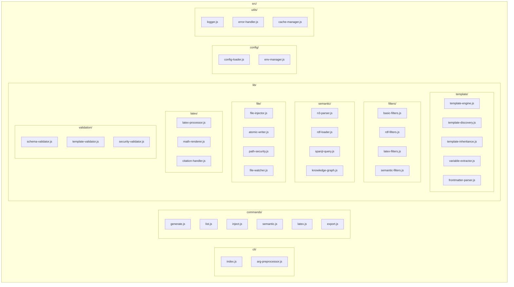
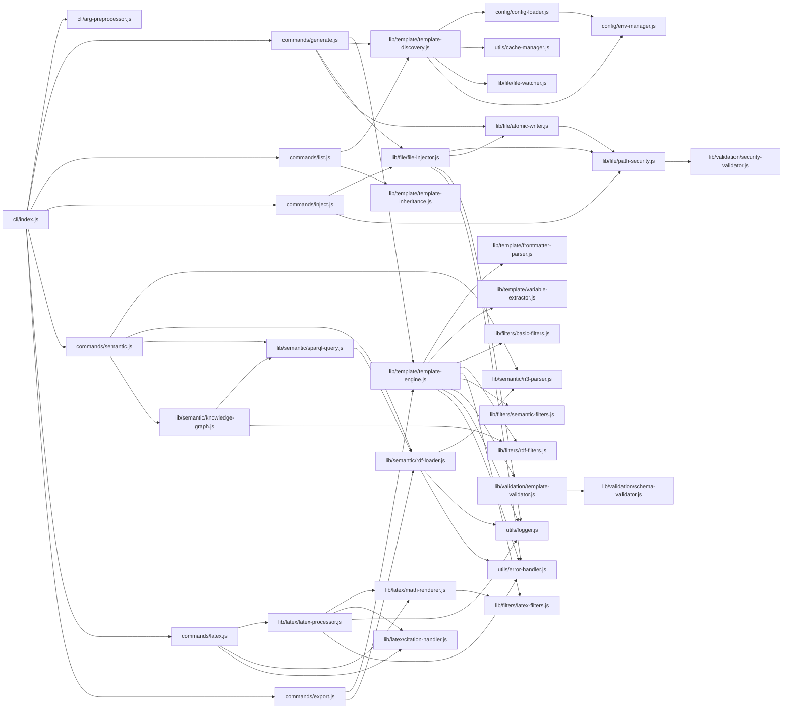

# Module Structure - v3 Architecture

## Overview

The v3 architecture organizes modules into focused, cohesive packages with clear separation of concerns and minimal coupling.

## Module Hierarchy



## Import Dependency Graph



## Module Descriptions

### CLI Layer

#### `cli/index.js`
- **Purpose**: Main CLI entry point and command router
- **Dependencies**: arg-preprocessor, all command modules
- **Exports**: CLI application instance

#### `cli/arg-preprocessor.js`
- **Purpose**: Preprocesses and validates CLI arguments
- **Dependencies**: config-loader, validation modules
- **Exports**: `preprocessArgs(argv)`, `validateFlags(flags)`

### Command Layer

#### `commands/generate.js`
- **Purpose**: Main template generation command
- **Dependencies**: template-engine, file-injector, atomic-writer
- **Exports**: `generateCommand(options)`, `generateFromTemplate(template, vars)`

#### `commands/list.js`
- **Purpose**: Lists available templates and generators
- **Dependencies**: template-discovery, template-inheritance
- **Exports**: `listCommand(options)`, `listTemplates(pattern)`

#### `commands/inject.js`
- **Purpose**: File injection and modification operations
- **Dependencies**: file-injector, path-security
- **Exports**: `injectCommand(options)`, `injectIntoFile(target, content)`

#### `commands/semantic.js`
- **Purpose**: Semantic web and RDF operations
- **Dependencies**: n3-parser, rdf-loader, sparql-query, knowledge-graph
- **Exports**: `semanticCommand(options)`, `queryKnowledgeGraph(query)`

#### `commands/latex.js`
- **Purpose**: LaTeX document generation and processing
- **Dependencies**: latex-processor, math-renderer, citation-handler
- **Exports**: `latexCommand(options)`, `generateLatex(template, data)`

#### `commands/export.js`
- **Purpose**: Export templates and data in various formats
- **Dependencies**: template-engine, rdf-loader
- **Exports**: `exportCommand(options)`, `exportTemplate(format, data)`

### Template System

#### `lib/template/template-engine.js`
- **Purpose**: Core Nunjucks template rendering engine
- **Dependencies**: frontmatter-parser, variable-extractor, all filter modules
- **Exports**: `TemplateEngine` class, `render(template, context)`

#### `lib/template/template-discovery.js`
- **Purpose**: Discovers and indexes available templates
- **Dependencies**: config-loader, cache-manager, file-watcher
- **Exports**: `TemplateDiscovery` class, `discoverTemplates(path)`

#### `lib/template/template-inheritance.js`
- **Purpose**: Handles template inheritance and extension
- **Dependencies**: template-discovery, frontmatter-parser
- **Exports**: `TemplateInheritance` class, `resolveInheritance(template)`

#### `lib/template/variable-extractor.js`
- **Purpose**: Extracts variables from templates for CLI flag generation
- **Dependencies**: frontmatter-parser
- **Exports**: `VariableExtractor` class, `extractVariables(template)`

#### `lib/template/frontmatter-parser.js`
- **Purpose**: Parses YAML frontmatter in templates
- **Dependencies**: None (uses yaml library)
- **Exports**: `FrontmatterParser` class, `parse(content)`

### Filter System

#### `lib/filters/basic-filters.js`
- **Purpose**: Basic Nunjucks filters (string, array, etc.)
- **Dependencies**: None
- **Exports**: Filter registry object

#### `lib/filters/rdf-filters.js`
- **Purpose**: RDF/semantic web specific filters
- **Dependencies**: n3-parser
- **Exports**: RDF filter registry

#### `lib/filters/latex-filters.js`
- **Purpose**: LaTeX formatting and escaping filters
- **Dependencies**: latex-processor
- **Exports**: LaTeX filter registry

#### `lib/filters/semantic-filters.js`
- **Purpose**: Semantic query and knowledge graph filters
- **Dependencies**: sparql-query, knowledge-graph
- **Exports**: Semantic filter registry

### Semantic System

#### `lib/semantic/n3-parser.js`
- **Purpose**: N3/Turtle RDF parsing using N3.js
- **Dependencies**: N3 library
- **Exports**: `N3Parser` class, `parse(content, format)`

#### `lib/semantic/rdf-loader.js`
- **Purpose**: Loads RDF data from various sources
- **Dependencies**: n3-parser
- **Exports**: `RDFLoader` class, `load(source, options)`

#### `lib/semantic/sparql-query.js`
- **Purpose**: SPARQL query execution against RDF stores
- **Dependencies**: rdf-loader
- **Exports**: `SPARQLQuery` class, `execute(query, store)`

#### `lib/semantic/knowledge-graph.js`
- **Purpose**: Knowledge graph operations and reasoning
- **Dependencies**: sparql-query, rdf-filters
- **Exports**: `KnowledgeGraph` class, `buildGraph(data)`

### File System

#### `lib/file/file-injector.js`
- **Purpose**: Injects content into existing files at specific locations
- **Dependencies**: path-security, atomic-writer
- **Exports**: `FileInjector` class, `inject(target, content, options)`

#### `lib/file/atomic-writer.js`
- **Purpose**: Atomic file writing operations
- **Dependencies**: path-security
- **Exports**: `AtomicWriter` class, `write(path, content, options)`

#### `lib/file/path-security.js`
- **Purpose**: Path traversal and security validation
- **Dependencies**: security-validator
- **Exports**: `PathSecurity` class, `validatePath(path)`

#### `lib/file/file-watcher.js`
- **Purpose**: Watches template files for changes
- **Dependencies**: None (uses chokidar)
- **Exports**: `FileWatcher` class, `watch(path, callback)`

### LaTeX System

#### `lib/latex/latex-processor.js`
- **Purpose**: LaTeX document processing and compilation
- **Dependencies**: math-renderer, citation-handler
- **Exports**: `LaTeXProcessor` class, `process(template, data)`

#### `lib/latex/math-renderer.js`
- **Purpose**: Mathematical expression rendering
- **Dependencies**: latex-filters
- **Exports**: `MathRenderer` class, `render(expression, format)`

#### `lib/latex/citation-handler.js`
- **Purpose**: Bibliography and citation management
- **Dependencies**: None
- **Exports**: `CitationHandler` class, `processCitations(content)`

### Validation System

#### `lib/validation/schema-validator.js`
- **Purpose**: JSON Schema validation for templates and data
- **Dependencies**: None (uses ajv)
- **Exports**: `SchemaValidator` class, `validate(data, schema)`

#### `lib/validation/template-validator.js`
- **Purpose**: Template syntax and structure validation
- **Dependencies**: schema-validator
- **Exports**: `TemplateValidator` class, `validate(template)`

#### `lib/validation/security-validator.js`
- **Purpose**: Security-focused validation (XSS, injection, etc.)
- **Dependencies**: None
- **Exports**: `SecurityValidator` class, `validate(content, context)`

### Configuration

#### `config/config-loader.js`
- **Purpose**: Loads and merges configuration from multiple sources
- **Dependencies**: env-manager
- **Exports**: `ConfigLoader` class, `load(options)`

#### `config/env-manager.js`
- **Purpose**: Environment variable management and validation
- **Dependencies**: None
- **Exports**: `EnvManager` class, `get(key)`, `validate(schema)`

### Utilities

#### `utils/logger.js`
- **Purpose**: Structured logging with multiple transports
- **Dependencies**: None (uses winston)
- **Exports**: Logger instance, log levels

#### `utils/error-handler.js`
- **Purpose**: Centralized error handling and reporting
- **Dependencies**: logger
- **Exports**: `ErrorHandler` class, error types

#### `utils/cache-manager.js`
- **Purpose**: Caching for template discovery and rendering
- **Dependencies**: None
- **Exports**: `CacheManager` class, `get(key)`, `set(key, value)`

## Dependency Principles

### 1. Layered Architecture
- CLI → Commands → Libraries → Utils
- No circular dependencies between layers
- Higher layers can depend on lower layers only

### 2. Domain Separation
- Template system is self-contained
- Semantic system is optional and pluggable
- File operations are isolated and secure

### 3. Configuration Injection
- All modules receive configuration through dependency injection
- No direct config file access except in config-loader

### 4. Error Propagation
- Errors bubble up through layers
- Each layer can add context
- Final handling at CLI level

### 5. Testing Isolation
- Each module can be tested independently
- Dependencies are injectable
- Mock-friendly interfaces

## Module Loading Strategy

```javascript
// Lazy loading for performance
const templateEngine = () => require('./lib/template/template-engine');
const semanticSystem = () => require('./lib/semantic/rdf-loader');

// Eager loading for core modules
const pathSecurity = require('./lib/file/path-security');
const errorHandler = require('./utils/error-handler');
```

This structure ensures maintainability, testability, and clear separation of concerns while supporting the full feature set of Unjucks v3.