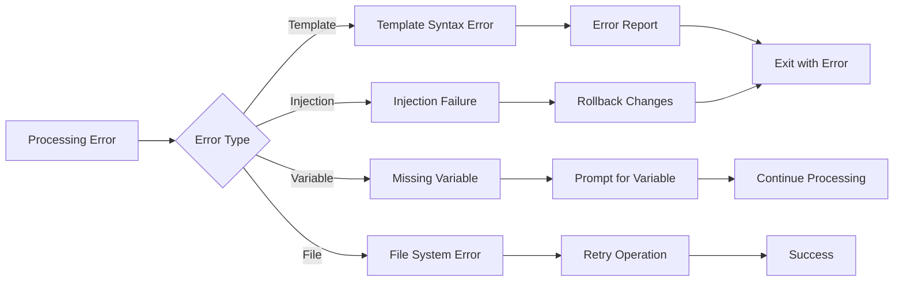

# Template Processing Architecture

## Overview

This document outlines the complete template processing pipeline in Unjucks, from initial template discovery through final file output. The system uses a multi-stage approach combining frontmatter parsing, variable extraction, Nunjucks rendering, and intelligent file injection.

## Processing Flow Diagram

```mermaid
flowchart TD
    Start([Template File]) --> Discovery[Template Discovery]
    Discovery --> FM[Parse Frontmatter]
    
    %% Frontmatter Processing
    FM --> |to: path| PATH[Generate Output Path]
    FM --> |inject: true| INJ{Injection Mode?}
    FM --> |skipIf: condition| SKIP{Skip Check}
    FM --> |chmod: mode| CHMOD[Set File Permissions]
    FM --> |sh: command| SHELL[Execute Shell Command]
    
    %% Variable Extraction
    FM --> VAR[Extract Variables]
    VAR --> |{{ vars }}| SCAN[Scan Template Body]
    VAR --> |CLI flags| FLAGS[Generate CLI Options]
    
    %% Nunjucks Processing
    SCAN --> NUNJUCKS[Nunjucks Rendering]
    NUNJUCKS --> |Built-in Filters| BUILTIN{Apply Built-in Filters}
    NUNJUCKS --> |Custom Filters| CUSTOM{Apply Custom Filters}
    
    %% Built-in Filters
    BUILTIN --> |upper, lower| CASE[Case Conversion]
    BUILTIN --> |replace, trim| TEXT[Text Manipulation]
    BUILTIN --> |default, length| UTIL[Utility Filters]
    
    %% Custom Filters
    CUSTOM --> |pascalCase, camelCase| NAMING[Naming Convention]
    CUSTOM --> |rdfLabel, rdfComment| RDF[RDF Processing]
    CUSTOM --> |texEscape, mathJax| LATEX[LaTeX/Math Escaping]
    CUSTOM --> |semanticId, conceptMap| SEMANTIC[Semantic Processing]
    CUSTOM --> |apiDoc, swaggerType| API[API Documentation]
    
    %% Path Processing
    PATH --> |Dynamic paths| DYNAMIC[Resolve Dynamic Paths]
    DYNAMIC --> |{{ variables }}| PATHVAR[Process Path Variables]
    PATHVAR --> TARGET[Target File Path]
    
    %% Skip Condition Processing
    SKIP --> |Evaluate condition| EVAL{Condition Result}
    EVAL --> |true| SKIPFILE[Skip File Creation]
    EVAL --> |false| PROCEED[Continue Processing]
    
    %% Injection Mode Processing
    INJ --> |append| APPEND[Append to File]
    INJ --> |prepend| PREPEND[Prepend to File]
    INJ --> |lineAt: N| LINE[Insert at Line N]
    INJ --> |before: pattern| BEFORE[Insert Before Pattern]
    INJ --> |after: pattern| AFTER[Insert After Pattern]
    INJ --> |replace: pattern| REPLACE[Replace Pattern]
    
    %% File Operations
    PROCEED --> TARGET
    TARGET --> |inject: false| WRITE[Atomic Write]
    TARGET --> |inject: true| INJECT[Injection Write]
    
    %% Atomic Write Process
    WRITE --> BACKUP[Create Backup]
    BACKUP --> ATOMIC[Atomic Write Operation]
    ATOMIC --> VERIFY[Verify Write Success]
    
    %% Injection Write Process
    INJECT --> READ[Read Existing File]
    READ --> PARSE[Parse File Content]
    PARSE --> APPEND
    PARSE --> PREPEND
    PARSE --> LINE
    PARSE --> BEFORE
    PARSE --> AFTER
    PARSE --> REPLACE
    
    %% Post-processing
    APPEND --> VALIDATE[Validate Injection]
    PREPEND --> VALIDATE
    LINE --> VALIDATE
    BEFORE --> VALIDATE
    AFTER --> VALIDATE
    REPLACE --> VALIDATE
    
    VALIDATE --> |Success| SAVE[Save Modified File]
    VALIDATE --> |Error| ERROR[Injection Error]
    
    %% Permission and Shell Processing
    SAVE --> CHMOD
    CHMOD --> SHELL
    SHELL --> SUCCESS[Processing Complete]
    
    VERIFY --> SUCCESS
    SKIPFILE --> SUCCESS
    ERROR --> FAIL[Processing Failed]
    
    %% Styling
    classDef processNode fill:#e1f5fe
    classDef decisionNode fill:#fff3e0
    classDef operationNode fill:#f3e5f5
    classDef errorNode fill:#ffebee
    classDef successNode fill:#e8f5e8
    
    class Start,Discovery,FM,VAR,SCAN,NUNJUCKS processNode
    class INJ,SKIP,EVAL,BUILTIN,CUSTOM decisionNode
    class PATH,CHMOD,SHELL,WRITE,INJECT,BACKUP,ATOMIC operationNode
    class ERROR,FAIL errorNode
    class SUCCESS successNode
```

## Frontmatter Directives

### Core Directives

| Directive | Type | Description | Example |
|-----------|------|-------------|---------|
| `to` | string | Output file path (supports variables) | `to: src/{{ name }}.js` |
| `inject` | boolean | Enable injection mode | `inject: true` |
| `skipIf` | string/boolean | Skip condition | `skipIf: "{{ !withTests }}"` |
| `chmod` | string | File permissions | `chmod: "755"` |
| `sh` | string | Shell command to execute | `sh: "npm install {{ package }}"` |

### Injection Directives

| Directive | Type | Description | Example |
|-----------|------|-------------|---------|
| `append` | boolean | Append to end of file | `append: true` |
| `prepend` | boolean | Prepend to start of file | `prepend: true` |
| `lineAt` | number | Insert at specific line | `lineAt: 10` |
| `before` | string | Insert before pattern | `before: "// END_IMPORTS"` |
| `after` | string | Insert after pattern | `after: "class {{ className }} {"` |
| `replace` | string | Replace pattern | `replace: "OLD_PATTERN"` |

## Variable Processing

### Variable Extraction Pipeline

1. **Template Scanning**: Scan template body for `{{ variable }}` patterns
2. **CLI Flag Generation**: Convert variables to command-line options
3. **Type Inference**: Determine variable types from usage context
4. **Default Values**: Extract defaults from template or frontmatter
5. **Validation Rules**: Apply validation based on variable patterns

### Variable Types

```javascript
const variableTypes = {
  string: /^[a-zA-Z][a-zA-Z0-9_]*$/,
  boolean: /^(with|is|has|enable|disable)[A-Z]/,
  array: /\[\]$|\.length|\.map\(/,
  object: /\.[a-zA-Z]/
};
```

## Nunjucks Filter System

### Built-in Filters

- **String Manipulation**: `upper`, `lower`, `capitalize`, `trim`, `replace`
- **Array Operations**: `join`, `sort`, `reverse`, `length`
- **Object Operations**: `keys`, `values`, `items`
- **Utility**: `default`, `escape`, `safe`

### Custom Filters

#### Naming Convention Filters
```javascript
// pascalCase: "user_name" → "UserName"
// camelCase: "user_name" → "userName"
// kebabCase: "UserName" → "user-name"
// snakeCase: "UserName" → "user_name"
```

#### RDF Processing Filters
```javascript
// rdfLabel: "http://example.org/Person" → "Person"
// rdfComment: Generate RDF comments with proper escaping
// rdfProperty: Format RDF properties
```

#### LaTeX/Math Filters
```javascript
// texEscape: Escape LaTeX special characters
// mathJax: Format mathematical expressions
// tikzDiagram: Generate TikZ diagrams
```

#### API Documentation Filters
```javascript
// apiDoc: Generate API documentation
// swaggerType: Convert to Swagger/OpenAPI types
// jsonSchema: Generate JSON Schema
```

## Injection System

### Injection Modes

1. **Append Mode**: Add content to end of file
2. **Prepend Mode**: Add content to beginning of file
3. **Line Insert**: Insert at specific line number
4. **Pattern Matching**: Insert relative to text patterns
5. **Replace Mode**: Replace existing patterns

### Injection Safety

- **Idempotent Operations**: Prevent duplicate injections
- **Backup Creation**: Automatic backup before modification
- **Validation**: Verify injection success
- **Rollback**: Restore on failure

## Error Handling

### Processing Errors



### Error Types

1. **Template Errors**: Syntax errors in Nunjucks templates
2. **Variable Errors**: Missing or invalid variables
3. **File System Errors**: Permission or path issues
4. **Injection Errors**: Failed file modifications
5. **Shell Command Errors**: Failed post-processing commands

## Performance Optimizations

### Template Caching
- Compiled template caching
- Variable extraction caching
- Filter result caching

### Parallel Processing
- Concurrent template processing
- Batch file operations
- Async injection operations

### Memory Management
- Stream-based file processing
- Lazy template loading
- Garbage collection optimization

## Integration Points

### CLI Integration
- Command generation from templates
- Option parsing and validation
- Help text generation

### File System Integration
- Atomic write operations
- Permission management
- Directory creation

### External Tools
- Git integration for staging
- Linting tool integration
- Test runner integration

## Future Enhancements

1. **Plugin System**: Custom filter and directive plugins
2. **Template Inheritance**: Template composition and inheritance
3. **Watch Mode**: Real-time template recompilation
4. **Remote Templates**: Template repositories and sharing
5. **Debugging Tools**: Template debugging and profiling