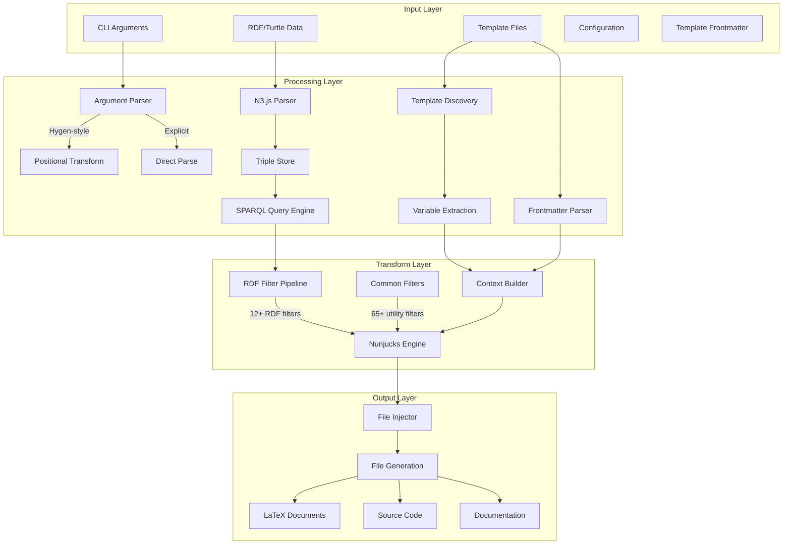

# Data Flow Architecture - Unjucks v3

This document outlines the complete data transformation pipeline in Unjucks, showing how data flows from input through processing to output generation.

## Overview

Unjucks processes data through a multi-layer architecture where each layer transforms and enriches the data before passing it to the next stage. The system supports multiple input sources and provides extensive transformation capabilities through filters and template engines.

## High-Level Data Flow



## Detailed Data Transformation Stages

### 1. Input Layer

#### CLI Arguments Processing
**Input Types:**
```typescript
interface CLIArgs {
  // Positional args (Hygen-style)
  generator?: string;    // e.g., "component"
  template?: string;     // e.g., "react"
  name?: string;         // e.g., "UserProfile"
  
  // Named flags
  dest?: string;         // --dest ./src
  force?: boolean;       // --force
  dry?: boolean;         // --dry
  verbose?: boolean;     // --verbose
  
  // Custom variables
  [key: string]: any;    // --withAuth --port 3000
}
```

**Transformations:**
- Hygen-style positional parsing: `unjucks component react UserProfile` → `{generator: "component", template: "react", name: "UserProfile"}`
- Flag extraction and type inference: `--port 3000` → `{port: 3000}` (number)
- Boolean flag handling: `--withAuth` → `{withAuth: true}`

#### Template File Discovery
**Input:** Template directories under `_templates/`
```
_templates/
├── component/
│   ├── react/
│   │   ├── index.js.njk
│   │   └── component.test.js.njk
│   └── vue/
│       └── component.vue.njk
└── api/
    └── endpoint/
        ├── controller.js.njk
        └── route.js.njk
```

**Output:** Template registry with metadata
```typescript
interface TemplateRegistry {
  generators: {
    [name: string]: {
      name: string;
      description: string;
      templates: TemplateInfo[];
    }
  }
}
```

#### RDF/Turtle Data Loading
**Input Sources:**
- File: `{ type: "file", path: "./ontology.ttl" }`
- Inline: `{ type: "inline", content: "@prefix ex: <http://example.org/> ..." }`
- URI: `{ type: "uri", uri: "http://example.org/ontology.ttl" }`

**Processing:** N3.js parser creates triple store
```typescript
interface ParsedTriple {
  subject: { type: 'uri' | 'blank', value: string };
  predicate: { type: 'uri', value: string };
  object: { type: 'uri' | 'literal' | 'blank', value: string, datatype?: string, language?: string };
}
```

### 2. Processing Layer

#### Variable Extraction
**From Templates:** Regex scanning for `{{ variable }}` patterns
```javascript
// Template content: "export const {{ componentName }} = ..."
// Extracted: ["componentName"]

// With filters: "{{ items | map('name') | join(', ') }}"
// Extracted: ["items"]
```

#### Frontmatter Processing
**Input:** YAML frontmatter in templates
```yaml
---
to: src/components/{{ name }}/index.js
inject: true
after: "// Components"
skip_if: "{{ !withTests }}"
chmod: 755
rdf:
  type: file
  source: ./schemas/component.ttl
---
```

**Output:** Parsed configuration object
```typescript
interface FrontmatterConfig {
  to: string;                    // Output path template
  inject?: boolean;              // Injection mode
  append?: boolean;              // Append mode
  prepend?: boolean;             // Prepend mode
  lineAt?: number;               // Line insertion
  before?: string;               // Inject before pattern
  after?: string;                // Inject after pattern
  skipIf?: string;               // Skip condition
  chmod?: string | number;       // File permissions
  rdf?: RDFConfig;               // RDF data source
  sh?: string[];                 // Shell commands
}
```

#### RDF Data Processing
**Triple Store Creation:**
```javascript
// Input Turtle:
// @prefix ex: <http://example.org/> .
// ex:Component a ex:UIElement ;
//              ex:hasProperty ex:name .

// Processed Triples:
[
  {
    subject: { type: 'uri', value: 'http://example.org/Component' },
    predicate: { type: 'uri', value: 'http://www.w3.org/1999/02/22-rdf-syntax-ns#type' },
    object: { type: 'uri', value: 'http://example.org/UIElement' }
  },
  {
    subject: { type: 'uri', value: 'http://example.org/Component' },
    predicate: { type: 'uri', value: 'http://example.org/hasProperty' },
    object: { type: 'uri', value: 'http://example.org/name' }
  }
]
```

### 3. Transform Layer

#### Context Building
**Combined Context:**
```typescript
interface TemplateContext {
  // CLI variables
  name: string;
  generator: string;
  template: string;
  
  // Flag variables
  withAuth: boolean;
  port: number;
  dest: string;
  
  // RDF context (if available)
  rdf?: {
    subjects: { [uri: string]: RDFSubject };
    prefixes: { [prefix: string]: string };
    triples: ParsedTriple[];
    stats: ParseStats;
  };
  
  // Utility functions
  [filterName: string]: Function;
}
```

#### Nunjucks Filter System

**RDF Filters (12 total):**
```javascript
// Subject/Object/Predicate queries
{{ "ex:Component" | rdfObject("rdf:type") }}
// → ["ex:UIElement"]

{{ "ex:Component" | rdfLabel }}
// → "Component" (from rdfs:label or skos:prefLabel)

{{ "?s rdf:type ex:UIElement" | rdfQuery }}
// → [["ex:Component", "rdf:type", "ex:UIElement"]]

// Namespace operations
{{ "ex:Component" | rdfExpand }}
// → "http://example.org/Component"

{{ "http://example.org/Component" | rdfCompact }}
// → "ex:Component"
```

**Common Filters (65+ total):**
```javascript
// String manipulation
{{ name | camelCase }}        // userProfile
{{ name | pascalCase }}       // UserProfile  
{{ name | kebabCase }}        // user-profile
{{ name | snakeCase }}        // user_profile

// Array operations
{{ items | map('name') | join(', ') }}
{{ list | filter('active') | sort }}

// File operations
{{ 'src/components' | ensureDir }}
{{ './relative/path' | absolute }}

// Code generation
{{ code | indent(2) }}
{{ imports | dedupe | sort }}
```

#### Template Rendering Process
**Input Template:**
```njk
---
to: src/components/{{ name | pascalCase }}/index.js
rdf:
  type: file
  source: ./schemas/component.ttl
---
import React from 'react';




export const {{ componentClass }} = (props) => {
  return (
    <div className="{{ name | kebabCase }}">
      
      <span>{{ prop | rdfLabel }}: {props.{{ prop | rdfLabel | camelCase }}}</span>
      
    </div>
  );
};

export default {{ componentClass }};
```

**Rendered Output:**
```javascript
import React from 'react';

export const UserProfile = (props) => {
  return (
    <div className="user-profile">
      <span>Name: {props.name}</span>
      <span>Email: {props.email}</span>
    </div>
  );
};

export default UserProfile;
```

### 4. Output Layer

#### File Injection System
**Operation Modes:**
```typescript
type InjectionMode = 
  | 'write'      // Atomic file write
  | 'inject'     // Smart content injection
  | 'append'     // Append to file end
  | 'prepend'    // Prepend to file start
  | 'lineAt';    // Insert at specific line

interface InjectionResult {
  success: boolean;
  outputPath: string;
  existed: boolean;
  size: number;
  warnings?: string[];
}
```

**Injection Logic:**
```javascript
// Before/After pattern injection
if (frontmatter.inject && frontmatter.after) {
  // Find pattern: "// Components"
  // Insert content after the pattern
  const lines = content.split('\n');
  const insertIndex = lines.findIndex(line => line.includes(frontmatter.after));
  lines.splice(insertIndex + 1, 0, renderedContent);
  return lines.join('\n');
}

// Skip condition evaluation
if (frontmatter.skipIf) {
  // Evaluate: "{{ !withTests }}"
  const shouldSkip = evaluateCondition(frontmatter.skipIf, variables);
  if (shouldSkip) return { success: true, skipped: true };
}
```

#### File System Operations
**Outputs Generated:**
- **Source Code:** `.js`, `.ts`, `.jsx`, `.tsx`, `.vue`, `.svelte`
- **Documentation:** `.md`, `.rst`, `.tex`
- **Configuration:** `.json`, `.yaml`, `.toml`, `.env`
- **Assets:** `.css`, `.scss`, `.less`
- **Tests:** `.test.js`, `.spec.ts`, `.e2e.js`

## Data Type Transformations

### Input → Processing
```typescript
// CLI Args
string[] → CLIArgs                    // Argument parsing
CLIArgs → TemplateVariables          // Variable extraction

// Template Files  
DirectoryStructure → TemplateRegistry // Template discovery
FileContent → {frontmatter, content}  // Frontmatter parsing
string → string[]                     // Variable extraction

// RDF Data
string → ParsedTriple[]               // N3.js parsing
ParsedTriple[] → Store                // Triple store creation
```

### Processing → Transform
```typescript
// Context Building
TemplateVariables + RDFContext → TemplateContext

// Filtering
TemplateContext → FilteredContext     // RDF filters applied
FilteredContext → EnrichedContext    // Common filters applied
```

### Transform → Output
```typescript
// Rendering
{template, context} → string          // Nunjucks rendering
string → ProcessedContent            // Post-processing

// File Operations
ProcessedContent → FileSystemChange   // Write/inject operations
FileSystemChange → InjectionResult   // Result metadata
```

## Performance Characteristics

### Caching Strategy
- **Template Discovery:** Cached by directory mtime
- **RDF Parsing:** Cached by content hash (5min TTL)
- **Variable Extraction:** Cached by template hash
- **Filter Results:** No caching (dynamic context)

### Memory Usage
- **Small Projects:** ~5-15MB (basic templates)
- **Medium Projects:** ~15-50MB (with RDF data)
- **Large Projects:** ~50-200MB (complex ontologies)

### Processing Speed
- **Template Discovery:** ~1-5ms per directory
- **RDF Parsing:** ~10-100ms per file (depends on size)
- **Template Rendering:** ~5-20ms per template
- **File Operations:** ~1-10ms per file

## Error Handling & Validation

### Input Validation
```typescript
// CLI Arguments
validatePositionalArgs(args) → ValidationResult
validateFlags(args) → ValidationResult

// Template Files
validateTemplateStructure(path) → ValidationResult
validateFrontmatter(yaml) → ValidationResult

// RDF Data
validateTurtleSyntax(content) → ValidationResult
validateTripleConsistency(triples) → ValidationResult
```

### Error Recovery
- **Missing Templates:** Fallback to defaults or prompts
- **Invalid RDF:** Skip RDF features, continue with basic templating
- **Parse Errors:** Show detailed error messages with line numbers
- **File Conflicts:** Prompt for resolution (force/skip/backup)

## Extension Points

### Custom Filters
```javascript
// Register custom filter
nunjucksEnv.addFilter('customTransform', (input) => {
  return transformLogic(input);
});

// Usage in templates
{{ data | customTransform }}
```

### Custom RDF Sources
```javascript
// Custom RDF loader
class CustomRDFLoader extends RDFDataLoader {
  async loadFromCustomSource(config) {
    // Custom loading logic
    return parsedTriples;
  }
}
```

### Post-Processing Hooks
```javascript
// File generation hooks
fileInjector.on('beforeWrite', (context) => {
  // Pre-write validation/transformation
});

fileInjector.on('afterWrite', (result) => {
  // Post-write actions (formatting, notifications)
});
```

This data flow architecture provides a robust, extensible foundation for code generation that scales from simple file creation to complex semantic-aware code generation with RDF integration.