# Unjucks V3 - Feature Mind Map

This comprehensive mind map shows all the features and capabilities available in Unjucks V3, organized by functional domains and implementation layers.

```mermaid
mindmap
  root((Unjucks V3))
    Core Engine
      Template System
        Nunjucks Core
        65+ RDF Filters
        Frontmatter Parsing
        Variable Extraction
        Template Inheritance
        Macro System
        Conditional Logic
      File Operations
        Atomic Writes
        Path Security
        Injection Modes
          inject
          append
          prepend
          lineAt
          skipIf
        Permission Control
        Dry Run Mode
      CLI Framework
        Citty Integration
        Positional Args
        Mixed Syntax
        Interactive Mode
        Help System
        Auto-completion
    
    Semantic Web
      RDF Processing
        N3.js Parser
        Turtle Format
        Triple Store
        Namespace Support
        URI Expansion
        Prefix Management
      SPARQL Engine
        Query Execution
        Pattern Matching
        Variable Binding
        Result Formatting
        Performance Optimization
      Knowledge Graphs
        Entity Resolution
        Relationship Mapping
        Ontology Support
        Graph Validation
        Schema Inference
        Compliance Checking
      Linked Data
        Content Negotiation
        Multiple Formats
        API Generation
        Pagination Support
        CORS Handling
        Rate Limiting
    
    Document Generation
      Academic Papers
        LaTeX Support
        Bibliography Management
        Citation Formats
        Mathematical Notation
        Figure References
        Table Generation
      Legal Documents
        Contract Templates
        Compliance Reports
        Regulatory Filings
        Audit Trails
        Version Control
      Scientific Reports
        Research Papers
        Technical Specifications
        Data Analysis
        Visualization
        Peer Review
      Export Formats
        PDF Generation
        HTML Output
        Markdown
        DOCX
        JSON-LD
        XML
    
    Developer Tools
      CLI Commands
        generate
          Templates
          Code
          Documents
          APIs
        list
          Generators
          Templates
          Variables
        inject
          Code Injection
          File Modification
          Idempotent Updates
        semantic
          RDF Processing
          Ontology Generation
          SPARQL Queries
        knowledge
          Graph Operations
          Entity Management
          Relationship Mining
        preview
          Template Preview
          Variable Inspection
          Output Simulation
        help
          Command Reference
          Usage Examples
          Template Docs
      Discovery System
        Auto-scan
        Recursive Search
        Metadata Extraction
        Template Indexing
        Variable Analysis
        Dependency Mapping
      Variable System
        Type Inference
        Validation Rules
        Default Values
        Required Fields
        Conditional Logic
        Dynamic Resolution
    
    Enterprise Features
      Security
        Path Validation
        Input Sanitization
        DDOS Protection
        Injection Prevention
        Zero Trust
        MTLS Support
        FIPS Compliance
        Encryption
      Performance
        Caching Layer
        Parallel Processing
        Memory Optimization
        Stream Processing
        Lazy Loading
        Performance Monitoring
      Monitoring
        Metrics Collection
        Error Tracking
        Usage Analytics
        Performance Profiling
        Audit Logging
        Real-time Alerts
      Compliance
        GDPR Support
        SOX Controls
        FHIR Compliance
        Basel III
        Audit Trails
        Data Protection
    
    Integration Layer
      MCP Protocol
        Server Implementation
        Tool Registration
        Request Handling
        Type Safety
        Error Management
        Logging Integration
      GitHub
        Repository Analysis
        Workflow Automation
        Issue Management
        PR Enhancement
        Code Review
        Release Coordination
      Neural Networks
        Pattern Recognition
        Learning Systems
        Prediction Models
        Optimization
        Training Data
        Model Deployment
      Cloud Services
        Authentication
        Storage Integration
        API Gateways
        Load Balancing
        Auto-scaling
        Deployment Pipelines
    
    Data Processing
      RDF Filters 65+
        rdfSubject
        rdfObject
        rdfPredicate
        rdfQuery
        rdfLabel
        rdfType
        rdfNamespace
        rdfGraph
        rdfExpand
        rdfCompact
        rdfCount
        rdfExists
        Triple Patterns
        Graph Traversal
        Entity Extraction
        Property Mapping
        Validation Rules
        Format Conversion
      Template Filters
        String Manipulation
        Date Formatting
        Number Processing
        Array Operations
        Object Transformation
        Conditional Logic
        Iterative Processing
        Custom Extensions
      Data Validation
        Schema Validation
        Type Checking
        Range Validation
        Pattern Matching
        Required Fields
        Custom Rules
        Error Reporting
        Compliance Checks
    
    Architecture
      Modular Design
        Plugin System
        Extension Points
        Service Layer
        Repository Pattern
        Factory Pattern
        Strategy Pattern
        Observer Pattern
      Configuration
        c12 Integration
        Environment Variables
        Config Files
        Dynamic Loading
        Hot Reloading
        Validation
        Defaults Management
      Testing
        Unit Tests
        Integration Tests
        BDD Scenarios
        Performance Tests
        Security Tests
        Compliance Tests
        End-to-End Tests
      Deployment
        Docker Support
        Kubernetes
        CI/CD Pipelines
        Blue-Green
        Canary Releases
        Rollback Support
        Health Checks
```

## Feature Categories

### 🏗️ Core Engine
The foundational layer providing template processing, file operations, and CLI functionality with enterprise-grade security and performance.

### 🧠 Semantic Web
Advanced RDF/Turtle processing capabilities for knowledge graphs, ontologies, and linked data applications with full SPARQL support.

### 📄 Document Generation
Comprehensive document creation system supporting academic papers, legal documents, and scientific reports with multiple export formats.

### 🛠️ Developer Tools
Rich CLI interface with auto-discovery, variable extraction, and comprehensive help system for efficient template development.

### 🏢 Enterprise Features
Production-ready capabilities including security hardening, performance optimization, monitoring, and compliance frameworks.

### 🔗 Integration Layer
Extensible integration system supporting MCP protocol, GitHub workflows, neural networks, and cloud services.

### 📊 Data Processing
Powerful data transformation capabilities with 65+ RDF filters, template filters, and comprehensive validation systems.

### 🏛️ Architecture
Modern, scalable architecture with modular design, comprehensive testing, and enterprise deployment capabilities.

## Feature Highlights

- **65+ RDF Filters**: Comprehensive semantic web processing capabilities
- **Multi-format Export**: PDF, HTML, Markdown, DOCX, JSON-LD, XML
- **Enterprise Security**: Zero trust, FIPS compliance, injection prevention
- **Real-time Monitoring**: Metrics, alerts, performance tracking
- **Auto-discovery**: Template scanning and variable extraction
- **Compliance Ready**: GDPR, SOX, FHIR, Basel III support
- **Neural Integration**: AI-powered template optimization
- **Cloud Native**: Kubernetes, Docker, CI/CD ready

## Usage Patterns

Each feature branch in the mind map represents a complete subsystem that can be used independently or in combination with others to create powerful document generation and semantic web applications.

The architecture supports both simple use cases (basic template generation) and complex enterprise scenarios (compliance reporting with semantic annotations and real-time monitoring).