# Filter Pipeline Architecture

The Unjucks filter system provides 65+ filters organized into functional categories with powerful chaining and composition capabilities.

## Pipeline Overview

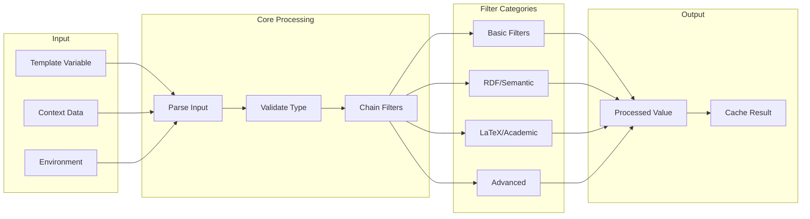

## Filter Categories

### 1. Basic String Filters

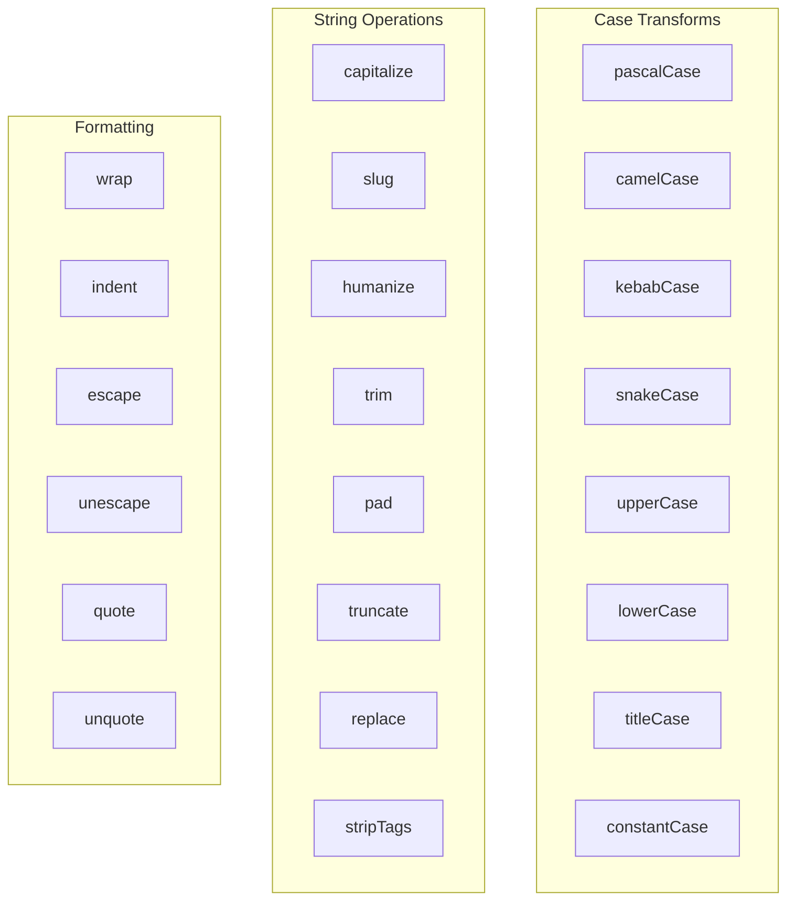

**Usage Examples:**
```jinja2
{{ "hello world" | pascalCase }}           <!-- HelloWorld -->
{{ "some-long-text" | kebabCase }}         <!-- some-long-text -->
{{ "user_name" | humanize }}               <!-- User Name -->
{{ "  spaced  " | trim }}                  <!-- spaced -->
{{ "text" | pad(10, "0") }}                <!-- 000text000 -->
```

### 2. Date & Time Filters

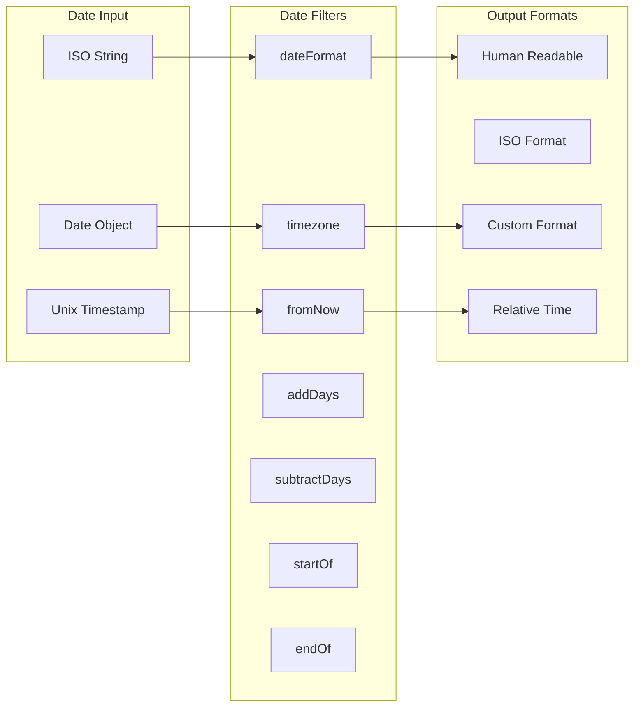

**Usage Examples:**
```jinja2
{{ "2023-12-25" | dateFormat("MMMM Do, YYYY") }}     <!-- December 25th, 2023 -->
{{ "2023-01-01" | fromNow }}                         <!-- 10 months ago -->
{{ date | timezone("America/New_York") }}            <!-- Eastern time -->
{{ date | addDays(7) | dateFormat("YYYY-MM-DD") }}   <!-- Add week -->
```

### 3. Collection Filters

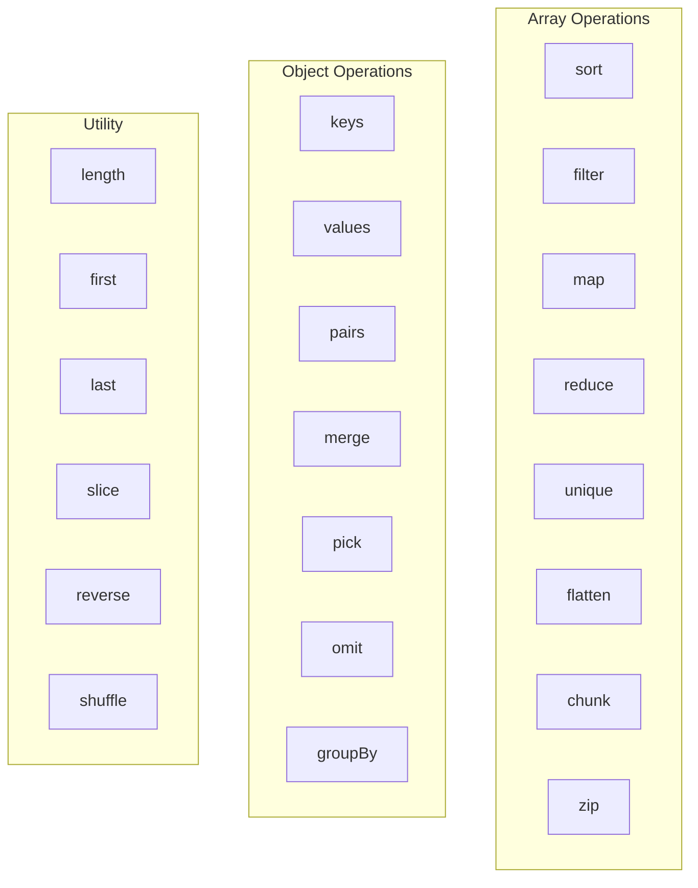

**Usage Examples:**
```jinja2
{{ users | sort('name') }}                          <!-- Sort by name -->
{{ items | filter('active') }}                      <!-- Filter active -->
{{ numbers | map('multiply', 2) }}                  <!-- Double all -->
{{ data | groupBy('category') }}                    <!-- Group by field -->
{{ array | unique | sort }}                         <!-- Chain operations -->
```

### 4. RDF/Semantic Filters

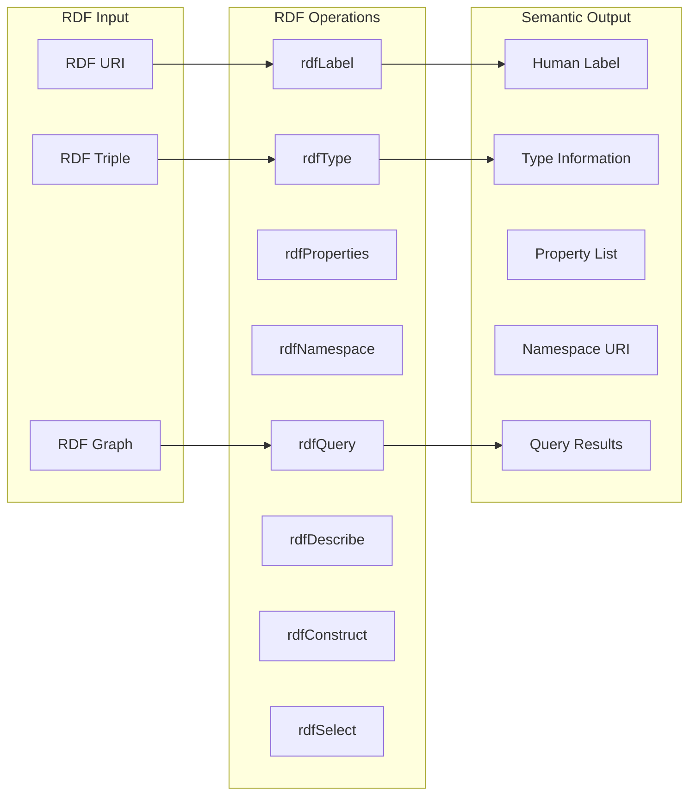

**Usage Examples:**
```jinja2
{{ "http://schema.org/Person" | rdfLabel }}         <!-- Person -->
{{ uri | rdfType }}                                 <!-- Class type -->
{{ resource | rdfProperties }}                      <!-- Property list -->
{{ graph | rdfQuery("SELECT ?label WHERE { ?s rdfs:label ?label }") }}
```

### 5. LaTeX/Academic Filters

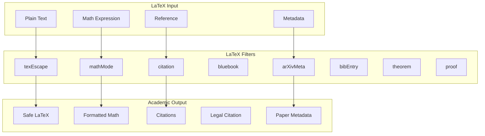

**Usage Examples:**
```jinja2
{{ "Special & chars" | texEscape }}                 <!-- Special \& chars -->
{{ "x^2 + y^2 = z^2" | mathMode }}                  <!-- $x^2 + y^2 = z^2$ -->
{{ paper | citation("apa") }}                       <!-- APA citation -->
{{ case | bluebook }}                               <!-- Legal citation -->
{{ arxivId | arXivMeta }}                           <!-- Paper metadata -->
```

## Filter Chaining Patterns

### 1. Linear Chaining

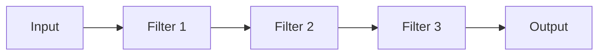

```jinja2
{{ "hello_world_example" | camelCase | capitalize | quote }}
<!-- "HelloWorldExample" -->
```

### 2. Conditional Chaining

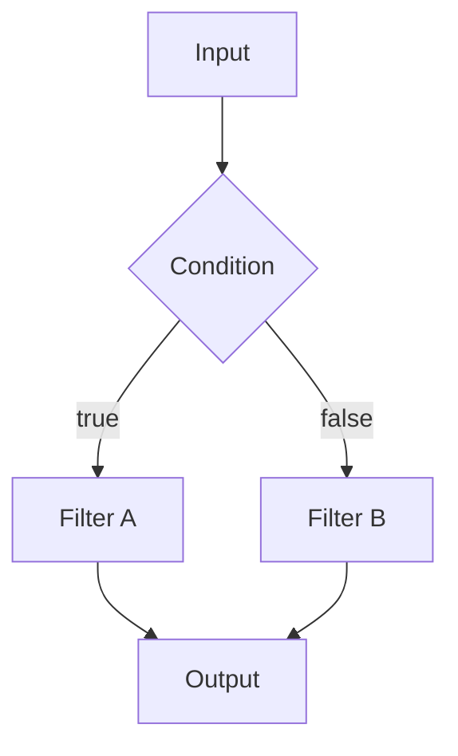

```jinja2
{{ value | (isString ? 'capitalize' : 'toString') | trim }}
```

### 3. Branching & Merging

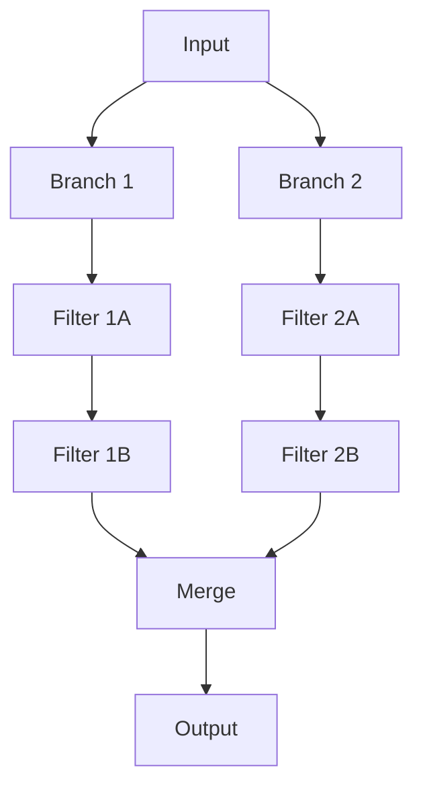

```jinja2
{{ {
  name: person.name | capitalize,
  slug: person.name | slug,
  label: person.name | rdfLabel
} }}
```

## Advanced Composition Patterns

### 1. Filter Factories

```javascript
// Custom filter with parameters
function createFormatter(type, options) {
  return function(value) {
    switch(type) {
      case 'academic':
        return value | citation(options.style) | texEscape;
      case 'web':
        return value | slug | lowercase;
      case 'semantic':
        return value | rdfLabel | humanize;
    }
  };
}
```

### 2. Pipeline Templates

```jinja2
<!-- Define reusable pipeline -->


<!-- Apply pipeline -->
{{ paper | apply(academicPipeline) }}
```

### 3. Context-Aware Filtering

```jinja2
<!-- Different processing based on output format -->

  {{ content | texEscape | mathMode }}

  {{ content | escape | markdown }}

  {{ content | rdfSerialize("turtle") }}

```

## Filter Performance Optimization

### 1. Caching Strategy

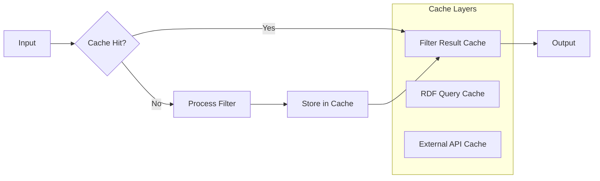

### 2. Lazy Evaluation

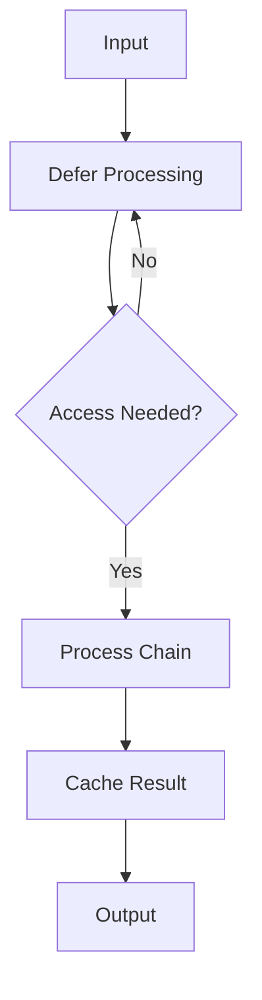

## Error Handling Pipeline

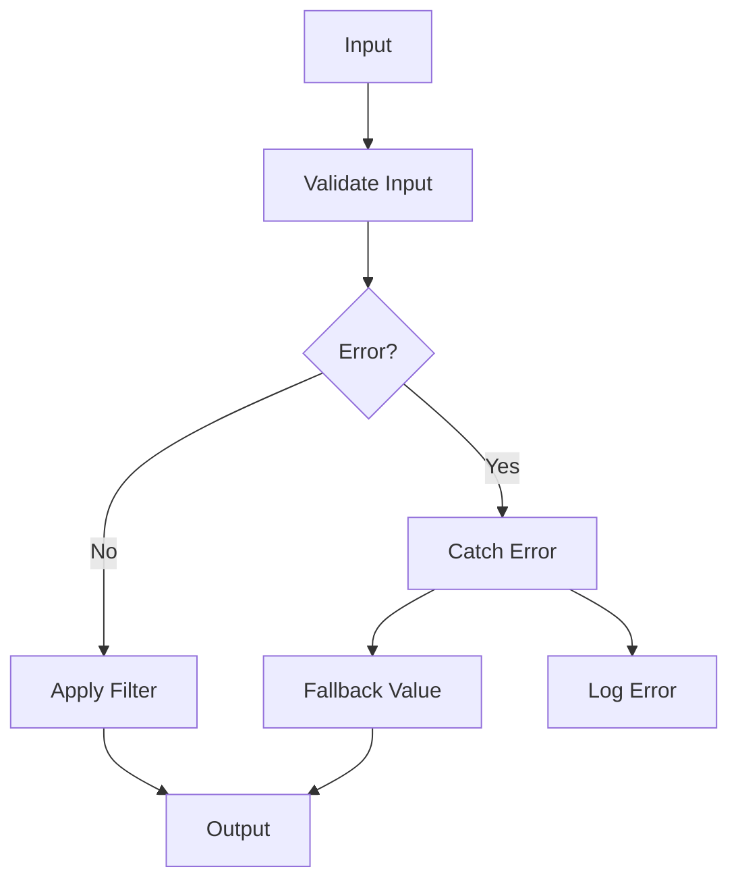

**Error Handling Examples:**
```jinja2
{{ value | safe('camelCase') | default('defaultValue') }}
{{ date | try('dateFormat', 'YYYY-MM-DD') | fallback('Invalid Date') }}
```

## Filter Extension Points

### 1. Custom Filter Registration

```javascript
// Register custom filter
unjucks.addFilter('customFormat', function(value, format) {
  // Implementation
  return processed;
});
```

### 2. Filter Middleware

```javascript
// Filter middleware for logging
unjucks.use('filterLogger', function(filterName, input, output) {
  console.log(`Filter ${filterName}: ${input} -> ${output}`);
});
```

### 3. Plugin Architecture

```javascript
// RDF plugin
const rdfPlugin = {
  filters: ['rdfLabel', 'rdfType', 'rdfQuery'],
  setup(unjucks) {
    // Register RDF-specific filters
  }
};

unjucks.use(rdfPlugin);
```

## Best Practices

1. **Chain Order Matters**: Apply type-specific filters before generic ones
2. **Cache Expensive Operations**: RDF queries, external API calls
3. **Validate Input Types**: Ensure filters receive expected data types
4. **Use Fallbacks**: Provide default values for failed filter operations
5. **Compose Thoughtfully**: Break complex operations into simple, testable filters
6. **Document Chains**: Comment complex filter chains for maintainability

The filter pipeline provides a powerful, extensible system for data transformation that scales from simple string formatting to complex semantic and academic processing workflows.